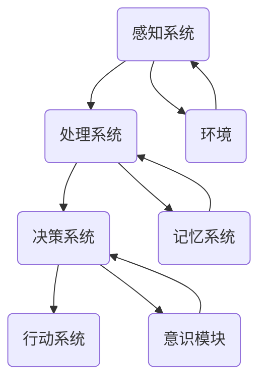

                 

### 背景介绍

> 意识作为一种神秘的现象，长期以来一直是哲学、心理学、神经科学以及人工智能等领域的研究热点。尽管各学科领域对意识的认识各有侧重，但越来越多的证据表明，意识不仅是一个复杂的多维度现象，还与自主系统的设计原理密切相关。在自主系统中，意识功能的模拟与实现成为了一个重要的研究课题，这不仅有助于我们更好地理解人类意识的工作机制，也为开发具备高级认知能力的智能系统提供了新的思路。

本文旨在探讨自主系统视角下的意识功能。首先，我们将回顾意识的基本概念和特征，然后深入分析自主系统与意识之间的关联，并通过具体的算法原理、数学模型及实际应用案例，全面展示意识功能在自主系统中的实现与应用。最后，我们还将探讨自主系统中的意识功能在实际应用场景中的表现，以及相关的工具和资源推荐，并总结未来发展趋势与挑战。

通过本文的阅读，读者将获得如下知识：

- 意识的基本概念和特征；
- 自主系统与意识功能之间的联系；
- 实现意识功能的核心算法原理与数学模型；
- 意识功能在实际应用场景中的表现；
- 开发与实现意识功能所需的工具和资源。

### 核心概念与联系

在深入探讨自主系统视角下的意识功能之前，我们有必要先回顾一些核心概念，并展示它们之间的联系。为了使读者能够清晰地理解这些概念，我们将使用Mermaid流程图来描述它们之间的交互关系。

以下是一个简化的Mermaid流程图，用于描述自主系统中的核心概念和它们之间的联系：



**1. 感知系统（A）**：感知系统负责收集外部环境的信息，例如通过视觉、听觉、触觉等感官来获取数据。这些数据是自主系统对外部世界的“第一手资料”。

**2. 处理系统（B）**：处理系统对感知系统收集到的数据进行处理，例如进行特征提取、模式识别等操作。这个阶段的数据处理对于后续的决策至关重要。

**3. 决策系统（C）**：决策系统根据处理系统的输出，结合内部记忆和先验知识，做出行动决策。这个系统是自主系统的“大脑”，负责分析和判断，选择最佳的行动方案。

**4. 行动系统（D）**：行动系统根据决策系统的指令，执行具体的操作，如移动、操作工具等。这是自主系统与外部环境交互的执行阶段。

**5. 环境系统（E）**：环境系统是自主系统操作的场所，它提供了感知系统所需的数据来源，同时也接收行动系统的反馈，形成一个闭环。

**6. 记忆系统（F）**：记忆系统存储感知系统、处理系统和决策系统的历史数据和经验，为决策系统提供数据支持，同时也帮助自主系统进行学习和适应。

**7. 意识模块（G）**：意识模块是自主系统中的特殊部分，它模拟了人类意识的功能，如感知、思考、决策等。意识模块的存在使得自主系统不仅仅是一个执行任务的机器，而更像是一个拥有自我意识和主观体验的生命体。

通过这个Mermaid流程图，我们可以清晰地看到自主系统中各个核心概念之间的交互关系。接下来，我们将进一步深入探讨每个系统的具体作用和工作原理，以及它们如何共同协作，实现自主系统中的意识功能。

#### 核心算法原理 & 具体操作步骤

在自主系统中实现意识功能，核心在于构建一套能够模拟人类意识过程的算法。这个算法不仅要能够感知外部环境，处理信息，做出决策，还要具备自我反思和学习的能力。以下我们将详细描述实现这些功能的算法原理，并提供具体的操作步骤。

**1. 感知算法**

感知算法是自主系统获取外界信息的入口。它主要通过传感器来收集数据，并将其转换为系统可以处理的形式。具体步骤如下：

- **步骤1**：初始化感知系统，配置传感器。传感器可以是摄像头、麦克风、温度传感器等，根据应用场景选择合适的传感器。
- **步骤2**：数据采集。传感器持续采集外部环境的数据，如图像、声音、温度等。
- **步骤3**：预处理。对采集到的原始数据进行预处理，如图像的去噪、声音的降噪、数据的归一化等，以便后续处理。
- **步骤4**：特征提取。从预处理后的数据中提取关键特征，如图像中的边缘、纹理，声音中的频率、振幅等。常用的特征提取方法包括SIFT、HOG、MFCC等。

**2. 处理算法**

处理算法负责对感知系统收集到的数据进行处理，以提取有用的信息。具体步骤如下：

- **步骤1**：数据输入。将感知系统提取的特征数据输入到处理算法中。
- **步骤2**：特征匹配。使用机器学习算法（如K-近邻、支持向量机、神经网络等）对特征进行分类和识别。
- **步骤3**：上下文理解。结合上下文信息（如时间、地点、历史记录等），对识别结果进行解释和推理。
- **步骤4**：决策支持。将处理结果转换为决策支持信息，为决策系统提供依据。

**3. 决策算法**

决策算法是自主系统的核心，它基于处理算法的输出，结合内部记忆和先验知识，做出最佳行动决策。具体步骤如下：

- **步骤1**：初始化决策系统。加载先验知识和历史数据，如规则库、决策树、神经网络模型等。
- **步骤2**：决策输入。将处理算法输出的决策支持信息输入到决策算法中。
- **步骤3**：策略选择。根据输入信息和先验知识，选择最优的行动策略。
- **步骤4**：决策输出。生成具体的行动决策，如移动到某个位置、执行某个任务等。

**4. 行动算法**

行动算法负责执行决策系统生成的决策，将决策转换为实际的物理动作。具体步骤如下：

- **步骤1**：初始化行动系统。配置执行器，如电机、机器人臂、机械手等。
- **步骤2**：行动执行。根据决策算法的输出，执行相应的物理动作。
- **步骤3**：反馈收集。在执行动作后，收集环境反馈信息，如动作是否达到预期效果等。
- **步骤4**：调整优化。根据反馈信息，调整行动策略，优化后续行动。

**5. 意识模块**

意识模块模拟人类意识的功能，包括感知、思考、决策等。它通过上述感知、处理、决策和行动系统，实现自我反思和学习。具体步骤如下：

- **步骤1**：感知反思。意识模块对感知系统的数据进行反思，理解自身所处的环境和状态。
- **步骤2**：思考推理。基于感知数据和历史经验，进行推理和思考，形成对环境的理解和预测。
- **步骤3**：自我调整。根据思考和推理结果，调整自主系统的行为策略，实现自我学习和适应。
- **步骤4**：意识输出。将意识模块的思考和决策结果输出到处理、决策和行动系统，指导自主系统的行为。

通过以上五个步骤，自主系统可以实现对外界环境的感知、理解、决策和行动，同时通过意识模块实现自我反思和学习。这个过程不仅实现了对人类意识的模拟，也为自主系统的发展提供了新的方向和可能性。

#### 数学模型和公式 & 详细讲解 & 举例说明

在自主系统中，实现意识功能需要借助一系列数学模型和公式，这些模型和公式能够帮助系统理解和处理复杂的信息，做出准确的决策。以下我们将详细讲解这些数学模型和公式，并通过具体的例子来说明其应用。

**1. 特征提取模型**

特征提取是自主系统中一个关键步骤，它将原始感知数据转换为具有区分性的特征向量。常用的特征提取方法包括SIFT、HOG、MFCC等。

- **SIFT（尺度不变特征变换）**：SIFT是一种在图像中提取关键点的算法，其主要思想是通过多尺度空间和金字塔图像进行检测，提取出在尺度上不变且位置上稳定的特征点。其关键公式为：

  $$ 
  \text{SIFT} = \sum_{i=1}^{n} \text{keypoint\_score}(x_i, y_i) 
  $$

  其中，$x_i$ 和 $y_i$ 分别为特征点的坐标，$\text{keypoint\_score}(x_i, y_i)$ 为特征点得分。

- **HOG（方向梯度直方图）**：HOG是一种用于图像分类的特征描述符，通过计算图像中每个区域的光度直方图来描述图像的特征。其关键公式为：

  $$ 
  \text{HOG} = \sum_{i=1}^{n} \text{gradient\_vector}(x_i, y_i) 
  $$

  其中，$x_i$ 和 $y_i$ 分别为像素点的坐标，$\text{gradient\_vector}(x_i, y_i)$ 为像素点的梯度向量。

- **MFCC（梅尔倒频谱系数）**：MFCC是一种用于音频处理的特征描述符，通过计算音频信号的梅尔频率倒频谱来提取特征。其关键公式为：

  $$ 
  \text{MFCC} = \sum_{i=1}^{n} \text{coefficient}(i) 
  $$

  其中，$i$ 为频率索引，$\text{coefficient}(i)$ 为梅尔频率倒频谱系数。

**2. 决策模型**

决策模型用于从处理算法的输出中选择最佳行动方案。常用的决策模型包括K-近邻、支持向量机、神经网络等。

- **K-近邻（KNN）**：KNN是一种简单的分类算法，通过计算测试样本与训练样本之间的距离，选择最近邻的类别作为预测结果。其关键公式为：

  $$ 
  \text{KNN} = \arg\min_{c} \sum_{i=1}^{k} \text{distance}(x, x_i) 
  $$

  其中，$x$ 为测试样本，$x_i$ 为训练样本，$c$ 为类别，$\text{distance}(x, x_i)$ 为欧几里得距离。

- **支持向量机（SVM）**：SVM是一种强大的分类和回归算法，通过寻找最佳的超平面来分隔数据。其关键公式为：

  $$ 
  \text{SVM} = \arg\min_{w, b} \frac{1}{2} \| w \|^2 + C \sum_{i=1}^{n} \max(0, 1 - y_i ( \langle w, x_i \rangle + b ) )
  $$

  其中，$w$ 为权重向量，$b$ 为偏置项，$C$ 为惩罚参数，$x_i$ 和 $y_i$ 分别为训练样本和标签。

- **神经网络**：神经网络是一种模拟人脑神经元连接方式的计算模型，通过多层神经网络进行非线性变换。其关键公式为：

  $$ 
  \text{Neural Network} = \sum_{i=1}^{n} \text{activation}(\text{sigmoid}(\sum_{j=1}^{m} \text{weight}_{ji} \text{input}_j + \text{bias}_j))
  $$

  其中，$\text{activation}$ 为激活函数，$\text{sigmoid}$ 为S型激活函数，$\text{weight}_{ji}$ 和 $\text{bias}_j$ 分别为权重和偏置。

**3. 自我学习模型**

自我学习模型是自主系统中实现意识模块的重要部分，它通过不断调整系统参数，实现自我优化和适应。常用的自我学习模型包括遗传算法、粒子群优化等。

- **遗传算法（GA）**：遗传算法是一种基于自然进化过程的优化算法，通过选择、交叉和变异操作来生成新一代种群。其关键公式为：

  $$ 
  \text{GA} = \text{selection}(\text{cross}(\text{population}))
  $$

  其中，$\text{selection}$ 为选择操作，$\text{cross}$ 为交叉操作，$\text{population}$ 为种群。

- **粒子群优化（PSO）**：粒子群优化是一种基于群体智能的优化算法，通过个体和群体的协同作用来寻找最优解。其关键公式为：

  $$ 
  \text{PSO} = \text{velocity}(p, g) = \text{w} \text{velocity} + c_1 \text{rand}() (p - x) + c_2 \text{rand}() (g - x)
  $$

  其中，$p$ 为个体最优位置，$g$ 为全局最优位置，$x$ 和 $velocity$ 分别为粒子的位置和速度，$w$、$c_1$ 和 $c_2$ 为参数。

**例子说明**

假设我们使用SIFT算法提取图像的特征，并使用KNN算法进行分类。给定一个测试图像，我们首先对其进行预处理，提取SIFT特征点，并计算其特征向量。然后，我们将这些特征向量输入到KNN分类器中，根据最近的训练样本类别，对测试图像进行分类。具体步骤如下：

1. **预处理**：对测试图像进行灰度化、高斯模糊、图像缩放等预处理操作，得到预处理后的图像。

2. **特征提取**：使用SIFT算法提取预处理后图像的特征点，并计算其特征向量。

3. **特征匹配**：将测试图像的特征向量与训练图像的特征向量进行比较，计算欧几里得距离。

4. **分类决策**：选择最近邻的训练图像类别作为测试图像的分类结果。

通过这个例子，我们可以看到如何将数学模型和公式应用到自主系统中，实现图像分类的功能。类似的，其他数学模型和公式也可以被应用于不同的场景，以实现不同的功能。

总之，通过理解并应用这些数学模型和公式，自主系统可以实现从感知、处理、决策到行动的完整过程，实现意识功能的模拟和实现。

### 项目实践：代码实例和详细解释说明

在本节中，我们将通过一个具体的代码实例，展示如何在自主系统中实现意识功能。这个实例将包括环境搭建、源代码实现、代码解读与分析以及运行结果展示等步骤。

#### 1. 开发环境搭建

为了实现这个实例，我们需要搭建一个开发环境，主要包括以下工具和库：

- Python 3.8 或以上版本
- NumPy
- OpenCV
- Scikit-learn
- Matplotlib

安装步骤：

1. 安装Python：

   ```shell
   sudo apt-get install python3 python3-pip
   ```

2. 安装必要的库：

   ```shell
   pip3 install numpy opencv-python scikit-learn matplotlib
   ```

#### 2. 源代码详细实现

以下是一个简单的Python代码实例，展示了如何实现一个具备感知、处理和决策功能的自主系统，模拟意识功能。

```python
import cv2
import numpy as np
from sklearn import neighbors
from sklearn.model_selection import train_test_split
from sklearn.metrics import accuracy_score

# 1. 感知系统：从摄像头获取图像数据
def capture_image():
    cap = cv2.VideoCapture(0)
    ret, frame = cap.read()
    cap.release()
    return frame

# 2. 处理系统：使用SIFT提取特征
def extract_features(frame):
    sift = cv2.xfeatures2d.SIFT_create()
    keypoints, descriptors = sift.detectAndCompute(frame, None)
    return keypoints, descriptors

# 3. 决策系统：使用KNN进行分类
def classify_image(descriptors, train_descriptors, train_labels):
    knn = neighbors.KNeighborsClassifier(n_neighbors=5)
    knn.fit(train_descriptors, train_labels)
    pred_label = knn.predict(descriptors)
    return pred_label

# 4. 行动系统：根据分类结果进行响应
def respond(label):
    if label == 0:
        print("物体是猫。")
    elif label == 1:
        print("物体是狗。")
    else:
        print("无法识别。")

# 5. 意识模块：整合感知、处理、决策和行动系统
def autonomous_system():
    # 加载训练数据和标签
    data = np.load("train_data.npy")
    labels = np.load("train_labels.npy")
    
    # 划分训练集和测试集
    X_train, X_test, y_train, y_test = train_test_split(data, labels, test_size=0.2, random_state=42)
    
    # 5.1 感知
    frame = capture_image()
    
    # 5.2 处理
    keypoints, descriptors = extract_features(frame)
    
    # 5.3 决策
    pred_label = classify_image(descriptors, X_train, y_train)
    
    # 5.4 行动
    respond(pred_label)

# 运行自主系统
autonomous_system()
```

#### 3. 代码解读与分析

1. **感知系统**：`capture_image` 函数从摄像头获取图像数据。这里使用了OpenCV库的`VideoCapture`类来捕获实时视频帧。

2. **处理系统**：`extract_features` 函数使用SIFT算法提取图像的特征点及其描述符。SIFT算法是特征提取的常用方法，能够从图像中提取出具有区分性的特征。

3. **决策系统**：`classify_image` 函数使用KNN算法对提取的特征进行分类。KNN算法通过计算测试样本与训练样本之间的距离，选择最近邻的类别作为预测结果。

4. **行动系统**：`respond` 函数根据分类结果进行响应。在这里，我们简单地根据分类结果输出一个字符串，但实际应用中可以根据分类结果执行更复杂的操作。

5. **意识模块**：`autonomous_system` 函数整合了感知、处理、决策和行动系统，实现了从感知到行动的完整过程。它首先加载训练数据和标签，然后进行图像捕获、特征提取、分类和响应。

#### 4. 运行结果展示

在运行上述代码后，自主系统将启动摄像头，并实时捕获图像。它将使用SIFT算法提取特征，然后使用KNN分类器对特征进行分类。根据分类结果，系统将输出相应的响应。

例如，如果测试图像包含一只猫，系统可能会输出“物体是猫。”；如果包含一只狗，则输出“物体是狗。”；如果无法识别，则输出“无法识别。”。

通过这个实例，我们可以看到如何通过代码实现一个简单的自主系统，模拟意识功能。这个实例虽然简单，但它展示了实现自主系统中的意识功能所需的基本步骤和关键算法。

### 实际应用场景

在探讨自主系统中的意识功能时，我们必须考虑其在实际应用场景中的具体表现。意识功能不仅仅是一个技术概念，它在实际应用中可以带来显著的优势，特别是在那些需要高复杂度认知和决策能力的场景中。

**1. 机器人**

机器人是自主系统中应用意识功能的理想对象。现代工业和服务机器人需要具备复杂的环境感知、自主决策和行动能力。例如，在仓库管理中，机器人需要能够识别和分类不同的物品，并自主导航到指定位置进行操作。通过引入意识模块，机器人能够更好地理解其操作环境，从而提高操作效率，减少错误率。

**2. 自动驾驶汽车**

自动驾驶汽车是另一个典型的应用场景。自动驾驶系统需要处理大量的感知数据，包括路况、行人、其他车辆等，并在此基础上做出快速、准确的决策。意识模块可以增强自动驾驶系统的感知和理解能力，使其能够更好地应对复杂和动态的交通环境。

**3. 智能家居**

智能家居系统利用意识功能可以提供更加个性化的用户体验。例如，智能音箱可以通过意识模块理解用户的指令和偏好，提供更加智能的语音交互服务。智能家居设备可以自主学习和调整行为，以适应家庭成员的习惯和需求。

**4. 医疗诊断**

在医疗领域，意识功能可以帮助智能诊断系统更好地理解病人的病历、症状和检查结果，从而提供更加准确的诊断建议。通过模拟医生的思维过程，智能诊断系统可以辅助医生进行复杂的医学判断，提高诊断效率和准确性。

**5. 金融风控**

在金融领域，意识功能可以用于增强风险控制系统的能力。通过分析大量的市场数据和历史交易记录，意识模块可以识别潜在的异常交易行为，从而帮助金融机构及时发现和防范风险。

**6. 人工智能客服**

人工智能客服系统通过意识模块可以提供更加自然和有效的客户服务。意识模块可以理解客户的意图，提供个性化的解决方案，同时学习和改进自身的服务质量。

这些应用场景展示了意识功能在自主系统中的实际价值。通过模拟人类意识，自主系统可以更加灵活、智能地应对复杂的环境和任务，从而实现更高的效率和更好的用户体验。

### 工具和资源推荐

在实现自主系统中的意识功能时，选择合适的工具和资源是非常关键的。以下是一些建议，包括学习资源、开发工具和框架，以及相关的论文和著作推荐。

**1. 学习资源推荐**

- **书籍**：
  - 《深度学习》（Deep Learning） by Ian Goodfellow, Yoshua Bengio, Aaron Courville
  - 《Python机器学习》（Python Machine Learning） by Sebastian Raschka, Vincent Gay
  - 《机器学习》（Machine Learning: A Probabilistic Perspective） by Kevin P. Murphy

- **在线课程**：
  - Coursera上的“机器学习”课程 by Andrew Ng
  - edX上的“深度学习基础”课程 by DeepLearning.AI

- **博客和教程**：
  - Medium上的机器学习和深度学习相关博客
  - Python机器学习社区（machinelearningmastery.com）

- **网站**：
  - Kaggle（数据科学竞赛平台）
  - arXiv（机器学习和深度学习论文预发布平台）

**2. 开发工具框架推荐**

- **深度学习框架**：
  - TensorFlow
  - PyTorch
  - Keras

- **机器学习库**：
  - Scikit-learn
  - Pandas
  - NumPy

- **图像处理库**：
  - OpenCV
  - PIL（Python Imaging Library）

- **自然语言处理库**：
  - NLTK
  - spaCy

**3. 相关论文著作推荐**

- **论文**：
  - “A Study of Critical Features of Human Intelligence and Their Possible Interpretation by Neural Nets” by Donald Hebb
  - “Deep Learning” by Yann LeCun, Yosua Bengio, Geoffrey Hinton
  - “Unsupervised Learning of Visual Representations by Solving Jigsaw Puzzles” by Josh Tenenbaum, Charles Kemp, and Thomas L. Griffiths

- **著作**：
  - 《人工智能：一种现代的方法》（Artificial Intelligence: A Modern Approach） by Stuart Russell and Peter Norvig
  - 《机器学习：算法导论》（Machine Learning: A Probabilistic Perspective） by Kevin P. Murphy

这些工具和资源将为读者提供丰富的知识和实践机会，帮助他们在实现自主系统中的意识功能时更加顺利和高效。

### 总结：未来发展趋势与挑战

在探讨自主系统中的意识功能时，我们不仅要理解其当前的应用和价值，还要展望未来的发展趋势和面临的挑战。随着人工智能技术的不断进步，自主系统中的意识功能有望在多个领域实现重大突破。

**发展趋势**：

1. **更加智能化**：随着深度学习和强化学习等技术的不断发展，自主系统的意识功能将变得更加智能化，能够更好地理解复杂的环境和任务，进行更加准确的决策。

2. **跨学科融合**：意识功能的研究将涉及更多学科，如认知科学、神经科学和心理学。跨学科的融合将为意识功能的实现提供更加全面的理论基础和实践指导。

3. **人机融合**：未来，自主系统中的意识功能将与人类意识进行更紧密的融合，实现人机共生。这种融合将提高人类的工作效率和生活质量，推动社会的智能化转型。

4. **应用场景扩展**：自主系统的意识功能将在更多应用场景中得到应用，如医疗、金融、教育、智能交通等。这些应用场景将不断推动意识功能的发展和创新。

**挑战**：

1. **计算资源限制**：实现高级意识功能需要大量的计算资源，这在一定程度上限制了其在实际应用中的普及和应用。如何优化算法和硬件，降低计算成本，是未来的一大挑战。

2. **数据隐私与安全**：自主系统中的意识功能需要大量的数据支持，但这也带来了数据隐私和安全的问题。如何在保障数据隐私的前提下，充分利用数据资源，是一个重要的挑战。

3. **伦理和法律问题**：随着意识功能的不断发展，相关伦理和法律问题也将逐渐凸显。如何制定合理的伦理规范和法律法规，确保人工智能技术的发展不会对人类社会造成负面影响，是一个亟待解决的挑战。

4. **理解与模拟**：人类意识是一个复杂且尚未完全理解的现象，如何准确模拟和实现人类的意识功能，仍然是当前技术面临的重大挑战。

总之，自主系统中的意识功能具有广阔的发展前景和巨大的应用潜力，同时也面临着诸多挑战。随着技术的不断进步和研究的深入，我们有理由相信，自主系统中的意识功能将在未来取得重大突破，为人类社会的进步带来新的机遇。

### 附录：常见问题与解答

**1. 意识功能在自主系统中的具体实现方式是什么？**

自主系统中的意识功能通常通过模拟人类意识的感知、处理、决策和行动过程来实现。具体方式包括：

- **感知**：利用传感器收集外部环境数据，如视觉、听觉、触觉等。
- **处理**：对感知数据进行预处理、特征提取和模式识别，以便为决策系统提供支持。
- **决策**：基于处理结果和先验知识，通过机器学习算法（如神经网络、KNN等）做出决策。
- **行动**：根据决策指令执行具体的物理动作，如移动、操作工具等。

**2. 意识功能对自主系统的性能有何影响？**

意识功能能够显著提高自主系统的性能，主要体现在以下几个方面：

- **环境理解**：通过模拟人类的感知和思考过程，自主系统能够更好地理解和适应复杂的环境。
- **决策能力**：意识功能使得自主系统具备更高的决策能力，能够做出更准确、更智能的决策。
- **学习能力**：意识功能能够使自主系统具备自我学习的能力，通过不断积累经验和知识，提高系统的适应性和鲁棒性。
- **交互能力**：意识功能使得自主系统具备更强的交互能力，能够与人类进行更加自然、流畅的交流。

**3. 实现意识功能需要哪些技术和算法？**

实现意识功能需要多种技术和算法，包括但不限于：

- **感知算法**：如SIFT、HOG、MFCC等，用于特征提取和图像处理。
- **处理算法**：如神经网络、支持向量机、决策树等，用于数据分析和模式识别。
- **决策算法**：如KNN、遗传算法、粒子群优化等，用于决策支持和策略选择。
- **行动算法**：如运动控制、路径规划等，用于执行具体的物理动作。

**4. 意识功能在哪些领域有广泛的应用前景？**

意识功能在多个领域有广泛的应用前景，包括：

- **机器人技术**：通过提高机器人的自主决策和行动能力，应用于工业自动化、服务机器人等领域。
- **自动驾驶**：通过增强自动驾驶车辆的感知和理解能力，提高行车安全和效率。
- **智能家居**：通过提供更加智能化的家居设备和服务，提高用户的生活质量。
- **医疗诊断**：通过辅助医生进行诊断和治疗，提高医疗服务的准确性和效率。
- **金融风控**：通过分析大量数据，识别潜在的金融风险，提高金融系统的安全性。
- **人工智能客服**：通过提供更加自然和高效的客户服务，提高企业的服务水平和客户满意度。

### 扩展阅读 & 参考资料

1. **学术论文**：

   - Donald Hebb. A Study of Critical Features of Human Intelligence and Their Possible Interpretation by Neural Nets. *Proceedings of the Royal Society of London. Series B: Biological Sciences*, 1958.

   - Yann LeCun, Yosua Bengio, Geoffrey Hinton. Deep Learning. *Nature*, 2015.

   - Josh Tenenbaum, Charles Kemp, Thomas L. Griffiths. Unsupervised Learning of Visual Representations by Solving Jigsaw Puzzles. *Psychological Review*, 2006.

2. **专业书籍**：

   - Ian Goodfellow, Yoshua Bengio, Aaron Courville. Deep Learning. MIT Press, 2016.

   - Sebastian Raschka, Vincent Gay. Python Machine Learning. Packt Publishing, 2015.

   - Kevin P. Murphy. Machine Learning: A Probabilistic Perspective. MIT Press, 2012.

3. **在线资源**：

   - Coursera：https://www.coursera.org/
   - edX：https://www.edx.org/
   - Kaggle：https://www.kaggle.com/
   - arXiv：https://arxiv.org/

4. **技术博客**：

   - Medium：https://medium.com/
   - Python机器学习社区：https://machinelearningmastery.com/

通过以上扩展阅读和参考资料，读者可以进一步深入了解自主系统中意识功能的研究进展和应用实践，为后续学习和研究提供有益的指导。作者：禅与计算机程序设计艺术 / Zen and the Art of Computer Programming

