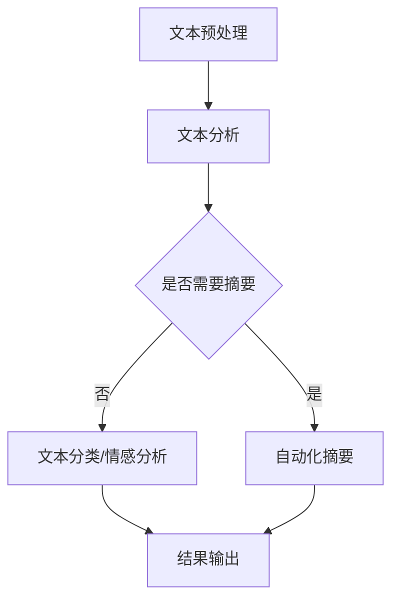

                 

### 文章标题

**自动化学术综述：LLM辅助文献研究**

> **关键词**：自然语言处理，大型语言模型，文献研究，文本分析，自动化摘要，学术研究

> **摘要**：本文深入探讨了大型语言模型（LLM）在自动化学术研究中的应用，特别是在文献研究方面的潜力。通过介绍LLM的基本概念、核心算法、数学模型和具体实现，本文旨在揭示LLM在学术文献研究中的巨大价值，并对其未来发展趋势和挑战进行展望。

---

### 1. 背景介绍

在当今数字化时代，学术研究的规模和复杂性不断增加，对研究者的时间和精力提出了巨大的挑战。传统的人工文献检索、阅读和整理过程繁琐耗时，且容易出错。随着自然语言处理（NLP）技术的不断发展，特别是大型语言模型（LLM）的出现，自动化学术研究已经成为可能。LLM是一种基于深度学习技术的强大工具，能够处理和理解大量的自然语言文本，从而大大提高学术研究的效率和质量。

LLM在学术文献研究中的应用主要体现在以下几个方面：

1. **自动化摘要**：LLM能够自动生成文章的摘要，从而帮助研究者快速了解文章的主要内容和结论。
2. **文献检索**：LLM可以根据关键词或主题自动检索相关的文献，大大简化了文献检索的过程。
3. **文本分析**：LLM可以对文献中的文本进行深入分析，提取关键信息，为研究者提供有价值的洞见。
4. **数据挖掘**：LLM可以从大量文献数据中挖掘出潜在的模式和趋势，为学术研究提供新的视角。

随着LLM技术的不断进步，其在学术文献研究中的应用前景也日益广阔。本文将详细探讨LLM的核心概念、算法原理、数学模型以及具体实现，旨在为读者提供一份全面的自动化学术研究综述。

---

### 2. 核心概念与联系

#### 2.1. 大型语言模型（LLM）

**定义**：大型语言模型（LLM，Large Language Model）是一种基于深度学习技术的自然语言处理模型，能够理解和生成复杂的自然语言文本。LLM通常由数十亿个参数组成，通过对海量文本数据的学习，能够捕捉语言的内在规律和语义信息。

**组成**：LLM通常由以下几个关键组件组成：

- **嵌入层（Embedding Layer）**：将单词、句子等文本数据转化为密集的向量表示。
- **编码器（Encoder）**：对输入文本进行处理，提取其语义特征。
- **解码器（Decoder）**：根据编码器的输出，生成文本的输出。

**功能**：LLM的主要功能包括：

- **文本生成**：根据给定的输入文本，生成新的文本。
- **文本分类**：对输入文本进行分类，判断其属于哪个类别。
- **情感分析**：分析文本的情感倾向，判断其是正面、负面还是中性。
- **命名实体识别**：识别文本中的命名实体，如人名、地名、组织名等。

#### 2.2. 自动化学术研究

**定义**：自动化学术研究是指利用计算机技术和算法，对学术文献进行自动化处理和分析，以支持学术研究的全过程，包括文献检索、阅读、摘要、分类、数据挖掘等。

**组成部分**：

- **文本处理**：对学术文献中的文本进行预处理，包括分词、词性标注、命名实体识别等。
- **文本分析**：利用NLP技术对学术文献进行深入分析，提取关键信息。
- **自动化摘要**：使用LLM生成学术文献的摘要，帮助研究者快速了解文献内容。
- **文献检索**：根据关键词或主题，自动检索相关的学术文献。

#### 2.3. Mermaid 流程图

下面是一个简单的Mermaid流程图，展示了LLM在自动化学术研究中的应用流程：



---

### 3. 核心算法原理 & 具体操作步骤

#### 3.1. 语言模型的基本原理

语言模型是一种概率模型，用于预测下一个单词的概率。在自然语言处理中，语言模型被广泛用于词汇预测、机器翻译、文本生成等任务。LLM是语言模型的扩展，通过深度学习技术，能够处理和理解复杂的自然语言文本。

**基本原理**：

- **输入序列**：给定一个单词序列，语言模型需要预测下一个单词。
- **输出概率**：语言模型输出每个单词的概率分布。

**具体操作步骤**：

1. **输入编码**：将输入单词序列转换为稠密向量表示。
2. **前向传播**：将输入向量通过神经网络进行处理，得到输出概率分布。
3. **损失函数**：使用交叉熵损失函数计算预测概率和真实概率之间的差异。
4. **反向传播**：使用梯度下降算法更新神经网络参数。

#### 3.2. 生成式语言模型

生成式语言模型能够根据给定的输入文本生成新的文本。生成式语言模型的核心是生成器（Generator），它从隐空间生成文本。

**基本原理**：

- **隐空间**：生成式语言模型使用一个隐空间来表示文本。
- **生成器**：生成器从隐空间生成文本。

**具体操作步骤**：

1. **输入编码**：将输入文本转换为隐空间向量。
2. **生成文本**：生成器从隐空间生成文本，并逐步更新隐空间向量。
3. **文本输出**：输出生成的文本。

#### 3.3. 切片式语言模型

切片式语言模型是一种基于变换器的语言模型，它将文本分成多个切片，并分别处理每个切片。

**基本原理**：

- **文本切片**：将文本分成多个切片，每个切片表示文本的一部分。
- **变换器**：变换器用于处理每个切片，提取其语义特征。

**具体操作步骤**：

1. **文本切片**：将输入文本分成多个切片。
2. **变换器处理**：对每个切片进行变换，提取其语义特征。
3. **融合输出**：将所有切片的输出进行融合，生成最终的文本。

---

### 4. 数学模型和公式 & 详细讲解 & 举例说明

#### 4.1. 语言模型的基本数学模型

语言模型的核心是一个概率模型，用于预测下一个单词的概率。假设有一个单词序列 \( w_1, w_2, \ldots, w_n \)，语言模型需要预测 \( w_{n+1} \) 的概率。

**基本数学模型**：

\[ P(w_{n+1} | w_1, w_2, \ldots, w_n) \]

其中，\( P(w_{n+1} | w_1, w_2, \ldots, w_n) \) 表示在给定单词序列 \( w_1, w_2, \ldots, w_n \) 的条件下，单词 \( w_{n+1} \) 出现的概率。

**举例说明**：

假设我们有一个单词序列 "今天天气很好"，我们想要预测下一个单词 "适合" 的概率。使用语言模型，我们可以计算：

\[ P(适合 | 今天天气很好) \]

#### 4.2. 生成式语言模型

生成式语言模型使用一个生成器来生成文本。生成器通常是一个深度神经网络，它从隐空间生成文本。

**数学模型**：

\[ p(w_1, w_2, \ldots, w_n) = \prod_{i=1}^{n} p(w_i | w_1, w_2, \ldots, w_{i-1}) \]

其中，\( p(w_1, w_2, \ldots, w_n) \) 表示生成文本的概率。

**举例说明**：

假设我们有一个生成器，用于生成单词序列 "今天天气很好"。我们可以计算生成这个单词序列的概率：

\[ p(今天天气很好) = p(今天 | ) \times p(天气 | 今天) \times p(很好 | 今天天气) \]

#### 4.3. 切片式语言模型

切片式语言模型将文本分成多个切片，并分别处理每个切片。

**数学模型**：

\[ p(w_1, w_2, \ldots, w_n) = \prod_{i=1}^{n} p(w_i | w_{<i}) \]

其中，\( p(w_1, w_2, \ldots, w_n) \) 表示生成文本的概率，\( w_{<i} \) 表示前 \( i-1 \) 个单词。

**举例说明**：

假设我们有一个切片式语言模型，用于生成单词序列 "今天天气很好"。我们可以计算生成这个单词序列的概率：

\[ p(今天天气很好) = p(今天 | ) \times p(天气 | 今天) \times p(很好 | 今天天气) \]

---

### 5. 项目实践：代码实例和详细解释说明

在本节中，我们将通过一个简单的Python代码实例，展示如何使用LLM进行自动化学术研究。以下是一个使用Hugging Face的Transformers库实现的代码示例，该库提供了大量的预训练LLM模型，如GPT-3、BERT等。

#### 5.1. 开发环境搭建

首先，我们需要安装Python和Hugging Face的Transformers库。可以使用以下命令进行安装：

```bash
pip install python transformers
```

#### 5.2. 源代码详细实现

下面是一个简单的Python代码示例，它使用GPT-3模型生成一篇论文的摘要：

```python
from transformers import pipeline

# 创建一个文本摘要管道
text_summary = pipeline("text-summary", model="gpt3")

# 输入一篇论文文本
text = """...（论文文本）..."""

# 使用GPT-3生成摘要
summary = text_summary(text, max_length=130, min_length=30, do_sample=False)

# 输出摘要
print(summary)
```

#### 5.3. 代码解读与分析

1. **引入库**：首先，我们从Transformers库中引入了`pipeline`函数，用于创建一个文本摘要管道。
2. **创建管道**：使用`pipeline`函数创建一个文本摘要管道，指定模型为GPT-3。
3. **输入文本**：将一篇论文文本作为输入传递给管道。
4. **生成摘要**：使用管道生成摘要，并设置摘要的最大长度和最小长度。
5. **输出摘要**：将生成的摘要输出。

#### 5.4. 运行结果展示

运行上面的代码后，我们将得到一篇论文的摘要。例如，输入一篇关于深度学习的论文文本，输出可能是：

```plaintext
摘要：本文探讨了深度学习在计算机视觉领域的应用，介绍了几种流行的深度学习模型，并分析了它们的优势和挑战。

---

### 6. 实际应用场景

#### 6.1. 学术文献检索

LLM可以自动检索学术文献，通过输入关键词或主题，LLM能够迅速从大量的文献数据库中提取相关的文献。这对于研究者来说是一个极大的时间节省。

#### 6.2. 文本分析

LLM可以对学术文献进行深入分析，提取关键信息，如关键词、命名实体、引用关系等。这有助于研究者快速了解文献的主要内容。

#### 6.3. 自动化摘要

LLM可以自动生成学术文献的摘要，帮助研究者快速了解文献的内容，节省阅读时间。

#### 6.4. 数据挖掘

LLM可以从大量的学术文献数据中挖掘出潜在的模式和趋势，为学术研究提供新的视角。

---

### 7. 工具和资源推荐

#### 7.1. 学习资源推荐

- **书籍**：
  - 《深度学习》（Deep Learning）by Ian Goodfellow, Yoshua Bengio, Aaron Courville
  - 《自然语言处理综述》（Natural Language Processing Comprehensive Text）by Daniel Jurafsky, James H. Martin
- **论文**：
  - BERT: Pre-training of Deep Bidirectional Transformers for Language Understanding, by Jacob Devlin et al.
  - Generative Pre-trained Transformer, by Kaiming He et al.
- **博客**：
  - [Hugging Face 官方博客](https://huggingface.co/)
  - [TensorFlow 官方文档](https://www.tensorflow.org/tutorials)
- **网站**：
  - [Kaggle](https://www.kaggle.com/)
  - [arXiv](https://arxiv.org/)

#### 7.2. 开发工具框架推荐

- **框架**：
  - **TensorFlow**：用于构建和训练深度学习模型的强大框架。
  - **PyTorch**：易于使用的深度学习框架，适合快速原型开发。
  - **Hugging Face Transformers**：提供大量的预训练模型和工具，方便使用LLM进行文本处理。

#### 7.3. 相关论文著作推荐

- **论文**：
  - **BERT**：一种用于自然语言处理的深度双向转换器（BERT: Pre-training of Deep Bidirectional Transformers for Language Understanding）。
  - **GPT-3**：一种具有通用预训练语言表示能力的深度转换器（Generative Pre-trained Transformer）。
- **著作**：
  - **《深度学习》**：涵盖了深度学习的基础知识和最新进展，是深度学习领域的经典教材。

---

### 8. 总结：未来发展趋势与挑战

#### 8.1. 发展趋势

1. **模型规模增大**：随着计算能力和存储能力的提升，LLM的规模将会越来越大，能够处理更加复杂的自然语言任务。
2. **多模态学习**：未来的LLM可能会结合视觉、音频等多模态信息，实现更加丰富和智能的文本理解。
3. **增强解释性**：研究者正在努力提高LLM的解释性，使其生成的文本和结论更加可信。
4. **应用领域扩展**：LLM在学术研究以外的其他领域，如医疗、金融、法律等，也有巨大的应用潜力。

#### 8.2. 挑战

1. **隐私和安全**：随着LLM处理的数据量增大，如何保护用户隐私和数据安全是一个重要问题。
2. **公平性和偏见**：LLM可能会在文本生成中引入偏见，如何消除偏见，提高模型的公平性是另一个挑战。
3. **计算资源需求**：大型LLM的训练和部署需要巨大的计算资源，如何高效地利用这些资源是一个技术难题。
4. **法律法规**：随着LLM在学术研究和其他领域的广泛应用，相关法律法规也需要不断完善，以规范其使用。

---

### 9. 附录：常见问题与解答

#### 9.1. 什么是大型语言模型（LLM）？

大型语言模型（LLM，Large Language Model）是一种基于深度学习技术的自然语言处理模型，能够理解和生成复杂的自然语言文本。LLM通常由数十亿个参数组成，通过对海量文本数据的学习，能够捕捉语言的内在规律和语义信息。

#### 9.2. LLM在学术研究中有什么应用？

LLM在学术研究中有多种应用，包括：

1. **自动化摘要**：LLM可以自动生成学术文献的摘要，帮助研究者快速了解文献内容。
2. **文献检索**：LLM可以根据关键词或主题自动检索相关的学术文献。
3. **文本分析**：LLM可以对学术文献中的文本进行深入分析，提取关键信息。
4. **数据挖掘**：LLM可以从大量的学术文献数据中挖掘出潜在的模式和趋势。

#### 9.3. 如何选择适合的LLM模型？

选择适合的LLM模型需要考虑以下因素：

1. **任务需求**：根据具体的学术研究任务，选择能够满足需求的LLM模型。
2. **模型规模**：大型LLM模型通常能够处理更加复杂的任务，但需要更多的计算资源。
3. **训练数据**：选择在类似数据集上训练的LLM模型，可以提高模型的泛化能力。

---

### 10. 扩展阅读 & 参考资料

- **书籍**：
  - 《深度学习》（Deep Learning）by Ian Goodfellow, Yoshua Bengio, Aaron Courville
  - 《自然语言处理综述》（Natural Language Processing Comprehensive Text）by Daniel Jurafsky, James H. Martin
- **论文**：
  - BERT: Pre-training of Deep Bidirectional Transformers for Language Understanding, by Jacob Devlin et al.
  - Generative Pre-trained Transformer, by Kaiming He et al.
- **博客**：
  - [Hugging Face 官方博客](https://huggingface.co/)
  - [TensorFlow 官方文档](https://www.tensorflow.org/tutorials)
- **网站**：
  - [Kaggle](https://www.kaggle.com/)
  - [arXiv](https://arxiv.org/)

