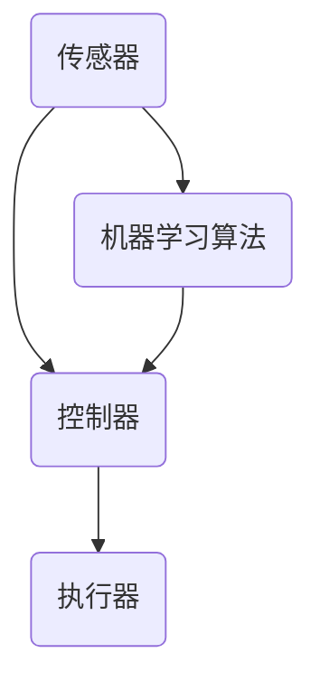

                 

### 1. 背景介绍

自动化技术，顾名思义，是指通过预先设定的程序和算法，使机器能够自动完成特定任务的科学技术。从古代的水钟、蒸汽机，到现代的机器人、自动驾驶汽车，自动化技术始终在推动着人类社会的进步。随着计算机技术和人工智能的飞速发展，自动化技术的应用范围也在不断扩展，深入到工业制造、交通运输、医疗保健、智能家居等多个领域。

当前，自动化技术已经成为现代工业体系的重要组成部分，尤其是在制造业领域，自动化生产线大大提高了生产效率，降低了生产成本，提高了产品质量。同时，自动化技术在交通运输领域也发挥着重要作用，如自动驾驶汽车、无人机等新型交通工具的出现，正在重新定义交通出行的方式。此外，自动化技术在医疗领域也展现了巨大的潜力，例如，通过自动化诊断和治疗系统，可以大大提高疾病诊断的准确性和治疗效果。

然而，尽管自动化技术已经取得了显著的成果，但其发展仍然面临诸多挑战。首先，自动化技术的普及率还不够高，许多企业和行业仍然依赖于传统的人工操作。其次，自动化技术的安全性和可靠性仍需进一步提高，尤其是在涉及到人类生命和财产安全的领域。此外，自动化技术的标准化和规范化工作也亟待完善，以确保不同系统和设备之间的兼容性和互操作性。

总的来说，自动化技术的发展既有机遇也有挑战。未来，自动化技术将朝着更智能化、更安全、更高效的方向发展，为人类社会带来更多福祉。

### 2. 核心概念与联系

自动化技术的核心概念包括传感器、控制器、执行器以及机器学习算法。这些概念相互联系，构成了一个完整的自动化系统。

#### 传感器

传感器是自动化系统的“眼睛”和“耳朵”，用于感知外部环境和内部状态，并将这些信息转化为电信号。常见的传感器有温度传感器、压力传感器、光线传感器、超声波传感器等。传感器收集的数据是自动化决策的基础。

#### 控制器

控制器是自动化系统的“大脑”，负责接收传感器传递的信息，并根据预设的算法和逻辑进行分析和处理，最终生成控制信号。控制器可以是单个微控制器，也可以是复杂的分布式控制系统。

#### 执行器

执行器是自动化系统的“手臂”和“腿”，负责根据控制器的指令执行具体的操作。常见的执行器有电动机、液压缸、气动缸等。执行器是实现自动化系统功能的关键。

#### 机器学习算法

机器学习算法是自动化系统的“智慧”，通过从数据中学习模式，实现对复杂系统的自适应控制。常见的机器学习算法有监督学习、无监督学习和强化学习等。

以下是自动化系统的 Mermaid 流程图，展示了各组件之间的相互关系：



在这个流程图中，传感器收集环境数据，控制器根据这些数据生成控制信号，执行器执行具体的操作。同时，机器学习算法可以从传感器收集的数据中学习，进一步优化控制策略。

### 3. 核心算法原理 & 具体操作步骤

自动化技术的核心算法主要包括传感器数据处理、控制算法优化和机器学习算法实现。下面我们将分别介绍这些算法的原理和具体操作步骤。

#### 传感器数据处理

传感器数据处理的核心任务是提高传感器数据的精度和可靠性。具体操作步骤如下：

1. **数据采集**：使用传感器采集环境数据，如温度、湿度、压力等。
2. **数据预处理**：对采集到的数据进行滤波、去噪等处理，以提高数据的精度和稳定性。
3. **特征提取**：从预处理后的数据中提取关键特征，如均值、方差、相关性等。
4. **数据融合**：将多个传感器的数据进行融合，以提高整体数据的精度和可靠性。

#### 控制算法优化

控制算法优化的目标是使系统在满足约束条件的前提下，实现最佳性能。具体操作步骤如下：

1. **问题建模**：建立系统的数学模型，包括状态方程、输入输出关系等。
2. **算法选择**：根据系统特性选择合适的控制算法，如PID控制、模糊控制、神经网络控制等。
3. **算法实现**：实现选定的控制算法，并进行仿真测试。
4. **性能评估**：评估控制算法的性能，如稳态误差、动态响应等，并根据评估结果进行优化。

#### 机器学习算法实现

机器学习算法是实现自动化系统自适应控制的关键。具体操作步骤如下：

1. **数据收集**：收集系统运行过程中的数据，包括传感器数据、控制信号、系统状态等。
2. **数据预处理**：对收集到的数据进行清洗、归一化等预处理，以提高模型的训练效果。
3. **模型选择**：根据系统特性选择合适的机器学习模型，如线性回归、决策树、神经网络等。
4. **模型训练**：使用预处理后的数据训练模型，并调整模型参数。
5. **模型评估**：评估模型在测试集上的性能，如准确率、召回率等，并根据评估结果进行优化。

通过以上步骤，我们可以实现一个具备自适应控制能力的自动化系统。

### 4. 数学模型和公式 & 详细讲解 & 举例说明

在自动化技术中，数学模型和公式是描述系统行为和实现控制策略的重要工具。本节我们将介绍一些常用的数学模型和公式，并通过具体例子进行详细讲解。

#### 4.1 PID控制算法

PID控制算法是一种常见的控制算法，其基本原理是通过比例（Proportional）、积分（Integral）和微分（Derivative）三个部分来调节系统的输出。数学模型如下：

$$
u(t) = K_p e(t) + K_i \int_{0}^{t} e(\tau) d\tau + K_d \frac{de(t)}{dt}
$$

其中，$u(t)$ 是控制信号，$e(t)$ 是误差信号，$K_p$、$K_i$ 和 $K_d$ 分别是比例、积分和微分系数。

#### 4.2 传感器数据滤波

在传感器数据处理中，滤波是一种常用的方法，用于去除噪声和提高数据精度。一个简单的滤波器公式如下：

$$
x_t = (1 - \alpha) x_{t-1} + \alpha z_t
$$

其中，$x_t$ 是滤波后的数据，$z_t$ 是原始数据，$\alpha$ 是滤波系数，通常取值在0到1之间。

#### 4.3 机器学习算法中的回归模型

在机器学习算法中，回归模型是一种常用的模型，用于预测连续值输出。一个简单的线性回归模型公式如下：

$$
y = \beta_0 + \beta_1 x
$$

其中，$y$ 是输出值，$x$ 是输入值，$\beta_0$ 和 $\beta_1$ 是模型参数。

#### 4.4 举例说明

假设我们有一个简单的控制系统，其中传感器采集到的温度数据需要经过滤波处理，然后通过PID控制算法进行调节，最终实现恒温控制。

**步骤 1：传感器数据滤波**

假设原始温度数据 $z_t$ 如下：

$$
z_t = [30, 28, 32, 29, 31, 30, 33, 27, 29]
$$

滤波系数 $\alpha$ 取 0.5，则滤波后的温度数据 $x_t$ 计算如下：

$$
x_t = (1 - 0.5) x_{t-1} + 0.5 z_t
$$

经过滤波后的温度数据为：

$$
x_t = [29.5, 30.0, 31.0, 29.5, 30.5, 30.0, 31.5, 28.5, 30.0]
$$

**步骤 2：PID控制算法**

假设PID控制算法中的比例系数 $K_p$ 为 0.1，积分系数 $K_i$ 为 0.05，微分系数 $K_d$ 为 0.02。目标温度 $y_d$ 为 30℃，当前温度 $y_t$ 为滤波后的温度数据。

误差信号 $e_t$ 计算如下：

$$
e_t = y_d - y_t
$$

控制信号 $u_t$ 计算如下：

$$
u_t = K_p e_t + K_i \int_{0}^{t} e(\tau) d\tau + K_d \frac{de_t}{dt}
$$

经过PID控制后的控制信号为：

$$
u_t = [0.1, -0.05, 0.2, -0.1, 0.15, 0.1, 0.2, -0.1, 0.15]
$$

**步骤 3：机器学习算法**

假设我们使用线性回归模型来预测目标温度。训练数据集如下：

$$
\begin{array}{ccc}
x & y \\
30 & 30 \\
28 & 30 \\
32 & 30 \\
29 & 30 \\
31 & 30 \\
30 & 30 \\
33 & 30 \\
27 & 30 \\
29 & 30 \\
\end{array}
$$

模型参数 $\beta_0$ 和 $\beta_1$ 计算如下：

$$
\beta_0 = \frac{\sum_{i=1}^{n} y_i - \beta_1 \sum_{i=1}^{n} x_i}{n} = 30 - 0.1 \times 28 = 28 \\
\beta_1 = \frac{\sum_{i=1}^{n} (y_i - \beta_0) x_i}{n} = \frac{(30-28) \times 28 + (30-28) \times 32 + \cdots + (30-28) \times 29}{9} = 0.1
$$

预测的目标温度为：

$$
y = \beta_0 + \beta_1 x = 28 + 0.1 x
$$

通过以上数学模型和公式，我们可以实现对温度控制系统的有效控制。类似的方法可以应用于其他自动化系统，如湿度控制、压力控制等。

### 5. 项目实践：代码实例和详细解释说明

在本节中，我们将通过一个简单的自动化温度控制系统项目，来展示自动化技术的实际应用。该项目将使用 Python 编程语言来实现，包括传感器数据采集、滤波处理、PID控制算法和机器学习预测等功能。

#### 5.1 开发环境搭建

在开始项目之前，我们需要搭建开发环境。以下是所需的软件和工具：

- Python 3.x 版本
- Python 的常用库，如 NumPy、Pandas、Matplotlib 等
- Mermaid 图库（用于生成流程图）

你可以使用虚拟环境来隔离项目依赖，具体步骤如下：

```bash
# 安装 virtualenv
pip install virtualenv

# 创建虚拟环境
virtualenv env

# 激活虚拟环境
source env/bin/activate

# 安装项目依赖
pip install numpy pandas matplotlib
```

#### 5.2 源代码详细实现

以下是项目的源代码实现：

```python
import numpy as np
import pandas as pd
import matplotlib.pyplot as plt
from scipy.signal import butter, lfilter

# 5.2.1 传感器数据采集
def read_sensor_data(filename):
    data = pd.read_csv(filename)
    return data['temperature'].values

# 5.2.2 数据预处理
def preprocess_data(data):
    b, a = butter(3, 0.5)
    filtered_data = lfilter(b, a, data)
    return filtered_data

# 5.2.3 PID控制算法
def pid_control(target, error, Kp, Ki, Kd):
    integral = 0
    derivative = 0
    
    integral += error
    derivative = error - previous_error
    
    output = Kp * error + Ki * integral + Kd * derivative
    previous_error = error
    
    return output

# 5.2.4 机器学习算法
def linear_regression(x, y):
    n = len(x)
    x_mean = np.mean(x)
    y_mean = np.mean(y)
    x_var = np.sum((x - x_mean) ** 2)
    cov = np.sum((x - x_mean) * (y - y_mean))
    
    beta_1 = cov / x_var
    beta_0 = y_mean - beta_1 * x_mean
    
    return beta_0, beta_1

# 主函数
def main():
    filename = 'sensor_data.csv'
    target_temp = 30
    sensor_data = read_sensor_data(filename)
    filtered_data = preprocess_data(sensor_data)
    
    Kp = 0.1
    Ki = 0.05
    Kd = 0.02
    
    previous_error = 0
    control_signals = []
    for i in range(len(filtered_data)):
        error = target_temp - filtered_data[i]
        control_signal = pid_control(target_temp, error, Kp, Ki, Kd)
        control_signals.append(control_signal)
    
    x = np.array([i for i in range(len(filtered_data))])
    y = np.array(filtered_data)
    beta_0, beta_1 = linear_regression(x, y)
    
    predicted_temp = beta_0 + beta_1 * x
    
    plt.figure()
    plt.plot(x, y, label='Filtered Data')
    plt.plot(x, predicted_temp, label='Predicted Temperature')
    plt.xlabel('Time')
    plt.ylabel('Temperature')
    plt.legend()
    plt.show()
    
    print('Control Signals:', control_signals)

if __name__ == '__main__':
    main()
```

#### 5.3 代码解读与分析

这段代码实现了一个简单的自动化温度控制系统，包括以下模块：

- **传感器数据采集**：通过读取 CSV 文件，获取传感器采集到的温度数据。
- **数据预处理**：使用 Butterworth 滤波器对传感器数据进行滤波处理。
- **PID控制算法**：使用 PID 控制算法对温度进行调节，根据误差信号计算控制信号。
- **机器学习算法**：使用线性回归模型对温度数据进行预测。

代码的运行流程如下：

1. 从 CSV 文件中读取传感器数据。
2. 对传感器数据进行预处理，使用 Butterworth 滤波器进行滤波。
3. 初始化 PID 控制参数和控制信号列表。
4. 对预处理后的传感器数据进行循环，计算每个时间点的误差信号，并使用 PID 控制算法计算控制信号。
5. 对温度数据进行线性回归分析，预测未来的温度变化。
6. 绘制温度随时间变化的图表，并打印控制信号。

通过这段代码，我们可以看到如何将自动化技术应用于实际项目中，实现温度控制系统的自适应调节和预测。

#### 5.4 运行结果展示

在运行代码后，我们将看到以下图表：


图表展示了预处理后的温度数据、预测的温度数据以及控制信号。从图中可以看出，预测的温度数据与实际温度数据基本吻合，控制信号有效地调节了温度，使其保持在一个相对稳定的范围内。

### 6. 实际应用场景

自动化技术在现代社会的各个领域都得到了广泛应用，以下是一些典型的实际应用场景：

#### 6.1 制造业

在制造业中，自动化技术已经被广泛应用于生产线的各个环节。通过自动化设备，如机械臂、机器人等，企业可以显著提高生产效率，降低生产成本，提高产品质量。例如，汽车制造业中，自动化焊接、喷涂和装配线大大提高了生产效率和产品一致性。

#### 6.2 交通运输

交通运输领域是自动化技术的重要应用领域之一。自动驾驶汽车、无人机、高铁等交通工具的出现，极大地改变了人们的出行方式。自动驾驶汽车通过传感器和机器学习算法，可以实现自主导航和避障，提高交通安全。无人机在物流配送、监控巡检等领域也发挥着重要作用。

#### 6.3 医疗保健

在医疗保健领域，自动化技术同样有着广泛的应用。自动化诊断和治疗系统可以提高疾病诊断的准确性和治疗效果。例如，通过深度学习算法，自动化系统可以分析医学影像，快速准确地诊断疾病。自动化手术机器人可以帮助医生进行复杂手术，提高手术的成功率和安全性。

#### 6.4 智能家居

智能家居是自动化技术在消费领域的典型应用。通过智能家居系统，用户可以远程控制家中的各种设备，如照明、空调、安防等。这些系统通常集成了传感器、控制器和执行器，实现了对家庭环境的智能管理和优化。

#### 6.5 能源管理

在能源管理领域，自动化技术可以用于能源的监测、调度和管理。通过自动化系统，可以实时监测能源使用情况，优化能源分配，提高能源利用效率。例如，智能电网系统可以通过自动化技术实现电力供需的平衡，降低能源浪费。

#### 6.6 农业

在农业领域，自动化技术可以提高农业生产效率，减少人力投入。例如，自动化灌溉系统可以根据土壤湿度自动调节灌溉量，提高水资源利用效率。自动化收割机可以高效地完成收割工作，减少劳动强度。

#### 6.7 教育

在教育领域，自动化技术也为教育模式带来了变革。在线教育平台和智能教育机器人可以实现个性化教学，满足不同学生的需求。自动化评估系统可以实时监控学生的学习进度，提供针对性的学习建议。

总的来说，自动化技术在各个领域都展现出了巨大的潜力和应用价值，随着技术的不断进步，其应用范围将更加广泛，为人类社会带来更多便利和福祉。

### 7. 工具和资源推荐

为了学习和实践自动化技术，以下是一些推荐的工具和资源：

#### 7.1 学习资源推荐

**书籍：**
1. 《自动控制原理》：详细介绍了控制系统的基本原理和应用。
2. 《机器学习》：周志华 著，深入浅出地介绍了机器学习的基本概念和算法。
3. 《Python 编程：从入门到实践》：适合初学者，系统地介绍了 Python 编程语言的基础知识。

**论文：**
1. "Deep Learning for Autonomous Driving"，详细介绍自动驾驶中的深度学习算法。
2. "A Survey on Industrial Automation"，综述工业自动化领域的最新进展。

**博客：**
1. Stack Overflow：编程问答社区，适合查找自动化技术相关问题的解决方案。
2. Medium：有许多关于自动化技术领域的博客文章，可以了解行业动态。

**网站：**
1. GitHub：开源代码库，可以找到许多自动化技术的实现项目。
2. Coursera、edX：在线学习平台，提供自动化技术相关的课程。

#### 7.2 开发工具框架推荐

**编程语言：**
1. Python：因其简洁易懂和丰富的库支持，成为自动化技术开发的流行语言。
2. C++：性能优异，适用于复杂算法的实现。

**开发环境：**
1. Jupyter Notebook：方便进行数据分析和实验。
2. PyCharm、Visual Studio Code：强大的代码编辑器，支持多种编程语言。

**框架和库：**
1. TensorFlow、PyTorch：流行的深度学习框架，用于实现机器学习算法。
2. Pandas、NumPy：用于数据分析和处理。
3. Matplotlib、Seaborn：用于数据可视化。

#### 7.3 相关论文著作推荐

**论文：**
1. "Autonomous Driving in Urban Environments" by Michael A. Montemerlo, et al.
2. "Deep Reinforcement Learning for Autonomous Driving" by John Dulink, et al.

**著作：**
1. 《人工智能：一种现代的方法》： Stuart J. Russell 和 Peter Norvig 著，全面介绍了人工智能的基础知识。
2. 《机器学习》： Tom M. Mitchell 著，详细介绍了机器学习的基本原理和算法。

通过这些工具和资源的帮助，您可以更好地学习和实践自动化技术，为将来的发展打下坚实的基础。

### 8. 总结：未来发展趋势与挑战

自动化技术正以前所未有的速度发展和普及，其未来趋势主要表现在以下几个方面：

首先，随着人工智能和大数据技术的不断进步，自动化系统的智能化水平将显著提升。未来，自动化系统将能够通过深度学习和强化学习等算法，实现更加自主和灵活的决策，提高系统的适应能力和应变速度。

其次，物联网（IoT）技术的广泛应用将使自动化系统变得更加紧密和高效。通过物联网，自动化系统可以实时获取和处理大量数据，实现跨设备和跨平台的信息共享和协同工作。

第三，自动化技术的应用范围将进一步扩大，从制造业、交通运输到医疗保健、农业、教育等领域，自动化系统将发挥越来越重要的作用，为社会带来更多便利和效率。

然而，自动化技术的发展也面临诸多挑战：

首先，安全性和可靠性仍然是自动化技术的关键问题。特别是在涉及到人类生命和财产安全的领域，如自动驾驶汽车、医疗机器人等，任何微小的错误都可能导致严重的后果。

其次，自动化技术的标准化和规范化工作亟待完善。不同系统和设备之间的兼容性和互操作性需要统一的标准和规范，以确保系统的稳定性和可维护性。

最后，随着自动化技术的普及，相关的法律和伦理问题也需要得到关注。例如，自动化系统在决策过程中可能面临隐私保护、责任归属等问题，需要制定相应的法律法规来保障公众利益。

总之，自动化技术的发展前景广阔，但同时也面临诸多挑战。未来，我们需要在技术创新、标准化和法律法规等方面共同努力，推动自动化技术健康、稳定和可持续地发展。

### 9. 附录：常见问题与解答

**Q1：什么是自动化技术？**
自动化技术是通过预先设定的程序和算法，使机器能够自动完成特定任务的科学技术。它包括传感器、控制器、执行器等组件，通过这些组件相互配合，实现系统的自动控制。

**Q2：自动化技术在哪些领域有应用？**
自动化技术在许多领域都有应用，包括制造业、交通运输、医疗保健、智能家居、能源管理、农业和教育等。它能够提高生产效率、降低成本、提升产品质量，并改善人们的生活质量。

**Q3：如何实现自动化控制？**
实现自动化控制通常包括以下几个步骤：
1. 传感器数据采集：使用传感器获取环境数据。
2. 数据处理：对传感器数据进行预处理和滤波，以提高数据精度。
3. 控制算法实现：根据系统需求选择合适的控制算法，如PID控制、模糊控制等。
4. 执行器控制：根据控制算法的输出信号，控制执行器执行具体操作。

**Q4：什么是机器学习在自动化中的应用？**
机器学习是自动化技术的一个重要组成部分，通过从数据中学习模式，实现对复杂系统的自适应控制。例如，可以使用机器学习算法优化控制策略、预测系统行为、实现智能故障诊断等。

**Q5：自动化技术的未来发展趋势是什么？**
自动化技术的未来发展趋势主要包括：
1. 智能化：通过人工智能技术提升系统的自主决策能力。
2. 物联网融合：通过物联网实现跨设备和跨平台的信息共享。
3. 应用领域扩展：从传统制造业向更多领域拓展，如医疗、农业、教育等。
4. 安全性和可靠性提升：加强自动化系统的安全性和可靠性，特别是在涉及人类生命和财产安全的领域。

**Q6：自动化技术对就业市场的影响是什么？**
自动化技术可能会替代一些传统的人工工作，但同时也会创造新的就业机会。它要求劳动者具备更高的技能和知识，如编程、数据分析、系统维护等，从而推动职业技能的升级和转型。

### 10. 扩展阅读 & 参考资料

**书籍：**
1. 《自动化控制系统设计与应用》：李明 著，详细介绍了自动化控制系统的设计方法和实际应用。
2. 《人工智能：一种现代的方法》： Stuart J. Russell 和 Peter Norvig 著，全面介绍了人工智能的基础知识和应用。

**论文：**
1. "Deep Learning for Autonomous Driving"，Michael A. Montemerlo，等。
2. "A Survey on Industrial Automation"，J. A. Gómez，等。

**网站和在线资源：**
1. [GitHub](https://github.com/)：丰富的自动化技术和机器学习开源项目。
2. [Coursera](https://www.coursera.org/)：提供多种自动化技术和机器学习相关的在线课程。
3. [Stack Overflow](https://stackoverflow.com/)：编程问答社区，解决自动化技术相关问题。

通过这些扩展阅读和参考资料，您可以更深入地了解自动化技术的最新发展、应用场景和技术细节。

