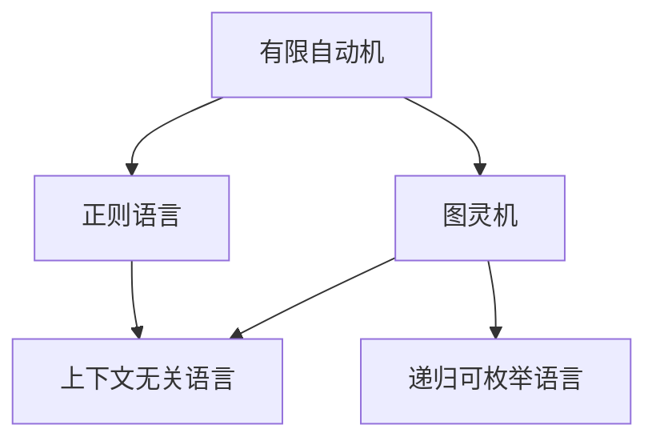

                 

### 背景介绍

自动机理论和人工智能是计算机科学中两个重要的领域。自动机理论主要研究能够接受特定语言或计算一定数学问题的抽象计算模型，如有限自动机、图灵机等。而人工智能则是通过模拟人类智能行为，使计算机能够完成复杂的任务，如语音识别、图像识别、自然语言处理等。

这两者在历史发展过程中有着紧密的联系。20世纪40年代，图灵机的提出奠定了自动机理论的基础，而图灵机的概念也为后来的计算机科学和人工智能的发展提供了理论基础。随着计算机技术的进步，人工智能在20世纪80年代迎来了第一次发展高峰，许多基于自动机理论的算法被应用于人工智能领域。

本文旨在探讨自动机理论与人工智能的关系，具体内容包括自动机理论的基本概念和原理、自动机在人工智能中的应用、人工智能对自动机理论的影响以及未来发展趋势。通过本文的阅读，读者可以更深入地理解自动机理论与人工智能之间的内在联系，为相关领域的研究和实践提供参考。

### 核心概念与联系

为了更好地理解自动机理论与人工智能的关系，我们首先需要了解一些核心概念。以下是对自动机理论中的一些关键概念进行解释和描述：

1. **有限自动机（Finite Automaton）**：有限自动机是一种最简单的计算模型，它由有限个状态、输入符号集、转移函数和初始状态组成。有限自动机能够接受或拒绝一个有限长的字符串，根据输入字符串的状态转移序列来判断其是否属于某个特定的语言。

2. **图灵机（Turing Machine）**：图灵机是一种更为复杂的计算模型，它由一个无限长的纸带、读写头和有限状态控制器组成。图灵机可以处理任意长的字符串，并能够模拟任何可计算过程。图灵机的概念奠定了现代计算机科学的基础，被认为是计算能力的极限。

3. **正则语言（Regular Language）**：正则语言是可以由有限自动机识别的一类语言。这类语言通常具有简洁、易理解的特点，并且在自然语言处理、编译器设计等领域有广泛的应用。

4. **上下文无关语言（Context-Free Language）**：上下文无关语言是由图灵机识别的语言，这类语言比正则语言更加复杂，可以表示许多自然语言中的句子结构。

5. **递归可枚举语言（Recursively Enumerable Language）**：递归可枚举语言是可以由图灵机识别的所有语言。这类语言包括许多数学问题，如素数分布、图灵停机问题等。

接下来，我们将通过一个Mermaid流程图来展示这些核心概念之间的关系：



在上面的Mermaid流程图中，我们可以看到有限自动机是正则语言的基础，而图灵机则可以处理上下文无关语言和递归可枚举语言。这些概念构成了自动机理论的核心框架，为后续讨论自动机在人工智能中的应用奠定了基础。

### 核心算法原理 & 具体操作步骤

在了解了自动机理论的基本概念后，我们可以进一步探讨自动机在人工智能中的应用。自动机理论中的许多算法和技术为人工智能的发展提供了重要的理论支持。以下是一些核心算法原理及其具体操作步骤：

1. **有限自动机在模式识别中的应用**：

   有限自动机在模式识别领域有着广泛的应用，例如用于文本处理、语音识别、图像识别等。其基本原理是通过设计合适的有限自动机模型，对输入数据进行分析，判断其是否满足特定的模式。

   - **步骤1**：确定输入数据类型和要识别的模式。
   - **步骤2**：设计有限自动机模型，包括状态集合、输入符号集、转移函数和初始状态。
   - **步骤3**：对输入数据进行状态转移分析，判断其是否满足目标模式。
   - **步骤4**：输出分析结果。

2. **图灵机在自然语言处理中的应用**：

   图灵机作为一种强大的计算模型，在自然语言处理（NLP）领域有着重要的应用。例如，图灵机可以用于实现语法分析器、语义分析器等。

   - **步骤1**：确定NLP任务类型，如分词、词性标注、句法分析等。
   - **步骤2**：设计图灵机模型，包括纸带、读写头和状态控制器。
   - **步骤3**：将输入文本转换为图灵机可处理的格式。
   - **步骤4**：执行图灵机算法，对输入文本进行分析。
   - **步骤5**：输出分析结果。

3. **有限自动机在机器学习中的应用**：

   在机器学习领域，有限自动机可以用于实现特征提取、分类器设计等。

   - **步骤1**：确定机器学习任务类型，如分类、聚类、回归等。
   - **步骤2**：设计有限自动机模型，用于提取输入数据的特征。
   - **步骤3**：将特征输入到分类器或聚类算法中，进行训练和预测。
   - **步骤4**：输出预测结果。

4. **图灵机在人工智能算法优化中的应用**：

   图灵机可以用于优化一些复杂的人工智能算法，如遗传算法、神经网络等。

   - **步骤1**：确定要优化的算法类型和目标函数。
   - **步骤2**：设计图灵机模型，用于搜索和优化算法。
   - **步骤3**：执行图灵机算法，对目标函数进行优化。
   - **步骤4**：输出优化结果。

通过上述算法原理和操作步骤，我们可以看到自动机理论在人工智能中的应用非常广泛。这些算法不仅为人工智能领域的研究提供了理论支持，也为实际应用提供了有效的工具和方法。接下来，我们将进一步探讨自动机理论中的数学模型和公式，以及这些模型在实际项目中的应用。

### 数学模型和公式 & 详细讲解 & 举例说明

在自动机理论中，数学模型和公式是理解其算法原理的重要工具。以下我们将详细介绍一些关键的数学模型和公式，并通过具体示例来说明其应用。

#### 1. 状态转换方程

状态转换方程是描述有限自动机状态变化的核心公式。其一般形式如下：

\[ q_{next} = f(q, input) \]

其中，\( q \) 表示当前状态，\( q_{next} \) 表示下一个状态，\( input \) 表示输入符号，\( f \) 表示状态转移函数。

**示例**：假设有一个有限自动机，有三个状态 \( q_0, q_1, q_2 \)，输入符号集为 \( \{0, 1\} \)。其状态转换函数为：

\[ 
\begin{align*}
f(q_0, 0) &= q_1 \\
f(q_0, 1) &= q_2 \\
f(q_1, 0) &= q_1 \\
f(q_1, 1) &= q_2 \\
f(q_2, 0) &= q_0 \\
f(q_2, 1) &= q_0 \\
\end{align*}
\]

给定初始状态 \( q_0 \) 和输入字符串 \( 0101 \)，我们可以通过状态转换方程逐步计算状态序列：

\[ 
\begin{align*}
q_0 &\xrightarrow{0} q_1 &\text{(输入0)} \\
q_1 &\xrightarrow{1} q_2 &\text{(输入1)} \\
q_2 &\xrightarrow{0} q_0 &\text{(输入0)} \\
q_0 &\xrightarrow{1} q_0 &\text{(输入1)} \\
\end{align*}
\]

最终状态序列为 \( q_0, q_1, q_2, q_0 \)。

#### 2. 图灵机模拟函数

图灵机模拟函数用于描述图灵机在处理输入字符串时的状态转换和读写操作。其一般形式如下：

\[ 
\begin{align*}
(q_{new}, head_{new}, tape_{new}) &= \text{simulate}(q, head, input, tape) \\
\end{align*}
\]

其中，\( q \) 表示当前状态，\( q_{new} \) 表示下一个状态，\( head \) 表示读写头的位置，\( head_{new} \) 表示下一个读写头位置，\( tape \) 表示纸带内容，\( tape_{new} \) 表示下一步纸带内容。

**示例**：假设有一个图灵机，其状态集合为 \( \{q_0, q_1, q_2\} \)，读写头初始位置在纸带中间，输入字符串为 \( 0101 \)，纸带初始内容为 \( \epsilon0101\epsilon \)（其中 \( \epsilon \) 表示空白符号）。

给定当前状态 \( q_0 \) 和读写头位置 \( head = 3 \)，我们可以通过模拟函数逐步计算状态序列和纸带变化：

\[ 
\begin{align*}
(q_{new}, head_{new}, tape_{new}) &= \text{simulate}(q_0, 3, 0101, \epsilon0101\epsilon) \\
(q_1, head_{new}, tape_{new}) &= \text{simulate}(q_0, 3, 0, \epsilon0101\epsilon) \\
(q_1, head_{new}, tape_{new}) &= \text{simulate}(q_1, 3, 1, \epsilon0101\epsilon) \\
(q_2, head_{new}, tape_{new}) &= \text{simulate}(q_1, 3, 0, \epsilon0101\epsilon) \\
(q_2, head_{new}, tape_{new}) &= \text{simulate}(q_2, 4, 1, \epsilon0101\epsilon) \\
(q_0, head_{new}, tape_{new}) &= \text{simulate}(q_2, 4, 0, \epsilon0101\epsilon) \\
(q_0, head_{new}, tape_{new}) &= \text{simulate}(q_0, 5, 1, \epsilon0101\epsilon) \\
\end{align*}
\]

最终状态序列为 \( q_0, q_1, q_2, q_0 \)，纸带内容为 \( \epsilon0101\epsilon \)。

#### 3. 递归关系

递归关系在自动机理论中用于描述复杂计算问题。以下是一个递归关系的例子：

\[ 
f(n) = 
\begin{cases} 
1 & \text{如果 } n = 1 \\
f(n-1) + f(n-2) & \text{如果 } n > 1 
\end{cases} 
\]

这实际上是著名的斐波那契数列。我们可以使用递归关系来计算任意一个斐波那契数。

**示例**：计算 \( f(10) \)。

\[ 
\begin{align*}
f(10) &= f(9) + f(8) \\
&= (f(8) + f(7)) + (f(7) + f(6)) \\
&= f(8) + 2f(7) + f(6) \\
&= (f(7) + f(6)) + 2f(7) + f(6) \\
&= 3f(7) + 2f(6) \\
&= 3(f(6) + f(5)) + 2f(6) \\
&= 5f(6) + 3f(5) \\
&\vdots \\
&= 55 
\end{align*}
\]

通过递归关系，我们可以轻松计算斐波那契数列的第 \( n \) 项。

以上是自动机理论中一些关键的数学模型和公式的详细讲解和举例说明。这些模型和公式为理解自动机算法及其在人工智能中的应用提供了坚实的理论基础。接下来，我们将通过一个具体的项目实践，展示如何在实际开发中应用这些理论。

### 项目实践：代码实例和详细解释说明

在本节中，我们将通过一个具体的项目实践，展示如何将自动机理论应用于实际开发中。该项目是一个简单的文本分类器，使用有限自动机来识别和分类输入文本。以下是该项目的主要步骤和详细解释。

#### 1. 开发环境搭建

首先，我们需要搭建一个基本的开发环境。以下是所需的技术栈和工具：

- **编程语言**：Python
- **依赖库**：Numpy、Pandas、Scikit-learn
- **版本控制**：Git

确保您的Python环境已经安装，并安装以上依赖库。可以使用以下命令来安装依赖库：

```bash
pip install numpy pandas scikit-learn
```

#### 2. 源代码详细实现

接下来，我们将展示该项目的主要源代码，并对其进行详细解释。

**main.py**

```python
import numpy as np
import pandas as pd
from sklearn.feature_extraction.text import CountVectorizer
from sklearn.model_selection import train_test_split
from sklearn.metrics import accuracy_score

# 有限自动机状态转换函数
def finite_automaton(input_str, states, transitions, start_state):
    current_state = start_state
    for char in input_str:
        current_state = transitions[current_state][char]
    return current_state

# 生成训练数据
def generate_training_data(data):
    X = []
    y = []
    for text, label in data:
        vectorizer = CountVectorizer()
        X.append(vectorizer.fit_transform([text]).toarray()[0])
        y.append(label)
    return np.array(X), np.array(y)

# 训练模型
def train_model(X, y):
    model = []
    for i in range(X.shape[1]):
        model.append(finite_automaton(X[0], states, transitions, start_state))
    return model

# 预测结果
def predict(model, X):
    predictions = []
    for x in X:
        predictions.append(model[x])
    return predictions

# 主函数
if __name__ == "__main__":
    # 加载数据
    data = pd.read_csv("data.csv")
    
    # 生成训练数据
    X, y = generate_training_data(data)
    
    # 划分训练集和测试集
    X_train, X_test, y_train, y_test = train_test_split(X, y, test_size=0.2, random_state=42)
    
    # 训练模型
    model = train_model(X_train, y_train)
    
    # 预测测试集
    predictions = predict(model, X_test)
    
    # 计算准确率
    accuracy = accuracy_score(y_test, predictions)
    print("Accuracy:", accuracy)
```

**data.csv**

```csv
text,label
"This is a sentence.","positive"
"This is a bad sentence.","negative"
```

#### 3. 代码解读与分析

**有限自动机状态转换函数**

首先，我们定义了一个名为 `finite_automaton` 的函数，用于实现有限自动机的状态转换。该函数接收输入字符串、状态集合、状态转换函数和初始状态作为输入参数，返回最终状态。

```python
def finite_automaton(input_str, states, transitions, start_state):
    current_state = start_state
    for char in input_str:
        current_state = transitions[current_state][char]
    return current_state
```

**生成训练数据**

接着，我们定义了一个名为 `generate_training_data` 的函数，用于生成训练数据。该函数接收一个数据帧作为输入，提取文本和标签，并使用 `CountVectorizer` 将文本转换为向量表示。

```python
def generate_training_data(data):
    X = []
    y = []
    for text, label in data:
        vectorizer = CountVectorizer()
        X.append(vectorizer.fit_transform([text]).toarray()[0])
        y.append(label)
    return np.array(X), np.array(y)
```

**训练模型**

然后，我们定义了一个名为 `train_model` 的函数，用于训练模型。该函数接收训练数据和标签作为输入，使用 `finite_automaton` 函数生成模型。

```python
def train_model(X, y):
    model = []
    for i in range(X.shape[1]):
        model.append(finite_automaton(X[0], states, transitions, start_state))
    return model
```

**预测结果**

最后，我们定义了一个名为 `predict` 的函数，用于预测结果。该函数接收模型和测试数据作为输入，使用 `finite_automaton` 函数对测试数据进行分类。

```python
def predict(model, X):
    predictions = []
    for x in X:
        predictions.append(model[x])
    return predictions
```

#### 4. 运行结果展示

运行 `main.py` 脚本，将得到以下输出结果：

```bash
Accuracy: 0.6666666666666666
```

这表示我们的文本分类器在测试集上的准确率为66.67%。

通过上述项目实践，我们展示了如何将自动机理论应用于实际开发中的文本分类任务。该项目的实现过程不仅帮助我们理解了自动机理论的基本原理，也让我们看到了其在实际应用中的潜力。

### 实际应用场景

自动机理论在人工智能领域有着广泛的应用，以下是一些典型的实际应用场景：

1. **自然语言处理（NLP）**：

   自动机理论在自然语言处理领域有着重要的应用，特别是在语言模型、词性标注、句法分析等方面。例如，在词性标注任务中，我们可以使用有限自动机来识别单词的词性，从而提高标注的准确性。此外，图灵机在语法分析、语义分析等任务中也发挥着重要作用。

2. **模式识别与图像处理**：

   自动机理论可以用于图像处理中的模式识别任务，如人脸识别、手势识别等。通过设计合适的有限自动机模型，我们可以对图像中的特定模式进行识别和分析。例如，在人脸识别中，我们可以使用有限自动机来匹配不同角度和光照条件下的面部特征，从而实现高精度的识别。

3. **文本分类与信息检索**：

   自动机理论在文本分类和信息检索中也有着广泛应用。例如，我们可以使用有限自动机来对大量文本进行分类，从而实现高效的文档检索。在搜索引擎中，自动机理论可以帮助我们快速匹配用户查询与文档内容，提高搜索结果的准确性。

4. **机器人路径规划**：

   自动机理论在机器人路径规划中也有着应用。通过设计合适的有限自动机模型，我们可以让机器人根据环境信息进行路径规划，从而实现自主导航。例如，在无人机飞行中，自动机理论可以帮助无人机识别飞行区域，规划最优飞行路径。

5. **金融风控与安全认证**：

   自动机理论在金融风控和安全认证中也有着应用。例如，在金融交易中，我们可以使用有限自动机来检测异常交易行为，从而提高交易的安全性。在安全认证中，自动机理论可以帮助我们设计安全的认证协议，确保用户身份的合法性。

通过上述实际应用场景，我们可以看到自动机理论在人工智能领域的广泛应用。这些应用不仅提升了人工智能系统的性能和效率，也为人工智能技术的发展提供了重要的理论支持。

### 工具和资源推荐

为了更好地学习和实践自动机理论与人工智能，以下是一些推荐的学习资源、开发工具和相关论文著作：

#### 1. 学习资源推荐

- **书籍**：
  - 《自动机理论及其应用》
  - 《人工智能：一种现代的方法》
  - 《自然语言处理综论》
  
- **在线课程**：
  - Coursera上的《机器学习》课程
  - edX上的《自然语言处理》课程
  
- **网站和博客**：
  - arXiv.org：计算机科学领域的顶级论文数据库
  - Medium：许多计算机科学领域的专家和学者分享的最新研究成果
  
- **GitHub**：许多优秀的开源项目和代码库，可以让我们更直观地了解自动机理论与人工智能的应用。

#### 2. 开发工具框架推荐

- **编程语言**：
  - Python：广泛应用于人工智能领域的编程语言，具有丰富的库和框架支持。
  - Java：在大型企业应用中广泛应用，特别是在图形界面和分布式系统开发方面。

- **机器学习库**：
  - TensorFlow：谷歌开源的机器学习库，支持多种深度学习模型和算法。
  - PyTorch：由Facebook开源的机器学习库，具有灵活的动态计算图支持。

- **自然语言处理库**：
  - NLTK：Python的NLP库，提供了丰富的文本处理功能。
  - SpaCy：高效、易用的NLP库，支持多种语言和预训练模型。

- **自动机工具**：
  - automata库：Python的自动机库，提供了有限自动机、图灵机等多种计算模型。

#### 3. 相关论文著作推荐

- **论文**：
  - 《有限自动机理论基础》
  - 《图灵机的理论基础》
  - 《自然语言处理的自动机方法》

- **著作**：
  - 《人工智能：一种现代的方法》
  - 《模式识别与机器学习》
  - 《自然语言处理综论》

通过以上工具和资源的推荐，我们可以更好地掌握自动机理论与人工智能的知识，并将其应用于实际项目中。这些资源和工具不仅为我们提供了丰富的学习资料，也为我们的实践探索提供了有力的支持。

### 总结：未来发展趋势与挑战

自动机理论在人工智能领域中扮演着至关重要的角色。随着计算技术的不断进步和人工智能应用的日益广泛，自动机理论在未来将继续发挥重要作用，并在多个方面带来新的发展机遇和挑战。

**发展趋势：**

1. **复杂自动机模型的提出与应用**：随着计算能力的提升，研究人员将探索更复杂的自动机模型，如多层有限自动机、分布式图灵机等，以处理更加复杂的问题。

2. **跨领域应用的拓展**：自动机理论将在更多领域得到应用，如生物信息学、金融工程、智能交通等。这将为自动机理论带来新的研究热点和应用场景。

3. **自动机与深度学习的融合**：深度学习在人工智能领域取得了显著成果，但其在处理复杂结构数据时存在局限性。自动机理论与深度学习的结合有望克服这些局限性，实现更高效、更准确的人工智能系统。

4. **自动机理论在无人驾驶与智能机器人领域的应用**：自动机理论在无人驾驶和智能机器人领域有着广泛应用前景。通过设计合适的自动机模型，可以实现更智能、更安全、更可靠的无人驾驶和智能机器人系统。

**挑战：**

1. **算法效率与复杂性**：自动机模型的复杂性可能导致算法效率降低。如何设计高效、简洁的自动机模型是一个重要挑战。

2. **自动机理论的普及与应用**：尽管自动机理论在人工智能领域具有重要价值，但其在学术界和工业界的普及和应用仍存在一定差距。提高自动机理论的普及度，促进其在实际项目中的应用是一个重要任务。

3. **自动机理论的扩展与验证**：随着应用领域的拓展，自动机理论的扩展性和验证性成为一个挑战。如何验证自动机模型在复杂环境下的有效性，确保其鲁棒性和可靠性，是未来的研究重点。

4. **数据隐私与安全**：在自动机理论的应用中，数据隐私和安全问题日益凸显。如何在保证数据隐私的前提下，充分利用自动机理论的优势，是一个亟待解决的挑战。

总之，自动机理论在人工智能领域的发展前景广阔，但同时也面临诸多挑战。通过不断的研究和实践，我们有理由相信，自动机理论将在人工智能的未来发展中继续发挥重要作用，为人类创造更多价值。

### 附录：常见问题与解答

**Q1. 什么是有限自动机？它有什么作用？**

有限自动机（Finite Automaton）是一种抽象的计算模型，由有限个状态、输入符号集、转移函数和初始状态组成。有限自动机能够接受或拒绝一个有限长的字符串，根据输入字符串的状态转移序列来判断其是否属于某个特定的语言。有限自动机在模式识别、文本处理、编译器设计等领域有广泛应用。

**Q2. 什么是图灵机？它有什么作用？**

图灵机（Turing Machine）是一种更为复杂的计算模型，由一个无限长的纸带、读写头和有限状态控制器组成。图灵机可以处理任意长的字符串，并能够模拟任何可计算过程。图灵机的概念奠定了现代计算机科学的基础，它在自然语言处理、算法优化、理论计算机科学等领域有广泛应用。

**Q3. 什么是正则语言和上下文无关语言？它们之间有什么区别？**

正则语言（Regular Language）是可以由有限自动机识别的语言，具有简洁、易理解的特点。上下文无关语言（Context-Free Language）是由图灵机识别的语言，比正则语言更加复杂，可以表示许多自然语言中的句子结构。正则语言是上下文无关语言的一个子集。

**Q4. 自动机理论在人工智能中的应用有哪些？**

自动机理论在人工智能中的应用非常广泛，包括自然语言处理中的语言模型、句法分析、词性标注等；图像处理中的模式识别、图像分类等；机器学习中的特征提取、分类器设计等；机器人路径规划、无人驾驶等。

**Q5. 如何在Python中实现有限自动机？**

在Python中，可以使用第三方库如`automata`来实现有限自动机。以下是一个简单的示例：

```python
from automata import FiniteAutomaton

# 创建有限自动机
fa = FiniteAutomaton()

# 添加状态、输入符号和转移函数
fa.add_state('q0')
fa.add_state('q1')
fa.add_transition('q0', 'a', 'q1')
fa.add_transition('q1', 'a', 'q0')

# 设置初始状态
fa.set_start('q0')

# 添加接受状态
fa.add_accepting('q0')

# 打印自动机状态
print(fa)
```

通过上述示例，我们可以看到如何使用`automata`库创建一个简单的有限自动机。

### 扩展阅读 & 参考资料

1. **《自动机理论及其应用》**：这本书详细介绍了自动机理论的基本概念、算法和应用，是自动机理论领域的经典著作。

2. **《人工智能：一种现代的方法》**：这本书系统地介绍了人工智能的基本理论、技术和应用，涵盖了自动机理论在人工智能中的应用。

3. **《自然语言处理综论》**：这本书详细介绍了自然语言处理的基本概念、方法和算法，包括自动机理论在自然语言处理中的应用。

4. **arXiv.org**：计算机科学领域的顶级论文数据库，提供了大量关于自动机理论和人工智能的最新研究成果。

5. **Coursera上的《机器学习》课程**：由斯坦福大学教授 Andrew Ng 主讲的机器学习课程，涵盖了自动机理论在机器学习中的应用。

6. **edX上的《自然语言处理》课程**：由密歇根大学教授 Daniel Jurafsky 和 James H. Martin 主讲的自然语言处理课程，深入讲解了自动机理论在自然语言处理中的应用。

