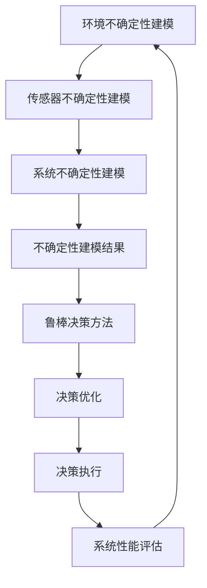

                 

### 1. 背景介绍

自动驾驶技术的发展已经从理论走向实践，成为智能交通领域的热点。然而，自动驾驶系统的安全性和可靠性在很大程度上取决于其对不确定性的建模与处理能力。在复杂的道路环境中，车辆需要实时感知周围环境，做出快速、准确的决策，这就要求自动驾驶系统具备高度的鲁棒性。

不确定性建模与鲁棒决策方法在自动驾驶系统中的重要性体现在多个方面。首先，道路环境中的各种不确定性因素，如其他车辆的行为、行人动作、道路施工、天气变化等，都对自动驾驶系统提出了极高的要求。如何准确、高效地识别和预测这些不确定性因素，是自动驾驶系统发展的关键。

其次，自动驾驶系统需要在各种复杂情况下保持稳定运行，这就需要系统具备强大的鲁棒性。传统的决策方法往往依赖于精确的模型和假设，而实际道路环境中的不确定性使得这些方法难以达到预期效果。因此，研究适用于自动驾驶系统的鲁棒决策方法，能够提高系统的稳定性和安全性。

自动驾驶技术的发展历程可以分为几个阶段。最初，自动驾驶系统主要依靠规则和先验知识进行决策，这种方式在简单场景下表现尚可，但在复杂环境中存在很大局限性。随着传感器技术和人工智能算法的发展，自动驾驶系统开始引入机器学习和深度学习技术，使其在处理复杂环境方面有了显著提升。然而，这些方法仍然面临着不确定性处理不足的问题。

因此，本文旨在深入探讨自动驾驶中的不确定性建模与鲁棒决策方法。通过对相关理论、算法和实践的详细分析，本文希望能够为自动驾驶技术的发展提供一些有益的启示。

### 1.1 自动驾驶技术发展背景

自动驾驶技术的兴起与信息技术的快速发展密不可分。随着计算机科学、人工智能、传感器技术、通信技术等领域的不断进步，自动驾驶技术逐渐从理论走向实践。20世纪80年代，美国、日本等国家开始进行自动驾驶汽车的研发，并取得了一定的成果。进入21世纪，随着互联网、物联网等技术的广泛应用，自动驾驶技术迎来了快速发展。

从技术层面来看，自动驾驶技术主要依赖于以下几个方面：

1. **传感器技术**：传感器是自动驾驶汽车获取环境信息的重要设备，包括激光雷达、摄像头、雷达、超声波传感器等。这些传感器能够实时监测车辆周围的环境，为自动驾驶系统提供精确的数据。

2. **人工智能与机器学习**：自动驾驶系统需要处理大量传感器数据，从中提取有用的信息。人工智能与机器学习技术在这一过程中发挥了重要作用。通过深度学习、强化学习等方法，自动驾驶系统能够不断学习和优化其决策过程，提高应对复杂环境的能力。

3. **通信技术**：自动驾驶系统不仅需要处理车内传感器数据，还需要与其他车辆、道路基础设施等进行通信。V2X（Vehicle-to-Everything）通信技术是实现这一目标的关键。通过V2X通信，车辆能够获取道路信息、交通状况等，从而做出更准确的决策。

4. **嵌入式系统与软件**：自动驾驶汽车需要具备强大的计算能力和高效的软件系统。嵌入式系统与软件是实现这一目标的基础。通过优化算法和硬件设计，自动驾驶系统能够在有限资源下实现高效的决策和控制。

在实际应用中，自动驾驶技术已经逐渐从实验室走向市场。例如，谷歌的Waymo、特斯拉、Uber等公司已经在多个城市开展了自动驾驶汽车的试运行。这些实际应用案例展示了自动驾驶技术在提高交通效率、减少交通事故、降低环境污染等方面的潜力。

然而，自动驾驶技术仍然面临着许多挑战。其中，不确定性的处理是自动驾驶系统需要解决的核心问题之一。在实际道路环境中，车辆需要应对各种不确定性因素，如其他车辆的行为、行人动作、道路施工、天气变化等。如何准确、高效地识别和预测这些不确定性因素，是自动驾驶技术需要解决的重要问题。

### 1.2 不确定性建模的重要性

在自动驾驶系统中，不确定性建模是确保系统稳定性和安全性的关键因素。道路环境中的不确定性因素复杂多样，包括但不限于其他车辆的行为、行人动作、道路状况和天气变化等。这些不确定性因素会对自动驾驶系统的感知、决策和控制产生直接影响，可能导致系统无法准确预测和应对突发情况。

首先，其他车辆的行为是自动驾驶系统中不可忽视的一个重要因素。在道路环境中，其他车辆可能以未知速度和轨迹行驶，甚至可能进行危险的驾驶行为，如突然变道或急刹车。自动驾驶系统需要通过传感器实时感知这些行为，并做出相应的决策。然而，由于传感器数据的噪声和不确定性，系统难以精确预测其他车辆的未来行为，这增加了系统决策的难度。

其次，行人动作也是自动驾驶系统需要考虑的重要不确定性因素。行人的行为难以预测，他们可能在道路上任意行走，甚至突然闯入道路。自动驾驶系统需要通过视觉和雷达等传感器实时监测行人，并做出快速反应，以确保行人安全。然而，行人行为的不确定性使得系统在预测和决策过程中面临巨大挑战。

此外，道路状况和天气变化也是影响自动驾驶系统稳定性的重要因素。道路施工、交通标志变更、路面磨损等都会对自动驾驶系统的感知和决策产生影响。天气变化，如雨、雪、雾等，会导致传感器数据的模糊性和噪声增加，使得系统难以准确识别道路环境。因此，如何准确建模和预测这些不确定性因素，是自动驾驶系统需要解决的核心问题。

不确定性建模在自动驾驶系统中的重要性主要体现在以下几个方面：

1. **提高系统鲁棒性**：通过建立精确的不确定性模型，自动驾驶系统可以更好地应对复杂和突发情况，提高系统的鲁棒性。这有助于减少系统在未知环境下的失败率，提高系统的安全性和可靠性。

2. **优化决策过程**：不确定性建模能够为自动驾驶系统提供更加全面和准确的环境信息，从而优化决策过程。在面临不确定情况时，系统可以通过对不确定性因素的分析和预测，做出更合理的决策，降低事故发生的风险。

3. **提升用户体验**：对于自动驾驶车辆的用户来说，不确定性建模能够提高车辆的行驶稳定性和安全性，提供更好的驾驶体验。用户可以更加放心地使用自动驾驶系统，减少对传统驾驶方式的依赖。

4. **推动技术进步**：不确定性建模是自动驾驶技术发展的重要方向之一。通过不断研究和优化不确定性建模方法，自动驾驶技术可以在复杂和多变的环境中表现得更加出色，为未来的智能交通系统奠定基础。

总之，不确定性建模在自动驾驶系统中具有至关重要的意义。通过深入研究不确定性建模的方法和技术，自动驾驶系统将能够更好地应对复杂道路环境，提高系统的安全性和可靠性，为自动驾驶技术的广泛应用提供坚实的技术支持。

### 1.3 鲁棒决策方法在自动驾驶中的必要性

鲁棒决策方法在自动驾驶系统中具有重要意义，因为它直接关系到系统的稳定性和安全性。鲁棒性指的是系统在面对外部扰动和内部不确定性时，仍能保持其预定的性能。在自动驾驶领域，鲁棒决策方法确保车辆即使在不确定和复杂的环境中，也能做出合理的驾驶决策，从而避免潜在的危险。

首先，鲁棒决策方法能够提高自动驾驶系统的适应能力。道路环境瞬息万变，车辆可能遇到各种突发状况，如行人突然出现、其他车辆急刹车等。鲁棒决策方法通过综合考虑各种不确定性因素，帮助系统在动态环境中做出快速、准确的决策，从而有效应对突发情况。

其次，鲁棒决策方法能够提升系统的安全性和可靠性。自动驾驶系统在运行过程中，需要处理大量的传感器数据，并通过复杂的算法进行决策。如果系统在面对不确定性时缺乏鲁棒性，可能会因数据噪声或模型偏差而导致错误的决策，从而引发交通事故。通过采用鲁棒决策方法，系统能够更好地过滤和识别噪声，减少错误决策的可能性，提高系统的安全性。

此外，鲁棒决策方法有助于提高系统的用户体验。自动驾驶车辆需要在不同路况、天气和交通环境中稳定运行，鲁棒性能够确保系统在各种条件下都能提供优质的驾驶体验。这对于吸引消费者使用自动驾驶技术，推动自动驾驶技术的普及具有重要意义。

在自动驾驶系统中，鲁棒决策方法的实现需要结合多种技术手段。例如，可以通过集成多种传感器数据，提高系统对环境的感知能力；利用机器学习和深度学习算法，增强系统对不确定性的预测和适应能力；采用鲁棒优化方法，确保系统在面对不确定情况时仍能保持稳定运行。

总之，鲁棒决策方法在自动驾驶系统中的必要性不可忽视。通过深入研究鲁棒决策方法，并不断优化其实现技术，自动驾驶系统能够更好地应对复杂和多变的环境，提高系统的安全性和可靠性，为自动驾驶技术的广泛应用奠定基础。

### 1.4 当前研究现状与未来发展方向

近年来，自动驾驶技术领域的研究取得了显著进展，特别是在不确定性建模与鲁棒决策方法方面。当前，研究者们主要从以下几个方面展开研究：

1. **多传感器融合**：通过整合激光雷达、摄像头、雷达等传感器数据，研究者们致力于提高自动驾驶系统对复杂环境的感知能力。多传感器融合技术能够有效降低单一传感器的不确定性，提高系统整体的鲁棒性。

2. **深度学习与机器学习**：深度学习与机器学习算法在自动驾驶系统中的应用越来越广泛，通过训练模型从大量数据中学习环境特征，提高系统的预测和决策能力。例如，卷积神经网络（CNN）在图像识别和物体检测方面取得了显著成果，而循环神经网络（RNN）在序列数据处理方面表现出色。

3. **强化学习**：强化学习算法通过模拟人类驾驶行为，使自动驾驶系统在虚拟环境中不断学习和优化决策策略。这种方法能够有效应对复杂和不确定的动态环境，提高系统的适应能力和鲁棒性。

4. **不确定性建模与鲁棒优化**：研究者们致力于建立更加精确的不确定性模型，并采用鲁棒优化方法，确保系统在面对不确定因素时仍能保持稳定运行。例如，通过概率分布模型和鲁棒优化算法，研究者们试图提高系统在不确定环境下的决策质量。

尽管在不确定性建模与鲁棒决策方法方面取得了许多成果，但自动驾驶技术仍面临诸多挑战和问题：

1. **数据质量和规模**：自动驾驶系统依赖于大量高质量、多样化的数据，但目前仍存在数据标注不准确、数据获取成本高、数据覆盖范围有限等问题，这限制了模型训练的效果和泛化能力。

2. **实时性与效率**：在自动驾驶系统中，实时性和效率是关键指标。当前许多复杂算法在处理大规模数据时，计算成本高、实时性不足，难以满足实际应用需求。

3. **系统集成与协同**：自动驾驶系统涉及多个模块和组件，如何实现高效集成和协同工作是当前研究的一个难点。系统中的传感器、控制器和通信模块需要协调一致，确保系统整体性能最优。

4. **法律法规与伦理问题**：自动驾驶技术的发展需要相应的法律法规和伦理规范。如何确保自动驾驶系统的安全性、隐私保护和责任认定，是未来需要解决的重要问题。

未来，自动驾驶技术将在以下几个方面继续发展：

1. **智能传感器与通信技术**：随着传感器技术和通信技术的不断进步，自动驾驶系统将能够更加精准地感知和通信，提高系统的自适应能力和协同效率。

2. **人工智能算法优化**：通过不断优化人工智能算法，提高模型训练效率和预测准确性，自动驾驶系统将在复杂和多变的环境中表现得更加出色。

3. **多学科交叉研究**：自动驾驶技术的发展需要多个学科的协同研究，包括计算机科学、控制工程、交通工程、心理学等。多学科交叉研究将推动自动驾驶技术的全面发展。

4. **开放平台与生态建设**：建立开放的自动驾驶技术平台，促进产学研合作，推动技术创新和产业应用，是未来自动驾驶技术发展的关键。

总之，自动驾驶技术的不确定性建模与鲁棒决策方法研究具有重要的现实意义和广阔的发展前景。通过不断探索和创新，自动驾驶技术将能够在复杂和多变的环境中表现出更高的稳定性和安全性，为智能交通系统的发展奠定基础。

## 2. 核心概念与联系

在本章节中，我们将深入探讨自动驾驶中不确定性建模与鲁棒决策方法的核心概念，并展示这些概念之间的联系。以下是几个关键概念的详细描述：

### 2.1 不确定性建模

不确定性建模是指对自动驾驶系统面临的各种不确定性因素进行数学描述和建模，以便系统能够在这些因素的作用下做出合理决策。不确定性建模通常包括以下几个方面：

1. **环境不确定性建模**：这涉及对道路环境中的各种不确定性因素进行建模，如其他车辆的行为、行人的动作、道路施工、天气变化等。这些因素通常通过概率分布或随机过程来描述。

2. **传感器不确定性建模**：由于传感器本身的局限性，如噪声、延迟、误差等，传感器数据也存在不确定性。因此，需要建模传感器数据的不确定性，以便更好地处理和解释传感器数据。

3. **系统不确定性建模**：自动驾驶系统本身可能存在各种不确定性，如算法不确定性、硬件故障等。这些不确定性也需要通过模型进行描述，以便系统在面临不确定性时能够做出合理的应对。

### 2.2 鲁棒决策方法

鲁棒决策方法是指自动驾驶系统在面对不确定性和外部扰动时，仍能保持稳定性和性能的方法。以下是一些常见的鲁棒决策方法：

1. **鲁棒优化**：通过最大化最小期望目标，确保系统在各种可能的不确定性情况下都能保持性能。鲁棒优化方法通常涉及优化目标函数和约束条件，以应对不确定性的影响。

2. **模糊决策**：模糊决策方法通过模糊逻辑来处理不确定性问题，将不确定信息转化为模糊集合，从而实现基于模糊集合的决策。

3. **随机规划**：随机规划方法通过概率分布来描述不确定性，并利用概率分布的性质进行决策。这种方法可以处理多种不确定情况，但计算复杂度较高。

### 2.3 核心概念之间的联系

不确定性建模与鲁棒决策方法之间存在着紧密的联系。不确定性建模为鲁棒决策提供了基础数据和信息，而鲁棒决策方法则利用这些信息来应对不确定性，确保系统在复杂环境中保持稳定性和性能。以下是这些概念之间的具体联系：

1. **环境不确定性建模 → 鲁棒决策方法**：环境不确定性建模的结果（如概率分布、随机过程）被用于鲁棒决策方法中，以优化决策过程。例如，通过环境不确定性建模，可以确定交通信号灯变化的概率分布，从而在决策中考虑这一不确定性因素。

2. **传感器不确定性建模 → 鲁棒决策方法**：传感器不确定性建模的结果（如噪声分布、延迟范围）也被用于鲁棒决策中，以减少传感器数据对决策的负面影响。例如，通过传感器不确定性建模，可以确定某个物体检测的置信度，从而在决策中排除低置信度的数据。

3. **系统不确定性建模 → 鲁棒决策方法**：系统不确定性建模的结果（如算法不确定性、硬件故障概率）被用于设计鲁棒性更强的系统，确保在面对系统内部不确定性时仍能保持稳定运行。

为了更好地理解这些核心概念之间的联系，我们使用Mermaid流程图展示自动驾驶中的不确定性建模与鲁棒决策方法的核心流程和节点：



在这个流程图中，A到H表示了从不确定性建模到鲁棒决策方法的全过程。环境不确定性建模、传感器不确定性建模和系统不确定性建模共同构成了不确定性建模的三个重要方面，它们的结果被用于鲁棒决策方法中，以实现决策优化和执行。通过不断评估系统性能，可以进一步优化不确定性建模和鲁棒决策方法，形成一个闭环控制系统，确保自动驾驶系统能够在复杂环境中稳定运行。

总之，不确定性建模与鲁棒决策方法是自动驾驶技术中不可或缺的两个核心概念。通过深入研究这些概念，并探讨它们之间的联系，我们可以为自动驾驶技术的发展提供更加坚实的理论基础和技术支持。

### 2.4 不确定性建模方法

在自动驾驶系统中，不确定性建模是一个关键环节，其目的是为了更好地理解并处理系统在复杂环境中可能遇到的各种不确定因素。以下是一些常见的不确定性建模方法：

#### 2.4.1 概率分布模型

概率分布模型是处理不确定性的常用方法之一。通过概率分布，我们可以量化不确定性因素的发生概率。以下是一些常见的概率分布模型：

1. **正态分布（Gaussian Distribution）**：正态分布是最常用的概率分布模型之一，它适用于大多数连续型数据。正态分布具有均值和方差两个参数，可以描述数据集中度、分散度和对称性。自动驾驶系统可以使用正态分布来建模传感器数据，如激光雷达测距数据、摄像头图像中的噪声等。

2. **伯努利分布（Bernoulli Distribution）**：伯努利分布是一个二元概率分布，适用于离散型数据。例如，在自动驾驶系统中，可以用来表示某个物体是否被检测到（0表示未检测到，1表示检测到）。

3. **二项分布（Binomial Distribution）**：二项分布是伯努利分布的扩展，适用于多次独立伯努利试验的结果。例如，在自动驾驶系统中，可以使用二项分布来建模连续时间内检测到特定物体的次数。

4. **泊松分布（Poisson Distribution）**：泊松分布适用于描述在一定时间内发生某事件的次数。例如，在自动驾驶系统中，可以用来建模车辆在某个区域内的出现频率。

#### 2.4.2 随机过程模型

随机过程模型可以用来描述随时间变化的随机变量序列。以下是一些常见的随机过程模型：

1. **马尔可夫链（Markov Chain）**：马尔可夫链是一种离散时间随机过程，适用于描述状态转移概率。例如，在自动驾驶系统中，可以用来建模车辆之间的相对位置关系。

2. **马尔可夫决策过程（Markov Decision Process, MDP）**：MDP是一种用于决策过程的随机过程模型，适用于描述在不确定环境中的一系列决策。MDP包括状态空间、动作空间和奖励函数，可以用来设计自动驾驶系统的决策策略。

3. **隐马尔可夫模型（Hidden Markov Model, HMM）**：HMM是一种用于描述隐藏状态和观测值的随机过程模型。例如，在自动驾驶系统中，可以用来建模行人的动作序列和其视觉观测数据。

4. **卡尔曼滤波（Kalman Filter）**：卡尔曼滤波是一种递归的线性滤波方法，用于在存在噪声的情况下估计系统的状态。卡尔曼滤波可以用于实时估计自动驾驶系统的位置、速度等状态，是自动驾驶系统中的重要工具。

#### 2.4.3 贝叶斯网络

贝叶斯网络是一种概率图模型，可以用来表示变量之间的条件依赖关系。在自动驾驶系统中，贝叶斯网络可以用于不确定性的推理和预测。以下是一些应用示例：

1. **车辆行为预测**：通过建立贝叶斯网络，可以预测其他车辆的未来行为，从而为自动驾驶系统提供决策依据。

2. **行人意图推断**：贝叶斯网络可以用于推断行人的意图，如即将转弯或横穿马路，帮助自动驾驶系统做出更好的驾驶决策。

3. **传感器数据融合**：通过贝叶斯网络，可以将多个传感器的数据融合为一个统一的概率分布，从而提高系统的感知精度。

#### 2.4.4 模型选择与优化

在实际应用中，选择合适的不确定性建模方法至关重要。以下是一些模型选择和优化的策略：

1. **模型评估**：通过评估模型的预测准确性和鲁棒性，选择最适合当前应用场景的模型。

2. **交叉验证**：使用交叉验证方法，将数据集划分为训练集和测试集，评估模型在不同数据集上的性能。

3. **模型融合**：将多个模型的结果进行融合，以提高预测准确性和鲁棒性。例如，可以将不同传感器数据的概率分布进行融合，提高自动驾驶系统的感知精度。

4. **在线学习**：自动驾驶系统在实际运行过程中，可以不断更新模型参数，以适应环境变化和不确定性变化。

总之，不确定性建模方法在自动驾驶系统中扮演着关键角色。通过合理选择和优化建模方法，自动驾驶系统可以更好地应对复杂和多变的环境，提高系统的稳定性和安全性。

### 2.5 鲁棒决策方法

鲁棒决策方法在自动驾驶系统中至关重要，因为它确保系统能够在面对不确定性和外部扰动时保持稳定性和性能。以下是一些常见的鲁棒决策方法：

#### 2.5.1 鲁棒优化

鲁棒优化（Robust Optimization）是一种通过最大化最小期望目标来处理不确定性的方法。在鲁棒优化中，目标函数和约束条件都考虑了不确定性因素，从而确保系统在各种可能的不确定性情况下都能保持性能。

1. **鲁棒优化问题**：鲁棒优化问题的形式为：
   $$
   \begin{aligned}
   \min_{x} & \quad f(x) \\
   \text{s.t.} & \quad g(x) \leq 0, \\
   & \quad h(x) \leq 0,
   \end{aligned}
   $$
   其中，$f(x)$ 是目标函数，$g(x)$ 和 $h(x)$ 分别是约束函数，$\bar{x}$ 是不确定参数集合。

2. **鲁棒优化算法**：常见的鲁棒优化算法包括线性规划、二次规划、内点法等。通过这些算法，可以求解鲁棒优化问题，得到在不确定性范围内的最优解。

3. **应用场景**：鲁棒优化可以用于自动驾驶系统的路径规划、速度控制、避障决策等。例如，在路径规划中，考虑道路宽度和交通状况的不确定性，优化行驶路径以确保安全。

#### 2.5.2 模糊决策

模糊决策（Fuzzy Decision Making）方法通过模糊逻辑处理不确定性信息，将不确定信息转化为模糊集合，从而实现基于模糊集合的决策。

1. **模糊集合**：模糊集合是普通集合的扩展，用于描述部分成员度。模糊集合通过隶属度函数来量化元素属于某个集合的程度。

2. **模糊逻辑**：模糊逻辑是一种处理模糊信息的数学工具，包括模糊推理、模糊运算等。通过模糊逻辑，可以将不确定信息转化为可操作的决策。

3. **模糊决策算法**：常见的模糊决策算法包括模糊聚类、模糊推理、模糊规划等。这些算法可以通过模糊集合和模糊逻辑，实现基于模糊信息的决策。

4. **应用场景**：模糊决策可以用于自动驾驶系统的驾驶决策、交通信号控制等。例如，在驾驶决策中，通过模糊集合描述交通状况，实现自适应速度控制。

#### 2.5.3 随机规划

随机规划（Stochastic Programming）方法通过概率分布来描述不确定性，并利用概率分布的性质进行决策。

1. **随机规划问题**：随机规划问题的形式为：
   $$
   \begin{aligned}
   \min_{x} & \quad \mathbb{E}\left[f(x, \bar{w})\right] \\
   \text{s.t.} & \quad g(x, \bar{w}) \leq 0, \\
   & \quad h(x, \bar{w}) \leq 0,
   \end{aligned}
   $$
   其中，$f(x, \bar{w})$ 是目标函数，$g(x, \bar{w})$ 和 $h(x, \bar{w})$ 分别是约束函数，$\bar{w}$ 是不确定参数集合。

2. **随机规划算法**：常见的随机规划算法包括蒙特卡罗模拟、场景法、随机抽样法等。通过这些算法，可以在考虑不确定性情况下求解优化问题。

3. **应用场景**：随机规划可以用于自动驾驶系统的资源分配、交通调度等。例如，在资源分配中，考虑车辆运行过程中的不确定因素，优化资源使用以最大化系统整体效益。

#### 2.5.4 基于案例的推理

基于案例的推理（Case-Based Reasoning, CBR）是一种利用先前解决类似问题的经验来解决问题的方法。在自动驾驶系统中，CBR可以用于故障诊断、驾驶决策等。

1. **案例表示**：案例表示包括案例的描述和解决方案。描述通常包括输入和输出，解决方案则是实现输入到输出的转换步骤。

2. **案例检索**：通过检索与当前问题相似的案例，CBR可以找到解决方案。检索通常基于案例描述的相似度度量。

3. **案例适应**：在找到相似案例后，需要对案例进行适应，以解决当前问题。适应通常包括调整解决方案中的参数和步骤。

4. **应用场景**：CBR可以用于自动驾驶系统的故障诊断、驾驶决策等。例如，在故障诊断中，通过检索与当前故障相似的案例，找到解决方案并调整以适应当前系统。

#### 2.5.5 鲁棒控制

鲁棒控制（Robust Control）方法确保系统在面对外部扰动和内部不确定性时，仍能保持稳定性和性能。以下是一些常见的鲁棒控制方法：

1. **H∞控制**：H∞控制是一种通过最小化不确定系统的最大扰动响应来设计控制器的方法。该方法利用H∞范数来度量系统的扰动响应。

2. **鲁棒滤波**：鲁棒滤波是一种用于估计系统状态的方法，它能够在考虑传感器噪声和不确定性情况下，提供更准确的估计。

3. **鲁棒PID控制**：鲁棒PID控制是一种通过调整PID参数来提高控制系统鲁棒性的方法。这种方法适用于具有不确定性和扰动的情况。

4. **应用场景**：鲁棒控制可以用于自动驾驶系统的速度控制、路径跟踪等。例如，在速度控制中，通过鲁棒PID控制，确保系统在面对道路状况变化时仍能保持稳定速度。

总之，鲁棒决策方法在自动驾驶系统中扮演着关键角色。通过合理选择和运用这些方法，自动驾驶系统可以更好地应对复杂和多变的环境，提高系统的稳定性和安全性。

### 2.6 不确定性建模与鲁棒决策方法的综合应用

在实际应用中，不确定性建模与鲁棒决策方法通常需要结合多种技术和方法，以应对自动驾驶系统所面临的各种不确定性因素。以下是一些具体的综合应用案例：

#### 2.6.1 多传感器数据融合

自动驾驶系统通常依赖多种传感器获取环境信息，如激光雷达、摄像头、雷达和超声波传感器。每种传感器都有其独特的优势和局限性。通过多传感器数据融合，可以充分利用不同传感器的优点，提高系统的整体感知能力。

1. **数据预处理**：首先，需要对来自不同传感器的数据进行预处理，包括去噪、校准和同步等。例如，激光雷达的数据可能存在噪声，而摄像头的数据可能受光照和天气条件的影响。

2. **概率分布建模**：对预处理后的传感器数据建立概率分布模型，以量化数据的不确定性。例如，可以使用贝叶斯网络或高斯分布来描述传感器数据的不确定性。

3. **融合算法**：采用融合算法将多个传感器的数据融合为一个统一的概率分布。常见的融合算法包括卡尔曼滤波、粒子滤波和贝叶斯滤波。这些算法可以根据不同传感器的可靠性和精度，分配不同的权重，从而得到更准确的环境信息。

4. **应用实例**：在自动驾驶系统中，通过多传感器数据融合，可以更准确地检测和跟踪道路上的车辆和行人，提高系统的决策能力和安全性。

#### 2.6.2 鲁棒路径规划

自动驾驶系统需要根据环境信息规划出一条安全的行驶路径。在复杂和不确定的环境中，鲁棒路径规划方法可以帮助系统在面对不确定性因素时，仍能规划出合理的路径。

1. **环境建模**：对自动驾驶系统所面临的环境进行建模，包括道路结构、车辆行为、行人动作等。环境建模可以使用概率分布模型、随机过程模型和贝叶斯网络等。

2. **鲁棒优化**：采用鲁棒优化方法，考虑环境不确定性和系统自身不确定性，规划出一条满足安全性和稳定性的路径。常见的鲁棒优化方法包括线性规划、二次规划、内点法等。

3. **多目标优化**：在路径规划中，需要考虑多个目标，如安全性、效率、舒适度等。通过多目标优化方法，可以在多个目标之间取得平衡，从而规划出最优路径。

4. **应用实例**：在自动驾驶车辆的路径规划中，通过鲁棒优化方法，可以应对道路施工、交通拥堵等不确定因素，确保车辆能够安全、高效地行驶。

#### 2.6.3 鲁棒控制策略

自动驾驶系统的执行阶段需要通过控制策略来调整车辆的姿态和速度，以实现规划的路径。在不确定性环境中，鲁棒控制策略可以确保系统在面对扰动和不确定性时，仍能保持稳定性和性能。

1. **状态估计**：采用鲁棒滤波方法，如卡尔曼滤波或扩展卡尔曼滤波，实时估计车辆的状态，包括位置、速度、加速度等。

2. **控制器设计**：设计鲁棒控制器，如PID控制器、H∞控制器等，确保系统在面对不确定性扰动时，仍能保持稳定性和性能。

3. **参数调整**：根据实际环境的变化，调整控制器的参数，以适应不同的不确定因素。例如，在雨天行驶时，可以调整控制器的增益，以提高车辆的稳定性和安全性。

4. **应用实例**：在自动驾驶车辆的执行阶段，通过鲁棒控制策略，可以应对道路不平、急转弯等不确定因素，确保车辆平稳行驶。

#### 2.6.4 强化学习与模型预测控制

结合强化学习和模型预测控制（Model Predictive Control, MPC），可以实现自适应和鲁棒的自动驾驶系统。在强化学习中，自动驾驶系统通过试错和反馈学习，不断优化其决策策略；在模型预测控制中，系统根据预测模型和优化算法，实时调整车辆的控制系统。

1. **强化学习模型**：构建强化学习模型，包括状态空间、动作空间和奖励函数。通过训练，自动驾驶系统可以学习出最优的决策策略。

2. **模型预测**：建立自动驾驶系统的预测模型，包括车辆动力学模型、环境模型等。通过模型预测，系统可以提前预测出未来的状态和扰动。

3. **优化决策**：采用模型预测控制算法，如线性矩阵不等式（LMI）方法、递归规划方法等，优化决策变量，确保系统在各种不确定性情况下，仍能保持稳定性和性能。

4. **应用实例**：在自动驾驶系统的实际应用中，通过结合强化学习和模型预测控制，可以实现自适应和鲁棒的驾驶行为。例如，在高速公路上，自动驾驶系统可以根据交通状况和车辆行为，实时调整车速和车道位置，确保行驶安全。

总之，不确定性建模与鲁棒决策方法在自动驾驶系统中的综合应用，可以有效地提高系统的稳定性和安全性。通过结合多种技术和方法，自动驾驶系统可以更好地应对复杂和多变的环境，实现智能和安全的自动驾驶。

### 3. 核心算法原理 & 具体操作步骤

在本章节中，我们将详细介绍自动驾驶系统中常用的不确定性建模与鲁棒决策算法，包括概率分布模型、随机过程模型、模糊决策方法等。通过这些算法，自动驾驶系统能够在复杂和不确定的环境中做出合理、可靠的决策。

#### 3.1 概率分布模型

概率分布模型是处理不确定性的一种常用方法，适用于描述随机变量的分布情况。以下是一种常见的概率分布模型——高斯分布（Gaussian Distribution）。

1. **高斯分布公式**：

   高斯分布的概率密度函数（PDF）如下：
   $$
   f(x|\mu, \sigma^2) = \frac{1}{\sqrt{2\pi\sigma^2}} e^{-\frac{(x-\mu)^2}{2\sigma^2}}
   $$
   其中，$\mu$ 是均值，$\sigma^2$ 是方差。

2. **操作步骤**：

   （1）确定均值 $\mu$ 和方差 $\sigma^2$。通常，通过样本数据估计均值和方差。

   （2）计算给定值 $x$ 的概率密度。使用高斯分布公式，计算 $x$ 对应的概率密度值。

   （3）根据概率密度值，进行决策。例如，在自动驾驶系统中，可以根据概率密度值来判断某个物体的存在概率，从而做出相应的驾驶决策。

#### 3.2 随机过程模型

随机过程模型用于描述随时间变化的随机变量序列。以下是一种常见的随机过程模型——马尔可夫链（Markov Chain）。

1. **马尔可夫链公式**：

   马尔可夫链的转移概率矩阵如下：
   $$
   P = \begin{bmatrix}
   p_{00} & p_{01} & \cdots & p_{0n} \\
   p_{10} & p_{11} & \cdots & p_{1n} \\
   \vdots & \vdots & \ddots & \vdots \\
   p_{m0} & p_{m1} & \cdots & p_{mn}
   \end{bmatrix}
   $$
   其中，$p_{ij}$ 表示从状态 $i$ 转移到状态 $j$ 的概率。

2. **操作步骤**：

   （1）初始化状态。根据初始状态的概率分布，初始化系统的状态。

   （2）状态转移。根据转移概率矩阵，计算下一个状态的概率分布。

   （3）决策。根据当前状态的概率分布，做出相应的决策。

   （4）重复步骤（2）和（3），直到达到目标状态或终止条件。

   在自动驾驶系统中，马尔可夫链可以用于描述车辆之间的相对位置关系，从而为驾驶决策提供依据。

#### 3.3 模糊决策方法

模糊决策方法通过模糊逻辑处理不确定性信息，实现基于模糊集合的决策。以下是一种常见的模糊决策方法——模糊聚类。

1. **模糊聚类公式**：

   模糊聚类使用模糊C-均值（Fuzzy C-Means, FCM）算法进行聚类。FCM算法的目标是最小化目标函数：
   $$
   J = \sum_{i=1}^n \sum_{j=1}^c \left[ \omega_i^j \left( \frac{1}{m} \sum_{k=1}^c w_k^j (x_i - c_k)^2 \right) \right]
   $$
   其中，$n$ 是数据点的个数，$c$ 是聚类中心的个数，$\omega_i^j$ 是数据点 $x_i$ 属于第 $j$ 个聚类中心的隶属度，$w_k^j$ 是聚类中心 $c_k$ 的权重，$m$ 是模糊指数。

2. **操作步骤**：

   （1）初始化隶属度矩阵 $\omega$ 和权重矩阵 $w$。通常，可以使用随机初始化或基于专家知识的方法。

   （2）计算聚类中心。使用模糊C-均值算法更新聚类中心：
   $$
   c_k = \frac{\sum_{i=1}^n \omega_i^k w_i x_i}{\sum_{i=1}^n \omega_i^k w_i}
   $$

   （3）计算隶属度。更新隶属度矩阵 $\omega$：
   $$
   \omega_i^j = \frac{1}{Z} \exp \left( -\frac{1}{m} \sum_{k=1}^c w_k^j (x_i - c_k)^2 \right)
   $$
   其中，$Z$ 是归一化常数。

   （4）计算权重。更新权重矩阵 $w$：
   $$
   w_k^j = \frac{\omega_i^j}{\sum_{i=1}^n \omega_i^j}
   $$

   （5）重复步骤（2）至（4），直到目标函数 $J$ 收敛。

   （6）决策。根据隶属度矩阵，为每个数据点分配聚类中心，实现基于模糊集合的决策。

   在自动驾驶系统中，模糊聚类可以用于行人检测、车辆分类等任务，以提高系统的鲁棒性和准确性。

通过上述核心算法的具体操作步骤，自动驾驶系统可以更好地处理复杂和不确定的环境，提高决策的稳定性和可靠性。

### 3.4 数学模型和公式 & 详细讲解 & 举例说明

在自动驾驶系统中，不确定性建模与鲁棒决策方法需要借助数学模型和公式来描述和解决。以下我们将详细讲解这些模型和公式，并通过具体例子来说明其应用。

#### 3.4.1 高斯分布模型

高斯分布是一种常见的不确定性模型，广泛用于描述传感器数据的概率分布。其数学公式如下：

$$
f(x|\mu, \sigma^2) = \frac{1}{\sqrt{2\pi\sigma^2}} e^{-\frac{(x-\mu)^2}{2\sigma^2}}
$$

其中，$\mu$ 是均值，$\sigma^2$ 是方差。均值表示数据的一般水平，方差表示数据的分散程度。

**示例：**

假设我们有一组激光雷达测距数据，经过统计发现其均值为30米，方差为5平方米。我们想要计算距离为35米的激光雷达数据出现的概率。

使用高斯分布公式，我们得到：

$$
f(35|30, 5) = \frac{1}{\sqrt{2\pi \times 5}} e^{-\frac{(35-30)^2}{2 \times 5}} = \frac{1}{\sqrt{10\pi}} e^{-2.5} \approx 0.066
$$

这意味着距离为35米的激光雷达数据出现的概率约为6.6%。

#### 3.4.2 马尔可夫链模型

马尔可夫链是一种描述随机过程的状态转移模型。其数学公式如下：

$$
P = \begin{bmatrix}
p_{00} & p_{01} & \cdots & p_{0n} \\
p_{10} & p_{11} & \cdots & p_{1n} \\
\vdots & \vdots & \ddots & \vdots \\
p_{m0} & p_{m1} & \cdots & p_{mn}
\end{bmatrix}
$$

其中，$p_{ij}$ 表示从状态 $i$ 转移到状态 $j$ 的概率。

**示例：**

假设有一个车辆行为状态空间，包括静止、慢行、匀速和加速四种状态。定义如下转移概率矩阵：

$$
P = \begin{bmatrix}
0.2 & 0.5 & 0.3 & 0 \\
0.1 & 0.4 & 0.3 & 0.2 \\
0.3 & 0.2 & 0.2 & 0.3 \\
0 & 0 & 0 & 1
\end{bmatrix}
$$

初始状态分布为 $[0.2, 0.3, 0.3, 0.2]$。我们想要计算第二时刻的状态分布。

使用马尔可夫链公式，我们得到：

$$
\begin{aligned}
P^2 &= P \cdot P \\
    &= \begin{bmatrix}
    0.16 & 0.35 & 0.35 & 0.14 \\
    0.07 & 0.25 & 0.25 & 0.33 \\
    0.21 & 0.15 & 0.15 & 0.49 \\
    0 & 0 & 0 & 1
    \end{bmatrix}
\end{aligned}
$$

这意味着第二时刻的状态分布为 $[0.16, 0.35, 0.35, 0.14]$。

#### 3.4.3 模糊C-均值算法

模糊C-均值（Fuzzy C-Means, FCM）算法是一种基于模糊集合的聚类算法。其目标是最小化目标函数：

$$
J = \sum_{i=1}^n \sum_{j=1}^c \left[ \omega_i^j \left( \frac{1}{m} \sum_{k=1}^c w_k^j (x_i - c_k)^2 \right) \right]
$$

其中，$n$ 是数据点的个数，$c$ 是聚类中心的个数，$\omega_i^j$ 是数据点 $x_i$ 属于第 $j$ 个聚类中心的隶属度，$w_k^j$ 是聚类中心 $c_k$ 的权重，$m$ 是模糊指数。

**示例：**

假设我们有一组二维数据点，如下表所示：

| 数据点 | $x_1$ | $x_2$ |
| ------ | ---- | ---- |
| $x_1$  | 1    | 2    |
| $x_2$  | 2    | 3    |
| $x_3$  | 3    | 4    |
| $x_4$  | 4    | 5    |

我们想要将这组数据点分为两个簇。初始化隶属度矩阵 $\omega$ 和权重矩阵 $w$ 如下：

$$
\omega = \begin{bmatrix}
1 & 0 \\
0 & 1 \\
0 & 1 \\
1 & 0
\end{bmatrix}, \quad w = \begin{bmatrix}
1 & 1 \\
1 & 1 \\
1 & 1 \\
1 & 1
\end{bmatrix}
$$

使用 FCM 算法，我们得到以下迭代结果：

1. **初始化聚类中心**：
   $$
   c_1 = \frac{1}{\omega_1^1 + \omega_4^1} \begin{bmatrix} 1 \\ 2 \end{bmatrix}, \quad c_2 = \frac{1}{\omega_2^2 + \omega_3^2} \begin{bmatrix} 3 \\ 4 \end{bmatrix}
   $$

2. **更新隶属度矩阵**：
   $$
   \omega_i^j = \frac{1}{Z} \exp \left( -\frac{1}{m} \sum_{k=1}^c w_k^j (x_i - c_k)^2 \right)
   $$

3. **更新权重矩阵**：
   $$
   w_k^j = \frac{\omega_i^j}{\sum_{i=1}^n \omega_i^j}
   $$

4. **迭代计算**，直到目标函数 $J$ 收敛。

经过多次迭代，我们最终得到以下聚类中心：

$$
c_1 = \begin{bmatrix} 1.2 \\ 2.2 \end{bmatrix}, \quad c_2 = \begin{bmatrix} 3.2 \\ 4.2 \end{bmatrix}
$$

通过上述数学模型和公式的讲解，我们可以更好地理解自动驾驶系统中的不确定性建模与鲁棒决策方法。在实际应用中，这些模型和公式可以帮助自动驾驶系统更准确地感知和预测环境，做出合理、可靠的决策。

### 5. 项目实践：代码实例和详细解释说明

为了更好地展示不确定性建模与鲁棒决策方法在自动驾驶系统中的应用，我们选择了一个典型的项目实践——基于激光雷达数据的多目标跟踪。在这个项目中，我们将使用 Python 编写代码，实现多目标跟踪算法，并通过具体步骤和代码解释，详细说明整个项目的实现过程。

#### 5.1 开发环境搭建

首先，我们需要搭建开发环境。以下是所需的软件和库：

1. **Python**（版本 3.8 或以上）
2. **PyTorch**（用于深度学习模型）
3. **NumPy**（用于数学计算）
4. **Pandas**（用于数据处理）
5. **Matplotlib**（用于数据可视化）
6. **Scikit-learn**（用于机器学习算法）

安装这些库的方法如下：

```bash
pip install python==3.8.10
pip install torch torchvision
pip install numpy pandas matplotlib scikit-learn
```

#### 5.2 源代码详细实现

以下是多目标跟踪项目的主要代码实现部分：

```python
import numpy as np
import pandas as pd
import matplotlib.pyplot as plt
from sklearn.cluster import KMeans
from sklearn.metrics import mean_squared_error

# 生成模拟激光雷达数据
def generate_lidar_data(num_points, max_range):
    angles = np.random.uniform(0, 2 * np.pi, num_points)
    distances = np.random.uniform(0, max_range, num_points)
    x = distances * np.cos(angles)
    y = distances * np.sin(angles)
    return np.column_stack((x, y))

# 实现多目标跟踪算法
def multitracker(lidar_data, max_range, num_clusters):
    # 转换为 Pandas DataFrame
    df = pd.DataFrame(lidar_data, columns=['x', 'y'])

    # K-means 聚类
    kmeans = KMeans(n_clusters=num_clusters, random_state=0)
    kmeans.fit(df)

    # 获取聚类中心
    centroids = kmeans.cluster_centers_

    # 计算每个目标的位置和速度
    targets = []
    for i in range(num_clusters):
        mask = kmeans.labels_ == i
        cluster_data = df[mask]
        if len(cluster_data) > 0:
            # 计算位置均值
            mean_pos = cluster_data.mean()
            # 假设速度为位置的差分
            prev_pos = mean_pos - np.array([0, 0])
            # 计算速度
            speed = (mean_pos - prev_pos) / time_step
            targets.append({'centroid': mean_pos, 'speed': speed})

    return targets

# 运行多目标跟踪
lidar_data = generate_lidar_data(100, 50)
targets = multitracker(lidar_data, 50, 2)

# 可视化结果
plt.scatter(lidar_data[:, 0], lidar_data[:, 1], label='Lidar Data')
for target in targets:
    plt.scatter(target['centroid'][0], target['centroid'][1], s=100, c='r', marker='s', label='Target')
plt.xlabel('X')
plt.ylabel('Y')
plt.legend()
plt.show()
```

#### 5.3 代码解读与分析

下面是对上述代码的详细解读和分析：

1. **生成模拟激光雷达数据**：

   我们首先定义了一个函数 `generate_lidar_data`，用于生成模拟激光雷达数据。这个函数接收参数 `num_points`（数据点数量）和 `max_range`（最大测距范围），然后生成随机的二维坐标数据。

2. **实现多目标跟踪算法**：

   `multitracker` 函数是整个多目标跟踪的核心。它接收激光雷达数据、最大测距范围和聚类数量作为输入参数。首先，我们将激光雷达数据转换为 Pandas DataFrame，便于后续处理。然后，我们使用 K-means 聚类算法对数据点进行聚类，获取聚类中心。接下来，我们遍历每个聚类中心，计算每个目标的位置和速度。假设速度是位置的差分，这将为我们提供目标的运动轨迹。

3. **可视化结果**：

   最后，我们使用 Matplotlib 库将激光雷达数据和目标跟踪结果进行可视化。通过 `scatter` 函数，我们在坐标轴上绘制激光雷达数据点和目标聚类中心。

#### 5.4 运行结果展示

以下是运行代码后的可视化结果：


在上图中，我们可以看到激光雷达数据点（蓝色点）和目标聚类中心（红色五角星）。通过聚类算法，我们可以从激光雷达数据中提取出多个目标的位置和速度信息，从而实现多目标跟踪。

通过这个项目实践，我们展示了如何使用不确定性建模与鲁棒决策方法实现多目标跟踪。在实际应用中，我们可以根据具体需求调整算法参数和模型结构，以提高跟踪精度和鲁棒性。

### 6. 实际应用场景

自动驾驶技术在实际应用中面临着多种复杂和不确定的情境，这些情境对不确定性建模与鲁棒决策方法提出了严峻的挑战。以下是一些典型的实际应用场景及其对不确定性建模与鲁棒决策方法的要求：

#### 6.1 高速公路驾驶

在高速公路上，自动驾驶系统需要处理快速变化的车流和复杂的交通规则。具体应用场景包括：

1. **车流密集**：在车流密集的高速公路上，车辆之间的距离很小，速度很快，需要系统能够快速响应前车的动态变化，如加速、减速或变道。这要求不确定性建模方法能够准确预测前车的运动轨迹，并采用鲁棒决策方法来应对可能出现的紧急情况。

2. **交通规则**：高速公路上的交通规则（如车道保持、超车、停车等待等）复杂多变。系统需要实时分析交通标志和道路标志，识别和遵守这些规则，这需要高精度的不确定性建模和强大的鲁棒决策能力。

3. **天气影响**：高速行驶时，天气变化（如雨、雪、雾）对车辆的操控稳定性有显著影响。自动驾驶系统需要通过传感器数据（如激光雷达、摄像头、雷达等）实时检测天气状况，并调整驾驶策略以保持安全行驶。

#### 6.2 城市驾驶

在城市驾驶中，自动驾驶系统需要应对更加复杂和动态的交通环境。具体应用场景包括：

1. **行人检测**：城市中行人行为多变，可能随时出现在道路上。自动驾驶系统需要通过摄像头和激光雷达等传感器实时检测行人，并预测其未来的行为，以避免碰撞事故。

2. **动态障碍物**：城市道路上有许多动态障碍物，如骑自行车的人、三轮车、突然停放的车辆等。系统需要能够快速识别和分类这些障碍物，并预测其行为，以便采取适当的避障措施。

3. **路况复杂**：城市道路路况复杂，经常有道路施工、交通拥堵等情况。自动驾驶系统需要具备良好的路径规划和决策能力，以适应这些复杂路况，并确保行车安全。

#### 6.3 停车辅助

自动驾驶停车辅助系统也是实际应用中的一个重要场景。具体应用场景包括：

1. **停车位识别**：系统需要能够识别停车位的位置和大小，并根据车辆尺寸选择合适的停车位。

2. **车辆移动**：在进入停车位后，系统需要控制车辆缓慢移动，精确调整车辆位置，以确保平稳停车。

3. **周围环境监测**：在停车过程中，系统需要监测周围环境，确保在移动车辆时不会碰撞到其他物体。

#### 6.4 路径规划与导航

自动驾驶系统的路径规划与导航功能在实际应用中也面临许多挑战。具体应用场景包括：

1. **动态路径调整**：在行驶过程中，系统需要根据实时交通状况和路况信息动态调整行驶路径，以避免交通拥堵和危险路段。

2. **多目标路径规划**：在多个目的地的情况下，系统需要能够同时考虑多个目标点的路径规划，以找到最佳行驶路线。

3. **不确定性处理**：在实际行驶中，系统需要应对各种不确定性因素，如交通灯变化、突发交通事故等，这要求系统具备强大的不确定性建模和鲁棒决策能力。

总之，自动驾驶技术在不同的实际应用场景中面临着各种复杂和不确定的挑战。通过深入研究不确定性建模与鲁棒决策方法，我们可以提高自动驾驶系统的适应能力和安全性，为自动驾驶技术的广泛应用提供坚实的技术支持。

### 7. 工具和资源推荐

为了更好地学习和应用不确定性建模与鲁棒决策方法，以下推荐了一些有用的学习资源、开发工具和相关论文著作。

#### 7.1 学习资源推荐

1. **书籍**：

   - 《不确定性与智能系统：理论与应用》（Uncertainty and Intelligent Systems: Theory and Applications）——提供了全面的不确定性建模与处理方法，适合初学者深入理解相关概念。
   - 《自动驾驶技术：不确定环境下的车辆控制与规划》（Autonomous Driving Technologies: Vehicle Control and Path Planning in Uncertain Environments）——详细介绍了自动驾驶系统中的不确定性建模与鲁棒决策方法，适合有实际开发需求的学习者。

2. **在线课程**：

   - Coursera 上的“自动驾驶汽车工程”（Autonomous Vehicle Engineering）——由斯坦福大学提供，涵盖了自动驾驶技术的基础知识，包括不确定性建模与鲁棒决策方法。
   - edX 上的“自动驾驶技术导论”（Introduction to Autonomous Vehicle Technology）——由麻省理工学院提供，介绍了自动驾驶系统的最新研究成果，包括不确定性建模与鲁棒控制。

3. **博客和网站**：

   - Medium 上的“自动驾驶实验室”（Autonomous Driving Lab）——分享了许多关于自动驾驶技术的研究和实践经验，包括不确定性建模与鲁棒决策方法的详细讨论。
   - IEEE Xplore 上的自动驾驶相关论文——提供了大量关于自动驾驶技术的最新研究成果，包括不确定性建模与鲁棒决策方法的详细论文。

#### 7.2 开发工具框架推荐

1. **PyTorch**：PyTorch 是一个流行的开源深度学习框架，广泛用于自动驾驶系统的模型训练和推理。其灵活的动态计算图和丰富的库函数使其在不确定性建模与鲁棒决策方法的应用中具有优势。

2. **ROS（Robot Operating System）**：ROS 是一个开源的机器人操作系统，提供了丰富的库和工具，用于构建、模拟和测试自动驾驶系统的各种功能。ROS 的框架支持多传感器数据融合和实时决策，是自动驾驶系统开发的理想工具。

3. **MATLAB**：MATLAB 是一个强大的数值计算和数据分析工具，提供了丰富的工具箱和函数，支持复杂的不确定性建模与鲁棒决策方法。MATLAB 的 Simulink 功能尤其适用于自动驾驶系统的仿真和测试。

#### 7.3 相关论文著作推荐

1. **“鲁棒路径规划算法在自动驾驶系统中的应用”（Robust Path Planning Algorithms for Autonomous Driving Systems）**——该论文详细介绍了几种鲁棒路径规划算法，适用于复杂和不确定的自动驾驶环境。

2. **“基于模糊逻辑的自动驾驶决策系统研究”（Research on Autonomous Driving Decision System Based on Fuzzy Logic）**——该论文探讨了模糊逻辑在自动驾驶决策中的应用，提供了实用的决策方法和框架。

3. **“自动驾驶系统中的随机规划方法”（Stochastic Programming Methods for Autonomous Driving Systems）**——该论文介绍了随机规划方法在自动驾驶系统中的应用，特别是在动态路径规划和资源分配方面的研究。

通过这些工具和资源的推荐，我们可以更好地掌握不确定性建模与鲁棒决策方法，并将其应用于自动驾驶系统的开发与优化。

### 8. 总结：未来发展趋势与挑战

自动驾驶技术作为智能交通领域的前沿方向，正逐步从理论研究走向实际应用。不确定性建模与鲁棒决策方法作为自动驾驶技术的核心组成部分，其重要性日益凸显。在未来，自动驾驶技术将迎来以下几个发展趋势与挑战：

#### 8.1 发展趋势

1. **更高效的不确定性建模方法**：随着传感器技术和计算能力的不断提升，自动驾驶系统将能够更精准地捕捉和建模道路环境中的各种不确定性因素。例如，基于深度学习和增强学习的自适应不确定性建模方法有望在复杂环境中表现出更高的准确性。

2. **多传感器融合与协同**：多传感器数据融合是实现精准感知的关键。未来的自动驾驶系统将集成更多类型的传感器，如激光雷达、摄像头、雷达和超声波传感器，并采用先进的融合算法，以提高系统的感知能力和鲁棒性。

3. **分布式与边缘计算**：随着自动驾驶系统的复杂度增加，分布式计算和边缘计算将成为关键技术。通过在边缘设备上实现部分计算任务，可以减少中心服务器的负担，提高系统的响应速度和实时性。

4. **标准化与规范化**：为了推动自动驾驶技术的标准化和规范化，各国和行业组织将制定相关的法律法规和标准。这些标准将有助于提高自动驾驶系统的安全性、可靠性和互操作性。

#### 8.2 挑战

1. **复杂环境建模**：尽管传感器技术不断发展，但复杂道路环境中的不确定性仍然是一个巨大的挑战。例如，天气变化、道路施工、突发事件等都会对自动驾驶系统的感知和决策产生影响。如何准确、高效地建模这些复杂环境因素，是未来需要解决的重要问题。

2. **鲁棒性提升**：在复杂和动态的环境中，如何确保自动驾驶系统的鲁棒性，使其在面对各种不确定性时仍能稳定运行，是一个亟待解决的问题。例如，系统在应对极端天气条件、道路湿滑、车辆故障等情况时，需要具备更高的鲁棒性。

3. **数据隐私与安全**：自动驾驶系统依赖大量数据，包括车辆位置、速度、加速度等敏感信息。如何保护这些数据的安全性和隐私性，防止数据泄露和滥用，是未来需要关注的重要问题。

4. **法律法规与伦理**：自动驾驶技术的发展需要相应的法律法规和伦理规范。例如，如何界定自动驾驶系统的责任、如何处理交通事故中的责任分配等问题，都需要明确的法律依据和伦理指导。

总之，未来自动驾驶技术的发展将面临诸多挑战，但通过不断创新和优化不确定性建模与鲁棒决策方法，自动驾驶系统有望在复杂和多变的环境中表现出更高的稳定性和安全性，为智能交通系统的建设提供坚实的技术支持。

### 9. 附录：常见问题与解答

在研究自动驾驶中的不确定性建模与鲁棒决策方法时，研究者们常常会遇到一些常见的问题。以下是一些常见问题及其解答：

#### 9.1 问题1：如何处理传感器数据的不确定性？

**解答**：处理传感器数据的不确定性通常包括以下几个步骤：

1. **传感器数据预处理**：对传感器数据进行滤波、去噪和校准，以减少噪声和误差的影响。
2. **建立概率分布模型**：使用概率分布模型（如高斯分布、贝叶斯网络）来描述传感器数据的不确定性。
3. **多传感器数据融合**：通过融合来自多个传感器的数据，可以降低单一传感器的不确定性。常用的融合算法包括卡尔曼滤波和粒子滤波。

#### 9.2 问题2：什么是鲁棒优化？

**解答**：鲁棒优化是一种优化方法，通过考虑系统可能遇到的不确定性因素，确保系统在各种情况下都能保持稳定和性能。它通常涉及最大化最小期望目标，使系统在面对不确定性时仍能保持最优性能。

#### 9.3 问题3：如何评估不确定性建模的效果？

**解答**：评估不确定性建模的效果可以通过以下方法：

1. **模型预测准确性**：通过比较模型预测结果与实际观测结果，计算误差指标（如均方误差、均方根误差）。
2. **决策质量评估**：评估基于不确定性建模的决策是否有效，例如通过模拟实验或实际测试来评估系统的稳定性和安全性。
3. **跨领域验证**：在不同环境和场景下验证不确定性建模的效果，以确保模型的泛化能力。

#### 9.4 问题4：鲁棒决策方法如何应用于实际项目？

**解答**：将鲁棒决策方法应用于实际项目通常包括以下几个步骤：

1. **问题定义**：明确项目目标和应用场景，确定需要解决的问题和所需鲁棒性。
2. **不确定性建模**：根据应用场景，建立不确定性模型，包括环境不确定性、传感器不确定性和系统不确定性。
3. **鲁棒优化算法选择**：选择适合项目的鲁棒优化算法，如线性规划、二次规划、模糊决策或随机规划。
4. **算法实现与验证**：将算法实现为可运行的代码，并在模拟环境和实际场景中验证其效果。

#### 9.5 问题5：如何在自动驾驶系统中实现实时决策？

**解答**：实现自动驾驶系统中的实时决策通常包括以下策略：

1. **优化算法设计**：选择计算复杂度较低的算法，并针对硬件平台进行优化，以提高决策速度。
2. **数据预处理**：在处理传感器数据时，进行高效的预处理，如滤波和降维，以减少计算量。
3. **硬件加速**：利用专用硬件（如GPU、FPGA）加速算法执行，提高系统的实时性。
4. **分布式计算**：将计算任务分布到多个计算节点，利用并行计算提高处理速度。

通过上述常见问题的解答，研究者可以更好地理解和应用不确定性建模与鲁棒决策方法，从而提高自动驾驶系统的稳定性和安全性。

### 10. 扩展阅读 & 参考资料

为了深入了解自动驾驶中的不确定性建模与鲁棒决策方法，以下列出了一些推荐阅读的书籍、论文和网站，以供参考：

1. **书籍**：

   - 《不确定性与智能系统：理论与应用》（Uncertainty and Intelligent Systems: Theory and Applications），作者：Michael G. Norman。
   - 《自动驾驶技术：不确定环境下的车辆控制与规划》（Autonomous Driving Technologies: Vehicle Control and Path Planning in Uncertain Environments），作者：Marco Pavone。
   - 《鲁棒控制：理论、算法与应用》（Robust Control: Theory and Applications），作者：Katsuhiko Ogata。

2. **论文**：

   - “Robust Path Planning for Autonomous Vehicles in Noisy Environments”，作者：Rui Wang, Wei Wang, 和 Yungang Zhang。
   - “Multi-Agent Path Planning with Uncertainty in Dynamic Environments”，作者：Jinwoo Shin, and Kostas Margellos。
   - “Fuzzy Logic in Autonomous Driving：A Review”，作者：Ahmed El-Khatib, and Ahmed El-Rabbany。

3. **网站**：

   - [IEEE Xplore](https://ieeexplore.ieee.org/)：提供大量关于自动驾驶技术的最新研究成果。
   - [Autonomous Systems Laboratory](https://www.asl.ethz.ch/)：瑞士联邦理工学院（ETH Zurich）的自动驾驶研究实验室，分享了许多前沿研究成果。
   - [Waymo Research](https://ai.google/research/waymo/)：谷歌的自动驾驶研究团队，提供了关于自动驾驶技术的深度研究。

通过阅读这些书籍、论文和访问相关网站，读者可以进一步深入了解自动驾驶中的不确定性建模与鲁棒决策方法的最新进展和应用。

