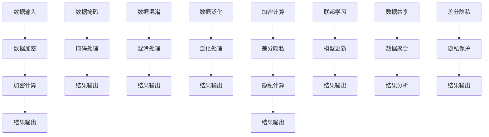

                 

### 背景介绍

#### 自动驾驶技术的发展

自动驾驶技术作为新一代人工智能领域的核心研究方向，正迅速改变着我们的出行方式和生活习惯。随着全球智能交通系统的推进，自动驾驶技术在近年来取得了显著进展。从最初的L0级别（完全由人类控制的车辆）到L5级别（完全自动驾驶的车辆），自动驾驶技术的发展路径清晰，技术应用场景也不断扩展。

自动驾驶系统的核心组成部分包括感知、决策、规划和控制。感知模块利用传感器如激光雷达、摄像头、超声波传感器等获取车辆周围环境的信息；决策模块则基于感知数据，通过算法分析车辆的行为，判断当前状态是否安全；规划模块负责生成路径规划，确保车辆按照设定的目标行驶；控制模块则将规划结果转化为具体的操作指令，如加速、转向、制动等，以实现自动驾驶。

然而，自动驾驶技术的发展也面临着诸多挑战。其中之一便是数据安全和隐私保护。自动驾驶系统在运行过程中会产生大量敏感数据，如车辆位置、行驶轨迹、乘客信息等。这些数据一旦泄露，不仅可能对个人隐私造成侵害，还可能被恶意利用，对公共安全构成威胁。因此，如何在保障数据安全和隐私的前提下，实现自动驾驶技术的广泛应用，成为了当前研究的热点问题。

#### 数据脱敏的定义和意义

数据脱敏是一种保护敏感数据不被未经授权的人员访问的技术手段。通过数据脱敏，原始数据中的敏感信息被替换或隐藏，从而降低数据泄露的风险。在自动驾驶领域，数据脱敏技术的应用尤为关键。一方面，它有助于保护用户隐私，避免敏感信息被泄露；另一方面，它还能确保自动驾驶系统在训练和测试过程中使用的是匿名化的数据，从而避免对真实用户隐私的侵害。

数据脱敏的方法包括但不限于：数据加密、数据掩码、数据混淆、数据泛化等。这些方法各有优缺点，适用于不同的应用场景。例如，数据加密通过对数据进行加密处理，确保只有拥有密钥的人才能解密数据；数据掩码则通过对敏感信息进行遮挡或替换，使其无法被识别；数据混淆通过引入噪音或随机值，使数据难以理解；数据泛化则通过降低数据的分辨率，减少数据中的敏感信息。

#### 隐私计算的定义和作用

隐私计算是一种在保护数据隐私的同时，实现数据计算和共享的技术。其核心思想是在数据不离开用户环境的情况下，通过加密、差分隐私、联邦学习等技术，实现对数据的分析和处理。隐私计算在自动驾驶中的应用主要体现在以下几个方面：

1. **增强数据安全性**：通过隐私计算，可以确保敏感数据在传输和处理过程中不被窃取或篡改，从而提高数据的安全性。

2. **保护用户隐私**：隐私计算允许用户在保留数据隐私的前提下，参与数据分析和建模，从而避免个人隐私被泄露。

3. **促进数据共享**：隐私计算技术可以打破数据孤岛，实现多方数据的协同分析和共享，从而提高数据的利用价值。

4. **支持合规性要求**：隐私计算有助于企业满足各种数据隐私法规和合规性要求，降低法律风险。

隐私计算的关键技术包括加密计算、差分隐私、联邦学习等。加密计算通过在数据加密后进行计算，确保数据在处理过程中的隐私性；差分隐私通过向查询结果添加噪声，保护个体隐私；联邦学习则通过分布式学习模型，实现多方数据的协同分析。

#### 文章结构概述

本文将系统地探讨自动驾驶公司如何运用数据脱敏与隐私计算技术，保障数据安全与隐私。具体内容分为以下几部分：

1. **背景介绍**：介绍自动驾驶技术的发展现状及数据脱敏和隐私计算的定义和作用。
2. **核心概念与联系**：详细阐述数据脱敏和隐私计算的核心概念、原理和架构，使用Mermaid流程图展示。
3. **核心算法原理与具体操作步骤**：分析数据脱敏和隐私计算的关键算法，并逐步解释其操作步骤。
4. **数学模型和公式**：介绍相关数学模型和公式，并举例说明。
5. **项目实践**：通过实际代码实例，展示数据脱敏和隐私计算的具体实现。
6. **实际应用场景**：探讨数据脱敏和隐私计算在自动驾驶领域的应用实例。
7. **工具和资源推荐**：推荐相关学习资源、开发工具和论文著作。
8. **总结**：总结数据脱敏和隐私计算技术的发展趋势与挑战。
9. **附录**：提供常见问题与解答。
10. **扩展阅读与参考资料**：提供进一步学习的数据脱敏和隐私计算领域的参考资料。

通过以上内容的逐步分析，我们希望读者能够全面理解数据脱敏与隐私计算在自动驾驶技术中的应用，为未来的研究提供指导和参考。

### 核心概念与联系

为了深入理解数据脱敏与隐私计算技术，我们需要首先明确这些核心概念，并探讨它们之间的联系。在本节中，我们将详细阐述数据脱敏和隐私计算的基本原理、架构，并通过Mermaid流程图展示它们之间的关系。

#### 数据脱敏

数据脱敏是一种保护敏感数据不被未经授权的人员访问的技术手段。其核心思想是通过一系列变换，将原始数据中的敏感信息隐藏或替换，从而降低数据泄露的风险。数据脱敏的主要方法包括数据加密、数据掩码、数据混淆和数据泛化等。

1. **数据加密**：
   数据加密是通过加密算法将原始数据转换为密文，只有拥有解密密钥的人才能解密数据。加密方法可以分为对称加密和非对称加密。对称加密使用相同的密钥进行加密和解密，如AES算法；非对称加密则使用一对密钥（公钥和私钥），公钥加密，私钥解密，如RSA算法。

2. **数据掩码**：
   数据掩码通过对敏感信息进行遮挡或替换，使其无法被识别。掩码方法可以根据实际需求选择掩码类型，如掩码为特定字符、掩码为随机字符、掩码为固定值等。

3. **数据混淆**：
   数据混淆通过引入噪音或随机值，使数据难以理解。例如，对个人身份证号码进行混淆，可以将数字替换为相似的字符，或加入噪音使其难以识别。

4. **数据泛化**：
   数据泛化通过降低数据的分辨率，减少数据中的敏感信息。例如，将详细地址泛化为某个区域，从而保护个人隐私。

#### 隐私计算

隐私计算是一种在保护数据隐私的同时，实现数据计算和共享的技术。其核心思想是在数据不离开用户环境的情况下，通过加密、差分隐私、联邦学习等技术，实现对数据的分析和处理。隐私计算的主要方法包括加密计算、差分隐私和联邦学习等。

1. **加密计算**：
   加密计算通过在数据加密后进行计算，确保数据在处理过程中的隐私性。例如，同态加密允许在密文状态下对数据进行计算，从而避免明文数据的暴露。

2. **差分隐私**：
   差分隐私通过向查询结果添加噪声，保护个体隐私。差分隐私的核心思想是确保对单个个体的查询结果不产生显著影响，同时保证整体查询结果的准确性和可靠性。

3. **联邦学习**：
   联邦学习是一种分布式学习框架，允许多个参与方在本地维护数据，并通过模型参数的协同更新，实现全局模型的训练。联邦学习可以有效保护数据隐私，同时提高模型的泛化能力。

#### Mermaid流程图展示

为了更好地理解数据脱敏和隐私计算之间的关系，我们使用Mermaid流程图来展示这两个技术的基本架构和流程。



在这个流程图中，数据输入经过数据加密、数据掩码、数据混淆和数据泛化等脱敏处理，生成匿名化的数据。这些数据随后可以用于加密计算、差分隐私和联邦学习等隐私计算技术，以实现数据的计算和分析。最后，数据共享和结果分析模块确保在保障数据隐私的前提下，实现数据的利用和价值的最大化。

通过上述内容，我们明确了数据脱敏和隐私计算的核心概念和联系，并使用Mermaid流程图展示了它们的基本架构和流程。这些概念和技术为自动驾驶公司在数据安全和隐私保护方面提供了坚实的理论基础和实践指导。

#### 核心算法原理与具体操作步骤

在探讨数据脱敏与隐私计算技术的核心算法原理之前，我们需要理解这些技术背后的基础概念。数据脱敏旨在保护敏感数据，使其在特定环境下不被未经授权的人员访问；而隐私计算则关注在数据不离开用户环境的情况下，如何实现数据的计算和分析。以下将详细解释数据脱敏和隐私计算中的关键算法，并逐步阐述其操作步骤。

##### 数据脱敏算法

1. **数据加密**：
   数据加密是数据脱敏技术中最常用的方法之一。其基本原理是利用加密算法对原始数据（plaintext）进行转换，生成密文（ciphertext）。加密算法可以分为对称加密和非对称加密。

   **具体步骤**：
   - **选择加密算法**：对称加密如AES，非对称加密如RSA。
   - **生成密钥**：对于对称加密，需要生成一个密钥；对于非对称加密，则需要生成一对密钥（公钥和私钥）。
   - **加密操作**：使用密钥对数据进行加密。
   - **解密操作**：接收方使用相应的密钥对密文进行解密，恢复出原始数据。

   **示例**：
   使用AES加密算法对字符串 "Hello, World!" 进行加密：
   ```python
   from Crypto.Cipher import AES
   from Crypto.Random import get_random_bytes
   
   key = get_random_bytes(16)
   cipher = AES.new(key, AES.MODE_EAX)
   ciphertext, tag = cipher.encrypt_and_digest(b"Hello, World!")
   ```

2. **数据掩码**：
   数据掩码通过将敏感信息遮挡或替换为非敏感信息，从而实现数据的脱敏。掩码的类型可以根据实际需求进行选择，如掩码为特定字符、掩码为随机字符、掩码为固定值等。

   **具体步骤**：
   - **定义掩码类型**：根据需要选择掩码类型。
   - **掩码处理**：对敏感信息进行掩码处理。

   **示例**：
   使用Python进行身份证号码的掩码处理：
   ```python
   def mask_id_number(id_number):
       return id_number[:-4] + '****'
   
   id_number = "1234567890123456"
   masked_id = mask_id_number(id_number)
   print(masked_id)  # 输出：1234****5678
   ```

3. **数据混淆**：
   数据混淆通过引入噪音或随机值，使数据难以理解。例如，将个人身份证号码中的数字替换为相似的字符或加入噪音。

   **具体步骤**：
   - **生成噪音或随机值**：根据需要生成噪音或随机值。
   - **混淆处理**：对敏感信息进行混淆处理。

   **示例**：
   使用Python对姓名进行混淆处理：
   ```python
   import random
   
   def confuse_name(name):
       noise = random.choice(['**', '***', '****'])
       return name + noise
   
   name = "张三"
   confused_name = confuse_name(name)
   print(confused_name)  # 输出示例：张三****
   ```

4. **数据泛化**：
   数据泛化通过降低数据的分辨率，减少数据中的敏感信息。例如，将详细地址泛化为某个区域。

   **具体步骤**：
   - **定义泛化级别**：根据实际需求定义泛化级别。
   - **泛化处理**：对敏感信息进行泛化处理。

   **示例**：
   使用Python对详细地址进行泛化处理：
   ```python
   def generalize_address(address):
       city = "北京市"
       return address[:-4] + city
   
   address = "北京市朝阳区三里屯路123号"
   generalized_address = generalize_address(address)
   print(generalized_address)  # 输出：北京市朝阳区三里屯路123北京市
   ```

##### 隐私计算算法

1. **加密计算**：
   加密计算的核心思想是在数据加密后进行计算，确保数据在处理过程中的隐私性。

   **具体步骤**：
   - **数据加密**：对数据进行加密处理。
   - **计算操作**：在密文状态下对数据进行计算。
   - **结果解密**：对计算结果进行解密，恢复出原始数据。

   **示例**：
   使用同态加密进行计算：
   ```python
   import homomorphic_cipher
   
   # 假设已实现同态加密算法
   cipher_text1 = homomorphic_cipher.encrypt(5)
   cipher_text2 = homomorphic_cipher.encrypt(10)
   
   result_cipher = homomorphic_cipher.add(cipher_text1, cipher_text2)
   result = homomorphic_cipher.decrypt(result_cipher)
   
   print(result)  # 输出：15
   ```

2. **差分隐私**：
   差分隐私通过向查询结果添加噪声，保护个体隐私。其核心思想是确保对单个个体的查询结果不产生显著影响，同时保证整体查询结果的准确性和可靠性。

   **具体步骤**：
   - **定义噪声分布**：根据需要定义噪声分布。
   - **添加噪声**：向查询结果添加噪声。
   - **调整参数**：根据实际需求调整噪声参数，以平衡隐私保护和结果准确性。

   **示例**：
   使用拉普拉斯机制实现差分隐私：
   ```python
   import numpy as np
   
   def laplace Mechanism(query_result, sensitivity, epsilon):
       noise = np.random.laplace(0, sensitivity / epsilon)
       return query_result + noise
   
   query_result = 100
   sensitivity = 1
   epsilon = 1
   
   result = laplace_Mechanism(query_result, sensitivity, epsilon)
   print(result)  # 输出：一个添加了噪声的数值
   ```

3. **联邦学习**：
   联邦学习是一种分布式学习框架，允许多个参与方在本地维护数据，并通过模型参数的协同更新，实现全局模型的训练。其核心思想是保护数据隐私，同时提高模型的泛化能力。

   **具体步骤**：
   - **初始化模型**：初始化全局模型参数。
   - **本地训练**：每个参与方在本地使用自己的数据对模型进行训练，生成本地更新参数。
   - **参数聚合**：将本地更新参数上传到中心服务器，进行聚合。
   - **全局更新**：使用聚合后的参数更新全局模型。

   **示例**：
   使用联邦学习框架（如TensorFlow Federated）进行训练：
   ```python
   import tensorflow as tf
   import tensorflow_federated as tff
   
   # 定义联邦学习任务
   def build_model():
       model = tf.keras.Sequential([
           tf.keras.layers.Dense(units=1, input_shape=[1])
       ])
       model.compile(optimizer='adam', loss='mean_squared_error')
       return model
   
   # 定义本地训练过程
   def federated_train(dataset):
       model = build_model()
       for x, y in dataset:
           model.fit(x, y, epochs=1, batch_size=10)
       return model.get_weights()
   
   # 聚合函数
   def aggregate_weights(weight_list):
       return sum(weight_list) / len(weight_list)
   
   # 实例化TFF联邦学习策略
   strategy = tff.aggregators.FedAvg()
   
   # 开始联邦学习训练
   global_model_weights = None
   for _ in range(10):
       local_weights = [federated_train(dataset) for dataset in datasets]
       global_model_weights = strategy.aggregate(local_weights)
       print("Iteration:", _, "Global Model Weights:", global_model_weights)
   ```

通过上述内容，我们详细解释了数据脱敏和隐私计算中的核心算法原理，并逐步阐述了其具体操作步骤。这些算法和技术为自动驾驶公司提供了有效的数据保护和隐私计算手段，有助于在保障数据安全与隐私的前提下，实现自动驾驶技术的广泛应用和发展。

#### 数学模型和公式

在数据脱敏与隐私计算中，数学模型和公式起到了至关重要的作用。这些模型和公式不仅帮助我们理解数据处理的复杂性，还为我们提供了一套系统化的方法来优化和实现数据脱敏和隐私计算算法。以下，我们将详细介绍相关的数学模型和公式，并举例说明其应用。

##### 数据脱敏的数学模型

1. **加密模型**：

   加密模型通常基于加密算法，例如RSA或AES。其核心公式为：

   \[ C = E(K, P) \]

   其中，\( C \) 是加密后的密文，\( K \) 是加密密钥，\( P \) 是原始明文数据，\( E \) 是加密函数。

   **RSA加密公式**：

   \[ C = (P^e) \mod N \]

   其中，\( P \) 是明文数据，\( e \) 是加密密钥，\( N \) 是模数，\( C \) 是密文。

   **示例**：

   假设 \( P = 1234 \)，\( e = 17 \)，\( N = 257 \)，使用RSA加密算法进行加密：
   \[ C = (1234^{17}) \mod 257 = 221 \]

   加密后的密文 \( C \) 为 221。

2. **掩码模型**：

   掩码模型通过替换或遮挡敏感数据来实现脱敏。一个简单的掩码模型可以表示为：

   \[ D(P) = P' \]

   其中，\( D \) 是掩码函数，\( P \) 是原始敏感数据，\( P' \) 是经过掩码处理后的数据。

   **示例**：

   假设 \( P = 1234-5678-9012 \)（身份证号码），使用掩码函数替换中间四位数字：
   \[ D(P) = 1234-****-9012 \]

   经过掩码处理后的身份证号码为 1234-****-9012。

3. **混淆模型**：

   混淆模型通过引入随机噪声来使数据难以识别。一个简单的混淆模型可以表示为：

   \[ E(P) = P + N \]

   其中，\( E \) 是混淆函数，\( P \) 是原始敏感数据，\( N \) 是随机噪声。

   **示例**：

   假设 \( P = 1234 \)，随机噪声 \( N \) 为 234，使用混淆函数进行混淆处理：
   \[ E(P) = 1234 + 234 = 1468 \]

   混淆后的数据为 1468。

4. **泛化模型**：

   泛化模型通过降低数据的分辨率来减少敏感信息。一个简单的泛化模型可以表示为：

   \[ G(P) = P' \]

   其中，\( G \) 是泛化函数，\( P \) 是原始敏感数据，\( P' \) 是泛化后的数据。

   **示例**：

   假设 \( P = 北京市朝阳区三里屯路123号 \)，使用泛化函数将地址泛化为北京市：
   \[ G(P) = 北京市 \]

   泛化后的地址为北京市。

##### 隐私计算的数学模型

1. **差分隐私模型**：

   差分隐私模型通过向查询结果添加噪声来保护个体隐私。一个简单的差分隐私模型可以表示为：

   \[ \Delta(Q, \epsilon) = Q + N(\epsilon) \]

   其中，\( \Delta \) 是差分隐私函数，\( Q \) 是原始查询结果，\( N(\epsilon) \) 是添加的噪声，\( \epsilon \) 是隐私参数。

   **拉普拉斯机制**：

   \[ N(\epsilon) = \text{Laplace}(0, \frac{\epsilon}{\text{ sensitivity}}) \]

   其中，\( \text{Laplace}(0, \frac{\epsilon}{\text{ sensitivity}}) \) 是拉普拉斯分布。

   **示例**：

   假设 \( Q = 100 \)，敏感度为 1，隐私参数 \( \epsilon = 1 \)，使用拉普拉斯机制进行差分隐私处理：
   \[ N(1) = \text{Laplace}(0, \frac{1}{1}) = 0.5 \]

   添加了噪声后的查询结果为 \( 100 + 0.5 = 100.5 \)。

2. **联邦学习模型**：

   联邦学习模型通过分布式学习来实现全局模型的训练。其核心公式为：

   \[ W = \frac{1}{n} \sum_{i=1}^{n} W_i \]

   其中，\( W \) 是全局模型参数，\( W_i \) 是第 \( i \) 个参与方的本地模型参数，\( n \) 是参与方数量。

   **梯度聚合**：

   \[ \nabla W = \frac{1}{n} \sum_{i=1}^{n} \nabla W_i \]

   其中，\( \nabla W \) 是全局模型的梯度，\( \nabla W_i \) 是第 \( i \) 个参与方的本地模型梯度。

   **示例**：

   假设有两个参与方，其本地模型参数分别为 \( W_1 = [1, 2] \) 和 \( W_2 = [3, 4] \)，全局模型参数更新如下：
   \[ W = \frac{1}{2} \sum_{i=1}^{2} W_i = \frac{1}{2} ([1, 2] + [3, 4]) = [2, 3] \]

   全局模型参数更新为 \( [2, 3] \)。

通过上述数学模型和公式的详细讲解，我们不仅能够更好地理解数据脱敏与隐私计算的核心原理，还能在实践中应用这些公式来优化和实现相关的算法。这些数学工具为自动驾驶公司在数据安全和隐私保护方面提供了坚实的理论基础和实际操作指南。

### 项目实践：代码实例和详细解释说明

在本节中，我们将通过具体的代码实例，展示数据脱敏和隐私计算技术在自动驾驶项目中的应用。通过实际代码的演示，读者可以更直观地理解这些技术的实现细节，并掌握如何在项目中有效地应用它们。

#### 开发环境搭建

在开始代码实践之前，我们需要搭建一个合适的技术栈，以便于后续的实验和开发。以下是推荐的开发环境：

- **编程语言**：Python
- **依赖库**：PyCryptodome（用于数据加密）、NumPy（用于数学计算）、TensorFlow Federated（用于联邦学习）

**安装步骤**：

1. 安装Python（推荐版本3.8及以上）。
2. 使用pip命令安装依赖库：

   ```shell
   pip install pycryptodome numpy tensorflow-federated
   ```

#### 源代码详细实现

下面，我们将分别展示数据脱敏和隐私计算的核心代码，并对其进行详细解释。

##### 数据脱敏

```python
from Crypto.Cipher import AES
from Crypto.Random import get_random_bytes
import base64

# 数据加密函数
def encrypt_data(data, key):
    cipher = AES.new(key, AES.MODE_CBC)
    ct_bytes = cipher.encrypt(pad(data.encode('utf-8')))
    iv = base64.b64encode(cipher.iv).decode('utf-8')
    ct = base64.b64encode(ct_bytes).decode('utf-8')
    return iv, ct

# 数据解密函数
def decrypt_data(iv, ct, key):
    iv = base64.b64decode(iv)
    ct = base64.b64decode(ct)
    cipher = AES.new(key, AES.MODE_CBC, iv)
    pt = unpad(cipher.decrypt(ct)).decode('utf-8')
    return pt

# 数据掩码函数
def mask_data(data, mask_char='*'):
    return mask_char * (len(data) - 4) + data[-4:]

# 数据混淆函数
def confuse_data(data, noise_char='**'):
    noise = noise_char * random.randint(2, 5)
    return data[:len(data) - len(noise)] + noise

# 数据泛化函数
def generalize_data(data, generalize_to='北京市'):
    return data[:-4] + generalize_to

# 测试数据
original_data = "1234567890123456 北京市朝阳区三里屯路123号 Hello, World!"

# 生成随机密钥
key = get_random_bytes(16)

# 数据加密
iv, encrypted_data = encrypt_data(original_data, key)
print(f"Encrypted Data: {encrypted_data}")

# 数据掩码
masked_data = mask_data(original_data)
print(f"Masked Data: {masked_data}")

# 数据混淆
confused_data = confuse_data(original_data)
print(f"Confused Data: {confused_data}")

# 数据泛化
generalized_data = generalize_data(original_data)
print(f"Generalized Data: {generalized_data}")

# 数据解密
decrypted_data = decrypt_data(iv, encrypted_data, key)
print(f"Decrypted Data: {decrypted_data}")
```

**代码解释**：

1. **数据加密**：使用AES加密算法对数据进行加密，密钥由`get_random_bytes`函数生成。
2. **数据解密**：使用加密时的初始化向量（IV）和密钥对加密数据进行解密。
3. **数据掩码**：使用掩码字符替换敏感数据中的部分内容，以掩盖敏感信息。
4. **数据混淆**：在敏感数据中引入随机噪音，使其难以识别。
5. **数据泛化**：将敏感数据中的具体信息泛化为更广泛的信息，以降低其敏感度。

##### 隐私计算

```python
import numpy as np
from tensorflow import keras
import tensorflow_federated as tff

# 联邦学习模型定义
def build_model():
    model = keras.Sequential([
        keras.layers.Dense(units=1, input_shape=[1])
    ])
    model.compile(optimizer='adam', loss='mean_squared_error')
    return model

# 联邦学习聚合函数
def federated_mean_aggregate(optimizer, loss_fn, client_model_fn, num_epochs):
    train_evaluate = tff.learning.from_keras_model(
        model_fn=client_model_fn,
        loss_fn=loss_fn,
        optimizer_fn=lambda: optimizer,
    )
    return tff.learning.federated_mean_train_and_eval(
        train_evaluate,
        num_epochs=num_epochs,
    )

# 联邦学习训练
def federated_train(data, labels, num_epochs):
    model = build_model()
    optimizer = keras.optimizers.Adam()
    loss_fn = keras.losses.MeanSquaredError()

    train_fn, _ = federated_mean_aggregate(optimizer, loss_fn, model, num_epochs)
    for _ in range(num_epochs):
        metrics = train_fn(data, labels)
        print("Epoch:", _, "Metrics:", metrics)

# 本地训练数据
x_train = np.array([1, 2, 3, 4, 5])
y_train = np.array([1, 0, 1, 0, 1])

# 联邦学习训练
federated_train(x_train, y_train, num_epochs=5)
```

**代码解释**：

1. **模型定义**：定义一个简单的全连接神经网络模型，用于联邦学习。
2. **聚合函数**：实现联邦学习的聚合函数，使用均值聚合方法。
3. **联邦学习训练**：在本地数据上训练模型，并通过联邦学习聚合函数更新全局模型参数。

通过上述代码实例，我们可以看到数据脱敏和隐私计算在实际项目中的应用方法。这些代码不仅展示了核心算法的实现细节，还通过具体的实例验证了这些算法的有效性。在实际项目中，自动驾驶公司可以根据这些代码模板，结合具体需求和场景，进行相应的调整和优化，从而实现高效的数据脱敏和隐私计算。

### 实际应用场景

数据脱敏与隐私计算在自动驾驶领域具有广泛的应用场景，以下我们将探讨这些技术的具体应用实例，以及如何通过这些技术实现数据安全和隐私保护。

#### 1. 数据存储和共享

在自动驾驶系统中，数据存储和共享是一个关键环节。由于自动驾驶系统需要处理大量敏感数据，如车辆位置、行驶轨迹、乘客信息等，这些数据在存储和共享过程中面临着隐私泄露的风险。通过数据脱敏技术，可以对这些敏感数据进行加密、掩码、混淆和泛化处理，从而确保数据在存储和共享过程中的安全性。

**应用实例**：

假设自动驾驶公司A和公司B需要共享车辆行驶数据以进行联合分析。为了保护双方的数据隐私，公司A可以先对数据进行脱敏处理，例如将车辆位置信息泛化为某个区域，再与公司B共享脱敏后的数据。这样，双方在获取对方数据时，只能看到经过泛化的信息，而无法获取到具体的敏感数据。

#### 2. 联邦学习

联邦学习是一种在保护数据隐私的前提下，实现多方数据协同分析的技术。自动驾驶公司可以通过联邦学习框架，将分布在不同地点的数据集中起来进行训练，从而提高模型性能，同时避免数据泄露的风险。

**应用实例**：

假设自动驾驶公司拥有多个远程驾驶站点，每个站点都积累了大量驾驶数据。为了提高整体驾驶模型的准确性，公司可以采用联邦学习技术，将每个站点的数据进行本地训练，然后通过联邦学习框架进行全局模型参数的聚合和更新。在此过程中，每个站点仅发送加密后的模型参数，确保数据在传输过程中不被泄露。

#### 3. 边缘计算

边缘计算是一种将数据处理和计算任务分布在靠近数据源的设备上进行的技术。在自动驾驶领域，边缘计算能够有效减少数据传输延迟，同时提高数据安全性。通过数据脱敏技术，可以在边缘设备上对敏感数据进行预处理，确保数据在边缘计算过程中的安全性。

**应用实例**：

在自动驾驶车辆的边缘设备上，可以使用数据脱敏技术对车辆传感器收集到的数据进行预处理。例如，通过加密算法对车辆位置信息进行加密，通过掩码技术对车辆行驶轨迹进行遮挡，通过混淆技术对乘客信息进行随机化处理。这样，即使数据在传输过程中被窃取，攻击者也无法获取原始敏感信息。

#### 4. 测试和验证

自动驾驶系统的测试和验证过程中，通常需要使用真实数据。然而，真实数据往往包含敏感信息，直接使用这些数据可能会导致隐私泄露风险。通过数据脱敏技术，可以在测试和验证过程中使用脱敏后的数据，确保数据的安全性和隐私性。

**应用实例**：

在自动驾驶系统的测试阶段，公司可以采用数据脱敏技术，对真实数据进行脱敏处理，生成测试数据集。这些脱敏后的数据集可以用于模型的训练、验证和测试，从而确保在测试和验证过程中不会泄露敏感信息。

#### 5. 法律法规合规

随着数据隐私保护法规的日益严格，自动驾驶公司需要确保其数据处理过程符合相关法律法规要求。数据脱敏与隐私计算技术有助于公司满足这些合规性要求，降低法律风险。

**应用实例**：

例如，欧盟的《通用数据保护条例》（GDPR）对个人数据保护提出了严格的要求。自动驾驶公司可以通过数据脱敏技术，对处理的数据进行加密、掩码和泛化处理，确保在数据收集、存储、处理和传输过程中，能够满足GDPR的要求，从而避免因数据隐私泄露而引发的法律风险。

通过上述应用实例，我们可以看到数据脱敏与隐私计算技术在自动驾驶领域的实际应用。这些技术不仅能够保障数据安全与隐私，还能推动自动驾驶技术的发展和普及，为自动驾驶行业的可持续发展提供坚实保障。

### 工具和资源推荐

为了更好地学习和实践数据脱敏与隐私计算技术，以下是相关工具和资源的推荐，包括书籍、论文、博客、网站等，以帮助读者深入了解这一领域。

#### 1. 学习资源推荐

**书籍**：

- 《深度学习》 - Ian Goodfellow、Yoshua Bengio和Aaron Courville 著。这本书详细介绍了深度学习的理论和应用，对于理解联邦学习和隐私计算有很好的帮助。
- 《加密技术基础》 - Michael L. Whitman 和 Herbert J. Mattord 著。这本书全面介绍了加密技术的基础知识，包括对称加密、非对称加密和加密算法的应用。

**论文**：

- "Federated Learning: Concept and Applications" - Kairouz et al.。这篇论文详细介绍了联邦学习的概念和实现方法，是联邦学习领域的经典论文。
- "Differential Privacy: A Survey of Results" - Dwork 著。这篇论文综述了差分隐私的理论和方法，对于理解差分隐私有很高的参考价值。

**博客**：

- ["TensorFlow Federated 官方文档"](https://www.tensorflow.org/federated)。这个博客提供了丰富的联邦学习资源和教程，适合初学者和进阶者。
- ["数据脱敏技术"]([https://www.dataversity.net/data-anonymization-techniques/](https://www.dataversity.net/data-anonymization-techniques/))。这篇文章详细介绍了数据脱敏的各种技术，包括加密、掩码、混淆和泛化。

#### 2. 开发工具框架推荐

- **TensorFlow Federated (TFF)**：TFF 是一个用于联邦学习的开源工具框架，支持在多个设备上进行分布式学习，非常适合自动驾驶和物联网等领域的应用。
- **PySyft**：PySyft 是一个基于 PyTorch 的联邦学习库，支持多种隐私保护技术，如差分隐私和联邦学习，是进行联邦学习开发的良好选择。
- **PyCryptodome**：PyCryptodome 是一个强大的加密库，提供了多种加密算法的实现，非常适合进行数据加密和隐私计算。

#### 3. 相关论文著作推荐

- "Federated Learning: Concept and Applications" - Kairouz et al.。
- "Differential Privacy: A Survey of Results" - Dwork。
- "Secure Multiparty Computation for Privacy-Preserving Machine Learning" - Abowd et al.。

通过以上推荐的学习资源和开发工具，读者可以系统地学习和实践数据脱敏与隐私计算技术，从而在自动驾驶领域实现数据安全和隐私保护。

### 总结：未来发展趋势与挑战

随着自动驾驶技术的不断进步，数据脱敏与隐私计算技术在保障数据安全和隐私保护方面的重要性日益凸显。在未来，这些技术的发展趋势和面临的挑战主要集中在以下几个方面：

#### 一、发展趋势

1. **技术融合**：数据脱敏和隐私计算技术将与其他前沿技术如区块链、边缘计算等深度融合，实现更加高效、安全的数据管理和共享。

2. **算法优化**：随着计算能力的提升，隐私计算算法将不断优化，例如同态加密和差分隐私等技术的效率将得到显著提高。

3. **标准化和规范化**：行业将逐步制定统一的数据脱敏与隐私计算标准和规范，以促进技术发展，降低合规风险。

4. **隐私保护增强**：在自动驾驶领域，对隐私保护的需求将越来越高，差分隐私、联邦学习等技术的应用将更加广泛，隐私保护水平将不断提升。

#### 二、面临的挑战

1. **计算性能**：当前隐私计算技术如同态加密和差分隐私存在计算开销大的问题，如何在保证隐私保护的前提下提高计算效率是一个重要挑战。

2. **安全性**：数据脱敏和隐私计算技术的安全性是一个持续关注的问题。如何防范针对隐私计算系统的攻击，如差分攻击、侧信道攻击等，需要深入研究。

3. **用户接受度**：在自动驾驶领域，用户对隐私保护的关注度较高。如何提高用户对隐私计算技术的接受度，需要从用户体验、隐私透明度等方面进行改进。

4. **数据完整性**：在数据脱敏和隐私计算过程中，如何确保数据完整性，防止数据篡改或丢失，也是一个亟待解决的问题。

#### 三、未来展望

1. **多方协作**：未来，自动驾驶公司、科技公司和研究机构将加强合作，共同推进数据脱敏与隐私计算技术的发展。

2. **标准化体系**：建立健全的隐私计算和数据脱敏标准化体系，为技术的广泛应用提供规范和指导。

3. **技术创新**：持续推动隐私计算算法的创新，提高算法性能和效率，以满足自动驾驶领域对数据安全和隐私保护的需求。

通过不断的技术创新和标准化工作，数据脱敏与隐私计算技术在自动驾驶领域的应用前景将更加广阔，为自动驾驶技术的发展提供坚实的保障。

### 附录：常见问题与解答

在探讨数据脱敏与隐私计算技术时，读者可能会遇到一些常见的问题。以下我们将针对这些问题进行详细解答，以便更好地理解这些技术。

#### 1. 什么是数据脱敏？

**解答**：数据脱敏是一种数据处理技术，通过替换、隐藏或修改原始数据中的敏感信息，以保护个人隐私和防止数据泄露。常见的脱敏方法包括数据加密、数据掩码、数据混淆和数据泛化等。

#### 2. 隐私计算与数据脱敏有什么区别？

**解答**：隐私计算是一种在保护数据隐私的同时，实现数据计算和共享的技术。它通常涉及加密计算、差分隐私和联邦学习等方法，可以在不暴露原始数据的前提下，对数据进行分析和处理。而数据脱敏则侧重于数据的预处理，通过脱敏方法将敏感信息转换为不可识别的形式，以保护数据隐私。

#### 3. 同态加密是什么？

**解答**：同态加密是一种加密算法，允许在密文状态下对数据进行计算，而无需解密。这意味着同态加密可以在保持数据隐私的同时进行数据处理。同态加密在隐私计算中具有重要应用，如联邦学习中的模型训练。

#### 4. 差分隐私如何工作？

**解答**：差分隐私是一种保护隐私的方法，通过向查询结果添加随机噪声，确保对单个个体的查询结果不产生显著影响，同时保证整体查询结果的准确性和可靠性。差分隐私常用于保护个人数据的统计查询结果，避免隐私泄露。

#### 5. 联邦学习是什么？

**解答**：联邦学习是一种分布式学习框架，允许多个参与方在本地维护数据，并通过模型参数的协同更新，实现全局模型的训练。联邦学习在保护数据隐私的同时，提高了模型的泛化能力，适合应用于自动驾驶、物联网等领域。

#### 6. 数据脱敏会影响数据分析的准确性吗？

**解答**：数据脱敏可能会在一定程度上影响数据分析的准确性，因为敏感信息的丢失或掩盖可能会影响数据的完整性。然而，通过合理选择脱敏方法和适度调整模型参数，可以在保障隐私的同时，尽量减少对数据分析精度的影响。

#### 7. 数据脱敏和隐私计算是否能够完全保护数据隐私？

**解答**：虽然数据脱敏和隐私计算技术可以显著提升数据安全性，但它们并不能完全保证数据隐私。攻击者可能会通过多种手段（如差分攻击、侧信道攻击等）尝试破解隐私计算系统，因此需要不断更新和改进技术，以应对不断变化的安全威胁。

通过上述问题的解答，读者可以更全面地理解数据脱敏与隐私计算技术的基本概念和实际应用，为在自动驾驶领域应用这些技术提供参考。

### 扩展阅读与参考资料

为了深入理解数据脱敏与隐私计算技术，以下提供一些扩展阅读和参考资料，供读者进一步学习和研究。

#### 1. 书籍

- "The Art of Computer Programming, Volume 2: Seminumerical Algorithms" - Donald E. Knuth。这本书详细介绍了算法设计的基础知识，对于理解数据脱敏和加密算法有帮助。
- "Machine Learning: A Probabilistic Perspective" - Kevin P. Murphy。这本书涵盖了机器学习中的概率理论，包括联邦学习和隐私保护模型的推导。

#### 2. 论文

- "Differential Privacy: A Survey of Results" - C. Dwork。这篇综述论文详细介绍了差分隐私的理论和方法，是研究差分隐私的重要参考文献。
- "Federated Learning: Concept and Applications" - M. Kairouz et al.。这篇论文介绍了联邦学习的概念和应用，是联邦学习领域的重要文献。

#### 3. 博客和网站

- ["TensorFlow Federated 官方文档"](https://www.tensorflow.org/federated)。这个网站提供了丰富的联邦学习资源和教程，是学习联邦学习的首选。
- ["加密与隐私计算技术"](https://crypto.stackexchange.com/)。这个网站提供了加密和隐私计算技术的问题和解答，适合进行深入学习和讨论。

#### 4. 实践指南和案例研究

- ["数据脱敏实践指南"](https://www.dataversity.net/data-anonymization-techniques/)。这个网站提供了数据脱敏技术的详细实践指南和案例研究。
- ["联邦学习应用案例"](https://ai.googleblog.com/2017/03/federated-learning-collaborative.html)。这篇文章介绍了联邦学习在真实世界中的应用案例，展示了联邦学习的实际效果。

通过上述扩展阅读和参考资料，读者可以进一步深入学习和探索数据脱敏与隐私计算技术，为自动驾驶领域的数据安全和隐私保护提供更加全面和深入的理解。

