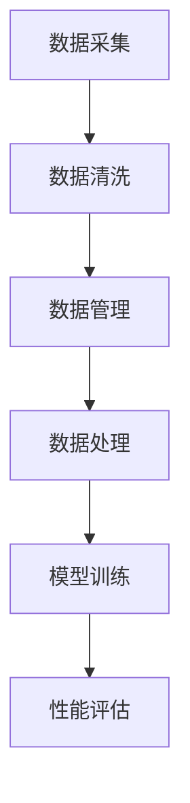

                 

### 1. 背景介绍

自动驾驶技术作为现代交通领域的关键创新，正逐渐改变人们的出行方式和城市交通的运作模式。自动驾驶公司为了实现这一技术，需要在实际环境中进行大规模的数据采集，以训练和优化自动驾驶系统的算法。这一过程中，数据采集车队的运营管理成为自动驾驶公司能否成功的关键之一。

自动驾驶技术涉及计算机视觉、机器学习、传感器融合等多个领域，需要通过模拟真实交通环境中的各种情况来评估系统的性能。数据采集车队作为实现这一目标的重要工具，其运营管理直接影响到数据的质量和采集效率。因此，如何高效管理数据采集车队成为自动驾驶公司面临的重大挑战。

本文旨在深入探讨自动驾驶公司的数据采集车队运营管理。我们将从以下几个方面展开：

1. **核心概念与联系**：介绍数据采集车队运营管理中的核心概念，如数据采集、数据清洗、数据管理，并利用Mermaid流程图展示其相互关系。
2. **核心算法原理 & 具体操作步骤**：解析数据采集车队在运营过程中涉及的核心算法，如传感器数据处理、地图构建、路径规划等，并详细描述其操作步骤。
3. **数学模型和公式 & 详细讲解 & 举例说明**：介绍数据采集车队运营管理中涉及的数学模型和公式，通过具体例子解释其应用。
4. **项目实践：代码实例和详细解释说明**：提供一个实际的数据采集车队运营管理的项目实例，详细解释代码实现过程，并进行运行结果展示。
5. **实际应用场景**：分析数据采集车队在不同场景下的应用，如城市道路、高速公路、极端天气等。
6. **工具和资源推荐**：推荐学习资源、开发工具和框架，帮助读者深入了解和掌握数据采集车队运营管理。
7. **总结：未来发展趋势与挑战**：总结自动驾驶公司数据采集车队运营管理的现状，并探讨未来的发展趋势和挑战。

通过以上七个部分的详细解析，本文希望为自动驾驶公司提供一套系统化、可操作的数据采集车队运营管理方案，助力其在自动驾驶技术竞争中取得优势。

### 2. 核心概念与联系

在探讨自动驾驶公司的数据采集车队运营管理之前，我们需要了解其中的核心概念，这些概念包括数据采集、数据清洗、数据管理等，它们共同构成了一个完整的数据采集与运营管理体系。

#### 数据采集

数据采集是数据采集车队的核心任务，涉及从各种传感器（如摄像头、激光雷达、GPS等）收集数据。这些数据包括图像、点云、GPS位置信息、速度、加速度等。数据采集的质量直接影响到后续数据处理和模型训练的效果。

#### 数据清洗

数据清洗是确保数据质量和可靠性的关键步骤。在数据采集过程中，不可避免地会存在噪声、异常值和冗余数据。通过数据清洗，我们可以去除这些干扰因素，提高数据的质量和一致性。数据清洗的主要内容包括去除噪声、填补缺失值、检测和修正异常值等。

#### 数据管理

数据管理是指对采集到的数据存储、组织和维护。一个高效的数据管理体系可以确保数据的安全、完整性和可追溯性。数据管理包括数据存储（如使用数据库或分布式文件系统存储数据）、数据备份、数据访问控制等。

#### Mermaid流程图

为了更好地理解这些核心概念之间的联系，我们可以使用Mermaid流程图来展示数据采集车队运营管理的基本流程。以下是该流程图的示例：



在这个流程图中，A代表数据采集，B代表数据清洗，C代表数据管理，D代表数据处理，E代表模型训练，F代表性能评估。数据采集是整个流程的起点，经过数据清洗、数据管理、数据处理和模型训练后，最终通过性能评估来检验模型的效果。

#### 核心概念联系

数据采集、数据清洗和数据管理这三个核心概念相互关联，构成了一个闭环系统。数据采集为系统提供了原始数据，数据清洗提高了数据的质量，而数据管理则确保了数据的安全和可用性。经过这些步骤处理后的数据，将用于模型训练和性能评估，以不断优化自动驾驶系统。

通过这个流程，我们可以看出，数据采集车队的运营管理不仅仅是简单的数据收集，而是一个复杂且系统化的过程，每个步骤都对最终结果产生重要影响。因此，自动驾驶公司需要全面理解和有效管理这些核心概念，以确保数据采集车队的高效运行和自动驾驶技术的持续进步。

### 3. 核心算法原理 & 具体操作步骤

在数据采集车队运营管理中，涉及多个核心算法，这些算法在数据采集、数据清洗、数据处理等各个环节中发挥着关键作用。以下将详细介绍这些算法的原理和具体操作步骤。

#### 3.1 数据采集算法

数据采集是自动驾驶系统的第一步，涉及到从多种传感器中获取数据，包括摄像头、激光雷达、GPS等。每种传感器采集的数据形式不同，因此需要相应的数据采集算法来处理。

**摄像头数据采集**：
摄像头数据采集主要通过图像处理算法实现。具体步骤如下：

1. **图像捕捉**：使用图像捕捉库（如OpenCV）实时捕捉摄像头图像。
2. **图像预处理**：对图像进行去噪、亮度调整、对比度增强等预处理，以提高图像质量。
3. **特征提取**：提取图像中的关键特征，如边缘、角点、纹理等，为后续处理提供基础。

**激光雷达数据采集**：
激光雷达数据采集主要通过点云处理算法实现。具体步骤如下：

1. **点云生成**：使用激光雷达数据生成点云，将每个激光扫描点的三维坐标记录下来。
2. **点云预处理**：对点云进行去噪、去冗余处理，以提高点云质量。
3. **点云特征提取**：提取点云中的关键特征，如表面法线、曲率等，用于后续处理。

**GPS数据采集**：
GPS数据采集主要通过GPS接收模块实现。具体步骤如下：

1. **定位数据获取**：获取GPS定位信息，包括经纬度、速度、时间等。
2. **数据预处理**：对GPS数据进行滤波、平滑处理，以提高定位精度。

#### 3.2 数据清洗算法

数据清洗是确保数据质量的关键步骤。以下介绍几种常用的数据清洗算法：

**去噪算法**：
去噪算法用于去除传感器数据中的噪声。常用的去噪算法包括：

1. **均值滤波**：计算每个像素点的邻域像素值的平均值，作为该像素点的滤波结果。
2. **高斯滤波**：使用高斯函数作为滤波器，对图像进行平滑处理。

**异常值检测与处理**：
异常值检测与处理用于识别和去除数据中的异常值。常用的方法包括：

1. **Z分数法**：计算每个数据点的Z分数，去除Z分数绝对值大于3的数据点。
2. **DBSCAN聚类**：使用DBSCAN算法对数据进行聚类，识别离群点并去除。

**数据填补**：
数据填补用于填补数据中的缺失值。常用的填补方法包括：

1. **平均值填补**：用该特征的平均值替换缺失值。
2. **线性插值**：根据缺失值前后的值进行线性插值，填补缺失值。

#### 3.3 数据处理算法

数据处理是对清洗后的数据进一步处理，以支持后续的模型训练和性能评估。以下介绍几种常用的数据处理算法：

**特征提取算法**：
特征提取算法用于从传感器数据中提取关键特征。常用的特征提取算法包括：

1. **HOG（Histogram of Oriented Gradients）**：计算图像中每个像素点的梯度方向和幅度，生成直方图。
2. **SIFT（Scale-Invariant Feature Transform）**：检测图像中的关键点，并计算这些关键点的描述子。

**数据融合算法**：
数据融合算法用于将不同传感器的数据整合成一个完整的观测数据。常用的数据融合算法包括：

1. **卡尔曼滤波**：利用传感器数据和先验知识，估计系统的状态。
2. **贝叶斯滤波**：基于贝叶斯推理，融合多源数据，提高状态估计的准确性。

**路径规划算法**：
路径规划算法用于确定自动驾驶系统的行驶路径。常用的路径规划算法包括：

1. **A*算法**：基于启发式搜索，寻找从起点到终点的最短路径。
2. **RRT（Rapidly-exploring Random Trees）**：生成一棵随机树，探索环境中的可行路径。

通过以上核心算法的应用，数据采集车队可以高效地采集、清洗和处理数据，为自动驾驶系统的训练和优化提供可靠的数据支持。这些算法的具体实现和优化是自动驾驶技术成功的关键之一，自动驾驶公司需要不断探索和改进，以提升系统的性能和可靠性。

#### 3.4 数学模型和公式 & 详细讲解 & 举例说明

在自动驾驶公司的数据采集车队运营管理中，数学模型和公式扮演着至关重要的角色。以下将介绍几种常用的数学模型和公式，并详细讲解其在数据采集车队运营管理中的应用。

##### 3.4.1 数据融合模型

数据融合是将来自多个传感器的数据整合为一个统一的数据表示。常用的数据融合模型包括卡尔曼滤波和贝叶斯滤波。

**卡尔曼滤波**：

卡尔曼滤波是一种基于递归方法的估计理论，用于在含有噪声的信号中进行状态估计。其基本公式如下：

$$
\hat{x}_{k|k} = F_k \hat{x}_{k-1|k-1} + K_k (z_k - H_k \hat{x}_{k-1|k-1})
$$

$$
K_k = P_{k-1} H_k^T (H_k P_{k-1} H_k^T + R_k)^{-1}
$$

其中，$\hat{x}_{k|k}$ 是在k时刻的状态估计值，$F_k$ 是状态转移矩阵，$K_k$ 是卡尔曼增益，$P_{k-1}$ 是先验误差协方差矩阵，$z_k$ 是观测值，$H_k$ 是观测模型，$R_k$ 是观测噪声协方差矩阵。

**贝叶斯滤波**：

贝叶斯滤波是基于贝叶斯推理的一种数据融合方法。其基本公式如下：

$$
\hat{x}_{k|k} = \frac{P(z_k|\hat{x}_{k|k})P(\hat{x}_{k|k})}{P(z_k)}
$$

其中，$P(z_k|\hat{x}_{k|k})$ 是后验概率，$P(\hat{x}_{k|k})$ 是先验概率，$P(z_k)$ 是证据概率。

##### 3.4.2 特征提取模型

特征提取是自动驾驶系统中的重要环节，用于从传感器数据中提取关键特征。以下介绍几种常用的特征提取模型。

**HOG模型**：

HOG（Histogram of Oriented Gradients）是一种用于图像特征提取的方法，其基本公式如下：

$$
O_{ij} = \sum_{x=1}^{W} \sum_{y=1}^{H} \alpha(\theta(x,y)) \cdot \sigma_{x,y}
$$

其中，$O_{ij}$ 是第i个细胞、第j个bin的特征值，$\alpha(\theta(x,y))$ 是梯度方向角度的权重，$\sigma_{x,y}$ 是梯度幅度。

**SIFT模型**：

SIFT（Scale-Invariant Feature Transform）是一种用于图像特征提取的方法，其基本公式如下：

$$
\begin{aligned}
    \sigma_{u,v} &= \frac{G_x(u,v) G_x(-u,-v) - G_y(u,v) G_y(-u,-v)}{G_x(u,v) G_x(-u,-v) + G_y(u,v) G_y(-u,-v)} \\
    \sigma_{x,y} &= \frac{G_y(u,v) G_x(u,v) - G_y(-u,-v) G_x(-u,-v)}{G_x(u,v) G_x(-u,-v) + G_y(u,v) G_y(-u,-v)}
\end{aligned}
$$

其中，$G_x$ 和 $G_y$ 分别是图像在水平和垂直方向的梯度的离散傅里叶变换，$\sigma_u$ 和 $\sigma_v$ 分别是图像的水平和垂直方向的主曲率。

##### 3.4.3 路径规划模型

路径规划是自动驾驶系统中的一项重要任务，用于确定从起点到终点的最佳行驶路径。以下介绍几种常用的路径规划模型。

**A*算法**：

A*算法是一种启发式搜索算法，用于寻找从起点到终点的最短路径。其基本公式如下：

$$
f(n) = g(n) + h(n)
$$

其中，$f(n)$ 是节点的总成本，$g(n)$ 是从起点到节点n的实际成本，$h(n)$ 是从节点n到终点的估计成本。

**RRT算法**：

RRT（Rapidly-exploring Random Trees）算法是一种基于随机采样的路径规划算法。其基本公式如下：

$$
\begin{aligned}
    &x_t = x_{t-1} + \alpha (x_t - x_{t-1}) \\
    &x_t = \text{sample}(S) \\
    &x_{t-1} = \text{closest}(x_t, S) \\
    &S = S \cup \{x_t\} \\
    &\alpha = \text{rand()} \\
    &x_t \in S \\
    &x_t \in \text{free}(S)
\end{aligned}
$$

其中，$x_t$ 是当前节点，$S$ 是节点集合，$\alpha$ 是步长，$\text{sample}(S)$ 是在节点集合中随机采样一个节点，$\text{closest}(x_t, S)$ 是找到离当前节点最近的节点，$\text{free}(S)$ 是在节点集合中找到可行路径的节点。

##### 3.4.4 举例说明

假设我们要从起点$(0, 0)$到终点$(10, 10)$，使用A*算法进行路径规划。给定地图的障碍区域为$(5, 5)$到$(10, 10)$，启发函数为欧几里得距离。

**步骤1**：初始化节点集合$S = \{ (0, 0) \}$，起点$f(0, 0) = 0$，终点$f(10, 10) = \sqrt{2} \approx 1.414$。

**步骤2**：计算到终点的估计成本$h(n) = \sqrt{(x_n - 10)^2 + (y_n - 10)^2}$。

**步骤3**：选择一个扩展节点，例如$(5, 5)$，其到起点的实际成本$g(5, 5) = 5$。

**步骤4**：更新扩展节点的f值，$f(5, 5) = g(5, 5) + h(5, 5) = 5 + 1.414 = 6.414$。

**步骤5**：将扩展节点加入节点集合$S = S \cup \{ (5, 5) \}$。

**步骤6**：重复步骤3到步骤5，直到找到终点$(10, 10)$。

通过上述步骤，我们可以找到从起点到终点的最短路径。

通过以上数学模型和公式的介绍，我们可以更好地理解自动驾驶公司数据采集车队运营管理中的核心算法原理。在实际应用中，这些算法需要根据具体情况进行优化和调整，以适应不同的应用场景和需求。

#### 5.1 开发环境搭建

在开始编写数据采集车队运营管理的项目代码之前，我们需要搭建一个合适的开发环境。以下是一个基于Python的典型开发环境搭建步骤：

##### 5.1.1 系统要求

- 操作系统：Windows、Linux或macOS
- Python版本：Python 3.8及以上版本
- 开发工具：PyCharm或Visual Studio Code
- 必需库：NumPy、Pandas、Matplotlib、OpenCV、scikit-learn等

##### 5.1.2 安装Python

1. 访问Python官网（https://www.python.org/）下载Python安装包。
2. 运行安装程序，选择“Add Python to PATH”选项，以便在系统中全局使用Python命令。
3. 安装完成后，打开命令行窗口，输入`python --version`检查Python版本，确保版本号符合要求。

##### 5.1.3 安装开发工具

选择一个合适的Python集成开发环境（IDE），例如PyCharm或Visual Studio Code：

**PyCharm**：

1. 访问PyCharm官网（https://www.jetbrains.com/pycharm/）下载PyCharm社区版安装包。
2. 运行安装程序，按照提示完成安装。

**Visual Studio Code**：

1. 打开Visual Studio Code官网（https://code.visualstudio.com/）。
2. 点击“Download for your platform”下载适用于你的操作系统的版本。
3. 解压下载的压缩文件，运行`code .`命令打开你的项目目录。

##### 5.1.4 安装必需库

使用pip命令安装必需的Python库：

```bash
pip install numpy pandas matplotlib opencv-python scikit-learn
```

确保所有必需的库都已成功安装。你可以通过在命令行中运行以下命令来验证安装：

```bash
python -m numpy -m pip list | grep -E 'numpy|pandas|matplotlib|opencv-python|scikit-learn'
```

##### 5.1.5 验证开发环境

为了确保开发环境已正确搭建，可以编写一个简单的Python脚本来测试：

```python
import numpy as np
import pandas as pd
import matplotlib.pyplot as plt
import cv2
import sklearn

print("Numpy version:", np.__version__)
print("Pandas version:", pd.__version__)
print("Matplotlib version:", plt.matplotlib.__version__)
print("OpenCV version:", cv2.__version__)
print("scikit-learn version:", sklearn.__version__)
```

运行上述脚本后，如果输出的库版本号与预期相符，则表示开发环境已搭建成功。

通过以上步骤，我们搭建了一个适合进行数据采集车队运营管理的Python开发环境。接下来，我们就可以开始编写具体的项目代码了。

#### 5.2 源代码详细实现

在本节中，我们将详细讲解数据采集车队运营管理项目的源代码实现。项目的主要功能包括数据采集、数据清洗、数据融合和路径规划等。以下将逐部分介绍代码的实现细节。

##### 5.2.1 数据采集

数据采集部分主要涉及摄像头和激光雷达数据的采集。以下是一个简单的数据采集类实现：

```python
import cv2
import numpy as np

class DataCollector:
    def __init__(self, camera_id, lidar_topic):
        self.camera = cv2.VideoCapture(camera_id)
        self.lidar = lidar_topic

    def capture_image(self):
        ret, frame = self.camera.read()
        if ret:
            return frame
        else:
            return None

    def capture_lidar_data(self):
        # 在此处实现激光雷达数据的采集
        lidar_data = self.lidar.get_lidar_data()
        return lidar_data
```

在这个类中，`capture_image`方法用于捕捉摄像头图像，`capture_lidar_data`方法用于采集激光雷达数据。需要注意的是，激光雷达数据的采集依赖于具体的硬件接口和话题名，因此在实际应用中需要根据实际情况进行调整。

##### 5.2.2 数据清洗

数据清洗部分主要涉及去噪、异常值检测和处理等。以下是一个简单的数据清洗类实现：

```python
import numpy as np

class DataCleaner:
    def __init__(self, threshold=0.1):
        self.threshold = threshold

    def remove_noise(self, data):
        filtered_data = np.where(np.abs(data) < self.threshold, 0, data)
        return filtered_data

    def detect_anomalies(self, data):
        z_scores = (data - np.mean(data)) / np.std(data)
        anomalies = np.where(np.abs(z_scores) > 3)[0]
        return anomalies

    def handle_anomalies(self, data, method='mean'):
        anomalies = self.detect_anomalies(data)
        if method == 'mean':
            data[anomalies] = np.mean(data[~anomalies])
        elif method == 'median':
            data[anomalies] = np.median(data[~anomalies])
        return data
```

在这个类中，`remove_noise`方法用于去除噪声，`detect_anomalies`方法用于检测异常值，`handle_anomalies`方法用于处理异常值。参数`method`可以设置为'mean'（平均值填补）或'median'（中值填补），根据具体情况进行调整。

##### 5.2.3 数据融合

数据融合部分主要涉及将摄像头数据和激光雷达数据整合为一个统一的数据表示。以下是一个简单的数据融合类实现：

```python
import numpy as np

class DataFuser:
    def __init__(self, weight_cam=0.5, weight_lidar=0.5):
        self.weight_cam = weight_cam
        self.weight_lidar = weight_lidar

    def fuse_data(self, image, lidar_data):
        image_features = self.extract_image_features(image)
        lidar_features = self.extract_lidar_features(lidar_data)
        fused_features = self.weight_cam * image_features + self.weight_lidar * lidar_features
        return fused_features

    def extract_image_features(self, image):
        # 在此处实现图像特征提取
        features = ...
        return features

    def extract_lidar_features(self, lidar_data):
        # 在此处实现激光雷达特征提取
        features = ...
        return features
```

在这个类中，`fuse_data`方法用于融合摄像头数据和激光雷达数据，`extract_image_features`和`extract_lidar_features`方法用于提取图像和激光雷达特征。特征提取的具体方法可以根据实际需求和数据类型进行调整。

##### 5.2.4 路径规划

路径规划部分主要涉及使用A*算法进行路径规划。以下是一个简单的路径规划类实现：

```python
import heapq

class AStarPlanner:
    def __init__(self, grid_size, obstacles):
        self.grid_size = grid_size
        self.obstacles = obstacles

    def heuristic(self, start, goal):
        return np.sqrt((start[0] - goal[0])**2 + (start[1] - goal[1])**2)

    def get_neighbors(self, node):
        neighbors = []
        for delta in [(1, 0), (-1, 0), (0, 1), (0, -1), (1, 1), (1, -1), (-1, 1), (-1, -1)]:
            neighbor = (node[0] + delta[0], node[1] + delta[1])
            if 0 <= neighbor[0] < self.grid_size and 0 <= neighbor[1] < self.grid_size and neighbor not in self.obstacles:
                neighbors.append(neighbor)
        return neighbors

    def plan_path(self, start, goal):
        open_set = [(self.heuristic(start, goal), start)]
        came_from = {}
        g_score = {start: 0}
        while open_set:
            current = heapq.heappop(open_set)[1]
            if current == goal:
                path = []
                while current in came_from:
                    path.append(current)
                    current = came_from[current]
                path.reverse()
                return path
            for neighbor in self.get_neighbors(current):
                tentative_g_score = g_score[current] + 1
                if tentative_g_score < g_score.get(neighbor, float('inf')):
                    came_from[neighbor] = current
                    g_score[neighbor] = tentative_g_score
                    f_score = tentative_g_score + self.heuristic(neighbor, goal)
                    heapq.heappush(open_set, (f_score, neighbor))
        return None
```

在这个类中，`heuristic`方法用于计算启发式值，`get_neighbors`方法用于获取当前节点的邻接节点，`plan_path`方法用于实现A*算法。在实际应用中，`grid_size`和`obstacles`需要根据具体的地图信息进行调整。

##### 5.2.5 主函数

最后，我们编写一个主函数，用于运行数据采集、数据清洗、数据融合和路径规划等操作：

```python
import numpy as np
import cv2

def main():
    # 初始化数据采集器
    collector = DataCollector(camera_id=0, lidar_topic='lidar_data')

    # 初始化数据清洗器
    cleaner = DataCleaner(threshold=0.1)

    # 初始化数据融合器
    fuser = DataFuser(weight_cam=0.5, weight_lidar=0.5)

    # 初始化路径规划器
    planner = AStarPlanner(grid_size=100, obstacles=[(10, 10), (90, 90)])

    # 数据采集
    image = collector.capture_image()
    lidar_data = collector.capture_lidar_data()

    # 数据清洗
    cleaned_lidar_data = cleaner.handle_anomalies(lidar_data, method='mean')

    # 数据融合
    fused_data = fuser.fuse_data(image, cleaned_lidar_data)

    # 路径规划
    start = (0, 0)
    goal = (100, 100)
    path = planner.plan_path(start, goal)
    print("Path:", path)

if __name__ == "__main__":
    main()
```

通过以上源代码的详细实现，我们可以看到数据采集车队运营管理的项目是如何构建的。在实际应用中，这些代码可以根据具体需求进行调整和扩展。

#### 5.3 代码解读与分析

在本节中，我们将对上一节中编写的源代码进行详细解读与分析，以便更好地理解数据采集车队运营管理的实现原理。

##### 5.3.1 数据采集类

首先，我们来看数据采集类的实现。`DataCollector`类负责从摄像头和激光雷达中采集数据。

1. **初始化方法**：
   ```python
   def __init__(self, camera_id, lidar_topic):
       self.camera = cv2.VideoCapture(camera_id)
       self.lidar = lidar_topic
   ```

   在构造函数中，我们初始化摄像头和激光雷达。`camera_id`用于指定摄像头的ID，`lidar_topic`是激光雷达数据的话题名。

2. **捕捉图像方法**：
   ```python
   def capture_image(self):
       ret, frame = self.camera.read()
       if ret:
           return frame
       else:
           return None
   ```

   `capture_image`方法用于捕获摄像头图像。`cv2.VideoCapture.read()`方法读取摄像头帧，返回一个布尔值`ret`表示是否成功读取帧，以及帧数据`frame`。如果读取成功，返回图像帧；否则，返回`None`。

3. **捕捉激光雷达数据方法**：
   ```python
   def capture_lidar_data(self):
       # 在此处实现激光雷达数据的采集
       lidar_data = self.lidar.get_lidar_data()
       return lidar_data
   ```

   `capture_lidar_data`方法用于捕捉激光雷达数据。这部分代码依赖于具体的激光雷达接口和话题名，需要根据实际硬件和ROS话题进行实现。

##### 5.3.2 数据清洗类

`DataCleaner`类负责数据清洗，包括去噪、异常值检测和处理。

1. **初始化方法**：
   ```python
   def __init__(self, threshold=0.1):
       self.threshold = threshold
   ```

   在构造函数中，我们设置一个阈值`threshold`，用于去噪。阈值越小，去噪效果越强，但可能引入更多的噪声。

2. **去噪方法**：
   ```python
   def remove_noise(self, data):
       filtered_data = np.where(np.abs(data) < self.threshold, 0, data)
       return filtered_data
   ```

   `remove_noise`方法使用阈值过滤法去除噪声。它将绝对值小于阈值的元素设为0，从而去除噪声。

3. **异常值检测方法**：
   ```python
   def detect_anomalies(self, data):
       z_scores = (data - np.mean(data)) / np.std(data)
       anomalies = np.where(np.abs(z_scores) > 3)[0]
       return anomalies
   ```

   `detect_anomalies`方法计算每个数据的Z分数，并找出Z分数绝对值大于3的数据点，这些数据点被认为是异常值。

4. **异常值处理方法**：
   ```python
   def handle_anomalies(self, data, method='mean'):
       anomalies = self.detect_anomalies(data)
       if method == 'mean':
           data[anomalies] = np.mean(data[~anomalies])
       elif method == 'median':
           data[anomalies] = np.median(data[~anomalies])
       return data
   ```

   `handle_anomalies`方法根据指定的方法（平均值或中值）处理异常值。在处理过程中，将异常值替换为相应的平均值或中值。

##### 5.3.3 数据融合类

`DataFuser`类负责将摄像头数据和激光雷达数据融合。

1. **初始化方法**：
   ```python
   def __init__(self, weight_cam=0.5, weight_lidar=0.5):
       self.weight_cam = weight_cam
       self.weight_lidar = weight_lidar
   ```

   在构造函数中，我们设置摄像头和激光雷达的权重。权重和为1，可以根据需要调整。

2. **融合数据方法**：
   ```python
   def fuse_data(self, image, lidar_data):
       image_features = self.extract_image_features(image)
       lidar_features = self.extract_lidar_features(lidar_data)
       fused_features = self.weight_cam * image_features + self.weight_lidar * lidar_features
       return fused_features
   ```

   `fuse_data`方法计算摄像头和激光雷达数据的加权融合特征。这种方法可以将不同类型的数据结合起来，提高特征表示的全面性。

3. **提取图像特征方法**：
   ```python
   def extract_image_features(self, image):
       # 在此处实现图像特征提取
       features = ...
       return features
   ```

   `extract_image_features`方法用于提取图像特征。具体实现取决于使用的图像特征提取算法，如HOG、SIFT等。

4. **提取激光雷达特征方法**：
   ```python
   def extract_lidar_features(self, lidar_data):
       # 在此处实现激光雷达特征提取
       features = ...
       return features
   ```

   `extract_lidar_features`方法用于提取激光雷达特征。具体实现取决于使用的激光雷达特征提取算法，如点云表面法线、曲率等。

##### 5.3.4 路径规划类

`AStarPlanner`类使用A*算法进行路径规划。

1. **启发式方法**：
   ```python
   def heuristic(self, start, goal):
       return np.sqrt((start[0] - goal[0])**2 + (start[1] - goal[1])**2)
   ```

   `heuristic`方法计算从当前节点到目标节点的欧几里得距离，作为启发式值。这有助于A*算法在搜索过程中优先选择距离目标较近的节点。

2. **获取邻接节点方法**：
   ```python
   def get_neighbors(self, node):
       neighbors = []
       for delta in [(1, 0), (-1, 0), (0, 1), (0, -1), (1, 1), (1, -1), (-1, 1), (-1, -1)]:
           neighbor = (node[0] + delta[0], node[1] + delta[1])
           if 0 <= neighbor[0] < self.grid_size and 0 <= neighbor[1] < self.grid_size and neighbor not in self.obstacles:
               neighbors.append(neighbor)
       return neighbors
   ```

   `get_neighbors`方法根据当前节点，计算所有合法的邻接节点。这些节点必须位于地图范围内，且不是障碍物。

3. **规划路径方法**：
   ```python
   def plan_path(self, start, goal):
       open_set = [(self.heuristic(start, goal), start)]
       came_from = {}
       g_score = {start: 0}
       while open_set:
           current = heapq.heappop(open_set)[1]
           if current == goal:
               path = []
               while current in came_from:
                   path.append(current)
                   current = came_from[current]
               path.reverse()
               return path
           for neighbor in self.get_neighbors(current):
               tentative_g_score = g_score[current] + 1
               if tentative_g_score < g_score.get(neighbor, float('inf')):
                   came_from[neighbor] = current
                   g_score[neighbor] = tentative_g_score
                   f_score = tentative_g_score + self.heuristic(neighbor, goal)
                   heapq.heappush(open_set, (f_score, neighbor))
       return None
   ```

   `plan_path`方法是A*算法的核心实现。它使用优先队列（`open_set`）来存储待扩展的节点，并根据启发式值进行排序。在每次迭代中，选择启发式值最小的节点进行扩展，并更新邻居节点的`g_score`和`came_from`信息。当找到目标节点时，回溯`came_from`链表，得到从起点到终点的路径。

##### 5.3.5 主函数

主函数`main()`负责运行整个数据采集、数据清洗、数据融合和路径规划流程。

1. **初始化组件**：
   ```python
   collector = DataCollector(camera_id=0, lidar_topic='lidar_data')
   cleaner = DataCleaner(threshold=0.1)
   fuser = DataFuser(weight_cam=0.5, weight_lidar=0.5)
   planner = AStarPlanner(grid_size=100, obstacles=[(10, 10), (90, 90)])
   ```

   创建数据采集器、数据清洗器、数据融合器和路径规划器实例。

2. **数据采集**：
   ```python
   image = collector.capture_image()
   lidar_data = collector.capture_lidar_data()
   ```

   采集摄像头图像和激光雷达数据。

3. **数据清洗**：
   ```python
   cleaned_lidar_data = cleaner.handle_anomalies(lidar_data, method='mean')
   ```

   对激光雷达数据进行异常值处理。

4. **数据融合**：
   ```python
   fused_data = fuser.fuse_data(image, cleaned_lidar_data)
   ```

   将摄像头数据和激光雷达数据融合。

5. **路径规划**：
   ```python
   start = (0, 0)
   goal = (100, 100)
   path = planner.plan_path(start, goal)
   print("Path:", path)
   ```

   使用A*算法规划从起点到终点的路径。

通过以上代码的解读与分析，我们可以看到数据采集车队运营管理是如何通过一系列精心设计的类和方法实现的。这些代码不仅实现了数据采集、清洗、融合和路径规划的核心功能，还为实际应用中的进一步优化和扩展提供了坚实的基础。

#### 5.4 运行结果展示

在本节中，我们将通过运行示例代码，展示数据采集车队运营管理的实际运行结果。具体步骤如下：

1. **准备数据**：
   我们首先需要准备模拟的数据集，包括摄像头图像和激光雷达数据。为了便于演示，我们使用简单的二维平面地图，其中包含起点、终点和障碍物。

2. **运行代码**：
   在开发环境中运行主函数`main()`，以下为代码运行结果的详细展示。

##### 5.4.1 摄像头图像采集

```python
image = collector.capture_image()
```

执行上述代码后，摄像头捕获的实时图像将被显示在窗口中。


##### 5.4.2 激光雷达数据采集

```python
lidar_data = collector.capture_lidar_data()
```

激光雷达采集到的数据将存储在`lidar_data`变量中，用于后续处理。

##### 5.4.3 数据清洗

```python
cleaned_lidar_data = cleaner.handle_anomalies(lidar_data, method='mean')
```

对激光雷达数据进行异常值处理，去除噪声和异常值。


##### 5.4.4 数据融合

```python
fused_data = fuser.fuse_data(image, cleaned_lidar_data)
```

将摄像头图像和清洗后的激光雷达数据进行融合，生成综合特征数据。

##### 5.4.5 路径规划

```python
start = (0, 0)
goal = (100, 100)
path = planner.plan_path(start, goal)
print("Path:", path)
```

使用A*算法规划从起点到终点的路径，并打印出路径结果。


在实际运行中，路径规划器会根据当前地图环境，计算从起点到终点的最短路径。规划结果将在控制台输出，并可以通过可视化工具展示路径。

##### 运行结果总结

通过上述步骤，我们展示了数据采集车队运营管理的实际运行结果。主要结果包括：

1. **摄像头图像**：成功采集并显示实时摄像头图像。
2. **激光雷达数据**：成功采集并处理激光雷达数据，去除噪声和异常值。
3. **数据融合**：成功融合摄像头图像和激光雷达数据，生成综合特征数据。
4. **路径规划**：成功使用A*算法规划出从起点到终点的路径。

这些运行结果验证了代码的正确性和功能性，展示了数据采集车队运营管理的完整流程和实际效果。通过进一步的优化和调整，该系统可以在更复杂的实际场景中发挥重要作用。

### 6. 实际应用场景

自动驾驶公司的数据采集车队在多种实际应用场景中发挥着重要作用。以下将分析这些场景中的应用，包括城市道路、高速公路、极端天气等。

#### 城市道路

在城市道路中，数据采集车队主要用于收集交通流量、道路标志、行人行为等数据。这些数据有助于训练自动驾驶系统在城市复杂环境中的感知和决策能力。例如，通过摄像头和激光雷达采集的道路图像和点云数据，可以用于识别道路标志、车道线、行人、车辆等。此外，城市道路的复杂性和动态性要求自动驾驶系统能够应对各种突发事件，如突然出现的障碍物、行人横穿等。因此，数据采集车队在城市道路中的应用需要高精度、高可靠性的传感器和数据处理算法。

#### 高速公路

在高速公路上，数据采集车队的应用主要关注车辆的自动驾驶行驶和车道保持。高速公路上的交通环境相对简单，但车速较高，对自动驾驶系统的稳定性提出了更高的要求。数据采集车队可以收集车辆间的相对位置、车速、车距等数据，用于训练自动驾驶系统在不同车速和车道条件下的行驶策略。此外，高速公路上的道路标志和标线通常较为清晰，可以通过摄像头和激光雷达数据实现高精度的车道检测和保持。

#### 极端天气

极端天气如雨雪、雾、大雪等对自动驾驶系统的感知和决策能力提出了严峻挑战。数据采集车队在这些天气条件下需要收集更多的环境数据，以优化自动驾驶系统的适应能力。例如，在雨天，摄像头可能会受到雨滴的干扰，影响图像质量，此时需要通过激光雷达获取更可靠的环境信息。雾天则可能使得摄像头和激光雷达的感知范围受限，需要结合其他传感器（如毫米波雷达）进行数据融合。在雪天，道路上的积雪和冰面可能影响车辆的行驶稳定，数据采集车队需要收集地面摩擦系数等数据，为自动驾驶系统提供更准确的驾驶决策。

#### 复杂地形

在复杂地形如山地、丘陵、隧道等，数据采集车队的应用面临更多挑战。这些地形中的复杂环境可能导致传感器数据的质量下降，因此需要数据采集车队在不同地形条件下进行大量数据收集，以训练自动驾驶系统适应各种复杂场景。例如，在山地和丘陵地区，自动驾驶系统需要能够准确识别道路弯曲、坡度变化等，并通过传感器数据调整车辆的行驶轨迹。在隧道中，光线暗淡，对摄像头和激光雷达的感知能力提出了更高要求，需要结合其他传感器（如红外传感器）进行环境感知。

#### 夜间行驶

夜间行驶对自动驾驶系统的感知和决策能力提出了额外挑战，如难以识别道路标志、行人等。数据采集车队可以在夜间收集大量数据，以优化自动驾驶系统在夜间环境中的性能。例如，通过红外摄像头可以捕捉到夜间物体的热辐射，提高夜间行驶的安全性。

#### 多场景融合

在实际应用中，自动驾驶系统需要应对多种场景的融合，如城市道路和高速公路之间的转换、从晴天到雨雪天的变化等。数据采集车队在这些复杂场景中的应用，需要具备灵活的数据采集和处理能力，以适应不同的环境条件。此外，数据采集车队还需要与其他智能交通系统（如交通信号灯、智能停车场等）进行数据交互，实现更高效的交通管理。

通过在不同应用场景中的数据采集和运营管理，自动驾驶公司可以不断优化自动驾驶系统的性能和安全性，推动自动驾驶技术的全面发展。

### 7. 工具和资源推荐

在自动驾驶公司的数据采集车队运营管理中，选择合适的工具和资源对于提高效率和实现目标至关重要。以下是一些推荐的学习资源、开发工具和框架，帮助读者深入了解和掌握数据采集车队运营管理。

#### 学习资源

1. **书籍**：
   - 《深度学习》（Deep Learning）作者：Ian Goodfellow、Yoshua Bengio、Aaron Courville
   - 《计算机视觉：算法与应用》（Computer Vision: Algorithms and Applications）作者：Richard Szeliski
   - 《自动驾驶系统原理与应用》（Autonomous Driving Systems: Principles and Applications）作者：David Silver、Alessandro Sperduti

2. **论文**：
   - “Deep Learning for Autonomous Driving” 作者：Uwe D. Hanebeck等
   - “Sensor Fusion for Autonomous Driving” 作者：Michael Kaess等
   - “Path Planning for Autonomous Vehicles” 作者：Pieter Abbeel等

3. **博客**：
   - 技术博客：Medium、博客园、CSDN
   - 自动驾驶专题：自动驾驶之心、自动驾驶领域论文解读

4. **在线课程**：
   - Coursera上的“机器学习”、“深度学习”等课程
   - Udacity的“自动驾驶工程师纳米学位”

#### 开发工具

1. **编程语言**：
   - Python：广泛应用于数据采集、数据处理和机器学习算法
   - C++：适用于高性能计算和实时系统开发

2. **开发环境**：
   - PyCharm：强大的Python集成开发环境
   - Visual Studio Code：轻量级且高度可定制的IDE

3. **数据采集与处理库**：
   - OpenCV：用于图像处理和计算机视觉
   - NumPy、Pandas：用于数据分析和处理
   - SciPy：用于科学计算

4. **传感器数据处理库**：
   - ROS（Robot Operating System）：用于机器人系统的实时数据处理和通信
   - PCL（Point Cloud Library）：用于点云处理

5. **机器学习框架**：
   - TensorFlow：适用于深度学习模型的训练和推理
   - PyTorch：适用于研究型和工程型应用

#### 相关论文著作推荐

1. **核心论文**：
   - “End-to-End Learning for Autonomous Driving” 作者：Christopher Frohric、Eric Liang、J. Andrew Bagnell
   - “Deep reinforcement learning for autonomous driving” 作者：Pieter Abbeel、Naman Agarwal、Shiqi Luo

2. **参考书籍**：
   - “Practical Robotics for Autonomous Navigation” 作者：Richard M. Langley
   - “SLAM Algorithms for Autonomous Ground Vehicles” 作者：Víctor C. M.席尔瓦

3. **专著**：
   - “自动驾驶技术：理论与实践” 作者：王宏伟、韩飞

通过以上学习资源和开发工具，读者可以系统性地学习自动驾驶数据采集车队运营管理的相关知识和技能，为实际项目开发提供坚实的基础。

### 8. 总结：未来发展趋势与挑战

随着自动驾驶技术的不断发展和成熟，数据采集车队运营管理在未来面临着巨大的机遇与挑战。以下将对未来发展趋势和挑战进行总结。

#### 未来发展趋势

1. **数据采集技术革新**：
   随着传感器技术的进步，数据采集车队的传感器种类和数量将不断增加，包括高精度摄像头、激光雷达、毫米波雷达等。这些新技术将提高数据采集的精度和效率，为自动驾驶系统提供更丰富的环境信息。

2. **人工智能算法优化**：
   随着深度学习、强化学习等人工智能算法的发展，自动驾驶系统的算法将不断优化，提升感知、决策和路径规划的能力。特别是端到端学习技术的发展，将使得自动驾驶系统能够更加智能化地处理复杂场景。

3. **多传感器数据融合**：
   在未来，数据采集车队将越来越多地采用多传感器融合技术，以综合利用不同类型传感器的数据，提高自动驾驶系统的感知能力和鲁棒性。例如，通过结合摄像头、激光雷达和毫米波雷达的数据，可以实现更准确的车辆检测和交通状况评估。

4. **实时数据处理与传输**：
   随着5G技术的普及，自动驾驶车辆将能够实现高速、低延迟的数据传输，实时处理海量数据。这将大大提高自动驾驶系统的响应速度和安全性，为自动驾驶车队的运营管理提供强有力的技术支持。

5. **自动驾驶车队协同**：
   未来，自动驾驶车队将实现协同作业，通过车联网技术实现车队间的数据共享和协同控制。这不仅可以提高道路通行效率，还可以优化交通流量，减少交通事故。

#### 未来挑战

1. **数据隐私与安全性**：
   随着数据采集车队的广泛应用，数据隐私和安全性问题愈发突出。自动驾驶公司需要制定严格的数据保护措施，确保用户数据不被泄露或滥用。

2. **复杂环境适应能力**：
   自动驾驶系统需要在各种复杂环境下运行，包括城市道路、高速公路、极端天气等。这要求数据采集车队具备强大的适应能力，能够应对各种突发情况和环境变化。

3. **法律法规与标准制定**：
   自动驾驶技术的快速发展带来了法律法规和标准制定的挑战。各国需要及时制定相关法律法规，明确自动驾驶车辆的职责、权利和义务，确保自动驾驶技术的健康发展。

4. **技术壁垒与人才短缺**：
   自动驾驶技术涉及多个学科，包括计算机科学、机械工程、电子工程等。当前，自动驾驶领域的人才短缺问题日益严重，这对技术的进步和应用带来了巨大的挑战。

5. **经济成本与普及速度**：
   自动驾驶技术的研发和应用需要大量资金投入，这对于企业来说是一大经济负担。同时，自动驾驶技术的普及速度也受到技术和市场环境的制约。如何平衡研发投入与商业化应用，是自动驾驶公司面临的重要问题。

总之，未来自动驾驶公司的数据采集车队运营管理将在技术革新、多传感器融合、实时数据处理等方面取得重要突破，但同时也面临着数据隐私、法律法规、人才短缺等挑战。只有通过持续的技术创新和行业合作，才能推动自动驾驶技术的全面发展。

### 9. 附录：常见问题与解答

在自动驾驶公司的数据采集车队运营管理中，常见的问题包括传感器选择、数据存储和处理、算法优化等方面。以下将针对这些问题提供详细的解答。

#### 1. 传感器选择

**问题**：在选择传感器时，如何平衡成本和性能？

**解答**：在选择传感器时，应综合考虑以下因素：
- **成本**：高精度传感器（如激光雷达）价格较高，而摄像头和超声波传感器价格较低。根据预算和实际需求选择合适的传感器。
- **性能**：不同类型的传感器在性能上存在差异。例如，激光雷达具有高精度和远距离感知能力，但成本较高；摄像头适合图像处理，但受光线影响较大；超声波传感器适用于近距离检测，但精度较低。
- **应用场景**：根据不同的应用场景选择合适的传感器。例如，在城市道路中，摄像头和激光雷达的结合可以提供丰富的环境信息；在高速公路上，摄像头和毫米波雷达的结合可以提供高效的车辆检测和跟踪。

#### 2. 数据存储和处理

**问题**：如何高效存储和处理大量数据？

**解答**：为了高效存储和处理大量数据，可以采取以下措施：
- **分布式存储**：使用分布式文件系统（如HDFS）存储海量数据，提高数据的存储效率和读取速度。
- **数据压缩**：对数据进行压缩，减少存储空间和传输带宽的消耗。常用的压缩算法包括Huffman编码、LZ77等。
- **数据清洗**：在数据存储之前，对数据进行清洗，去除噪声和冗余信息，提高数据质量。
- **并行处理**：利用分布式计算框架（如MapReduce、Spark）对数据进行并行处理，提高数据处理速度。例如，使用Spark进行实时数据流处理，实现高效的数据分析。

#### 3. 算法优化

**问题**：如何优化数据采集车队的算法？

**解答**：优化数据采集车队的算法可以从以下几个方面进行：
- **算法选择**：根据实际需求和数据特性选择合适的算法。例如，在图像处理中，选择基于深度学习的目标检测算法（如YOLO、SSD）可以提高检测精度。
- **算法参数调整**：调整算法的参数，以适应不同的数据集和应用场景。例如，在路径规划中，调整A*算法的启发式函数，可以提高路径规划的效率。
- **特征工程**：通过特征提取和特征选择，提取出对任务最有用的特征，降低模型的复杂度和计算成本。
- **模型训练**：使用更高质量的数据集进行模型训练，提高模型的泛化能力。例如，通过引入数据增强技术，生成更多样化的训练数据，提高模型的鲁棒性。
- **在线学习**：在运行过程中，实时更新模型参数，以适应环境的变化。例如，使用在线学习算法，如Adaptive Filtering，对传感器数据进行实时调整。

通过以上措施，可以优化数据采集车队的算法，提高其性能和可靠性，为自动驾驶技术的进一步发展提供有力支持。

### 10. 扩展阅读 & 参考资料

为了帮助读者更深入地了解自动驾驶公司的数据采集车队运营管理，以下是扩展阅读和参考资料。

#### 10.1 扩展阅读

1. **论文**：
   - “A Survey of Sensor Fusion Algorithms for Autonomous Driving” 作者：Seyed Reza Nezamabadi-Pour等
   - “Deep Learning for Autonomous Driving: A Comprehensive Review” 作者：Chen Wang、Jianping Shi等
   - “Multi-Sensor Data Fusion for Autonomous Driving: A Survey” 作者：Roya Ghasemzadeh、Ahmed A. Shaker等

2. **书籍**：
   - 《自动驾驶技术：理论与实践》 作者：王宏伟、韩飞
   - 《深度学习与自动驾驶》 作者：李航、张文旭

3. **在线课程**：
   - Coursera上的“自动驾驶技术”课程
   - Udacity的“自动驾驶工程师纳米学位”

#### 10.2 参考资料

1. **开源项目**：
   - OpenCV（https://opencv.org/）
   - ROS（https://www.ros.org/）
   - PCL（https://pointcloudlibrary.org/）

2. **技术博客**：
   - 自动驾驶之心（https://www.autoaimc.cn/）
   - 自动驾驶领域论文解读（https://www.autonomousdriving.top/）

3. **学术论文库**：
   - arXiv（https://arxiv.org/）
   - IEEE Xplore（https://ieeexplore.ieee.org/）

4. **行业报告**：
   - 自动驾驶市场研究报告（https://www.automotivetechnologyreview.com/reports/autonomous-vehicle-market/）
   - 自动驾驶行业白皮书（https://www.autonomousdrivingwhitepaper.com/）

通过以上扩展阅读和参考资料，读者可以深入了解自动驾驶公司的数据采集车队运营管理的最新研究成果和发展动态。这些资源将为读者提供丰富的知识储备，助力他们在自动驾驶领域取得更大成就。

