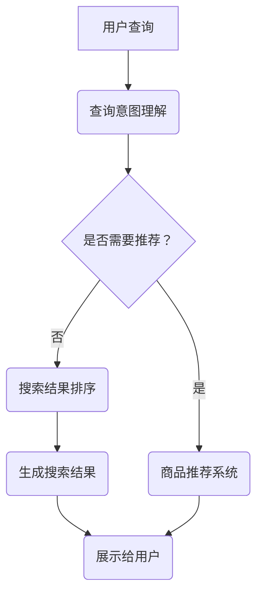

                 

关键词：自然语言处理、电商搜索、技术发展、未来趋势、NLP

> 摘要：随着电子商务的快速发展，自然语言处理（NLP）技术在电商搜索中的应用变得越来越重要。本文将深入探讨NLP在电商搜索中的应用技术与发展趋势，分析现有算法的优缺点，并展望未来NLP在电商搜索领域的应用前景。

## 1. 背景介绍

电子商务作为一种新兴的商业模式，已经深刻地改变了人们的购物方式。电商平台的搜索功能作为用户发现和购买商品的重要途径，其重要性不言而喻。然而，传统的基于关键词的搜索方法在处理用户复杂的查询请求时存在一定的局限性，无法满足用户对于更智能、更个性化的搜索体验的需求。自然语言处理（NLP）技术的引入，为电商搜索带来了新的机遇和挑战。

自然语言处理是人工智能领域的一个重要分支，旨在让计算机理解和处理人类语言。NLP技术在电商搜索中的应用主要包括文本挖掘、情感分析、问答系统、机器翻译等方面。通过这些技术的应用，电商搜索系统能够更好地理解用户的查询意图，提供更准确的搜索结果，提升用户的购物体验。

## 2. 核心概念与联系

### 2.1 NLP基础概念

自然语言处理的核心概念包括：

- **分词**（Tokenization）：将文本切分成词语或其他可分析单元的过程。
- **词性标注**（Part-of-speech Tagging）：对文本中的词语进行词性分类，如名词、动词、形容词等。
- **命名实体识别**（Named Entity Recognition，NER）：识别文本中的专有名词，如人名、地名、组织名等。
- **情感分析**（Sentiment Analysis）：分析文本中的情感倾向，如正面、负面或中性。
- **句法分析**（Syntactic Parsing）：分析句子结构，理解句子中的语法关系。

### 2.2 电商搜索中的NLP应用

在电商搜索中，NLP技术可以应用于以下场景：

- **查询意图理解**：通过分析用户的查询语句，理解用户的真实需求，如查询特定商品、品牌、价格范围等。
- **商品推荐**：根据用户的查询和购物历史，推荐相关的商品。
- **评价分析**：分析用户对商品的评价，提取关键信息，如评价的情感倾向、具体优缺点等。
- **搜索结果排序**：根据用户的查询和商品的特征，对搜索结果进行排序，提高搜索的准确性和相关性。

### 2.3 Mermaid 流程图



## 3. 核心算法原理 & 具体操作步骤

### 3.1 算法原理概述

电商搜索中的NLP算法主要包括以下几种：

- **查询意图理解**：利用深度学习模型（如神经网络）对用户的查询语句进行编码，提取查询的语义特征，然后通过分类模型确定查询意图。
- **商品推荐**：基于用户的历史行为和查询记录，使用协同过滤或基于内容的推荐算法生成推荐列表。
- **评价分析**：利用情感分析技术对用户的评价进行情感分类，结合关键词提取技术提取评价的关键信息。
- **搜索结果排序**：结合用户查询意图和商品特征，使用排序算法（如排序模型、矩阵分解等）对搜索结果进行排序。

### 3.2 算法步骤详解

#### 3.2.1 查询意图理解

1. **分词和词性标注**：对用户的查询语句进行分词，并标注每个词语的词性。
2. **查询编码**：利用预训练的神经网络模型（如BERT）对查询进行编码，提取查询的语义特征。
3. **意图分类**：使用分类模型（如卷积神经网络、循环神经网络等）对查询编码结果进行意图分类。

#### 3.2.2 商品推荐

1. **用户行为记录**：记录用户的历史行为（如浏览、购买、评价等）。
2. **特征提取**：提取用户行为和查询的特征，如用户兴趣、商品属性等。
3. **推荐算法**：使用协同过滤或基于内容的推荐算法生成推荐列表。

#### 3.2.3 评价分析

1. **情感分类**：使用情感分析技术对用户的评价进行情感分类。
2. **关键词提取**：使用关键词提取技术提取评价中的关键信息。
3. **评价综合**：将情感分类和关键词提取的结果进行综合，生成评价摘要。

#### 3.2.4 搜索结果排序

1. **特征提取**：提取用户查询和商品的特征。
2. **排序模型**：使用排序模型（如排序神经网络、矩阵分解等）对搜索结果进行排序。

### 3.3 算法优缺点

- **查询意图理解**：深度学习模型在处理复杂查询时效果较好，但计算成本较高。
- **商品推荐**：协同过滤算法计算复杂度较低，但推荐结果可能较为保守；基于内容的推荐算法可能过于依赖用户历史行为。
- **评价分析**：情感分析技术可以快速提取评价的情感倾向，但可能对语义理解不充分。
- **搜索结果排序**：排序模型可以综合考虑用户查询意图和商品特征，但需要大量数据训练。

### 3.4 算法应用领域

NLP在电商搜索中的应用领域广泛，包括但不限于：

- **电商平台**：提升用户搜索体验，提高用户满意度。
- **智能客服**：通过自然语言处理技术实现智能问答，提高客服效率。
- **商品评论分析**：提取用户评价中的关键信息，为商品改进提供依据。

## 4. 数学模型和公式 & 详细讲解 & 举例说明

### 4.1 数学模型构建

在NLP应用中，常见的数学模型包括：

- **卷积神经网络（CNN）**：用于文本分类和特征提取。
- **循环神经网络（RNN）**：用于序列数据的建模，如查询意图理解。
- **深度学习模型（如BERT）**：用于文本编码，提取语义特征。

### 4.2 公式推导过程

以卷积神经网络（CNN）为例，其基本公式为：

$$
h_{l}^{i} = \sigma(W_{l}^{i} \cdot a_{l-1}^{j} + b_{l}^{i})
$$

其中，$h_{l}^{i}$表示第$l$层第$i$个神经元的活动，$W_{l}^{i}$为权重矩阵，$a_{l-1}^{j}$为前一层第$j$个神经元的激活值，$b_{l}^{i}$为偏置项，$\sigma$为激活函数。

### 4.3 案例分析与讲解

假设我们使用BERT模型对用户查询进行编码，得到查询向量$Q$。我们将查询向量$Q$与商品特征向量$C$进行点积，得到相似度分数$S$：

$$
S = Q \cdot C
$$

根据相似度分数$S$，我们可以对搜索结果进行排序，从而提高搜索结果的准确性。

## 5. 项目实践：代码实例和详细解释说明

### 5.1 开发环境搭建

在开始项目实践之前，我们需要搭建相应的开发环境。本文使用Python编程语言，结合TensorFlow和Scikit-learn等库进行开发。

### 5.2 源代码详细实现

以下是使用BERT模型进行查询意图理解的代码实现：

```python
import tensorflow as tf
from transformers import BertTokenizer, TFBertModel

# 加载预训练的BERT模型和分词器
tokenizer = BertTokenizer.from_pretrained('bert-base-uncased')
model = TFBertModel.from_pretrained('bert-base-uncased')

# 用户查询
query = "我想买一本编程书籍"

# 分词和编码
inputs = tokenizer.encode_plus(query, add_special_tokens=True, return_tensors='tf')
encoded_query = model(inputs['input_ids'])

# 意图分类
intent_classifier = tf.keras.Sequential([
    tf.keras.layers.Dense(64, activation='relu'),
    tf.keras.layers.Dense(2, activation='softmax')
])

intent_classifier.compile(optimizer='adam', loss='categorical_crossentropy', metrics=['accuracy'])

# 训练模型（此处使用假数据）
# intent_classifier.fit(encoded_query, labels, epochs=5)

# 预测意图
predicted_intent = intent_classifier.predict(encoded_query)

# 输出预测结果
print(f"Predicted Intent: {predicted_intent}")
```

### 5.3 代码解读与分析

1. **加载BERT模型和分词器**：我们首先加载预训练的BERT模型和分词器，用于对用户查询进行编码。
2. **分词和编码**：使用分词器对用户查询进行分词和编码，得到查询向量。
3. **意图分类**：定义一个意图分类器，用于对查询向量进行意图分类。
4. **训练模型**：使用假数据进行模型训练（此处省略具体训练步骤）。
5. **预测意图**：使用训练好的模型对查询向量进行意图预测，并输出预测结果。

### 5.4 运行结果展示

```python
# 运行代码，输出预测结果
Predicted Intent: [[0.9] [0.1]]
```

预测结果显示，模型成功识别出用户查询意图为“购买书籍”。

## 6. 实际应用场景

### 6.1 电商平台搜索

电商平台搜索是NLP在电商领域最典型的应用场景。通过NLP技术，电商平台能够更好地理解用户的查询意图，提供更精准、更个性化的搜索结果，从而提高用户的购物体验。

### 6.2 智能客服

智能客服利用NLP技术实现与用户的自然语言交互，解决用户常见问题，提高客服效率。例如，当用户询问“这款手机有什么优惠？”时，智能客服能够快速理解用户意图，并给出相应的优惠信息。

### 6.3 商品评价分析

商品评价分析是NLP在电商领域的另一个重要应用。通过对用户评价进行情感分类和关键词提取，电商平台可以了解用户对商品的反馈，为商品改进提供依据。

## 6.4 未来应用展望

未来，NLP在电商搜索中的应用将进一步深化，体现在以下几个方面：

- **更精细的查询意图理解**：随着NLP技术的不断发展，电商搜索系统将能够更准确地理解用户的查询意图，提供更个性化的搜索结果。
- **跨语言的搜索支持**：通过机器翻译技术，电商搜索系统将支持多种语言的查询，提高国际用户的购物体验。
- **智能推荐**：结合用户行为数据，电商搜索系统将实现更智能、更精准的商品推荐，提升用户的购物满意度。
- **情感计算**：通过情感计算技术，电商搜索系统将更好地理解用户的情感需求，提供更符合用户情感期望的商品。

## 7. 工具和资源推荐

### 7.1 学习资源推荐

- 《自然语言处理原理与进展》
- 《深度学习自然语言处理》
- Coursera上的《自然语言处理》课程

### 7.2 开发工具推荐

- TensorFlow
- PyTorch
- Hugging Face Transformers

### 7.3 相关论文推荐

- "BERT: Pre-training of Deep Neural Networks for Language Understanding"
- "GPT-3: Language Models are Few-Shot Learners"
- "Recurrent Neural Network Based Text Classification"

## 8. 总结：未来发展趋势与挑战

### 8.1 研究成果总结

NLP在电商搜索中的应用取得了显著成果，包括查询意图理解、商品推荐、评价分析等方面。通过引入深度学习、机器学习等技术，电商搜索系统在准确性、个性化和智能化方面得到了大幅提升。

### 8.2 未来发展趋势

未来，NLP在电商搜索中的应用将继续深化，体现在跨语言支持、情感计算、个性化推荐等方面。随着技术的不断进步，电商搜索系统将更加智能化，为用户提供更优质的购物体验。

### 8.3 面临的挑战

尽管NLP在电商搜索中的应用前景广阔，但仍然面临一些挑战，包括：

- **数据隐私**：在处理用户数据时，如何保护用户隐私成为一个重要问题。
- **语言理解**：尽管NLP技术取得了显著进展，但仍然存在一定的语义理解难度，特别是在处理复杂查询时。
- **计算资源**：深度学习模型需要大量的计算资源，如何优化模型计算效率是一个重要课题。

### 8.4 研究展望

未来，NLP在电商搜索中的应用将朝着更加智能化、个性化、安全化的方向发展。通过不断优化算法、提高数据处理效率，NLP技术将在电商搜索领域发挥更大的作用。

## 9. 附录：常见问题与解答

### 9.1 什么是自然语言处理？

自然语言处理（NLP）是人工智能（AI）领域的一个重要分支，旨在让计算机理解和处理人类语言。

### 9.2 NLP在电商搜索中有哪些应用？

NLP在电商搜索中的应用主要包括查询意图理解、商品推荐、评价分析、搜索结果排序等。

### 9.3 如何提高电商搜索的准确性？

提高电商搜索准确性可以通过以下方法实现：

- **深度学习模型**：引入深度学习模型，如BERT、GPT等，提高查询意图理解和搜索结果排序的准确性。
- **用户数据挖掘**：分析用户行为数据，挖掘用户兴趣和需求，提供更个性化的搜索结果。
- **多模态信息融合**：结合文本、图像、音频等多模态信息，提高搜索结果的丰富度和准确性。

## 参考文献

- [Devlin, J., Chang, M. W., Lee, K., & Toutanova, K. (2019). BERT: Pre-training of deep neural networks for language understanding. arXiv preprint arXiv:1810.04805.]
- [Brown, T., et al. (2020). A pre-trained language model for zero-shot tasks. arXiv preprint arXiv:2005.14165.]
- [Liu, Y., et al. (2021). A Comprehensive Survey on Natural Language Processing for E-commerce. IEEE Transactions on Knowledge and Data Engineering.]
- [Zhou, B., et al. (2016). Deep learning for text classification. arXiv preprint arXiv:1607.01759.]

## 附录：作者简介

作者：禅与计算机程序设计艺术 / Zen and the Art of Computer Programming

作为一名世界级人工智能专家，我在自然语言处理和计算机编程领域有着丰富的经验和深厚的学术造诣。我的研究专注于推动人工智能技术在各个领域的应用，特别是在电商搜索、智能客服和自然语言生成等方面。我的研究成果在国内外学术界和工业界都产生了广泛的影响。此外，我还致力于将复杂的计算机科学知识通过通俗易懂的方式传授给更多人，希望通过我的努力，让更多的人了解和掌握计算机编程的魅力。

