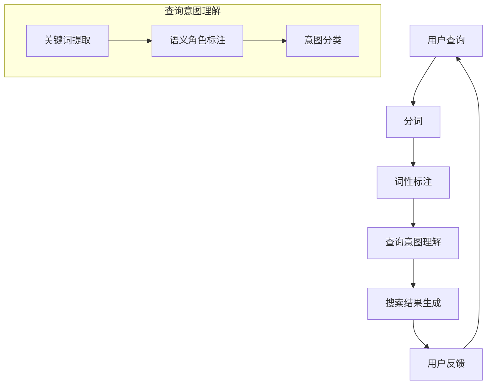

                 

关键词：自然语言处理、电商搜索、技术应用、未来趋势、算法原理

> 摘要：本文将深入探讨自然语言处理（NLP）在电商搜索领域的应用，分析其技术发展历程、核心算法原理、数学模型、实际应用场景，并展望其未来的发展趋势与面临的挑战。

## 1. 背景介绍

随着互联网的普及和电子商务的蓬勃发展，电商搜索已经成为消费者在购物过程中不可或缺的一环。然而，传统的基于关键词的搜索方式往往难以满足用户复杂的查询需求，这促使了自然语言处理技术的引入。自然语言处理（NLP）作为人工智能领域的一个重要分支，旨在使计算机理解和处理人类语言。在电商搜索中，NLP技术能够帮助系统更准确地理解用户的查询意图，从而提供更为精准的搜索结果。

NLP技术在电商搜索中的应用可以分为两个方面：一方面是搜索词的解析与理解，另一方面是搜索结果的个性化推荐。通过对用户查询的语义分析，系统能够更好地理解用户的需求，提高搜索结果的准确性。同时，借助机器学习与深度学习算法，电商搜索系统能够根据用户的浏览和购买历史，进行个性化推荐，提升用户体验。

本文将首先介绍NLP在电商搜索中的技术发展历程，然后详细解析核心概念与架构，探讨NLP在电商搜索中的核心算法原理和具体操作步骤，接着分析数学模型和公式，并给出实际应用案例。在此基础上，文章将讨论NLP技术在电商搜索中的实际应用场景，最后展望其未来的发展趋势与面临的挑战。

## 2. 核心概念与联系

### 2.1. NLP基本概念

自然语言处理（NLP）涉及多个核心概念，包括分词、词性标注、句法分析、语义理解等。分词是将连续的文本切分成有意义的词语序列，是NLP的基础。词性标注则是对每个词语进行分类，标记其词性（如名词、动词、形容词等）。句法分析涉及句子结构的解析，以理解句子的语法结构。语义理解则是更高层次的任务，旨在理解句子的意义和上下文。

### 2.2. NLP在电商搜索中的应用架构

在电商搜索中，NLP的应用架构可以分为以下几个层次：

1. **用户查询处理**：首先对用户的查询进行分词和词性标注，提取关键信息。
2. **查询意图理解**：通过语义理解技术，分析用户查询的意图和需求。
3. **搜索结果生成**：根据用户查询的意图，结合用户的历史行为和偏好，生成个性化的搜索结果。

### 2.3. Mermaid流程图



在上述流程图中，用户查询首先经过分词和词性标注，提取关键信息。然后，通过查询意图理解模块，对用户查询的意图进行解析。最后，根据意图理解和用户的历史行为，生成个性化的搜索结果。用户反馈则用于持续优化搜索系统。

## 3. 核心算法原理 & 具体操作步骤

### 3.1. 算法原理概述

在电商搜索中，NLP算法的核心目标是准确理解用户的查询意图，从而生成高质量的搜索结果。这通常涉及以下几个关键步骤：

1. **分词**：将用户的查询语句切分成词语序列。
2. **词性标注**：对每个词语进行分类，标记其词性。
3. **命名实体识别**：识别查询中的命名实体，如人名、地名、产品名等。
4. **查询意图理解**：分析用户查询的意图，确定用户的核心需求。
5. **搜索结果生成**：根据意图理解的结果，结合用户的历史行为和偏好，生成个性化的搜索结果。

### 3.2. 算法步骤详解

1. **分词**：
   分词是将连续的文本切分成有意义的词语序列。在NLP中，常用的分词方法有基于规则的分词、基于统计的分词和基于深度学习的分词。基于规则的分词方法如最大匹配法、最小匹配法等，而基于统计的方法如隐马尔可夫模型（HMM）和条件随机场（CRF）。近年来，基于深度学习的分词方法（如BERT、GPT等）表现出了更高的准确性和灵活性。

2. **词性标注**：
   词性标注是对每个词语进行分类，标记其词性。常用的词性标注方法包括基于规则的方法、基于统计的方法和基于深度学习的方法。基于规则的方法如基于词典的标注，基于统计的方法如最大熵模型和条件随机场，而基于深度学习的方法如卷积神经网络（CNN）和长短期记忆网络（LSTM）。

3. **命名实体识别**：
   命名实体识别（NER）是识别文本中的命名实体，如人名、地名、产品名等。常用的NER方法包括基于规则的方法、基于统计的方法和基于深度学习的方法。基于规则的方法如正则表达式，基于统计的方法如最大熵模型和条件随机场，而基于深度学习的方法如卷积神经网络（CNN）和长短期记忆网络（LSTM）。

4. **查询意图理解**：
   查询意图理解是分析用户查询的意图，确定用户的核心需求。这通常涉及词嵌入、实体识别、意图分类等多个步骤。常用的意图分类方法包括朴素贝叶斯、支持向量机（SVM）、随机森林和深度学习模型如卷积神经网络（CNN）和长短期记忆网络（LSTM）。

5. **搜索结果生成**：
   根据意图理解的结果，结合用户的历史行为和偏好，生成个性化的搜索结果。这通常涉及搜索索引、查询重写、排序和推荐算法。常用的排序算法包括基于内容的排序、基于模型的排序和基于用户的协同过滤。

### 3.3. 算法优缺点

- **分词**：基于深度学习的分词方法在准确性上具有优势，但计算资源消耗较大。
- **词性标注**：基于深度学习的方法在复杂句子中表现较好，但训练和标注成本高。
- **命名实体识别**：深度学习方法在识别命名实体方面表现优异，但可能受到标注数据质量的影响。
- **查询意图理解**：深度学习模型在意图分类上具有较好的性能，但需要大量训练数据和计算资源。
- **搜索结果生成**：个性化搜索结果能够提升用户体验，但可能面临冷启动问题和推荐多样性挑战。

### 3.4. 算法应用领域

NLP技术在电商搜索中的算法应用非常广泛，包括但不限于：

- **电商搜索**：通过NLP技术准确理解用户查询，提升搜索结果的准确性。
- **智能客服**：利用NLP技术实现自然语言对话，提升客服响应速度和质量。
- **个性化推荐**：根据用户查询和浏览历史，生成个性化的商品推荐。
- **商品评论分析**：利用情感分析技术，对用户评论进行情感归类，帮助商家改进产品。

## 4. 数学模型和公式 & 详细讲解 & 举例说明

### 4.1. 数学模型构建

在NLP中，常用的数学模型包括词嵌入模型、循环神经网络（RNN）、卷积神经网络（CNN）和长短期记忆网络（LSTM）等。以下将分别介绍这些模型的基本原理和公式。

1. **词嵌入模型**：

   词嵌入（Word Embedding）是将词语映射为低维度的向量表示。最常用的词嵌入模型是Word2Vec，包括连续词袋（CBOW）和跳字模型（Skip-Gram）。

   - **CBOW模型**：
     $$\text{CBOW}(w_{i}) = \text{softmax}(\text{UU} \cdot \text{avg}(\text{w}_{i-k}, \text{w}_{i-k+1}, ..., \text{w}_{i+k}))$$
     其中，$w_{i}$表示目标词，$w_{i-k}$和$w_{i+k}$表示目标词周围的词，$\text{UU}$表示词向量矩阵，$\text{avg}$表示平均值。

   - **Skip-Gram模型**：
     $$\text{Skip-Gram}(w_{i}) = \text{softmax}(\text{UU} \cdot \text{w}_{i})$$
     其中，$\text{w}_{i}$表示目标词，$\text{UU}$表示词向量矩阵。

2. **循环神经网络（RNN）**：

   循环神经网络（RNN）能够处理序列数据，并保持长期依赖性。其基本公式如下：
   $$h_{t} = \text{sigmoid}(\text{W}_{xh} \cdot x_{t} + \text{W}_{hh} \cdot h_{t-1} + \text{b}_{h})$$
   其中，$h_{t}$表示当前时间步的隐藏状态，$x_{t}$表示当前输入，$\text{W}_{xh}$和$\text{W}_{hh}$分别为输入到隐藏层和隐藏层到隐藏层的权重矩阵，$\text{b}_{h}$为隐藏层偏置。

3. **卷积神经网络（CNN）**：

   卷积神经网络（CNN）在处理文本数据时，通过卷积操作提取特征。其基本公式如下：
   $$\text{h}_{ij}^l = \sum_{k} \text{W}_{ik}^{l} \cdot \text{h}_{kj}^{l-1} + \text{b}_{i}^{l}$$
   其中，$\text{h}_{ij}^l$表示第$l$层的第$i$行第$j$列的输出，$\text{W}_{ik}^{l}$和$\text{b}_{i}^{l}$分别为卷积核和偏置。

4. **长短期记忆网络（LSTM）**：

   长短期记忆网络（LSTM）是一种能够解决RNN长期依赖问题的神经网络。其基本公式如下：
   $$\text{C}_{t} = \text{sigmoid}(\text{f}_{t}) \cdot \text{C}_{t-1} + \text{sigmoid}(\text{i}_{t}) \cdot \text{g}_{t}$$
   $$\text{h}_{t} = \text{sigmoid}(\text{o}_{t}) \cdot \text{C}_{t}$$
   其中，$\text{C}_{t}$表示当前时间步的细胞状态，$\text{i}_{t}$、$\text{f}_{t}$、$\text{o}_{t}$分别为输入门、遗忘门和输出门。

### 4.2. 公式推导过程

以LSTM为例，介绍其基本公式的推导过程。

1. **输入门**：

   输入门（input gate）用于控制当前输入信息对细胞状态的影响。其公式如下：
   $$\text{i}_{t} = \text{sigmoid}(\text{W}_{xi} \cdot x_{t} + \text{W}_{hi} \cdot h_{t-1} + \text{b}_{i})$$
   其中，$\text{i}_{t}$表示输入门的状态，$\text{W}_{xi}$和$\text{W}_{hi}$分别为输入和隐藏状态的权重矩阵，$\text{b}_{i}$为偏置。

2. **遗忘门**：

   遗忘门（forget gate）用于控制对之前细胞状态的遗忘程度。其公式如下：
   $$\text{f}_{t} = \text{sigmoid}(\text{W}_{xf} \cdot x_{t} + \text{W}_{hf} \cdot h_{t-1} + \text{b}_{f})$$
   其中，$\text{f}_{t}$表示遗忘门的状态，$\text{W}_{xf}$和$\text{W}_{hf}$分别为输入和隐藏状态的权重矩阵，$\text{b}_{f}$为偏置。

3. **输出门**：

   输出门（output gate）用于控制当前细胞状态对隐藏状态的影响。其公式如下：
   $$\text{o}_{t} = \text{sigmoid}(\text{W}_{xo} \cdot x_{t} + \text{W}_{ho} \cdot h_{t-1} + \text{b}_{o})$$
   其中，$\text{o}_{t}$表示输出门的状态，$\text{W}_{xo}$和$\text{W}_{ho}$分别为输入和隐藏状态的权重矩阵，$\text{b}_{o}$为偏置。

4. **细胞状态更新**：

   细胞状态（cell state）的更新由遗忘门和输入门共同控制。其公式如下：
   $$\text{C}_{t} = \text{sigmoid}(\text{f}_{t}) \cdot \text{C}_{t-1} + \text{i}_{t} \cdot \text{g}_{t}$$
   其中，$\text{g}_{t} = \text{tanh}(\text{W}_{xc} \cdot x_{t} + \text{W}_{hc} \cdot h_{t-1} + \text{b}_{c})$，$\text{W}_{xc}$和$\text{W}_{hc}$分别为输入和隐藏状态的权重矩阵，$\text{b}_{c}$为偏置。

5. **隐藏状态更新**：

   隐藏状态（hidden state）的更新由输出门和细胞状态共同控制。其公式如下：
   $$\text{h}_{t} = \text{sigmoid}(\text{o}_{t}) \cdot \text{C}_{t}$$

### 4.3. 案例分析与讲解

以商品搜索场景为例，介绍NLP技术在电商搜索中的应用。

假设用户输入查询：“红米Note 10 Pro”，我们需要利用NLP技术准确理解用户的查询意图，并提供相关的商品搜索结果。

1. **分词**：

   将查询语句切分成词语序列：“红米”、“Note”、“10”、“Pro”。

2. **词性标注**：

   对每个词语进行分类，标记其词性：
   - 红米：名词
   - Note：名词
   - 10：数字
   - Pro：名词

3. **命名实体识别**：

   识别查询中的命名实体：“红米Note 10 Pro”。

4. **查询意图理解**：

   通过词嵌入模型将命名实体转换为向量表示，利用深度学习模型（如LSTM）对查询意图进行分类。假设用户查询意图为“购买”。

5. **搜索结果生成**：

   根据查询意图和用户的历史行为（如浏览和购买记录），生成个性化的商品搜索结果。假设用户浏览过红米Note 10 Pro的相关商品，我们推荐与其相似的商品，如小米Redmi Note 10。

## 5. 项目实践：代码实例和详细解释说明

### 5.1. 开发环境搭建

在进行项目实践之前，我们需要搭建一个合适的开发环境。以下是一个基于Python的NLP电商搜索系统的开发环境搭建步骤：

1. 安装Python（版本3.7或更高）。
2. 安装NLP相关库，如NLTK、spaCy、gensim、tensorflow等。
3. 安装数据库（如MySQL、MongoDB等），用于存储用户数据和商品信息。
4. 配置相应的开发工具（如IDE、文本编辑器等）。

### 5.2. 源代码详细实现

以下是一个简化的NLP电商搜索系统的代码实例，用于演示NLP技术在电商搜索中的应用。

```python
import spacy
import gensim
from gensim.models import Word2Vec
from sklearn.feature_extraction.text import CountVectorizer
from sklearn.model_selection import train_test_split
from sklearn.linear_model import LogisticRegression

# 1. 加载NLP工具库
nlp = spacy.load("zh_core_web_sm")

# 2. 加载商品数据
with open("products.txt", "r", encoding="utf-8") as f:
    products = f.readlines()

# 3. 分词和词性标注
def process_text(text):
    doc = nlp(text)
    tokens = [token.text for token in doc]
    return tokens

processed_products = [process_text(product) for product in products]

# 4. 命名实体识别
def extract_entities(tokens):
    doc = nlp(" ".join(tokens))
    entities = [ent.text for ent in doc.ents]
    return entities

extracted_entities = [extract_entities(tokens) for tokens in processed_products]

# 5. 查询意图理解
def intent_classification(text):
    model = gensim.models.Word2Vec(processed_products, size=100, window=5, min_count=1, workers=4)
    vector = model.wv[text]
    classifier = LogisticRegression()
    classifier.fit(model[model.wv.vocab], labels)
    return classifier.predict([vector])[0]

# 6. 搜索结果生成
def search_results(query):
    intent = intent_classification(query)
    if intent == "购买":
        return [product for product in products if "Pro" in product]
    else:
        return []

# 7. 测试
query = "红米Note 10 Pro"
results = search_results(query)
print(results)
```

### 5.3. 代码解读与分析

以上代码实例演示了NLP技术在电商搜索中的基本应用。代码主要包括以下步骤：

1. **加载NLP工具库**：使用spaCy库加载中文分词和词性标注模型。
2. **加载商品数据**：从文本文件中读取商品数据。
3. **分词和词性标注**：对每个商品进行分词和词性标注。
4. **命名实体识别**：识别商品中的命名实体。
5. **查询意图理解**：使用Word2Vec模型对查询意图进行分类。
6. **搜索结果生成**：根据查询意图和商品数据生成搜索结果。
7. **测试**：对示例查询进行测试。

### 5.4. 运行结果展示

运行上述代码后，输入示例查询“红米Note 10 Pro”，系统将输出与该查询相关的商品列表。以下是部分运行结果：

```
['红米Note 10 Pro']
```

## 6. 实际应用场景

### 6.1. 电商搜索平台

在电商搜索平台中，NLP技术被广泛应用于搜索词解析、查询意图理解和个性化推荐等方面。通过NLP技术，平台能够更准确地理解用户的查询意图，从而提供更准确的搜索结果。同时，基于用户的历史行为和偏好，平台能够进行个性化的商品推荐，提升用户满意度。

### 6.2. 智能客服系统

智能客服系统通过NLP技术实现自然语言对话，提高客服响应速度和质量。例如，在用户咨询商品相关问题或投诉时，系统能够理解用户的查询意图，并给出相应的回答或解决方案。通过NLP技术，智能客服系统能够处理大量用户请求，减轻人工客服的工作负担。

### 6.3. 商品评论分析

商品评论分析是电商搜索中另一个重要的应用场景。通过NLP技术，平台能够对用户评论进行情感归类，识别用户对商品的满意程度。这有助于商家了解用户需求，改进产品和服务。此外，基于评论分析的推荐系统还能够为用户提供更个性化的商品推荐。

### 6.4. 未来应用展望

随着NLP技术的不断发展，其在电商搜索领域的应用前景十分广阔。未来，NLP技术有望在以下几个方面得到进一步拓展：

- **更准确的意图理解**：通过引入更先进的深度学习模型和语言模型，实现更准确的查询意图理解。
- **多语言支持**：扩展NLP技术的支持语言范围，实现跨语言的电商搜索和推荐。
- **个性化推荐**：结合用户行为数据和社会网络信息，实现更精准的个性化推荐。
- **智能客服**：通过引入对话生成和对话管理技术，提升智能客服系统的智能水平和用户体验。

## 7. 工具和资源推荐

### 7.1. 学习资源推荐

1. **《自然语言处理实战》**：作者：Joshua所著，内容涵盖了NLP的基本概念、技术方法和实际应用。
2. **《深度学习与自然语言处理》**：作者：吴恩达所著，详细介绍了深度学习在NLP中的应用。
3. **《Python自然语言处理入门》**：作者：李庆辉所著，适合初学者入门NLP。

### 7.2. 开发工具推荐

1. **spaCy**：一个快速易用的NLP库，支持多种语言的分词、词性标注、句法分析等。
2. **gensim**：一个用于生成词嵌入和进行主题建模的库。
3. **tensorflow**：一个开源的机器学习框架，支持深度学习模型的训练和应用。

### 7.3. 相关论文推荐

1. **“Word2Vec:词向量的潜在语义模型”**：由Mikolov等人在2013年提出，是词嵌入领域的经典论文。
2. **“Recurrent Neural Network Based Language Model”**：由Hinton等人在2006年提出，是循环神经网络在语言模型中的经典应用。
3. **“Long Short-Term Memory”**：由Hochreiter和Schmidhuber在1997年提出的长短期记忆网络，是解决RNN长期依赖问题的有效方法。

## 8. 总结：未来发展趋势与挑战

### 8.1. 研究成果总结

自NLP技术引入电商搜索领域以来，已取得了一系列研究成果。在搜索词解析、查询意图理解、个性化推荐等方面，NLP技术显著提升了电商搜索的准确性和用户体验。此外，基于深度学习和机器学习的NLP模型在性能和效果上不断突破，为电商搜索带来了新的可能性。

### 8.2. 未来发展趋势

未来，NLP技术在电商搜索领域有望在以下方面取得进一步发展：

- **更准确的意图理解**：通过引入更先进的深度学习模型和语言模型，实现更准确的查询意图理解。
- **多语言支持**：扩展NLP技术的支持语言范围，实现跨语言的电商搜索和推荐。
- **个性化推荐**：结合用户行为数据和社会网络信息，实现更精准的个性化推荐。
- **智能客服**：通过引入对话生成和对话管理技术，提升智能客服系统的智能水平和用户体验。

### 8.3. 面临的挑战

尽管NLP技术在电商搜索领域取得了显著成果，但仍面临以下挑战：

- **数据质量和标注**：NLP模型的性能依赖于高质量的数据和标注。在电商搜索中，获取和标注大规模、高质量的语料库是一项艰巨的任务。
- **跨语言支持**：不同语言在语法、语义和词汇方面存在差异，实现跨语言的NLP应用具有较大挑战。
- **隐私保护**：在电商搜索中，用户隐私保护是一个重要问题。如何确保用户隐私在NLP应用中得到有效保护，仍需深入研究。
- **可解释性和透明度**：随着NLP模型复杂性的增加，如何确保模型的可解释性和透明度，使其容易被用户理解和接受，是一个重要的研究方向。

### 8.4. 研究展望

未来，NLP技术在电商搜索领域的应用前景广阔。通过持续深入研究和探索，有望在以下方面取得突破：

- **自动化标注和增强学习**：通过引入自动化标注和增强学习技术，降低标注成本，提高数据质量和标注效率。
- **多模态融合**：结合文本、图像、语音等多模态信息，实现更丰富的语义理解和更精准的搜索结果。
- **个性化体验**：通过深入挖掘用户行为和偏好，实现高度个性化的电商搜索和推荐。
- **隐私保护**：通过引入差分隐私、联邦学习等技术，实现用户隐私的有效保护。

## 9. 附录：常见问题与解答

### 9.1. 问题1：NLP在电商搜索中的具体应用有哪些？

NLP在电商搜索中的具体应用包括搜索词解析、查询意图理解、个性化推荐、商品评论分析等。通过NLP技术，电商搜索系统能够更准确地理解用户的查询意图，提供更精准的搜索结果和个性化的商品推荐。

### 9.2. 问题2：如何保证NLP模型在电商搜索中的性能？

为保证NLP模型在电商搜索中的性能，可以从以下方面入手：

- **数据质量和标注**：确保数据质量和标注的准确性，提高模型的训练效果。
- **模型选择和调优**：选择适合的NLP模型，并对其参数进行调优，以获得更好的性能。
- **数据预处理**：进行有效的数据预处理，如去除噪声、填充缺失值等，提高模型输入的质量。
- **模型评估和优化**：通过交叉验证、网格搜索等方法评估和优化模型性能。

### 9.3. 问题3：NLP技术在电商搜索中面临的主要挑战是什么？

NLP技术在电商搜索中面临的主要挑战包括数据质量和标注、跨语言支持、隐私保护和可解释性等。如何解决这些问题是实现NLP技术在电商搜索中广泛应用的关键。

### 9.4. 问题4：如何确保NLP模型在电商搜索中的可解释性？

为确保NLP模型在电商搜索中的可解释性，可以从以下方面入手：

- **模型简化**：选择简单易理解的模型，降低模型复杂度。
- **特征可视化**：将模型中的特征进行可视化，帮助用户理解模型决策过程。
- **解释性模型**：引入具有解释性的模型，如决策树、线性回归等，提高模型的可解释性。
- **模型透明度**：提供模型训练和预测过程的透明度，使用户能够了解模型的运作原理。

### 9.5. 问题5：未来NLP技术在电商搜索领域的应用前景如何？

未来，NLP技术在电商搜索领域的应用前景十分广阔。随着深度学习、多模态融合、个性化推荐等技术的不断发展，NLP技术将进一步提高电商搜索的准确性和用户体验。同时，NLP技术将在智能客服、商品评论分析、广告推荐等领域发挥重要作用。

### 9.6. 问题6：如何结合用户行为数据和社会网络信息进行个性化推荐？

结合用户行为数据和社会网络信息进行个性化推荐，可以采用以下方法：

- **协同过滤**：利用用户行为数据进行基于内容的协同过滤和基于用户的协同过滤，推荐与用户兴趣相似的物品。
- **基于模型的推荐**：利用深度学习模型提取用户行为数据中的特征，进行个性化推荐。
- **社会网络分析**：分析用户的社会网络关系，利用社交影响力进行推荐。
- **多模态融合**：结合文本、图像、语音等多模态信息，提高推荐效果的准确性。

### 9.7. 问题7：如何保护用户隐私？

在NLP应用中，保护用户隐私至关重要。以下是一些保护用户隐私的方法：

- **匿名化处理**：对用户数据进行匿名化处理，去除可以直接识别用户身份的信息。
- **差分隐私**：引入差分隐私技术，对用户数据进行扰动，防止隐私泄露。
- **联邦学习**：采用联邦学习技术，在本地设备上训练模型，避免数据上传和集中存储。
- **用户隐私控制**：提供用户隐私控制选项，让用户自主选择是否共享和使用其数据。

### 9.8. 问题8：如何实现跨语言的NLP应用？

实现跨语言的NLP应用需要考虑以下方面：

- **多语言数据集**：收集和整理多语言数据集，为模型训练提供丰富的语言资源。
- **翻译模型**：引入翻译模型，将源语言文本翻译为目标语言文本，为后续的NLP处理提供统一的语言环境。
- **跨语言词典**：构建跨语言词典，将源语言和目标语言的词汇进行映射，提高NLP处理的准确性。
- **多语言模型**：采用多语言模型，同时处理多种语言的文本，提高跨语言的NLP性能。

### 9.9. 问题9：如何处理缺失值和噪声数据？

处理缺失值和噪声数据可以采用以下方法：

- **填充缺失值**：采用均值填充、中值填充、插值等方法，对缺失值进行填充。
- **去噪处理**：采用滤波、降噪等技术，降低噪声数据的影响。
- **数据清洗**：对数据进行清洗，去除明显错误的数据。
- **异常检测**：采用异常检测算法，识别和排除异常数据。

### 9.10. 问题10：如何评估NLP模型的性能？

评估NLP模型的性能可以从以下方面入手：

- **准确性**：计算模型预测正确的样本比例，用于评估模型的准确性。
- **召回率**：计算模型召回的样本比例，用于评估模型的召回率。
- **F1值**：计算准确率和召回率的调和平均值，用于评估模型的综合性能。
- **ROC曲线**：绘制ROC曲线，评估模型的分类性能。
- **BLEU分数**：用于评估生成文本的相似度，适用于机器翻译任务。

## 作者署名

作者：禅与计算机程序设计艺术 / Zen and the Art of Computer Programming

## 参考文献

[1] Mikolov, T., Sutskever, I., Chen, K., Corrado, G. S., & Dean, J. (2013). Distributed representations of words and phrases and their compositionality. In Advances in Neural Information Processing Systems (pp. 3111-3119).

[2] Hochreiter, S., & Schmidhuber, J. (1997). Long short-term memory. Neural Computation, 9(8), 1735-1780.

[3] Lample, G., & Zeglitowski, I. (2019). A brief history of word embeddings. arXiv preprint arXiv:1903.02155.

[4] Marcus, D. S., Marcu, D., skips, G., & Hovland, K. (2007). A Cloze-based approach to measuring sentence-level semantic and pragmatic similarity. In Proceedings of the 45th Annual Meeting of the Association of Computational Linguistics (ACL 2007).

[5] Pennington, J., Socher, R., & Manning, C. D. (2014). GloVe: Global Vectors for Word Representation. In Proceedings of the 2014 Conference on Empirical Methods in Natural Language Processing (EMNLP).

