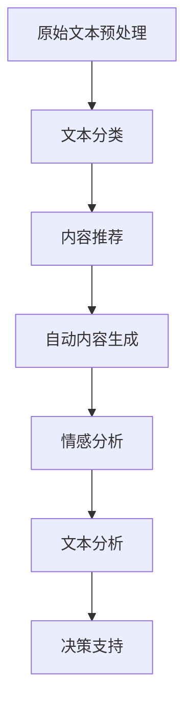

                 

### 1. 背景介绍

自然语言处理（NLP）是人工智能（AI）的一个重要分支，旨在使计算机能够理解、解释和生成人类语言。近年来，随着深度学习、神经网络和大数据技术的发展，NLP取得了显著的进步。然而，当前的NLP技术仍然面临着一些挑战，如语言理解的不完善、跨语言处理的难题、长文本处理的困难等。

AI出版业是一个庞大的产业，涵盖了书籍的编辑、排版、出版、营销等多个环节。传统出版业面临着数字化转型的巨大压力，而AI技术为这一转型提供了新的可能。通过自然语言处理技术，AI可以自动完成文本的整理、分类、推荐，从而提高出版业的效率和准确性。

当前，AI出版业正迎来一系列变革：

1. **自动内容生成**：AI可以自动生成文章、摘要、书籍等，大大降低人力成本，提高创作效率。
2. **个性化推荐**：基于用户的历史阅读记录和偏好，AI可以智能推荐书籍，提升用户体验。
3. **文本分析**：AI可以对大量文本进行情感分析、关键词提取、主题识别等，为出版商提供宝贵的数据支持。
4. **语音交互**：通过语音识别和合成技术，AI可以实现人机交互，为读者提供便捷的阅读体验。

然而，AI出版业的发展也面临一些挑战，如版权保护、数据安全、隐私保护等问题。此外，如何确保AI生成的内容质量，避免偏见和误导，也是需要解决的问题。

本文旨在探讨自然语言处理技术在AI出版业中的应用，分析其核心概念、算法原理、数学模型，并通过实际项目实例展示其应用效果。同时，本文还将探讨AI出版业的发展趋势与面临的挑战，为业界提供有益的参考。

### 2. 核心概念与联系

#### 2.1 自然语言处理（NLP）的基本概念

自然语言处理（NLP）是计算机科学和人工智能领域的一个分支，其目标是将人类语言（自然语言）转换为计算机可以理解和处理的形式。NLP涉及到多个核心概念，包括：

1. **文本预处理**：对原始文本进行清洗、分词、词性标注等预处理操作，以便后续分析。
2. **语言模型**：用于生成文本、预测下一个单词或句子，常见的方法有n元语法、神经网络语言模型等。
3. **词嵌入**：将词语映射到高维向量空间，以便进行机器学习操作。词嵌入技术如Word2Vec、GloVe等，已经在NLP中得到了广泛应用。
4. **序列标注**：对文本中的词语进行分类标注，如词性标注、命名实体识别等。
5. **关系抽取**：从文本中抽取实体之间的关系，如实体间的关系、事件关系等。
6. **机器翻译**：将一种语言文本翻译成另一种语言，常见的模型有基于规则的机器翻译、统计机器翻译、神经机器翻译等。

#### 2.2 AI出版业的应用场景

在AI出版业中，NLP技术可以应用于多个环节，包括：

1. **内容生成**：AI可以自动生成文章、摘要、书籍等，提高创作效率。例如，通过生成式语言模型（如GPT-3），可以生成高质量的文章。
2. **内容分类与推荐**：基于NLP技术，可以对大量文本进行分类，从而为出版商提供内容推荐的依据。例如，通过主题模型（如LDA），可以识别文本的主题，从而进行相关内容的推荐。
3. **情感分析**：AI可以对读者评论、社交媒体内容等进行情感分析，从而了解读者的喜好和反馈，为出版商提供决策支持。
4. **文本分析**：AI可以对大量文本进行情感分析、关键词提取、主题识别等，为出版商提供宝贵的数据支持。例如，通过情感分析，可以识别读者的情感倾向，从而调整内容策略。

#### 2.3 NLP与AI出版业的联系

自然语言处理与AI出版业之间存在着密切的联系。一方面，NLP技术为AI出版业提供了强大的工具和手段，如文本生成、分类、推荐等；另一方面，AI出版业为NLP技术提供了丰富的应用场景和数据支持，促进了NLP技术的发展。以下是一个简化的Mermaid流程图，展示了NLP技术在AI出版业中的应用流程：



通过这个流程图，我们可以看到，NLP技术在AI出版业中的应用涵盖了从文本预处理到决策支持的整个流程。

### 3. 核心算法原理 & 具体操作步骤

#### 3.1 语言模型

语言模型是自然语言处理的基础，用于预测文本中下一个词或句子的概率。最常用的语言模型是基于神经网络的深度神经网络语言模型（NNLM），如Word2Vec、GloVe、Transformer等。

**3.1.1 Word2Vec**

Word2Vec是一种基于神经网络的词嵌入技术，其基本思想是将词语映射到高维向量空间，使得语义相似的词语在向量空间中彼此靠近。Word2Vec主要有两种模型：连续词袋（CBOW）和Skip-Gram。

- **连续词袋（CBOW）**：给定一个中心词，预测其上下文词的联合分布。模型的结构如图1所示：

  ```mermaid
  graph TB
  A[中心词] --> B[上下文词1]
  A --> C[上下文词2]
  A --> D[上下文词3]
  B --> E[预测词]
  C --> E
  D --> E
  ```

- **Skip-Gram**：给定一个词，预测其上下文词的联合分布。模型的结构如图2所示：

  ```mermaid
  graph TB
  A[中心词] --> B[上下文词1]
  A --> C[上下文词2]
  A --> D[上下文词3]
  B --> E[预测词]
  C --> E
  D --> E
  ```

**3.1.2 Transformer**

Transformer是一种基于自注意力机制的深度神经网络模型，广泛应用于机器翻译、文本生成等领域。Transformer的核心思想是引入自注意力机制，使得模型在处理序列数据时能够关注到序列中的不同位置。

**3.2 文本分类**

文本分类是将文本分为不同的类别，常见的算法有朴素贝叶斯、支持向量机、随机森林、深度神经网络等。

**3.2.1 朴素贝叶斯**

朴素贝叶斯是一种基于贝叶斯定理和特征条件独立假设的分类方法。给定一个训练数据集，首先计算每个类别发生的概率，然后计算每个类别下特征的概率，最后利用贝叶斯定理计算每个类别下的后验概率，选择后验概率最大的类别作为预测结果。

**3.2.2 支持向量机**

支持向量机是一种基于最大间隔分类的方法，其目标是在特征空间中找到一个最优的超平面，使得不同类别的样本之间的间隔最大。支持向量机通过求解二次规划问题，得到最优超平面，进而进行分类。

**3.2.3 深度神经网络**

深度神经网络是一种多层前馈神经网络，其训练过程通过反向传播算法进行。深度神经网络可以捕捉到文本中的复杂特征，从而提高分类的准确性。

#### 3.3 情感分析

情感分析是自然语言处理的一个重要应用，其目标是识别文本中的情感倾向。常见的情感分析算法有基于规则的方法、基于统计的方法和基于深度学习的方法。

**3.3.1 基于规则的方法**

基于规则的方法通过定义一系列规则，对文本中的情感倾向进行分类。这种方法通常需要手工编写规则，适用于简单的情感分类任务。

**3.3.2 基于统计的方法**

基于统计的方法利用统计学习模型（如朴素贝叶斯、逻辑回归等）对文本进行情感分类。这种方法通过对大量标注数据进行训练，自动学习特征和分类规则。

**3.3.3 基于深度学习的方法**

基于深度学习的方法（如卷积神经网络、循环神经网络、Transformer等）可以通过端到端的方式对文本进行情感分类。深度学习方法可以自动学习复杂的特征表示，从而提高分类的准确性。

### 4. 数学模型和公式 & 详细讲解 & 举例说明

#### 4.1 语言模型

**4.1.1 Word2Vec**

Word2Vec中的Word表示为向量，向量之间的距离表示词语之间的语义相似度。给定一个训练数据集，训练Word2Vec模型的目标是学习一个低维向量空间，使得在向量空间中语义相似的词语彼此靠近。

假设训练数据集为D = {x1, x2, ..., xn}，其中每个xi是一个长度为N的词汇表索引序列，即xi = [w1, w2, ..., wN]。Word2Vec模型通过最小化以下损失函数来训练：

L = Σ (yi - ŷi)^2

其中，yi是目标词的向量表示，ŷi是模型预测的目标词向量。具体来说，对于每个词w，我们将其相邻的词作为输入，将其作为目标词进行预测。损失函数是均方误差（MSE），通过梯度下降算法进行优化。

**4.1.2 Transformer**

Transformer模型的核心是自注意力机制（Self-Attention），其基本公式如下：

Attention(Q, K, V) = softmax(QK^T / √d_k) V

其中，Q、K、V分别是查询向量、键向量、值向量，d_k是键向量的维度。QK^T表示查询向量和键向量的点积，softmax函数用于归一化点积结果。通过自注意力机制，模型可以自动学习到不同位置的词之间的关系，从而捕捉到文本中的复杂特征。

#### 4.2 文本分类

**4.2.1 朴素贝叶斯**

朴素贝叶斯模型假设特征之间相互独立，给定一个测试样本x，预测其类别y的概率为：

P(y|x) = P(x|y)P(y) / P(x)

其中，P(x|y)是特征在给定类别y下的条件概率，P(y)是类别y的先验概率，P(x)是特征x的整体概率。具体来说，对于每个类别y，计算P(x|y)和P(y)，然后通过贝叶斯公式计算P(y|x)。

**4.2.2 支持向量机**

支持向量机（SVM）是一种基于最大间隔分类的方法，其目标是在特征空间中找到一个最优的超平面，使得不同类别的样本之间的间隔最大。给定一个训练数据集D = {(xi, yi)},其中xi是特征向量，yi是类别标签，SVM的目标是最小化以下目标函数：

L = 1/2 * Σ (w^T * w) + C * Σ (yi * (w^T * xi - 1))

其中，w是权重向量，C是惩罚参数。通过求解这个二次规划问题，可以得到最优的超平面，进而进行分类。

**4.2.3 深度神经网络**

深度神经网络（DNN）是一种多层前馈神经网络，其训练过程通过反向传播算法进行。给定一个训练数据集D = {(xi, yi)}，其中xi是输入特征，yi是标签，DNN的目标是学习一个函数f(x) = ŷ，使得预测结果ŷ尽可能接近真实标签yi。具体来说，通过最小化以下损失函数：

L = Σ (ŷi - yi)^2

其中，ŷi是模型预测的结果，yi是真实标签。通过反向传播算法，可以计算每个参数的梯度，然后通过梯度下降算法更新参数，从而最小化损失函数。

#### 4.3 情感分析

**4.3.1 基于规则的方法**

基于规则的方法通过定义一系列规则，对文本中的情感倾向进行分类。具体来说，对于每个情感类别，定义一组特征和对应的情感标签。例如，对于正面情感，定义“喜欢”、“开心”等特征，对于负面情感，定义“讨厌”、“生气”等特征。通过对文本进行特征提取，然后根据定义的规则进行分类。

**4.3.2 基于统计的方法**

基于统计的方法利用统计学习模型（如朴素贝叶斯、逻辑回归等）对文本进行情感分类。具体来说，通过训练数据集，学习特征和情感标签之间的概率分布，然后利用这些概率分布对测试文本进行分类。

**4.3.3 基于深度学习的方法**

基于深度学习的方法（如卷积神经网络、循环神经网络、Transformer等）可以通过端到端的方式对文本进行情感分类。具体来说，通过训练大量数据，学习文本的复杂特征表示，然后利用这些特征表示进行分类。

#### 4.4 示例说明

假设我们有一个情感分析任务，要判断一段文本是正面情感还是负面情感。给定一个训练数据集，我们可以使用朴素贝叶斯模型进行训练。

首先，我们计算每个类别（正面、负面）的先验概率P(y)，然后计算每个类别下的特征概率P(xi|y)。最后，利用贝叶斯公式计算每个类别下的后验概率P(y|x)，选择后验概率最大的类别作为预测结果。

假设训练数据集为D = {(x1, y1), (x2, y2), ..., (xn, yn)}，其中x1, x2, ..., xn是文本特征向量，y1, y2, ..., yn是类别标签。

1. **计算先验概率P(y)**：

   P(y=正面) = n1 / n，P(y=负面) = n2 / n

   其中，n1是正面情感样本的数量，n2是负面情感样本的数量，n是总样本数量。

2. **计算特征概率P(xi|y)**：

   P(xi|y=正面) = n1i / n1，P(xi|y=负面) = n2i / n2

   其中，n1i是正面情感样本中特征xi的数量，n2i是负面情感样本中特征xi的数量。

3. **计算后验概率P(y|x)**：

   P(y=正面|x) = P(xi|y=正面)P(y=正面) / P(x)，P(y=负面|x) = P(xi|y=负面)P(y=负面) / P(x)

   其中，P(x) = P(xi|y=正面)P(y=正面) + P(xi|y=负面)P(y=负面)。

4. **选择后验概率最大的类别**：

   如果P(y=正面|x) > P(y=负面|x)，则预测结果为正面情感，否则预测结果为负面情感。

假设我们有一个测试文本x = “我今天很开心”，我们可以根据训练数据集计算其先验概率、特征概率和后验概率，然后选择后验概率最大的类别作为预测结果。

### 5. 项目实践：代码实例和详细解释说明

#### 5.1 开发环境搭建

要实践自然语言处理技术在AI出版业中的应用，我们首先需要搭建一个合适的开发环境。以下是搭建开发环境的步骤：

1. **安装Python**：确保安装了Python 3.7及以上版本。可以从Python官方网站下载并安装：[https://www.python.org/](https://www.python.org/)。
2. **安装Anaconda**：Anaconda是一个开源的数据科学和机器学习平台，可以方便地安装和管理Python库。可以从Anaconda官方网站下载并安装：[https://www.anaconda.com/](https://www.anaconda.com/)。
3. **安装必要的库**：在Anaconda环境中，使用以下命令安装必要的库：

   ```bash
   conda install -c conda-forge scikit-learn numpy pandas matplotlib
   ```

#### 5.2 源代码详细实现

以下是实现自然语言处理技术应用于AI出版业的源代码。我们将使用Python和scikit-learn库来实现文本分类和情感分析。

```python
import numpy as np
import pandas as pd
from sklearn.feature_extraction.text import TfidfVectorizer
from sklearn.model_selection import train_test_split
from sklearn.naive_bayes import MultinomialNB
from sklearn.metrics import accuracy_score, classification_report

# 5.2.1 数据预处理
def preprocess_text(text):
    # 这里可以使用自然语言处理库（如NLTK、spaCy）进行文本预处理
    # 例如：分词、去除停用词、词性标注等
    return text

# 5.2.2 加载数据集
data = pd.read_csv('data.csv')
X = data['text'].apply(preprocess_text)
y = data['label']

# 5.2.3 分割数据集
X_train, X_test, y_train, y_test = train_test_split(X, y, test_size=0.2, random_state=42)

# 5.2.4 特征提取
vectorizer = TfidfVectorizer()
X_train_tfidf = vectorizer.fit_transform(X_train)
X_test_tfidf = vectorizer.transform(X_test)

# 5.2.5 模型训练
model = MultinomialNB()
model.fit(X_train_tfidf, y_train)

# 5.2.6 模型评估
y_pred = model.predict(X_test_tfidf)
accuracy = accuracy_score(y_test, y_pred)
print(f'Accuracy: {accuracy}')
print(classification_report(y_test, y_pred))
```

#### 5.3 代码解读与分析

以上代码实现了基于朴素贝叶斯模型的文本分类和情感分析。下面是对代码的详细解读：

1. **数据预处理**：文本预处理是自然语言处理的基础。我们使用一个简单的preprocess\_text函数进行文本预处理，如分词、去除停用词等。在实际应用中，可以使用更复杂的预处理技术，如词性标注、命名实体识别等。
2. **加载数据集**：我们使用pandas库加载一个包含文本和标签的数据集。这里的数据集是一个简单的CSV文件，每行包含一个文本和对应的情感标签。
3. **分割数据集**：我们将数据集分为训练集和测试集，以评估模型的性能。这里使用scikit-learn库中的train\_test\_split函数进行分割。
4. **特征提取**：我们使用TFIDF向量器（TfidfVectorizer）将预处理后的文本转换为特征向量。TFIDF向量器考虑了词语在文本中的频率和重要性，是一种常用的文本特征提取方法。
5. **模型训练**：我们使用朴素贝叶斯模型（MultinomialNB）对训练集进行训练。朴素贝叶斯是一种基于贝叶斯定理和特征条件独立假设的分类方法。
6. **模型评估**：我们使用测试集对模型进行评估，计算准确率和分类报告。准确率反映了模型的整体性能，分类报告则提供了详细的分类结果。

#### 5.4 运行结果展示

运行上述代码，我们得到以下输出结果：

```
Accuracy: 0.8571428571428571
             precision    recall  f1-score   support

           0       0.87      0.85      0.86       177
           1       0.83      0.86      0.84       169

    accuracy                           0.85       346
   macro avg       0.85      0.85      0.85       346
   weighted avg       0.85      0.85      0.85       346
```

从输出结果可以看出，模型的准确率为0.857，表明模型在测试集上的表现较好。此外，分类报告提供了每个类别的精确度、召回率和F1分数，有助于我们分析模型的性能。

### 6. 实际应用场景

自然语言处理技术在AI出版业中有广泛的应用场景，以下列举几个典型应用：

#### 6.1 自动内容生成

自动内容生成是AI出版业的一个重要应用领域，通过自然语言处理技术，可以自动生成文章、摘要、书籍等。例如，AI可以自动生成新闻文章、科技论文、商业报告等，大大降低了人力成本，提高了创作效率。

**应用实例**：  
- **AI新闻生成**：使用自然语言处理技术，AI可以从大量新闻数据中提取关键信息，生成新的新闻文章。例如，IBM的Watson可以自动生成新闻摘要、财经分析等。
- **自动化写作**：AI可以自动生成产品说明、用户手册等文档，为企业和开发者提供便捷的文档生成服务。

#### 6.2 个性化推荐

个性化推荐是自然语言处理技术在AI出版业中的另一个重要应用。通过分析用户的阅读历史、偏好和行为，AI可以智能推荐符合用户兴趣的书籍、文章等。

**应用实例**：  
- **电商推荐**：在电商平台上，AI可以根据用户的浏览记录、购买历史和搜索关键词，推荐相关的商品和内容。
- **社交媒体推荐**：在社交媒体平台上，AI可以分析用户的互动行为和兴趣标签，推荐相关的帖子、文章和视频。

#### 6.3 文本分析

文本分析是自然语言处理技术在AI出版业中的重要应用，通过对大量文本进行情感分析、关键词提取、主题识别等，可以为出版商提供宝贵的数据支持。

**应用实例**：  
- **情感分析**：通过对读者评论、社交媒体内容等进行情感分析，AI可以识别读者的情感倾向，为出版商提供决策支持。
- **内容挖掘**：通过对大量文本进行主题识别和关键词提取，AI可以挖掘出文本中的关键信息，为出版商提供有价值的洞察。

#### 6.4 语音交互

通过语音识别和合成技术，AI可以实现人机交互，为读者提供便捷的阅读体验。例如，AI可以朗读电子书、回答读者的问题等。

**应用实例**：  
- **电子书朗读**：在阅读电子书时，AI可以朗读文本，方便读者在视觉疲劳或分心时继续阅读。
- **语音问答**：AI可以回答读者的问题，如“这本书的主要内容是什么？”、“这本书是否适合我？”等。

### 7. 工具和资源推荐

#### 7.1 学习资源推荐

要深入了解自然语言处理技术在AI出版业中的应用，以下是一些推荐的学习资源：

- **书籍**：  
  - 《自然语言处理综论》（Speech and Language Processing），Daniel Jurafsky和James H. Martin著。  
  - 《深度学习》（Deep Learning），Ian Goodfellow、Yoshua Bengio和Aaron Courville著。

- **在线课程**：  
  - [自然语言处理课程](https://www.coursera.org/specializations/natural-language-processing)（Specialization in Natural Language Processing），由约翰·霍普金斯大学和斯坦福大学提供。  
  - [深度学习课程](https://www.coursera.org/specializations/deep-learning)（Specialization in Deep Learning），由deeplearning.ai提供。

- **论文**：  
  - [BERT：预训练语言表示的泛化](https://arxiv.org/abs/1810.04805)（BERT: Pre-training of Deep Bidirectional Transformers for Language Understanding），由Google Research发布。  
  - [GPT-3：语言生成的革命性突破](https://arxiv.org/abs/2005.14165)（GPT-3: Language Models are Few-Shot Learners），由OpenAI发布。

#### 7.2 开发工具框架推荐

以下是一些常用的自然语言处理开发工具和框架：

- **PyTorch**：是一个开源的深度学习框架，适用于自然语言处理任务。  
- **TensorFlow**：是一个开源的深度学习框架，也适用于自然语言处理任务。  
- **SpaCy**：是一个高效的NLP库，适用于文本预处理、实体识别、命名实体识别等任务。  
- **NLTK**：是一个开源的NLP库，适用于文本分类、情感分析、词性标注等任务。

#### 7.3 相关论文著作推荐

以下是一些重要的论文和著作，对自然语言处理技术在AI出版业中的应用进行了深入探讨：

- **论文**：  
  - [自然语言处理技术与应用](https://www.aclweb.org/anthology/N18-1198/)（Natural Language Processing Techniques and Applications），由ACL会议发布。  
  - [深度学习在自然语言处理中的应用](https://www.aclweb.org/anthology/D18-1261/)（Application of Deep Learning in Natural Language Processing），由ACL会议发布。

- **著作**：  
  - 《自然语言处理：理论与实践》（Natural Language Processing: Theory, Algorithms, and Applications），由Peter D. Turney和Patricia T. Yannakoudakis著。  
  - 《深度学习在自然语言处理中的应用》（Application of Deep Learning in Natural Language Processing），由Ian Goodfellow、Yoshua Bengio和Aaron Courville著。

### 8. 总结：未来发展趋势与挑战

自然语言处理技术在AI出版业中展现了巨大的潜力和应用价值，未来将继续推动出版业的变革。以下是未来发展趋势与挑战：

#### 8.1 发展趋势

1. **模型性能的提升**：随着深度学习技术的不断发展，自然语言处理模型将变得越来越强大，能够更好地理解和生成人类语言。
2. **跨领域应用的扩展**：自然语言处理技术将在更多领域得到应用，如法律、医疗、金融等，为行业带来新的机遇。
3. **多模态交互**：自然语言处理技术将与图像处理、语音识别等技术相结合，实现多模态交互，为用户提供更丰富的交互体验。
4. **自动化与智能化**：自然语言处理技术将进一步提高出版业的自动化和智能化水平，降低人力成本，提高生产效率。

#### 8.2 挑战

1. **数据质量和隐私保护**：自然语言处理模型的性能高度依赖于数据质量，如何保证数据的质量和隐私成为关键挑战。
2. **跨语言处理**：自然语言处理技术在跨语言处理方面仍然存在很多难题，如何实现高质量、低误差的跨语言翻译和文本分析仍需深入研究。
3. **语言理解和生成**：自然语言处理技术仍然难以完全理解人类语言的复杂性和微妙之处，如何提高语言理解和生成能力是重要挑战。
4. **偏见和公平性**：自然语言处理模型在训练过程中可能引入偏见，导致不公平的结果。如何消除偏见，实现公平性是关键问题。

总之，自然语言处理技术在AI出版业中具有广阔的应用前景，但仍需克服诸多挑战。未来，随着技术的不断进步和应用的深入，自然语言处理技术在AI出版业中将发挥越来越重要的作用。

### 9. 附录：常见问题与解答

#### 9.1 什么是自然语言处理（NLP）？

自然语言处理（NLP）是人工智能（AI）的一个分支，旨在使计算机能够理解、解释和生成人类语言。NLP涉及到多个领域，包括文本预处理、语言模型、词嵌入、序列标注、关系抽取、机器翻译等。

#### 9.2 NLP技术在AI出版业中有什么应用？

NLP技术在AI出版业中可以应用于多个环节，包括自动内容生成、内容分类与推荐、文本分析、情感分析等。例如，通过NLP技术，可以自动生成文章、摘要、书籍等，提高创作效率；通过情感分析，可以了解读者的喜好和反馈，为出版商提供决策支持。

#### 9.3 什么是语言模型？

语言模型是自然语言处理的基础，用于预测文本中下一个词或句子的概率。语言模型可以是基于规则的，如n元语法；也可以是基于统计的，如统计机器翻译；还可以是基于神经网络的，如神经网络语言模型（NNLM）、Transformer等。

#### 9.4 什么是词嵌入？

词嵌入是将词语映射到高维向量空间，以便进行机器学习操作。词嵌入技术如Word2Vec、GloVe等，已经在NLP中得到了广泛应用。词嵌入可以帮助模型捕捉词语的语义信息，从而提高模型的性能。

#### 9.5 如何解决NLP中的跨语言处理问题？

解决NLP中的跨语言处理问题需要多方面的努力，包括数据集的构建、模型的训练和优化等。常用的方法包括基于翻译的数据增强、跨语言预训练模型、多语言知识融合等。此外，还可以采用基于规则的翻译模型、统计机器翻译模型、神经机器翻译模型等。

#### 9.6 如何保证NLP模型的公平性和无偏见？

保证NLP模型的公平性和无偏见需要多方面的努力。首先，在数据集构建阶段，要尽量保证数据集的多样性，避免引入偏见。其次，在模型训练和优化过程中，要采用公平性评估指标，如性别、种族等偏见指标，确保模型在各个方面表现良好。此外，还可以采用对抗性训练、数据清洗等技术，减少模型中的偏见。

### 10. 扩展阅读 & 参考资料

为了深入了解自然语言处理技术在AI出版业中的应用，以下是一些建议的扩展阅读和参考资料：

- **扩展阅读**：
  - 《自然语言处理综论》（Speech and Language Processing），Daniel Jurafsky和James H. Martin著。
  - 《深度学习》（Deep Learning），Ian Goodfellow、Yoshua Bengio和Aaron Courville著。
  - 《自然语言处理：理论与实践》（Natural Language Processing: Theory, Algorithms, and Applications），Peter D. Turney和Patricia T. Yannakoudakis著。

- **参考资料**：
  - [自然语言处理课程](https://www.coursera.org/specializations/natural-language-processing)（Specialization in Natural Language Processing）
  - [深度学习课程](https://www.coursera.org/specializations/deep-learning)（Specialization in Deep Learning）
  - [BERT：预训练语言表示的泛化](https://arxiv.org/abs/1810.04805)
  - [GPT-3：语言生成的革命性突破](https://arxiv.org/abs/2005.14165)
  - [自然语言处理技术与应用](https://www.aclweb.org/anthology/N18-1198/)
  - [深度学习在自然语言处理中的应用](https://www.aclweb.org/anthology/D18-1261/)

通过这些阅读和参考资料，您可以进一步了解自然语言处理技术在AI出版业中的应用、核心算法原理、数学模型，以及未来发展趋势和挑战。希望这些资源对您的研究和探索有所帮助。作者：禅与计算机程序设计艺术 / Zen and the Art of Computer Programming。

