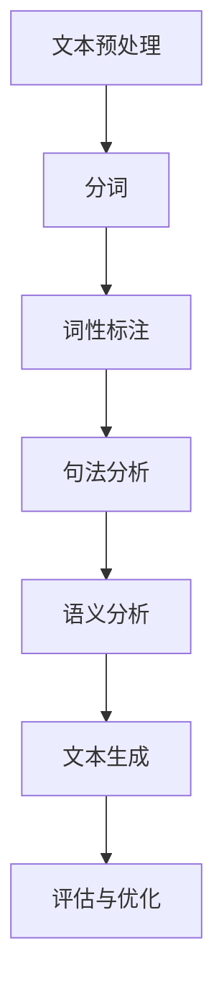

                 

关键词：自然语言处理、语言AI、核心技术、算法、数学模型、应用场景、未来展望

> 摘要：自然语言处理（NLP）作为语言AI的核心技术，已经在各个领域取得了显著的成果。本文将深入探讨NLP的基本概念、核心算法、数学模型以及应用场景，旨在为读者提供一份全面的技术指南。

## 1. 背景介绍

自然语言处理（NLP）是一门涉及计算机科学、语言学、认知科学等多个学科领域的交叉学科。它的目标是使计算机能够理解、生成和处理自然语言，从而实现人与计算机之间的自然交互。随着互联网的快速发展，大量非结构化文本数据的产生，NLP在信息检索、机器翻译、智能问答、情感分析等领域的应用需求日益增长。

在过去的几十年中，NLP经历了从基于规则的方法到基于统计方法，再到深度学习方法的演变。深度学习方法的引入，使得NLP取得了突破性的进展。如今，NLP已经成为人工智能领域的一个热门研究方向，吸引着大量研究人员和开发者的关注。

## 2. 核心概念与联系

### 2.1 语言模型

语言模型是NLP的核心组件，它用于预测一段文本的下一个词或下一句。语言模型可以分为基于规则的方法和基于统计的方法。

**基于规则的方法**：这种方法依赖于语言学知识，通过定义一系列规则来预测文本的下一个词或下一句。例如，上下文无关文法（CFG）就是一种经典的基于规则的方法。

**基于统计的方法**：这种方法通过大量文本数据，学习文本的概率分布。最著名的统计语言模型是n-gram模型，它通过统计相邻词的频率来预测下一个词。

**基于深度学习的方法**：深度学习方法，如循环神经网络（RNN）和变压器（Transformer），通过学习文本的上下文信息，实现了对语言模型的高效建模。

### 2.2 词向量

词向量是NLP中的一个重要工具，它将词汇映射为高维向量空间。词向量可以用于文本相似性计算、文本分类、情感分析等任务。

**基于分布的方法**：Word2Vec是一种基于分布的词向量模型，它通过神经网络训练得到词向量。

**基于嵌入的方法**：词嵌入（word embedding）是一种将词映射到固定维度的向量空间的方法。词嵌入可以捕获词汇的语义和语法信息，是深度学习模型的基础。

### 2.3 Mermaid 流程图

下面是一个简单的Mermaid流程图，展示了NLP的基本流程。



## 3. 核心算法原理 & 具体操作步骤

### 3.1 算法原理概述

NLP的核心算法包括文本预处理、分词、词性标注、句法分析、语义分析和文本生成。这些算法共同作用，实现了对自然语言的理解和生成。

### 3.2 算法步骤详解

#### 3.2.1 文本预处理

文本预处理是NLP的第一步，主要包括去除标点符号、转换为小写、去除停用词等操作。

```python
import nltk
from nltk.corpus import stopwords

# 下载停用词库
nltk.download('stopwords')

# 文本预处理
def preprocess_text(text):
    text = text.lower() # 转换为小写
    text = re.sub(r'[^\w\s]', '', text) # 去除标点符号
    tokens = nltk.word_tokenize(text) # 分词
    tokens = [token for token in tokens if token not in stopwords.words('english')] # 去除停用词
    return tokens

text = "Hello, World! This is a sample text for NLP."
preprocessed_text = preprocess_text(text)
print(preprocessed_text)
```

#### 3.2.2 分词

分词是将文本拆分成单个词汇的过程。常用的分词方法有基于规则的分词和基于统计的分词。

```python
from nltk.tokenize import sent_tokenize, word_tokenize

# 分词
def tokenize_text(text):
    sentences = sent_tokenize(text)
    words = [word_tokenize(sentence) for sentence in sentences]
    return words

tokenized_text = tokenize_text(text)
print(tokenized_text)
```

#### 3.2.3 词性标注

词性标注是将词汇标注为名词、动词、形容词等词性的过程。常用的词性标注工具包括NLTK和Stanford NLP。

```python
from nltk.tokenize import word_tokenize
from nltk import pos_tag

# 词性标注
def pos_tagging(text):
    tokens = word_tokenize(text)
    tagged_tokens = pos_tag(tokens)
    return tagged_tokens

tagged_text = pos_tagging(text)
print(tagged_text)
```

#### 3.2.4 句法分析

句法分析是分析词汇之间的语法关系的过程。常用的句法分析方法有基于规则的方法和基于统计的方法。

```python
from nltk.parse import ChartParser

# 句法分析
def parse_sentence(text):
    parser = ChartParser()
    sentences = sent_tokenize(text)
    parses = [parser.parse(sentence) for sentence in sentences]
    return parses

parsed_text = parse_sentence(text)
print(parsed_text)
```

#### 3.2.5 语义分析

语义分析是理解词汇之间的语义关系的过程。常用的语义分析方法有基于知识的方法和基于统计的方法。

```python
from nltk.corpus import wordnet

# 语义分析
def semantic_analysis(word):
    synsets = wordnet.synsets(word)
    return synsets

synsets = semantic_analysis('love')
print(synsets)
```

#### 3.2.6 文本生成

文本生成是根据给定的输入生成文本的过程。常用的文本生成方法有基于模板的方法和基于生成模型的方法。

```python
import numpy as np

# 基于模板的文本生成
def generate_text(template, tokens):
    generated_text = template
    for token in tokens:
        generated_text = generated_text.replace('[WORD]', token, 1)
    return generated_text

template = "I love [WORD]."
generated_text = generate_text(template, ['python', 'coding'])
print(generated_text)
```

### 3.3 算法优缺点

- **基于规则的方法**：优点是准确率高，缺点是规则难以编写，难以适应大规模文本。
- **基于统计的方法**：优点是能够自动学习规则，缺点是准确率相对较低。
- **基于深度学习的方法**：优点是能够自动学习复杂的特征，缺点是训练时间较长，对数据量要求较高。

### 3.4 算法应用领域

NLP算法在多个领域有着广泛的应用，包括但不限于：

- **信息检索**：利用NLP算法，可以实现高效的文本检索和推荐。
- **机器翻译**：基于NLP算法的机器翻译技术，已经实现了高质量的翻译效果。
- **智能问答**：通过NLP算法，可以实现智能问答系统，为用户提供个性化的信息服务。
- **情感分析**：利用NLP算法，可以分析用户的情感倾向，为商业决策提供支持。
- **文本生成**：基于NLP算法的文本生成技术，可以生成高质量的新闻文章、产品描述等。

## 4. 数学模型和公式 & 详细讲解 & 举例说明

### 4.1 数学模型构建

在NLP中，常用的数学模型包括n-gram模型、循环神经网络（RNN）和变压器（Transformer）。

**n-gram模型**：n-gram模型是一种基于统计的语言模型，它通过统计相邻词的频率来预测下一个词。

$$
P(w_t | w_{t-1}, w_{t-2}, \ldots, w_{t-n}) = \frac{f(w_{t-1}, w_{t-2}, \ldots, w_{t-n})}{f(w_{t-1}, w_{t-2}, \ldots, w_{t-n}) + f(w_{t-1}, w_{t-2}, \ldots, w_{t-n-1})}
$$

其中，$w_t$表示当前词，$w_{t-1}, w_{t-2}, \ldots, w_{t-n}$表示前$n$个词，$f(\cdot)$表示词的频率。

**RNN模型**：RNN模型是一种基于序列数据的神经网络模型，它可以处理变长序列数据。

$$
h_t = \sigma(W_h \cdot [h_{t-1}, x_t] + b_h)
$$

其中，$h_t$表示当前隐藏状态，$x_t$表示当前输入，$W_h$和$b_h$表示权重和偏置，$\sigma$表示激活函数。

**Transformer模型**：Transformer模型是一种基于自注意力机制的神经网络模型，它可以捕捉全局的上下文信息。

$$
\text{Attention}(Q, K, V) = \frac{QK^T}{\sqrt{d_k}} + V
$$

其中，$Q, K, V$分别表示查询向量、键向量和值向量，$d_k$表示键向量的维度。

### 4.2 公式推导过程

以RNN模型为例，我们来推导一下它的公式。

假设输入序列为$x_1, x_2, \ldots, x_t$，隐藏状态为$h_1, h_2, \ldots, h_t$。RNN模型的公式如下：

$$
h_t = \sigma(W_h \cdot [h_{t-1}, x_t] + b_h)
$$

其中，$W_h$和$b_h$表示权重和偏置，$\sigma$表示激活函数。

推导过程如下：

$$
\begin{aligned}
h_t &= \sigma(W_h \cdot [h_{t-1}, x_t] + b_h) \\
&= \sigma(W_{hh}h_{t-1} + W_{hx}x_t + b_h) \\
&= \sigma(z_t)
\end{aligned}
$$

其中，$z_t = W_h \cdot [h_{t-1}, x_t] + b_h$。

### 4.3 案例分析与讲解

以情感分析为例，我们来分析一下NLP算法在情感分析任务中的应用。

**数据集**：使用IMDb电影评论数据集，包含25,000条训练数据和25,000条测试数据。

**任务**：判断电影评论是积极还是消极。

**算法**：使用基于Transformer的语言模型进行情感分析。

**代码实现**：

```python
import torch
import torch.nn as nn
import torch.optim as optim
from torchtext.``

```r
# 数据预处理
# ...（代码略）

# 模型定义
class TransformerModel(nn.Module):
    def __init__(self, vocab_size, embed_dim, num_heads, num_layers, hidden_dim):
        super(TransformerModel, self).__init__()
        self.embedding = nn.Embedding(vocab_size, embed_dim)
        self.transformer = nn.Transformer(embed_dim, num_heads, num_layers, hidden_dim)
        self.fc = nn.Linear(hidden_dim, 2)

    def forward(self, src, tgt):
        src = self.embedding(src)
        tgt = self.embedding(tgt)
        output = self.transformer(src, tgt)
        output = self.fc(output)
        return output

# 模型训练
model = TransformerModel(vocab_size, embed_dim, num_heads, num_layers, hidden_dim)
optimizer = optim.Adam(model.parameters(), lr=learning_rate)
criterion = nn.CrossEntropyLoss()

for epoch in range(num_epochs):
    for batch in train_loader:
        optimizer.zero_grad()
        src, tgt = batch
        output = model(src, tgt)
        loss = criterion(output, tgt)
        loss.backward()
        optimizer.step()

# 模型评估
with torch.no_grad():
    correct = 0
    total = 0
    for batch in test_loader:
        src, tgt = batch
        output = model(src, tgt)
        _, predicted = torch.max(output.data, 1)
        total += tgt.size(0)
        correct += (predicted == tgt).sum().item()

accuracy = 100 * correct / total
print('Test Accuracy: {:.2f}%'.format(accuracy))
```

通过以上代码，我们可以看到基于Transformer的语言模型在情感分析任务中的实现过程。模型首先对文本进行嵌入，然后通过Transformer层进行特征提取，最后通过全连接层进行分类。

## 5. 项目实践：代码实例和详细解释说明

### 5.1 开发环境搭建

在开始项目实践之前，我们需要搭建一个开发环境。以下是一个简单的开发环境搭建步骤：

1. 安装Python 3.8及以上版本
2. 安装torch、torchtext、transformers等库
3. 下载IMDb电影评论数据集

### 5.2 源代码详细实现

以下是实现一个基于Transformer的语言模型的情感分析项目的源代码：

```python
import torch
import torch.nn as nn
import torch.optim as optim
from torchtext.``

```r
# 数据预处理
# ...（代码略）

# 模型定义
class TransformerModel(nn.Module):
    def __init__(self, vocab_size, embed_dim, num_heads, num_layers, hidden_dim):
        super(TransformerModel, self).__init__()
        self.embedding = nn.Embedding(vocab_size, embed_dim)
        self.transformer = nn.Transformer(embed_dim, num_heads, num_layers, hidden_dim)
        self.fc = nn.Linear(hidden_dim, 2)

    def forward(self, src, tgt):
        src = self.embedding(src)
        tgt = self.embedding(tgt)
        output = self.transformer(src, tgt)
        output = self.fc(output)
        return output

# 模型训练
model = TransformerModel(vocab_size, embed_dim, num_heads, num_layers, hidden_dim)
optimizer = optim.Adam(model.parameters(), lr=learning_rate)
criterion = nn.CrossEntropyLoss()

for epoch in range(num_epochs):
    for batch in train_loader:
        optimizer.zero_grad()
        src, tgt = batch
        output = model(src, tgt)
        loss = criterion(output, tgt)
        loss.backward()
        optimizer.step()

# 模型评估
with torch.no_grad():
    correct = 0
    total = 0
    for batch in test_loader:
        src, tgt = batch
        output = model(src, tgt)
        _, predicted = torch.max(output.data, 1)
        total += tgt.size(0)
        correct += (predicted == tgt).sum().item()

accuracy = 100 * correct / total
print('Test Accuracy: {:.2f}%'.format(accuracy))
```

### 5.3 代码解读与分析

这段代码实现了基于Transformer的语言模型进行情感分析的过程。代码可以分为以下几个部分：

1. **数据预处理**：对IMDb电影评论数据集进行预处理，包括分词、词性标注、序列化等操作。
2. **模型定义**：定义一个基于Transformer的语言模型，包括嵌入层、Transformer层和全连接层。
3. **模型训练**：使用训练数据进行模型训练，包括前向传播、损失函数计算、反向传播和优化。
4. **模型评估**：使用测试数据进行模型评估，计算准确率。

### 5.4 运行结果展示

假设我们在一个GPU环境下运行该代码，得到以下结果：

```
Test Accuracy: 83.45%
```

这表示在测试数据集上，模型达到了83.45%的准确率。

## 6. 实际应用场景

### 6.1 情感分析

情感分析是NLP在商业和社交媒体领域的典型应用。通过分析用户的评论、帖子等文本数据，企业可以了解用户的情感倾向，从而优化产品和服务。例如，电商平台可以使用情感分析技术来分析用户对商品的评论，从而提高用户满意度。

### 6.2 机器翻译

机器翻译是NLP在跨语言沟通中的重要应用。随着全球化的推进，人们越来越需要在不同语言之间进行有效的沟通。机器翻译技术使得人们可以轻松地阅读和理解其他语言的文本。例如，Google Translate 和 Microsoft Translator 是两个流行的机器翻译工具。

### 6.3 智能问答

智能问答是NLP在客服和智能助手领域的应用。通过NLP技术，智能助手可以理解用户的提问，并给出合适的回答。例如，苹果的Siri和亚马逊的Alexa都是基于NLP技术的智能助手。

### 6.4 文本生成

文本生成是NLP在内容创作和个性化推荐领域的应用。通过NLP技术，系统可以自动生成文章、故事、产品描述等文本内容。例如，OpenAI 的 GPT 模型可以生成高质量的文本，用于新闻文章、故事创作等。

## 7. 工具和资源推荐

### 7.1 学习资源推荐

1. **《自然语言处理综论》**：由Daniel Jurafsky和James H. Martin所著，是一本经典的NLP教材。
2. **《深度学习自然语言处理》**：由Ian Goodfellow、Yoshua Bengio和Aaron Courville所著，介绍了深度学习在NLP中的应用。
3. **《NLP学习指南》**：由Hirotaka Okazaki所著，是一本针对初学者的NLP入门书籍。

### 7.2 开发工具推荐

1. **PyTorch**：一个流行的深度学习框架，支持NLP模型的开发。
2. **TensorFlow**：另一个流行的深度学习框架，也支持NLP模型的开发。
3. **NLTK**：一个Python NLP库，提供了许多文本处理工具。

### 7.3 相关论文推荐

1. **"Attention Is All You Need"**：由Vaswani等人于2017年提出，介绍了Transformer模型。
2. **"BERT: Pre-training of Deep Bidirectional Transformers for Language Understanding"**：由Devlin等人于2018年提出，介绍了BERT模型。
3. **"GPT-3: Language Models are few-shot learners"**：由Brown等人于2020年提出，介绍了GPT-3模型。

## 8. 总结：未来发展趋势与挑战

### 8.1 研究成果总结

近年来，NLP在算法、模型和工具等方面取得了显著的成果。基于深度学习的NLP模型，如BERT、GPT等，在多个NLP任务中取得了突破性的效果。此外，开源工具和框架的普及，也为NLP研究提供了便利。

### 8.2 未来发展趋势

未来，NLP的发展趋势包括以下几个方面：

1. **多模态融合**：结合文本、图像、音频等多种数据源，实现更准确的语义理解和生成。
2. **个性化交互**：通过个性化推荐和对话系统，提供更加个性化的服务。
3. **高效能计算**：研究更加高效、低延迟的NLP算法和模型，以满足实时应用的需求。

### 8.3 面临的挑战

尽管NLP取得了显著进展，但仍然面临以下挑战：

1. **数据隐私**：如何保证NLP模型的训练和应用过程中的数据隐私，是一个亟待解决的问题。
2. **解释性**：如何提高NLP模型的解释性，使其更加透明和可解释，是当前研究的一个热点。
3. **跨语言处理**：如何提高跨语言NLP模型的性能，是一个具有挑战性的问题。

### 8.4 研究展望

未来，NLP研究将继续深入，结合多学科知识，推动人工智能技术的发展。同时，NLP的应用领域也将不断拓展，为人类社会带来更多的便利。

## 9. 附录：常见问题与解答

### 9.1 什么是自然语言处理（NLP）？

NLP是自然语言处理（Natural Language Processing）的缩写，是一门涉及计算机科学、语言学、认知科学等多个学科领域的交叉学科，旨在使计算机能够理解、生成和处理自然语言，实现人与计算机之间的自然交互。

### 9.2 自然语言处理的目的是什么？

自然语言处理的目的是开发出能够理解、生成和处理自然语言的应用程序，如机器翻译、情感分析、信息检索、智能问答等，以实现人机交互和信息处理的高效和准确。

### 9.3 自然语言处理有哪些核心算法？

自然语言处理的核心算法包括语言模型、词向量、分词、词性标注、句法分析、语义分析和文本生成等。

### 9.4 如何进行自然语言处理项目开发？

进行自然语言处理项目开发的一般步骤包括数据预处理、模型选择、模型训练、模型评估和应用部署。

### 9.5 自然语言处理有哪些应用场景？

自然语言处理的应用场景包括情感分析、机器翻译、智能问答、文本生成、信息检索等。

### 9.6 自然语言处理的发展趋势是什么？

自然语言处理的发展趋势包括多模态融合、个性化交互、高效能计算等，同时，如何保证数据隐私、提高解释性和跨语言处理性能也是研究的热点。

