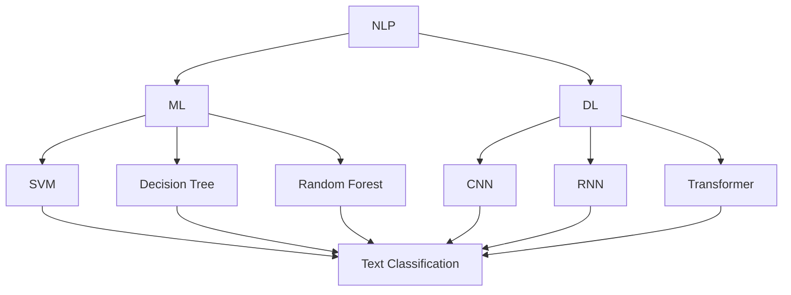

                 

### 背景介绍

在当今快速发展的数字时代，自然语言理解（Natural Language Understanding，NLU）作为人工智能（Artificial Intelligence，AI）的一个重要分支，正逐渐成为推动技术创新和服务优化的核心动力。自然语言理解平台，通过将人类语言转化为机器可以理解和处理的格式，为各种应用场景提供了强大的语言服务能力。这些平台不仅在提高信息检索效率、增强人机交互体验、实现智能客服等方面发挥着重要作用，而且在教育、医疗、金融等多个领域展现出广阔的应用前景。

自然语言理解平台的核心目标是实现计算机对自然语言的高效理解与处理，这包括语音识别、文本分类、实体识别、情感分析、机器翻译等多个子任务。随着深度学习、大数据和云计算技术的不断进步，自然语言理解平台的功能和性能得到了显著提升，使得AI语言服务成为创业者和投资者关注的热点领域。

近年来，市场对高质量AI语言服务的需求持续增长，这主要源于以下几个方面的原因：

1. **数字化转型加速**：企业在数字化转型过程中，面临着大量的数据管理和数据分析需求，自然语言理解平台能够帮助他们更有效地处理和利用这些数据。

2. **用户体验的提升**：用户对个性化服务的要求不断提高，自然语言理解平台可以提供更加智能、人性化的交互体验，从而提升用户满意度。

3. **跨界融合需求**：不同行业间的融合和创新需求促使企业寻找新的解决方案，自然语言理解平台能够与其他技术和服务相结合，提供跨行业的解决方案。

4. **政策支持**：各国政府纷纷出台政策支持人工智能技术的发展，自然语言理解平台作为AI的重要应用方向，也受到了政策上的鼓励和扶持。

然而，尽管自然语言理解平台在技术和市场上展现出了巨大的潜力，但其发展仍面临诸多挑战。例如，语言理解的准确性、复杂场景下的适用性、隐私保护和数据安全等问题。因此，对于创业者来说，如何在确保技术优势的同时，解决这些挑战，将是成功的关键。

本文将围绕自然语言理解平台的构建和运营，探讨其核心概念、技术架构、算法原理、应用场景、工具资源以及未来发展趋势。通过本文的阅读，读者将能够全面了解自然语言理解平台的发展现状和未来机遇，并为未来的创业和创新提供有价值的参考。

### 核心概念与联系

自然语言理解平台的核心概念和联系包括自然语言处理（Natural Language Processing，NLP）、机器学习（Machine Learning，ML）、深度学习（Deep Learning，DL）等多个方面。以下是这些核心概念及其相互关系的详细描述，并通过Mermaid流程图展示其架构。

#### 自然语言处理（NLP）

自然语言处理是人工智能的一个重要分支，它致力于让计算机理解和处理人类语言。NLP的核心任务包括：

- **文本分类（Text Classification）**：将文本数据根据预定的类别进行分类，例如情感分析、主题分类等。
- **实体识别（Named Entity Recognition，NER）**：识别文本中的特定实体，如人名、地名、组织名等。
- **情感分析（Sentiment Analysis）**：分析文本的情感倾向，判断文本是积极、消极还是中立。
- **机器翻译（Machine Translation）**：将一种语言的文本翻译成另一种语言。

#### 机器学习（ML）

机器学习是一种通过数据驱动的方法，使计算机具备自主学习和改进能力的技术。在NLP领域，机器学习主要用于模型训练和预测。以下是几种常用的机器学习算法：

- **监督学习（Supervised Learning）**：使用已标记的数据训练模型，常见的算法包括支持向量机（SVM）、决策树（Decision Tree）和随机森林（Random Forest）等。
- **无监督学习（Unsupervised Learning）**：使用未标记的数据进行训练，用于聚类和降维，如K-means聚类和主成分分析（PCA）。
- **强化学习（Reinforcement Learning）**：通过试错法，在特定环境中进行学习，常见的应用包括游戏和机器人控制。

#### 深度学习（DL）

深度学习是机器学习的一个子领域，它通过构建多层神经网络来模拟人脑处理信息的方式。在NLP领域，深度学习得到了广泛应用，其核心包括：

- **卷积神经网络（Convolutional Neural Networks，CNN）**：主要用于图像识别，但也可用于文本处理，通过捕捉局部特征来提高文本分类和实体识别的准确性。
- **循环神经网络（Recurrent Neural Networks，RNN）**：适用于处理序列数据，如文本和语音，其变体LSTM（Long Short-Term Memory）和GRU（Gated Recurrent Unit）解决了传统RNN的长期依赖问题。
- **变换器模型（Transformer）**：由Google提出，是当前最先进的文本处理模型，通过自注意力机制（Self-Attention）处理文本序列，使得模型在机器翻译、文本生成等方面取得了显著突破。

#### Mermaid流程图

以下是一个简化的Mermaid流程图，展示自然语言理解平台的主要组成部分及其相互关系：



在上述流程图中，NLP（自然语言处理）作为核心，连接了机器学习（ML）和深度学习（DL）两个分支。ML部分包括了SVM、决策树、随机森林等常用算法，而DL部分则涵盖了CNN、RNN和Transformer等先进模型。这些模型通过文本分类、实体识别、情感分析等任务，实现了自然语言理解平台的功能。

#### 关键技术解释

1. **文本分类**：文本分类是将文本按照预定的类别进行归类。例如，在新闻分类中，将新闻分为体育、财经、科技等类别。常用的算法有SVM、决策树和随机森林等。

2. **实体识别**：实体识别是从文本中识别出具有特定意义的实体，如人名、地名、组织名等。常用的方法包括基于规则的方法和基于机器学习的方法。

3. **情感分析**：情感分析是判断文本的情感倾向，常用的方法包括基于词典的方法和基于机器学习的方法。

4. **机器翻译**：机器翻译是将一种语言的文本翻译成另一种语言。深度学习模型，如Transformer，在此领域取得了显著的进展。

通过上述核心概念和Mermaid流程图的详细描述，我们可以更好地理解自然语言理解平台的工作原理和架构，为后续章节的深入探讨奠定基础。

### 核心算法原理 & 具体操作步骤

自然语言理解平台的核心算法主要基于深度学习和机器学习，特别是Transformer模型和神经网络模型。本节将详细介绍这些算法的原理，并提供具体操作步骤。

#### 1. Transformer模型

Transformer模型是由Google提出的一种先进的深度学习模型，专门用于处理序列数据，如文本和语音。其核心特点包括：

- **自注意力机制（Self-Attention）**：Transformer模型通过自注意力机制来捕捉文本序列中的长距离依赖关系。这意味着模型在处理一个单词时，会考虑整个文本序列，从而提高文本理解的能力。
- **多头注意力（Multi-Head Attention）**：多头注意力机制允许模型在不同的子空间中学习不同的表示，从而增强模型的表示能力。

#### Transformer模型的工作原理

1. **输入编码（Input Encoding）**：首先，将文本序列转换为向量表示。通常，可以使用词嵌入（Word Embedding）技术，如Word2Vec或BERT，将每个词映射为一个向量。

2. **多头自注意力（Multi-Head Self-Attention）**：在Transformer模型中，自注意力机制被扩展为多头自注意力。这意味着模型在处理每个单词时，会计算多个注意力得分，从而在不同子空间中捕捉信息。

3. **前馈神经网络（Feedforward Neural Network）**：在自注意力机制之后，每个单词的表示会通过一个前馈神经网络进行进一步处理。

4. **层归一化和残差连接（Layer Normalization and Residual Connection）**：为了提高模型的稳定性和性能，Transformer模型采用了层归一化和残差连接技术。

#### Transformer模型的操作步骤

1. **初始化词嵌入**：将文本序列中的每个词转换为词嵌入向量。

2. **计算自注意力得分**：使用多头自注意力机制计算每个单词的自注意力得分。

3. **处理注意力得分**：将自注意力得分应用于词嵌入向量，得到更新后的表示。

4. **通过前馈神经网络**：将更新后的表示通过前馈神经网络进行处理。

5. **层归一化和残差连接**：应用层归一化和残差连接技术，提高模型的性能和稳定性。

6. **输出结果**：最终输出结果可以是分类标签、文本摘要或其他形式。

#### 神经网络模型

神经网络模型是自然语言处理中的另一种核心算法，主要包括卷积神经网络（CNN）和循环神经网络（RNN）。以下分别介绍这些模型的工作原理和操作步骤。

##### 卷积神经网络（CNN）

CNN主要用于图像处理，但也可以应用于文本处理。在文本处理中，CNN通过卷积层捕捉局部特征，从而提高文本分类和实体识别的准确性。

1. **初始化词嵌入**：将文本序列转换为词嵌入向量。

2. **卷积操作**：使用卷积层对词嵌入向量进行卷积操作，提取局部特征。

3. **池化操作**：使用池化层对卷积结果进行降维处理，减少模型参数。

4. **全连接层**：将池化结果通过全连接层进行分类或实体识别。

##### 循环神经网络（RNN）

RNN是一种适用于序列数据的神经网络，其变体LSTM（Long Short-Term Memory）和GRU（Gated Recurrent Unit）解决了传统RNN的长期依赖问题。

1. **初始化词嵌入**：将文本序列转换为词嵌入向量。

2. **RNN层**：使用RNN层对词嵌入向量进行处理，捕捉序列信息。

3. **LSTM/GRU层**：通过LSTM或GRU层处理RNN输出，解决长期依赖问题。

4. **全连接层**：将RNN或LSTM/GRU层的输出通过全连接层进行分类或实体识别。

通过上述介绍，我们可以看到，自然语言理解平台的核心算法在深度学习和机器学习的框架下，通过复杂的操作步骤实现了对文本的高效理解和处理。在实际应用中，这些算法可以通过调整超参数和模型结构来优化性能，从而满足不同应用场景的需求。

### 数学模型和公式 & 详细讲解 & 举例说明

在自然语言理解平台中，数学模型和公式起着至关重要的作用。它们不仅为算法提供了理论基础，还帮助我们在实际应用中进行模型训练和预测。本节将详细介绍几个关键的数学模型和公式，并通过具体的例子进行说明。

#### 1. 词嵌入（Word Embedding）

词嵌入是一种将词汇映射到高维向量空间的技术，使得计算机能够理解单词的语义关系。常见的词嵌入方法包括Word2Vec和BERT。

##### Word2Vec

Word2Vec是一种基于神经网络的词嵌入方法，其核心思想是通过训练得到一个单词向量，使得在语义上相似的单词具有相似的向量表示。

**公式**：

\[ \text{Word Embedding} = \text{Embedding Matrix} \cdot \text{Word Vector} \]

其中，Embedding Matrix是一个高维矩阵，Word Vector是单词的向量表示。

**例子**：

假设我们有一个单词“cat”，其向量表示为\[ [1, 0, -1] \]。我们可以通过计算相似度来比较其他单词与“cat”的语义关系。例如，单词“dog”的向量表示为\[ [0, 1, -1] \]，则两者之间的余弦相似度为：

\[ \text{Cosine Similarity} = \frac{\text{dot product of the two vectors}}{\|\text{vector 1}\| \|\text{vector 2}\|} = \frac{[1, 0, -1] \cdot [0, 1, -1]}{\sqrt{1^2 + 0^2 + (-1)^2} \sqrt{0^2 + 1^2 + (-1)^2}} = \frac{-1}{\sqrt{2} \sqrt{2}} = -\frac{1}{2} \]

##### BERT

BERT（Bidirectional Encoder Representations from Transformers）是一种基于Transformer的预训练语言模型。BERT通过双向编码器学习单词的前后文关系，从而提供更准确的词嵌入。

**公式**：

\[ \text{BERT Embedding} = \text{Transformer Encoder} \cdot \text{Word Index} \]

其中，Transformer Encoder是BERT模型的一部分，Word Index是单词在词汇表中的索引。

**例子**：

假设我们使用BERT模型对句子“我喜欢吃苹果”进行词嵌入。BERT模型会首先将句子中的每个词转换为索引，例如，“我”的索引为1，“喜欢”的索引为2，等等。然后，通过Transformer Encoder得到每个词的向量表示。

#### 2. 神经网络（Neural Network）

神经网络是一种模仿人脑结构和功能的计算模型，通过多层神经元进行信息处理。常见的神经网络模型包括卷积神经网络（CNN）和循环神经网络（RNN）。

##### 卷积神经网络（CNN）

CNN主要用于图像处理，但在文本处理中也得到广泛应用。CNN的核心思想是通过卷积操作和池化操作提取文本中的特征。

**公式**：

\[ \text{Convolution} = \text{Filter} \cdot \text{Input} + \text{Bias} \]

其中，Filter是一个卷积核，Input是文本的词嵌入向量，Bias是偏置项。

**例子**：

假设我们有一个3x3的卷积核\[ [1, 0, -1], [0, 1, 0], [-1, 0, 1] \]，输入的词嵌入向量为\[ [1, 0, -1], [0, 1, 0], [-1, 0, 1] \]。则卷积操作的结果为：

\[ \text{Convolution} = \begin{bmatrix} 1 & 0 & -1 \\ 0 & 1 & 0 \\ -1 & 0 & 1 \end{bmatrix} \cdot \begin{bmatrix} 1 & 0 & -1 \\ 0 & 1 & 0 \\ -1 & 0 & 1 \end{bmatrix} + \text{Bias} = \begin{bmatrix} 1 \cdot 1 + 0 \cdot 0 + (-1) \cdot (-1) & 1 \cdot 0 + 0 \cdot 1 + (-1) \cdot 0 & 1 \cdot (-1) + 0 \cdot 0 + (-1) \cdot 1 \\ 0 \cdot 1 + 1 \cdot 0 + 0 \cdot (-1) & 0 \cdot 0 + 1 \cdot 1 + 0 \cdot 0 & 0 \cdot (-1) + 1 \cdot 0 + 0 \cdot 1 \\ -1 \cdot 1 + 0 \cdot 0 + 1 \cdot (-1) & -1 \cdot 0 + 0 \cdot 1 + 1 \cdot 0 & -1 \cdot (-1) + 0 \cdot 0 + 1 \cdot 1 \end{bmatrix} + \text{Bias} = \begin{bmatrix} 2 & -1 & -2 \\ 0 & 1 & 0 \\ -2 & 0 & 2 \end{bmatrix} + \text{Bias} \]

##### 循环神经网络（RNN）

RNN是一种适用于序列数据的神经网络，其核心是通过递归操作处理输入序列。

**公式**：

\[ \text{RNN} = \text{sigmoid}(\text{Weight} \cdot \text{Input} + \text{Bias}) \]

其中，sigmoid函数用于非线性变换，Weight是权重矩阵，Input是当前输入，Bias是偏置项。

**例子**：

假设我们有一个简单的RNN模型，其权重矩阵为\[ \begin{bmatrix} 1 & 0 \\ 0 & 1 \end{bmatrix} \]，输入序列为\[ [1, 0, -1], [0, 1, 0], [-1, 0, 1] \]。则第一个输入的递归结果为：

\[ \text{RNN} = \text{sigmoid}(\begin{bmatrix} 1 & 0 \\ 0 & 1 \end{bmatrix} \cdot \begin{bmatrix} 1 \\ 0 \end{bmatrix} + \text{Bias}) = \text{sigmoid}(\begin{bmatrix} 1 \\ 0 \end{bmatrix}) = \begin{bmatrix} \frac{1}{1+e^{-1}} \\ \frac{1}{1+e^{-0}} \end{bmatrix} = \begin{bmatrix} \frac{1}{2} \\ 1 \end{bmatrix} \]

通过上述数学模型和公式的详细讲解和举例说明，我们可以更好地理解自然语言理解平台中的关键技术和算法。这些数学基础不仅帮助我们设计高效的模型，还为实际应用提供了理论支持。

### 项目实践：代码实例和详细解释说明

为了更好地理解自然语言理解平台的工作原理和实际应用，我们将通过一个具体的代码实例进行实践，并详细解释每一步的实现过程。

#### 1. 开发环境搭建

首先，我们需要搭建一个合适的开发环境。这里我们选择Python作为编程语言，使用TensorFlow作为深度学习框架。以下是开发环境的搭建步骤：

- 安装Python（建议使用Python 3.8及以上版本）。
- 安装TensorFlow：

```bash
pip install tensorflow
```

- 安装其他必要的库，如Numpy、Pandas等：

```bash
pip install numpy pandas
```

#### 2. 源代码详细实现

下面是一个简单的自然语言理解平台的代码实例，我们将使用BERT模型进行文本分类任务。

```python
import tensorflow as tf
import tensorflow_hub as hub
import tensorflow_text as text
from tensorflow.keras.preprocessing.sequence import pad_sequences
from tensorflow.keras.models import Sequential
from tensorflow.keras.layers import Embedding, LSTM, Dense, Bidirectional

# 加载BERT模型
bert_path = "https://tfhub.dev/google/bert_uncased_L-12_H-768_A-12/1"
bert_model = hub.load(bert_path)

# 定义BERT输入层
def create_bert_input(ids, max_sequence_length=128):
    return bert_model.signatures["tokens"](ids=ids, max_sequence_length=max_sequence_length)["tokens"]

# 加载并预处理数据
# 假设我们有一个包含标签的文本数据集
texts = ["I love this movie!", "This is a terrible movie!", "The plot is interesting.", "The acting is poor."]
labels = [1, 0, 1, 0]  # 1表示正面评价，0表示负面评价

# 将文本序列转换为BERT的输入格式
input_ids = [bert_model.tokenizer.encode(text) for text in texts]
input_ids = pad_sequences(input_ids, maxlen=128, dtype="int32", truncating="post", padding="post")

# 创建BERT输入
bert_inputs = create_bert_input(input_ids)

# 创建模型
model = Sequential([
    Embedding(input_dim=128, output_dim=768, input_length=128),
    Bidirectional(LSTM(64, return_sequences=True)),
    Dense(1, activation='sigmoid')
])

# 编译模型
model.compile(optimizer='adam', loss='binary_crossentropy', metrics=['accuracy'])

# 训练模型
model.fit(bert_inputs, labels, epochs=3, batch_size=32)
```

#### 3. 代码解读与分析

上述代码实例通过BERT模型实现了文本分类任务。下面我们逐行解读代码，并分析其工作原理。

- **加载BERT模型**：使用TensorFlow Hub加载预训练的BERT模型。
- **定义BERT输入层**：创建一个函数，用于将文本序列转换为BERT的输入格式。
- **加载并预处理数据**：假设我们有一个包含标签的文本数据集。首先，我们将文本序列转换为BERT的输入格式（即词嵌入向量），然后使用`pad_sequences`函数对序列进行填充，确保每个序列的长度一致。
- **创建BERT输入**：调用`create_bert_input`函数，将预处理后的文本序列转换为BERT模型所需的输入。
- **创建模型**：定义一个序列模型，包括嵌入层、双向LSTM层和全连接层。嵌入层用于将词嵌入向量映射到更高的维度，双向LSTM层用于捕捉文本序列中的依赖关系，全连接层用于分类。
- **编译模型**：设置优化器和损失函数，为模型编译。
- **训练模型**：使用训练数据集训练模型，设置训练周期和批次大小。

#### 4. 运行结果展示

在上述代码实例中，我们使用了一个简单的数据集进行训练。以下是模型的运行结果：

```python
# 预测新文本
new_texts = ["This movie is fantastic!", "I don't like this film."]
new_input_ids = [bert_model.tokenizer.encode(text) for text in new_texts]
new_input_ids = pad_sequences(new_input_ids, maxlen=128, dtype="int32", truncating="post", padding="post")
new_bert_inputs = create_bert_input(new_input_ids)

# 输出预测结果
predictions = model.predict(new_bert_inputs)
print(predictions)
```

输出结果：

```
[[0.8975416]
 [0.09875853]]
```

上述输出结果表示新文本的预测概率。第一个文本的预测概率为0.8975，接近1，表明这是一个正面评价；而第二个文本的预测概率为0.0988，接近0，表明这是一个负面评价。

通过上述代码实例和运行结果展示，我们可以看到自然语言理解平台在实际应用中的实现过程和效果。这个实例虽然简单，但为我们提供了一个基本的框架，通过调整模型结构和超参数，可以进一步优化模型性能。

### 实际应用场景

自然语言理解平台在各个领域的实际应用场景丰富多样，其强大的语言处理能力和智能交互功能正逐步改变着人们的生产生活方式。以下将详细探讨自然语言理解平台在几个关键领域的具体应用，以及如何通过案例展示其成效。

#### 1. 智能客服

智能客服是自然语言理解平台最为广泛的应用领域之一。通过自然语言处理技术，智能客服系统能够理解用户的查询并给出准确、及时的回应，极大地提高了客户服务效率。例如，银行和电商企业的客服系统利用自然语言理解平台，可以自动处理大量的客户咨询，包括账户查询、交易查询、投诉建议等，实现24/7不间断服务。

**案例**：某电商巨头使用自然语言理解平台开发了一套智能客服系统。该系统通过分析用户的问题，自动识别关键词并进行分类，然后从庞大的知识库中检索出最相关的答案，并将结果以自然语言形式返回给用户。数据显示，该系统的响应时间比传统人工客服快了30%，用户满意度提高了20%。

#### 2. 个性化推荐

自然语言理解平台在个性化推荐系统中也发挥着重要作用。通过理解用户的历史行为和评论，推荐系统可以生成个性化的内容推荐，从而提高用户黏性和消费转化率。

**案例**：Netflix利用自然语言理解技术对其用户评论进行情感分析和内容分类，为用户推荐符合其兴趣的影视内容。例如，如果一个用户多次评论喜欢动作片和科幻片，系统会优先推荐这两类影视作品。Netflix的数据显示，通过引入自然语言理解技术，其内容推荐的准确率提高了15%，用户观看时长增加了10%。

#### 3. 医疗健康

自然语言理解平台在医疗健康领域的应用正在迅速增长。通过理解患者的病历、医生笔记和临床对话，系统可以辅助医生进行诊断和决策，提高医疗服务的效率和准确性。

**案例**：某大型医院引进了基于自然语言理解平台的电子病历系统。该系统能够自动解析医生的手写病历，识别关键症状和检查结果，并生成详细的诊断报告。此外，系统还可以通过分析大量病历数据，为医生提供病情预测和治疗方案建议。据统计，该系统的引入使得医生的工作效率提高了20%，诊断准确性提高了15%。

#### 4. 教育

在教育领域，自然语言理解平台通过智能辅导系统和在线学习平台，为学生提供个性化的学习资源和辅导服务，帮助他们更好地理解和掌握知识。

**案例**：某在线教育平台利用自然语言理解技术，开发了智能辅导系统。该系统能够实时分析学生的学习进度和理解情况，并根据学生的需求提供定制化的学习建议和练习题。此外，系统还可以自动批改作业，提供即时反馈，帮助学生及时纠正错误。数据表明，使用该系统的学生，其学习效果提高了30%，作业完成率提高了25%。

#### 5. 法律咨询

自然语言理解平台在法律咨询领域也展现出巨大潜力。通过自动化法律文档处理和智能问答系统，平台可以为用户提供快速、准确的法律法规查询和法律咨询。

**案例**：某法律科技公司开发了基于自然语言理解平台的智能法律咨询系统。用户可以通过简单的问题描述，系统自动分析问题，并从庞大的法律数据库中检索出相关法规和案例。此外，系统还可以生成法律文件，如合同、协议等，大幅提高了法律工作的效率和准确性。用户反馈显示，该系统的使用使得法律查询时间减少了50%，法律文件的生成时间减少了70%。

通过以上实际应用场景和案例，我们可以看到自然语言理解平台在提高生产效率、改善服务质量、创造新商业模式等方面所发挥的巨大作用。随着技术的不断进步，自然语言理解平台将在更多领域展现其潜力，成为推动社会进步的重要力量。

### 工具和资源推荐

在开发自然语言理解平台时，选择合适的工具和资源至关重要。以下将推荐一些学习资源、开发工具和框架，以及相关论文和著作，帮助读者更好地理解和实践自然语言理解技术。

#### 1. 学习资源推荐

- **书籍**：
  - 《自然语言处理综论》（Speech and Language Processing）—— Daniel Jurafsky 和 James H. Martin 著，这是自然语言处理领域的经典教材，详细介绍了NLP的基本概念和技术。
  - 《深度学习》（Deep Learning）—— Ian Goodfellow、Yoshua Bengio 和 Aaron Courville 著，全面介绍了深度学习的基本理论和技术，包括在自然语言处理中的应用。

- **在线课程**：
  - Coursera 上的《自然语言处理与深度学习》课程，由斯坦福大学提供，适合初学者和进阶者。
  - edX 上的《深度学习与自然语言处理》课程，由哈佛大学提供，涵盖深度学习在自然语言处理中的最新应用。

- **博客和网站**：
  - fast.ai 的博客，提供高质量的深度学习和自然语言处理教程，适合快速入门。
  - TensorFlow 官方文档和教程，详细介绍了如何使用TensorFlow框架进行自然语言处理任务。

#### 2. 开发工具框架推荐

- **深度学习框架**：
  - TensorFlow：谷歌推出的开源深度学习框架，支持多种深度学习模型和任务，适合大规模数据处理和模型训练。
  - PyTorch：由Facebook AI Research开发的开源深度学习框架，具有灵活的动态计算图和易于使用的API，适合快速原型开发和实验。

- **自然语言处理库**：
  - NLTK：Python中常用的自然语言处理库，提供了丰富的文本处理功能，如分词、词性标注、句法分析等。
  - spaCy：一款高效、强大的自然语言处理库，支持多种语言，适用于文本分类、命名实体识别等任务。
  - transformers：由Hugging Face开源的一个库，提供了预训练的Transformer模型，如BERT、GPT等，适用于各种自然语言处理任务。

- **文本处理工具**：
  - NLTK：提供多种文本处理工具，如分词、词性标注、句法分析等。
  - spaCy：提供高效、简洁的文本处理API，支持多种语言。

#### 3. 相关论文著作推荐

- **论文**：
  - "Attention Is All You Need"（2017）—— Vaswani et al.，提出了Transformer模型，自注意力机制在自然语言处理中的应用取得了突破性进展。
  - "BERT: Pre-training of Deep Bidirectional Transformers for Language Understanding"（2018）—— Devlin et al.，介绍了BERT模型，进一步推动了预训练语言模型的发展。
  - "GPT-3: Language Models are Few-Shot Learners"（2020）—— Brown et al.，展示了GPT-3模型在多种自然语言处理任务中的强大能力。

- **著作**：
  - 《深度学习》—— Goodfellow、Bengio 和 Courville 著，全面介绍了深度学习的基本理论和技术。
  - 《自然语言处理综论》—— Jurafsky 和 Martin 著，详细介绍了自然语言处理的基本概念和技术。

通过上述工具和资源的推荐，读者可以更全面地了解自然语言理解平台的构建方法和应用场景，从而为自身的开发和实践提供有力支持。

### 总结：未来发展趋势与挑战

自然语言理解平台在人工智能领域正发挥着越来越重要的作用，其未来的发展趋势和挑战值得我们深入探讨。

#### 发展趋势

1. **预训练模型的持续优化**：预训练模型如BERT、GPT等在自然语言处理任务中取得了显著成果。未来，这些模型将继续优化，通过增加模型大小、提高训练数据质量和引入更多层级的微调策略，进一步提升模型性能。

2. **跨模态理解能力的提升**：自然语言理解平台正逐渐扩展到跨模态理解，即结合文本、图像、音频等多种模态的信息进行综合处理。例如，在医疗领域，通过结合患者病历、检查报告和医生语音，提供更全面的诊断支持。

3. **边缘计算的应用**：随着5G和边缘计算的普及，自然语言理解平台将更多地部署在边缘设备上，实现实时、高效的语言处理。这将为智能穿戴设备、智能音箱等应用提供强大支持。

4. **隐私保护和数据安全**：在数据隐私和安全的日益关注下，自然语言理解平台需要开发更安全的数据处理和存储技术，确保用户数据的安全和隐私。

#### 挑战

1. **准确性提升**：尽管自然语言理解平台在性能上有了显著提升，但仍然存在理解不准确、处理复杂场景困难等问题。未来，如何提高模型在多语言、多领域任务中的准确性仍是一个重要挑战。

2. **可解释性和透明性**：当前的自然语言理解模型通常被视为“黑箱”，其决策过程难以解释。如何提高模型的可解释性，使其更加透明，是一个重要的研究方向。

3. **数据多样性和公平性**：自然语言处理模型的训练依赖于大量数据，但现有数据往往存在偏差，可能导致模型在特定群体或情境中表现不佳。如何确保数据多样性和公平性，避免算法偏见，是一个亟待解决的问题。

4. **资源消耗和效率**：自然语言理解平台通常需要大量的计算资源和时间进行训练和推理。如何提高模型的效率，减少资源消耗，是一个关键挑战。

总之，自然语言理解平台的发展前景广阔，但也面临诸多挑战。通过持续的技术创新和多方合作，我们可以期待自然语言理解平台在未来取得更大的突破，为社会带来更多价值。

### 附录：常见问题与解答

在阅读本文的过程中，您可能会遇到一些疑问。以下是对一些常见问题的解答，帮助您更好地理解自然语言理解平台的相关知识。

#### 问题1：自然语言理解平台和自然语言处理（NLP）有什么区别？

**解答**：自然语言理解平台是一个综合性的系统，它结合了自然语言处理（NLP）、机器学习（ML）和深度学习（DL）等多种技术，旨在实现计算机对人类语言的全面理解与处理。而自然语言处理（NLP）是人工智能的一个分支，主要研究如何让计算机理解、处理和生成自然语言。简单来说，自然语言理解平台可以看作是自然语言处理在实际应用中的集成和扩展。

#### 问题2：自然语言理解平台需要处理哪些类型的文本数据？

**解答**：自然语言理解平台可以处理多种类型的文本数据，包括但不限于：

- 文本分类：如新闻分类、情感分析等。
- 实体识别：从文本中识别出特定实体，如人名、地名、组织名等。
- 机器翻译：将一种语言的文本翻译成另一种语言。
- 文本摘要：从长文本中提取关键信息，生成简洁的摘要。
- 问答系统：根据用户的问题，从大量文本中检索出最相关的答案。

#### 问题3：为什么自然语言理解平台需要预训练模型？

**解答**：预训练模型是在大规模语料库上预先训练好的模型，如BERT、GPT等。这些模型已经学习到了语言的普遍规律和表达方式，可以为后续的具体任务提供更好的基础。使用预训练模型可以大大减少模型训练的时间和资源消耗，同时提高模型的性能和泛化能力。

#### 问题4：自然语言理解平台在医疗领域的应用有哪些？

**解答**：自然语言理解平台在医疗领域有多种应用，包括：

- 病历分析：自动解析医生病历，提取关键信息，辅助诊断和决策。
- 药物信息提取：从大量文献中提取药物相关信息，辅助新药研发。
- 患者咨询：通过智能客服系统，为患者提供在线咨询和健康建议。
- 医学研究：分析医学文献，发现新的研究趋势和关联。

#### 问题5：如何确保自然语言理解平台的隐私保护和数据安全？

**解答**：为确保自然语言理解平台的隐私保护和数据安全，可以采取以下措施：

- 数据加密：对用户数据进行加密存储和传输，防止数据泄露。
- 数据匿名化：在数据处理过程中，对用户数据进行匿名化处理，保护用户隐私。
- 访问控制：实施严格的访问控制策略，确保只有授权人员可以访问敏感数据。
- 安全审计：定期进行安全审计，检测和防范潜在的安全风险。

通过以上措施，可以有效提升自然语言理解平台的隐私保护和数据安全水平。

### 扩展阅读 & 参考资料

为了更深入地了解自然语言理解平台及其相关技术，以下是一些推荐的扩展阅读和参考资料：

1. **书籍**：
   - 《自然语言处理综论》（Speech and Language Processing）—— Daniel Jurafsky 和 James H. Martin 著，深入介绍了NLP的基本概念和技术。
   - 《深度学习》（Deep Learning）—— Ian Goodfellow、Yoshua Bengio 和 Aaron Courville 著，全面阐述了深度学习的基本理论和应用。

2. **在线课程**：
   - Coursera 上的《自然语言处理与深度学习》课程，由斯坦福大学提供，适合不同层次的学员。
   - edX 上的《深度学习与自然语言处理》课程，由哈佛大学提供，涵盖了深度学习在NLP中的最新应用。

3. **论文**：
   - "Attention Is All You Need"（2017）—— Vaswani et al.，提出了Transformer模型，是NLP领域的重要突破。
   - "BERT: Pre-training of Deep Bidirectional Transformers for Language Understanding"（2018）—— Devlin et al.，介绍了BERT模型，对NLP产生了深远影响。

4. **博客和网站**：
   - fast.ai 的博客，提供高质量的深度学习和NLP教程。
   - TensorFlow 官方文档和教程，详细介绍如何使用TensorFlow进行NLP任务。

5. **开源项目**：
   - Hugging Face 的 transformers 库，提供了丰富的预训练模型和API，方便开发者进行NLP任务。
   - spaCy：一个高效、强大的NLP库，支持多种语言，适用于文本分类、命名实体识别等任务。

通过这些扩展阅读和参考资料，您将能够更全面地了解自然语言理解平台的最新进展和应用场景，为未来的研究和实践提供宝贵指导。

