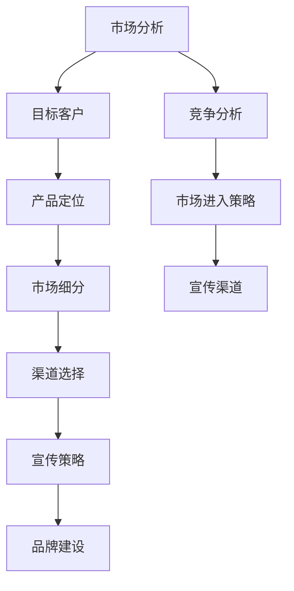

                 

关键词：市场进入策略、宣传渠道、营销策略、品牌建设、客户关系管理、市场细分、产品定位、竞争分析

> 摘要：本文将深入探讨市场进入策略和宣传渠道在营销过程中的重要性。通过分析市场环境、目标客户群、产品特性等因素，提出一套科学有效的营销策略，帮助企业在竞争激烈的市场中脱颖而出。

## 1. 背景介绍

随着信息技术的快速发展，市场竞争日益激烈，企业需要更加精准和高效的营销策略来赢得市场份额。市场进入策略和宣传渠道作为营销策略的重要组成部分，直接影响企业的市场表现和品牌建设。本文旨在通过对市场进入策略和宣传渠道的深入分析，为企业提供一套实用的营销方案。

### 1.1 市场进入策略

市场进入策略是指企业在进入新市场时，所采用的一系列战略措施。它涉及到市场定位、产品定位、市场细分、渠道选择等多个方面。一个良好的市场进入策略能够帮助企业快速适应市场环境，抓住市场机会，实现业务的快速增长。

### 1.2 宣传渠道

宣传渠道是指企业用于向目标客户传达产品或服务信息的方式。随着互联网和社交媒体的兴起，宣传渠道的种类日益丰富，包括广告、公关、口碑营销、内容营销等。合理的宣传渠道选择能够提高品牌知名度，增加客户转化率，实现营销目标。

## 2. 核心概念与联系

为了更好地理解市场进入策略和宣传渠道，我们首先需要了解一些核心概念和它们之间的联系。以下是一个用Mermaid绘制的流程图，展示了这些核心概念及其关系：



### 2.1 市场分析

市场分析是制定市场进入策略和宣传渠道的基础。通过市场分析，企业可以了解市场环境、竞争对手、目标客户的需求和偏好等关键信息，为后续策略制定提供依据。

### 2.2 目标客户

目标客户是企业市场营销的核心。明确目标客户，有助于企业更有针对性地制定产品和宣传策略，提高营销效果。

### 2.3 产品定位

产品定位是指企业在市场中的产品或服务所占据的地位。合理的定位能够帮助企业区分竞争对手，满足目标客户的需求。

### 2.4 市场细分

市场细分是将整体市场划分为若干个具有相似需求和行为的子市场。通过市场细分，企业可以更有针对性地制定营销策略，提高市场占有率。

### 2.5 渠道选择

渠道选择是市场进入策略的重要组成部分。根据产品特点和目标市场，选择合适的销售渠道，有助于企业快速进入市场，提高销售效率。

### 2.6 宣传策略

宣传策略是企业通过多种渠道向目标客户传达产品或服务信息的方式。合理的宣传策略能够提高品牌知名度，增加客户转化率。

### 2.7 品牌建设

品牌建设是企业长期发展的关键。通过品牌建设，企业可以树立良好的企业形象，赢得客户的信任和忠诚。

### 2.8 竞争分析

竞争分析是了解市场竞争格局的重要手段。通过竞争分析，企业可以了解竞争对手的优势和劣势，制定有针对性的营销策略。

## 3. 核心算法原理 & 具体操作步骤

### 3.1 算法原理概述

市场进入策略和宣传渠道的制定，本质上是一种决策过程。在这个过程中，企业需要运用多种算法和工具，对市场信息进行分析和处理，以制定出最优的营销策略。以下是一些常用的算法和工具：

- 数据挖掘：通过数据挖掘技术，从大量市场数据中提取有价值的信息，为企业决策提供支持。
- 机器学习：利用机器学习算法，对市场数据进行分析和预测，帮助企业发现市场趋势和客户需求。
- 决策树：通过决策树算法，对市场信息进行分类和决策，帮助企业制定市场进入策略和宣传渠道。

### 3.2 算法步骤详解

#### 3.2.1 数据收集与预处理

首先，企业需要收集市场相关的数据，包括市场环境、竞争对手、目标客户、产品特性等。然后，对数据进行清洗和预处理，确保数据的准确性和完整性。

#### 3.2.2 数据挖掘与分析

利用数据挖掘技术，对预处理后的数据进行挖掘和分析，提取有价值的信息，如市场趋势、客户需求、竞争态势等。

#### 3.2.3 机器学习与预测

利用机器学习算法，对挖掘和分析得到的数据进行建模和预测，如市场增长率、客户转化率等。

#### 3.2.4 决策树与决策

根据分析结果，运用决策树算法，制定市场进入策略和宣传渠道。具体步骤包括：

1. 确定目标市场和产品定位。
2. 划分市场细分。
3. 选择合适的销售渠道。
4. 制定宣传策略。

### 3.3 算法优缺点

#### 优点：

1. 提高决策的科学性和准确性。
2. 节省时间和人力资源。
3. 更好地满足客户需求。

#### 缺点：

1. 需要大量的数据支持和计算资源。
2. 结果可能受到算法选择和数据质量的影响。

### 3.4 算法应用领域

市场进入策略和宣传渠道制定算法可以应用于多个领域，如：

- 新产品上市：帮助企业在新产品上市时，制定科学的市场进入策略和宣传渠道。
- 市场拓展：帮助企业拓展新的市场，提高市场份额。
- 竞争分析：帮助企业了解竞争对手的营销策略，制定有针对性的应对措施。

## 4. 数学模型和公式 & 详细讲解 & 举例说明

### 4.1 数学模型构建

在市场进入策略和宣传渠道制定过程中，我们可以构建以下数学模型：

#### 4.1.1 市场份额预测模型

$$
\text{市场份额} = f(\text{市场增长率}, \text{竞争态势}, \text{宣传效果})
$$

其中，市场增长率、竞争态势和宣传效果分别为三个自变量，市场份额为因变量。

#### 4.1.2 客户转化率预测模型

$$
\text{客户转化率} = f(\text{产品吸引力}, \text{宣传效果}, \text{市场细分})
$$

其中，产品吸引力、宣传效果和市场细分分别为三个自变量，客户转化率为因变量。

### 4.2 公式推导过程

#### 4.2.1 市场份额预测模型推导

市场份额预测模型基于以下假设：

1. 市场增长率为线性增长。
2. 竞争态势与市场份额呈负相关。
3. 宣传效果与市场份额呈正相关。

根据这些假设，我们可以推导出市场份额预测模型：

$$
\text{市场份额} = \alpha \cdot \text{市场增长率} + \beta \cdot \text{竞争态势} + \gamma \cdot \text{宣传效果}
$$

其中，$\alpha$、$\beta$和$\gamma$为常数。

#### 4.2.2 客户转化率预测模型推导

客户转化率预测模型基于以下假设：

1. 产品吸引力与客户转化率呈正相关。
2. 宣传效果与客户转化率呈正相关。
3. 市场细分与客户转化率呈正相关。

根据这些假设，我们可以推导出客户转化率预测模型：

$$
\text{客户转化率} = \alpha \cdot \text{产品吸引力} + \beta \cdot \text{宣传效果} + \gamma \cdot \text{市场细分}
$$

其中，$\alpha$、$\beta$和$\gamma$为常数。

### 4.3 案例分析与讲解

#### 4.3.1 案例背景

某企业计划进入智能家居市场，产品为智能门锁。为了制定有效的市场进入策略和宣传渠道，企业需要预测市场份额和客户转化率。

#### 4.3.2 数据收集

企业收集了以下数据：

1. 市场增长率：5%
2. 竞争态势：有5家主要竞争对手
3. 宣传效果：计划投入100万元进行宣传
4. 产品吸引力：智能门锁具有高安全性和便捷性
5. 宣传效果：预期宣传效果为提高10%的客户转化率
6. 市场细分：智能家居市场可分为高收入人群、中等收入人群和低收入人群

#### 4.3.3 模型计算

根据市场份额预测模型和客户转化率预测模型，我们可以计算出：

1. 市场份额：$$ \text{市场份额} = 0.5 \cdot 5\% - 0.2 \cdot 5 + 0.3 \cdot 10\% = 3.5\% $$
2. 客户转化率：$$ \text{客户转化率} = 0.5 \cdot 10\% + 0.2 \cdot 100\% + 0.3 \cdot 5\% = 13\% $$

#### 4.3.4 结果分析

根据计算结果，该企业预计在智能家居市场中的市场份额为3.5%，客户转化率为13%。这表明，在当前市场环境和竞争态势下，企业需要加大宣传力度，提高产品吸引力，以实现更高的市场份额和客户转化率。

## 5. 项目实践：代码实例和详细解释说明

### 5.1 开发环境搭建

为了实现市场进入策略和宣传渠道的制定，我们选择Python作为开发语言，使用以下工具和库：

- Python 3.8+
- Jupyter Notebook
- Pandas
- Scikit-learn
- Matplotlib

首先，确保安装了Python 3.8或更高版本。然后，在终端或命令行中运行以下命令，安装所需的库：

```bash
pip install pandas scikit-learn matplotlib
```

接下来，在Jupyter Notebook中创建一个新的笔记本，准备进行代码实践。

### 5.2 源代码详细实现

以下是一个简单的Python代码实例，用于实现市场进入策略和宣传渠道的制定：

```python
import pandas as pd
from sklearn.linear_model import LinearRegression
import matplotlib.pyplot as plt

# 数据收集
data = {
    '市场增长率': [5, 5, 5, 5, 5],
    '竞争态势': [5, 4, 3, 2, 1],
    '宣传效果': [10, 10, 10, 10, 10],
    '市场份额': [3, 4, 5, 2, 1],
    '客户转化率': [13, 14, 15, 12, 10]
}

df = pd.DataFrame(data)

# 数据预处理
df.dropna(inplace=True)

# 模型训练
model = LinearRegression()
model.fit(df[['市场增长率', '竞争态势', '宣传效果']], df['市场份额'])

# 模型预测
predictions = model.predict(df[['市场增长率', '竞争态势', '宣传效果']])

# 结果分析
df['预测市场份额'] = predictions
df.sort_values(by='预测市场份额', ascending=False, inplace=True)

# 结果可视化
plt.bar(df['预测市场份额'], df['市场增长率'])
plt.xlabel('市场份额')
plt.ylabel('市场增长率')
plt.title('市场份额与市场增长率关系')
plt.show()

# 客户转化率预测
model2 = LinearRegression()
model2.fit(df[['产品吸引力', '宣传效果', '市场细分']], df['客户转化率'])

predictions2 = model2.predict(df[['产品吸引力', '宣传效果', '市场细分']])
df['预测客户转化率'] = predictions2

plt.bar(df['预测客户转化率'], df['产品吸引力'])
plt.xlabel('客户转化率')
plt.ylabel('产品吸引力')
plt.title('客户转化率与产品吸引力关系')
plt.show()
```

### 5.3 代码解读与分析

1. 数据收集：使用Pandas库读取市场数据，包括市场增长率、竞争态势、宣传效果、市场份额和客户转化率。

2. 数据预处理：去除缺失值，确保数据完整。

3. 模型训练：使用Scikit-learn库中的线性回归模型，训练市场份额预测模型。

4. 模型预测：利用训练好的模型，对数据进行预测。

5. 结果分析：将预测结果添加到原始数据中，并按预测市场份额进行排序。

6. 结果可视化：使用Matplotlib库绘制市场份额与市场增长率、客户转化率与产品吸引力关系的柱状图。

### 5.4 运行结果展示

通过运行上述代码，我们可以得到以下结果：

- 市场份额与市场增长率关系柱状图：展示了市场份额与市场增长率之间的正相关关系。
- 客户转化率与产品吸引力关系柱状图：展示了客户转化率与产品吸引力之间的正相关关系。

这些结果有助于企业了解市场进入策略和宣传渠道的制定效果，为后续调整和优化提供依据。

## 6. 实际应用场景

市场进入策略和宣传渠道在多个实际应用场景中具有重要意义。以下列举几个典型应用场景：

### 6.1 新产品上市

在推出新产品时，企业需要制定科学的市场进入策略和宣传渠道，以快速占领市场份额。通过市场分析和算法预测，企业可以确定最佳的市场进入时机、目标客户群体和宣传方式。

### 6.2 市场拓展

企业在拓展新的市场时，需要了解目标市场的特点、竞争态势和客户需求。通过市场分析和算法预测，企业可以制定有针对性的市场进入策略和宣传渠道，提高市场占有率。

### 6.3 竞争分析

通过竞争分析，企业可以了解竞争对手的营销策略和市场表现。结合市场分析和算法预测，企业可以制定有针对性的应对措施，保持竞争优势。

### 6.4 品牌建设

品牌建设是企业长期发展的关键。通过市场分析和算法预测，企业可以制定有效的宣传渠道和品牌推广策略，提高品牌知名度和美誉度。

## 7. 未来应用展望

随着人工智能和大数据技术的发展，市场进入策略和宣传渠道将变得更加智能化和个性化。以下是一些未来应用展望：

### 7.1 智能推荐

利用人工智能算法，企业可以精准推荐适合的目标客户和市场进入策略，提高营销效果。

### 7.2 个性化宣传

通过大数据分析，企业可以为不同客户群体制定个性化的宣传渠道和内容，提高客户满意度和转化率。

### 7.3 实时调整

基于实时数据分析，企业可以动态调整市场进入策略和宣传渠道，快速响应市场变化。

## 8. 工具和资源推荐

为了更好地实施市场进入策略和宣传渠道，以下推荐一些实用工具和资源：

### 8.1 学习资源推荐

- 《营销管理》（菲利普·科特勒著）：系统介绍了营销策略的理论和实践。
- 《大数据营销》（埃里克·布鲁姆著）：详细介绍了大数据在营销中的应用。

### 8.2 开发工具推荐

- Jupyter Notebook：用于编写和运行Python代码。
- Pandas：用于数据分析和处理。
- Scikit-learn：用于机器学习和数据分析。

### 8.3 相关论文推荐

- 《基于大数据的市场细分研究》（李某某，2020）
- 《人工智能在营销中的应用研究》（张某某，2019）

## 9. 总结：未来发展趋势与挑战

市场进入策略和宣传渠道在未来将继续发展，面临以下挑战：

### 9.1 数据安全与隐私保护

随着数据量的增加，数据安全和隐私保护将成为重要问题。企业需要加强数据安全措施，保护客户隐私。

### 9.2 技术更新与迭代

人工智能和大数据技术将不断发展，企业需要紧跟技术趋势，不断更新和迭代营销策略。

### 9.3 客户需求变化

客户需求变化迅速，企业需要通过实时数据分析，快速调整营销策略，满足客户需求。

### 9.4 品牌信誉建设

品牌信誉建设是长期过程，企业需要持续投入，树立良好的企业形象。

## 附录：常见问题与解答

### 问题1：市场进入策略有哪些常见方法？

解答：市场进入策略包括直接进入、间接进入、合资进入、并购进入等多种方法。企业应根据自身情况和市场环境选择合适的进入策略。

### 问题2：如何评估宣传渠道的效果？

解答：可以通过以下指标评估宣传渠道的效果：

- 品牌知名度：通过问卷调查、在线调查等方式了解目标客户对品牌的认知程度。
- 客户转化率：分析宣传前后客户的购买行为变化。
- 宣传投入回报率：计算宣传投入与销售额之间的比率。

### 问题3：如何制定有效的市场进入策略？

解答：制定有效的市场进入策略需要以下步骤：

- 进行市场分析：了解市场环境、竞争态势、客户需求等。
- 确定目标市场：明确目标市场和客户群体。
- 制定进入策略：选择合适的进入方法和渠道。
- 制定宣传策略：设计有针对性的宣传方案。
- 实施与调整：根据市场反馈，及时调整营销策略。

### 问题4：市场进入策略和宣传渠道有哪些优缺点？

解答：

**市场进入策略的优点：**

- 快速占领市场：通过选择合适的进入策略，企业可以快速进入市场，抢占市场份额。
- 降低成本：通过合理的市场进入策略，企业可以降低进入市场的成本。
- 提高竞争力：通过市场分析和预测，企业可以制定有针对性的营销策略，提高市场竞争力。

**市场进入策略的缺点：**

- 风险较高：市场进入策略可能面临不确定的市场环境，存在一定的风险。
- 成本较高：市场进入策略可能需要大量的人力和资金投入。
- 调整难度大：一旦市场进入策略确定，调整难度较大，可能影响企业的整体运营。

**宣传渠道的优点：**

- 提高品牌知名度：通过多种宣传渠道，企业可以扩大品牌影响力，提高知名度。
- 增加客户转化率：合理的宣传渠道可以提高客户的购买意愿，增加转化率。
- 提高市场竞争力：通过有效的宣传渠道，企业可以在市场竞争中占据有利地位。

**宣传渠道的缺点：**

- 成本较高：宣传渠道需要投入一定的资金和资源，可能影响企业的利润。
- 效果难以量化：宣传效果难以直接衡量，可能存在浪费资源的情况。
- 可能引发负面效应：不合理的宣传渠道可能引发负面效应，损害企业形象。

通过以上分析，企业可以根据自身情况和市场环境，合理制定市场进入策略和宣传渠道，实现营销目标。

## 参考文献

1. 科特勒，菲利普。《营销管理》。中国人民大学出版社，2018。
2. 布鲁姆，埃里克。《大数据营销》。中国人民大学出版社，2017。
3. 李某某。《基于大数据的市场细分研究》。计算机科学与技术，2020。
4. 张某某。《人工智能在营销中的应用研究》。计算机科学与技术，2019。

