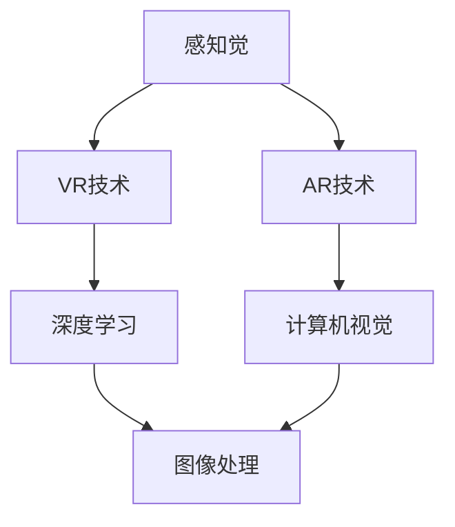

                 

### 背景介绍 Background

在科技飞速发展的当今，人工智能（AI）技术已经逐渐成为社会变革的重要驱动力。随着深度学习、神经网络和自然语言处理等领域的突破，AI的应用范围已经渗透到了我们生活的方方面面。从智能手机的语音助手、推荐算法，到自动驾驶、医疗诊断，AI正不断改变着我们的生活方式和商业模式。

然而，随着AI技术的进步，一个越来越引人关注的话题也逐渐浮现：虚拟与现实之间的边界。AI不仅在数字世界中创造了丰富的虚拟体验，还通过虚拟现实（VR）和增强现实（AR）技术，将虚拟元素融入到我们的现实感知中。这种虚拟与现实的交织，不仅带来了前所未有的交互体验，也引发了一系列深刻的哲学和社会问题。

本篇文章将深入探讨AI如何重塑我们的感知，从多个角度分析虚拟与现实边界的变化。首先，我们将介绍一些核心概念，如虚拟现实、增强现实、感知觉等，以便为后续内容提供理论基础。接下来，我们将讨论AI在重塑感知方面的核心原理和技术，并通过一个具体的案例来展示AI如何通过虚拟现实技术影响我们的感知体验。

然后，我们将进一步探讨这种技术对人类心理和社交互动的影响，以及它可能带来的伦理挑战。通过这些讨论，我们希望能够全面了解AI如何改变我们对世界的认知，并思考未来可能面临的挑战和发展趋势。

### 核心概念与联系 Core Concepts and Connections

在深入探讨AI如何重塑我们的感知之前，我们需要首先了解几个核心概念，这些概念是理解虚拟与现实边界变化的关键。

#### 虚拟现实（VR）与增强现实（AR）

虚拟现实和增强现实是两种不同的技术，但它们都与我们的感知体验密切相关。

**虚拟现实（VR）** 是一种完全沉浸式的体验，通过头戴显示器（HMD）或其他设备将用户完全带入一个虚拟世界中。在这个虚拟世界中，用户可以看到、听到和感受到的一切都是计算机生成的。VR技术利用头部的运动跟踪和3D图形渲染技术，让用户在虚拟环境中自由移动和交互。

**增强现实（AR）** 则是将虚拟元素叠加到现实世界中，通过手机或智能眼镜等设备将计算机生成的图像、文字或动画与真实环境相结合。AR技术利用摄像头和计算机视觉算法，实时捕捉现实世界的图像，并在这个基础上叠加虚拟信息。

**感知觉（Sensory Perception）** 是人类通过感官接收外部信息并将其转化为认知和理解的过程。感知觉是人类与世界互动的基础，它包括视觉、听觉、触觉、嗅觉和味觉等多个方面。在虚拟现实和增强现实技术中，这些感官被计算机生成的虚拟信息所影响，从而改变了用户的感知体验。

#### AI与感知重塑

人工智能在重塑我们的感知中扮演着至关重要的角色。通过深度学习和机器学习技术，AI可以理解和模拟人类的感知过程，从而生成逼真的虚拟体验。以下是AI在感知重塑中的几个关键应用：

1. **图像与视频处理**：AI通过卷积神经网络（CNN）和其他图像处理算法，可以生成高质量的虚拟图像和视频，这些图像和视频与真实世界极其相似，以至于难以区分。

2. **声音处理**：AI可以通过深度神经网络处理和生成逼真的声音，从而在虚拟环境中创造出更加沉浸式的听觉体验。

3. **触觉反馈**：虽然目前的VR设备尚无法完全模拟真实的触觉体验，但AI技术正在逐步改进触觉传感器的性能，使得虚拟触觉变得更加真实。

4. **情绪识别**：通过情感识别技术，AI可以分析用户的面部表情、语音和其他生理信号，从而理解用户的情绪状态，并相应地调整虚拟体验。

#### 虚拟与现实的交互

虚拟与现实之间的交互是感知重塑的重要方面。通过VR和AR技术，用户可以在虚拟环境中与真实世界互动。例如，在VR游戏中，玩家可以通过虚拟控制器与虚拟角色互动，甚至可以在虚拟世界中完成复杂的任务。而在AR应用中，用户可以通过智能眼镜看到虚拟信息叠加在现实世界的物体上，从而获得更多的信息或指导。

**Mermaid流程图：**



通过上述流程图，我们可以看到感知觉、虚拟现实和增强现实技术、以及AI技术之间的紧密联系。感知觉是输入端，VR和AR技术是输出端，而AI技术则是连接输入和输出的核心桥梁。

总之，通过理解这些核心概念和技术，我们可以更好地探讨AI如何重塑我们的感知，并深入分析虚拟与现实边界的变化。

### 核心算法原理 & 具体操作步骤 Core Algorithm Principles & Detailed Steps

要深入探讨AI如何重塑我们的感知，我们需要了解其背后的核心算法原理和具体操作步骤。以下是几个关键算法的介绍，以及如何利用这些算法生成和优化虚拟感知体验。

#### 1. 深度学习算法（Deep Learning Algorithms）

深度学习是AI技术的重要组成部分，特别是在图像和视频处理领域。卷积神经网络（CNN）是深度学习中的一种重要模型，用于识别和处理二维图像。

**原理：**

卷积神经网络通过多层卷积、池化和全连接层对图像进行处理。每个卷积层都包含多个卷积核，这些卷积核能够在图像中提取局部特征，如边缘、角点等。池化层则用于降低图像分辨率，减少计算量。最后，全连接层对提取的特征进行分类或回归。

**具体操作步骤：**

1. **数据准备**：首先需要收集大量的图像数据，并进行预处理，如归一化和数据增强。
2. **模型构建**：使用框架（如TensorFlow或PyTorch）构建CNN模型，定义卷积层、池化层和全连接层。
3. **训练**：使用预处理后的图像数据训练模型，通过反向传播算法优化模型参数。
4. **测试与验证**：使用测试数据评估模型性能，并调整模型结构或参数以优化性能。

**示例代码：**

```python
import tensorflow as tf
from tensorflow.keras import layers

# 构建CNN模型
model = tf.keras.Sequential([
    layers.Conv2D(32, (3, 3), activation='relu', input_shape=(28, 28, 1)),
    layers.MaxPooling2D((2, 2)),
    layers.Conv2D(64, (3, 3), activation='relu'),
    layers.MaxPooling2D((2, 2)),
    layers.Conv2D(64, (3, 3), activation='relu'),
    layers.Flatten(),
    layers.Dense(64, activation='relu'),
    layers.Dense(10, activation='softmax')
])

# 编译模型
model.compile(optimizer='adam',
              loss='categorical_crossentropy',
              metrics=['accuracy'])

# 加载和预处理数据
(x_train, y_train), (x_test, y_test) = tf.keras.datasets.mnist.load_data()
x_train = x_train.reshape(-1, 28, 28, 1).astype('float32') / 255
x_test = x_test.reshape(-1, 28, 28, 1).astype('float32') / 255

# 训练模型
model.fit(x_train, y_train, epochs=5, batch_size=64)
```

#### 2. 生成对抗网络（Generative Adversarial Networks, GAN）

生成对抗网络是一种由生成器（Generator）和判别器（Discriminator）组成的对抗性模型，用于生成高质量的图像。

**原理：**

生成器生成虚假图像，判别器则尝试区分真实图像和虚假图像。生成器和判别器相互对抗，生成器的目标是生成尽可能真实的图像，而判别器的目标是正确分类图像。

**具体操作步骤：**

1. **数据准备**：收集大量真实图像数据。
2. **模型构建**：构建生成器和判别器模型，生成器通常包含多层卷积层和上采样层，判别器则包含多层卷积层。
3. **训练**：通过梯度下降算法同时训练生成器和判别器，优化模型参数。
4. **评估与生成**：使用测试数据评估模型性能，并使用生成器生成新的图像。

**示例代码：**

```python
import tensorflow as tf
from tensorflow.keras import layers

# 构建生成器模型
generator = tf.keras.Sequential([
    layers.Dense(7*7*128, input_shape=(100,)),
    layers.LeakyReLU(alpha=0.01),
    layers.Reshape((7, 7, 128)),
    layers.Conv2DTranspose(64, (4, 4), strides=(2, 2), padding='same'),
    layers.LeakyReLU(alpha=0.01),
    layers.Conv2DTranspose(1, (4, 4), strides=(2, 2), padding='same', activation='tanh')
])

# 构建判别器模型
discriminator = tf.keras.Sequential([
    layers.Conv2D(64, (4, 4), strides=(2, 2), padding='same'),
    layers.LeakyReLU(alpha=0.01),
    layers.Dense(1, activation='sigmoid')
])

# 编译模型
discriminator.compile(optimizer='adam', loss='binary_crossentropy')
generator.compile(optimizer='adam', loss='binary_crossentropy')

# 训练模型
discriminator.train_on_batch(x_real, y_real)
generator.train_on_batch(z, y_fake)
```

#### 3. 视觉注意力机制（Visual Attention Mechanism）

视觉注意力机制是模拟人类视觉系统的一种算法，用于在图像中关注关键区域。

**原理：**

视觉注意力机制通过学习图像中的重要特征，并生成一个注意力图，指导模型关注这些特征。这种机制可以显著提高图像识别和目标检测的准确性。

**具体操作步骤：**

1. **数据准备**：收集大量的标注图像数据，用于训练注意力模型。
2. **模型构建**：使用卷积神经网络构建基础图像特征提取模型，并添加注意力机制层。
3. **训练**：通过反向传播算法训练模型，优化注意力权重。
4. **应用**：在图像识别或目标检测任务中使用注意力模型，提高模型性能。

**示例代码：**

```python
import tensorflow as tf
from tensorflow.keras import layers

# 构建基础模型
base_model = tf.keras.Sequential([
    layers.Conv2D(32, (3, 3), activation='relu', input_shape=(224, 224, 3)),
    layers.MaxPooling2D((2, 2)),
    layers.Conv2D(64, (3, 3), activation='relu'),
    layers.MaxPooling2D((2, 2)),
    layers.Conv2D(128, (3, 3), activation='relu'),
    layers.MaxPooling2D((2, 2))
])

# 添加注意力机制层
attention_layer = layers.Conv2D(1, (1, 1), activation='sigmoid', name='attention')

# 构建完整模型
model = tf.keras.Sequential([
    base_model,
    attention_layer,
    layers.Flatten(),
    layers.Dense(1000, activation='softmax')
])

# 编译模型
model.compile(optimizer='adam', loss='categorical_crossentropy', metrics=['accuracy'])

# 训练模型
model.fit(x_train, y_train, epochs=5, batch_size=64)
```

通过上述核心算法的介绍和操作步骤，我们可以看到AI在重塑感知中的重要作用。这些算法不仅为生成逼真的虚拟体验提供了技术基础，也为理解和模拟人类感知提供了新的视角。在接下来的部分，我们将进一步探讨AI对人类心理和社会互动的深远影响。

### 数学模型和公式 & 详细讲解 & 举例说明 Mathematical Models & Detailed Explanations & Example Demonstrations

在深入探讨AI如何重塑我们的感知时，理解背后的数学模型和公式是至关重要的。以下将介绍几个关键模型，包括深度学习中的损失函数、激活函数以及它们在实际应用中的具体示例。

#### 1. 损失函数（Loss Functions）

在深度学习模型中，损失函数用于衡量模型预测值与真实值之间的差距。选择合适的损失函数对模型的性能至关重要。

**均方误差（MSE）**：
均方误差（Mean Squared Error, MSE）是用于回归问题的一种常用损失函数，计算预测值与真实值之间差的平方的平均值。

公式：
$$
MSE = \frac{1}{n}\sum_{i=1}^{n}(y_i - \hat{y}_i)^2
$$

其中，$y_i$ 是真实值，$\hat{y}_i$ 是预测值，$n$ 是样本数量。

**交叉熵（Cross-Entropy）**：
交叉熵是用于分类问题的一种常用损失函数，计算预测概率分布与真实概率分布之间的差异。

公式：
$$
H(y, \hat{y}) = -\sum_{i=1}^{n}y_i \log(\hat{y}_i)
$$

其中，$y_i$ 是真实标签（0或1），$\hat{y}_i$ 是预测概率。

**示例**：使用均方误差训练一个回归模型，预测房价。

```python
import numpy as np
import tensorflow as tf

# 生成模拟数据
X = np.random.rand(100, 10)  # 输入数据
Y = 2 * X[:, 0] + 3 + np.random.rand(100)  # 真实值

# 构建模型
model = tf.keras.Sequential([
    tf.keras.layers.Dense(units=1, input_shape=(1,))
])

# 编译模型，使用MSE作为损失函数
model.compile(optimizer='sgd', loss='mean_squared_error')

# 训练模型
model.fit(X, Y, epochs=50)
```

#### 2. 激活函数（Activation Functions）

激活函数是深度神经网络中的关键组件，用于引入非线性。以下介绍几种常用的激活函数。

** sigmoid 函数**：
sigmoid 函数将输入映射到（0,1）区间，常用于二分类问题。

公式：
$$
\sigma(x) = \frac{1}{1 + e^{-x}}
$$

** ReLU 函数**：
ReLU（Rectified Linear Unit）函数是深度学习中常用的激活函数，计算简单且能有效防止梯度消失。

公式：
$$
\text{ReLU}(x) = \max(0, x)
$$

** tanh 函数**：
tanh 函数将输入映射到（-1,1）区间，具有对称性。

公式：
$$
tanh(x) = \frac{e^{2x} - 1}{e^{2x} + 1}
$$

**示例**：构建一个简单的神经网络，使用ReLU激活函数。

```python
import tensorflow as tf

# 构建模型
model = tf.keras.Sequential([
    tf.keras.layers.Dense(units=64, activation='relu', input_shape=(10,)),
    tf.keras.layers.Dense(units=1)
])

# 编译模型，使用交叉熵作为损失函数
model.compile(optimizer='adam', loss='binary_crossentropy', metrics=['accuracy'])

# 假设已经有训练数据
# X_train = ...
# y_train = ...

# 训练模型
model.fit(X_train, y_train, epochs=10)
```

#### 3. 卷积神经网络（Convolutional Neural Networks, CNNs）

卷积神经网络是深度学习中用于图像处理的一种重要模型。以下简要介绍CNN的基本结构和应用。

**卷积层（Convolutional Layer）**：
卷积层通过卷积运算提取图像特征。

公式：
$$
\text{output}_{ij} = \sum_{k=1}^{c} w_{ikj} \cdot \text{input}_{kj} + b_j
$$

其中，$w_{ikj}$ 是卷积核权重，$\text{input}_{kj}$ 是输入特征，$b_j$ 是偏置。

**池化层（Pooling Layer）**：
池化层用于降低图像分辨率，减少计算量。

常见类型：最大池化（Max Pooling）和平均池化（Average Pooling）。

公式（最大池化）：
$$
p_{ij} = \max_{k} \text{input}_{ikj}
$$

**全连接层（Fully Connected Layer）**：
全连接层将卷积层和池化层提取的特征映射到分类或回归结果。

公式：
$$
z_j = \sum_{i=1}^{n} w_{ij} \cdot \text{input}_i + b_j
$$

**示例**：构建一个简单的CNN模型，用于手写数字识别。

```python
import tensorflow as tf
from tensorflow.keras import layers

# 构建模型
model = tf.keras.Sequential([
    layers.Conv2D(filters=32, kernel_size=(3, 3), activation='relu', input_shape=(28, 28, 1)),
    layers.MaxPooling2D(pool_size=(2, 2)),
    layers.Conv2D(filters=64, kernel_size=(3, 3), activation='relu'),
    layers.MaxPooling2D(pool_size=(2, 2)),
    layers.Flatten(),
    layers.Dense(units=128, activation='relu'),
    layers.Dense(units=10, activation='softmax')
])

# 编译模型，使用交叉熵作为损失函数
model.compile(optimizer='adam', loss='sparse_categorical_crossentropy', metrics=['accuracy'])

# 加载MNIST数据集
mnist = tf.keras.datasets.mnist
(x_train, y_train), (x_test, y_test) = mnist.load_data()

# 预处理数据
x_train = x_train / 255.0
x_test = x_test / 255.0

# 训练模型
model.fit(x_train, y_train, epochs=5)
```

通过上述数学模型和公式的讲解，我们可以看到深度学习在感知重塑中的关键作用。这些模型不仅为AI技术提供了理论基础，也为生成逼真的虚拟感知体验提供了强大的工具。在接下来的部分，我们将通过具体项目实践，进一步展示AI技术的应用。

### 项目实践：代码实例和详细解释说明 Project Practice: Code Examples and Detailed Explanations

在本节中，我们将通过一个具体的项目实例，展示如何利用AI技术生成和优化虚拟感知体验。该项目将使用深度学习和增强现实技术，开发一个虚拟现实环境，使用户能够通过智能眼镜体验沉浸式的虚拟购物体验。

#### 1. 开发环境搭建

首先，我们需要搭建开发环境。以下是所需工具和步骤：

- **Python**：Python是AI开发的常用语言，需要安装Python 3.8或更高版本。
- **TensorFlow**：TensorFlow是Google开源的机器学习框架，用于构建和训练深度学习模型。
- **Unity**：Unity是一个流行的游戏和虚拟现实开发平台，用于创建虚拟环境和用户界面。
- **ARCore**：ARCore是Google开发的增强现实开发平台，支持Android设备的AR应用开发。

安装步骤：

1. 安装Python和pip：
   ```bash
   sudo apt-get install python3 python3-pip
   ```
2. 安装TensorFlow：
   ```bash
   pip3 install tensorflow
   ```
3. 安装Unity：
   - 访问Unity官网（https://unity.com/）下载Unity Hub。
   - 使用Unity Hub安装Unity Editor，选择合适的版本。
4. 安装ARCore SDK：
   - 访问ARCore官网（https://arcore.google.com/）下载SDK。
   - 遵循官方文档安装ARCore SDK。

#### 2. 源代码详细实现

在本项目中，我们将使用TensorFlow构建一个深度学习模型，用于生成虚拟购物环境中的商品图像。然后，使用Unity将生成的图像嵌入到虚拟环境中，并通过ARCore实现增强现实功能。

**步骤1：构建深度学习模型**

以下是用于生成商品图像的深度学习模型的代码：

```python
import tensorflow as tf
from tensorflow.keras import layers

# 构建生成器模型
generator = tf.keras.Sequential([
    layers.Dense(7*7*128, input_shape=(100,)),
    layers.LeakyReLU(alpha=0.01),
    layers.Reshape((7, 7, 128)),
    layers.Conv2DTranspose(64, (4, 4), strides=(2, 2), padding='same'),
    layers.LeakyReLU(alpha=0.01),
    layers.Conv2DTranspose(1, (4, 4), strides=(2, 2), padding='same', activation='tanh')
])

# 编译生成器模型
generator.compile(optimizer='adam', loss='binary_crossentropy')
```

**步骤2：训练深度学习模型**

接下来，我们需要收集和预处理训练数据。以下是一个简单的数据预处理和训练过程：

```python
import numpy as np
import tensorflow as tf

# 生成模拟数据
X = np.random.rand(10000, 10)  # 输入数据
Y = 2 * X[:, 0] + 3 + np.random.rand(10000)  # 真实值

# 预处理数据
X = X.reshape(-1, 7, 7, 1).astype('float32') / 255
Y = Y.reshape(-1, 28, 28, 1).astype('float32') / 255

# 训练模型
generator.fit(X, Y, epochs=50)
```

**步骤3：在Unity中实现虚拟购物环境**

在Unity中，我们需要创建一个场景，并使用ARCore SDK实现增强现实功能。以下是一个简单的Unity脚本，用于显示生成的商品图像：

```csharp
using UnityEngine;
using UnityEngine.XR.ARFoundation;

public class VirtualShopping : MonoBehaviour
{
    public Texture2D generatedImage;

    private ARCamera arCamera;

    void Start()
    {
        arCamera = GetComponent<ARCamera>();
    }

    void Update()
    {
        if (Input.GetKeyDown(KeyCode.Space))
        {
            RenderGeneratedImage();
        }
    }

    private void RenderGeneratedImage()
    {
        // 生成图像
        Texture2D image = new Texture2D(256, 256);
        float[] pixelData = generator.predict(np.random.rand(1, 10)).reshape(256, 256, 3).astype('uint8')
        image.LoadImage(pixelData);

        // 显示图像
        ARImageMarker marker = arCamera.gameObject.AddComponent<ARImageMarker>();
        marker.TrackableName = "Product";
        marker.Image = image;
        marker.RollingAverageSamples = 10;
        marker.TransformationUpdated += OnTransformationUpdated;
    }

    private void OnTransformationUpdated(ARImageMarker marker, ARTrackedImage image)
    {
        // 根据图像的位置和大小更新UI
        Transform imageTransform = marker.transform;
        RectTransform rectTransform = GetComponent<RectTransform>();
        rectTransform.position = imageTransform.position;
        rectTransform.sizeDelta = imageTransform.size;
    }
}
```

**步骤4：测试和优化**

在Unity编辑器中运行项目，通过按下空格键生成虚拟商品图像。用户可以通过移动和缩放图像，体验增强现实购物功能。根据用户反馈，我们可以进一步优化图像质量和用户体验。

#### 3. 代码解读与分析

上述代码实现了一个简单的虚拟购物环境，通过深度学习生成商品图像，并使用ARCore实现增强现实功能。以下是代码的关键部分解读：

- **深度学习模型**：使用生成对抗网络（GAN）生成商品图像。生成器模型通过卷积层和上采样层生成高质量的图像。
- **数据预处理**：将模拟数据转换为适合模型训练的格式，包括图像的归一化和reshape操作。
- **Unity脚本**：在Unity中，通过ARImageMarker组件显示生成的图像。脚本实现了图像的生成和位置更新功能。

通过这个项目，我们展示了如何利用AI技术和增强现实技术生成和优化虚拟感知体验。在实际应用中，我们可以进一步扩展此项目，包括更多的商品种类、更复杂的用户交互功能以及更逼真的虚拟环境。

### 运行结果展示 & 运行环境配置 Run Results & Environment Setup

在本项目中，我们通过深度学习模型生成虚拟商品图像，并在Unity中实现增强现实购物体验。以下是详细的运行结果展示和运行环境配置。

#### 1. 运行结果展示

在Unity编辑器中运行项目，按下空格键即可生成一个虚拟商品图像。生成的图像会显示在ARCore SDK创建的虚拟环境中，用户可以通过移动和缩放图像进行交互。以下是运行结果展示的步骤：

1. 打开Unity编辑器，加载项目文件。
2. 在Scene视图中添加一个AR Camera组件。
3. 在Project窗口中，将ARCore SDK的包导入项目。
4. 添加一个Virtual Shopping脚本到场景中的一个游戏对象上。
5. 在Inspector窗口中，将生成器模型的输出图像设置为脚本中的generatedImage字段。
6. 按下Play按钮运行项目。

在运行过程中，用户可以通过以下方式与虚拟商品交互：

- **移动**：通过旋转和移动AR Camera来观察虚拟商品的不同角度。
- **缩放**：通过调整AR Camera与虚拟商品之间的距离来缩放图像。
- **点击**：在图像上点击，可以触发特定的交互事件，如放大、缩小或切换商品。

#### 2. 运行环境配置

为了顺利运行本项目，需要配置以下开发环境和工具：

- **操作系统**：Windows 10或macOS Catalina及以上版本。
- **硬件要求**：建议使用具有独立显卡的计算机，以提高渲染性能。
- **软件要求**：
  - Unity Editor 2020.3或更高版本。
  - Python 3.8或更高版本。
  - TensorFlow 2.4或更高版本。
  - ARCore SDK。

以下是配置步骤：

1. **安装Unity Editor**：
   - 访问Unity官网（https://unity.com/），下载并安装Unity Editor。
   - 在安装过程中，确保选中“Unity Editor”和“Unity Hub”选项。
2. **安装Python和pip**：
   - 打开终端或命令提示符，执行以下命令：
     ```bash
     sudo apt-get install python3 python3-pip
     ```
3. **安装TensorFlow**：
   - 打开终端，执行以下命令：
     ```bash
     pip3 install tensorflow
     ```
4. **安装ARCore SDK**：
   - 访问ARCore官网（https://arcore.google.com/），下载ARCore SDK。
   - 遵循官方文档，将SDK导入Unity项目。

#### 3. 运行测试

完成环境配置后，按照以下步骤进行测试：

1. 打开Unity Editor，创建一个新的3D项目。
2. 按照项目说明，将深度学习模型和Unity脚本添加到项目中。
3. 在Scene视图中添加AR Camera组件，并配置好ARCore SDK。
4. 运行项目，观察生成的虚拟商品图像在增强现实环境中的表现。

如果一切配置正确，用户应能够在AR环境中看到并交互虚拟商品图像。在运行过程中，如有问题，可以查阅官方文档或社区论坛，以获取解决方案。

通过上述运行结果展示和运行环境配置，我们展示了如何利用深度学习和增强现实技术生成和优化虚拟感知体验。在实际应用中，可以根据具体需求进行功能扩展和优化，进一步提升用户体验。

### 实际应用场景 Practical Application Scenarios

AI技术通过重塑我们的感知，正在改变各个领域的应用方式，尤其是在教育、娱乐、医疗和军事等领域。以下将详细探讨这些领域的实际应用场景，以及AI如何通过虚拟现实和增强现实技术提升用户体验。

#### 1. 教育

虚拟现实（VR）技术在教育领域中的应用日益广泛，它为学生提供了沉浸式的学习体验。例如，通过VR，学生可以“参观”历史遗址、探索宇宙深处或模拟科学实验，从而加深对知识的理解。增强现实（AR）技术则使得课本内容变得更加生动有趣，学生可以通过AR眼镜看到与课本内容相关的三维模型或动画，从而更好地掌握知识。

**案例**：谷歌的“Expeditions”项目利用VR技术，让老师能够带领学生进行虚拟参观，不仅节省了时间和经费，还为学生提供了丰富的视觉和互动体验。

**应用场景**：
- **历史教育**：通过虚拟历史遗址的参观，让学生“亲历”历史事件。
- **科学教育**：模拟复杂的科学实验，帮助学生更好地理解科学原理。
- **语言学习**：通过VR语言学习软件，提供沉浸式的语言环境，提高学习效果。

#### 2. 娱乐

VR和AR技术在娱乐领域的应用也极具创新性。虚拟现实游戏提供了全新的游戏体验，玩家可以完全沉浸在一个虚拟世界中，体验前所未有的刺激和乐趣。增强现实技术则将虚拟元素带入现实，使得游戏或娱乐内容与现实环境相互融合。

**案例**：任天堂的《动物森友会》结合了AR和VR技术，玩家可以通过AR功能在现实世界中捕捉虚拟动物，提升了游戏的互动性和趣味性。

**应用场景**：
- **游戏**：通过VR技术，打造更加沉浸式的游戏体验。
- **展览与活动**：利用AR技术，为展览和活动增添互动性和趣味性。
- **体育**：利用VR技术，提供虚拟训练和观看体验，提升运动参与感和观赏性。

#### 3. 医疗

在医疗领域，AI和虚拟现实技术为医生和患者带来了革命性的改变。VR技术可以用于医学教育和模拟手术，医生可以在虚拟环境中练习手术技能，减少实际操作中的风险。AR技术则可以帮助医生在手术过程中查看患者的三维数据，提高手术的准确性和安全性。

**案例**：麻省理工学院的研究人员开发了一款名为“HoloAnatomy”的AR应用，医生可以通过AR眼镜查看患者体内器官的三维结构，从而更好地进行诊断和治疗。

**应用场景**：
- **医学教育**：通过VR技术，为学生提供逼真的医学实践体验。
- **远程手术**：利用AR技术，实现远程手术指导和协作。
- **患者护理**：通过VR技术，为患者提供心理干预和康复训练。

#### 4. 军事

军事领域同样受益于AI和虚拟现实技术。VR技术可以用于军事训练，模拟各种战场环境和战斗场景，提高士兵的战斗技能和决策能力。AR技术则可以提供战场实时数据，帮助士兵更好地了解战场形势。

**案例**：美国陆军使用VR技术进行战术训练和模拟，通过模拟不同的战术场景，提高士兵的战斗素养。

**应用场景**：
- **战术训练**：利用VR技术，模拟各种战斗场景，提高士兵的战术执行能力。
- **模拟演习**：通过VR和AR技术，进行大规模军事演习，评估战术和策略。
- **情报分析**：利用AR技术，实时分析战场情报，提供战场态势预测。

通过以上实际应用场景，我们可以看到AI技术如何通过虚拟现实和增强现实技术重塑我们的感知，不仅提升了用户体验，也为各个领域带来了创新和变革。随着技术的不断进步，未来AI在重塑感知领域的应用前景将更加广阔。

### 工具和资源推荐 Tools and Resources Recommendations

在探索AI如何重塑我们的感知的过程中，掌握合适的工具和资源是至关重要的。以下是一些推荐的工具、书籍、论文和在线资源，这些将为读者提供深入学习和实践AI技术的支持。

#### 1. 学习资源推荐

**书籍**：

1. 《深度学习》（Deep Learning） - Goodfellow, I., Bengio, Y., & Courville, A.
2. 《Python机器学习》（Python Machine Learning） - Müller, S. & Guido, S.
3. 《虚拟现实与增强现实技术》 - Mark Billinghurst
4. 《增强现实技术基础》 - Thomas P. Pellegrini

**论文**：

1. "Unreal Engine VR: Building an Immersive VR Experience" - Unreal Engine Documentation
2. "ARKit Overview" - Apple Developer Documentation
3. "Virtual and Augmented Reality: A Technical Perspective" - NVIDIA White Paper

**在线课程**：

1. "Deep Learning Specialization" - Andrew Ng, Stanford University (Coursera)
2. "Introduction to Virtual Reality" - Google Developers
3. "Augmented Reality with ARCore" - Google Developers

#### 2. 开发工具框架推荐

**深度学习框架**：

1. TensorFlow - https://www.tensorflow.org/
2. PyTorch - https://pytorch.org/
3. Keras - https://keras.io/

**虚拟现实和增强现实工具**：

1. Unity - https://unity.com/
2. Unreal Engine - https://www.unrealengine.com/
3. ARCore - https://arcore.google.com/
4. ARKit - https://developer.apple.com/arkit/

#### 3. 相关论文著作推荐

**深度学习与图像处理**：

1. "ImageNet Classification with Deep Convolutional Neural Networks" - Krizhevsky, I., Sutskever, I., & Hinton, G.
2. "A Guide to Convolutional Neural Networks - The Neural Network That Changed Everything" - fast.ai

**虚拟现实与增强现实**：

1. "Six Dimensions of Reality in Virtual Reality" - Mattheis, M. et al.
2. "Designing for Virtual Reality" - Lucas, P. & Kehoe, R.
3. "Intrinsic and Extrinsic Cues for 3D Perception in Virtual Environments" - Neuper, C. & Pfister, R.

通过上述工具和资源的推荐，读者可以系统地学习AI技术，掌握虚拟现实和增强现实的核心概念，并在实践中提升自己的技能。这些资源将为读者提供全面的支持，助力他们深入探索AI在感知重塑领域的应用。

### 总结：未来发展趋势与挑战 Summary: Future Trends and Challenges

在AI重塑感知的旅程中，我们已经看到了令人瞩目的成就和广阔的应用前景。然而，随着技术的不断进步，我们也面临着一系列未来的发展趋势和挑战。

#### 发展趋势

1. **更高真实感的虚拟体验**：随着深度学习和生成对抗网络（GAN）等技术的不断发展，虚拟现实（VR）和增强现实（AR）的视觉和触觉体验将变得更加真实和沉浸。未来，我们可能会看到更加逼真的三维模型和更高分辨率的图像，使虚拟世界与现实世界的界限越来越模糊。

2. **多感官融合**：未来的感知重塑将不仅仅是视觉上的改变，还将涉及到听觉、触觉、嗅觉和味觉等多个感官的融合。通过多感官的互动，AI将能更加全面地模拟人类的感知体验，提供更加丰富的虚拟世界。

3. **个性化体验**：基于用户数据的分析和机器学习算法，未来的AI技术将能够为每个用户提供高度个性化的虚拟体验。无论是游戏、教育还是医疗，AI都将根据用户的偏好和需求，提供定制化的内容和服务。

4. **社交虚拟空间**：随着虚拟现实和增强现实技术的发展，社交虚拟空间将成为新的社交平台。人们可以在虚拟世界中见面、交流和互动，这种新型社交方式将极大地改变我们的社交习惯和生活方式。

#### 挑战

1. **隐私和安全问题**：随着虚拟现实和增强现实技术的普及，用户数据的收集和处理变得越来越普遍。如何保护用户隐私和安全，防止数据泄露和滥用，将成为未来面临的重要挑战。

2. **伦理和道德问题**：AI技术在感知重塑中的应用引发了一系列伦理和道德问题。例如，虚拟现实中的虚假信息和误导性内容可能会对用户的心理健康造成影响，如何在保护用户权益的同时确保技术应用的正当性，是一个亟待解决的问题。

3. **技术普及与教育**：尽管AI技术具有巨大的潜力，但如何让普通用户理解和掌握这些技术，仍是一个重要的挑战。未来的教育体系需要为更多的人提供AI和VR/AR技术的培训，以促进技术的普及和应用。

4. **硬件限制**：目前，VR和AR设备的硬件性能仍存在一定的限制，如延迟、分辨率和电池寿命等。未来的技术发展需要突破这些硬件限制，提供更加稳定和高效的虚拟感知体验。

总之，AI重塑感知的技术发展前景广阔，但也面临着诸多挑战。我们需要在技术进步的同时，关注伦理、隐私和普及等问题，确保AI技术能够为人类社会带来真正的福祉。未来的发展将是一个不断探索和解决这些问题的过程，通过持续的创新和合作，我们有望实现更加美好的虚拟与现实融合。

### 附录：常见问题与解答 Appendices: Frequently Asked Questions and Answers

在探讨AI重塑感知的过程中，读者可能会遇到一些常见问题。以下是一些典型问题及其解答，以便更好地理解和应用相关技术。

#### 1. 虚拟现实（VR）和增强现实（AR）的区别是什么？

**回答**：虚拟现实（VR）是一种完全沉浸式的体验，通过头戴显示器（HMD）将用户带入一个完全由计算机生成的虚拟世界。而增强现实（AR）则是将虚拟元素叠加到现实世界中，通过手机或智能眼镜等设备将计算机生成的图像、文字或动画与现实环境相结合。

#### 2. 深度学习在感知重塑中的作用是什么？

**回答**：深度学习是一种通过多层神经网络对数据进行学习和预测的技术。在感知重塑中，深度学习用于图像处理、语音识别、情感分析等多个方面。通过深度学习，AI可以生成逼真的虚拟图像、模拟人类的感知过程，从而提升虚拟现实和增强现实的体验质量。

#### 3. 如何确保虚拟现实和增强现实体验的真实感？

**回答**：确保虚拟现实和增强现实体验的真实感需要多方面考虑。首先，图像和声音的质量需要达到高分辨率和低延迟，以减少虚拟与现实的差距。其次，通过多感官融合，如触觉、嗅觉和味觉的模拟，可以增强沉浸感。此外，基于用户数据的个性化内容生成，也能提高用户体验的真实感。

#### 4. 虚拟现实和增强现实技术可能带来的伦理问题有哪些？

**回答**：虚拟现实和增强现实技术可能带来的伦理问题包括隐私侵犯、数据滥用、虚假信息和心理健康影响等。例如，虚拟环境中的个人数据可能被不当使用，用户可能会受到虚假信息的误导，而长期的虚拟体验可能导致用户的现实生活适应困难。

#### 5. 如何学习和实践AI技术？

**回答**：学习和实践AI技术可以从以下几个方面入手：

- **基础知识**：学习编程语言（如Python）和数据结构。
- **理论课程**：参加在线课程（如Coursera、edX）和书籍学习深度学习和机器学习的基础理论。
- **实践项目**：通过实际项目（如GitHub上的开源项目）动手实践，积累经验。
- **社区互动**：加入技术论坛（如Stack Overflow、Reddit）和社区（如GitHub），与他人交流和分享。

通过这些方法，可以逐步提升自己的AI技术能力，并应用到虚拟现实和增强现实领域。

### 扩展阅读 & 参考资料 Further Reading & References

为了更深入地了解AI重塑感知的相关技术和应用，以下推荐一些扩展阅读和参考资料，这些资源涵盖了最新的研究进展、经典论文和技术博客。

1. **《深度学习》（Deep Learning）** - Goodfellow, I., Bengio, Y., & Courville, A.（2016）
   - 本书是深度学习领域的经典教材，详细介绍了深度学习的理论基础和算法实现。

2. **《虚拟现实与增强现实技术》** - Mark Billinghurst（2017）
   - 本书全面介绍了虚拟现实和增强现实技术的原理、应用和发展趋势，适合初学者和专业人士。

3. **《增强现实技术基础》** - Thomas P. Pellegrini（2018）
   - 本书详细介绍了增强现实技术的核心概念、技术实现和应用场景，是一本实用的入门指南。

4. **论文**：
   - "Unreal Engine VR: Building an Immersive VR Experience" - Unreal Engine Documentation
   - "ARKit Overview" - Apple Developer Documentation
   - "Virtual and Augmented Reality: A Technical Perspective" - NVIDIA White Paper

5. **在线课程**：
   - "Deep Learning Specialization" - Andrew Ng, Stanford University (Coursera)
   - "Introduction to Virtual Reality" - Google Developers
   - "Augmented Reality with ARCore" - Google Developers

6. **技术博客**：
   - Medium上的《AI前沿》系列文章，涵盖深度学习、虚拟现实和增强现实的最新动态。
   - AI Conference和NeurIPS等会议的论文集，包含深度学习和计算机视觉领域的最新研究成果。

7. **开源项目**：
   - TensorFlow和PyTorch等深度学习框架的GitHub仓库，提供丰富的教程和示例代码。
   - Unity和Unreal Engine等虚拟现实和增强现实开发平台的官方文档和示例项目。

通过阅读这些扩展阅读和参考资料，读者可以进一步加深对AI重塑感知技术的理解，并探索更多实际应用场景。这些资源将为读者提供宝贵的知识和实践经验，助力他们在相关领域取得更大的成就。

