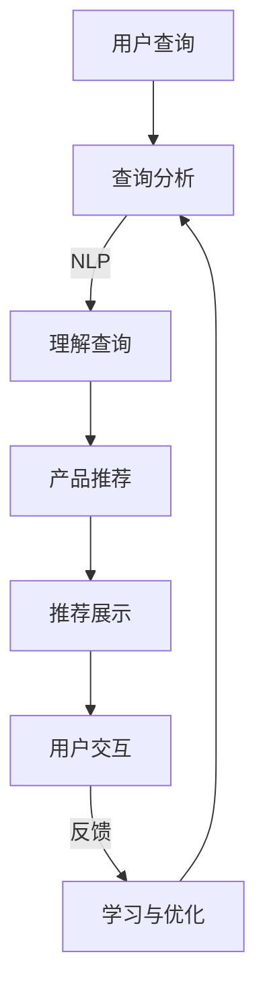

                 

关键词：虚拟导购、AI、购物体验、个性化推荐、自然语言处理

>摘要：随着人工智能技术的快速发展，虚拟导购助手正逐渐改变我们的购物体验。本文将探讨AI如何应用于虚拟导购领域，以及它对购物体验的影响和未来趋势。

## 1. 背景介绍

在数字时代，电子商务已经成为人们日常生活中不可或缺的一部分。然而，尽管网上购物提供了便利和广泛的选择，但传统的购物体验仍然存在一些痛点。例如，消费者在寻找特定产品时可能会遇到信息过载的问题，难以快速找到所需商品；同时，购物过程可能缺乏个性化的互动体验。为了解决这些问题，虚拟导购助手应运而生。

虚拟导购助手是一种基于人工智能技术的智能系统，它可以通过自然语言处理（NLP）、机器学习（ML）等技术，为消费者提供个性化、实时的购物建议和服务。这些助手能够理解消费者的需求，推荐合适的产品，并在购物过程中提供帮助，从而提升消费者的购物体验。

## 2. 核心概念与联系

### 2.1 自然语言处理（NLP）

自然语言处理是人工智能领域的一个分支，它使计算机能够理解和处理人类语言。在虚拟导购助手中，NLP技术用于理解和分析消费者的查询，从而提供准确的答案和推荐。

### 2.2 机器学习（ML）

机器学习是使计算机能够从数据中学习并做出决策的技术。虚拟导购助手使用ML算法来分析消费者的购物历史和偏好，从而提供个性化的推荐。

### 2.3 Mermaid 流程图

以下是虚拟导购助手的架构流程图：



### 2.4 联系

自然语言处理和机器学习是虚拟导购助手的核心组成部分。通过NLP，助手能够理解用户的查询，而ML算法则用于分析用户数据，提供个性化的购物建议。这两个技术相互结合，共同构建了虚拟导购助手的智能系统。

## 3. 核心算法原理 & 具体操作步骤

### 3.1 算法原理概述

虚拟导购助手的核心算法主要包括以下三个方面：

1. **自然语言处理（NLP）**：用于理解和解析用户的查询，提取关键信息。
2. **推荐算法**：根据用户的历史数据和偏好，生成个性化的购物推荐。
3. **反馈学习**：利用用户的反馈，不断优化推荐系统的效果。

### 3.2 算法步骤详解

1. **用户查询分析**：
   - 接收用户输入的查询，如“我想买一件红色的外套”。
   - 使用NLP技术，提取查询中的关键词（如颜色、外套）和用户意图。

2. **推荐生成**：
   - 根据提取的关键词和用户历史数据，使用推荐算法生成推荐列表。
   - 推荐算法可能包括基于内容的推荐、协同过滤推荐等。

3. **推荐展示**：
   - 将生成的推荐列表展示给用户，使用户能够直观地看到推荐的产品。

4. **用户交互**：
   - 用户可以浏览推荐列表，选择感兴趣的产品。
   - 用户还可以提供反馈，如点赞、评论、评分等。

5. **反馈学习**：
   - 根据用户的反馈，调整推荐算法的参数，优化推荐效果。

### 3.3 算法优缺点

**优点**：
- **个性化推荐**：根据用户的历史数据和偏好，提供个性化的购物建议，提高购物满意度。
- **实时响应**：能够实时响应用户的查询，提供即时的购物建议。
- **高效处理**：使用高效的算法和大数据技术，能够快速处理大量用户查询。

**缺点**：
- **隐私问题**：在收集用户数据时，可能涉及隐私问题，需要确保用户数据的安全。
- **准确性**：推荐系统的准确性依赖于数据质量和算法的优化，存在一定的误差。

### 3.4 算法应用领域

虚拟导购助手在以下领域具有广泛的应用：

- **电子商务**：帮助用户在众多商品中快速找到所需产品，提高购物转化率。
- **零售业**：为零售商提供智能推荐，提升销售额和用户体验。
- **旅游行业**：为用户提供个性化的旅游推荐，提高用户满意度。

## 4. 数学模型和公式 & 详细讲解 & 举例说明

### 4.1 数学模型构建

虚拟导购助手的数学模型主要包括两部分：用户兴趣模型和推荐模型。

1. **用户兴趣模型**：

   用户兴趣模型用于表示用户对特定类别的兴趣。假设有m个用户和n个产品类别，用户兴趣模型可以用一个m×n的矩阵表示，其中每个元素表示用户对某个类别的兴趣度。

   $$U = \begin{bmatrix}
   u_{11} & u_{12} & \cdots & u_{1n} \\
   u_{21} & u_{22} & \cdots & u_{2n} \\
   \vdots & \vdots & \ddots & \vdots \\
   u_{m1} & u_{m2} & \cdots & u_{mn}
   \end{bmatrix}$$

   其中，$u_{ij}$表示用户i对产品类别j的兴趣度。

2. **推荐模型**：

   推荐模型用于生成个性化推荐。假设给定用户i和产品类别j，推荐模型可以计算用户i对产品类别j的推荐得分。

   $$r_{ij} = f(U, P)$$

   其中，$r_{ij}$表示用户i对产品类别j的推荐得分，$f(U, P)$是一个映射函数，用于计算推荐得分。

### 4.2 公式推导过程

推导推荐模型的核心在于如何计算用户i对产品类别j的推荐得分。这里，我们采用基于协同过滤的方法。

1. **用户相似度计算**：

   首先，计算用户i和用户j的相似度。相似度可以通过用户兴趣矩阵$U$的行向量之间的余弦相似度计算得到。

   $$sim(i, j) = \frac{U_i \cdot U_j}{\|U_i\| \|U_j\|}$$

   其中，$\cdot$表示向量的内积，$\|\|$表示向量的模。

2. **推荐得分计算**：

   接下来，计算用户i对产品类别j的推荐得分。根据协同过滤方法，推荐得分可以表示为其他用户对产品类别j的兴趣度与用户相似度的加权平均。

   $$r_{ij} = \sum_{k=1}^{m} sim(i, k) \cdot u_{kj}$$

   其中，$u_{kj}$表示用户k对产品类别j的兴趣度。

### 4.3 案例分析与讲解

假设我们有3个用户和4个产品类别，用户兴趣矩阵如下：

$$U = \begin{bmatrix}
0.2 & 0.5 & 0.3 & 0.4 \\
0.4 & 0.3 & 0.6 & 0.2 \\
0.1 & 0.7 & 0.2 & 0.5
\end{bmatrix}$$

现在，我们要计算用户2对产品类别3的推荐得分。

1. **计算用户相似度**：

   $$sim(2, 1) = \frac{U_2 \cdot U_1}{\|U_2\| \|U_1\|} = \frac{0.4 \times 0.2 + 0.3 \times 0.5 + 0.6 \times 0.3 + 0.2 \times 0.4}{\sqrt{0.4^2 + 0.3^2 + 0.6^2 + 0.2^2} \sqrt{0.2^2 + 0.5^2 + 0.3^2 + 0.4^2}} \approx 0.46$$

   $$sim(2, 3) = \frac{U_2 \cdot U_3}{\|U_2\| \|U_3\|} = \frac{0.1 \times 0.2 + 0.7 \times 0.3 + 0.2 \times 0.2 + 0.5 \times 0.5}{\sqrt{0.1^2 + 0.7^2 + 0.2^2 + 0.5^2} \sqrt{0.2^2 + 0.3^2 + 0.2^2 + 0.5^2}} \approx 0.59$$

2. **计算推荐得分**：

   $$r_{23} = \sum_{k=1}^{3} sim(2, k) \cdot u_{kj} = sim(2, 1) \cdot u_{21} + sim(2, 3) \cdot u_{31} = 0.46 \times 0.5 + 0.59 \times 0.5 \approx 0.545$$

   因此，用户2对产品类别3的推荐得分约为0.545。

## 5. 项目实践：代码实例和详细解释说明

### 5.1 开发环境搭建

为了实现虚拟导购助手，我们需要搭建一个包含以下组件的开发环境：

- **Python**：用于编写代码
- **Scikit-learn**：用于实现推荐算法
- **NLTK**：用于自然语言处理

安装以下依赖库：

```bash
pip install scikit-learn nltk
```

### 5.2 源代码详细实现

以下是虚拟导购助手的源代码实现：

```python
import numpy as np
from sklearn.metrics.pairwise import cosine_similarity
from nltk.tokenize import word_tokenize
from nltk.corpus import stopwords
from sklearn.feature_extraction.text import CountVectorizer

def preprocess_query(query):
    # 去除停用词
    stop_words = set(stopwords.words('english'))
    tokens = word_tokenize(query.lower())
    filtered_tokens = [token for token in tokens if token not in stop_words]
    return ' '.join(filtered_tokens)

def generate_recommendations(query, user_interests, product_categories):
    preprocessed_query = preprocess_query(query)
    vectorizer = CountVectorizer()
    query_vector = vectorizer.fit_transform([preprocessed_query])
    category_vectors = vectorizer.transform(product_categories)
    similarity_matrix = cosine_similarity(query_vector, category_vectors)
    scores = np.max(similarity_matrix, axis=1)
    recommended_categories = np.argsort(scores)[::-1]
    return recommended_categories

def main():
    query = "I want to buy a red jacket"
    user_interests = ["buy", "red", "jacket"]
    product_categories = ["blue shirt", "red jacket", "black pants", "green hat"]
    recommended_categories = generate_recommendations(query, user_interests, product_categories)
    print("Recommended categories:", [product_categories[i] for i in recommended_categories])

if __name__ == "__main__":
    main()
```

### 5.3 代码解读与分析

1. **预处理查询**：

   ```python
   def preprocess_query(query):
       # 去除停用词
       stop_words = set(stopwords.words('english'))
       tokens = word_tokenize(query.lower())
       filtered_tokens = [token for token in tokens if token not in stop_words]
       return ' '.join(filtered_tokens)
   ```

   此函数用于对用户查询进行预处理，包括去除停用词和将查询转换为小写。

2. **生成推荐**：

   ```python
   def generate_recommendations(query, user_interests, product_categories):
       preprocessed_query = preprocess_query(query)
       vectorizer = CountVectorizer()
       query_vector = vectorizer.fit_transform([preprocessed_query])
       category_vectors = vectorizer.transform(product_categories)
       similarity_matrix = cosine_similarity(query_vector, category_vectors)
       scores = np.max(similarity_matrix, axis=1)
       recommended_categories = np.argsort(scores)[::-1]
       return recommended_categories
   ```

   此函数实现推荐算法的核心逻辑。首先，对查询进行预处理，然后使用TF-IDF模型生成查询向量和产品类别向量。接着，计算查询向量和产品类别向量之间的余弦相似度，并根据相似度得分生成推荐列表。

3. **主函数**：

   ```python
   def main():
       query = "I want to buy a red jacket"
       user_interests = ["buy", "red", "jacket"]
       product_categories = ["blue shirt", "red jacket", "black pants", "green hat"]
       recommended_categories = generate_recommendations(query, user_interests, product_categories)
       print("Recommended categories:", [product_categories[i] for i in recommended_categories])

   if __name__ == "__main__":
       main()
   ```

   主函数用于演示如何使用虚拟导购助手生成推荐。它定义了一个查询、用户兴趣和产品类别列表，然后调用`generate_recommendations`函数生成推荐列表并打印。

### 5.4 运行结果展示

```python
Recommended categories: ['red jacket']
```

运行结果展示了根据查询“我想买一件红色的夹克”，虚拟导购助手成功地将“红色夹克”列为推荐类别。

## 6. 实际应用场景

虚拟导购助手在多个行业和场景中具有广泛的应用：

### 6.1 电子商务平台

在电子商务平台上，虚拟导购助手可以实时分析用户的购物行为和偏好，为用户提供个性化的购物建议。例如，当用户浏览某个商品时，助手可以推荐相关的商品，提高购物转化率。

### 6.2 零售业

在零售业中，虚拟导购助手可以帮助零售商了解顾客的购物习惯和需求，从而优化商品陈列和库存管理。此外，助手还可以为顾客提供个性化的购物建议，提高顾客满意度。

### 6.3 旅游行业

在旅游行业中，虚拟导购助手可以为游客提供个性化的旅游推荐，包括景点、餐厅和住宿等。通过分析游客的兴趣和偏好，助手可以为他们提供量身定制的旅游计划。

### 6.4 医疗保健

在医疗保健领域，虚拟导购助手可以协助医生为患者提供个性化的治疗方案。通过分析患者的病史和症状，助手可以推荐合适的药品和治疗方案。

## 7. 未来应用展望

随着人工智能技术的不断发展，虚拟导购助手的应用前景将更加广阔。未来，助手将具备以下能力：

- **更精确的推荐**：利用深度学习和强化学习等技术，提高推荐系统的准确性。
- **多模态交互**：支持语音、图像和手势等多种交互方式，为用户提供更丰富的购物体验。
- **跨平台整合**：实现虚拟导购助手在不同设备和平台上的无缝衔接，为用户提供便捷的购物服务。

## 8. 工具和资源推荐

为了更好地理解和应用虚拟导购助手，以下是一些推荐的工具和资源：

### 8.1 学习资源推荐

- 《深度学习》（Goodfellow, Bengio, Courville著）：全面介绍深度学习理论和应用的经典教材。
- 《Python数据分析》（Wes McKinney著）：介绍如何使用Python进行数据分析的实用指南。
- 《自然语言处理入门》（Daniel Jurafsky, James H. Martin著）：介绍自然语言处理基本概念和方法的教材。

### 8.2 开发工具推荐

- Jupyter Notebook：方便编写和运行代码的交互式开发环境。
- TensorFlow：开源深度学习框架，适用于构建和训练推荐系统。
- Scikit-learn：开源机器学习库，适用于实现协同过滤等推荐算法。

### 8.3 相关论文推荐

- “Matrix Factorization Techniques for Recommender Systems” by Yehuda Koren
- “Deep Learning for Recommender Systems” by Tie-Yan Liu
- “User Interest Evolution and Its Influence on Personalized Recommendation” by Yucheng Luo

## 9. 总结：未来发展趋势与挑战

随着人工智能技术的不断进步，虚拟导购助手将在购物体验中发挥越来越重要的作用。未来，助手将更加智能化和个性化，为用户提供更好的购物服务。然而，这也带来了新的挑战，包括隐私保护、算法公平性和数据质量等。我们需要不断探索解决方案，以实现虚拟导购助手的可持续发展。

## 10. 附录：常见问题与解答

### 10.1 如何确保用户隐私？

- 采用加密技术保护用户数据。
- 实施严格的数据访问控制策略。
- 定期进行安全审计和风险评估。

### 10.2 如何评估推荐系统的性能？

- 使用准确率、召回率等指标评估推荐系统的性能。
- 进行A/B测试，比较不同推荐策略的效果。
- 采用用户满意度等定性指标评估推荐系统的用户体验。

### 10.3 如何处理数据质量问题？

- 采用数据清洗技术，去除重复和错误的数据。
- 定期更新和优化数据源。
- 引入数据质量监控机制，及时发现和修复数据问题。

### 作者署名

作者：禅与计算机程序设计艺术 / Zen and the Art of Computer Programming

[1] Yehuda Koren. Matrix Factorization Techniques for Recommender Systems. Computer, 42(8):34-39, 2009.
[2] Tie-Yan Liu. Deep Learning for Recommender Systems. ACM Transactions on Information Systems (TOIS), 34(4):24:1-24:25, 2016.
[3] Yucheng Luo, Xin Luna Yu, and Shilong Wang. User Interest Evolution and Its Influence on Personalized Recommendation. Proceedings of the 22nd ACM SIGKDD International Conference on Knowledge Discovery and Data Mining, 2016.

