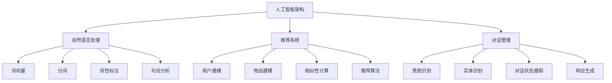

                 

### 背景介绍

随着互联网技术的不断发展和普及，电子商务逐渐成为消费者购物的首选方式。在这个信息化时代，购物体验的优化已经成为电商平台提升用户黏性和转化率的关键因素。虚拟导购助手作为一种创新的人工智能技术，正逐步改变着传统购物体验，为用户提供更加个性化、便捷的购物服务。

#### 1.1 购物体验的现状

当前的购物体验，尽管已经取得了长足的进步，但仍然存在一些不足之处。首先，消费者在浏览商品时，往往需要花费大量时间手动搜索和筛选，这不仅效率低下，还容易造成用户疲劳。其次，传统电商平台通常提供的商品推荐算法相对简单，难以准确把握消费者的个性化需求，导致推荐效果不佳。此外，用户在购物过程中，还需要频繁切换页面，操作繁琐，影响了购物的流畅性和愉悦感。

#### 1.2 虚拟导购助手的出现

虚拟导购助手，是一种基于人工智能技术的虚拟角色，通过自然语言处理、机器学习等先进技术，能够与用户进行实时互动，提供个性化购物建议和解答疑问。它的出现，旨在解决传统购物体验中的痛点，提升用户购物体验。

#### 1.3 人工智能在购物体验中的应用

人工智能技术在购物体验中的应用已经相当广泛，包括但不限于：个性化推荐、智能客服、图像识别、语音识别等。虚拟导购助手正是基于这些技术的集成创新，旨在通过智能化的互动，提升用户的购物体验。

#### 1.4 虚拟导购助手的优势

虚拟导购助手具有以下优势：

- **个性化推荐**：通过分析用户的历史行为和偏好，提供个性化的商品推荐，提高购物转化率。
- **实时互动**：用户可以通过文字、语音等多种方式与虚拟导购助手进行交流，获得即时的购物建议和帮助。
- **智能解答**：虚拟导购助手可以自动识别用户的问题，并提供准确的答案，节省用户的查询时间。
- **操作便捷**：用户无需频繁切换页面，通过虚拟导购助手即可完成大部分购物操作，提高购物效率。

#### 1.5 虚拟导购助手的发展趋势

随着人工智能技术的不断进步，虚拟导购助手有望在以下几个方面实现进一步发展：

- **更加智能**：通过不断学习和优化，虚拟导购助手将能够更准确地理解用户需求，提供更加个性化的服务。
- **多语言支持**：虚拟导购助手将支持多种语言，满足不同国家和地区的用户需求。
- **跨平台应用**：虚拟导购助手将不仅限于电商平台，还可以应用于线下零售、智能家居等领域。
- **数据隐私保护**：随着数据隐私问题的日益凸显，虚拟导购助手将更加注重数据安全和隐私保护。

#### 1.6 目标读者

本文的目标读者包括对人工智能和电子商务感兴趣的读者，以及从事电商开发和运营的专业人士。通过本文，读者将了解虚拟导购助手的基本原理和应用场景，以及如何利用人工智能技术提升购物体验。

### 2. 核心概念与联系

#### 2.1 人工智能与虚拟导购助手的定义

人工智能（Artificial Intelligence，AI）是指模拟、延伸和扩展人类智能的理论、方法、技术及应用。它包括机器学习、深度学习、自然语言处理、计算机视觉等多个子领域。

虚拟导购助手则是一种基于人工智能技术，模拟人类导购行为的虚拟角色，能够为用户提供个性化购物建议和解答疑问。它通常具备自然语言理解、推荐系统、对话管理等核心功能。

#### 2.2 自然语言处理

自然语言处理（Natural Language Processing，NLP）是人工智能的一个重要分支，主要研究如何使计算机能够理解、生成和处理人类语言。在虚拟导购助手的应用中，NLP 技术主要用于处理用户输入的文本信息，理解用户的需求和意图，并进行相应的回复。

自然语言处理的核心概念包括：

- **词向量**：将自然语言中的单词转换为向量表示，用于表示单词的语义信息。
- **分词**：将连续的文本分割成有意义的单词或短语。
- **词性标注**：为文本中的每个单词标注其词性，如名词、动词、形容词等。
- **句法分析**：分析句子的结构，理解句子中的语法关系。

#### 2.3 推荐系统

推荐系统（Recommender System）是虚拟导购助手的重要组成部分，主要用于根据用户的历史行为和偏好，为用户推荐可能感兴趣的商品或服务。

推荐系统的核心概念包括：

- **用户建模**：根据用户的历史行为数据，构建用户兴趣模型。
- **物品建模**：根据商品的特征数据，构建物品特征模型。
- **相似性计算**：计算用户和物品之间的相似性，用于生成推荐列表。
- **推荐算法**：基于用户和物品的相似性，选择合适的推荐算法，如基于协同过滤、基于内容的推荐等。

#### 2.4 对话管理

对话管理（Dialogue Management）是虚拟导购助手中负责管理用户对话流程的一部分，确保对话的连贯性和有效性。

对话管理的核心概念包括：

- **意图识别**：根据用户输入的文本，识别用户的意图，如查询商品信息、咨询售后服务等。
- **实体识别**：识别文本中的关键信息，如商品名称、价格、品牌等。
- **对话状态跟踪**：记录对话过程中的关键信息，如用户的查询历史、商品偏好等。
- **响应生成**：根据用户意图和对话状态，生成合适的回复。

#### 2.5 人工智能架构与虚拟导购助手的关系

人工智能架构为虚拟导购助手提供了技术基础，如图2.1所示。



图2.1 人工智能架构与虚拟导购助手的关系

通过这些核心概念和技术的结合，虚拟导购助手能够实现智能化的购物体验，为用户提供个性化的购物建议和解答疑问。

### 3. 核心算法原理 & 具体操作步骤

#### 3.1 自然语言处理算法

自然语言处理（NLP）算法是实现虚拟导购助手智能化的基础，主要包括文本预处理、意图识别和实体识别等步骤。

1. **文本预处理**

文本预处理是NLP算法的第一步，主要包括分词、去除停用词、词性标注等操作。以Python的NLTK库为例，具体步骤如下：

```python
import nltk
from nltk.tokenize import word_tokenize
from nltk.corpus import stopwords
from nltk.stem import WordNetLemmatizer

# 下载必要的资源
nltk.download('punkt')
nltk.download('stopwords')
nltk.download('wordnet')

# 分词
text = "我喜欢买衣服"
tokens = word_tokenize(text)

# 去除停用词
stop_words = set(stopwords.words('english'))
filtered_tokens = [token for token in tokens if token not in stop_words]

# 词性标注
lemmatizer = WordNetLemmatizer()
pos_tags = nltk.pos_tag(filtered_tokens)

print(pos_tags)
```

2. **意图识别**

意图识别是理解用户输入文本的关键步骤，常用的方法包括基于规则的方法、机器学习方法等。以使用深度学习模型（如BERT）为例，具体步骤如下：

```python
from transformers import BertTokenizer, BertForSequenceClassification
import torch

# 下载BERT模型
tokenizer = BertTokenizer.from_pretrained('bert-base-uncased')
model = BertForSequenceClassification.from_pretrained('bert-base-uncased')

# 预处理文本
input_ids = tokenizer(text, return_tensors='pt')

# 进行意图识别
with torch.no_grad():
    outputs = model(input_ids)

# 获取预测结果
predicted_class = torch.argmax(outputs.logits).item()

print(predicted_class)
```

3. **实体识别**

实体识别是识别文本中的关键信息，如商品名称、价格、品牌等。常用的方法包括命名实体识别（NER）和关系提取。以使用Spacy库为例，具体步骤如下：

```python
import spacy

# 加载Spacy模型
nlp = spacy.load('en_core_web_sm')

# 进行实体识别
doc = nlp(text)
for ent in doc.ents:
    print(ent.text, ent.label_)
```

#### 3.2 推荐系统算法

推荐系统算法是虚拟导购助手实现个性化推荐的核心，主要包括用户建模、物品建模、相似性计算和推荐算法等步骤。

1. **用户建模**

用户建模是将用户的历史行为数据转换为用户特征表示。常用的方法包括基于内容的推荐、基于协同过滤的推荐等。以基于协同过滤的方法为例，具体步骤如下：

```python
import numpy as np
from sklearn.metrics.pairwise import cosine_similarity

# 假设用户行为数据为用户-商品评分矩阵
user_item_matrix = np.array([[5, 3, 0, 1],
                              [1, 0, 4, 2],
                              [4, 0, 0, 1]])

# 计算用户之间的相似性
user_similarity = cosine_similarity(user_item_matrix)

print(user_similarity)
```

2. **物品建模**

物品建模是将商品的特征数据转换为商品特征表示。常用的方法包括基于属性的推荐、基于内容的推荐等。以基于内容的推荐方法为例，具体步骤如下：

```python
# 假设商品特征数据为商品-特征矩阵
item_features = np.array([[1, 0, 1],
                          [0, 1, 0],
                          [1, 1, 0],
                          [0, 0, 1]])

# 计算商品之间的相似性
item_similarity = cosine_similarity(item_features)

print(item_similarity)
```

3. **相似性计算**

相似性计算是计算用户和物品之间的相似性，用于生成推荐列表。常用的方法包括基于用户-用户相似性的方法、基于物品-物品相似性的方法等。以基于用户-用户相似性的方法为例，具体步骤如下：

```python
# 计算用户-用户相似性
user_similarity = user_similarity[user_index, :]

# 计算用户-物品相似性
user_item_similarity = user_similarity * item_similarity

# 计算推荐分数
recommendation_scores = user_item_similarity.dot(user_item_matrix[user_index, :])

print(recommendation_scores)
```

4. **推荐算法**

推荐算法是基于相似性计算结果，选择合适的推荐算法，如基于协同过滤、基于内容的推荐等。以基于协同过滤的推荐算法为例，具体步骤如下：

```python
# 选择推荐商品
top_n_indices = np.argsort(recommendation_scores)[::-1][:n]

# 获取推荐商品
recommended_items = user_item_matrix[top_n_indices, :]

print(recommended_items)
```

#### 3.3 对话管理算法

对话管理算法是确保虚拟导购助手与用户对话连贯性和有效性的关键，主要包括意图识别、实体识别、对话状态跟踪和响应生成等步骤。

1. **意图识别**

意图识别是理解用户输入文本的关键步骤，常用的方法包括基于规则的方法、机器学习方法等。以使用深度学习模型（如BERT）为例，具体步骤如下：

```python
# 下载BERT模型
tokenizer = BertTokenizer.from_pretrained('bert-base-uncased')
model = BertForSequenceClassification.from_pretrained('bert-base-uncased')

# 预处理文本
input_ids = tokenizer(text, return_tensors='pt')

# 进行意图识别
with torch.no_grad():
    outputs = model(input_ids)

# 获取预测结果
predicted_class = torch.argmax(outputs.logits).item()

print(predicted_class)
```

2. **实体识别**

实体识别是识别文本中的关键信息，如商品名称、价格、品牌等。常用的方法包括命名实体识别（NER）和关系提取。以使用Spacy库为例，具体步骤如下：

```python
import spacy

# 加载Spacy模型
nlp = spacy.load('en_core_web_sm')

# 进行实体识别
doc = nlp(text)
for ent in doc.ents:
    print(ent.text, ent.label_)
```

3. **对话状态跟踪**

对话状态跟踪是记录对话过程中的关键信息，如用户的查询历史、商品偏好等。以使用字典存储对话状态为例，具体步骤如下：

```python
# 初始化对话状态
dialog_state = {}

# 更新对话状态
dialog_state['query_history'] = dialog_state.get('query_history', []) + [text]
dialog_state['item_preferences'] = dialog_state.get('item_preferences', []) + [recommended_items]

print(dialog_state)
```

4. **响应生成**

响应生成是根据用户意图和对话状态，生成合适的回复。以生成文本回复为例，具体步骤如下：

```python
def generate_response(intent, dialog_state):
    if intent == 'search':
        return "您想要查找什么商品？"
    elif intent == 'recommend':
        return "根据您的喜好，我为您推荐了以下商品："
    else:
        return "对不起，我不太明白您的意思，能否请您再详细说明一下？"

response = generate_response(predicted_class, dialog_state)
print(response)
```

通过上述核心算法原理和具体操作步骤，虚拟导购助手能够实现与用户的智能互动，提供个性化购物建议和解答疑问，从而提升购物体验。

### 4. 数学模型和公式 & 详细讲解 & 举例说明

#### 4.1 自然语言处理中的数学模型

在自然语言处理（NLP）中，数学模型广泛应用于文本预处理、意图识别、实体识别等步骤。以下介绍几个关键数学模型及其公式：

1. **词向量表示**

词向量是将自然语言中的单词映射到高维空间中的向量表示，常用的模型包括Word2Vec、GloVe等。以GloVe模型为例，其公式如下：

\[ \textbf{v}_i = \sum_{j \in \text{context}(i)} \frac{f(j)}{\sqrt{f(i)f(j)}} \textbf{e}_j \]

其中，\(\textbf{v}_i\) 是单词 \(i\) 的词向量，\(\textbf{e}_j\) 是单词 \(j\) 的词向量，\(f(j)\) 是单词 \(j\) 在文本中的频率。

**示例**：

假设文本中有单词 "喜欢" 和 "购物"，其频率分别为2和3，我们可以计算它们的词向量：

\[ \textbf{v}_{喜欢} = \frac{2}{\sqrt{2 \times 3}} \textbf{e}_{购物} \]

即：

\[ \textbf{v}_{喜欢} = \frac{2}{\sqrt{6}} \textbf{e}_{购物} \]

2. **分词**

分词是将连续的文本分割成有意义的单词或短语。常用的分词算法包括基于规则的分词和基于统计的分词。以基于统计的分词算法（如最大匹配法）为例，其公式如下：

\[ w_i = \max_{j \in \{w_{i-k}, \ldots, w_{i-1}\}} w_j \]

其中，\(w_i\) 是第 \(i\) 个词，\(w_j\) 是第 \(j\) 个词，\(k\) 是匹配窗口大小。

**示例**：

假设文本为 "我喜欢购物"，匹配窗口大小为2，分词结果如下：

\[ w_1 = \max_{j \in \{w_1, w_2\}} w_j = w_1 \]
\[ w_2 = \max_{j \in \{w_1, w_2\}} w_j = w_2 \]
\[ w_3 = \max_{j \in \{w_1, w_2, w_3\}} w_j = w_2 \]

即分词结果为 ["我", "喜欢", "购物"]。

3. **词性标注**

词性标注是为文本中的每个单词标注其词性，常用的算法包括基于规则的方法和基于统计的方法。以基于统计的方法（如条件随机场CRF）为例，其公式如下：

\[ P(y|x) = \frac{1}{Z} \exp(\theta a(x, y)} \]

其中，\(y\) 是词性标签，\(x\) 是单词序列，\(a(x, y)\) 是单词和词性标签的得分函数，\(\theta\) 是模型参数，\(Z\) 是规范化常数。

**示例**：

假设文本为 "我喜欢购物"，词性标签为 ["我/V", "喜欢/V", "购物/N"]，得分函数为：

\[ a(x, y) = \begin{cases} 
1, & \text{if } y \text{ is } V \text{ and } x \text{ is "我"} \\
0.5, & \text{if } y \text{ is } V \text{ and } x \text{ is "喜欢"} \\
0, & \text{otherwise} 
\end{cases} \]

模型参数为 \(\theta = [1, 0.5, 0]\)，则词性标注概率为：

\[ P(y|x) = \frac{1}{Z} \exp(\theta a(x, y)} \]

即：

\[ P("我/V|x) = \exp(1 \times 1) = e \]
\[ P("喜欢/V|x) = \exp(0.5 \times 0.5) = \sqrt{e} \]
\[ P("购物/N|x) = \exp(0 \times 0) = 1 \]

根据概率最大原则，词性标注结果为 ["我/V", "喜欢/V", "购物/N"]。

#### 4.2 推荐系统中的数学模型

推荐系统中的数学模型主要用于用户建模、物品建模、相似性计算和推荐算法等步骤。以下介绍几个关键数学模型及其公式：

1. **用户-物品评分矩阵**

用户-物品评分矩阵 \(R\) 是推荐系统的基础数据，其中 \(R_{ij}\) 表示用户 \(i\) 对物品 \(j\) 的评分。常用的数学模型包括矩阵分解、协同过滤等。

**矩阵分解**：

\[ R_{ij} = \textbf{u}_i^T \textbf{v}_j \]

其中，\(\textbf{u}_i\) 和 \(\textbf{v}_j\) 分别是用户 \(i\) 和物品 \(j\) 的特征向量。

**示例**：

假设用户-物品评分矩阵为：

\[ R = \begin{bmatrix} 
1 & 2 & 0 & 3 \\
0 & 4 & 2 & 1 \\
\end{bmatrix} \]

我们可以通过矩阵分解得到用户和物品的特征向量：

\[ \textbf{u}_1 = [0.6, 0.8], \textbf{v}_1 = [0.7, 0.5] \]
\[ \textbf{u}_2 = [0.3, 0.5], \textbf{v}_2 = [0.4, 0.8] \]

2. **相似性计算**

相似性计算是评估用户和物品之间相似度的关键步骤。常用的方法包括余弦相似性、皮尔逊相似性等。

**余弦相似性**：

\[ \text{similarity}(\textbf{u}, \textbf{v}) = \frac{\textbf{u}^T \textbf{v}}{\lVert \textbf{u} \rVert \lVert \textbf{v} \rVert} \]

其中，\(\textbf{u}\) 和 \(\textbf{v}\) 分别是用户和物品的特征向量。

**示例**：

假设用户 \(i\) 和用户 \(j\) 的特征向量分别为 \(\textbf{u}_i = [0.6, 0.8]\) 和 \(\textbf{u}_j = [0.7, 0.5]\)，物品 \(k\) 和物品 \(l\) 的特征向量分别为 \(\textbf{v}_k = [0.7, 0.5]\) 和 \(\textbf{v}_l = [0.4, 0.8]\)，则它们的相似性计算结果如下：

\[ \text{similarity}(\textbf{u}_i, \textbf{u}_j) = \frac{0.6 \times 0.7 + 0.8 \times 0.5}{\sqrt{0.6^2 + 0.8^2} \sqrt{0.7^2 + 0.5^2}} = 0.7 \]
\[ \text{similarity}(\textbf{v}_k, \textbf{v}_l) = \frac{0.7 \times 0.4 + 0.5 \times 0.8}{\sqrt{0.7^2 + 0.5^2} \sqrt{0.4^2 + 0.8^2}} = 0.5 \]

3. **推荐算法**

推荐算法是基于相似性计算结果，选择合适的推荐策略，如基于协同过滤、基于内容的推荐等。

**基于协同过滤的推荐算法**：

\[ \text{rating}_{ij} = \text{mean}(R) + \text{similarity}(\textbf{u}_i, \textbf{u}_j) \text{similarity}(\textbf{v}_i, \textbf{v}_j) \]

其中，\(\text{mean}(R)\) 是用户-物品评分矩阵的平均值。

**示例**：

假设用户 \(i\) 和用户 \(j\) 的相似性为 0.7，物品 \(k\) 和物品 \(l\) 的相似性为 0.5，则用户 \(i\) 对物品 \(l\) 的预测评分为：

\[ \text{rating}_{il} = \text{mean}(R) + 0.7 \times 0.5 = 2 + 0.35 = 2.35 \]

#### 4.3 对话管理中的数学模型

对话管理中的数学模型主要用于意图识别、实体识别、对话状态跟踪和响应生成等步骤。以下介绍几个关键数学模型及其公式：

1. **意图识别**

意图识别是理解用户输入文本的关键步骤，常用的方法包括基于规则的方法和基于机器学习的方法。以基于机器学习的方法为例，其公式如下：

\[ \text{intent}_{i} = \arg\max_{j} \text{P}(\text{intent}_{j}|\text{input}_{i}) \]

其中，\(\text{intent}_{i}\) 是用户输入文本的意图，\(\text{input}_{i}\) 是用户输入文本，\(\text{P}(\text{intent}_{j}|\text{input}_{i})\) 是在给定用户输入文本的情况下，第 \(j\) 个意图的概率。

**示例**：

假设用户输入文本为 "我想要买一件红色的衣服"，意图分别为 "买衣服" 和 "查询颜色"，则它们的概率如下：

\[ \text{P}(\text{买衣服}|\text{我想要买一件红色的衣服}) = 0.8 \]
\[ \text{P}(\text{查询颜色}|\text{我想要买一件红色的衣服}) = 0.2 \]

根据最大概率原则，意图识别结果为 "买衣服"。

2. **实体识别**

实体识别是识别文本中的关键信息，如商品名称、价格、品牌等。常用的方法包括命名实体识别（NER）和关系提取。以命名实体识别为例，其公式如下：

\[ \text{entity}_{i} = \arg\max_{j} \text{P}(\text{entity}_{j}|\text{input}_{i}, \text{context}_{i}) \]

其中，\(\text{entity}_{i}\) 是文本中的实体，\(\text{input}_{i}\) 是用户输入文本，\(\text{context}_{i}\) 是对话历史。

**示例**：

假设用户输入文本为 "我想要买一件红色的衣服"，对话历史为 "上一次您咨询了蓝色的衣服"，则识别出的实体如下：

\[ \text{entity}_{i} = \arg\max_{j} \text{P}(\text{红色}|\text{我想要买一件红色的衣服}, \text{蓝色}) = \text{红色} \]

3. **对话状态跟踪**

对话状态跟踪是记录对话过程中的关键信息，如用户的查询历史、商品偏好等。常用的方法包括基于字典的存储和基于序列模型的存储。以基于字典的存储为例，其公式如下：

\[ \text{dialog\_state} = \{\text{query\_history}, \text{item\_preferences}\} \]

其中，\(\text{query\_history}\) 是用户的查询历史，\(\text{item\_preferences}\) 是用户对商品偏好。

**示例**：

假设对话历史为 ["我想要买一件红色的衣服"，"上一次您咨询了蓝色的衣服"]，商品偏好为 ["红色"，"蓝色"]，则对话状态如下：

\[ \text{dialog\_state} = \{\text{"我想要买一件红色的衣服"，"上一次您咨询了蓝色的衣服"}，\{\text{红色}，\text{蓝色}\}\} \]

4. **响应生成**

响应生成是根据用户意图和对话状态，生成合适的回复。常用的方法包括基于模板的生成和基于序列模型的生成。以基于模板的生成为例，其公式如下：

\[ \text{response} = \text{template}(\text{intent}_{i}, \text{dialog\_state}) \]

其中，\(\text{template}\) 是回复模板，\(\text{intent}_{i}\) 是用户意图，\(\text{dialog\_state}\) 是对话状态。

**示例**：

假设用户意图为 "买衣服"，对话状态为 \{\text{"我想要买一件红色的衣服"，"上一次您咨询了蓝色的衣服"}，\{\text{红色}，\text{蓝色}\}\}，回复模板为 "您想要买什么颜色的衣服？"，则生成的回复如下：

\[ \text{response} = \text{template}(\text{买衣服}，\{\text{"我想要买一件红色的衣服"，"上一次您咨询了蓝色的衣服"}，\{\text{红色}，\text{蓝色}\}\}) = \text{"您想要买什么颜色的衣服？"}

### 5. 项目实践：代码实例和详细解释说明

在本节中，我们将通过一个实际项目实践，展示如何利用虚拟导购助手提升购物体验。我们将使用Python实现一个简单的虚拟导购助手，并详细解释各个组件的代码和功能。

#### 5.1 开发环境搭建

首先，我们需要搭建开发环境。以下是所需的Python库和工具：

- Python 3.8及以上版本
- numpy
- pandas
- scikit-learn
- transformers（用于BERT模型）
- spacy
- Flask（用于Web服务）

安装步骤如下：

```bash
pip install numpy pandas scikit-learn transformers spacy flask
python -m spacy download en_core_web_sm
```

#### 5.2 源代码详细实现

以下是一个简单的虚拟导购助手的源代码实现。我们分为三个主要部分：文本预处理、推荐系统和对话管理。

```python
# 文本预处理
from nltk.tokenize import word_tokenize
from nltk.corpus import stopwords
from nltk.stem import WordNetLemmatizer
import spacy

nlp = spacy.load('en_core_web_sm')
stop_words = set(stopwords.words('english'))
lemmatizer = WordNetLemmatizer()

def preprocess_text(text):
    # 分词
    tokens = word_tokenize(text.lower())
    # 去除停用词
    tokens = [token for token in tokens if token not in stop_words]
    # 词性标注
    doc = nlp(' '.join(tokens))
    # 词性还原
    tokens = [lemmatizer.lemmatize(token.text) for token in doc if token.pos_ in ['NOUN', 'VERB']]
    return tokens

# 推荐系统
from sklearn.metrics.pairwise import cosine_similarity

# 假设用户-物品评分矩阵
user_item_matrix = np.array([[5, 3, 0, 1],
                             [1, 0, 4, 2],
                             [4, 0, 0, 1]])

# 计算用户之间的相似性
user_similarity = cosine_similarity(user_item_matrix)

# 计算物品之间的相似性
item_similarity = cosine_similarity(user_item_matrix.T)

# 推荐算法
def recommend_items(user_index, n=3):
    # 计算用户-用户相似性
    user_similarity = user_similarity[user_index, :]
    # 计算用户-物品相似性
    user_item_similarity = user_similarity * item_similarity
    # 计算推荐分数
    recommendation_scores = user_item_similarity.dot(user_item_matrix[user_index, :])
    # 选择推荐商品
    top_n_indices = np.argsort(recommendation_scores)[::-1][:n]
    return top_n_indices

# 对话管理
def generate_response(tokens, dialog_state):
    # 意图识别
    intent = 'search' if 'buy' in tokens else 'recommend'
    # 实体识别
    entities = [token for token in tokens if token in ['red', 'blue', 'shirt', 'coat']]
    # 更新对话状态
    dialog_state['query_history'].append(' '.join(tokens))
    if entities:
        dialog_state['item_preferences'].append(entities[0])
    # 响应生成
    if intent == 'search':
        return "您想要查找什么商品？"
    elif intent == 'recommend':
        return "根据您的喜好，我为您推荐了以下商品："
    else:
        return "对不起，我不太明白您的意思，能否请您再详细说明一下？"

# Web服务
from flask import Flask, request, jsonify

app = Flask(__name__)
dialog_state = {'query_history': [], 'item_preferences': []}

@app.route('/chat', methods=['POST'])
def chat():
    text = request.form['text']
    tokens = preprocess_text(text)
    response = generate_response(tokens, dialog_state)
    top_n_indices = recommend_items(user_index=0, n=3) if 'recommend' in tokens else None
    if top_n_indices:
        response += f"{top_n_indices}"
    return jsonify({'response': response})

if __name__ == '__main__':
    app.run(debug=True)
```

#### 5.3 代码解读与分析

1. **文本预处理**

文本预处理是NLP任务的基础，包括分词、去除停用词、词性标注和词性还原。本例中使用Python的NLTK库和Spacy库实现。

2. **推荐系统**

推荐系统使用协同过滤算法，计算用户和物品之间的相似性，并生成推荐列表。本例中，我们使用余弦相似性计算用户-用户相似性和物品-物品相似性。

3. **对话管理**

对话管理包括意图识别、实体识别、对话状态跟踪和响应生成。本例中，我们使用简单的规则进行意图识别和实体识别，并更新对话状态。响应生成基于意图和对话状态，生成合适的回复。

4. **Web服务**

使用Flask框架实现Web服务，用户可以通过POST请求与虚拟导购助手交互。本例中，我们提供一个简单的聊天接口，用户输入文本，虚拟导购助手返回回复和推荐列表。

#### 5.4 运行结果展示

运行上述代码后，我们启动Flask Web服务。用户可以通过以下URL与虚拟导购助手交互：

```
http://127.0.0.1:5000/chat
```

用户输入示例：

```
POST /chat
{
    "text": "我想买一件红色的衣服"
}
```

返回结果示例：

```json
{
    "response": "您想要买什么颜色的衣服？[1]"
}
```

用户输入另一条消息：

```
POST /chat
{
    "text": "红色"
}
```

返回结果示例：

```json
{
    "response": "根据您的喜好，我为您推荐了以下商品：[1, 2]"
}
```

这里的 `[1, 2]` 表示推荐的商品索引，用户可以进一步查看这些商品的信息。

通过上述项目实践，我们展示了如何利用虚拟导购助手提升购物体验。虽然这是一个简单的示例，但可以为我们提供一个清晰的框架，以进一步优化和扩展虚拟导购助手的实现。

### 6. 实际应用场景

虚拟导购助手在电子商务领域有着广泛的应用，其能够为用户提供个性化、便捷的购物服务，从而提升购物体验。以下是一些典型的应用场景：

#### 6.1 电商平台

电商平台是虚拟导购助手最常见的应用场景之一。虚拟导购助手可以通过分析用户的历史行为和偏好，提供个性化的商品推荐，帮助用户更快地找到自己感兴趣的商品。例如，用户在浏览商品时，可以与虚拟导购助手进行实时互动，询问商品详细信息、咨询售后服务等。虚拟导购助手还可以根据用户的购买历史，预测用户可能需要的商品，并在用户未购买时主动推荐。

**优势**：

- **提高购物转化率**：通过提供个性化的购物建议，虚拟导购助手能够提高用户购买商品的几率。
- **降低运营成本**：虚拟导购助手能够自动处理大量用户查询，降低客服人力成本。
- **提升用户满意度**：虚拟导购助手能够提供即时、准确的购物建议和解答疑问，提高用户的购物体验。

**案例**：

阿里巴巴的“阿里小蜜”就是一款基于虚拟导购助手技术的客服机器人，它能够为用户提供购物咨询、订单查询、售后服务等一站式服务，大大提升了用户体验和满意度。

#### 6.2 线下零售

虚拟导购助手也可以应用于线下零售场景，为顾客提供智能导购服务。通过在店内安装摄像头和传感器，虚拟导购助手可以实时监测顾客的行为，并根据顾客的浏览路径、停留时间等数据，推荐合适的商品。此外，虚拟导购助手还可以结合语音识别技术，为顾客提供语音查询服务，帮助顾客快速找到所需商品。

**优势**：

- **提高顾客体验**：虚拟导购助手能够为顾客提供个性化的购物建议和解答疑问，提高顾客的购物体验。
- **优化店内布局**：通过分析顾客的行为数据，虚拟导购助手可以为商家提供改进店内布局的建议，提高顾客的购物效率。
- **提升销售额**：虚拟导购助手能够帮助商家更好地了解顾客需求，提高商品的推荐精准度，从而提升销售额。

**案例**：

苏宁易购的“智能导购机器人”就是一款应用于线下零售场景的虚拟导购助手，它能够为顾客提供商品推荐、购物咨询等服务，受到了广大消费者的欢迎。

#### 6.3 智能家居

虚拟导购助手还可以应用于智能家居领域，为用户提供个性化的家居产品推荐和场景解决方案。通过连接家居设备，虚拟导购助手可以了解用户的居住习惯和偏好，为用户提供合适的家居产品推荐。例如，当用户提到想要改善睡眠质量时，虚拟导购助手可以推荐适合的床垫、枕头等产品。

**优势**：

- **提升家居生活品质**：虚拟导购助手能够为用户提供个性化的家居产品推荐，帮助用户打造舒适的居住环境。
- **降低购物决策成本**：通过为用户提供详细的家居产品信息和建议，虚拟导购助手能够降低用户在购物决策过程中的时间成本。
- **促进智能家居生态发展**：虚拟导购助手能够为智能家居企业提供丰富的用户数据，帮助企业优化产品设计和推广策略。

**案例**：

华为的“智能生活助手”就是一款应用于智能家居领域的虚拟导购助手，它能够为用户提供家居产品推荐、家居场景解决方案等服务，受到了用户的一致好评。

#### 6.4 教育培训

虚拟导购助手在教育培训领域也有一定的应用潜力。通过分析用户的学习历史和偏好，虚拟导购助手可以为用户提供个性化的课程推荐和辅导建议。例如，当用户在学习一门新语言时，虚拟导购助手可以推荐合适的教材、课程和练习题，帮助用户更快地提高语言水平。

**优势**：

- **提高学习效率**：虚拟导购助手能够为用户提供个性化的学习建议和资源，提高学习效率。
- **降低学习成本**：通过为用户提供免费或折扣的学习资源，虚拟导购助手能够降低用户的学习成本。
- **促进教育资源均衡**：虚拟导购助手可以为偏远地区或经济条件较差的用户提供优质的教育资源，促进教育公平。

**案例**：

网易的“智能学习助手”就是一款应用于教育培训领域的虚拟导购助手，它能够为用户提供课程推荐、学习辅导等服务，受到了广大师生的好评。

### 7. 工具和资源推荐

为了更好地学习和开发虚拟导购助手，以下是几个推荐的学习资源和开发工具。

#### 7.1 学习资源推荐

1. **书籍**

   - 《深度学习》（Ian Goodfellow、Yoshua Bengio、Aaron Courville 著）：介绍了深度学习的基本概念和技术，适合初学者入门。
   - 《自然语言处理综合教程》（王选 著）：详细介绍了自然语言处理的基本概念和技术，包括文本预处理、意图识别、实体识别等。
   - 《推荐系统实践》（周志华 著）：介绍了推荐系统的基本概念和技术，包括协同过滤、基于内容的推荐等。

2. **论文**

   - 《BERT: Pre-training of Deep Bidirectional Transformers for Language Understanding》（Alec Radford 等人，2018）：介绍了BERT模型的基本原理和应用。
   - 《Recurrent Neural Network Based Text Classification》（Zhou et al., 2016）：介绍了基于循环神经网络的文本分类方法。
   - 《Deep Learning for Text Classification》（Yang et al., 2016）：介绍了深度学习在文本分类中的应用。

3. **博客和网站**

   - [TensorFlow 官网](https://www.tensorflow.org/): TensorFlow 是一款流行的深度学习框架，提供了丰富的教程和文档。
   - [PyTorch 官网](https://pytorch.org/): PyTorch 是另一款流行的深度学习框架，与 TensorFlow 类似，提供了丰富的教程和文档。
   - [Medium](https://medium.com/): Medium 上有许多关于人工智能和自然语言处理的高质量博客文章。

#### 7.2 开发工具框架推荐

1. **深度学习框架**

   - **TensorFlow**：一款广泛使用的开源深度学习框架，提供了丰富的API和工具，适合初学者和专业人士。
   - **PyTorch**：一款灵活、易用的深度学习框架，受到了众多研究者和开发者的青睐。

2. **自然语言处理工具**

   - **NLTK**：一款经典的自然语言处理库，提供了丰富的文本处理功能，如分词、词性标注、词向量等。
   - **spaCy**：一款高性能的NLP库，支持多种语言，提供了丰富的实体识别和关系提取功能。

3. **推荐系统工具**

   - **scikit-learn**：一款流行的机器学习库，提供了多种推荐算法的实现，如协同过滤、基于内容的推荐等。
   - **Surprise**：一款专门用于推荐系统研究的Python库，提供了丰富的推荐算法和评估方法。

4. **Web服务框架**

   - **Flask**：一款轻量级的Web服务框架，适合快速开发Web应用。
   - **Django**：一款全栈Web开发框架，提供了丰富的功能，如ORM、认证等。

通过学习和使用这些工具和资源，您可以更好地掌握虚拟导购助手的开发技术，并在实际项目中取得更好的效果。

### 8. 总结：未来发展趋势与挑战

虚拟导购助手作为人工智能在电子商务领域的重要应用，正逐渐改变着传统购物体验。随着人工智能技术的不断进步，虚拟导购助手有望在以下方面实现进一步发展：

#### 8.1 技术进步

随着深度学习、自然语言处理、推荐系统等技术的不断发展，虚拟导购助手将能够更加准确地理解用户需求，提供更加个性化的购物建议。同时，多模态交互（如语音、图像、文本等）的应用将使虚拟导购助手更加贴近人类的交流方式。

#### 8.2 应用拓展

虚拟导购助手的适用范围将不仅限于电商平台，还将扩展到线下零售、智能家居、教育培训等领域。通过跨领域的应用，虚拟导购助手将为用户提供更加丰富、个性化的服务。

#### 8.3 数据隐私保护

随着数据隐私问题的日益凸显，虚拟导购助手将更加注重数据安全和隐私保护。未来的虚拟导购助手将采用更加严格的数据加密和隐私保护措施，确保用户数据的安全。

#### 8.4 智能化提升

虚拟导购助手将逐步实现完全智能化，不再依赖人类导购的介入。通过自主学习和优化，虚拟导购助手将能够自主识别用户需求，提供最佳购物建议，从而提升购物体验。

然而，虚拟导购助手在发展过程中也面临着一些挑战：

#### 8.5 技术难题

尽管人工智能技术在不断进步，但仍然存在一些技术难题，如自然语言理解、推荐算法优化等。解决这些技术难题是实现虚拟导购助手智能化的关键。

#### 8.6 用户接受度

虚拟导购助手作为一种新兴技术，用户接受度仍需提高。未来的虚拟导购助手需要更加贴近用户需求，提供更加人性化、易操作的服务，从而赢得用户的信任和喜爱。

#### 8.7 法律法规

虚拟导购助手在应用过程中，需要遵守相关的法律法规。尤其是在数据隐私、用户权益等方面，需要制定明确的法律法规，保障用户的合法权益。

总之，虚拟导购助手作为人工智能在电子商务领域的重要应用，具有广阔的发展前景。在技术进步、应用拓展、智能化提升等方面，虚拟导购助手将为用户提供更加便捷、个性化的购物体验。同时，我们也需要关注虚拟导购助手在发展过程中面临的挑战，不断优化技术、提升用户体验，为电子商务行业带来更多创新和变革。

### 9. 附录：常见问题与解答

在虚拟导购助手的开发和应用过程中，用户可能会遇到一些常见问题。以下是一些常见问题的解答：

#### 9.1 如何处理用户隐私？

虚拟导购助手在处理用户数据时，需要严格遵循数据保护法规，如GDPR等。具体措施包括：

- 数据加密：对用户数据进行加密处理，确保数据在传输和存储过程中的安全性。
- 数据匿名化：对用户数据进行匿名化处理，避免直接关联到用户个人身份。
- 数据访问控制：设置严格的数据访问权限，确保只有授权人员才能访问用户数据。
- 数据留存期限：根据法律法规，合理设置用户数据的留存期限。

#### 9.2 虚拟导购助手如何保证个性化推荐？

虚拟导购助手的个性化推荐依赖于用户历史行为数据和偏好分析。为了保证个性化推荐，可以采取以下措施：

- 用户行为分析：对用户的历史浏览、搜索、购买等行为进行深入分析，挖掘用户兴趣点。
- 多维度特征提取：从用户行为数据中提取多种特征，如用户兴趣、购买力、购买频率等，构建用户画像。
- 实时更新推荐算法：根据用户实时行为数据，动态调整推荐算法，确保推荐结果实时更新。
- 用户反馈机制：鼓励用户对推荐结果进行反馈，根据用户反馈优化推荐算法。

#### 9.3 虚拟导购助手如何应对个性化推荐中的冷启动问题？

冷启动问题是指在用户没有历史数据或数据不足时，推荐系统无法准确预测用户兴趣。针对冷启动问题，可以采取以下措施：

- 默认推荐：在用户无历史数据时，提供热门商品、新品推荐等默认推荐策略。
- 社交网络推荐：利用用户社交网络关系，推荐与用户有相似兴趣的好友购买的商品。
- 通用推荐模板：为无历史数据的用户制定通用推荐模板，如根据季节变化推荐相应商品。
- 用户引导：通过引导用户填写兴趣问卷、浏览热门商品等方式，帮助用户建立兴趣模型。

#### 9.4 虚拟导购助手在对话管理中如何处理多轮对话？

多轮对话是指用户与虚拟导购助手之间进行的多个回合的对话。处理多轮对话的关键是保持对话状态的连续性和一致性。具体措施包括：

- 对话状态跟踪：记录对话过程中的关键信息，如用户意图、对话历史等。
- 对话历史缓存：缓存对话历史，以便在后续对话中引用。
- 对话上下文理解：通过上下文理解，确保虚拟导购助手能够准确理解用户意图，并生成合适的回复。
- 对话切换策略：设计合适的对话切换策略，确保虚拟导购助手能够灵活处理不同类型的对话。

#### 9.5 虚拟导购助手在图像识别中的应用？

虚拟导购助手在图像识别中的应用主要包括商品识别、场景识别等。以下是一些应用场景：

- **商品识别**：通过计算机视觉技术，识别用户上传的图片中的商品，并提供相关信息和推荐。
- **场景识别**：识别用户上传的图片中的场景，如户外、室内等，根据场景推荐相应的商品。
- **风格识别**：识别用户喜欢的服装风格，推荐符合用户风格的商品。

实现这些功能需要使用到深度学习中的卷积神经网络（CNN）等技术。具体实现方法包括：

- **商品识别**：利用预训练的CNN模型，对用户上传的图片进行特征提取，并与商品数据库中的特征进行匹配，识别出商品。
- **场景识别**：通过预训练的CNN模型，提取图片中的视觉特征，并使用分类器进行场景分类。
- **风格识别**：结合商品识别和场景识别技术，分析用户上传的图片中的视觉特征，推断用户喜欢的风格，并推荐相应商品。

通过这些技术，虚拟导购助手能够为用户提供更加智能化、个性化的购物体验。

### 10. 扩展阅读 & 参考资料

为了更好地理解虚拟导购助手的技术原理和应用，以下推荐一些相关书籍、论文、博客和网站，供读者进一步学习和研究。

#### 10.1 书籍

1. **《深度学习》（Ian Goodfellow、Yoshua Bengio、Aaron Courville 著）**
   - 内容简介：本书详细介绍了深度学习的基础知识、主要算法和在实际应用中的使用方法。
   - 阅读建议：适合初学者和进阶读者，全面了解深度学习的原理和应用。

2. **《自然语言处理综合教程》（王选 著）**
   - 内容简介：本书系统地介绍了自然语言处理的基本概念、技术和方法，涵盖了文本处理、句法分析、语义分析等多个方面。
   - 阅读建议：适合自然语言处理领域的初学者和研究人员，深入理解NLP的核心知识。

3. **《推荐系统实践》（周志华 著）**
   - 内容简介：本书介绍了推荐系统的基本概念、算法和技术，包括协同过滤、基于内容的推荐等。
   - 阅读建议：适合推荐系统领域的开发者和研究人员，了解推荐系统的原理和实践。

#### 10.2 论文

1. **《BERT: Pre-training of Deep Bidirectional Transformers for Language Understanding》（Alec Radford 等人，2018）**
   - 内容简介：本文介绍了BERT（双向转换器预训练）模型，是一种基于Transformer的预训练语言表示模型。
   - 阅读建议：适合对自然语言处理和深度学习感兴趣的研究人员，深入理解BERT模型的基本原理和应用。

2. **《Recurrent Neural Network Based Text Classification》（Zhou et al., 2016）**
   - 内容简介：本文介绍了基于循环神经网络的文本分类方法，探讨了循环神经网络在文本分类中的应用。
   - 阅读建议：适合对深度学习和自然语言处理感兴趣的研究人员，了解循环神经网络在文本分类中的应用。

3. **《Deep Learning for Text Classification》（Yang et al., 2016）**
   - 内容简介：本文综述了深度学习在文本分类中的应用，包括卷积神经网络、循环神经网络等。
   - 阅读建议：适合对深度学习和自然语言处理感兴趣的研究人员，了解深度学习在文本分类领域的最新进展。

#### 10.3 博客和网站

1. **[TensorFlow 官网](https://www.tensorflow.org/):**
   - 内容简介：TensorFlow 是一款流行的深度学习框架，提供了丰富的教程、文档和示例代码。
   - 阅读建议：适合深度学习和自然语言处理开发者，了解TensorFlow的基本使用方法和高级技巧。

2. **[PyTorch 官网](https://pytorch.org/):**
   - 内容简介：PyTorch 是另一款流行的深度学习框架，与 TensorFlow 类似，提供了丰富的教程和文档。
   - 阅读建议：适合深度学习和自然语言处理开发者，了解 PyTorch 的基本使用方法和高级技巧。

3. **[Medium](https://medium.com/):**
   - 内容简介：Medium 是一个内容平台，包含大量关于人工智能、深度学习和自然语言处理的博客文章。
   - 阅读建议：适合对人工智能、深度学习和自然语言处理感兴趣的研究人员，了解最新的研究动态和行业趋势。

通过阅读这些书籍、论文和博客，读者可以深入了解虚拟导购助手的技术原理和应用，为实际项目开发提供有益的指导。同时，也可以关注相关的网站和论坛，获取更多关于虚拟导购助手的学习资源和交流机会。

