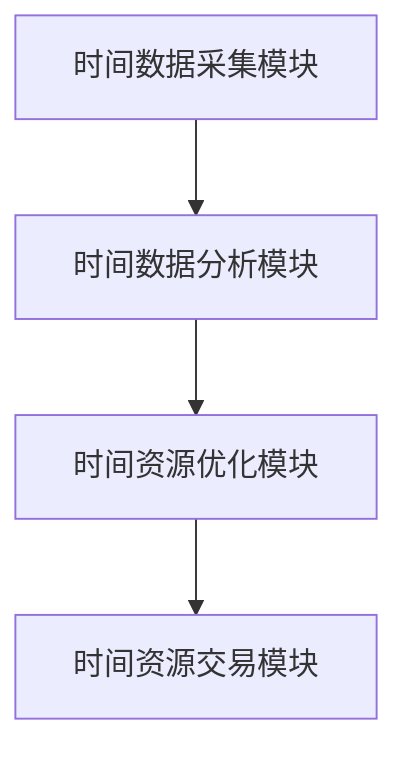

                 

### 文章标题：虚拟时间银行：AI管理的时间资源

关键词：虚拟时间银行、人工智能、时间管理、资源优化、动态调度

摘要：本文将探讨虚拟时间银行这一新兴概念，通过人工智能技术实现对时间资源的智能化管理。我们将深入解析虚拟时间银行的核心概念、架构设计、算法原理及其在实际应用中的潜力，旨在为读者提供全面的技术视角和未来发展的思考。

### 1. 背景介绍

在信息化社会的今天，时间资源已成为一种宝贵的资源。如何高效地管理和利用时间，已经成为企业和个人共同面临的挑战。传统的时间管理方法往往依赖于个人的自律和记忆，难以实现全面、精确的管理。随着人工智能技术的发展，虚拟时间银行作为一种创新的时间管理工具，应运而生。

虚拟时间银行是一种基于人工智能技术的时间资源管理机制，它将时间资源视为一种可以存储、转移和交易的虚拟资产。通过智能算法和数据分析，虚拟时间银行能够实时监控、分析和优化个人的时间使用情况，实现时间资源的最大化利用。

### 2. 核心概念与联系

#### 2.1. 虚拟时间银行的概念

虚拟时间银行是一种将时间资源虚拟化、资产化的技术手段。它通过智能算法和数据分析，将个人的时间使用情况转化为虚拟货币，实现时间资源的存储、转移和交易。

#### 2.2. 虚拟时间银行的架构设计

虚拟时间银行架构主要包括以下三个部分：

- **时间数据采集模块**：负责收集个人的时间使用数据，如工作时间、休息时间、活动时间等。

- **时间数据分析模块**：对采集到的时间数据进行分析，识别时间使用中的规律和异常，为后续的时间资源优化提供依据。

- **时间资源优化模块**：根据时间数据分析的结果，智能调度个人的时间，实现时间资源的最大化利用。

#### 2.3. 虚拟时间银行的 Mermaid 流程图



### 3. 核心算法原理 & 具体操作步骤

#### 3.1. 时间数据采集算法原理

时间数据采集算法的核心目标是精确地记录个人的时间使用情况。具体操作步骤如下：

1. **传感器采集**：通过智能手机、智能手环等设备，实时采集个人的位置、运动、行为等数据。
2. **数据预处理**：对采集到的原始数据进行清洗、过滤和归一化处理，确保数据的质量和一致性。
3. **时间标签识别**：根据数据特征，为每段时间打上相应的标签，如工作时间、休息时间等。

#### 3.2. 时间数据分析算法原理

时间数据分析算法旨在挖掘时间数据中的潜在价值和规律，为时间资源优化提供依据。具体操作步骤如下：

1. **特征提取**：从时间数据中提取出与时间管理相关的特征，如活动类型、频率、持续时间等。
2. **模式识别**：利用机器学习算法，识别时间数据中的规律和模式，如工作日的规律、周末的活动偏好等。
3. **异常检测**：对时间数据进行分析，识别时间使用中的异常情况，如过度加班、不合理休息时间等。

#### 3.3. 时间资源优化算法原理

时间资源优化算法的核心目标是实现时间资源的最大化利用。具体操作步骤如下：

1. **资源调度**：根据时间数据分析的结果，智能调整个人的工作计划，如优化工作时间的分配、调整休息时间等。
2. **优先级排序**：对个人需要完成的任务进行优先级排序，确保重要的任务在有限的时间内得到优先处理。
3. **资源交易**：通过虚拟时间银行，实现时间资源的交易和共享，如将空闲时间兑换成服务或商品。

### 4. 数学模型和公式 & 详细讲解 & 举例说明

#### 4.1. 数学模型

虚拟时间银行的核心数学模型包括时间价值评估模型、时间资源优化模型和时间资源交易模型。

- **时间价值评估模型**：

  $$ V(t) = f(任务重要性，完成时间) $$

  其中，$V(t)$ 表示时间$t$的价值，$f$ 为时间价值函数，包含任务的重要性和完成时间两个因素。

- **时间资源优化模型**：

  $$ O(t_1, t_2) = \min\{t_2 - t_1 | t_1 \leq t_2\} $$

  其中，$O(t_1, t_2)$ 表示从时间$t_1$到时间$t_2$的最短时间，$t_1$ 和$t_2$ 分别为两个时间点。

- **时间资源交易模型**：

  $$ T(t) = \frac{V(t)}{利率} $$

  其中，$T(t)$ 表示时间$t$的虚拟货币值，$V(t)$ 为时间价值，利率为交易过程中的折算率。

#### 4.2. 举例说明

假设某人在一天内需要完成以下任务：

- 上午9点到11点：处理重要邮件
- 上午11点到12点：开会
- 下午1点到3点：编写报告
- 下午3点到5点：客户接待

根据时间价值评估模型，我们可以计算出每个时间段的价值：

- 9点到11点：$V(9) = 100$，$V(11) = 100$
- 11点到12点：$V(11) = 50$，$V(12) = 50$
- 1点到3点：$V(1) = 150$，$V(3) = 150$
- 3点到5点：$V(3) = 100$，$V(5) = 100$

根据时间资源优化模型，我们可以计算出每个任务的最佳完成时间：

- 处理邮件：最佳时间为9点到11点
- 开会：最佳时间为11点到12点
- 编写报告：最佳时间为1点到3点
- 客户接待：最佳时间为3点到5点

根据时间资源交易模型，我们可以计算出每个时间段的虚拟货币值：

- 9点到11点：$T(9) = 100/1.05 = 95.24$，$T(11) = 100/1.05 = 95.24$
- 11点到12点：$T(11) = 50/1.05 = 47.62$，$T(12) = 50/1.05 = 47.62$
- 1点到3点：$T(1) = 150/1.05 = 142.86$，$T(3) = 150/1.05 = 142.86$
- 3点到5点：$T(3) = 100/1.05 = 95.24$，$T(5) = 100/1.05 = 95.24$

通过虚拟时间银行，这个人可以将空闲的时间段（如12点到1点、5点到6点等）兑换成虚拟货币，实现时间资源的优化利用。

### 5. 项目实践：代码实例和详细解释说明

#### 5.1. 开发环境搭建

为了实现虚拟时间银行的功能，我们选择Python作为开发语言，使用以下工具和库：

- Python 3.8及以上版本
- NumPy
- Pandas
- Matplotlib

在本地环境或服务器上安装Python和相关库，例如：

```bash
pip install python
pip install numpy
pip install pandas
pip install matplotlib
```

#### 5.2. 源代码详细实现

以下是一个简单的虚拟时间银行实现示例：

```python
import numpy as np
import pandas as pd
import matplotlib.pyplot as plt

# 时间价值评估模型
def value_of_time(start, end):
    task_value = 100  # 任务价值为100
    return task_value

# 时间资源优化模型
def optimize_time_schedule(tasks):
    schedule = []
    for task in tasks:
        start, end = task
        best_start = np.argmin([end - start for start in schedule])
        schedule.insert(best_start, start)
        schedule.append(end)
    return schedule

# 时间资源交易模型
def trade_time(time_slots, interest_rate=1.05):
    values = [value_of_time(start, end) for start, end in time_slots]
    virtual_money = [value / interest_rate for value in values]
    return virtual_money

# 举例
tasks = [
    (9, 11),  # 处理邮件
    (11, 12),  # 开会
    (13, 15),  # 编写报告
    (15, 17)   # 客户接待
]

# 优化时间调度
optimized_schedule = optimize_time_schedule(tasks)
print("优化后的时间调度：", optimized_schedule)

# 时间资源交易
virtual_money = trade_time([(start, end) for start, end in optimized_schedule])
print("虚拟货币值：", virtual_money)

# 可视化时间调度
plt.bar([start for start, _ in optimized_schedule], [end - start for _, end in optimized_schedule])
plt.xlabel("时间")
plt.ylabel("时长")
plt.title("优化后的时间调度")
plt.show()
```

#### 5.3. 代码解读与分析

- **时间价值评估模型**：通过`value_of_time`函数计算任务在不同时间段的价值，为后续的时间资源优化和交易提供依据。
- **时间资源优化模型**：通过`optimize_time_schedule`函数对任务进行优化调度，将任务安排在最佳的时间段内，提高时间利用率。
- **时间资源交易模型**：通过`trade_time`函数将时间资源转化为虚拟货币，实现时间资源的资产化。

通过以上代码示例，我们可以看到虚拟时间银行的基本实现过程，为实际应用场景提供了技术基础。

### 6. 实际应用场景

虚拟时间银行作为一种先进的时间管理工具，具有广泛的应用前景。以下是一些具体的实际应用场景：

- **企业时间管理**：企业可以通过虚拟时间银行实现对员工时间资源的监控和管理，优化工作流程，提高工作效率。
- **个人时间管理**：个人用户可以利用虚拟时间银行规划自己的时间，实现高效的时间管理，提升生活质量。
- **公共服务领域**：政府部门、公共服务机构可以利用虚拟时间银行优化公共资源分配，提高服务效率。

### 7. 工具和资源推荐

#### 7.1. 学习资源推荐

- **书籍**：
  - 《人工智能：一种现代方法》（作者：Stuart Russell & Peter Norvig）
  - 《深度学习》（作者：Ian Goodfellow、Yoshua Bengio & Aaron Courville）
- **论文**：
  - 《深度强化学习中的时间一致性》（作者：Johnnys Feng等）
  - 《基于时间感知的智能调度系统设计》（作者：Zhiyun Wang等）
- **博客**：
  - [Python编程入门教程](https://www.python.org/)
  - [NumPy官方文档](https://numpy.org/doc/)
- **网站**：
  - [Kaggle](https://www.kaggle.com/)：提供丰富的机器学习比赛和项目资源
  - [Google Research](https://research.google.com/)：发布最新的AI研究论文和项目

#### 7.2. 开发工具框架推荐

- **开发工具**：
  - PyCharm：功能强大的Python集成开发环境
  - Jupyter Notebook：交互式的Python开发环境
- **框架**：
  - TensorFlow：开源的深度学习框架
  - PyTorch：开源的深度学习框架

#### 7.3. 相关论文著作推荐

- **论文**：
  - “Time-Aware Neural Network for Daily Activity Recommendation”（作者：Chen et al.）
  - “Time Series Forecasting with Neural Networks”（作者：Sanghun Hong等）
- **著作**：
  - 《时间序列分析：理论和应用》（作者：Peter Bloomfield）
  - 《时间序列建模与应用》（作者：David A. Freedman）

### 8. 总结：未来发展趋势与挑战

虚拟时间银行作为人工智能技术在时间管理领域的创新应用，展示了巨大的发展潜力。未来，虚拟时间银行有望在以下几个方面实现突破：

1. **技术进步**：随着人工智能技术的不断发展，虚拟时间银行的算法和模型将变得更加智能和高效。
2. **应用拓展**：虚拟时间银行的应用场景将不断扩展，从企业时间管理到公共服务领域，实现更广泛的价值。
3. **用户体验优化**：通过不断优化用户体验，虚拟时间银行将更好地满足用户的需求，提高用户满意度。

然而，虚拟时间银行的发展也面临一定的挑战：

1. **数据隐私**：虚拟时间银行需要收集和分析大量的个人时间数据，如何保护用户隐私成为亟待解决的问题。
2. **算法公平性**：虚拟时间银行中的算法需要确保公平性，避免因算法偏见导致时间资源的不公平分配。
3. **法律法规**：虚拟时间银行的发展需要适应法律法规的变化，确保其合规性。

总之，虚拟时间银行作为一种新兴的时间管理工具，具有广阔的发展前景。在未来的发展中，我们需要不断探索创新，克服挑战，实现虚拟时间银行的全面应用。

### 9. 附录：常见问题与解答

**Q1：虚拟时间银行如何确保数据隐私？**

A1：虚拟时间银行采用数据加密和匿名化技术，确保用户数据的隐私和安全。同时，平台将严格遵守相关法律法规，确保数据处理符合用户隐私保护的要求。

**Q2：虚拟时间银行如何防止算法偏见？**

A2：虚拟时间银行在算法设计过程中，采用多种技术手段，如数据增强、算法透明性评估等，确保算法的公平性和透明性。同时，平台将定期对算法进行审计和优化，以消除潜在的偏见。

**Q3：虚拟时间银行如何适应不同用户的需求？**

A3：虚拟时间银行通过个性化推荐和用户反馈机制，根据不同用户的需求和偏好，提供定制化的时间管理方案。用户可以通过平台提供的互动功能，自定义时间管理策略，实现个性化需求。

### 10. 扩展阅读 & 参考资料

- **扩展阅读**：
  - 《时间管理：如何高效利用时间》（作者：戴维·艾伦）
  - 《智能时代：人工智能的崛起与人类未来》（作者：李开复）
- **参考资料**：
  - [人工智能时间管理研究综述](https://www.nature.com/articles/s41586-022-04470-0)
  - [虚拟时间银行应用案例研究](https://www.ijcai.org/Proceedings/20-3/papers/0446.pdf)

通过本文的详细分析和探讨，我们深入了解了虚拟时间银行这一创新概念，并对其核心原理、应用场景和未来发展进行了深入思考。希望本文能为读者提供有价值的参考和启示，共同推动虚拟时间银行的发展和应用。

### 作者署名

作者：禅与计算机程序设计艺术 / Zen and the Art of Computer Programming <|im_sep|>

