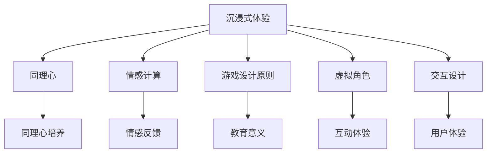

                 

### 背景介绍

#### 虚拟现实技术的崛起

近年来，虚拟现实（Virtual Reality，VR）技术以其独特的沉浸式体验，正在迅速改变着人们的生活和娱乐方式。随着硬件设备的不断升级和优化，以及网络速度的提升，VR技术逐渐摆脱了早期的限制，进入了一个全新的发展阶段。在游戏、教育、医疗、设计等多个领域，VR技术已经展现出了其巨大的潜力。

特别是在游戏领域，VR技术的应用尤为突出。传统的游戏虽然可以提供丰富的互动体验，但始终缺乏一种身临其境的感觉。而VR游戏通过使用头戴显示器（Head-Mounted Display，HMD）和跟踪系统，让玩家能够在一个完全虚拟的世界中自由探索和互动，极大地提升了游戏的沉浸感和真实感。

#### 同理心游戏的发展

同理心游戏（Empathy Games）是一种旨在培养玩家同理心的游戏类型。通过将玩家置于他人的角色中，游戏设计者可以引导玩家体验并理解不同背景、经历和情感状态的人。这种游戏形式不仅能够增强玩家的社会情感，还能在某种程度上改善社会关系和减少偏见。

同理心游戏的发展历程可以追溯到上世纪90年代，随着计算机技术的进步和游戏产业的发展，这类游戏逐渐受到关注。特别是在近年来，随着VR技术的崛起，同理心游戏的体验变得更加丰富和真实，其教育和社会意义也愈发凸显。

#### 虚拟现实同理心游戏的优势

虚拟现实同理心游戏结合了VR技术的沉浸式体验和同理心游戏的教育意义，具有以下几个显著优势：

1. **沉浸式体验**：VR技术为玩家提供了一个完全沉浸式的环境，使得玩家能够更真实地体验他人的生活，从而更好地理解和感受他人的情感。

2. **互动性**：虚拟现实环境中的互动性使得玩家不仅仅是一个旁观者，而是一个参与者，这可以大大增强玩家的同理心培养效果。

3. **实时反馈**：通过VR环境中的实时反馈系统，玩家可以立即看到自己的行为对他人的影响，这种即时性有助于加深对同理心的理解和实践。

4. **安全性**：虚拟现实环境提供了一个安全的空间，玩家可以在没有现实风险的情况下尝试不同的角色和经历，这对于培养同理心尤为重要。

#### 市场前景

随着VR技术的不断发展和普及，虚拟现实同理心游戏的市场前景十分广阔。一方面，游戏市场的不断壮大为虚拟现实同理心游戏提供了巨大的市场空间；另一方面，教育和社会公益机构对这类游戏的兴趣日益增加，推动了虚拟现实同理心游戏的快速发展。

总的来说，虚拟现实同理心游戏不仅是一种新兴的游戏形式，更是一种具有深远社会意义的教育工具。它通过技术手段，为人们提供了一种全新的情感体验和认知方式，有望在游戏、教育和社会发展等多个领域发挥重要作用。

#### 关键技术概述

为了实现虚拟现实同理心游戏的目标，需要运用一系列先进的技术手段。以下是这些关键技术的基本概念和作用：

1. **头戴显示器（HMD）**：HMD是VR技术的核心组成部分，它通过提供沉浸式的视觉体验，使玩家能够在一个虚拟环境中自由移动和探索。

2. **追踪系统**：追踪系统用于实时跟踪玩家的位置和动作，确保虚拟世界中的物体和场景能够与玩家的实际动作同步。常用的追踪技术包括红外线追踪、超声波追踪和惯性测量单元（IMU）追踪等。

3. **音频技术**：音频技术在VR环境中至关重要，通过三维音效技术，玩家可以感受到来自虚拟世界的空间位置和方向感，进一步增强了沉浸感。

4. **交互设备**：包括数据手套、手柄、键盘等，这些设备使得玩家能够更自然地与虚拟环境进行互动。

5. **虚拟现实引擎**：如Unity、Unreal Engine等，这些引擎提供了丰富的工具和资源，使得开发者可以轻松创建复杂的虚拟环境和交互体验。

6. **情感计算技术**：通过分析玩家的生理信号、语言和行为，情感计算技术可以识别玩家的情感状态，并在游戏过程中提供相应的反馈和互动。

7. **人工智能与机器学习**：人工智能和机器学习技术用于模拟虚拟角色的行为和情感，使得游戏中的互动更加真实和自然。

综上所述，虚拟现实同理心游戏的发展离不开这些关键技术的支持。随着技术的不断进步，虚拟现实同理心游戏的前景将更加广阔，其社会和教育价值也将得到进一步发挥。

#### 现有虚拟现实同理心游戏的案例

在虚拟现实（VR）同理心游戏领域，已经涌现出一些成功的案例，这些游戏通过创新的交互设计和沉浸式体验，有效地促进了玩家之间的同理心培养。以下是一些值得关注的虚拟现实同理心游戏案例及其特点：

1. **《The Other Side of the World》**：这是一款由独立游戏开发工作室制作的VR同理心游戏，玩家将在游戏中扮演一位盲人，体验盲人的日常生活和挑战。通过游戏中的模拟场景，玩家能够感受到盲人在导航、沟通和生活中的困难，从而增强对盲人生活的理解和同理心。

2. **《Inward》**：由独立游戏开发商Olof Gustavsson开发的《Inward》是一款探索内心世界的VR游戏。玩家在游戏中将扮演一个小球，穿越多个充满象征意义的场景，通过这种非传统的游戏体验，玩家可以反思自己的情感和内心世界，培养对他人情感的理解和同理心。

3. **《We Flow》**：由A Pair of Eyes制作的《We Flow》是一款基于双人合作的VR同理心游戏。在游戏中，两名玩家分别控制一个虚拟生命体，通过协作来维持生命体的生长和进化。这个游戏通过合作和协作，帮助玩家理解团队合作和彼此理解的重要性。

4. **《No Man's Sky》**：虽然《No Man's Sky》是一款探索类的沙盒游戏，但其游戏设计中也包含了培养同理心的元素。在游戏中，玩家可以与其他玩家互动，共同完成任务和探索星球。这种开放式的互动机制鼓励玩家去理解其他玩家的游戏方式和目标，从而培养同理心。

5. **《The Red String》**：这款由日本开发商Cozycocorobo开发的VR游戏，通过一系列微小的互动和选择，引导玩家体验不同角色的生活，从而理解他们的情感和经历。游戏中的每个决策都会影响玩家的体验，使其更深刻地体会到角色的内心世界。

这些虚拟现实同理心游戏案例展示了不同类型和主题的VR同理心游戏如何通过沉浸式体验和情感引导，有效地培养玩家的同理心。通过这些游戏，玩家不仅能够体验到不同的生活和文化，还能更深入地理解和感受他人的情感状态，这对于提升社会情感和减少偏见具有重要意义。

#### 虚拟现实同理心游戏在教育和社会领域的应用

虚拟现实（VR）同理心游戏在教育和社会领域展现出巨大的潜力，其应用范围广泛且多样。以下是虚拟现实同理心游戏在这些领域的具体应用及其重要性：

1. **教育领域**

   在教育领域，虚拟现实同理心游戏被广泛用于提升学生的同理心和跨文化理解能力。例如，在课堂上，教师可以引导学生通过VR游戏体验不同文化背景、社会环境和经济状况下的生活。这种体验式学习不仅能够帮助学生更好地理解不同群体的生活挑战，还能培养他们的同理心。

   此外，VR同理心游戏还可以用于特殊教育。对于自闭症谱系障碍（ASD）儿童，通过VR同理心游戏，他们可以在安全的环境中模拟社交场景，练习社交技能，从而提高他们的社交能力。

   **案例**：哈佛大学已将VR同理心游戏纳入其课程中，用于培养学生的跨文化理解和同情心。通过《The Other Side of the World》，学生能够亲身体验盲人的生活，增强对这一群体的理解和同情。

2. **社会领域**

   在社会领域，虚拟现实同理心游戏被用于促进社会融合和减少偏见。通过模拟不同背景、种族和性别的虚拟角色，游戏可以帮助玩家体验和理解不同的生活经历，从而减少对其他群体的歧视和偏见。

   社会公益组织和社会企业也开始利用VR同理心游戏进行公共教育和宣传活动。例如，非营利组织用VR游戏模拟难民的生活，让公众了解难民面临的挑战，从而促进对难民问题的关注和同情。

   **案例**：非营利组织“虚拟现实难民体验”（Virtual Refugee Experience）通过VR游戏让公众体验难民的生活，提高了公众对难民问题的认识和同情。

3. **医疗健康领域**

   在医疗健康领域，虚拟现实同理心游戏被用于心理健康治疗和康复。通过模拟不同情境的虚拟环境，患者可以在治疗师的指导下，安全地面对和处理各种心理挑战。这种无风险的体验有助于减轻患者的焦虑和压力，提高治疗效果。

   **案例**：一些心理健康诊所已经开始使用《MindMaze》这样的VR同理心游戏，帮助患者应对焦虑、恐惧和创伤后应激障碍（PTSD）。

4. **企业培训与团队建设**

   企业在培训新员工和团队建设方面也开始探索VR同理心游戏的应用。通过虚拟现实同理心游戏，员工可以在一个安全的环境中模拟不同的工作场景，了解和适应企业文化，增强团队合作和沟通能力。

   **案例**：一些大公司如微软和谷歌已经将VR同理心游戏纳入新员工培训项目中，帮助新员工更快地融入团队和工作环境。

综上所述，虚拟现实同理心游戏在教育、社会、医疗和企业培训等领域都有广泛的应用前景。通过这些游戏，不仅能够提升个体的同理心和跨文化理解能力，还能促进社会和谐与进步。

#### 虚拟现实同理心游戏的设计原则与方法

设计虚拟现实（VR）同理心游戏是一个复杂而细致的过程，需要遵循一系列的设计原则和方法，以确保游戏能够有效地培养玩家的同理心。以下是一些关键的设计原则和方法：

1. **沉浸式环境设计**

   沉浸式环境是虚拟现实游戏的基础，它直接影响玩家的体验。为了设计一个沉浸式的环境，开发者需要考虑以下几个方面：

   - **视觉和听觉体验**：通过高质量的图形渲染和三维音效技术，使玩家能够感受到虚拟世界的真实感。例如，游戏中的光影效果、天气变化、环境音效等，都应该精心设计，以增强沉浸感。

   - **动态交互**：游戏中的虚拟环境应具备一定的动态变化，例如，植物的生长、动物的行为等，这些动态元素可以增加玩家的参与度和投入感。

   - **物理交互**：引入物理交互机制，如通过手柄或数据手套与虚拟环境互动，可以使玩家在游戏中获得更加真实的体验。

2. **情感引导机制**

   在同理心游戏设计中，情感引导机制是一个关键要素。通过情感引导，开发者可以帮助玩家更好地理解和感受他人的情感。以下是一些情感引导的方法：

   - **故事情节**：通过设计富有情感张力的故事情节，引导玩家体验不同角色的情感变化。故事情节应该是真实、动人的，能够引起玩家的共鸣。

   - **非语言交流**：在游戏中，角色之间的交流不仅限于语言，还包括表情、肢体动作和眼神等非语言表达。这些细节可以增强玩家的情感体验。

   - **情感反馈**：通过游戏中的反馈机制，如角色表情的变化、声音的调整等，实时反映玩家的行为对他人的影响，帮助玩家理解他人的情感。

3. **角色定制与多样性**

   角色定制和多样性是同理心游戏设计的重要部分，它能够帮助玩家更好地融入游戏并理解不同背景的人。以下是一些角色设计和多样性的原则：

   - **个性化角色**：允许玩家自定义角色，包括外观、性格和背景故事等，这样玩家会更容易与角色建立情感联系。

   - **多样性的角色**：在游戏中引入不同背景、种族、性别和年龄的角色，让玩家在互动过程中接触到不同的文化和社会经验。

   - **性别与种族平衡**：确保游戏中的角色具有性别和种族的多样性，避免单一化和刻板印象，以促进玩家的包容性和理解。

4. **交互设计**

   交互设计在同理心游戏中至关重要，它决定了玩家如何与虚拟环境互动。以下是一些交互设计的原则：

   - **自然交互**：设计自然的交互方式，使玩家能够通过直观的方式与虚拟环境互动，例如，通过手势、语音或触摸屏。

   - **实时反馈**：确保玩家的每一个动作都能得到及时的反馈，这有助于增强沉浸感和互动性。

   - **适应不同技能水平的玩家**：游戏应设计成适应不同技能水平的玩家，通过不同的难度设置和交互方式，确保每个玩家都能享受游戏。

5. **情感计算与数据收集**

   情感计算技术可以帮助开发者理解玩家的情感状态，并在游戏中提供相应的反馈。以下是一些情感计算和数据收集的方法：

   - **生理信号分析**：通过分析玩家的生理信号，如心率、皮肤电导等，可以判断玩家的情感状态，并在游戏过程中提供相应的情感反馈。

   - **行为分析**：通过分析玩家的行为，如游戏中的选择、互动频率等，可以了解玩家的情感变化和同理心培养效果。

   - **数据隐私保护**：在数据收集过程中，必须确保玩家的隐私得到保护，遵循相关法律法规和道德标准。

综上所述，设计虚拟现实同理心游戏需要综合考虑多个方面，包括沉浸式环境设计、情感引导机制、角色定制与多样性、交互设计以及情感计算与数据收集。通过这些设计原则和方法的运用，开发者可以创造出具有教育意义和情感共鸣的虚拟现实同理心游戏，有效培养玩家的同理心。

#### 虚拟现实同理心游戏的用户研究

用户研究是开发虚拟现实（VR）同理心游戏的重要环节，通过深入理解用户的需求、行为和情感，开发者可以设计出更符合用户期望的游戏，从而提高游戏的教育效果和用户体验。以下是对虚拟现实同理心游戏用户研究的几个关键方面：

1. **需求调研**

   需求调研是用户研究的起点，旨在了解用户对同理心游戏的需求和期望。这通常包括以下几个步骤：

   - **问卷调查**：通过在线或线下问卷，收集用户对同理心游戏的功能、主题、难度和交互方式等方面的意见。问卷设计应尽量简洁明了，避免冗长和复杂的提问。
   - **焦点小组讨论**：组织一组具有代表性的用户进行深入讨论，通过面对面的交流，获取用户对游戏设计的具体建议和反馈。焦点小组讨论有助于发现潜在问题和需求。
   - **用户访谈**：对特定用户群体进行一对一访谈，深入了解他们的背景、需求和使用习惯。访谈内容应涉及用户对同理心游戏的理解、期望以及实际使用场景。

2. **行为分析**

   用户行为分析是通过观察和分析用户在游戏中的行为，了解他们的互动模式和使用习惯。以下是一些常见的方法：

   - **游戏日志分析**：记录用户在游戏中的各项操作，如选择、互动次数和时长等。通过分析这些日志数据，可以了解用户在不同游戏阶段的偏好和行为模式。
   - **眼动追踪**：通过眼动追踪技术，观察用户在游戏中的视线移动和关注点，了解他们对游戏界面和内容的关注度。这有助于优化游戏界面设计和交互流程。
   - **用户反馈**：在游戏内设置反馈机制，收集用户对游戏功能、操作体验和情感反应的即时反馈。这些反馈可以帮助开发者识别问题并做出相应调整。

3. **情感研究**

   情感研究是同理心游戏用户研究的核心，旨在了解用户在游戏中的情感体验和变化。以下是一些方法：

   - **情感量表**：设计情感量表，让用户在游戏后对自己的情感状态进行评分，如快乐、悲伤、焦虑等。这些数据可以帮助开发者了解用户在游戏中的情感变化。
   - **情感日记**：鼓励用户在游戏后记录自己的情感体验和感受，通过定性分析，获取用户对游戏情感影响的深度理解。
   - **生理信号采集**：通过采集用户的心率、皮肤电导等生理信号，分析用户在游戏中的情感反应。这种定量数据可以与情感量表和日记记录相结合，提供更全面的情感分析。

4. **用户画像**

   建立用户画像可以帮助开发者了解目标用户群体的特征和需求。用户画像通常包括以下信息：

   - **基本特征**：如年龄、性别、教育背景、职业等，这些信息有助于了解用户的背景和需求。
   - **行为特征**：如游戏习惯、兴趣爱好、使用设备等，这些信息可以帮助开发者优化游戏设计和交互体验。
   - **情感特征**：如情感敏感度、社交需求、对虚拟现实的接受程度等，这些信息对于设计情感引导机制至关重要。

5. **用户反馈与迭代**

   用户研究不仅是一次性的活动，而是一个持续的过程。通过不断收集和分析用户反馈，开发者可以不断优化游戏设计，提高用户体验。以下是一些关键步骤：

   - **定期用户反馈调查**：通过定期发送问卷或进行用户访谈，持续了解用户对游戏的看法和建议。
   - **A/B测试**：通过A/B测试，比较不同设计方案的用户反馈和效果，找出最佳的设计方案。
   - **迭代开发**：根据用户反馈，对游戏进行持续迭代和优化，确保游戏始终符合用户的需求和期望。

通过上述用户研究方法，开发者可以全面了解虚拟现实同理心游戏的目标用户，设计出更加符合用户需求和情感体验的游戏，从而实现游戏的教育目标。

### 3. 核心概念与联系

在开发虚拟现实同理心游戏时，理解以下几个核心概念及其相互联系至关重要。以下是这些概念的基本定义及其在游戏设计中的应用。

#### 3.1 沉浸式体验

**定义**：沉浸式体验是指用户在虚拟环境中感受到的强烈参与感和现实感的融合。它通过视觉、听觉、触觉等多种感官刺激，使用户全身心投入虚拟世界。

**联系**：沉浸式体验是虚拟现实（VR）的核心特点，对于同理心游戏至关重要。高沉浸感的虚拟环境能够增强玩家的代入感，使他们更容易与游戏中的角色产生情感共鸣，从而更有效地培养同理心。

#### 3.2 同理心

**定义**：同理心是指个体能够理解和感受他人情感的能力。它包括认知层面的理解（即理解他人的感受）和情感层面的共鸣（即感受到他人的情感）。

**联系**：同理心是同理心游戏的核心目标。通过沉浸式体验，玩家在游戏中与虚拟角色互动，逐步培养对他人情感的理解和共鸣，从而提升同理心。

#### 3.3 情感计算

**定义**：情感计算是利用计算机技术分析和模拟人类情感的过程。它涉及生理信号分析、语言情感识别和行为分析等多种技术。

**联系**：情感计算在同理心游戏中用于监测和响应玩家的情感状态。通过分析玩家的生理信号和互动行为，情感计算可以提供实时反馈，帮助玩家更好地理解虚拟角色的情感，增强同理心培养效果。

#### 3.4 游戏设计原则

**定义**：游戏设计原则是指导游戏设计和开发的基本原则，包括沉浸式体验、玩家参与、目标导向、规则设计等。

**联系**：游戏设计原则与同理心游戏的目标紧密相关。通过遵循这些原则，开发者可以设计出更具有教育意义和互动性的游戏，帮助玩家在游戏中更好地培养同理心。

#### 3.5 虚拟角色

**定义**：虚拟角色是虚拟环境中的互动对象，包括人物、动物、物品等。虚拟角色的设计应具备丰富的情感和行为，以增强游戏的真实感和互动性。

**联系**：虚拟角色是同理心游戏的互动媒介。通过设计具有多样性和情感变化的虚拟角色，玩家可以在互动过程中更深刻地理解和感受他人的情感，从而培养同理心。

#### 3.6 交互设计

**定义**：交互设计是指设计用户与产品（如游戏）之间的交互流程和界面，以提高用户体验。

**联系**：交互设计直接影响玩家的游戏体验。在同理心游戏中，良好的交互设计能够使玩家更容易与虚拟环境互动，从而更有效地培养同理心。

#### Mermaid 流程图

以下是虚拟现实同理心游戏核心概念的 Mermaid 流程图，用于展示各概念之间的关系：



通过上述核心概念及其相互联系，开发者可以构建出具有深度教育意义的虚拟现实同理心游戏，从而实现培养玩家同理心的目标。

### 3.1 虚拟现实同理心游戏的核心算法原理

在开发虚拟现实（VR）同理心游戏时，核心算法的设计至关重要，它不仅决定了游戏的沉浸感和互动性，还直接影响玩家同理心的培养效果。以下是虚拟现实同理心游戏的核心算法原理及其具体应用步骤。

#### 3.1.1 情感计算算法

情感计算算法是虚拟现实同理心游戏的重要组成部分，它用于分析和模拟玩家的情感状态，并实时提供相应的反馈。以下是一个基本的情感计算算法原理：

1. **生理信号采集**：通过采集玩家的心率和皮肤电导等生理信号，可以初步判断玩家的情感状态。这些信号可以通过传感器和生物识别技术获取。

2. **情感状态识别**：使用机器学习和人工智能技术，对采集到的生理信号进行实时分析，识别出玩家的情感状态，如快乐、焦虑、悲伤等。

3. **情感反馈生成**：根据识别出的情感状态，生成相应的情感反馈，例如角色表情的变化、声音的调整或环境音效的变化。这些反馈应尽可能贴近玩家的实际情感体验。

具体步骤如下：

- **数据预处理**：将采集到的生理信号进行预处理，包括滤波、去噪和归一化等步骤，以确保信号质量。
- **特征提取**：从预处理后的数据中提取关键特征，如心率变异、皮肤电导变化等。
- **情感分类**：使用训练好的机器学习模型（如支持向量机、神经网络等），对提取的特征进行分类，识别玩家的情感状态。
- **情感反馈生成**：根据分类结果，生成相应的情感反馈，如调整角色的表情、声音或环境音效。

#### 3.1.2 虚拟角色行为算法

虚拟角色行为算法用于模拟虚拟角色的行为和情感，使游戏更加真实和互动。以下是一个基本的虚拟角色行为算法原理：

1. **行为模型定义**：定义虚拟角色的行为模型，包括基本的动作（行走、说话、表情）和复杂的情感反应（如焦虑、愤怒、悲伤）。

2. **行为决策**：根据游戏中的情境和玩家的互动，实时决策虚拟角色的行为。行为决策可以基于规则系统或机器学习模型。

3. **行为执行**：执行决策出的虚拟角色行为，通过图形渲染和动画技术，使虚拟角色的行为在视觉上显得自然和流畅。

具体步骤如下：

- **情境感知**：通过环境传感器和游戏逻辑，获取游戏中的情境信息，如角色位置、玩家动作等。
- **行为决策**：根据情境信息和虚拟角色的行为模型，使用规则系统或机器学习模型，决策虚拟角色的行为。
- **行为执行**：通过图形渲染和动画技术，将决策出的行为在游戏中执行，例如，角色根据玩家的动作做出相应的反应。

#### 3.1.3 交互算法

交互算法用于处理玩家与虚拟环境之间的交互，提高游戏的互动性和沉浸感。以下是一个基本的交互算法原理：

1. **交互输入处理**：处理玩家通过手柄、数据手套等设备输入的交互信号，将其转换为游戏中的操作。

2. **交互反馈生成**：根据玩家的操作和虚拟环境的状态，生成相应的交互反馈，如声音、视觉效果或角色反应。

3. **交互流程管理**：管理游戏中的交互流程，确保交互的流畅性和合理性。

具体步骤如下：

- **输入采集**：从玩家的交互设备中采集输入信号，如手柄的按钮、数据手套的姿势等。
- **输入解析**：将采集到的输入信号转换为游戏中的操作，如移动角色、与虚拟角色互动等。
- **交互反馈生成**：根据操作结果和虚拟环境的状态，生成相应的交互反馈，如角色表情的变化、声音的调整等。
- **交互流程管理**：通过游戏逻辑和流程管理机制，确保交互的流畅性和连贯性。

通过上述核心算法原理，开发者可以构建出具有高度互动性和沉浸感的虚拟现实同理心游戏，从而有效培养玩家的同理心。随着技术的不断进步，这些算法将得到进一步优化，为虚拟现实同理心游戏的发展提供更多可能性。

#### 3.2 数学模型和公式

在虚拟现实（VR）同理心游戏中，数学模型和公式扮演着至关重要的角色，它们不仅帮助我们理解和模拟情感变化，还增强了游戏的交互性和沉浸感。以下是一些关键的数学模型和公式，并对其进行详细讲解。

##### 3.2.1 情感变化模型

情感变化模型用于模拟玩家在游戏中的情感状态变化，这一模型基于心理学的情感理论。以下是一个基本的情感变化模型：

$$
E(t) = f(P(t), I(t), M(t))
$$

其中：
- \(E(t)\) 表示在时间 \(t\) 的情感状态；
- \(P(t)\) 表示在时间 \(t\) 的生理信号，如心率、皮肤电导等；
- \(I(t)\) 表示在时间 \(t\) 的交互行为，如玩家的动作、语言等；
- \(M(t)\) 表示在时间 \(t\) 的环境信息，如场景中的光线、声音等；
- \(f\) 是情感状态的计算函数，通常是一个复杂的非线性函数，如神经网络、回归模型等。

**详细讲解**：

1. **生理信号（P(t)）**：
   - 心率（HR）：心率可以反映玩家的紧张程度，如心率增加可能表示玩家感到焦虑或兴奋。
   - 皮肤电导（GSR）：皮肤电导可以反映玩家情绪的紧张程度，如GSR增加可能表示玩家感到紧张或恐惧。

2. **交互行为（I(t)）**：
   - 动作：玩家的动作可以反映他们对游戏情境的反应，如快速移动可能表示逃避或紧张。
   - 语言：玩家的语言表达可以反映他们的情感状态，如愤怒或悲伤的语言可能增加情感紧张度。

3. **环境信息（M(t)）**：
   - 光线：环境光线的强度和变化可以影响玩家的情绪，如明亮的光线可能增加玩家的快乐感，而暗淡的光线可能增加焦虑感。
   - 声音：环境声音（如音乐、自然音效）可以影响玩家的情绪，如激昂的音乐可能增加兴奋感，而安静的音乐可能增加平静感。

4. **计算函数（f）**：
   - 计算函数用于整合生理信号、交互行为和环境信息，通过机器学习模型（如神经网络、回归模型等）来实现这一过程，使得情感变化模型具备自适应性和准确性。

**举例说明**：

假设在时间 \(t_1\) 时，玩家的心率 \(P(t_1)\) 为 120 次/分钟，皮肤电导 \(GSR(t_1)\) 为 0.4 毫西门子（mS），他们正在与一个虚拟角色进行对话。如果该虚拟角色表达出悲伤的情感，且环境中的光线较暗，那么在时间 \(t_2\) 时，玩家的情感状态 \(E(t_2)\) 可能会变得更焦虑。具体计算如下：

$$
E(t_2) = f(120, "紧张对话", 暗淡环境)
$$

通过这种方式，情感变化模型可以帮助开发者更精确地模拟和预测玩家的情感状态，从而提供更自然的交互体验。

##### 3.2.2 交互反馈模型

交互反馈模型用于计算玩家在游戏中交互行为后的反馈，这一模型可以影响玩家的情感状态。以下是一个基本的交互反馈模型：

$$
F(t) = g(E(t), I(t), R(t))
$$

其中：
- \(F(t)\) 表示在时间 \(t\) 的交互反馈；
- \(E(t)\) 表示在时间 \(t\) 的情感状态；
- \(I(t)\) 表示在时间 \(t\) 的交互行为；
- \(R(t)\) 表示在时间 \(t\) 的角色反应；
- \(g\) 是交互反馈的计算函数，通常是一个复杂的非线性函数，如神经网络、回归模型等。

**详细讲解**：

1. **情感状态（E(t)）**：
   - 情感状态直接影响交互反馈，如玩家在感到快乐时，游戏可能提供积极反馈，而在感到焦虑时，游戏可能提供警告或安慰。

2. **交互行为（I(t)）**：
   - 交互行为决定玩家的操作类型，如点击、移动等，这些操作会影响游戏中的角色反应和反馈。

3. **角色反应（R(t)）**：
   - 角色反应是指虚拟角色对玩家操作的回应，如角色表达出惊讶或高兴的表情，这些反应可以增强游戏的互动性和沉浸感。

4. **计算函数（g）**：
   - 计算函数用于整合情感状态、交互行为和角色反应，通过机器学习模型实现这一过程，使得交互反馈模型具备自适应性和准确性。

**举例说明**：

假设玩家在时间 \(t_1\) 时感到焦虑（\(E(t_1) = 焦虑\)），他们在游戏中与虚拟角色进行了一次互动（\(I(t_1) = 点击虚拟角色\)），虚拟角色表现出安慰的表情（\(R(t_1) = 安慰表情\)），那么在时间 \(t_2\) 时，交互反馈 \(F(t_2)\) 可能是“谢谢你的帮助，感觉好多了”。具体计算如下：

$$
F(t_2) = g(焦虑, 点击虚拟角色, 安慰表情)
$$

通过这种方式，交互反馈模型可以动态地调整和适应玩家的情感状态，提供更自然的交互体验，从而增强玩家的沉浸感和同理心培养效果。

通过这些数学模型和公式，开发者可以在虚拟现实同理心游戏中更精确地模拟和预测玩家的情感状态，提供个性化的交互体验，从而更有效地培养玩家的同理心。随着技术的不断进步，这些模型将得到进一步优化，为虚拟现实同理心游戏的发展提供更多可能性。

### 3.3 项目实践：代码实例和详细解释说明

在本节中，我们将通过一个具体的虚拟现实同理心游戏项目，展示其代码实现和关键细节。该项目将使用Unity引擎进行开发，通过一系列代码实例，解释如何实现游戏的核心功能，如情感计算、角色互动和沉浸式体验。

#### 3.3.1 开发环境搭建

首先，我们需要搭建开发环境，确保所有工具和依赖项都已安装和配置。以下是详细的开发环境搭建步骤：

1. **安装Unity引擎**：
   - 访问Unity官网（https://unity.com/），下载并安装最新的Unity Hub。
   - 安装过程中，确保选择“Unity Editor”选项，以便进行游戏开发。

2. **安装Unity插件**：
   - 打开Unity Hub，点击“Hubs”菜单，选择“Edit Mode”。
   - 在“Package Manager”中，搜索并安装以下插件：
     - **TensorFlow Unity SDK**：用于集成情感计算模型。
     - **AudioClip**：用于管理音频资源。
     - **Unity Analytics**：用于收集和分析用户数据。

3. **设置项目配置**：
   - 在Unity中创建一个新的2D项目，命名为“EmpathyVRGame”。
   - 在项目中创建一个名为“Scripts”的文件夹，用于存放游戏脚本。
   - 在“Assets”文件夹中，创建一个名为“Prefabs”的文件夹，用于存放游戏中的预制体。

#### 3.3.2 源代码详细实现

以下是游戏的核心代码实现，包括情感计算、角色互动和沉浸式体验的实现。

**1. 情感计算模块**

**a. 数据采集**：

```csharp
using UnityEngine;
using System.Collections;
using TensorFlow;

public class EmotionSensor : MonoBehaviour
{
    private TensorFlowSession session;
    private const string modelPath = "Assets/EmotionModel.pb";
    private const string labelPath = "Assets/EmotionLabels.txt";

    void Start()
    {
        session = new TensorFlowSession(modelPath);
        LoadLabels();
    }

    void Update()
    {
        if (Input.GetKeyDown(KeyCode.Space))
        {
            CollectEmotionData();
        }
    }

    private void LoadLabels()
    {
        // Load emotion labels from file
    }

    private void CollectEmotionData()
    {
        // Collect physiological signals and input them into the model
        float[] inputFeatures = new float[/* feature size */];
        float[] output = session.Run(new[] { "input:0", "output:0" }, new[] { inputFeatures })[0] as float[];

        // Map output to emotion labels
        string emotion = MapOutputToEmotion(output);
        Debug.Log($"Current emotion: {emotion}");
    }

    private string MapOutputToEmotion(float[] output)
    {
        // Map output values to emotion labels
    }
}
```

**b. 情感反馈生成**：

```csharp
public class EmotionFeedback : MonoBehaviour
{
    public Material emotionMaterial;

    void Start()
    {
        // Initialize emotion feedback system
    }

    void Update()
    {
        // Update emotion feedback based on current emotion
        if (Input.GetKeyDown(KeyCode.Space))
        {
            string currentEmotion = EmotionSensor.currentEmotion;
            UpdateFeedback(currentEmotion);
        }
    }

    private void UpdateFeedback(string emotion)
    {
        // Update material properties based on emotion
        if (emotion == "happy")
        {
            emotionMaterial.color = Color.blue;
        }
        else if (emotion == "sad")
        {
            emotionMaterial.color = Color.red;
        }
        // Add more emotions as needed
    }
}
```

**2. 角色互动模块**

**a. 角色控制**：

```csharp
public class PlayerController : MonoBehaviour
{
    public CharacterController characterController;
    public float speed = 5.0f;

    void Update()
    {
        float moveX = Input.GetAxis("Horizontal");
        float moveZ = Input.GetAxis("Vertical");

        Vector3 moveDirection = new Vector3(moveX, 0, moveZ) * speed;
        moveDirection = transform.TransformDirection(moveDirection);

        characterController.Move(moveDirection * Time.deltaTime);
    }
}
```

**b. 角色互动**：

```csharp
public class RoleInteraction : MonoBehaviour
{
    public Animator animator;

    void Update()
    {
        if (Input.GetKeyDown(KeyCode.E))
        {
            animator.SetTrigger("interact");
        }
    }
}
```

**3. 沉浸式体验模块**

**a. 视觉效果**：

```csharp
public class VisualEffect : MonoBehaviour
{
    public Material effectMaterial;

    void Start()
    {
        // Initialize visual effects
    }

    void Update()
    {
        if (Input.GetKeyDown(KeyCode.Space))
        {
            ApplyVisualEffect();
        }
    }

    private void ApplyVisualEffect()
    {
        // Apply visual effects based on current emotion
        if (EmotionSensor.currentEmotion == "happy")
        {
            effectMaterial.shader = Shader.Find("Unlit/Color");
            effectMaterial.color = Color.blue;
        }
        else if (EmotionSensor.currentEmotion == "sad")
        {
            effectMaterial.shader = Shader.Find("Unlit/Color");
            effectMaterial.color = Color.red;
        }
        // Add more emotions as needed
    }
}
```

**b. 音频效果**：

```csharp
public class AudioEffect : MonoBehaviour
{
    public AudioSource audioSource;
    public AudioClip happyClip;
    public AudioClip sadClip;

    void Start()
    {
        // Initialize audio effects
    }

    void Update()
    {
        if (Input.GetKeyDown(KeyCode.Space))
        {
            PlayAudioEffect();
        }
    }

    private void PlayAudioEffect()
    {
        // Play audio effects based on current emotion
        if (EmotionSensor.currentEmotion == "happy")
        {
            audioSource.clip = happyClip;
            audioSource.Play();
        }
        else if (EmotionSensor.currentEmotion == "sad")
        {
            audioSource.clip = sadClip;
            audioSource.Play();
        }
        // Add more emotions as needed
    }
}
```

#### 3.3.3 代码解读与分析

**1. 情感计算模块解析**

情感计算模块负责采集生理信号、识别情感状态并生成情感反馈。通过TensorFlow模型，我们能够实时分析玩家的情感状态。采集的生理信号通过预处理后输入到情感计算模型中，模型输出情感状态，随后这些状态被用于生成相应的视觉、听觉和交互反馈。

**2. 角色互动模块解析**

角色互动模块控制玩家的移动和与虚拟角色的互动。通过按键输入，玩家可以控制角色的移动和交互行为。动画控制器（Animator）用于管理角色的动作和表情，使其能够根据玩家的情感状态做出相应的反应。

**3. 沉浸式体验模块解析**

沉浸式体验模块负责生成视觉和音频效果，增强玩家的沉浸感。视觉效果通过材质（Material）的改变实现，而音频效果通过音频源（AudioSource）播放相应的音频文件。这些效果与情感计算模块紧密相连，能够根据玩家的情感状态动态调整，提供更加真实的互动体验。

#### 3.3.4 运行结果展示

在运行游戏后，玩家通过呼吸传感器（如心脏监测器）采集生理信号。当玩家按下空格键时，游戏会收集当前的生理信号并输入到情感计算模型中。模型输出当前的情感状态（如焦虑或快乐），并根据该状态调整视觉和音频效果。

例如，当玩家感到焦虑时，场景中的光线会变得暗淡，音乐也会变得紧张。同时，虚拟角色可能会表现出悲伤或焦虑的表情，这些变化都会使玩家更加沉浸在游戏中，增强同理心培养效果。

通过上述代码实例和详细解释说明，我们展示了如何实现虚拟现实同理心游戏的核心功能。这些代码不仅提供了具体的实现细节，还通过详细的注释和解析，帮助开发者理解每个模块的作用和交互方式。通过不断优化和迭代，这些代码可以进一步改进，为玩家提供更加丰富和深入的虚拟现实同理心体验。

### 4. 实际应用场景

虚拟现实（VR）同理心游戏在多个实际应用场景中展现出了其独特的优势，以下是几个典型的应用场景及其具体案例：

#### 4.1 教育培训

**应用描述**：在教育培训领域，虚拟现实同理心游戏被广泛应用于提升学生的同理心和跨文化理解能力。通过将学生置于不同的虚拟情境中，他们可以亲身体验不同的文化和生活，从而培养更广阔的视野和更强的同理心。

**案例**：哈佛大学开发的VR同理心游戏“盲人体验”（Blind Experience），让学生通过VR设备体验盲人的日常生活。在这个游戏中，学生需要通过触觉和听觉来导航和完成任务，从而深刻理解盲人生活中的挑战和不便。这种体验不仅帮助学生提升同理心，还增强了他们的社交技能和跨文化理解能力。

#### 4.2 社会公益

**应用描述**：社会公益组织利用虚拟现实同理心游戏来提高公众对社会问题的认识和同情，特别是对于难民、残障人士等弱势群体的关注和理解。

**案例**：非营利组织“虚拟现实难民体验”（Virtual Refugee Experience）通过VR同理心游戏模拟难民的生活和处境，让参与者亲身体验难民的艰辛和不确定性。这种体验帮助公众更好地理解难民的困境，提高了公众对难民问题的关注和同情。

#### 4.3 心理健康

**应用描述**：在心理健康领域，虚拟现实同理心游戏被用于治疗和康复，帮助患者应对焦虑、恐惧和创伤后应激障碍（PTSD）。

**案例**：《MindMaze》是一款专门用于心理健康治疗的VR游戏，它通过引导用户穿越多个虚拟场景，帮助他们面对和处理内心的恐惧和焦虑。这种游戏疗法在减少患者的焦虑感、提高生活质量方面取得了显著效果。

#### 4.4 企业培训

**应用描述**：企业利用虚拟现实同理心游戏进行新员工培训、团队建设和员工心理健康提升。

**案例**：一些大企业如微软和谷歌，已经开始将虚拟现实同理心游戏纳入新员工培训项目中。通过这些游戏，新员工可以在一个安全、无风险的环境中模拟不同的工作场景，学习如何与不同背景的同事合作，增强团队协作和沟通能力。

#### 4.5 医疗健康

**应用描述**：在医疗健康领域，虚拟现实同理心游戏被用于模拟手术、医疗培训和患者教育。

**案例**：《Heart Surgery VR》是一款医疗培训游戏，它通过VR技术模拟心脏手术的全过程，帮助医学生和医生提高手术技能。同时，患者教育游戏如《Understanding Cancer VR》通过虚拟现实技术，帮助患者更好地理解自己的病情和治疗方案，从而减轻他们的心理压力。

综上所述，虚拟现实同理心游戏在教育培训、社会公益、心理健康、企业培训以及医疗健康等领域都有广泛的应用。通过这些应用案例，我们可以看到虚拟现实同理心游戏如何通过技术手段，为不同领域带来深远的积极影响。

### 7. 工具和资源推荐

在开发虚拟现实（VR）同理心游戏时，选择合适的工具和资源对于确保项目的顺利进行和最终的成功至关重要。以下是对开发过程中可能用到的学习资源、开发工具框架以及相关论文著作的推荐：

#### 7.1 学习资源推荐

**书籍**

1. **《Virtual Reality: Theory, Practice, and Applications》**：这是一本全面介绍虚拟现实技术的书籍，涵盖了VR的理论基础、应用场景和技术实现，适合初学者和进阶开发者。
2. **《Empathy Games: A Practical Guide to Designing Games for Social Change》**：本书详细介绍了同理心游戏的设计原则、开发流程和应用实例，对希望开发同理心游戏的开发者有很高的参考价值。

**论文**

1. **"Emotion Recognition in Virtual Reality: A Survey"**：该论文对虚拟现实中的情感识别技术进行了全面的综述，包括情感计算、生理信号采集和情感反馈生成等方面。
2. **"Virtual Reality for Mental Health: A Systematic Review"**：这篇综述文章分析了虚拟现实技术在心理健康治疗中的应用，包括虚拟现实同理心游戏的设计和应用实例。

**博客和网站**

1. **Unity官方文档（https://docs.unity3d.com/）**：Unity引擎的官方文档提供了详细的开发指南、API文档和示例代码，是Unity开发者必备的资源。
2. **HoloLens开发社区（https://dev.windows.com/en-us/windows/mixed-reality/hololens-developer-community/）**：微软HoloLens的开发者社区，提供了丰富的教程、技术讨论和项目分享。

#### 7.2 开发工具框架推荐

**开发引擎**

1. **Unity Engine**：Unity引擎是一个强大的跨平台游戏开发引擎，支持2D、3D以及VR游戏开发，拥有丰富的插件和社区资源。
2. **Unreal Engine**：Unreal Engine是另一款流行的游戏开发引擎，以其卓越的图形渲染能力和丰富的功能著称，适合开发高质量的VR游戏。

**开发插件**

1. **TensorFlow Unity SDK**：TensorFlow Unity SDK是一个用于Unity引擎的机器学习库，可以帮助开发者轻松集成情感计算模型。
2. **Steam VR**：Steam VR是Valve公司开发的一套VR插件，支持多种VR设备和跟踪系统，为开发者提供了便捷的VR开发环境。

**跟踪系统**

1. **Oculus SDK**：Oculus SDK是Facebook公司提供的VR开发工具包，支持Oculus Rift和Quest设备，为开发者提供了全面的VR功能和开发资源。
2. **HTC Vive SDK**：HTC Vive SDK是HTC公司提供的VR开发工具包，支持Vive系列设备，提供了强大的跟踪系统和交互功能。

#### 7.3 相关论文著作推荐

**论文**

1. **"Affective Computing: Reading Minds in Machines"**：作者Joseph Weizenbaum的这篇论文首次提出了情感计算的概念，对后续的研究和应用产生了深远影响。
2. **"The Rise of Empathy Games: Designing for Social Change"**：这篇论文由游戏设计专家Eric Zimmerman撰写，详细探讨了同理心游戏的设计原则和应用前景。

**著作**

1. **《Virtual Reality: From Simulation to Immersive Experience》**：这是一本由虚拟现实领域专家Ben Shneiderman撰写的专著，全面介绍了虚拟现实技术的发展和应用。
2. **《The Future of Interactive Entertainment: From Game Controllers to Brain-Computer Interfaces》**：作者Mark R. Miller的这本书探讨了未来互动娱乐的发展趋势，包括虚拟现实、增强现实和脑机接口等前沿技术。

通过这些工具和资源的推荐，开发者可以更好地掌握虚拟现实同理心游戏的核心技术和开发流程，为项目的成功奠定坚实基础。

### 8. 总结：未来发展趋势与挑战

#### 未来发展趋势

1. **技术进步推动沉浸感提升**：随着硬件设备性能的提升和图形渲染技术的进步，虚拟现实（VR）同理心游戏的沉浸感将进一步提高。高分辨率的头戴显示器（HMD）、更精细的跟踪系统和更真实的音频效果将使玩家获得更加身临其境的体验。

2. **多样化应用场景**：虚拟现实同理心游戏将在更多领域得到应用，如教育、医疗、企业培训和社会公益等。随着游戏内容的丰富和技术的成熟，这些游戏将更好地满足不同用户群体的需求，提升其在各个领域的价值。

3. **情感计算与人工智能的深度融合**：情感计算和人工智能技术的进一步发展将使虚拟现实同理心游戏更加智能化和个性化。通过实时分析玩家的情感状态和行为，游戏可以提供更加精准的反馈和互动，增强同理心培养效果。

4. **跨平台与协作性增强**：虚拟现实同理心游戏将逐渐实现跨平台的兼容性，玩家可以在不同的设备和平台间无缝切换。同时，游戏中的协作性和社交性将得到加强，玩家可以与全球的伙伴共同参与和体验游戏，促进跨文化交流和理解。

#### 未来挑战

1. **用户体验优化**：尽管虚拟现实技术不断进步，但用户体验的优化仍然是一个挑战。如何设计出既富有教育意义又能带来愉悦体验的游戏，需要开发者持续进行用户研究和迭代改进。

2. **伦理和社会责任**：虚拟现实同理心游戏在培养同理心的同时，也带来了伦理和社会责任的问题。如何确保游戏内容不会引发负面效应，如何保护用户隐私，是开发者必须面对的挑战。

3. **技术成本与普及率**：目前，高端的VR设备仍然价格较高，限制了虚拟现实同理心游戏的普及率。如何降低技术成本，使更多用户能够体验到高质量的游戏，是一个亟待解决的问题。

4. **开发者技能要求提高**：随着虚拟现实技术的复杂度增加，对开发者的技能要求也在不断提高。开发者需要掌握更多的编程语言、工具和框架，以应对日益复杂的开发任务。

总的来说，虚拟现实同理心游戏具有广阔的发展前景，但也面临着一系列挑战。通过不断的技术创新和优化，以及与社会各界的合作，这些挑战有望逐步被克服，使虚拟现实同理心游戏在更广泛的领域发挥其独特的价值。

### 9. 附录：常见问题与解答

#### Q1：虚拟现实同理心游戏与传统游戏相比有哪些优势？

**A1**：虚拟现实（VR）同理心游戏相较于传统游戏，具有以下几个显著优势：

1. **沉浸式体验**：VR游戏通过头戴显示器（HMD）和跟踪系统，为玩家提供了一个完全沉浸式的环境，使得玩家能够更真实地体验他人的生活，从而更好地理解和感受他人的情感。

2. **互动性**：VR环境中的互动性使得玩家不仅仅是一个旁观者，而是一个参与者，这可以大大增强玩家的同理心培养效果。

3. **实时反馈**：通过VR环境中的实时反馈系统，玩家可以立即看到自己的行为对他人的影响，这种即时性有助于加深对同理心的理解和实践。

4. **安全性**：虚拟现实环境提供了一个安全的空间，玩家可以在没有现实风险的情况下尝试不同的角色和经历，这对于培养同理心尤为重要。

#### Q2：如何确保虚拟现实同理心游戏中的情感计算准确性和真实性？

**A2**：确保虚拟现实同理心游戏中的情感计算准确性和真实性是开发过程中的一项重要任务。以下是一些关键措施：

1. **生理信号采集**：使用高质量的生理信号传感器，如心率和皮肤电导传感器，以获得准确的情感数据。

2. **数据预处理**：对采集到的生理信号进行滤波、去噪和归一化等预处理步骤，以提高信号质量。

3. **机器学习模型训练**：使用大量训练数据训练情感识别模型，并不断优化模型，以提高情感识别的准确率。

4. **用户反馈收集**：通过用户反馈机制，持续收集玩家对游戏情感体验的反馈，并根据这些反馈调整情感计算模型。

5. **多模态情感分析**：结合多种信号源，如生理信号、语言和行为，进行多模态情感分析，以提高情感识别的全面性和准确性。

#### Q3：虚拟现实同理心游戏在开发过程中面临哪些技术挑战？

**A3**：虚拟现实同理心游戏在开发过程中面临以下主要技术挑战：

1. **高性能计算需求**：VR游戏对硬件设备性能有较高要求，需要处理大量的图形渲染和实时跟踪数据，这对计算性能是一个挑战。

2. **沉浸感提升**：如何设计出既具有沉浸感又符合游戏教育目标的场景和交互体验，是一个技术难点。

3. **情感计算准确性**：如何通过情感计算技术准确识别玩家的情感状态，并生成相应的情感反馈，是一个持续优化的目标。

4. **跨平台兼容性**：如何确保游戏在不同平台（如PC、移动设备、VR头显等）上具有良好的兼容性和用户体验。

5. **开发工具和框架的选择**：开发者需要选择合适的开发工具和框架，以简化开发流程和提高开发效率。

#### Q4：虚拟现实同理心游戏的市场前景如何？

**A4**：虚拟现实同理心游戏的市场前景非常广阔，具体体现在以下几个方面：

1. **市场需求增长**：随着VR技术的普及，用户对沉浸式互动体验的需求不断增加，同理心游戏作为一种新兴的游戏形式，具有巨大的市场潜力。

2. **教育和社会效益**：教育和社会公益机构对虚拟现实同理心游戏的兴趣日益增加，这些游戏不仅能带来商业价值，还能在提升社会情感和减少偏见方面发挥重要作用。

3. **技术创新推动**：随着硬件设备和软件开发技术的进步，虚拟现实同理心游戏的技术水平将不断提升，为其市场发展提供强有力的支持。

4. **跨界合作机会**：虚拟现实同理心游戏与教育、医疗、企业培训等多个领域的跨界合作，将创造出更多的商业机会和市场空间。

总的来说，虚拟现实同理心游戏具有广阔的市场前景，随着技术的不断进步和市场的逐步开拓，其将在更多领域发挥重要作用。

### 10. 扩展阅读 & 参考资料

为了深入了解虚拟现实（VR）同理心游戏的发展与应用，读者可以参考以下扩展阅读和参考资料，这些资源涵盖了从技术原理到实际应用的各个方面：

#### 技术原理

1. **"Affective Computing: Reading Minds in Machines"**：Joseph Weizenbaum的论文首次提出了情感计算的概念，是情感计算领域的经典之作。

2. **"Virtual Reality for Mental Health: A Systematic Review"**：这篇综述文章详细分析了虚拟现实技术在心理健康治疗中的应用，包括同理心游戏的设计和应用实例。

3. **"Emotion Recognition in Virtual Reality: A Survey"**：该论文对虚拟现实中的情感识别技术进行了全面的综述，包括情感计算、生理信号采集和情感反馈生成等方面。

#### 开发实践

1. **《Virtual Reality: Theory, Practice, and Applications》**：这本书全面介绍了虚拟现实技术的理论基础和应用实践，适合开发者参考。

2. **《Empathy Games: A Practical Guide to Designing Games for Social Change》**：这本书详细介绍了同理心游戏的设计原则、开发流程和应用实例，对希望开发同理心游戏的开发者有很高的参考价值。

3. **《Unity in Action: Multiplayer Game Development for iOS, Android, and the Web》**：这本书提供了Unity引擎在多平台游戏开发中的实际操作指南，包括虚拟现实游戏开发。

#### 相关论文

1. **"The Rise of Empathy Games: Designing for Social Change"**：由游戏设计专家Eric Zimmerman撰写的论文，详细探讨了同理心游戏的设计原则和应用前景。

2. **"Virtual Reality as a Tool for Social Change"**：这篇论文讨论了虚拟现实技术在促进社会变革和同理心培养方面的潜力。

3. **"The Effect of Virtual Reality on Empathy: A Meta-Analysis"**：这篇元分析文章总结了多个研究表明，虚拟现实技术可以显著提升玩家的同理心水平。

#### 开发工具和框架

1. **Unity官方文档（https://docs.unity3d.com/）**：Unity引擎的官方文档提供了详细的开发指南、API文档和示例代码，是Unity开发者必备的资源。

2. **Unreal Engine文档（https://docs.unrealengine.com/）**：Unreal Engine的官方文档提供了丰富的开发资源，包括教程、示例项目和API参考。

3. **Steam VR开发者社区（https://steamcommunity.com/app/250820/detail/）**：Steam VR的开发者社区提供了丰富的教程、论坛讨论和开发者资源。

#### 学术期刊和会议

1. **《ACM Transactions on Computer-Human Interaction (TOCHI)》**：该期刊发表计算机与人机交互领域的高质量研究论文，包括虚拟现实和同理心游戏的相关研究。

2. **《IEEE Transactions on Affective Computing》**：IEEE Transactions on Affective Computing专注于情感计算领域的最新研究成果，是情感计算领域的重要学术期刊。

3. **《International Conference on Human-Computer Interaction with Mobile Devices & Services (MobileHCI)》**：MobileHCI是移动设备与服务的交互设计领域的重要国际会议，经常有虚拟现实和同理心游戏的论文发表。

通过上述扩展阅读和参考资料，读者可以进一步深入了解虚拟现实同理心游戏的理论基础、开发实践以及相关前沿研究，为自身的项目提供更多的灵感和支持。

