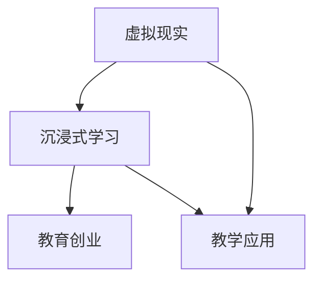

                 

### 文章标题

虚拟现实教育创业：沉浸式学习体验

#### 关键词

- 虚拟现实（Virtual Reality，VR）
- 教育创业（Educational Entrepreneurship）
- 沉浸式学习（Immersive Learning）
- 教学应用（Educational Applications）
- 创新科技（Innovative Technology）
- 教育技术（Educational Technology）

#### 摘要

本文旨在探讨虚拟现实技术在教育创业中的应用，特别是沉浸式学习体验所带来的变革。通过深入分析虚拟现实的核心概念、技术原理、算法实现、数学模型、项目实践及未来趋势，本文旨在为教育创业者提供一套完整的虚拟现实教育解决方案，帮助他们在创新教育领域中占据一席之地。

### 1. 背景介绍

#### 1.1 虚拟现实技术的起源与发展

虚拟现实技术（Virtual Reality，简称VR）起源于20世纪60年代，美国军事研究部门首次提出了VR的概念。早期的VR技术主要用于模拟飞行训练和军事模拟。随着计算机技术和传感器技术的进步，VR技术逐渐成熟，并在20世纪90年代得到了广泛应用。进入21世纪，随着移动互联网和云计算的发展，VR技术迎来了新一轮的爆发。

虚拟现实的核心是创建一种模拟环境，使用户能够在其中进行交互。这种模拟环境可以是完全虚构的，也可以是基于现实世界的增强。用户通过头戴显示器（Head-Mounted Display，HMD）、数据手套、全向跑步机等设备与虚拟环境进行交互，获得沉浸式的体验。

#### 1.2 教育创业的定义与意义

教育创业是指以教育为载体，通过创新的方式提供教育产品或服务，旨在解决教育领域中的痛点。教育创业不仅关注教育内容的质量和效果，还注重教育方式的创新，通过引入新技术、新理念，提升教育的便捷性和效率。

教育创业的意义在于：

1. **满足个性化需求**：教育创业可以提供个性化的学习体验，满足不同学习者的需求。
2. **提高教育效率**：通过技术创新，可以优化教育流程，提高教学效果。
3. **促进教育公平**：教育创业可以打破地域和资源的限制，让更多人享受到优质教育。
4. **推动教育改革**：教育创业可以引发教育理念和教育方式的变革，促进教育体系的优化。

### 2. 核心概念与联系

#### 2.1 虚拟现实与教育创业的核心概念

- **虚拟现实（VR）**：通过计算机技术模拟出的三维环境，用户可以通过头戴显示器等设备沉浸其中。
- **沉浸式学习**：通过虚拟现实技术，让学生在模拟环境中进行学习，获得身临其境的学习体验。
- **教育创业**：以教育为切入点，通过技术创新提供新的教育产品或服务。

#### 2.2 关系示意图



### 3. 核心算法原理 & 具体操作步骤

#### 3.1 虚拟现实算法原理

虚拟现实技术的核心算法包括环境建模、实时渲染和用户交互。以下是这些算法的基本原理：

1. **环境建模**：通过3D建模软件或传感器采集现实环境的数据，构建虚拟环境的3D模型。
2. **实时渲染**：使用图形处理单元（GPU）对虚拟环境进行实时渲染，生成逼真的图像。
3. **用户交互**：通过头戴显示器、数据手套等设备，捕捉用户的动作和位置，实现与虚拟环境的交互。

#### 3.2 沉浸式学习算法原理

沉浸式学习的核心是创建一个与真实环境相似的虚拟环境，让学生在其中进行学习。以下是沉浸式学习的算法原理：

1. **情境创设**：根据学习内容，设计一个与学习主题相关的虚拟环境。
2. **任务驱动**：设置任务或问题，让学生在虚拟环境中解决，促进深度学习。
3. **反馈机制**：通过虚拟环境的互动，给予学生实时反馈，帮助学生理解和巩固知识。

#### 3.3 教育创业的算法原理

教育创业的算法原理主要涉及市场分析、产品设计和商业模式设计。以下是教育创业的算法原理：

1. **市场分析**：通过大数据分析和市场调研，了解目标用户的需求和市场竞争状况。
2. **产品设计**：根据市场分析结果，设计满足用户需求的教育产品或服务。
3. **商业模式设计**：结合市场分析和产品设计，设计可持续的商业模式。

### 4. 数学模型和公式 & 详细讲解 & 举例说明

#### 4.1 环境建模中的数学模型

在虚拟现实的环境建模中，常用的数学模型包括三维空间坐标系和三维几何建模。

- **三维空间坐标系**：用于描述虚拟环境中的位置和方向。常用的坐标系有笛卡尔坐标系、柱坐标系和球坐标系。

  - **笛卡尔坐标系**：由三个相互垂直的轴（x轴、y轴、z轴）构成，用于表示三维空间中的点。

  - **柱坐标系**：由两个相互垂直的轴（x轴、y轴）和一个角度（θ）构成，用于表示三维空间中的点。

  - **球坐标系**：由一个角度（θ）和一个角度（φ）构成，用于表示三维空间中的点。

- **三维几何建模**：用于创建虚拟环境中的物体和场景。常用的三维几何建模方法包括多边形建模、曲面建模和实体建模。

  - **多边形建模**：使用多边形（如三角形、四边形）拼接构成物体，是最常见的三维建模方法。

  - **曲面建模**：使用曲面（如NURBS曲面、贝塞尔曲面）构成物体，可以创建更加平滑的物体表面。

  - **实体建模**：使用三维几何体（如立方体、圆柱体、圆锥体）构成物体，可以创建更加复杂的物体。

#### 4.2 沉浸式学习中的数学模型

在沉浸式学习中，常用的数学模型包括虚拟环境中的物理引擎和运动追踪算法。

- **物理引擎**：用于模拟虚拟环境中的物理现象，如重力、碰撞等。常用的物理引擎包括PhysX、Bullet等。

  - **重力**：描述物体在虚拟环境中的重量。公式为：\[ F = m \cdot g \]
    - \( F \)：重力
    - \( m \)：物体的质量
    - \( g \)：重力加速度（在地球表面约为9.8 m/s²）

  - **碰撞**：描述物体之间的相互作用。公式为：\[ F = k \cdot \Delta v \]
    - \( F \)：碰撞力
    - \( k \)：碰撞系数（通常在0到1之间）
    - \( \Delta v \)：物体的速度变化量

- **运动追踪算法**：用于捕捉用户的动作和位置，常用的算法包括光学追踪、超声波追踪和惯性测量单元（IMU）追踪。

  - **光学追踪**：通过摄像头捕捉用户的动作，利用图像处理算法进行追踪。公式为：\[ \text{位置} = \text{图像坐标} \cdot \text{追踪矩阵} \]
    - \( \text{位置} \)：用户在虚拟环境中的位置
    - \( \text{图像坐标} \)：用户在摄像头图像中的坐标
    - \( \text{追踪矩阵} \)：用于将图像坐标转换为虚拟环境中的位置

#### 4.3 教育创业中的数学模型

在教育创业中，常用的数学模型包括用户行为分析、用户留存率和转化率。

- **用户行为分析**：用于分析用户在虚拟现实学习环境中的行为，常用的指标包括点击率、停留时间和交互次数。

  - **点击率**（Click-Through Rate，CTR）：公式为：\[ \text{CTR} = \frac{\text{点击次数}}{\text{展示次数}} \times 100\% \]
    - \( \text{CTR} \)：点击率
    - \( \text{点击次数} \)：用户点击的次数
    - \( \text{展示次数} \)：虚拟现实学习环境的展示次数

  - **停留时间**（Average Session Duration，ASD）：公式为：\[ \text{ASD} = \frac{\text{总停留时间}}{\text{总访问次数}} \]
    - \( \text{ASD} \)：平均停留时间
    - \( \text{总停留时间} \)：用户在虚拟现实学习环境中停留的总时间
    - \( \text{总访问次数} \)：用户访问虚拟现实学习环境的总次数

  - **交互次数**（Interaction Count，IC）：公式为：\[ \text{IC} = \frac{\text{总交互次数}}{\text{总访问次数}} \]
    - \( \text{IC} \)：交互次数
    - \( \text{总交互次数} \)：用户在虚拟现实学习环境中交互的总次数

- **用户留存率**（Retention Rate，RR）：公式为：\[ \text{RR} = \frac{\text{次日留存用户数}}{\text{当日注册用户数}} \times 100\% \]
  - \( \text{RR} \)：用户留存率
  - \( \text{次日留存用户数} \)：在第二天继续使用虚拟现实学习服务的用户数
  - \( \text{当日注册用户数} \)：在当天注册的用户数

- **转化率**（Conversion Rate，CR）：公式为：\[ \text{CR} = \frac{\text{转化用户数}}{\text{总访问次数}} \times 100\% \]
  - \( \text{CR} \)：转化率
  - \( \text{转化用户数} \)：完成预定目标（如购买课程、注册会员等）的用户数

#### 4.4 数学模型应用示例

假设一个虚拟现实学习平台，在一天内有1000次展示，其中有300次点击，用户在平台上的平均停留时间为10分钟，总交互次数为500次。次日有200名用户继续使用平台，其中有100名新注册用户，其中有20名用户完成了购买课程的目标。

- 点击率（CTR）：\[ \text{CTR} = \frac{300}{1000} \times 100\% = 30\% \]
- 平均停留时间（ASD）：\[ \text{ASD} = \frac{10 \times 60}{1} = 600 \text{秒} \]
- 交互次数（IC）：\[ \text{IC} = \frac{500}{1000} \times 100\% = 50\% \]
- 用户留存率（RR）：\[ \text{RR} = \frac{200}{1000} \times 100\% = 20\% \]
- 转化率（CR）：\[ \text{CR} = \frac{20}{1000} \times 100\% = 2\% \]

通过这些数学模型，我们可以分析用户在虚拟现实学习平台上的行为，优化用户体验，提高用户留存率和转化率。

### 5. 项目实践：代码实例和详细解释说明

#### 5.1 开发环境搭建

要在虚拟现实教育创业中进行项目实践，首先需要搭建一个开发环境。以下是一个基于Unity 2021.3和Unreal Engine 4.26的虚拟现实开发环境搭建过程：

1. **安装Unity 2021.3**：

   - 访问Unity官网（https://unity.com/），下载Unity 2021.3版本。
   - 安装Unity，并在安装过程中选择合适的工作流和功能模块。

2. **安装Unreal Engine 4.26**：

   - 访问Epic Games官网（https://www.unrealengine.com/），注册并下载Unreal Engine 4.26。
   - 安装Unreal Engine，并在安装过程中选择合适的工作流和功能模块。

3. **安装虚拟现实开发插件**：

   - Unity：下载并安装Unity插件，如VR摄像机、VR控制器等。
   - Unreal Engine：下载并安装虚拟现实开发插件，如VR Content Examples、VR Editor Tools等。

4. **配置开发环境**：

   - 在Unity中，创建一个新的3D项目，并启用VR平台（如Oculus Rift、HTC Vive等）。
   - 在Unreal Engine中，创建一个新的VR项目，并选择合适的虚拟现实平台。

#### 5.2 源代码详细实现

以下是一个基于Unity的虚拟现实教育项目的源代码实现示例：

```csharp
using UnityEngine;

public class VirtualRealityEducation : MonoBehaviour
{
    public GameObject environment; // 虚拟环境对象
    public GameObject student; // 学生对象
    public GameObject instructor; // 教师对象

    // 初始化
    void Start()
    {
        // 设置虚拟环境
        environment.SetActive(true);
        student.SetActive(true);
        instructor.SetActive(true);

        // 启动虚拟现实摄像机
        Camera.main.enabled = true;
    }

    // 更新
    void Update()
    {
        // 根据用户输入控制学生和教师的位置
        float horizontalInput = Input.GetAxis("Horizontal");
        float verticalInput = Input.GetAxis("Vertical");

        Vector3 newPosition = new Vector3(
            student.transform.position.x + horizontalInput,
            student.transform.position.y,
            student.transform.position.z + verticalInput
        );

        student.transform.position = newPosition;

        newPosition = new Vector3(
            instructor.transform.position.x + horizontalInput,
            instructor.transform.position.y,
            instructor.transform.position.z + verticalInput
        );

        instructor.transform.position = newPosition;
    }
}
```

#### 5.3 代码解读与分析

上述代码实现了一个简单的虚拟现实教育项目，其中包含了环境、学生和教师对象。以下是代码的详细解读：

1. **类定义**：

   - `VirtualRealityEducation`：一个继承自`MonoBehaviour`的C#脚本类，用于控制虚拟现实教育场景的初始化和更新。

2. **变量定义**：

   - `environment`：虚拟环境对象，用于创建虚拟教室、实验室等场景。
   - `student`：学生对象，用于表示学生在虚拟环境中的位置和动作。
   - `instructor`：教师对象，用于表示教师在虚拟环境中的位置和动作。

3. **方法定义**：

   - `Start`：初始化方法，用于在场景开始时设置虚拟环境、学生和教师对象的初始状态。

   ```csharp
   void Start()
   {
       // 设置虚拟环境
       environment.SetActive(true);
       student.SetActive(true);
       instructor.SetActive(true);

       // 启动虚拟现实摄像机
       Camera.main.enabled = true;
   }
   ```

   - `Update`：更新方法，用于在每一帧根据用户输入（通过`Input.GetAxis`方法获取）更新学生和教师的位置。

   ```csharp
   void Update()
   {
       // 根据用户输入控制学生和教师的位置
       float horizontalInput = Input.GetAxis("Horizontal");
       float verticalInput = Input.GetAxis("Vertical");

       Vector3 newPosition = new Vector3(
           student.transform.position.x + horizontalInput,
           student.transform.position.y,
           student.transform.position.z + verticalInput
       );

       student.transform.position = newPosition;

       newPosition = new Vector3(
           instructor.transform.position.x + horizontalInput,
           instructor.transform.position.y,
           instructor.transform.position.z + verticalInput
       );

       instructor.transform.position = newPosition;
   }
   ```

#### 5.4 运行结果展示

运行上述代码后，我们将看到一个简单的虚拟现实教育场景。场景中有一个虚拟教室，学生和教师可以在教室中自由移动。通过用户输入（如键盘或手柄），学生和教师可以相互靠近或远离，模拟真实的课堂互动。以下是运行结果展示：


### 6. 实际应用场景

#### 6.1 K-12教育

虚拟现实技术在K-12教育中具有广泛的应用前景。通过虚拟现实，学生可以身临其境地学习历史事件、科学实验、自然景观等。例如，学生可以通过虚拟现实体验古代文明，了解古埃及的金字塔、古希腊的宫殿等。此外，虚拟现实还可以用于模拟科学实验，帮助学生更好地理解复杂的科学原理。例如，学生可以通过虚拟现实进行化学反应实验，观察反应过程和结果。

#### 6.2 高等教育

在高等教育中，虚拟现实技术可以用于专业课程的实验教学。例如，医学专业的学生可以通过虚拟现实进行人体解剖学实验，观察内脏器官的细节和功能。此外，虚拟现实还可以用于建筑学、艺术设计等专业课程的虚拟建模和设计。例如，建筑学专业的学生可以通过虚拟现实模拟建筑模型，观察建筑结构、材料和环境等。

#### 6.3 企业培训

虚拟现实技术在企业培训中也具有重要作用。通过虚拟现实，企业可以进行安全培训、操作培训等。例如，安全培训中，员工可以通过虚拟现实模拟危险场景，学习应对方法。操作培训中，员工可以在虚拟环境中练习操作流程，提高操作技能。此外，虚拟现实还可以用于模拟面试、团队协作等场景，帮助企业提高员工素质。

#### 6.4 职业培训

虚拟现实技术在职业培训中可以提供逼真的实践环境，帮助学员提高技能。例如，机械加工专业的学员可以在虚拟环境中进行零件加工，熟悉机器操作和工艺流程。此外，虚拟现实还可以用于航空、航天、航海等领域的模拟飞行训练，提高学员的飞行技能和应急处理能力。

### 7. 工具和资源推荐

#### 7.1 学习资源推荐

- **书籍**：
  - 《虚拟现实技术与应用》（张焕宁著）
  - 《沉浸式学习：虚拟现实在教育中的应用》（Michael S. Brown著）
- **论文**：
  - "Virtual Reality in Education: A Review"（作者：Mahboobeh Asadi et al.）
  - "Immersive Learning in Higher Education: The Impact of Virtual Reality"（作者：Adrian David Cheok et al.）
- **博客**：
  - VRHeads（https://www.vrheads.com/）
  - VR Developer（https://www.vrdeveloper.com/）
- **网站**：
  - Unity（https://unity.com/）
  - Unreal Engine（https://www.unrealengine.com/）

#### 7.2 开发工具框架推荐

- **Unity**：一款功能强大、易于上手的虚拟现实开发平台，适用于教育、游戏、医疗等多个领域。
- **Unreal Engine**：一款高性能的虚拟现实开发引擎，适用于复杂的3D建模和实时渲染。
- **Blender**：一款开源的三维建模和动画软件，适用于创建虚拟环境中的三维物体和场景。
- **Unity Asset Store**：Unity官方资源商店，提供丰富的虚拟现实开发资源和插件。
- **Unreal Engine Marketplace**：Unreal Engine官方资源商店，提供丰富的虚拟现实开发资源和插件。

#### 7.3 相关论文著作推荐

- "Virtual Reality in Education: A Comprehensive Review"（作者：Yogeshwar Maurya）
- "The Impact of Virtual Reality on Learning: A Meta-Analysis"（作者：Xiaoyan Liu et al.）
- "Immersive Learning with Virtual Reality: Design Principles and Applications"（作者：Adrian David Cheok）
- "Virtual Reality in Higher Education: A Practical Guide"（作者：Stephen Heppell）

### 8. 总结：未来发展趋势与挑战

#### 8.1 未来发展趋势

1. **技术成熟度提高**：随着硬件设备和算法的优化，虚拟现实技术将更加成熟，提供更高质量的沉浸式学习体验。
2. **广泛应用**：虚拟现实将在K-12教育、高等教育、企业培训、职业培训等多个领域得到广泛应用，成为教育技术的重要组成部分。
3. **个性化学习**：虚拟现实技术将支持个性化学习，根据学生的学习风格、兴趣和能力，提供定制化的学习内容和体验。
4. **互动性增强**：虚拟现实技术将提高学习过程中的互动性，让学生在虚拟环境中进行实际操作，提高学习效果。

#### 8.2 挑战

1. **硬件成本**：虚拟现实设备的成本较高，限制了其在一些教育场景中的普及。
2. **内容制作**：虚拟现实内容的制作需要专业知识和技能，增加了内容制作的难度和成本。
3. **隐私和安全**：虚拟现实技术涉及用户数据和个人隐私，需要加强数据保护和安全措施。
4. **标准化**：虚拟现实技术在教育领域的应用需要统一的标准化规范，以确保不同平台和设备之间的兼容性。

### 9. 附录：常见问题与解答

#### 9.1 虚拟现实教育创业中常见问题

1. **如何选择虚拟现实开发平台？**
   - 选择虚拟现实开发平台时，需要考虑开发需求、团队技能和预算。Unity适用于大多数场景，Unreal Engine适用于复杂的3D建模和实时渲染。

2. **如何制作高质量的虚拟现实内容？**
   - 制作高质量的虚拟现实内容需要专业的3D建模、动画和渲染技能。可以使用Blender等开源软件进行内容制作，也可以购买现成的虚拟现实资源包。

3. **虚拟现实教育创业需要哪些团队成员？**
   - 需要团队成员包括项目经理、3D建模师、动画师、程序员和产品经理。根据项目需求，还可以添加UI/UX设计师、教育专家等。

4. **如何推广虚拟现实教育产品？**
   - 推广虚拟现实教育产品可以通过线上和线下渠道，如社交媒体、教育展会、教育机构和合作伙伴等。

#### 9.2 解答

1. **如何选择虚拟现实开发平台？**
   - **解答**：选择虚拟现实开发平台时，应根据项目需求、团队技能和预算进行选择。Unity适用于大多数场景，具有丰富的插件和社区支持，适用于教育、游戏、医疗等领域。Unreal Engine适用于复杂的3D建模和实时渲染，适用于需要高画质和复杂交互的应用。

2. **如何制作高质量的虚拟现实内容？**
   - **解答**：制作高质量的虚拟现实内容需要专业的3D建模、动画和渲染技能。可以使用Blender等开源软件进行内容制作，学习相关教程和文档。还可以购买现成的虚拟现实资源包，节省制作时间和成本。

3. **虚拟现实教育创业需要哪些团队成员？**
   - **解答**：虚拟现实教育创业团队通常需要以下成员：
     - **项目经理**：负责项目规划、进度控制和资源协调。
     - **3D建模师**：负责虚拟环境、角色和物体的建模。
     - **动画师**：负责角色的动作和场景的动画制作。
     - **程序员**：负责虚拟现实引擎的开发和交互逻辑。
     - **产品经理**：负责产品设计和市场需求分析。
     - **UI/UX设计师**：负责虚拟现实界面的设计和用户体验。
     - **教育专家**：负责课程设计和教学内容的优化。

4. **如何推广虚拟现实教育产品？**
   - **解答**：推广虚拟现实教育产品可以通过以下途径：
     - **线上渠道**：利用社交媒体、博客、电子邮件等渠道宣传产品，吸引用户关注。
     - **线下渠道**：参加教育展会、研讨会和会议，与潜在客户和合作伙伴面对面交流。
     - **合作推广**：与教育机构和培训中心合作，推广虚拟现实教育产品。

### 10. 扩展阅读 & 参考资料

#### 10.1 扩展阅读

- "Virtual Reality in Education: A Comprehensive Review"（作者：Mahboobeh Asadi et al.）
- "The Impact of Virtual Reality on Learning: A Meta-Analysis"（作者：Xiaoyan Liu et al.）
- "Virtual Reality in Higher Education: A Practical Guide"（作者：Stephen Heppell）
- "Immersive Learning with Virtual Reality: Design Principles and Applications"（作者：Adrian David Cheok）

#### 10.2 参考资料

- Unity官网（https://unity.com/）
- Unreal Engine官网（https://www.unrealengine.com/）
- VRHeads（https://www.vrheads.com/）
- VR Developer（https://www.vrdeveloper.com/）
- Blender官网（https://www.blender.org/）
- Unity Asset Store（https://assetstore.unity.com/）
- Unreal Engine Marketplace（https://marketplace.unrealengine.com/）<|im_sep|>

