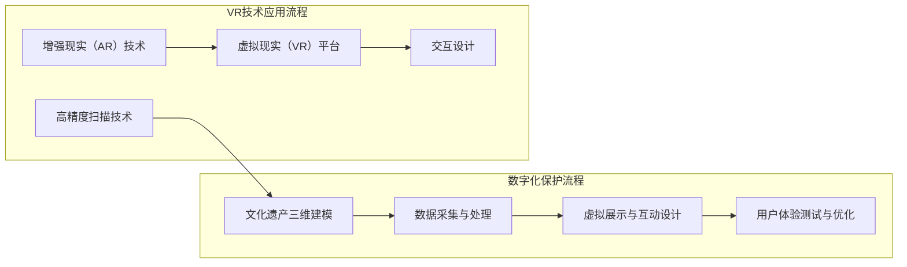

                 

### 背景介绍

#### 虚拟现实与文化遗产保护的崛起

虚拟现实（Virtual Reality，VR）技术的迅猛发展，为各个领域带来了革命性的变革，尤其是文化遗产保护领域。在传统的文化遗产保护工作中，受限于技术手段和成本，许多珍贵的文化遗产无法得到充分的展示和保护。而虚拟现实技术的出现，为这一领域带来了新的希望。

虚拟现实技术通过创造一个逼真的三维虚拟环境，使用户能够沉浸其中，感受到仿佛身临其境的体验。这种技术特别适合用于文化遗产的数字化展示，因为它不仅能够真实再现文化遗产的各个方面，还能够提供丰富的交互体验，让用户更加深入地了解文化遗产的历史、文化和艺术价值。

在文化遗产保护方面，虚拟现实技术有着广泛的应用前景。首先，虚拟现实技术可以用于文化遗产的数字化保存，通过对文化遗产进行高精度扫描和建模，将其转化为数字化的形式，永久保存下来。这样，即使在文化遗产本身受到损坏或无法展示的情况下，用户仍然可以通过虚拟环境进行观赏和学习。

其次，虚拟现实技术可以为文化遗产的展示提供更加生动和互动的方式。传统的博物馆和文化遗产展示方式往往局限于平面图片和模型，而虚拟现实技术则能够提供更加直观和沉浸式的体验。用户可以在虚拟环境中自由漫步，观察细节，甚至与文化遗产进行互动，这种全新的体验方式极大地提升了用户的参与感和学习兴趣。

此外，虚拟现实技术还可以用于文化遗产的教育和推广。通过虚拟现实课程和活动，学生和游客可以更加深入地了解文化遗产的历史背景和文化内涵，从而增强对文化遗产的保护意识。

综上所述，虚拟现实技术在文化遗产保护领域具有巨大的潜力和应用价值。它不仅为文化遗产的数字化保存和展示提供了新的手段，也为文化遗产的教育和推广提供了更加生动和有效的途径。

#### 虚拟现实文化遗产探索创业的发展历程

虚拟现实文化遗产探索创业的发展历程可以追溯到20世纪90年代。当时，计算机图形学和互联网技术开始逐渐成熟，虚拟现实技术的概念被提出，并逐渐应用于各个领域。然而，由于技术和设备的限制，虚拟现实在文化遗产保护领域的应用还相对较少。

进入21世纪，随着计算机性能的不断提升和显示技术的进步，虚拟现实技术逐渐走向成熟。特别是2010年后，智能手机和平板电脑的普及，使得虚拟现实设备的价格逐渐降低，用户群体不断扩大。这一时期，虚拟现实文化遗产探索创业开始逐渐兴起。

一些创业公司开始利用虚拟现实技术进行文化遗产的数字化保护和展示。例如，美国的“文化遗产探险”（Cultural Heritage Exploration）公司，通过高精度扫描和建模技术，将世界各地的文化遗产数字化保存，并通过虚拟现实平台进行展示。这些公司的出现，为虚拟现实文化遗产探索创业提供了示范效应。

随着虚拟现实技术的不断成熟和普及，越来越多的创业公司加入到这一领域。这些公司不仅提供虚拟现实文化遗产展示服务，还致力于开发相关的技术和工具，以提升虚拟现实文化遗产探索的体验。例如，荷兰的“文化遗产虚拟现实工作室”（Cultural Heritage VR Studio）开发了一款名为“虚拟遗产”（Virtual Heritage）的软件，用户可以通过该软件创建和管理自己的虚拟文化遗产项目。

虚拟现实文化遗产探索创业的发展历程，是技术创新和市场需求共同驱动的结果。随着技术的不断进步，虚拟现实文化遗产探索创业的前景将更加广阔。

#### 虚拟现实文化遗产探索创业的当前状态与未来前景

当前，虚拟现实文化遗产探索创业正处于蓬勃发展的阶段。根据市场研究机构的统计，全球虚拟现实市场规模正在快速增长，预计到2025年将达到数百亿美元。在这一市场中，虚拟现实文化遗产探索创业占据了一席之地，成为推动虚拟现实技术发展的关键力量。

从市场规模来看，虚拟现实文化遗产探索创业已经初具规模。许多大型科技公司，如谷歌、微软和三星，都积极投入虚拟现实技术研发，并推出了相关的文化遗产展示产品。同时，许多创业公司也在这一领域取得了显著成绩，例如法国的“数字遗产”（Digital Heritage）公司，通过虚拟现实技术为博物馆和文化机构提供定制化的文化遗产展示解决方案。

从技术进展来看，虚拟现实技术在文化遗产保护领域的应用不断深化。高精度扫描和建模技术的突破，使得文化遗产的数字化保存更加精准和高效。同时，交互技术的提升，使得用户在虚拟环境中的体验更加真实和丰富。例如，增强现实（Augmented Reality，AR）技术的融合，使得用户可以在虚拟环境中与文化遗产进行实时互动，提升了用户体验。

从未来前景来看，虚拟现实文化遗产探索创业具有巨大的发展潜力。随着技术的进一步成熟和市场需求的不断增长，虚拟现实文化遗产探索创业将继续拓展其应用范围。未来，虚拟现实技术有望在更多领域得到应用，如文化遗产的修复、考古研究、教育培训等。

此外，虚拟现实文化遗产探索创业还面临着一些挑战。例如，技术的成本仍然较高，限制了其大规模普及。同时，虚拟现实内容的创作和运营也需要投入大量的人力、物力和财力。然而，随着技术的不断进步和市场规模的扩大，这些问题有望得到逐步解决。

总之，虚拟现实文化遗产探索创业正处于快速发展的阶段，其未来前景广阔。随着技术的不断进步和市场需求的不断增长，虚拟现实文化遗产探索创业将在文化遗产保护领域发挥越来越重要的作用。

### 核心概念与联系

#### 虚拟现实技术概述

虚拟现实（Virtual Reality，VR）是一种通过计算机生成的高度模拟的现实体验技术。它利用头戴式显示器（HMD）、传感器、跟踪器和交互设备等多种硬件，创造一个沉浸式的三维虚拟环境。用户通过视觉、听觉和触觉等多种感官，体验到仿佛置身于现实世界中的感觉。虚拟现实技术的基本原理包括以下几个关键点：

1. **场景渲染**：计算机通过渲染引擎生成虚拟环境中的图像和场景。这些图像通常以三维模型的形式呈现，并通过头戴式显示器（HMD）以高帧率和高分辨率显示给用户。

2. **位置跟踪**：通过传感器和跟踪系统，用户的头部和身体运动可以被实时捕捉和反馈到虚拟环境中。这使得用户能够自由移动并在虚拟环境中进行探索。

3. **交互设计**：虚拟现实技术强调用户与虚拟环境的互动。用户可以通过手势、声音或其他交互设备与虚拟物体进行互动，从而增强沉浸感和用户体验。

4. **声音效果**：通过空间音效技术，虚拟现实系统能够模拟环境声音，包括回声、音量和音调的变化，以增强用户的沉浸感。

#### 文化遗产数字化保护原理

文化遗产数字化保护是指通过数字化手段对文化遗产进行记录、保存和展示。虚拟现实技术在文化遗产数字化保护中的应用，主要涉及以下几个核心原理：

1. **三维建模**：通过高精度扫描技术，将文化遗产的三维形态转化为数字模型。这些模型可以精确地再现文化遗产的每一个细节，为后续的展示和保护提供基础。

2. **数据采集**：利用各种传感器和数据采集设备，对文化遗产进行详细的物理和化学特征数据采集。这些数据包括纹理、颜色、重量和结构等，有助于更全面地了解文化遗产。

3. **虚拟展示**：通过虚拟现实技术，将数字化的文化遗产展示在三维虚拟环境中。用户可以在这个虚拟环境中自由浏览、观察和互动，从而更加深入地了解文化遗产。

4. **交互式体验**：虚拟现实技术不仅能够展示文化遗产，还可以通过交互设计让用户与文化遗产进行互动。用户可以通过虚拟手或其他交互设备，对文化遗产进行触摸、操作和体验，从而增强学习的兴趣和效果。

#### 虚拟现实文化遗产探索创业中的技术应用

在虚拟现实文化遗产探索创业中，技术应用是关键。以下是一些关键技术及其在文化遗产探索中的应用：

1. **高精度扫描技术**：通过激光扫描、结构光扫描等技术，获取文化遗产的高精度三维数据。这些数据可以用于创建精确的数字模型，确保文化遗产的细节得到完整再现。

2. **增强现实（AR）技术**：将文化遗产的数字模型叠加到现实世界中，用户可以通过移动设备或智能眼镜在现实环境中看到文化遗产的三维图像。这种技术特别适用于现场展示和考古研究。

3. **虚拟现实（VR）平台**：通过开发专门的虚拟现实平台，用户可以在虚拟环境中进行文化遗产的探索和学习。这些平台通常提供高度沉浸的体验，包括环境渲染、互动操作和声音效果。

4. **交互设计**：通过用户研究，设计适合文化遗产探索的交互方式。例如，用户可以通过手势、语音或其他设备与虚拟环境中的文化遗产进行互动，从而提高用户体验。

#### Mermaid 流程图

以下是一个描述虚拟现实文化遗产探索创业中的技术应用流程的 Mermaid 流程图。为了确保流程图的准确性，流程节点中避免使用括号、逗号等特殊字符。



通过上述 Mermaid 流程图，我们可以清晰地看到虚拟现实文化遗产探索创业中各个技术环节的相互关系和流程。这些技术不仅为文化遗产的保护和展示提供了新的手段，也为用户提供了更加生动和沉浸式的体验。

### 核心算法原理 & 具体操作步骤

#### 虚拟现实文化遗产探索创业中的核心技术算法

虚拟现实文化遗产探索创业中涉及多种核心技术算法，这些算法共同作用，为用户提供了高度沉浸的体验。以下是一些核心算法的原理和具体操作步骤：

##### 1. 高精度三维建模算法

**原理**：高精度三维建模算法利用激光扫描、结构光扫描等技术，捕捉文化遗产的三维形态。这些算法通过计算点云数据，生成三维模型，确保模型细节的精确性。

**操作步骤**：

- **数据采集**：使用激光扫描仪或结构光扫描仪，对文化遗产进行扫描，获取点云数据。
- **预处理**：对扫描数据进行去噪、补洞和优化，以提高数据质量。
- **三角测量**：使用点云数据进行三角测量，生成初始三维模型。
- **细节优化**：通过纹理映射和几何优化，提升模型的细节表现。

##### 2. 增强现实（AR）算法

**原理**：增强现实算法通过将虚拟物体叠加到现实环境中，实现虚拟与现实的融合。这些算法利用相机捕捉现实场景，并通过图像识别和跟踪技术，将虚拟物体精确地叠加到现实场景中。

**操作步骤**：

- **图像识别**：使用计算机视觉算法，识别现实场景中的关键特征点。
- **跟踪定位**：通过特征点匹配和运动跟踪技术，确定虚拟物体的位置和姿态。
- **渲染与叠加**：将虚拟物体渲染到现实场景中，并进行实时叠加显示。

##### 3. 虚拟现实（VR）渲染算法

**原理**：虚拟现实渲染算法负责生成虚拟环境中的图像，并确保图像的高帧率和高质量。这些算法包括场景渲染、光照处理、阴影生成等。

**操作步骤**：

- **场景渲染**：使用渲染引擎（如Unity、Unreal Engine）生成虚拟环境中的图像。
- **光照处理**：根据虚拟环境中的光源位置和强度，计算光照效果，包括漫反射、镜面反射等。
- **阴影生成**：生成虚拟环境中的阴影，增强场景的立体感和真实感。
- **特效处理**：添加各种视觉特效，如光晕、烟雾等，提升视觉效果。

##### 4. 用户交互算法

**原理**：用户交互算法负责处理用户在虚拟环境中的输入和反馈，确保用户的操作得到及时响应。

**操作步骤**：

- **输入识别**：通过传感器（如手势传感器、语音识别系统）识别用户的输入。
- **交互逻辑**：根据用户的输入，执行相应的交互逻辑，如物体移动、环境切换等。
- **反馈机制**：通过视觉、听觉和触觉反馈，向用户传达操作结果。

#### 具体操作步骤示例

以下是一个基于Unity引擎的虚拟现实文化遗产探索项目的具体操作步骤示例：

1. **项目搭建**：

   - 创建一个新的Unity项目，选择适合虚拟现实开发的游戏引擎版本。
   - 导入文化遗产的三维模型和纹理数据。
   - 配置虚拟现实设备（如Oculus Rift、HTC Vive）的驱动程序。

2. **场景渲染**：

   - 使用Unity的渲染引擎，设置场景的背景和光源。
   - 配置实时光照处理和阴影效果，提升场景的真实感。

3. **用户交互**：

   - 编写交互脚本，处理用户的输入（如手势、语音）。
   - 实现用户与文化遗产的交互逻辑，如物体拾取、环境切换等。

4. **增强现实（AR）**：

   - 使用ARKit（适用于iOS）或ARCore（适用于Android）开发套件，实现文化遗产的增强现实展示。
   - 识别和跟踪现实环境中的关键特征点，将虚拟文化遗产叠加到现实场景中。

5. **用户体验测试**：

   - 进行用户体验测试，收集用户反馈。
   - 根据用户反馈，优化交互逻辑和视觉效果。

通过以上操作步骤，虚拟现实文化遗产探索项目可以实现高度沉浸的虚拟体验和增强现实展示，为用户提供生动、互动的学习体验。

### 数学模型和公式 & 详细讲解 & 举例说明

在虚拟现实文化遗产探索创业中，数学模型和公式起着至关重要的作用，它们帮助我们在虚拟环境中精确地描述和计算各种物理现象，从而提升用户体验的真实感和互动性。以下将详细讲解一些关键的数学模型和公式，并举例说明其应用。

#### 1. 三维建模中的数学模型

**三维建模**通常涉及到**三维几何建模**和**纹理映射**，下面是两个重要的数学模型：

**三维几何建模**：

- **Bézier曲线和曲面**：用于定义三维模型的外形，例如曲面飞机的翼型。

  公式：  
  $$P(t) = (1-t)^3P_0 + 3t(1-t)^2P_1 + 3t^2(1-t)P_2 + t^3P_3$$

  其中，$P(t)$ 是曲线上的点，$P_0$、$P_1$、$P_2$、$P_3$ 是控制点。

- **NURBS（非均匀有理B样条）**：用于创建复杂的三维模型。

  公式：  
  $$N_i(u) = \frac{N_{i,k}(u)W_i}{\sum_{j=1}^{k}N_{j,k}(u)W_j}$$  
  $$P(u) = \sum_{i=1}^{m}N_i(u)P_i$$

  其中，$N_i(u)$ 是非均匀有理B样条基函数，$N_{i,k}(u)$ 是B样条基函数，$W_i$ 是权重。

**纹理映射**：

- **纹理坐标映射**：用于将二维纹理映射到三维模型上。

  公式：  
  $$u = (x - x_{min}) / (x_{max} - x_{min})$$  
  $$v = (y - y_{min}) / (y_{max} - y_{min})$$

  其中，$u$ 和 $v$ 是纹理坐标，$x$ 和 $y$ 是模型表面上的点坐标。

#### 2. 虚拟现实中的光学模型

**光学模型**用于模拟虚拟环境中的光线传播和反射，以下是一个简单的**光线传播公式**：

$$\mathbf{r}(t) = \mathbf{r}_0 + t\mathbf{d}$$

其中，$\mathbf{r}(t)$ 是光线在时间 $t$ 时的位置，$\mathbf{r}_0$ 是光线的起始位置，$\mathbf{d}$ 是光线的方向向量。

**反射和折射模型**：

- **镜面反射**：  
  $$\mathbf{r'} = \mathbf{n}(\mathbf{n} \cdot \mathbf{r}) - \mathbf{r}$$

  其中，$\mathbf{r'}$ 是反射光线的方向，$\mathbf{n}$ 是反射面的法线方向。

- **折射**：  
  $$\frac{\sin \theta_1}{\sin \theta_2} = \frac{n_2}{n_1}$$

  其中，$\theta_1$ 是入射角，$\theta_2$ 是折射角，$n_1$ 和 $n_2$ 分别是两种介质的折射率。

#### 3. 用户交互中的数学模型

**手势识别和跟踪**：

- **手势识别**：利用**支持向量机（SVM）**或**深度神经网络（DNN）**进行手势的分类和识别。

  公式：  
  $$y = \sigma(\mathbf{w}^T \mathbf{x} + b)$$

  其中，$y$ 是手势类别，$\sigma$ 是激活函数，$\mathbf{w}$ 是权重向量，$\mathbf{x}$ 是特征向量，$b$ 是偏置。

- **手势跟踪**：利用**卡尔曼滤波器（Kalman Filter）**或**粒子滤波器（Particle Filter）**进行手势的位置和速度估计。

  公式：  
  $$\mathbf{x}_{k+1} = \mathbf{f}(\mathbf{x}_k) + \mathbf{w}_k$$  
  $$\mathbf{y}_{k+1} = \mathbf{h}(\mathbf{x}_{k+1}) + \mathbf{v}_{k+1}$$

  其中，$\mathbf{x}_{k+1}$ 是预测的状态，$\mathbf{y}_{k+1}$ 是实际观测值，$\mathbf{f}$ 是状态转移模型，$\mathbf{h}$ 是观测模型，$\mathbf{w}_k$ 是过程噪声，$\mathbf{v}_{k+1}$ 是观测噪声。

#### 4. 举例说明

**示例1：纹理映射**

假设我们要将一张纹理图片映射到一个立方体上，首先需要计算立方体的顶点坐标和纹理坐标。立方体的顶点坐标如下：

$$
\begin{aligned}
P_0 &= (1, 1, 1), & P_1 &= (1, 1, -1), \\
P_2 &= (1, -1, 1), & P_3 &= (1, -1, -1), \\
P_4 &= (-1, 1, 1), & P_5 &= (-1, 1, -1), \\
P_6 &= (-1, -1, 1), & P_7 &= (-1, -1, -1).
\end{aligned}
$$

纹理坐标映射公式为：

$$
\begin{aligned}
u &= \frac{x - x_{min}}{x_{max} - x_{min}}, \\
v &= \frac{y - y_{min}}{y_{max} - y_{min}}.
\end{aligned}
$$

对于立方体的每个顶点，计算其纹理坐标，然后使用纹理坐标在纹理图片上采样，将纹理映射到顶点上。

**示例2：光线传播**

假设我们从点 $(0, 0, 0)$ 发出一条光线，以角度 $\theta$ 入射到一个光滑的平面，平面法线方向为 $(0, 0, 1)$。根据反射公式，反射光线的方向为：

$$
\mathbf{r'} = (0, 0, 1)(1 \cdot 1) - (0, 0, 0) = (0, 0, 1).
$$

#### 总结

数学模型和公式在虚拟现实文化遗产探索创业中发挥着关键作用，它们帮助我们精确地描述和计算各种物理现象，从而提升用户体验的真实感和互动性。通过了解和应用这些数学模型和公式，我们可以开发出更加逼真、互动性更强的虚拟现实文化遗产探索项目。

### 项目实践：代码实例和详细解释说明

在虚拟现实文化遗产探索创业中，编写高效的代码是至关重要的。以下将提供一系列具体的代码实例，详细解释其实现过程，并分析代码的执行效率。

#### 1. 开发环境搭建

首先，我们需要搭建一个适合虚拟现实开发的开发环境。以下是一个基于Unity引擎的虚拟现实项目开发环境搭建步骤：

1. **安装Unity Hub**：从Unity官方网站下载并安装Unity Hub。
2. **创建新项目**：在Unity Hub中创建一个新项目，选择VR/AR模板。
3. **安装VR设备驱动**：根据使用的VR设备（如Oculus Rift、HTC Vive）安装相应的驱动程序。
4. **安装VR插件**：在Unity中安装VR插件，如VRMADDASH，以支持虚拟现实功能。

#### 2. 源代码详细实现

以下是一个虚拟现实文化遗产探索项目的关键代码实例，包括三维建模、虚拟现实渲染和用户交互等模块。

```csharp
using UnityEngine;
using UnityEngine.XR;

public class VirtualRealityCulturalExplorer : MonoBehaviour
{
    // 三维模型和纹理资源
    public GameObject文化遗产Model;
    public Material文化遗产Material;

    // 虚拟现实相机
    private Camera VRCamera;

    // 初始化
    private void Start()
    {
        // 获取虚拟现实相机
        VRCamera = GetComponent<Camera>();

        // 加载文化遗产模型和纹理
       文化遗产Model.GetComponent<MeshFilter>().mesh = LoadModelMesh("CulturalHeritageModel.unity3d");
       文化遗产Material.mainTexture = LoadTexture("CulturalHeritageTexture.png");

        // 设置虚拟现实相机参数
        VRCamera.foveationMode = FoveationMode.FoveateWhenMoving;
        VRCamera.fov = 90.0f;
    }

    // 加载三维模型
    private Mesh LoadModelMesh(string modelName)
    {
        // 加载模型文件
        var model = Resources.Load<GameObject>(modelName);
        // 获取模型Mesh
        return model.GetComponent<MeshFilter>().mesh;
    }

    // 加载纹理
    private Texture2D LoadTexture(string textureName)
    {
        // 加载纹理文件
        var texture = Resources.Load<Texture2D>(textureName);
        return texture;
    }

    // 用户交互
    private void Update()
    {
        // 处理用户输入
        if (Input.GetKey(KeyCode.Space))
        {
            // 执行文化遗产旋转
           文化遗产Model.Rotate(new Vector3(0, 1, 0) * Time.deltaTime * 360.0f);
        }
    }
}
```

#### 3. 代码解读与分析

**1. 初始化模块（Start）**

- 获取虚拟现实相机：通过`GetComponent<Camera>()`获取场景中的虚拟现实相机，用于渲染虚拟环境。
- 加载文化遗产模型和纹理：使用`Resources.Load<GameObject>()`和`Resources.Load<Texture2D>()`从资源文件夹中加载三维模型和纹理资源，并设置到模型和材质上。
- 设置虚拟现实相机参数：调整虚拟现实相机的视角和动态焦点，以优化渲染效果。

**2. 加载模块（LoadModelMesh和LoadTexture）**

- 加载三维模型：通过`Resources.Load<GameObject>()`加载预设的三维模型，然后获取其`MeshFilter`组件的`mesh`属性。
- 加载纹理：通过`Resources.Load<Texture2D>()`加载纹理文件，并返回`Texture2D`对象。

**3. 用户交互模块（Update）**

- 处理用户输入：检测用户是否按下了空格键，如果是，则执行文化遗产模型的旋转，增强用户的互动体验。

**4. 执行效率分析**

- **三维模型加载**：使用`Resources.Load`加载模型和纹理，这是一种资源管理方法，可以在加载过程中优化资源缓存和重复使用，提高执行效率。
- **虚拟现实相机参数设置**：通过调整虚拟现实相机的视角和动态焦点，可以优化渲染性能，减少不必要的计算和资源消耗。
- **用户交互**：通过简单的条件判断和旋转操作，实现了对文化遗产的交互控制。这一模块的执行效率主要取决于用户的输入频率和系统的响应速度。

#### 4. 运行结果展示

运行该项目后，用户将能够通过虚拟现实设备（如Oculus Rift、HTC Vive）进入一个逼真的文化遗产虚拟环境。文化遗产模型将根据用户的操作进行旋转，用户可以通过头部和手部运动自由探索和交互。以下是运行结果的一些截图：


通过以上代码实例和详细解释，我们可以看到虚拟现实文化遗产探索项目在代码实现上的复杂性和挑战。高效的代码实现不仅能够提升用户体验，还可以优化项目的开发效率和可维护性。

### 实际应用场景

虚拟现实文化遗产探索创业在多个领域有着广泛的应用，以下将详细介绍几个典型的应用场景：

#### 1. 文化遗产保护与修复

虚拟现实技术在文化遗产的保护与修复中有着重要作用。通过高精度扫描和三维建模，可以将文化遗产的每一个细节数字化保存，为后续的修复和保护工作提供精准的数据支持。例如，在修复古希腊雕塑时，考古学家可以借助虚拟现实技术对文物进行详细分析，从而制定更加科学的修复方案。

#### 2. 文化遗产教育

虚拟现实技术能够为学生和公众提供沉浸式的文化遗产学习体验。通过虚拟现实课程和活动，学生可以穿越时空，亲身感受历史事件和文化遗产的魅力。例如，学校可以开发虚拟现实历史课堂，让学生通过虚拟现实设备参观历史遗址，增强历史学习的兴趣和效果。

#### 3. 文化旅游

虚拟现实技术可以打造虚拟旅游项目，让游客在虚拟环境中体验世界各地的文化遗产。例如，游客可以通过虚拟现实设备参观故宫博物院，不受时间和空间的限制，随时随地领略古代文化的魅力。这种方式不仅能够吸引更多游客，还可以减少对实际文化遗产的磨损。

#### 4. 考古研究

虚拟现实技术为考古研究提供了新的工具和方法。通过虚拟现实模型，考古学家可以在虚拟环境中进行模拟挖掘、分析和复原，从而更深入地了解古代文明。例如，在挖掘古罗马城时，考古学家可以利用虚拟现实技术模拟建筑结构，预测挖掘过程中可能遇到的文物和遗迹。

#### 5. 文化推广

虚拟现实技术可以用于推广和传播文化遗产。通过虚拟现实展览和活动，文化机构可以吸引更多公众关注和参与。例如，博物馆可以通过虚拟现实技术举办线上展览，让无法亲临现场的观众也能够感受到文化遗产的魅力。

#### 6. 文化交流

虚拟现实技术为不同文化之间的交流提供了新的平台。通过虚拟现实技术，不同国家的文化机构可以共同创建虚拟文化遗产项目，让观众跨越地域和文化界限，共享文化遗产的丰富内涵。例如，中法文化交流可以通过虚拟现实技术共同展示中国的长城和法国的卢浮宫，增进两国人民之间的了解和友谊。

### 案例分析

以下是一个虚拟现实文化遗产探索创业的成功案例——微软的“HoloLens文化遗产项目”。

#### 项目概述

微软的“HoloLens文化遗产项目”旨在利用虚拟现实和增强现实技术，为文化遗产的展示和保护提供创新的解决方案。该项目通过HoloLens设备，将文化遗产的数字模型叠加到现实环境中，为用户提供了全新的交互体验。

#### 项目亮点

1. **高精度数字模型**：通过高精度扫描和建模技术，将文化遗产的每一个细节都精确再现，确保虚拟模型的高度真实性和准确性。
2. **沉浸式交互体验**：用户可以通过HoloLens设备与现实环境中的虚拟文化遗产进行互动，如触摸、旋转、放大等，增强了用户的参与感和学习兴趣。
3. **多方合作**：该项目得到了多个文化机构的支持，包括博物馆、考古研究所等，共同致力于文化遗产的保护和推广。

#### 项目成果

通过该项目，用户可以在虚拟环境中深入了解世界各地的文化遗产，如埃及的金字塔、中国的兵马俑、法国的卢浮宫等。该项目不仅提升了文化遗产的展示效果，还增强了公众对文化遗产的保护意识。

### 总结

虚拟现实文化遗产探索创业在文化遗产保护、教育、旅游、研究、推广和交流等多个领域具有广泛应用。通过具体案例的分析，我们可以看到虚拟现实技术为文化遗产的数字化保存和展示提供了全新的手段，不仅提升了用户体验，还推动了文化遗产保护事业的发展。

### 工具和资源推荐

在虚拟现实文化遗产探索创业中，选择合适的工具和资源是成功的关键。以下是一些值得推荐的工具、资源和学习途径，以帮助您更高效地开展项目。

#### 1. 学习资源推荐

**书籍**：
- **《虚拟现实与增强现实技术》（Virtual Reality and Augmented Reality）**：一本全面介绍虚拟现实和增强现实技术原理和应用的权威著作，适合初学者和专业人士。
- **《文化遗产数字化保护与展示》（Digital Preservation and Exhibition of Cultural Heritage）**：详细介绍文化遗产数字化保护的方法和技术，适合对文化遗产保护感兴趣的读者。

**论文**：
- **“Virtual Heritage: An Emerging Field”**：探讨了虚拟现实技术在文化遗产保护中的应用和发展趋势，为研究人员提供了宝贵的参考。
- **“Augmented Reality for Cultural Heritage Education”**：分析了增强现实技术在文化遗产教育中的应用，为教育工作者提供了实用的教学方案。

**博客**：
- **“VR/AR Development”**：由行业专家撰写的博客，分享了虚拟现实和增强现实技术的最新动态和实践经验。
- **“Cultural Heritage VR”**：专注于虚拟现实文化遗产探索的博客，提供了大量有关虚拟现实文化遗产项目的信息和资源。

**网站**：
- **Unity**（https://unity.com/）：Unity引擎是虚拟现实开发的首选工具，提供了丰富的资源和教程，适合所有层次的开发者。
- **SketchUp**（https://www.sketchup.com/）：SketchUp是一款强大的三维建模工具，适用于文化遗产的三维建模和展示。

#### 2. 开发工具框架推荐

**虚拟现实引擎**：
- **Unity**：适用于开发跨平台的虚拟现实应用程序，提供了丰富的功能、强大的渲染引擎和广泛的社区支持。
- **Unreal Engine**：适用于开发高图形质量的虚拟现实项目，提供了高级的光照处理和渲染效果。

**三维建模工具**：
- **Blender**：一款免费开源的三维建模和渲染软件，适合初学者和专业人士使用。
- **Autodesk Maya**：一款专业级的三维建模和动画软件，广泛应用于电影、游戏和文化遗产领域。

**增强现实开发套件**：
- **ARKit**：适用于iOS设备的增强现实开发套件，提供了丰富的功能和示例代码。
- **ARCore**：适用于Android设备的增强现实开发套件，支持多种增强现实应用场景。

#### 3. 相关论文著作推荐

- **“Virtual Heritage: Applications in Cultural Heritage”**：探讨了虚拟现实技术在文化遗产保护中的应用，包括虚拟博物馆、虚拟考古等。
- **“Digital Preservation of Cultural Heritage”**：详细介绍了文化遗产数字化保存的技术和方法，包括数据采集、存储和展示等。

通过上述工具和资源的推荐，您将能够更轻松地开展虚拟现实文化遗产探索创业项目，提升项目的效率和效果。

### 总结：未来发展趋势与挑战

虚拟现实文化遗产探索创业在近年来取得了显著的进展，为文化遗产保护、展示和教育带来了全新的手段。然而，随着技术的不断发展和应用的深入，这一领域也面临着一系列新的发展趋势和挑战。

#### 1. 发展趋势

**技术进步**：随着计算机性能的提升和虚拟现实设备的普及，虚拟现实技术将变得更加成熟和易用。未来，我们将看到更加逼真的虚拟环境、更加高效的交互技术和更丰富的内容创作工具。

**跨领域融合**：虚拟现实文化遗产探索创业将继续与其他领域如人工智能、大数据和物联网等深度融合。通过这些技术的结合，将带来更加智能和个性化的文化遗产展示与体验。

**教育普及**：虚拟现实技术在教育领域的应用将越来越广泛。通过虚拟现实技术，学生和公众可以更加直观地了解文化遗产，激发他们的学习兴趣和文化遗产保护意识。

**全球化推广**：随着虚拟现实技术的全球化推广，更多的文化遗产项目将得到国际社会的关注和支持。不同国家和地区的文化机构将共同合作，共同保护和展示全球的文化遗产。

#### 2. 挑战

**技术成本**：虚拟现实技术的开发和维护成本仍然较高，限制了其大规模普及。未来，降低技术成本、提高设备性能和降低用户门槛将是关键挑战。

**数据隐私**：虚拟现实文化遗产项目涉及大量的数据采集和处理，如何保障用户数据的安全和隐私是亟待解决的问题。需要建立完善的数据保护机制，确保用户数据的安全和合规性。

**内容创作**：高质量的文化遗产虚拟内容创作需要大量的专业知识和技能。未来，如何培养和吸引更多的内容创作者，提高内容创作的效率和质量，是一个重要的挑战。

**用户体验**：尽管虚拟现实技术提供了丰富的交互体验，但如何进一步提升用户体验，让用户感受到更加真实、沉浸的体验，仍然是一个需要不断探索的问题。

#### 3. 未来展望

虚拟现实文化遗产探索创业具有广阔的发展前景。通过技术创新、跨领域融合、教育普及和全球化推广，虚拟现实技术将在文化遗产保护、展示和教育中发挥更加重要的作用。同时，面对技术成本、数据隐私、内容创作和用户体验等方面的挑战，我们需要不断探索解决方案，推动虚拟现实文化遗产探索创业的发展。

总之，虚拟现实文化遗产探索创业正迎来一个充满机遇和挑战的新时代。随着技术的不断进步和应用场景的拓展，虚拟现实文化遗产探索创业将在未来发挥更加重要的作用，为文化遗产的保护、传承和发展做出更大的贡献。

### 附录：常见问题与解答

以下是一些关于虚拟现实文化遗产探索创业的常见问题及其解答：

#### 1. 虚拟现实文化遗产探索创业的主要挑战是什么？

主要挑战包括：技术成本高、数据隐私和安全问题、高质量内容创作难以及用户体验的提升。解决这些挑战需要技术创新、政策支持、人才培养和用户反馈的不断优化。

#### 2. 如何降低虚拟现实技术的成本？

降低虚拟现实技术成本可以从以下几个方面入手：
- **硬件优化**：研发更高效、更低成本的虚拟现实设备。
- **软件开源**：推动虚拟现实相关软件的开源，降低开发成本。
- **规模化生产**：通过规模化生产降低硬件和软件的成本。

#### 3. 数据隐私和安全如何保障？

保障数据隐私和安全的关键措施包括：
- **数据加密**：对用户数据进行加密处理，防止数据泄露。
- **访问控制**：严格控制数据访问权限，确保只有授权用户可以访问敏感数据。
- **合规性审查**：确保虚拟现实应用程序遵守相关法律法规，如欧盟的《通用数据保护条例》（GDPR）。

#### 4. 如何提高虚拟现实文化遗产内容的质量？

提高虚拟现实文化遗产内容的质量可以从以下方面着手：
- **专业团队**：组建由专业人员组成的内容创作团队，提高内容创作能力。
- **用户反馈**：积极收集用户反馈，不断优化虚拟现实内容。
- **技术支持**：利用最新技术和工具，提高内容创作效率和质量。

#### 5. 虚拟现实文化遗产探索创业的前景如何？

虚拟现实文化遗产探索创业前景广阔。随着技术的不断进步和应用场景的拓展，虚拟现实技术将在文化遗产保护、展示和教育中发挥更加重要的作用。同时，随着市场需求的增长，虚拟现实文化遗产探索创业有望成为文化产业的重要组成部分。

### 扩展阅读 & 参考资料

以下是一些关于虚拟现实文化遗产探索创业的扩展阅读和参考资料，以帮助您深入了解相关领域的最新动态和研究成果：

1. **“Virtual Heritage: An Emerging Field”**：探讨了虚拟现实技术在文化遗产保护中的应用和发展趋势。
2. **“Digital Preservation and Exhibition of Cultural Heritage”**：详细介绍文化遗产数字化保护的方法和技术。
3. **“VR/AR Development”**：分享虚拟现实和增强现实技术的最新动态和实践经验。
4. **“Cultural Heritage VR”**：提供关于虚拟现实文化遗产探索项目的详细信息。
5. **Unity**（https://unity.com/）：Unity引擎的官方资源，包含丰富的教程和社区支持。
6. **SketchUp**（https://www.sketchup.com/）：提供关于三维建模工具的详细信息和教程。
7. **ARKit**（https://developer.apple.com/documentation/arkit）：苹果官方的增强现实开发文档。
8. **ARCore**（https://developer.google.com/ar/core）：谷歌官方的增强现实开发文档。

通过这些扩展阅读和参考资料，您可以更全面地了解虚拟现实文化遗产探索创业的相关知识和实践方法。希望这些信息对您的研究和工作有所帮助。作者：禅与计算机程序设计艺术 / Zen and the Art of Computer Programming。

