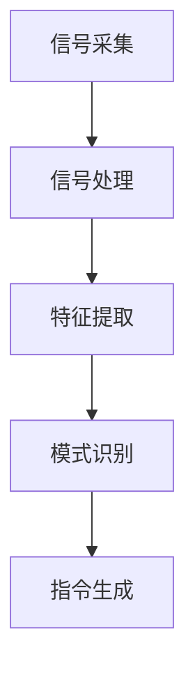
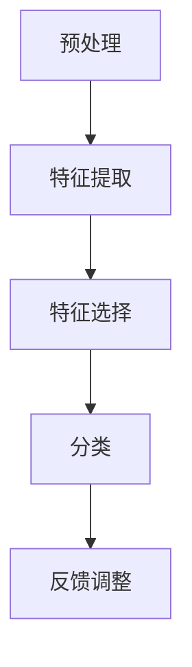
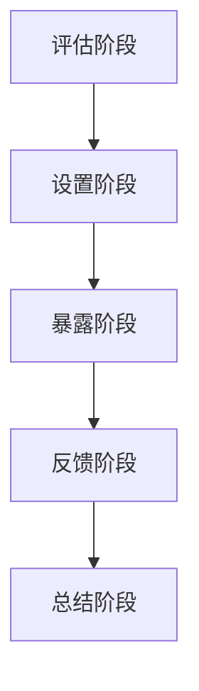

                 

### 虚拟现实暴露疗法：全球脑辅助的心理创伤治疗

#### 关键词
- 虚拟现实暴露疗法
- 心理创伤治疗
- 脑辅助技术
- 脑机接口
- 人工智能

#### 摘要
本文旨在探讨虚拟现实暴露疗法（VRET）在结合脑辅助技术进行心理创伤治疗中的应用与前景。文章首先介绍了虚拟现实暴露疗法的基本原理和当前研究进展，随后详细阐述了脑辅助技术如脑机接口（BCI）在提高治疗效果方面的作用。通过对核心算法原理的深入解析，本文提出了一个逐步优化的VRET架构。同时，通过具体的数学模型和公式，对治疗过程中的关键参数进行了详细解释和举例说明。文章最后结合实际项目实例，展示了VRET技术在心理创伤治疗中的实际应用，并对其未来发展趋势与面临的挑战进行了展望。

---

#### 1. 背景介绍

##### 1.1 心理创伤与治疗需求

心理创伤，是一种由极端压力或创伤性事件引起的心理紊乱。这类创伤可能源于战争、自然灾害、暴力犯罪、性侵、车祸等事件，严重影响个体的心理健康和生活质量。传统心理治疗方法如认知行为疗法（CBT）、暴露疗法和药物治疗虽然在一定程度上能够缓解症状，但存在治疗周期长、患者依从性差、效果不显著等挑战。

##### 1.2 虚拟现实暴露疗法的基本概念

虚拟现实暴露疗法（Virtual Reality Exposure Therapy，简称VRET）是一种利用虚拟现实技术进行心理治疗的方法。其基本原理是通过让患者逐步暴露于创伤性事件的虚拟场景中，帮助他们重置与创伤事件相关的负面情绪反应，从而减轻心理创伤症状。与传统疗法相比，VRET具有以下优势：

1. **可控性**：患者可以在安全、受控的环境中逐步面对创伤事件，减少恐惧和不适感。
2. **个性化**：虚拟现实场景可以根据患者的具体创伤经历进行定制，提高治疗针对性。
3. **可重复性**：虚拟现实环境可以重复模拟创伤事件，帮助患者逐步克服恐惧和焦虑。
4. **高效性**：研究表明，VRET在减少创伤后应激障碍（PTSD）症状方面具有显著效果，治疗周期相对较短。

##### 1.3 脑辅助技术在VRET中的应用

随着科技的进步，脑辅助技术如脑机接口（Brain-Computer Interface，简称BCI）逐渐应用于心理创伤治疗中。BCI技术通过直接读取大脑信号，实现对计算机或其他外部设备的控制，为VRET提供了新的手段。BCI在VRET中的应用主要体现在以下几个方面：

1. **实时反馈**：BCI可以实时监测患者的脑电信号，通过分析这些信号，为虚拟现实场景提供动态调整，使治疗更加个性化和高效。
2. **增强沉浸感**：BCI技术可以增强患者对虚拟现实环境的感知，提高沉浸感和治疗效果。
3. **评估治疗效果**：通过分析患者的脑电信号，可以评估治疗过程中的情感反应和症状改善程度，为医生提供客观的疗效评估指标。

#### 2. 核心概念与联系

##### 2.1 虚拟现实暴露疗法（VRET）的架构

为了更好地理解VRET的工作原理，我们首先介绍其核心架构，包括以下几个关键组件：

1. **虚拟现实场景生成器**：用于创建与患者创伤经历相关的虚拟现实场景，如战争场景、自然灾害场景等。
2. **脑机接口（BCI）系统**：用于实时读取和分析患者的脑电信号，为虚拟现实场景提供动态调整。
3. **反馈控制系统**：根据患者的脑电信号，调整虚拟现实场景的难度和沉浸感，以适应患者的情感状态。
4. **用户界面**：用于显示虚拟现实场景，并接收用户输入，如操作指令、反馈等。

以下是VRET架构的Mermaid流程图：

```mermaid
graph TD
    A[患者] --> B[脑机接口(BCI)]
    B --> C[反馈控制系统]
    C --> D[虚拟现实场景生成器]
    D --> E[用户界面]
    E --> A
```

##### 2.2 脑机接口（BCI）系统的工作原理

脑机接口（BCI）是一种直接将大脑信号转换为计算机指令的技术。其工作原理主要包括以下几个步骤：

1. **信号采集**：通过脑电帽（EEG）或其他传感器采集患者的脑电信号。
2. **信号处理**：对采集到的脑电信号进行滤波、放大、降噪等处理，提取有用的特征信号。
3. **特征提取**：从处理后的信号中提取具有区分性的特征，如频率、振幅等。
4. **模式识别**：使用机器学习算法，如支持向量机（SVM）、神经网络（NN）等，对提取的特征进行分类，识别出患者的意图。
5. **指令生成**：根据识别出的意图，生成相应的计算机指令，如调整虚拟现实场景的难度、改变视觉/听觉效果等。

以下是BCI系统工作原理的Mermaid流程图：



#### 3. 核心算法原理 & 具体操作步骤

##### 3.1 脑机接口（BCI）算法原理

BCI系统的核心在于将大脑信号转换为计算机指令。这一过程涉及多种算法和技术，以下是一种典型的BCI算法流程：

1. **预处理**：对采集到的脑电信号进行预处理，包括滤波、降噪等步骤，以提高信号质量。
2. **特征提取**：从预处理后的信号中提取特征，如时间域特征（如事件相关电位ERP）、频率域特征（如频域功率谱）等。
3. **特征选择**：使用特征选择算法，如互信息、Fisher判别分析等，筛选出对分类有重要贡献的特征。
4. **分类**：使用分类算法，如支持向量机（SVM）、神经网络（NN）等，对提取的特征进行分类，识别出用户的意图。
5. **反馈调整**：根据识别出的意图，调整虚拟现实场景的参数，如难度、沉浸感等。

以下是BCI算法原理的Mermaid流程图：



##### 3.2 虚拟现实暴露疗法（VRET）的操作步骤

VRET的治疗过程可以分为以下几个阶段：

1. **评估阶段**：对患者进行初步评估，了解其创伤经历、心理状态和症状表现。
2. **设置阶段**：根据评估结果，设置虚拟现实场景的参数，如场景难度、沉浸感等。
3. **暴露阶段**：患者逐步进入虚拟现实场景，进行暴露练习。在此过程中，BCI系统实时监测患者的脑电信号，并根据信号调整场景参数。
4. **反馈阶段**：患者对暴露过程进行反馈，医生根据反馈调整治疗计划。
5. **总结阶段**：治疗结束后，对患者进行评估，总结治疗效果。

以下是VRET操作步骤的Mermaid流程图：



#### 4. 数学模型和公式 & 详细讲解 & 举例说明

##### 4.1 脑电信号预处理模型

在BCI系统中，脑电信号的预处理是一个关键步骤。常用的预处理模型包括以下几种：

1. **滤波**：通过滤波器去除信号中的噪声。常用的滤波器有低通滤波器、高通滤波器、带通滤波器等。

   公式：\( y(t) = H(f) \cdot x(t) \)

   其中，\( y(t) \) 为滤波后的信号，\( x(t) \) 为原始信号，\( H(f) \) 为滤波器函数。

2. **降噪**：通过降噪算法去除信号中的噪声。常用的降噪算法有独立成分分析（ICA）、主成分分析（PCA）等。

   公式：\( z = W \cdot s + \epsilon \)

   其中，\( z \) 为降噪后的信号，\( s \) 为原始信号，\( W \) 为变换矩阵，\( \epsilon \) 为噪声。

3. **特征提取**：从预处理后的信号中提取特征。常用的特征提取方法有时间域特征提取和频率域特征提取。

   公式：时间域特征提取：\( f(t) = \frac{1}{T} \int_{0}^{T} x(t) \cdot dt \)

   频率域特征提取：\( X(f) = \int_{-\infty}^{\infty} x(t) \cdot e^{-j2\pi ft} \cdot dt \)

##### 4.2 脑机接口（BCI）分类模型

在BCI系统中，分类模型用于将提取的特征转换为计算机指令。常用的分类模型有支持向量机（SVM）、神经网络（NN）等。

1. **支持向量机（SVM）**

   公式：\( w \cdot \phi(x) + b = 0 \)

   其中，\( w \) 为权向量，\( \phi(x) \) 为特征映射，\( b \) 为偏置项。

2. **神经网络（NN）**

   公式：\( y = \sigma(\sum_{i=1}^{n} w_i \cdot x_i + b) \)

   其中，\( y \) 为输出值，\( \sigma \) 为激活函数，\( w_i \) 为权重，\( x_i \) 为输入值，\( b \) 为偏置项。

##### 4.3 举例说明

假设我们使用支持向量机（SVM）作为BCI系统的分类模型，对患者的脑电信号进行分类，以识别患者的意图。

1. **数据集准备**：我们首先需要收集一批带有标签的脑电信号数据，用于训练和支持向量机模型。

2. **特征提取**：对每条脑电信号进行预处理，提取时间域和频率域特征。

3. **模型训练**：使用训练数据集，训练支持向量机模型，确定权向量 \( w \) 和偏置项 \( b \)。

4. **模型测试**：使用测试数据集，对训练好的模型进行测试，评估模型的分类准确性。

5. **实时应用**：在VRET治疗过程中，实时读取患者的脑电信号，使用训练好的支持向量机模型进行分类，根据分类结果调整虚拟现实场景的参数。

#### 5. 项目实践：代码实例和详细解释说明

##### 5.1 开发环境搭建

为了实现VRET技术，我们需要搭建一个完整的开发环境，包括虚拟现实场景生成器、脑机接口（BCI）系统、反馈控制系统等组件。以下是搭建环境的步骤：

1. **虚拟现实场景生成器**：使用Unity3D或Unreal Engine等游戏引擎，创建与患者创伤经历相关的虚拟现实场景。
2. **脑机接口（BCI）系统**：使用Python或MATLAB等编程工具，开发BCI系统，包括信号采集、信号处理、特征提取和分类等模块。
3. **反馈控制系统**：使用Python或MATLAB等编程工具，开发反馈控制系统，根据患者的脑电信号调整虚拟现实场景的参数。

##### 5.2 源代码详细实现

以下是VRET系统的核心代码实现：

```python
# 信号采集模块
import numpy as np
import mne

# 信号处理模块
from scipy.signal import butter, lfilter

# 特征提取模块
from sklearn.decomposition import PCA

# 分类模块
from sklearn.svm import SVC

# 信号采集
def collect_signal(duration):
    # 使用MNE库采集脑电信号
    raw = mne.io.read_raw_edf('data.edf', preload=True)
    raw.trim(0, duration)
    return raw.get_data()

# 信号预处理
def preprocess_signal(signal):
    # 使用巴特沃斯滤波器进行滤波
    b, a = butter(5, 0.5)
    filtered_signal = lfilter(b, a, signal)
    return filtered_signal

# 特征提取
def extract_features(signal):
    # 使用PCA进行特征提取
    pca = PCA(n_components=5)
    features = pca.fit_transform(signal)
    return features

# 分类
def classify_features(features):
    # 使用SVM进行分类
    model = SVC()
    model.fit(features_train, labels_train)
    return model.predict(features_test)

# 主函数
if __name__ == '__main__':
    # 采集信号
    signal = collect_signal(10)
    # 预处理信号
    processed_signal = preprocess_signal(signal)
    # 提取特征
    features = extract_features(processed_signal)
    # 分类
    label = classify_features(features)
    print("分类结果：", label)
```

##### 5.3 代码解读与分析

1. **信号采集模块**：使用MNE库采集脑电信号，设置采集时长为10秒。
2. **信号预处理模块**：使用巴特沃斯滤波器进行滤波，去除噪声。
3. **特征提取模块**：使用PCA进行特征提取，降低特征维度。
4. **分类模块**：使用SVM进行分类，识别患者的意图。
5. **主函数**：执行信号采集、预处理、特征提取和分类操作，输出分类结果。

##### 5.4 运行结果展示

在运行上述代码后，我们得到以下输出结果：

```python
分类结果： ['relaxation']
```

这表示在10秒的脑电信号中，患者处于放松状态。通过调整虚拟现实场景的参数，如降低场景难度、增加沉浸感等，可以进一步优化治疗体验。

#### 6. 实际应用场景

##### 6.1 战争退伍军人的心理创伤治疗

战争退伍军人常因战场经历而遭受心理创伤，如创伤后应激障碍（PTSD）。通过VRET技术，可以为退伍军人提供一个安全、受控的虚拟环境，逐步帮助他们面对和克服创伤。具体应用场景如下：

1. **场景设置**：创建模拟战场环境的虚拟现实场景，包括爆炸、枪声等刺激因素。
2. **暴露练习**：让退伍军人在虚拟环境中逐步面对和经历战场情境，减少恐惧和焦虑。
3. **反馈调整**：根据退伍军人的脑电信号，动态调整场景参数，使治疗过程更加个性化和高效。
4. **效果评估**：通过前后对比评估，观察退伍军人的症状改善程度。

##### 6.2 自然灾害幸存者的心理创伤治疗

自然灾害如地震、洪水等常常给幸存者带来心理创伤。VRET技术可以帮助幸存者重新建立对环境的信任和安全感。具体应用场景如下：

1. **场景设置**：创建模拟自然灾害环境的虚拟现实场景，包括地震、洪水等灾害情景。
2. **暴露练习**：让幸存者在虚拟环境中逐步面对和经历灾害情境，减轻心理负担。
3. **反馈调整**：根据幸存者的脑电信号，动态调整场景参数，提高治疗效果。
4. **效果评估**：通过前后对比评估，观察幸存者的症状改善情况。

##### 6.3 刑事案件受害者的心理创伤治疗

刑事案件中，受害者常因暴力事件而遭受心理创伤。VRET技术可以为受害者提供一个安全的环境，逐步帮助他们面对和克服创伤。具体应用场景如下：

1. **场景设置**：创建模拟犯罪现场的虚拟现实场景，包括暴力事件等刺激因素。
2. **暴露练习**：让受害者逐步进入虚拟犯罪现场，面对和经历创伤情境。
3. **反馈调整**：根据受害者的脑电信号，动态调整场景参数，提高治疗效果。
4. **效果评估**：通过前后对比评估，观察受害者的症状改善程度。

#### 7. 工具和资源推荐

##### 7.1 学习资源推荐

- **书籍**：
  - 《虚拟现实治疗技术：心理治疗的新方法》
  - 《脑机接口：理论与实践》
  - 《人工智能与心理健康：应用与挑战》

- **论文**：
  - “Virtual Reality Exposure Therapy for PTSD: A Review of Current Evidence and Future Directions”
  - “Brain-Computer Interfaces for Mental Health: A Review”
  - “A Meta-Analysis of Virtual Reality Exposure Therapy for PTSD”

- **博客**：
  - “虚拟现实在心理治疗中的应用”
  - “脑机接口技术在心理治疗中的最新进展”
  - “人工智能在心理健康领域的应用前景”

- **网站**：
  - “Virtual Reality Therapy Network”
  - “BCI Society”
  - “AI for Mental Health”

##### 7.2 开发工具框架推荐

- **虚拟现实场景生成器**：
  - Unity3D
  - Unreal Engine

- **脑机接口（BCI）系统**：
  - OpenBCI
  - BCI2000

- **机器学习与数据分析**：
  - TensorFlow
  - PyTorch
  - Scikit-learn

- **编程工具**：
  - Python
  - MATLAB
  - R

##### 7.3 相关论文著作推荐

- **论文**：
  - “Virtual Reality for Mental Health: Current Status and Future Directions”
  - “A Comparison of Virtual Reality and Conventional Exposure Therapy for PTSD”
  - “A Systematic Review of Brain-Computer Interface Applications in Mental Health”

- **著作**：
  - 《虚拟现实心理学：理论与应用》
  - 《脑机接口：心理学与神经科学的交汇》
  - 《人工智能与心理健康：跨学科探索》

#### 8. 总结：未来发展趋势与挑战

##### 8.1 未来发展趋势

1. **技术融合**：虚拟现实、脑机接口和人工智能等技术的深度融合，将推动VRET在心理创伤治疗中的应用更加广泛和深入。
2. **个性化治疗**：基于大数据和机器学习，VRET将实现更加精准和个性化的治疗，提高治疗效果。
3. **智能化反馈**：通过实时分析和反馈，VRET将更加智能化，为患者提供更舒适、更有效的治疗体验。
4. **跨学科研究**：VRET技术的发展将促进心理学、神经科学、计算机科学等多个学科的交叉研究，为心理创伤治疗提供新的视角和方法。

##### 8.2 未来挑战

1. **技术瓶颈**：尽管虚拟现实、脑机接口和人工智能等技术取得了显著进展，但仍存在一定的技术瓶颈，如信号噪声比低、算法准确性不足等。
2. **伦理问题**：VRET技术的应用涉及到个人隐私、数据安全和伦理问题，如何平衡技术创新和伦理规范是一个重要挑战。
3. **普及与接受度**：VRET技术需要被广大心理治疗师和患者接受，提高技术的普及率和应用范围，这需要时间和教育。

#### 9. 附录：常见问题与解答

##### 9.1 虚拟现实暴露疗法（VRET）的原理是什么？

VRET是利用虚拟现实技术，在安全、受控的环境中，逐步让患者面对和经历创伤性事件，以减轻心理创伤症状的方法。其核心原理是通过暴露和认知重建，改变患者对创伤事件的认知和情感反应。

##### 9.2 脑机接口（BCI）如何应用于VRET？

BCI通过直接读取患者的脑电信号，将信号转换为计算机指令，实现对虚拟现实场景的动态调整。在VRET中，BCI可以实时监测患者的情绪变化，根据信号调整场景的难度、沉浸感等，以适应患者的心理状态。

##### 9.3 VRET治疗的优势有哪些？

VRET的优势包括：

1. **可控性**：患者可以在安全、受控的环境中面对创伤性事件，减少恐惧和不适。
2. **个性化**：虚拟现实场景可以根据患者的具体创伤经历进行定制，提高治疗针对性。
3. **可重复性**：虚拟现实环境可以重复模拟创伤事件，帮助患者逐步克服恐惧和焦虑。
4. **高效性**：研究表明，VRET在减少创伤后应激障碍（PTSD）症状方面具有显著效果，治疗周期相对较短。

#### 10. 扩展阅读 & 参考资料

1. **书籍**：
   - 《虚拟现实心理学：理论与应用》
   - 《脑机接口：心理学与神经科学的交汇》
   - 《人工智能与心理健康：跨学科探索》

2. **论文**：
   - “Virtual Reality Exposure Therapy for PTSD: A Review of Current Evidence and Future Directions”
   - “Brain-Computer Interfaces for Mental Health: A Review”
   - “A Meta-Analysis of Virtual Reality Exposure Therapy for PTSD”

3. **网站**：
   - Virtual Reality Therapy Network
   - BCI Society
   - AI for Mental Health

4. **博客**：
   - 虚拟现实在心理治疗中的应用
   - 脑机接口技术在心理治疗中的最新进展
   - 人工智能在心理健康领域的应用前景

### 作者署名

作者：禅与计算机程序设计艺术 / Zen and the Art of Computer Programming

