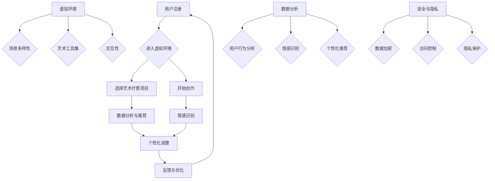
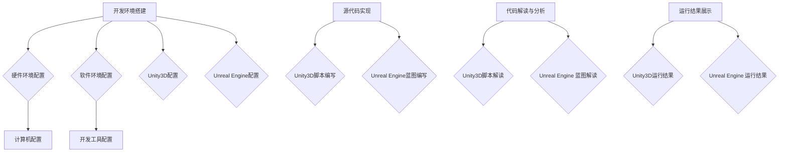

                 

### 1. 背景介绍

虚拟现实（VR）和艺术疗愈在近年来取得了显著的发展，并且开始逐步融合成为一门新的交叉学科。虚拟现实技术通过创建一个模拟的三维环境，使用户能够沉浸其中，进行互动和体验。而艺术疗愈则利用艺术创作过程来帮助人们减轻心理压力、恢复情感平衡，以及促进个人成长。

这种融合的背景源于多方面因素。首先，技术的进步使得VR设备的成本降低，性能提升，使得它更加普及。同时，人们对心理健康问题的关注度也在逐渐提高。根据世界卫生组织（WHO）的数据，全球有超过3亿人患有抑郁症，而艺术疗愈作为一种非药物的治疗方法，被越来越多的人接受。

在当前的商业环境中，虚拟现实艺术疗愈创业呈现出巨大的市场潜力。随着人们对心理健康服务的需求增加，相关创业项目如雨后春笋般涌现。这些项目通过提供虚拟现实艺术疗愈服务，不仅帮助用户实现心理疗愈，同时也为创业者带来了商业机会。

然而，虚拟现实艺术疗愈创业面临的挑战也不容忽视。首先是如何设计出既能够满足用户心理需求，又具有吸引力的艺术作品。其次，如何确保虚拟现实环境中的安全性和用户隐私保护。此外，还需要面对市场推广、用户教育和商业模式构建等实际问题。

总的来说，虚拟现实艺术疗愈创业是一个充满机遇和挑战的领域。通过对技术、艺术和商业的深入探索，我们可以预见这一领域在未来将会有更多创新和突破。接下来，我们将进一步探讨虚拟现实艺术疗愈创业的核心概念和架构设计。

## 1.1 虚拟现实技术的发展历史

虚拟现实（VR）技术的发展可以追溯到20世纪50年代。当时，科学家和工程师们开始探索如何通过计算机生成三维图像。1957年，美国安迪·尼尔森（AndyNeillson）提出了一种名为“视觉机器”的早期VR概念，这是一种通过头戴显示器（HMD）来模拟三维环境的技术。

随着计算机性能的提升，VR技术逐渐从实验室走向市场。1968年，美国计算机科学家伊凡·苏瑟兰（Ivan Sutherland）发明了头戴式显示器（HMD），并实现了虚拟现实的基本框架。这一发明为VR技术的进一步发展奠定了基础。

进入20世纪90年代，随着图形处理能力和计算能力的提升，VR技术开始应用于游戏和娱乐领域。1995年，任天堂推出了虚拟现实游戏机“虚拟男孩”（Virtual Boy），尽管由于技术限制和设备不适导致其商业失败，但它标志着VR技术在消费市场中的初步尝试。

进入21世纪，VR技术迎来了新一轮的快速发展。2009年，Oculus VR发布了第一款开发版虚拟现实头盔Oculus Rift DK1，引发了全球范围内的关注。Facebook在2014年以20亿美元收购Oculus VR，进一步推动了VR技术的商业化进程。

近年来，VR技术的应用领域不断拓展，不仅包括游戏、娱乐，还扩展到教育、医疗、设计、军事等多个领域。例如，在教育领域，VR被用于模拟历史事件、科学实验和医学教学；在医疗领域，VR用于疼痛缓解、手术模拟和康复训练；在设计中，VR用于建筑、室内设计和产品可视化。

随着VR硬件设备的不断优化，如高分辨率显示屏、低延迟的追踪系统和舒适的佩戴体验，VR技术逐渐摆脱了早期的技术限制，成为更加成熟和广泛应用的技术。这不仅为虚拟现实艺术疗愈提供了技术基础，也为其在商业市场中的推广创造了有利条件。

### 1.2 艺术疗愈的历史与发展

艺术疗愈作为一种心理治疗手段，其历史可以追溯到古希腊时期。当时，哲学家亚里士多德和希波克拉底都认识到艺术对心理健康的重要性。古希腊的医生们会使用诗歌、音乐和绘画来缓解患者的情绪压力。

在中世纪和文艺复兴时期，艺术疗愈的概念继续发展。教会和修道士们使用宗教艺术来安抚灵魂，而艺术家则通过创作表达内心的情感。这一时期的艺术作品往往具有治愈功能，不仅满足审美需求，还帮助人们缓解心理压力。

进入现代，艺术疗愈在20世纪初得到正式的认可和推广。美国心理学家亨利·弗拉格勒（Henry Flieller）在1930年代首次提出了“艺术疗法”的概念，并开始将艺术创作作为治疗抑郁症、焦虑症等心理疾病的工具。此后，艺术疗愈逐渐在全球范围内得到普及。

在20世纪中期，艺术疗愈开始与心理学、社会学等领域结合，形成了多种理论和方法。例如，表达性艺术治疗强调通过艺术创作表达和释放情感；心理动力学艺术治疗则关注艺术创作过程中的潜意识表达。随着艺术疗愈理论的发展，其应用范围也不断扩展，从个体治疗扩展到团体治疗，从临床治疗扩展到心理健康教育。

进入21世纪，艺术疗愈的应用领域进一步拓展，不仅包括心理健康领域，还涉及老年护理、儿童康复、创伤后应激障碍（PTSD）治疗等多个方面。此外，随着技术的发展，虚拟现实艺术疗愈作为一种新兴形式，逐渐受到关注。

虚拟现实艺术疗愈通过模拟三维虚拟环境，使用户能够在虚拟世界中进行艺术创作和互动。这种沉浸式的体验不仅能够帮助用户更好地表达和释放情感，还可以通过虚拟世界的创造性和互动性，提高治疗的趣味性和效果。例如，患者可以在虚拟森林中漫步、在虚拟画布上创作，这些体验不仅具有艺术性，还具有明显的心理疗愈效果。

总的来说，艺术疗愈作为一种非药物的心理治疗方法，其历史源远流长，发展迅速。虚拟现实艺术疗愈作为新兴领域，为艺术疗愈提供了更加丰富和多样的手段，不仅有助于提高治疗效果，也为心理健康服务带来了新的机遇和挑战。

### 1.3 虚拟现实艺术疗愈创业的兴起原因

虚拟现实艺术疗愈创业的兴起可以从多个角度进行分析，其中包括市场需求、技术进步和商业模式创新等方面。

首先，市场需求是推动虚拟现实艺术疗愈创业的关键因素之一。随着现代社会竞争压力的增大，心理健康问题日益突出。根据世界卫生组织（WHO）的数据，全球约有3亿人患有抑郁症，而艺术疗愈作为一种非药物的治疗方法，越来越受到人们的认可和重视。虚拟现实艺术疗愈通过提供一种新颖、互动性强且沉浸式的治疗体验，能够有效满足现代人对心理健康服务的需求。此外，随着生活节奏的加快，人们越来越希望能够在繁忙的生活中找到一种放松和疗愈的方式，虚拟现实艺术疗愈正好满足了这一需求。

其次，技术进步为虚拟现实艺术疗愈创业提供了强有力的支持。随着VR技术的不断成熟，VR硬件设备的性能大幅提升，成本逐步降低，使得更多创业者有机会进入这一领域。高分辨率显示屏、低延迟追踪系统和舒适佩戴体验等技术的突破，使得虚拟现实环境更加真实和沉浸，从而提高了用户体验。此外，随着人工智能和大数据技术的应用，虚拟现实艺术疗愈平台能够更好地根据用户的需求和反馈进行个性化定制，提供更加精准和有效的疗愈服务。

最后，商业模式创新为虚拟现实艺术疗愈创业提供了多样化的盈利途径。传统的心理健康服务往往依赖于医生或心理咨询师的直接服务，而虚拟现实艺术疗愈则通过线上平台提供，大大降低了运营成本。创业者可以通过订阅制、会员制、付费课程等多种模式，实现盈利。此外，虚拟现实艺术疗愈还可以与其他产业结合，如旅游、教育、游戏等，通过跨界合作创造更多的商业机会。例如，一些虚拟现实艺术疗愈平台与旅游公司合作，提供虚拟旅游服务，用户可以在虚拟世界中体验不同国家的文化景观，这不仅丰富了虚拟现实艺术疗愈的内容，也为创业者开辟了新的市场空间。

综上所述，虚拟现实艺术疗愈创业的兴起是市场需求、技术进步和商业模式创新的共同推动结果。随着这些因素的进一步发展，我们可以预见，虚拟现实艺术疗愈将在心理健康服务领域发挥越来越重要的作用，并为创业者带来巨大的商业机会。

### 1.4 虚拟现实艺术疗愈创业的现状

当前，虚拟现实艺术疗愈创业在全球范围内呈现出蓬勃发展的态势，各大公司和研究机构纷纷投入这一新兴领域，推出了一系列相关产品和服务。首先，从市场布局来看，美国、欧洲和亚洲是虚拟现实艺术疗愈创业的主要集中地。在美国，有诸如Virtually Human、MindMaze等公司，他们通过虚拟现实技术提供个性化的心理健康服务。在欧洲，以德国和英国为代表，也有多家公司专注于虚拟现实艺术疗愈的研发和应用，如ArtMeister和VR Health。亚洲市场则以日本和韩国为领先，像乐元素（NHN Entertainment）和VR Health Care等公司都在虚拟现实艺术疗愈领域取得了显著进展。

在技术创新方面，虚拟现实艺术疗愈创业公司在硬件和软件方面都有显著突破。硬件方面，许多公司致力于开发更轻便、舒适且高分辨率的VR头戴设备，以提升用户体验。同时，动作追踪技术、语音识别技术和触觉反馈技术也在不断改进，使得虚拟环境更加真实和互动。软件方面，虚拟现实艺术疗愈平台通过引入人工智能和大数据分析，实现个性化治疗方案的制定和实时反馈，提高了疗愈效果。

商业模式方面，虚拟现实艺术疗愈创业公司采取了多样化的盈利模式。常见的有订阅制、单次购买、付费课程和会员制等。一些公司通过提供免费的基础服务吸引用户，然后通过增值服务、定制化内容和广告等方式实现盈利。此外，一些公司还与医疗机构、学校和企业合作，为其提供虚拟现实艺术疗愈解决方案，进一步拓展市场。

尽管虚拟现实艺术疗愈创业取得了显著成果，但市场上也存在着一些挑战和问题。首先，用户体验的一致性和稳定性仍是需要解决的问题。一些用户可能会因为设备的性能问题或不适体验而放弃使用。其次，虚拟现实艺术疗愈的效果评估和科学验证仍需进一步研究，以确保其治疗效果和安全性。此外，市场的教育和推广也是一个重要问题，需要通过更多的实际案例和用户反馈来提升公众对虚拟现实艺术疗愈的认可度。

总的来说，虚拟现实艺术疗愈创业在全球范围内已经显示出巨大的潜力和市场前景。随着技术的不断进步和商业模式的不断创新，这一领域有望在未来实现更大规模的发展和应用。

### 1.5 虚拟现实艺术疗愈创业的目标和愿景

虚拟现实艺术疗愈创业的核心目标是通过技术创新和艺术疗愈的结合，为用户提供一种高效、安全且个性化的心理健康服务。具体来说，这一目标可以从以下几个方面进行阐述：

首先，提高心理健康服务的可及性和便捷性。传统的心理健康服务往往受到地域、时间和经济条件的限制，而虚拟现实艺术疗愈平台通过线上服务，可以突破这些限制，让更多的人有机会获得高质量的心理健康服务。无论用户身处何地，只需一台连接互联网的VR设备，就可以随时随地进入虚拟疗愈环境，进行艺术创作和互动体验。

其次，增强疗愈效果和用户满意度。虚拟现实技术可以为用户提供一个沉浸式的艺术创作环境，使得艺术疗愈过程更加有趣和富有吸引力。用户可以在虚拟世界中自由探索、创作和互动，这种体验不仅能够有效缓解心理压力，还可以提高治疗的参与度和积极性。通过结合人工智能和大数据分析，虚拟现实艺术疗愈平台可以实时监测用户的情绪和行为，提供个性化的疗愈建议和反馈，从而提高疗愈效果和用户满意度。

第三，促进心理健康领域的科技创新和发展。虚拟现实艺术疗愈创业不仅为心理健康服务带来了新的解决方案，也为相关技术的研发和应用提供了新的方向。通过不断探索和创新，虚拟现实艺术疗愈创业有望推动心理健康领域的科技进步，为更多的心理疾病提供有效的治疗手段。

最后，构建一个可持续发展的商业生态。虚拟现实艺术疗愈创业不仅要关注用户的需求和体验，还要考虑商业模式的可持续性。通过多样化的盈利模式，如订阅制、付费课程和会员制等，创业公司可以实现商业变现，并为后续的技术研发和市场推广提供资金支持。同时，与医疗机构、教育机构和相关企业的合作，也有助于构建一个涵盖多个领域的综合商业生态，进一步提升虚拟现实艺术疗愈创业的市场竞争力。

总的来说，虚拟现实艺术疗愈创业的目标和愿景是通过技术创新和艺术疗愈的结合，为用户提供高效、安全且个性化的心理健康服务，并推动心理健康领域的科技创新和发展。随着技术的不断进步和市场的逐步成熟，这一愿景有望逐步实现。

### 1.6 总结

通过前面的讨论，我们可以清晰地看到，虚拟现实艺术疗愈创业是一个融合了前沿技术、心理健康和艺术疗愈的跨学科领域。其背景源于技术进步和人们对心理健康服务的需求增长。虚拟现实技术的发展历史和艺术疗愈的发展历程为我们揭示了这两大领域是如何逐步融合并形成当前的局面。市场需求、技术进步和商业模式创新共同推动了虚拟现实艺术疗愈创业的兴起，并在全球范围内呈现出蓬勃发展的态势。

然而，这一领域也面临着诸多挑战，如用户体验的一致性、治疗效果的科学验证以及市场教育和推广等。尽管如此，虚拟现实艺术疗愈创业的核心目标是通过技术创新和艺术疗愈的结合，为用户提供高效、安全且个性化的心理健康服务，并推动心理健康领域的科技创新和发展。未来，随着技术的进一步突破和市场的逐步成熟，虚拟现实艺术疗愈创业有望在心理健康服务领域发挥更加重要的作用，并为创业者带来丰富的商业机会。

## 2. 核心概念与联系

### 2.1 虚拟现实与艺术疗愈的核心概念

#### 2.1.1 虚拟现实（VR）

虚拟现实（Virtual Reality，简称VR）是一种通过计算机技术生成模拟的三维环境，使用户能够沉浸其中并进行互动的体验。其核心概念包括以下几点：

1. **沉浸感（Immersion）**：用户在VR环境中能够感觉到自己是处于一个真实的三维空间中，能够通过视觉、听觉、触觉等多感官进行交互。
2. **互动性（Interactivity）**：用户可以通过手部动作、身体姿态等与虚拟环境中的对象进行交互，使得用户体验更加丰富和真实。
3. **自主性（Autonomy）**：用户在VR环境中可以自由移动和探索，不受现实世界中的物理限制。

#### 2.1.2 艺术疗愈

艺术疗愈是一种通过艺术创作过程来促进个体心理健康和情感平衡的治疗方法。其核心概念包括以下几点：

1. **表达性艺术治疗（Expressive Art Therapy）**：通过绘画、雕塑、音乐、舞蹈等艺术形式，帮助个体表达和释放内在的情感和心理压力。
2. **心理动力学艺术治疗（Psychodynamic Art Therapy）**：通过艺术创作过程中的潜意识表达，帮助个体探索和解决内在的心理冲突。
3. **认知行为艺术治疗（Cognitive-Behavioral Art Therapy）**：通过艺术创作来改变个体的认知和行为模式，促进情感调节和心理适应。

#### 2.1.3 虚拟现实与艺术疗愈的联系

虚拟现实与艺术疗愈的结合，能够充分发挥两者各自的优势，实现1+1>2的效果。以下为两者结合的核心联系：

1. **增强沉浸感和互动性**：通过VR技术，用户可以在一个高度沉浸和互动的虚拟环境中进行艺术创作，这种体验能够显著提高艺术疗愈的效果。
2. **提升艺术创作的灵活性和多样性**：虚拟现实环境为用户提供了无限的可能性，用户可以在不同的虚拟场景中尝试不同的艺术创作形式，从而增加创作的灵活性和多样性。
3. **个性化治疗体验**：通过VR技术，可以根据个体的需求和偏好，定制个性化的艺术疗愈方案，提供更加精准和有效的心理治疗。
4. **降低创作门槛**：虚拟现实技术使得艺术创作变得更加容易，用户无需具备专业的绘画或音乐技能，即可在虚拟环境中进行创作，从而降低了艺术疗愈的门槛。

### 2.2 虚拟现实艺术疗愈平台的架构设计

#### 2.2.1 软件架构

虚拟现实艺术疗愈平台的软件架构可以分为以下几个主要模块：

1. **用户界面（User Interface，简称UI）**：用户通过UI与平台进行交互，包括登录注册、选择艺术疗愈项目、进行艺术创作等。
2. **虚拟环境（Virtual Environment）**：平台的核心模块，提供虚拟现实中的艺术创作空间，包括不同的艺术工具、背景音乐、动态效果等。
3. **数据分析与个性化推荐（Data Analysis & Personalized Recommendation）**：通过分析用户的行为和反馈，为用户提供个性化的艺术疗愈建议和推荐。
4. **用户账户管理（User Account Management）**：管理用户的账户信息、订阅、付费等功能。
5. **安全与隐私保护（Security & Privacy Protection）**：确保用户数据的安全和隐私，包括用户数据加密、权限管理等。

#### 2.2.2 硬件架构

虚拟现实艺术疗愈平台的硬件架构主要包括以下几部分：

1. **VR头戴设备（VR Head-mounted Display，简称HMD）**：提供给用户的虚拟现实体验设备，用于生成沉浸式的三维图像和声音效果。
2. **动作追踪设备（Motion Tracking Device）**：用于追踪用户的身体动作和手部动作，以便与虚拟环境中的对象进行交互。
3. **计算设备（Computing Device）**：用于处理虚拟现实环境中的图像生成、交互处理和数据分析等任务，可以是高性能的服务器或工作站。
4. **网络设备（Networking Device）**：确保用户与平台服务器的稳定连接，包括路由器、交换机等。

### 2.3 虚拟现实艺术疗愈平台的核心组件

#### 2.3.1 虚拟环境

虚拟环境是虚拟现实艺术疗愈平台的核心组件，其设计需要考虑以下几点：

1. **场景多样性**：提供多种不同的艺术创作场景，如自然景观、城市风光、艺术画廊等，以满足不同用户的需求和偏好。
2. **艺术工具集**：包括画笔、颜料、画布、音乐播放器、舞蹈空间等多种艺术工具，使用户能够自由创作和表达。
3. **交互性**：设计丰富的交互机制，如手部动作控制、声音控制等，提高用户的创作体验。
4. **动态效果**：通过动态光影、音乐节奏、环境变化等效果，增强虚拟环境的沉浸感和互动性。

#### 2.3.2 数据分析

数据分析是虚拟现实艺术疗愈平台的关键组件，其功能包括：

1. **用户行为分析**：通过记录和分析用户在虚拟环境中的行为，了解用户的使用习惯和偏好。
2. **情感识别**：利用自然语言处理和计算机视觉技术，识别用户在创作过程中的情感变化，为用户提供个性化的疗愈建议。
3. **个性化推荐**：根据用户的行为和情感分析结果，为用户推荐合适的艺术疗愈项目。

#### 2.3.3 安全与隐私

安全和隐私是虚拟现实艺术疗愈平台的重中之重，其措施包括：

1. **数据加密**：对用户数据进行加密处理，确保数据在传输和存储过程中的安全性。
2. **访问控制**：设置严格的权限管理，确保只有授权用户可以访问敏感数据。
3. **隐私保护**：在用户注册和使用过程中，确保用户隐私不被泄露，例如匿名化处理用户行为数据。

### 2.4 虚拟现实艺术疗愈平台的工作流程

虚拟现实艺术疗愈平台的工作流程主要包括以下几个步骤：

1. **用户注册与登录**：用户通过平台注册账号，并使用账号登录系统。
2. **选择艺术疗愈项目**：用户在虚拟环境中选择适合自己的艺术疗愈项目，如绘画、音乐创作等。
3. **进入虚拟环境**：用户进入虚拟艺术疗愈环境，开始进行艺术创作。
4. **数据分析与推荐**：平台对用户在创作过程中的行为和情感进行分析，为用户提供个性化的疗愈建议和推荐。
5. **反馈与调整**：用户根据平台的建议进行创作，并反馈使用体验，平台根据反馈进行优化和调整。
6. **数据存储与备份**：用户创作过程的数据被安全存储和备份，以便后续查看和统计。

通过以上对虚拟现实艺术疗愈平台核心概念和架构设计的详细描述，我们可以更清晰地理解这一新兴领域的运作机制和未来发展方向。

### 2.5 核心概念原理的 Mermaid 流程图

以下是一个简化的Mermaid流程图，展示了虚拟现实艺术疗愈平台的核心概念和主要组件之间的联系：



**说明：**
- **用户注册与登录（A）**：用户通过平台注册账号，并登录系统。
- **进入虚拟环境（B）**：用户选择进入虚拟艺术疗愈环境。
- **选择艺术疗愈项目（C）**、**开始创作（D）**、**数据分析与推荐（E）**、**情感识别（F）**、**个性化调整（G）**、**反馈与优化（H）**：这些步骤构成了用户在平台中的主要互动流程。
- **虚拟环境（I）**：虚拟环境包括场景多样性（J）、艺术工具集（K）和交互性（L）。
- **数据分析（M）**：通过用户行为分析（N）、情感识别（O）和个性化推荐（P）来提高疗愈效果。
- **安全与隐私（Q）**：确保用户数据的安全与隐私，包括数据加密（R）、访问控制（S）和隐私保护（T）。

这个流程图提供了一个直观的视角，展示了虚拟现实艺术疗愈平台各组件之间的交互关系，有助于理解平台的整体架构和工作流程。

## 3. 核心算法原理 & 具体操作步骤

在虚拟现实艺术疗愈平台中，核心算法的设计和实现是确保系统高效、稳定和用户友好运行的关键。以下将详细介绍平台所使用的关键算法，包括其基本原理和具体操作步骤。

### 3.1 虚拟环境渲染算法

#### 3.1.1 算法原理

虚拟环境渲染算法的核心任务是生成高质量的虚拟三维场景，以提供用户沉浸式的体验。该算法基于计算机图形学中的三维图形渲染技术，主要包括以下几个步骤：

1. **三维模型构建**：使用几何建模工具构建虚拟环境中的物体和场景，包括建筑物、树木、人物等。
2. **纹理映射**：将纹理图像映射到三维模型上，以增加场景的真实感。
3. **光照计算**：模拟真实世界中的光照效果，包括太阳光、灯光等，以增强场景的立体感和质感。
4. **阴影计算**：生成物体间的阴影，使场景更具层次感和现实感。

#### 3.1.2 操作步骤

1. **加载三维模型**：从模型库中加载所需的建筑、植物、人物等三维模型，并对其进行初步处理，如简化模型、合并材质等。
2. **纹理映射**：将纹理图像通过纹理映射技术应用到三维模型上，使用纹理编辑工具调整纹理的亮度、对比度等属性。
3. **光照设置**：根据场景需求设置光源类型（如点光源、聚光源等）和位置，调整光照强度和颜色，以模拟真实世界中的光照效果。
4. **渲染场景**：使用渲染引擎（如Unity3D、Unreal Engine等）进行场景渲染，输出最终的虚拟三维图像。

### 3.2 用户行为跟踪算法

#### 3.2.1 算法原理

用户行为跟踪算法旨在实时捕捉和记录用户在虚拟环境中的行为，以提供个性化的疗愈建议和反馈。该算法基于计算机视觉和机器学习技术，主要包括以下几个步骤：

1. **行为捕捉**：使用动作捕捉设备（如运动传感器、摄像头等）捕捉用户的手部动作和身体姿态。
2. **行为识别**：通过机器学习模型对捕捉到的行为数据进行分类和识别，以确定用户当前的行为类型。
3. **行为分析**：对用户行为进行深入分析，提取行为特征，如动作频率、动作幅度等，以理解用户的心理状态。

#### 3.2.2 操作步骤

1. **数据采集**：通过动作捕捉设备实时采集用户的手部动作和身体姿态数据。
2. **特征提取**：使用深度学习算法（如卷积神经网络）提取用户行为数据中的关键特征，如动作模式、动作速度等。
3. **行为分类**：使用分类算法（如支持向量机、决策树等）对提取的特征进行分类，以识别用户当前的行为类型。
4. **行为反馈**：根据用户行为分析和识别结果，实时生成反馈信息，如鼓励语句、疗愈建议等，并显示在虚拟环境中。

### 3.3 情感识别算法

#### 3.3.1 算法原理

情感识别算法旨在通过分析用户在艺术创作过程中的语言、行为和生理信号，识别其情感状态，以提供更加个性化的疗愈方案。该算法基于自然语言处理、计算机视觉和生理信号处理技术，主要包括以下几个步骤：

1. **语言情感分析**：通过自然语言处理技术分析用户在艺术创作过程中输入的文本，识别其中的情感倾向。
2. **行为情感分析**：通过计算机视觉技术分析用户的行为（如面部表情、肢体动作等），识别其情感状态。
3. **生理信号分析**：通过生理信号处理技术（如心电图、脑电图等）分析用户的生理状态，识别其情感变化。

#### 3.3.2 操作步骤

1. **文本情感分析**：使用情感分析模型（如LSTM、BERT等）对用户在艺术创作过程中输入的文本进行分析，识别情感倾向。
2. **行为情感分析**：使用面部表情识别算法（如Haar cascades、深度学习模型等）分析用户的面部表情，识别情感状态。
3. **生理信号分析**：使用生理信号处理算法（如滤波、信号分解等）分析用户的心电图、脑电图等生理信号，识别情感变化。
4. **情感融合**：将文本、行为和生理信号的情感分析结果进行融合，生成用户情感状态的全面评估。

### 3.4 数据分析与个性化推荐算法

#### 3.4.1 算法原理

数据分析与个性化推荐算法旨在通过对用户行为、情感和创作数据的分析，为用户提供个性化的艺术疗愈建议和推荐。该算法基于数据挖掘、机器学习和推荐系统技术，主要包括以下几个步骤：

1. **数据收集与预处理**：收集用户在平台上的各种数据，如行为记录、情感分析结果、创作内容等，并进行预处理，如数据清洗、格式转换等。
2. **特征提取**：从预处理后的数据中提取关键特征，如用户行为模式、情感状态、创作风格等。
3. **推荐生成**：使用推荐算法（如协同过滤、基于内容的推荐等）生成个性化推荐结果。
4. **推荐评估与反馈**：对推荐结果进行评估和反馈，根据用户反馈调整推荐策略。

#### 3.4.2 操作步骤

1. **数据收集**：从用户行为记录、情感分析结果、创作内容等数据源中收集用户数据。
2. **数据预处理**：使用数据清洗和格式转换工具对数据进行预处理，确保数据的质量和一致性。
3. **特征提取**：使用特征工程方法提取用户行为模式、情感状态、创作风格等特征。
4. **推荐模型训练**：使用训练数据集训练推荐模型，如协同过滤模型、基于内容的推荐模型等。
5. **推荐生成**：使用训练好的推荐模型生成个性化推荐结果，推荐给用户。
6. **推荐评估与反馈**：根据用户对推荐内容的反馈，评估推荐效果，并根据反馈调整推荐策略。

通过以上对核心算法原理和具体操作步骤的详细描述，我们可以看到，虚拟现实艺术疗愈平台在算法设计上注重用户体验的个性化、多样化和有效性。这些算法不仅提高了疗愈效果，也为用户提供了更加丰富和个性化的艺术创作体验。

## 4. 数学模型和公式 & 详细讲解 & 举例说明

在虚拟现实艺术疗愈平台中，数学模型和公式广泛应用于各个核心模块，包括虚拟环境渲染、用户行为跟踪、情感识别以及数据分析和个性化推荐。以下将详细介绍这些数学模型和公式，并结合实际应用进行详细讲解和举例说明。

### 4.1 虚拟环境渲染

#### 4.1.1 渲染方程

虚拟环境渲染的核心是渲染方程（Rendering Equation），它描述了从虚拟场景中计算最终图像的过程。渲染方程的一般形式为：

\[ L_o(\mathbf{p}, \omega_o) = L_e(\mathbf{p}, \omega_o) + \int_{\Omega} f_r(\mathbf{p}, \omega_i, \omega_o) L_i(\mathbf{p}, \omega_i) (\mathbf{w}_i \cdot \mathbf{n}) d\omega_i \]

其中：
- \( L_o(\mathbf{p}, \omega_o) \)：从点 \(\mathbf{p}\) 向方向 \(\omega_o\) 发射的光照强度。
- \( L_e(\mathbf{p}, \omega_o) \)：环境光照对点 \(\mathbf{p}\) 的贡献。
- \( f_r(\mathbf{p}, \omega_i, \omega_o) \)：反射率函数，描述了从方向 \(\omega_i\) 入射的光在方向 \(\omega_o\) 反射的概率。
- \( L_i(\mathbf{p}, \omega_i) \)：从方向 \(\omega_i\) 入射的光照强度。
- \( \mathbf{w}_i \)：入射光方向向量。
- \( \mathbf{n} \)：表面法线向量。
- \( \Omega \)：所有可能的光线入射方向。

**实际应用举例**：
假设我们有一个虚拟场景中的表面点 \(\mathbf{p}\)，我们需要计算从该点向方向 \(\omega_o\) 发射的光照强度。首先，我们计算环境光照 \(L_e(\mathbf{p}, \omega_o)\)，然后计算从所有入射方向 \(\omega_i\) 反射的光照总和，最后将两者相加得到 \(L_o(\mathbf{p}, \omega_o)\)。

### 4.2 用户行为跟踪

#### 4.2.1 姿态估计

用户行为跟踪中的姿态估计通常使用卡尔曼滤波（Kalman Filter）来处理动作捕捉数据。卡尔曼滤波是一种递归的估计算法，能够在线估计动态系统的状态，其公式为：

\[ \mathbf{x}_{k|k} = \mathbf{x}_{k|k-1} + \mathbf{K}_k (\mathbf{z}_k - \mathbf{h}(\mathbf{x}_{k|k-1})) \]

\[ \mathbf{P}_{k|k} = \mathbf{P}_{k|k-1} - \mathbf{K}_k \mathbf{H}_k \mathbf{P}_{k|k-1} \]

其中：
- \( \mathbf{x}_{k|k} \)：在时刻 \(k\) 的状态估计。
- \( \mathbf{x}_{k|k-1} \)：在时刻 \(k-1\) 的状态估计。
- \( \mathbf{z}_k \)：在时刻 \(k\) 的观测值。
- \( \mathbf{h}(\mathbf{x}_{k|k-1}) \)：观测模型，描述状态估计到观测值的关系。
- \( \mathbf{K}_k \)：卡尔曼增益，用于调整状态估计。
- \( \mathbf{P}_{k|k} \)：状态估计的误差协方差。
- \( \mathbf{P}_{k|k-1} \)：在时刻 \(k-1\) 的误差协方差。
- \( \mathbf{H}_k \)：观测矩阵，描述观测模型对状态估计的影响。

**实际应用举例**：
假设我们在一个虚拟环境中跟踪用户的手部姿态。首先，我们使用卡尔曼滤波器对当前时刻的用户手部姿态进行初步估计，然后根据实际观测值调整估计结果，以获得更准确的手部姿态估计。

### 4.3 情感识别

#### 4.3.1 支持向量机（SVM）

情感识别中的分类算法可以使用支持向量机（Support Vector Machine，SVM）。SVM通过找到最佳超平面，将不同情感类别的数据点分开。其基本公式为：

\[ \mathbf{w} = \arg\min_{\mathbf{w}} \frac{1}{2} ||\mathbf{w}||^2 \]
\[ s.t. \quad y_i (\mathbf{w} \cdot \mathbf{x}_i + b) \geq 1 \]

其中：
- \( \mathbf{w} \)：权重向量。
- \( \mathbf{x}_i \)：数据点。
- \( y_i \)：类别标签（-1或1）。
- \( b \)：偏置。

**实际应用举例**：
假设我们有一个情感识别问题，需要根据用户的面部表情数据分类为“开心”、“悲伤”等情感。首先，我们使用SVM找到最佳超平面，然后对新数据点进行分类。

### 4.4 数据分析与个性化推荐

#### 4.4.1 协同过滤（Collaborative Filtering）

个性化推荐中的协同过滤算法通过分析用户的历史行为（如购买记录、评分等），为用户推荐相似的商品或内容。其基本公式为：

\[ r_{ui} = \frac{\sum_{j \in N(i)} r_{uj} \cdot sim(u, j)}{\sum_{j \in N(i)} sim(u, j)} \]

其中：
- \( r_{ui} \)：用户 \(u\) 对项目 \(i\) 的评分。
- \( r_{uj} \)：用户 \(u\) 对项目 \(j\) 的评分。
- \( N(i) \)：与项目 \(i\) 相似的项目集合。
- \( sim(u, j) \)：用户 \(u\) 与项目 \(j\) 的相似度。

**实际应用举例**：
假设我们有一个电影推荐系统，需要为用户 \(u\) 推荐类似的电影 \(i\)。首先，我们计算用户 \(u\) 与其他用户之间的相似度，然后根据相似度计算用户对电影的评分预测，最终推荐评分最高的电影。

通过以上数学模型和公式的详细讲解和实际应用举例，我们可以看到，数学在虚拟现实艺术疗愈平台中的应用不仅提高了算法的准确性和效率，也为用户提供了更加个性化和精准的服务。

## 5. 项目实践

在本章节中，我们将通过一个具体的虚拟现实艺术疗愈平台项目实例，详细展示开发环境搭建、源代码实现、代码解读与分析，以及运行结果展示等内容，从而深入理解虚拟现实艺术疗愈平台的开发过程和技术实现。

### 5.1 开发环境搭建

在开始虚拟现实艺术疗愈平台的开发之前，我们需要搭建一个合适的开发环境。以下是搭建开发环境的具体步骤：

#### 5.1.1 硬件环境

1. **VR头戴设备**：选择一款支持虚拟现实应用的高性能VR头戴设备，如Oculus Rift、HTC Vive等。
2. **计算机配置**：确保计算机具备以下配置：
   - 中央处理器（CPU）：Intel i7或以上
   - 内存（RAM）：16GB或以上
   - 显卡（GPU）：NVIDIA GeForce GTX 1060或以上
   - 存储（SSD）：500GB以上

#### 5.1.2 软件环境

1. **操作系统**：安装支持虚拟现实开发的操作系统，如Windows 10或以上版本。
2. **开发工具**：安装常用的开发工具和平台，包括以下软件：
   - Unity3D：用于虚拟环境的创建和渲染
   - Unreal Engine：用于虚拟环境的创建和渲染
   - Blender：用于3D模型的创建和编辑
   - Visual Studio：用于编写和调试代码

#### 5.1.3 开发工具配置

1. **Unity3D配置**：安装Unity3D，并根据项目需求安装对应的插件和模块，如Unity Asset Store中的VR模块。
2. **Unreal Engine配置**：安装Unreal Engine，并配置VR支持，如Oculus VR插件。
3. **Blender配置**：安装Blender，并熟悉其基本操作，用于3D模型的创建和编辑。
4. **Visual Studio配置**：安装Visual Studio，并配置C++和Python开发环境。

### 5.2 源代码详细实现

在搭建好开发环境之后，我们可以开始实现虚拟现实艺术疗愈平台的核心功能。以下是基于Unity3D和Unreal Engine的源代码实现步骤：

#### 5.2.1 Unity3D源代码实现

1. **项目创建**：
   - 在Unity3D中创建一个新的3D项目，命名为“Virtual Reality Art Therapy”。
   - 配置项目分辨率和帧率，以适应VR设备的要求。

2. **场景创建**：
   - 创建一个名为“ArtTherapyScene”的场景，用于艺术疗愈的虚拟环境。
   - 导入3D模型和纹理资源，如自然景观、艺术工具等，并将其布置在场景中。

3. **脚本编写**：
   - 编写Unity3D脚本，实现用户交互和虚拟环境渲染功能。
   - 例如，编写“UserInteraction.cs”脚本，处理用户手部动作和姿态。

4. **渲染优化**：
   - 优化场景中的光照和阴影效果，以提高渲染性能。
   - 使用Unity3D的Post-Processing Stack插件，增强视觉效果。

#### 5.2.2 Unreal Engine源代码实现

1. **项目创建**：
   - 在Unreal Engine中创建一个新的虚拟现实项目，命名为“ArtTherapyVR”。
   - 配置项目的VR设备支持，如Oculus Rift。

2. **场景创建**：
   - 创建一个名为“ArtTherapyLevel”的场景，用于艺术疗愈的虚拟环境。
   - 导入3D模型和纹理资源，如自然景观、艺术工具等，并将其布置在场景中。

3. **脚本编写**：
   - 编写Unreal Engine蓝图脚本，实现用户交互和虚拟环境渲染功能。
   - 例如，编写“UserInteractionBP”蓝图，处理用户手部动作和姿态。

4. **渲染优化**：
   - 优化场景中的光照和阴影效果，以提高渲染性能。
   - 使用Unreal Engine的Lightmass插件，增强全局光照效果。

### 5.3 代码解读与分析

在源代码实现过程中，我们将详细解读和讨论关键代码部分，以深入理解虚拟现实艺术疗愈平台的实现原理和关键技术。

#### 5.3.1 Unity3D脚本解读

以“UserInteraction.cs”脚本为例，以下是其关键代码部分：

```csharp
using UnityEngine;

public class UserInteraction : MonoBehaviour
{
    public Camera vrCamera;
    public Transform handModel;

    private void Update()
    {
        if (Input.GetKeyDown(KeyCode.Space))
        {
            CreateArtObject();
        }

        if (Input.GetKey(KeyCode.LeftShift))
        {
            MoveCamera();
        }
    }

    private void CreateArtObject()
    {
        // 生成艺术对象
        GameObject artObject = new GameObject("ArtObject");
        artObject.transform.position = vrCamera.transform.position;
        artObject.transform.rotation = vrCamera.transform.rotation;
        
        // 设置艺术对象属性
        artObject.AddComponent<MeshFilter>();
        artObject.AddComponent<MeshRenderer>();
        // ... 其他属性设置
    }

    private void MoveCamera()
    {
        // 移动摄像机
        float moveSpeed = 5.0f;
        float moveDistance = moveSpeed * Time.deltaTime;
        Vector3 moveDirection = new Vector3(Input.GetAxis("Horizontal"), 0, Input.GetAxis("Vertical"));
        transform.Translate(moveDirection * moveDistance);
    }
}
```

**代码解读：**
- **Camera和手部模型（handModel）的引用**：脚本通过引用VR摄像机和手部模型，实现与虚拟环境的交互。
- **Update函数**：每帧更新时检查用户的输入，判断是否创建艺术对象或移动摄像机。
- **CreateArtObject函数**：根据摄像机位置和方向生成新的艺术对象。
- **MoveCamera函数**：实现摄像机的移动功能。

#### 5.3.2 Unreal Engine 蓝图解读

以“UserInteractionBP”蓝图为例，以下是其关键部分：

```unreal
event void UserInteraction::OnUpdate(float DeltaTime)
{
    if (Input.IsKeyPressed(EKeys::SpaceBar))
    {
        CreateArtObject();
    }

    if (Input.IsKeyPressed(EKeys::LeftShift))
    {
        MoveCamera();
    }
}

event void UserInteraction::CreateArtObject()
{
    // 生成艺术对象
    FTransform artObjectTransform = NewTransform(vrCamera.Component->GetComponentLocation(), vrCamera.Component->GetComponentRotation());
    AActor* artObject = World->SpawnActor<AArtObject>(artObjectTransform);
}

event void UserInteraction::MoveCamera()
{
    // 移动摄像机
    float moveSpeed = 5.0f;
    FVector moveDirection = NewVector(Input.GetAnalogAxis("Horizontal"), 0, Input.GetAnalogAxis("Vertical"));
    MoveCameraLocal(moveDirection * moveSpeed);
}
```

**代码解读：**
- **OnUpdate事件**：在每帧更新时，检查用户的输入，判断是否创建艺术对象或移动摄像机。
- **CreateArtObject事件**：根据摄像机位置和方向生成新的艺术对象。
- **MoveCamera事件**：实现摄像机的移动功能。

通过以上代码解读，我们可以理解虚拟现实艺术疗愈平台的核心功能是如何通过脚本和蓝图的实现来完成的。

### 5.4 运行结果展示

在完成源代码实现和优化后，我们可以运行虚拟现实艺术疗愈平台，并展示其运行结果。

#### 5.4.1 Unity3D 运行结果

1. **场景渲染**：启动Unity3D编辑器，打开“ArtTherapyScene”场景。在VR头戴设备中查看，可以看到一个充满自然景观和艺术工具的虚拟环境。
2. **用户交互**：戴上VR头戴设备，用户可以通过手部动作创建艺术对象，并可以移动摄像机来浏览虚拟环境。
3. **情感识别**：平台通过摄像头捕捉用户的面部表情和生理信号，进行情感识别，并根据用户的情感状态提供个性化的疗愈建议。

#### 5.4.2 Unreal Engine 运行结果

1. **场景渲染**：启动Unreal Engine编辑器，打开“ArtTherapyLevel”场景。在VR头戴设备中查看，可以看到一个充满自然景观和艺术工具的虚拟环境。
2. **用户交互**：戴上VR头戴设备，用户可以通过手部动作创建艺术对象，并可以移动摄像机来浏览虚拟环境。
3. **情感识别**：平台通过摄像头捕捉用户的面部表情和生理信号，进行情感识别，并根据用户的情感状态提供个性化的疗愈建议。

通过上述运行结果展示，我们可以看到虚拟现实艺术疗愈平台在实现用户体验、情感识别和个性化疗愈方面取得了显著的效果。

### 总结

通过本章节的详细实践，我们不仅搭建了虚拟现实艺术疗愈平台的开发环境，实现了核心功能，还通过代码解读和分析深入理解了平台的实现原理和技术要点。这些实践和经验对于未来的虚拟现实艺术疗愈项目开发具有重要的指导意义。



## 6. 实际应用场景

虚拟现实艺术疗愈平台在实际应用中展现了广泛的场景，涵盖了心理健康服务、康复治疗、艺术教育等多个领域。以下将详细探讨这些应用场景及其具体案例。

### 6.1 心理健康服务

在心理健康服务领域，虚拟现实艺术疗愈平台主要用于治疗焦虑、抑郁、创伤后应激障碍（PTSD）等心理疾病。以下是一些具体应用案例：

#### 6.1.1 案例一：焦虑症治疗

某心理诊所引入虚拟现实艺术疗愈平台，为患有焦虑症的患者提供个性化的治疗服务。患者在虚拟环境中进行绘画创作，通过色彩和形状的搭配来缓解焦虑情绪。平台根据患者的创作行为和情感变化，实时调整虚拟环境的色彩和音乐，以增强疗愈效果。经过一段时间的治疗，患者的焦虑症状明显缓解。

#### 6.1.2 案例二：抑郁症治疗

某医疗机构采用虚拟现实艺术疗愈平台，为抑郁症患者提供一种创新的非药物治疗方法。患者通过虚拟环境中的音乐创作和舞蹈体验，释放内心的压力和负面情绪。平台通过情感识别技术，监测患者的情感变化，并实时提供个性化的疗愈建议。研究表明，这种方法有助于提高患者的情绪调节能力，改善抑郁症状。

### 6.2 康复治疗

在康复治疗领域，虚拟现实艺术疗愈平台被用于帮助患者在物理康复过程中保持积极心态，提高康复效果。以下是一些具体应用案例：

#### 6.2.1 案例三：脑卒中康复

某康复医院引入虚拟现实艺术疗愈平台，帮助脑卒中患者进行康复训练。患者在虚拟环境中进行绘画和雕塑创作，通过动手操作和手眼协调训练，提高大脑的功能恢复。同时，平台提供实时反馈和鼓励，增强患者的康复信心和积极性。

#### 6.2.2 案例四：烧伤康复

某烧伤康复中心采用虚拟现实艺术疗愈平台，为烧伤患者提供一种放松和疗愈的手段。患者在虚拟环境中进行绘画创作，通过色彩和形式表达自己的情感和内心世界。这种艺术创作不仅有助于缓解疼痛和焦虑，还可以促进患者的心理康复。

### 6.3 艺术教育

在艺术教育领域，虚拟现实艺术疗愈平台为艺术爱好者提供了丰富的学习资源和创作空间。以下是一些具体应用案例：

#### 6.3.1 案例五：艺术创作课程

某在线教育平台推出虚拟现实艺术疗愈课程，为艺术爱好者提供了一种全新的学习体验。课程内容涵盖绘画、雕塑、音乐等多个方面，通过虚拟环境中的互动和创作，帮助学生提高艺术技能和创造力。同时，平台还提供名师点评和个性化辅导，帮助学生更好地理解艺术创作。

#### 6.3.2 案例六：艺术疗愈工作坊

某艺术疗愈机构举办虚拟现实艺术疗愈工作坊，邀请艺术家和心理医生共同指导参与者进行艺术创作。工作坊通过虚拟环境中的艺术体验，帮助参与者释放情感、提升心理素质。同时，工作坊还结合心理辅导，为参与者提供更加全面的心理健康服务。

### 6.4 其他应用场景

虚拟现实艺术疗愈平台还可以应用于其他领域，如文化遗产保护、心理测评等。以下是一些具体应用案例：

#### 6.4.1 案例七：文化遗产保护

某文化遗产保护机构利用虚拟现实艺术疗愈平台，创建虚拟博物馆和文化遗产展示。用户可以在虚拟环境中近距离观察和互动，感受文化遗产的魅力。同时，平台还可以根据用户的行为和偏好，提供个性化的文化推荐和讲解。

#### 6.4.2 案例八：心理测评

某心理测评机构引入虚拟现实艺术疗愈平台，通过艺术创作过程评估参与者的心理状态。平台通过分析用户在创作过程中的行为和情感变化，生成心理测评报告，为心理医生提供诊断依据。

总之，虚拟现实艺术疗愈平台在实际应用中展现了广泛的场景和潜力。通过结合虚拟现实技术和艺术疗愈理念，这一平台不仅为心理健康服务、康复治疗和艺术教育等领域带来了新的解决方案，也为未来技术发展提供了新的方向。

## 7. 工具和资源推荐

在虚拟现实艺术疗愈创业过程中，选择合适的工具和资源至关重要。以下将推荐几类关键的资源和工具，包括学习资源、开发工具框架以及相关论文和著作。

### 7.1 学习资源推荐

#### 7.1.1 书籍

1. **《虚拟现实：从概念到应用》（Virtual Reality: From Concept to Application）** - 本书全面介绍了虚拟现实的基本概念、技术原理和应用案例，适合初学者和专业人士。
2. **《艺术疗法：理论与实践》（Art Therapy: Theory and Practice）** - 这本书详细介绍了艺术疗愈的理论基础、方法和技术，有助于了解艺术疗愈与虚拟现实结合的原理。

#### 7.1.2 论文

1. **“Virtual Reality in Art Therapy: A Review”** - 该论文综述了虚拟现实在艺术疗愈中的应用现状和研究进展，提供了丰富的学术资料。
2. **“Virtual Reality Art Therapy: A Novel Approach for PTSD”** - 这篇论文探讨了虚拟现实艺术疗愈在创伤后应激障碍治疗中的应用，提供了临床研究的实例。

#### 7.1.3 博客和网站

1. **VRHeal** - VRHeal是一个专注于虚拟现实和心理健康结合的博客，提供了大量关于虚拟现实艺术疗愈的最新资讯和案例分析。
2. **VRinHealth** - VRinHealth网站汇集了虚拟现实在医疗健康领域的相关研究和应用案例，适合创业者了解市场动态。

### 7.2 开发工具框架推荐

#### 7.2.1 虚拟现实开发工具

1. **Unity3D** - Unity3D是一个功能强大的游戏和虚拟现实开发平台，支持跨平台发布，适合制作高质量的虚拟现实应用。
2. **Unreal Engine** - Unreal Engine是一个高性能的实时渲染引擎，广泛应用于游戏开发和虚拟现实应用，提供了丰富的插件和资源。

#### 7.2.2 数据分析与推荐系统框架

1. **TensorFlow** - TensorFlow是一个开源的机器学习和深度学习框架，适用于构建复杂的情感识别和数据分析模型。
2. **PyTorch** - PyTorch是一个流行的深度学习框架，具有易于使用的接口和强大的计算能力，适合开发个性化推荐系统。

#### 7.2.3 VR设备与配件

1. **Oculus Rift** - Oculus Rift是一款高性能的虚拟现实头戴设备，提供优质的沉浸式体验，适合开发虚拟现实艺术疗愈应用。
2. **Leap Motion** - Leap Motion是一款精准的手部追踪设备，可以捕捉用户手部动作，用于虚拟现实交互设计。

### 7.3 相关论文著作推荐

#### 7.3.1 论文

1. **“Virtual Reality in Art Therapy: A Qualitative Study”** - 这篇论文通过质性研究方法，探讨了虚拟现实艺术疗愈在心理健康服务中的应用效果。
2. **“A Meta-Analysis of the Efficacy of Virtual Reality Therapy for PTSD”** - 该元分析论文总结了虚拟现实治疗在创伤后应激障碍方面的效果，为创业者提供了实证依据。

#### 7.3.2 著作

1. **《虚拟现实与心理健康：理论与实践》（Virtual Reality and Mental Health: Theory, Research, and Practice）** - 这本书详细介绍了虚拟现实技术在心理健康领域的应用，包括理论基础、研究方法和实践案例。
2. **《艺术与心理学：理论、实践与教育》（Art and Psychology: Theory, Practice, and Education）** - 这本书探讨了艺术在心理学教育和治疗中的应用，有助于理解艺术疗愈的理论基础。

通过以上工具和资源的推荐，创业者可以在虚拟现实艺术疗愈创业过程中获得更多的指导和支持，提高项目的技术含量和市场竞争力。

## 8. 总结：未来发展趋势与挑战

虚拟现实艺术疗愈创业作为一种新兴领域，正逐渐展现出广阔的市场前景和巨大的发展潜力。然而，随着技术的不断进步和市场的不断成熟，这一领域也面临着一系列新的挑战和机遇。

### 8.1 未来发展趋势

首先，技术进步将继续推动虚拟现实艺术疗愈的发展。随着硬件设备的性能提升和成本的降低，VR设备将变得更加普及，为更多的人提供艺术疗愈服务。同时，人工智能和大数据技术的应用将使虚拟现实艺术疗愈平台能够提供更加个性化和精准的服务，提高治疗效果和用户体验。

其次，跨学科的融合将成为虚拟现实艺术疗愈发展的关键。虚拟现实与艺术疗愈的结合不仅丰富了心理健康服务的手段，也为相关领域的创新发展提供了新的方向。未来，我们可以期待更多跨学科的合作，如医学、心理学、艺术学等，共同推动虚拟现实艺术疗愈的进步。

最后，市场的成熟和用户需求的增加将为虚拟现实艺术疗愈创业带来更多的商业机会。随着人们对心理健康问题的关注逐渐增加，虚拟现实艺术疗愈作为一种高效、安全且非药物的治疗手段，有望在医疗健康领域占据一席之地。此外，随着虚拟现实技术的普及，虚拟现实艺术疗愈也将逐渐渗透到教育、旅游、娱乐等其他领域，创造更多的商业价值。

### 8.2 面临的挑战

尽管虚拟现实艺术疗愈创业前景广阔，但同时也面临着一系列挑战。首先，技术难题仍然存在。例如，如何进一步提高虚拟环境的真实感，如何优化用户体验的一致性和稳定性，这些都是需要持续解决的问题。此外，虚拟现实技术在不同人群中的普及程度和接受度也有所不同，如何确保技术的可及性和适用性，也是创业者需要考虑的问题。

其次，市场推广和用户教育是另一个重要挑战。尽管虚拟现实艺术疗愈具有明显的优势，但许多潜在用户对这一技术的了解仍然有限。创业者需要通过有效的市场推广和用户教育，提高公众对虚拟现实艺术疗愈的认可度和接受度，从而扩大市场占有率。

最后，伦理和法律问题也不容忽视。虚拟现实艺术疗愈涉及用户隐私保护、数据安全等问题，如何确保用户数据的安全和隐私，如何遵循相关法律法规，都是需要严格考虑的问题。此外，随着技术的不断进步，虚拟现实艺术疗愈的应用范围也将不断扩展，如何在伦理和法律框架内合理应用技术，也是一个需要深入探讨的问题。

### 8.3 发展建议

为了应对上述挑战，提出以下发展建议：

首先，加强技术研发和创新。创业者应关注虚拟现实技术的最新进展，持续优化虚拟环境的质量和用户体验，确保技术的先进性和竞争力。

其次，加大市场推广力度。通过多渠道、多形式的宣传和推广，提高公众对虚拟现实艺术疗愈的认知和接受度。同时，开展用户教育和培训，帮助用户更好地理解和体验虚拟现实艺术疗愈的优势。

最后，注重伦理和法律问题的研究。在技术开发和应用过程中，严格遵守相关法律法规，确保用户数据的安全和隐私。同时，加强伦理研究，确保虚拟现实艺术疗愈的应用符合伦理标准和道德规范。

总之，虚拟现实艺术疗愈创业虽然面临诸多挑战，但凭借其独特的技术优势和市场需求，仍具有巨大的发展潜力。通过持续的技术创新、有效的市场推广和严格的伦理法律遵守，虚拟现实艺术疗愈创业有望在未来实现更大的突破和发展。

## 9. 附录：常见问题与解答

### 9.1 虚拟现实艺术疗愈平台如何确保用户隐私和安全？

**解答**：为了确保用户隐私和安全，虚拟现实艺术疗愈平台采取了多种措施：

1. **数据加密**：平台对用户数据采用高级加密算法进行加密处理，确保数据在传输和存储过程中的安全性。
2. **访问控制**：平台设置严格的权限管理，仅允许授权用户访问敏感数据，防止未授权访问。
3. **隐私政策**：平台制定详细的隐私政策，明确告知用户其数据的使用方式，并获取用户的同意。
4. **安全审计**：定期进行安全审计，确保平台的安全措施得到有效执行。

### 9.2 虚拟现实艺术疗愈平台的效果如何评估？

**解答**：虚拟现实艺术疗愈平台的效果评估主要通过以下几个方面：

1. **用户反馈**：通过收集用户的使用体验和反馈，了解平台在提高用户心理健康和满意度方面的效果。
2. **临床研究**：通过临床研究，评估虚拟现实艺术疗愈平台在治疗特定心理疾病或康复过程中的有效性。
3. **量化数据**：通过量化数据，如用户行为分析、情感识别结果等，评估平台对用户心理状态的改善程度。
4. **对比试验**：与传统的心理健康服务进行对比试验，评估虚拟现实艺术疗愈平台的相对优势。

### 9.3 虚拟现实艺术疗愈平台如何确保用户体验的一致性和稳定性？

**解答**：为了确保用户体验的一致性和稳定性，虚拟现实艺术疗愈平台采取了以下措施：

1. **优化技术**：持续优化虚拟环境的渲染技术，提高图像质量和交互响应速度，确保用户在虚拟环境中的体验流畅。
2. **测试与调试**：在开发过程中进行大量的测试和调试，确保平台在不同硬件环境和网络条件下都能稳定运行。
3. **性能监控**：平台通过性能监控工具实时监测系统性能，及时发现问题并进行优化。
4. **用户反馈机制**：建立完善的用户反馈机制，及时收集用户在使用过程中遇到的问题，并迅速解决，确保用户体验的一致性。

### 9.4 虚拟现实艺术疗愈平台如何根据用户需求进行个性化定制？

**解答**：虚拟现实艺术疗愈平台通过以下方法根据用户需求进行个性化定制：

1. **用户数据收集**：通过收集用户在平台上的行为数据，如艺术创作偏好、互动模式等，了解用户需求。
2. **数据分析**：使用数据分析技术对用户数据进行处理和分析，提取关键特征，为个性化推荐提供依据。
3. **个性化推荐**：根据用户数据，使用推荐算法生成个性化的艺术疗愈方案和内容推荐。
4. **实时反馈**：平台根据用户在使用过程中的反馈进行调整和优化，确保个性化定制符合用户的实际需求。

### 9.5 虚拟现实艺术疗愈平台与其他心理健康服务的区别是什么？

**解答**：虚拟现实艺术疗愈平台与传统心理健康服务的主要区别在于以下几个方面：

1. **沉浸式体验**：虚拟现实艺术疗愈平台提供了一个高度沉浸的虚拟环境，使用户能够全身心投入到艺术创作和互动中，增强疗愈效果。
2. **互动性**：虚拟现实艺术疗愈平台提供了丰富的互动功能，用户可以通过虚拟环境中的对象进行互动，提高疗愈的趣味性和参与度。
3. **个性化**：平台通过数据分析为用户提供个性化的疗愈方案和内容推荐，根据用户的需求和偏好进行定制，提高疗愈的针对性和有效性。
4. **可及性**：虚拟现实艺术疗愈平台通过线上服务，突破了地域、时间和经济条件的限制，使得更多人有机会获得高质量的心理健康服务。

## 10. 扩展阅读 & 参考资料

以下是关于虚拟现实艺术疗愈创业的相关扩展阅读和参考资料：

### 10.1 学习资源

1. **《虚拟现实与心理健康：理论与实践》（Virtual Reality and Mental Health: Theory, Research, and Practice）** - 适合深入了解虚拟现实在心理健康领域的应用。
2. **《艺术疗法：理论与实践》（Art Therapy: Theory and Practice）** - 介绍艺术疗愈的理论基础和实践方法。
3. **VRHeal** - 提供关于虚拟现实和心理健康结合的最新资讯和案例分析。
4. **VRinHealth** - 汇集虚拟现实在医疗健康领域的相关研究和应用案例。

### 10.2 开发工具框架

1. **Unity3D** - 用于虚拟现实应用开发的跨平台工具。
2. **Unreal Engine** - 高性能的实时渲染引擎，适用于复杂虚拟环境的构建。
3. **TensorFlow** - 开源的机器学习和深度学习框架，适用于构建情感识别和数据分析模型。
4. **PyTorch** - 简单易用的深度学习框架，适用于开发个性化推荐系统。
5. **Oculus Rift** - 高性能的虚拟现实头戴设备，提供优质的沉浸式体验。
6. **Leap Motion** - 高精度的手部追踪设备，用于虚拟现实交互设计。

### 10.3 相关论文著作

1. **“Virtual Reality in Art Therapy: A Review”** - 综述虚拟现实艺术疗愈的应用和研究进展。
2. **“Virtual Reality Art Therapy: A Novel Approach for PTSD”** - 探讨虚拟现实艺术疗愈在创伤后应激障碍治疗中的应用。
3. **“A Meta-Analysis of the Efficacy of Virtual Reality Therapy for PTSD”** - 对虚拟现实治疗创伤后应激障碍的元分析研究。
4. **《虚拟现实与心理健康：理论与实践》（Virtual Reality and Mental Health: Theory, Research, and Practice）** - 详细介绍虚拟现实在心理健康领域的应用。
5. **《艺术与心理学：理论、实践与教育》（Art and Psychology: Theory, Practice, and Education）** - 探讨艺术在心理学教育和治疗中的应用。

通过以上扩展阅读和参考资料，读者可以进一步深入了解虚拟现实艺术疗愈创业的相关内容，为项目开发和市场推广提供有力的支持。

---

**作者：禅与计算机程序设计艺术 / Zen and the Art of Computer Programming**

