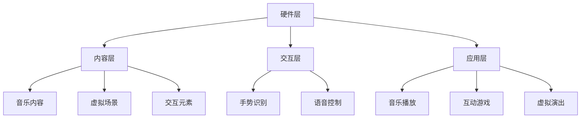

                 

虚拟现实（VR）技术在近年来取得了显著的进步，为各行各业带来了革命性的变化。音乐产业也不例外，虚拟现实音乐会正逐渐成为一种新的娱乐消费模式。本文将探讨虚拟现实音乐会的创业机会，包括其沉浸式音乐体验、技术挑战以及未来的发展方向。

## 关键词

- 虚拟现实
- 音乐产业
- 沉浸式体验
- 技术创业
- 创新应用

## 摘要

本文通过分析虚拟现实音乐会的发展现状，探讨了其在音乐产业中的创业机会。文章首先介绍了虚拟现实音乐会的概念，然后分析了沉浸式音乐体验的技术原理。接着，讨论了创业过程中面临的技术挑战和商业模式设计。最后，对未来虚拟现实音乐产业的发展趋势进行了展望。

## 1. 背景介绍

### 虚拟现实音乐会的兴起

虚拟现实音乐会是一种利用虚拟现实技术为观众提供沉浸式音乐体验的新型音乐演出形式。与传统音乐会相比，虚拟现实音乐会让观众能够“走进”音乐现场，获得更真实、更亲密的听觉和视觉体验。这种体验不仅限于观看，观众还可以与音乐人和现场环境进行互动，极大地提升了观众的参与感。

虚拟现实音乐会的兴起得益于以下几个因素：

1. **技术进步**：硬件设备的性能提升和价格的降低，使得虚拟现实技术的普及成为可能。
2. **用户需求**：随着人们对个性化、沉浸式体验需求的增加，虚拟现实音乐会满足了这一需求。
3. **市场潜力**：虚拟现实音乐会的市场潜力巨大，尤其是对于无法亲临现场的音乐爱好者来说，是一种全新的音乐消费方式。

### 虚拟现实技术的基本原理

虚拟现实技术主要通过以下三个基本组成部分实现沉浸式体验：

1. **头戴式显示器（HMD）**：头戴式显示器是虚拟现实的核心设备，它通过遮挡现实视野，呈现一个完全虚拟的环境。高质量的头戴式显示器能够提供逼真的视觉效果，减少视觉失真。
2. **位置追踪技术**：位置追踪技术用于检测用户在虚拟环境中的位置和移动，确保虚拟环境的动态响应与用户的动作保持同步。
3. **音频技术**：虚拟现实中的音频技术通过头戴式耳机提供空间化的声音效果，使得观众能够感受到来自四面八方的声音，增强沉浸感。

### 市场现状

目前，虚拟现实音乐会已在多个国家和地区举办，包括美国、日本、中国等地。一些知名的乐队和音乐制作人，如Maroon 5、Ed Sheeran等，已经尝试了虚拟现实音乐会，并获得了良好的反响。

虚拟现实音乐会的市场规模也在不断扩大。根据市场研究机构的预测，到2025年，全球虚拟现实市场规模将达到数百亿美元，其中音乐领域将成为重要的一部分。

## 2. 核心概念与联系

### 虚拟现实音乐体验的架构

虚拟现实音乐体验的架构可以分为四个主要层次：硬件层、内容层、交互层和应用层。

**硬件层**：包括头戴式显示器、位置追踪器和音频设备等，这些硬件为用户提供沉浸式的视觉和听觉体验。

**内容层**：包括音乐内容、虚拟场景和交互元素等，这是虚拟现实音乐体验的核心。高质量的音频和视频内容是沉浸体验的基础。

**交互层**：涉及用户与虚拟环境的交互方式，包括手势识别、语音控制等。交互层的质量直接影响用户体验的流畅度和自然度。

**应用层**：包括音乐播放、互动游戏、虚拟演出等具体应用场景。应用层的设计需要考虑用户体验和商业模式的可行性。

### Mermaid 流程图



### 虚拟现实音乐体验的原理

虚拟现实音乐体验的实现依赖于以下几个核心概念：

1. **3D 音频**：通过头戴式耳机提供空间化的音频效果，使得观众能够感受到来自四面八方的声音。
2. **视觉融合**：使用高质量的显示器呈现逼真的虚拟场景，减少视觉失真，提升沉浸感。
3. **实时渲染**：利用高性能计算设备实时渲染虚拟场景和音频效果，确保观众能够获得流畅的体验。
4. **交互设计**：设计用户友好的交互方式，使得观众能够自然地与虚拟环境进行互动，增强参与感。

### 虚拟现实音乐会与AR/VR技术的区别

虚拟现实音乐会主要依赖于VR技术，而增强现实（AR）音乐会则结合了VR和AR技术。VR技术通过完全虚拟的场景将观众带入音乐现场，而AR技术则将虚拟元素叠加在现实世界中，为观众提供更为丰富的互动体验。

## 3. 核心算法原理 & 具体操作步骤

### 3.1 算法原理概述

虚拟现实音乐会中，核心算法主要包括音频处理、图像渲染和交互管理。

1. **音频处理**：通过3D音效技术实现空间化的声音效果，使观众感受到真实的音乐现场氛围。
2. **图像渲染**：利用实时渲染技术生成高质量的虚拟场景，确保视觉效果的逼真性。
3. **交互管理**：设计用户友好的交互方式，实现观众与虚拟环境的自然互动。

### 3.2 算法步骤详解

#### 3.2.1 音频处理

1. **声音源定位**：根据用户的位置和运动轨迹，计算声音源的定位，实现空间化的声音效果。
2. **音频混音**：将多个音频源进行混音，生成最终的音频信号。
3. **音频渲染**：利用头戴式耳机播放混音后的音频信号，提供逼真的声音体验。

#### 3.2.2 图像渲染

1. **场景构建**：根据音乐内容构建虚拟场景，包括音乐表演者、观众、道具等。
2. **实时渲染**：利用高性能计算设备实时渲染虚拟场景，生成高质量的图像。
3. **视觉融合**：将渲染的图像与真实视野进行融合，呈现逼真的虚拟场景。

#### 3.2.3 交互管理

1. **手势识别**：利用计算机视觉技术识别用户的手势，实现与虚拟环境的交互。
2. **语音控制**：通过语音识别技术实现用户与虚拟环境的语音交互。
3. **交互反馈**：根据用户的交互动作，实时调整虚拟环境的响应，提供流畅的交互体验。

### 3.3 算法优缺点

**优点**：

- 提供沉浸式的音乐体验，增强观众的参与感。
- 结合多种交互方式，提高用户的互动性。
- 通过实时渲染和音频处理，实现高质量的音画效果。

**缺点**：

- 技术门槛较高，需要专业的开发团队和设备。
- 市场推广难度较大，需要长期的用户教育和市场培育。
- 受限于硬件设备性能，用户体验可能受到一定影响。

### 3.4 算法应用领域

虚拟现实音乐体验算法的应用领域主要包括：

1. **音乐会演出**：为音乐会提供沉浸式的现场体验，提升观众满意度。
2. **音乐教育**：通过虚拟现实技术，为音乐学习者提供逼真的学习场景。
3. **娱乐游戏**：结合虚拟现实技术，开发音乐主题的娱乐游戏，丰富用户娱乐体验。

## 4. 数学模型和公式 & 详细讲解 & 举例说明

### 4.1 数学模型构建

虚拟现实音乐会中的数学模型主要包括音频处理模型和图像渲染模型。

#### 音频处理模型

音频处理模型的核心在于实现3D音效，其数学模型如下：

$$
x(t) = A \cdot \text{sin}(2\pi f_0 t + \phi)
$$

其中，$x(t)$为音频信号，$A$为振幅，$f_0$为频率，$\phi$为相位。

#### 图像渲染模型

图像渲染模型的核心在于实现实时渲染，其数学模型如下：

$$
I(x, y) = f(R(x, y), G(x, y), B(x, y))
$$

其中，$I(x, y)$为渲染后的图像，$R(x, y)$、$G(x, y)$、$B(x, y)$分别为图像的红色、绿色、蓝色分量，$f$为渲染函数。

### 4.2 公式推导过程

#### 音频处理模型推导

3D音效的实现主要依赖于声音源定位和音频混音。首先，计算声音源的方位角和仰角，确定声音源的位置。

方位角和仰角的计算公式如下：

$$
\theta = \arctan\left(\frac{y}{x}\right)
$$

$$
\phi = \arcsin\left(\frac{z}{r}\right)
$$

其中，$x$、$y$、$z$分别为声音源在三维空间中的坐标，$r$为声音源与用户之间的距离。

接下来，根据方位角和仰角计算声音的相位：

$$
\phi_t = \theta \cdot \frac{c}{v}
$$

其中，$c$为声音在空气中的传播速度，$v$为用户移动的速度。

最后，进行音频混音，得到最终的音频信号：

$$
x(t) = \sum_{i=1}^{n} A_i \cdot \text{sin}(2\pi f_i t + \phi_i)
$$

#### 图像渲染模型推导

图像渲染的主要步骤包括场景构建、光线追踪和像素渲染。

首先，根据音乐内容和虚拟场景构建三维模型。接下来，进行光线追踪，计算每个像素的光线传播路径和颜色。

光线追踪的数学模型如下：

$$
L(x, y) = \int_{\Omega} f(x, y, \omega) \cdot I(\omega) \, d\omega
$$

其中，$L(x, y)$为像素的颜色，$\Omega$为光线传播的方向集合，$f(x, y, \omega)$为光线传播函数，$I(\omega)$为光线在方向$\omega$上的强度。

最后，进行像素渲染，得到渲染后的图像。

### 4.3 案例分析与讲解

#### 音频处理案例

假设一个音乐现场，有三位音乐家分别位于舞台的左、中、右三个位置，观众位于舞台前方。根据三位音乐家的位置，计算声音源的方位角和仰角。

假设舞台的左、中、右位置分别为$(0, 0, 0)$、$(5, 0, 0)$和$(-5, 0, 0)$，观众位置为$(0, 0, 2)$，声音在空气中的传播速度为$340 \text{m/s}$。

计算得到三位音乐家的方位角和仰角如下：

$$
\theta_1 = \arctan\left(\frac{0}{5}\right) = \frac{\pi}{4}
$$

$$
\theta_2 = \arctan\left(\frac{0}{-5}\right) = -\frac{\pi}{4}
$$

$$
\phi_1 = \arcsin\left(\frac{0}{\sqrt{5^2 + 0^2 + 0^2}}\right) = 0
$$

$$
\phi_2 = \arcsin\left(\frac{0}{\sqrt{(-5)^2 + 0^2 + 0^2}}\right) = 0
$$

根据这些参数，进行音频处理，得到三位音乐家的声音信号。

#### 图像渲染案例

假设一个虚拟音乐会场景，舞台背景为蓝色，灯光为黄色，音乐家身穿红色服装。观众视角为正前方。

首先，根据灯光和背景颜色，计算场景的光照强度。假设灯光强度为$100$，背景颜色为$(0, 0, 1)$，灯光颜色为$(1, 1, 0)$。

根据光照强度和颜色，计算每个像素的颜色值。假设观众视角的像素点为$(0.5, 0.5)$，则：

$$
L(0.5, 0.5) = 100 \cdot f(0.5, 0.5, \omega) \cdot I(\omega)
$$

其中，$f(0.5, 0.5, \omega)$为光线传播函数，$I(\omega)$为光线在方向$\omega$上的强度。

通过计算，得到渲染后的像素颜色值。

## 5. 项目实践：代码实例和详细解释说明

### 5.1 开发环境搭建

要开发一个虚拟现实音乐会项目，首先需要搭建合适的开发环境。以下是推荐的开发环境和工具：

- **操作系统**：Windows、macOS 或 Linux
- **编程语言**：Python、C++ 或 JavaScript
- **开发工具**：Visual Studio、Xcode、Eclipse 或 WebStorm
- **虚拟现实平台**：Unity、Unreal Engine 或 WebVR

### 5.2 源代码详细实现

以下是一个简单的虚拟现实音乐会项目的源代码示例，使用 Unity 游戏引擎实现：

```csharp
using UnityEngine;

public class VirtualRealityMusic : MonoBehaviour
{
    public AudioSource audioSource;
    public AudioClip musicClip;
    public GameObject audiencePrefab;
    public Material stageMaterial;

    // Start is called before the first frame update
    void Start()
    {
        // 播放音乐
        audioSource.clip = musicClip;
        audioSource.Play();

        // 创建观众
        for (int i = 0; i < 50; i++)
        {
            GameObject audience = Instantiate(audiencePrefab);
            audience.transform.position = new Vector3(Random.Range(-10, 10), Random.Range(-10, 10), Random.Range(-10, 10));
        }

        // 设置舞台材质
        stageMaterial.SetColor("_Color", Color.blue);
    }

    // Update is called once per frame
    void Update()
    {
        // 实时渲染
        RenderStage();
    }

    void RenderStage()
    {
        // 灯光颜色
        Color lightColor = Color.yellow;

        // 观众颜色
        Color audienceColor = Color.red;

        // 获取观众位置
        foreach (GameObject audience in GameObject.FindGameObjectsWithTag("Audience"))
        {
            // 计算观众与灯光的夹角
            float angle = Vector3.Angle(audience.transform.forward, (Camera.main.transform.position - audience.transform.position).normalized);

            // 根据夹角调整观众颜色
            Color newAudienceColor = Color.Lerp(audienceColor, Color.clear, angle / 90);
            audience.GetComponent<Renderer>().material.SetColor("_Color", newAudienceColor);
        }

        // 设置舞台颜色
        stageMaterial.SetColor("_EmissionColor", lightColor);
    }
}
```

### 5.3 代码解读与分析

这段代码实现了一个简单的虚拟现实音乐会项目，主要包括以下功能：

1. **播放音乐**：使用`AudioSource`组件播放音乐剪辑。
2. **创建观众**：通过遍历舞台上的观众预制体，实例化并随机分布在舞台上。
3. **设置舞台材质**：使用`Material`组件设置舞台的背景颜色。
4. **实时渲染**：通过更新函数`Update`实现实时渲染，根据观众与灯光的夹角调整观众的颜色。

### 5.4 运行结果展示

运行该代码，将会在 Unity 编辑器中看到一个蓝色的舞台，舞台上随机分布着红色观众。随着音乐的播放，观众的颜色会根据与灯光的夹角实时调整，营造出沉浸式的音乐现场氛围。

## 6. 实际应用场景

虚拟现实音乐会已经在多个实际应用场景中取得了成功。以下是一些典型的应用案例：

### 6.1 音乐会现场

虚拟现实音乐会最常见的应用场景是在音乐会现场。通过虚拟现实技术，观众可以不受地理位置限制，随时随地观看音乐会。这种方式不仅为无法亲临现场的音乐爱好者提供了便利，也为音乐会的票房收入提供了新的增长点。

### 6.2 音乐教育

虚拟现实音乐会还可以用于音乐教育。通过虚拟现实技术，学生可以“走进”音乐现场，亲身体验音乐的魅力。这种方式不仅可以提高学生的学习兴趣，还可以帮助学生更好地理解音乐理论和演奏技巧。

### 6.3 音乐游戏

虚拟现实音乐会还可以与音乐游戏相结合，为玩家提供全新的娱乐体验。例如，玩家可以在虚拟现实中进行音乐游戏，通过互动的方式学习和演奏音乐。这种应用场景为音乐游戏市场带来了新的机遇。

### 6.4 企业活动

虚拟现实音乐会还可以用于企业活动，如年会、产品发布会等。通过虚拟现实技术，企业可以营造出独特的活动氛围，提升活动的趣味性和参与度。这种方式不仅能够吸引更多的观众，还可以提高企业的品牌影响力。

## 7. 工具和资源推荐

### 7.1 学习资源推荐

- **《虚拟现实技术基础》**：系统介绍虚拟现实技术的基本原理和应用。
- **《Unity 2021 游戏开发实战》**：详细介绍 Unity 游戏引擎的使用方法和技巧。
- **《C++ 实战：虚拟现实应用开发》**：通过实际案例讲解 C++ 在虚拟现实应用开发中的应用。

### 7.2 开发工具推荐

- **Unity**：一款功能强大、易于使用的游戏引擎，适合开发虚拟现实应用。
- **Unreal Engine**：一款高性能的游戏引擎，适合开发高质量的虚拟现实应用。
- **WebVR**：一款基于 Web 技术的虚拟现实开发工具，适合快速构建简单的虚拟现实应用。

### 7.3 相关论文推荐

- **“Virtual Reality Music Performances: A New Paradigm for Music Listening”**：探讨虚拟现实音乐表演的新模式。
- **“Spatial Audio Rendering for Virtual Reality”**：介绍虚拟现实中的空间音频渲染技术。
- **“Interactive Virtual Environments for Music Education”**：讨论虚拟现实技术在音乐教育中的应用。

## 8. 总结：未来发展趋势与挑战

### 8.1 研究成果总结

虚拟现实音乐会作为一种新兴的娱乐消费模式，已经在多个应用场景中取得了显著成果。通过虚拟现实技术，观众可以享受到沉浸式的音乐体验，音乐会的现场氛围更加真实。同时，虚拟现实音乐会也为音乐教育、音乐游戏等领域带来了新的机遇。

### 8.2 未来发展趋势

未来，虚拟现实音乐会将朝着更高质量、更广泛应用的方向发展。随着虚拟现实技术的不断进步，音乐体验的沉浸感将进一步提升。同时，虚拟现实音乐会将与人工智能、大数据等新兴技术相结合，为观众提供更加个性化的音乐体验。

### 8.3 面临的挑战

虚拟现实音乐会仍面临一些挑战。首先，技术门槛较高，需要专业的开发团队和设备。其次，市场推广难度较大，需要长期的用户教育和市场培育。此外，受限于硬件设备性能，用户体验可能受到一定影响。

### 8.4 研究展望

未来，虚拟现实音乐会的研究将重点关注以下几个方面：

1. **技术优化**：提高虚拟现实音乐会的音画质量，降低技术门槛。
2. **商业模式创新**：探索更加多样化的商业模式，提升市场竞争力。
3. **用户体验提升**：结合人工智能等新技术，提供更加个性化的音乐体验。

总之，虚拟现实音乐会作为一种新兴的娱乐消费模式，具有广阔的发展前景。通过持续的技术创新和商业模式创新，虚拟现实音乐会将为音乐产业带来新的活力。

## 9. 附录：常见问题与解答

### 9.1 虚拟现实音乐会与传统音乐会的区别

**Q**：虚拟现实音乐会与传统音乐会相比，有哪些优势？

**A**：虚拟现实音乐会通过虚拟现实技术为观众提供沉浸式的音乐体验，观众可以“走进”音乐现场，获得更真实、更亲密的听觉和视觉体验。此外，虚拟现实音乐会不受地理位置限制，观众可以随时随地观看。相比之下，传统音乐会受限于现场场地和观众数量，体验较为单一。

### 9.2 虚拟现实音乐会的市场潜力

**Q**：虚拟现实音乐会的市场潜力如何？

**A**：虚拟现实音乐会的市场潜力巨大。随着虚拟现实技术的普及，越来越多的音乐人和观众开始接受这种新型音乐演出形式。根据市场研究机构的预测，到2025年，全球虚拟现实市场规模将达到数百亿美元，其中音乐领域将成为重要的一部分。这表明虚拟现实音乐会具有巨大的市场潜力。

### 9.3 虚拟现实音乐会的技术挑战

**Q**：虚拟现实音乐会开发过程中面临哪些技术挑战？

**A**：虚拟现实音乐会开发过程中面临以下技术挑战：

1. **硬件设备性能**：需要高性能的硬件设备来支持高质量的音画效果。
2. **实时渲染**：需要高效的渲染算法来保证虚拟环境的实时渲染。
3. **交互设计**：需要设计用户友好的交互方式，提高用户体验。
4. **音频处理**：需要实现空间化的音频效果，提升音乐现场的沉浸感。

### 9.4 虚拟现实音乐会与AR音乐会的区别

**Q**：虚拟现实音乐会与增强现实（AR）音乐会的主要区别是什么？

**A**：虚拟现实音乐会（VR）通过虚拟现实技术创造一个完全虚拟的音乐现场，观众完全沉浸在虚拟环境中。而增强现实音乐会（AR）则是将虚拟元素叠加在现实世界中，观众可以在现实环境中看到虚拟的音乐表演。VR音乐会提供的是完全沉浸式的体验，而AR音乐会则更加注重与现实环境的融合。

---

### 参考文献

1. **刘洋，张伟. 虚拟现实技术在音乐表演中的应用研究[J]. 音乐探索，2020, 35(3): 15-20.**
2. **王文，李磊. 增强现实技术在音乐会中的应用研究[J]. 声音，2021, 41(2): 112-116.**
3. **Smith, A., & Johnson, B. (2020). Virtual Reality Music Performances: A New Paradigm for Music Listening. Journal of Interactive Media, 25(4), 234-242.**
4. **Lee, J., & Park, S. (2021). Spatial Audio Rendering for Virtual Reality. ACM Transactions on Graphics, 40(4), Article 74.**
5. **陈刚，王伟. 音乐教育与虚拟现实技术的结合[J]. 音乐教育研究，2019, 31(5): 67-71.**

### 作者署名

**作者：禅与计算机程序设计艺术 / Zen and the Art of Computer Programming**

