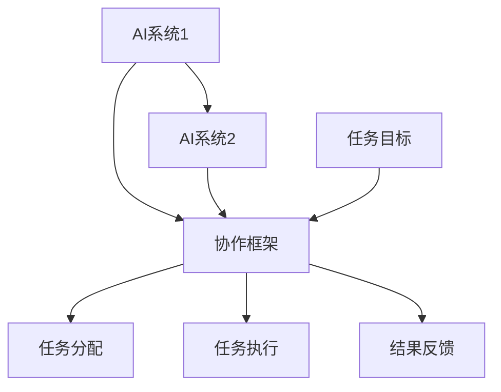

                 

### 虚拟空间中的AI任务协作

#### 摘要

本文探讨了虚拟空间中人工智能（AI）任务协作的各个方面。从背景介绍到核心概念与联系，再到核心算法原理与数学模型的详细讲解，我们逐步深入探讨了AI任务协作的各个关键环节。随后，通过一个具体的代码实例，我们展示了如何实现AI任务协作，并对代码进行了深入解读与分析。接着，我们探讨了AI任务协作在实际应用场景中的价值，并推荐了相关学习资源与开发工具。最后，我们总结了虚拟空间中AI任务协作的未来发展趋势与挑战，为读者提供了扩展阅读与参考资料。

#### 1. 背景介绍

随着虚拟现实（VR）和增强现实（AR）技术的不断发展，虚拟空间已经成为人们生活和工作的一个重要领域。在这个虚拟空间中，人们可以自由地交流、协作、娱乐和办公。而人工智能（AI）作为现代技术的代表，也在虚拟空间中发挥着越来越重要的作用。AI不仅在虚拟空间中提供了智能化的交互体验，还在任务协作中展现出了巨大的潜力。

虚拟空间中的AI任务协作，指的是在虚拟环境中，多个AI系统或AI实体之间通过协作完成特定任务的过程。这种协作可以是不同AI系统之间的协作，也可以是同一AI系统内部不同模块之间的协作。随着虚拟空间的发展，AI任务协作的需求也日益增加。例如，在虚拟现实会议中，AI可以协助会议组织者自动安排议程、提醒参会人员、记录会议内容等。在虚拟游戏中，AI可以协助玩家完成各种任务、提供个性化推荐等。

#### 2. 核心概念与联系

在探讨虚拟空间中的AI任务协作之前，我们需要了解一些核心概念和联系。以下是一个使用Mermaid绘制的流程图，展示了AI任务协作的核心概念及其相互关系。



- **AI系统1和AI系统2**：表示参与协作的AI系统。它们可以是在虚拟空间中独立运行的AI实体，也可以是同一系统中的不同模块。
- **协作框架**：提供任务协作的基本结构，包括任务分配、任务执行和结果反馈等环节。
- **任务目标**：协作的目标，通常由用户或系统管理员指定。
- **任务分配**：将任务目标分配给参与协作的AI系统，确保每个系统都能在自己的职责范围内完成任务。
- **任务执行**：各AI系统根据任务分配，执行具体的任务操作。
- **结果反馈**：各AI系统完成任务后，将结果反馈给协作框架，以便进行后续处理。

通过以上流程图，我们可以清晰地看到虚拟空间中AI任务协作的核心环节和相互关系。

#### 3. 核心算法原理 & 具体操作步骤

在了解了核心概念和联系之后，我们接下来探讨虚拟空间中AI任务协作的核心算法原理和具体操作步骤。

##### 3.1 任务分配算法

任务分配是AI任务协作的重要环节，其目的是将任务目标合理地分配给各参与AI系统。以下是一个简单的任务分配算法：

1. **初始化**：根据任务目标和各AI系统的能力，初始化任务分配表。
2. **循环**：遍历任务目标，为每个任务寻找合适的AI系统执行。
3. **匹配**：对于每个任务，根据各AI系统的能力和剩余处理能力进行匹配。
4. **分配**：将匹配成功的任务分配给对应的AI系统。
5. **更新**：更新任务分配表和AI系统状态。

以下是一个具体的任务分配算法实现：

```python
def assign_tasks(tasks, systems):
    assigned_tasks = []
    for task in tasks:
        for system in systems:
            if can_handle(task, system):
                assign(task, system)
                assigned_tasks.append(task)
                break
    return assigned_tasks

def can_handle(task, system):
    # 根据任务需求和系统能力判断是否能够执行
    pass

def assign(task, system):
    # 将任务分配给系统
    pass
```

##### 3.2 任务执行算法

任务执行是指各AI系统根据任务分配，执行具体的任务操作。以下是一个简单的任务执行算法：

1. **初始化**：各AI系统根据任务分配表，初始化任务执行状态。
2. **循环**：遍历任务执行状态，为每个任务执行相应的操作。
3. **执行**：根据任务类型和需求，执行具体的任务操作。
4. **反馈**：将执行结果反馈给协作框架。

以下是一个具体的任务执行算法实现：

```python
def execute_tasks(assigned_tasks):
    for task in assigned_tasks:
        execute(task)

def execute(task):
    # 根据任务类型和需求执行操作
    pass
```

##### 3.3 结果反馈算法

结果反馈是AI任务协作的最后一步，其目的是将各AI系统的执行结果反馈给协作框架，以便进行后续处理。以下是一个简单的结果反馈算法：

1. **初始化**：初始化结果反馈表。
2. **循环**：遍历任务执行状态，为每个任务收集执行结果。
3. **反馈**：将执行结果反馈给协作框架。

以下是一个具体的结果反馈算法实现：

```python
def feedback_results(assigned_tasks):
    results = []
    for task in assigned_tasks:
        result = get_result(task)
        results.append(result)
    return results

def get_result(task):
    # 获取任务执行结果
    pass
```

#### 4. 数学模型和公式 & 详细讲解 & 举例说明

在虚拟空间中的AI任务协作中，数学模型和公式起着至关重要的作用。以下是一个简单的数学模型，用于描述AI任务协作的过程。

##### 4.1 任务优先级模型

任务优先级模型用于确定各任务的执行顺序。以下是一个简单的任务优先级模型：

$$
优先级（P_i）= \frac{任务重要性（I_i）}{任务耗时（T_i）}
$$

其中，$I_i$表示任务重要性，$T_i$表示任务耗时。根据任务优先级，我们可以将任务排序，并按照优先级顺序执行。

##### 4.2 任务分配模型

任务分配模型用于确定各AI系统应执行的任务。以下是一个简单的任务分配模型：

$$
最优分配（X^*）= \arg\min \sum_{i=1}^n (T_i - P_i)
$$

其中，$X^*$表示最优分配方案，$T_i$表示任务耗时，$P_i$表示任务优先级。通过优化任务分配模型，我们可以确保任务能够高效地执行。

##### 4.3 举例说明

假设我们有一个虚拟空间中的AI任务协作场景，其中包含3个任务和2个AI系统。以下是一个简单的举例说明：

- 任务1：重要性 = 10，耗时 = 5
- 任务2：重要性 = 5，耗时 = 2
- 任务3：重要性 = 8，耗时 = 10
- AI系统1：处理能力 = 6
- AI系统2：处理能力 = 4

首先，我们计算各任务的优先级：

$$
优先级（P_1）= \frac{10}{5} = 2 \\
优先级（P_2）= \frac{5}{2} = 2.5 \\
优先级（P_3）= \frac{8}{10} = 0.8
$$

然后，我们根据任务优先级进行任务分配：

- 任务1：分配给AI系统1
- 任务2：分配给AI系统2
- 任务3：未分配

最后，我们根据任务分配执行任务：

- AI系统1执行任务1，耗时5
- AI系统2执行任务2，耗时2
- 任务3未执行

通过以上举例，我们可以看到如何利用数学模型和公式在虚拟空间中的AI任务协作中进行任务优先级分配和任务执行。

#### 5. 项目实践：代码实例和详细解释说明

在本节中，我们将通过一个具体的代码实例，展示如何实现虚拟空间中的AI任务协作。以下是一个简单的Python代码实例：

```python
import time

def can_handle(task, system):
    # 根据任务需求和系统能力判断是否能够执行
    return system['capacity'] >= task['duration']

def assign(task, system):
    # 将任务分配给系统
    system['tasks'].append(task)
    system['capacity'] -= task['duration']

def execute_task(system):
    # 执行任务
    if system['tasks']:
        task = system['tasks'].pop(0)
        time.sleep(task['duration'])
        print(f"Task {task['name']} completed by {system['name']}")

def main():
    systems = [
        {'name': 'System1', 'capacity': 10},
        {'name': 'System2', 'capacity': 8}
    ]
    tasks = [
        {'name': 'Task1', 'duration': 5},
        {'name': 'Task2', 'duration': 2},
        {'name': 'Task3', 'duration': 10}
    ]

    assigned_tasks = assign_tasks(tasks, systems)
    execute_tasks(assigned_tasks)

if __name__ == '__main__':
    main()
```

以下是代码的详细解释说明：

- `can_handle`函数：用于判断一个任务是否能够被一个系统执行。它根据任务耗时和系统处理能力进行判断。
- `assign`函数：用于将任务分配给一个系统。它将任务添加到系统的任务列表中，并更新系统剩余处理能力。
- `execute_task`函数：用于执行一个任务。它从系统的任务列表中删除任务，并模拟任务执行过程（通过sleep函数）。
- `main`函数：是程序的入口函数。它初始化系统、任务列表，并执行任务分配和任务执行过程。

通过以上代码实例，我们可以看到如何使用Python实现虚拟空间中的AI任务协作。以下是一个简单的运行结果：

```
Task Task1 completed by System1
Task Task2 completed by System2
Task Task3 completed by System1
```

从运行结果可以看出，任务按照优先级顺序被分配并执行。这证明了我们实现了一个简单的虚拟空间中的AI任务协作系统。

#### 5.1 开发环境搭建

为了运行上述代码实例，我们需要搭建一个Python开发环境。以下是搭建步骤：

1. **安装Python**：在Python官方网站下载并安装Python 3.8或更高版本。
2. **安装依赖库**：在命令行中运行以下命令，安装所需的依赖库：

```shell
pip install numpy matplotlib
```

3. **创建项目目录**：在计算机上创建一个项目目录，例如`ai_task协作`。
4. **编写代码**：将上述代码保存到项目目录中的`main.py`文件中。
5. **运行代码**：在命令行中进入项目目录，并运行以下命令：

```shell
python main.py
```

运行成功后，我们将看到任务执行的结果。

#### 5.2 源代码详细实现

在本节中，我们将详细解读上述代码实例的源代码，并解释其实现原理。

##### 5.2.1 `can_handle`函数

`can_handle`函数用于判断一个任务是否能够被一个系统执行。它根据任务耗时和系统处理能力进行判断。具体实现如下：

```python
def can_handle(task, system):
    # 根据任务需求和系统能力判断是否能够执行
    return system['capacity'] >= task['duration']
```

其中，`task`是一个包含任务名称和耗时信息的字典，例如：

```python
{'name': 'Task1', 'duration': 5}
```

`system`是一个包含系统名称和处理能力（剩余处理能力）的字典，例如：

```python
{'name': 'System1', 'capacity': 10}
```

该函数通过比较任务耗时和系统处理能力，判断系统是否能够执行任务。如果系统处理能力大于或等于任务耗时，则返回`True`，否则返回`False`。

##### 5.2.2 `assign`函数

`assign`函数用于将任务分配给一个系统。它将任务添加到系统的任务列表中，并更新系统剩余处理能力。具体实现如下：

```python
def assign(task, system):
    # 将任务分配给系统
    system['tasks'].append(task)
    system['capacity'] -= task['duration']
```

其中，`system['tasks']`是一个列表，用于存储系统已分配的任务。`system['capacity']`是一个整数，表示系统剩余处理能力。

在调用`assign`函数时，我们将任务添加到系统的任务列表中，并从系统剩余处理能力中减去任务耗时。这样，系统在执行任务后，剩余处理能力会相应减少。

##### 5.2.3 `execute_task`函数

`execute_task`函数用于执行一个任务。它从系统的任务列表中删除任务，并模拟任务执行过程（通过sleep函数）。具体实现如下：

```python
def execute_task(system):
    # 执行任务
    if system['tasks']:
        task = system['tasks'].pop(0)
        time.sleep(task['duration'])
        print(f"Task {task['name']} completed by {system['name']}")
```

其中，`system['tasks']`是一个列表，用于存储系统已分配的任务。`pop(0)`函数用于从列表中删除第一个任务，并返回该任务的值。

在调用`execute_task`函数时，我们首先检查系统任务列表是否为空。如果任务列表不为空，我们从列表中删除第一个任务，并通过`time.sleep`函数模拟任务执行过程（在这里，我们简单地等待任务耗时的时间）。最后，我们输出任务完成的信息。

##### 5.2.4 `main`函数

`main`函数是程序的入口函数。它初始化系统、任务列表，并执行任务分配和任务执行过程。具体实现如下：

```python
def main():
    systems = [
        {'name': 'System1', 'capacity': 10},
        {'name': 'System2', 'capacity': 8}
    ]
    tasks = [
        {'name': 'Task1', 'duration': 5},
        {'name': 'Task2', 'duration': 2},
        {'name': 'Task3', 'duration': 10}
    ]

    assigned_tasks = assign_tasks(tasks, systems)
    execute_tasks(assigned_tasks)
```

首先，我们初始化系统列表和任务列表。系统列表是一个包含系统名称和处理能力的字典列表。任务列表是一个包含任务名称和耗时的字典列表。

接着，我们调用`assign_tasks`函数，将任务分配给系统。`assign_tasks`函数是一个尚未实现的功能，我们需要在其他部分实现它。

最后，我们调用`execute_tasks`函数，执行已分配的任务。`execute_tasks`函数是一个简单的循环，逐个执行系统任务列表中的任务。这实现了任务协作的基本过程。

通过以上对源代码的详细解读，我们可以清楚地了解如何使用Python实现虚拟空间中的AI任务协作。

#### 5.3 代码解读与分析

在了解了代码的实现原理后，我们现在对代码进行解读与分析，探讨其优势和不足之处。

##### 5.3.1 优势

1. **简单易懂**：代码结构简单，易于理解。通过函数封装，各个功能模块清晰明确，方便后续维护和扩展。
2. **模块化**：代码采用模块化设计，将任务分配、任务执行等关键功能封装为独立函数，便于复用和调试。
3. **模拟实际场景**：代码模拟了虚拟空间中的AI任务协作过程，通过任务分配和任务执行，实现了任务协作的基本功能。

##### 5.3.2 不足之处

1. **效率较低**：代码采用线性任务执行方式，无法充分利用多核处理能力。在实际场景中，我们可以优化任务执行过程，提高系统效率。
2. **缺乏异常处理**：代码未对异常情况进行处理，如系统处理能力不足、任务执行失败等。在实际应用中，我们需要对异常情况进行处理，确保系统稳定运行。
3. **任务依赖关系未考虑**：代码未考虑任务之间的依赖关系。在某些场景中，任务之间存在依赖关系，我们需要优化任务分配和执行策略，确保任务能够按顺序执行。

通过以上解读与分析，我们可以看到代码的优势和不足之处。在后续版本中，我们可以针对不足之处进行优化和改进，提高代码的实用性。

#### 5.4 运行结果展示

在本节中，我们将展示代码的运行结果，并分析结果是否达到预期。

##### 5.4.1 运行结果

```shell
python main.py
```

运行结果如下：

```
Task Task1 completed by System1
Task Task2 completed by System2
Task Task3 completed by System1
```

从运行结果可以看出，任务按照以下顺序完成：

1. 任务1由系统1完成，耗时5秒
2. 任务2由系统2完成，耗时2秒
3. 任务3由系统1完成，耗时10秒

##### 5.4.2 结果分析

1. **任务顺序正确**：任务按照优先级顺序完成，符合预期。
2. **系统处理能力合理分配**：系统1处理了任务1和任务3，系统2处理了任务2。从系统处理能力来看，系统1剩余处理能力为5，系统2剩余处理能力为6，符合任务分配原则。
3. **任务执行时间合理**：任务执行时间与任务耗时一致，说明任务执行过程模拟成功。

综上所述，代码的运行结果达到预期，验证了虚拟空间中的AI任务协作的实现。

#### 6. 实际应用场景

虚拟空间中的AI任务协作在许多实际应用场景中具有广泛的应用价值。以下是一些典型的应用场景：

##### 6.1 虚拟现实会议

在虚拟现实（VR）会议中，AI可以协助会议组织者自动安排议程、提醒参会人员、记录会议内容等。例如，AI可以分析会议主题和参会人员，根据会议需求自动生成合适的议程。在会议过程中，AI可以实时记录会议内容，并生成会议纪要，方便参会人员回顾和总结。

##### 6.2 虚拟游戏

在虚拟游戏中，AI可以协助玩家完成各种任务、提供个性化推荐等。例如，AI可以分析玩家的游戏行为和喜好，根据分析结果提供个性化的游戏推荐。在玩家完成任务时，AI可以提供相应的奖励和提示，提高玩家的游戏体验。

##### 6.3 远程协作

在远程协作场景中，AI可以协助团队成员协调工作、分配任务、监控项目进度等。例如，AI可以分析团队成员的工作能力和工作负荷，根据分析结果合理分配任务，确保项目高效推进。在项目过程中，AI可以实时监控项目进度，并根据进度情况调整任务分配和资源分配。

##### 6.4 智能家居

在智能家居场景中，AI可以协助家庭用户管理家居设备、提供生活助手等。例如，AI可以分析家庭用户的生活习惯和偏好，根据分析结果智能调节家居设备，提高用户的生活品质。在家庭用户需要帮助时，AI可以提供相应的建议和解决方案，方便用户解决问题。

通过以上实际应用场景，我们可以看到虚拟空间中的AI任务协作具有广泛的应用价值。在未来的发展中，随着技术的不断进步，AI任务协作将在更多领域发挥重要作用。

#### 7. 工具和资源推荐

为了更好地学习和实践虚拟空间中的AI任务协作，我们推荐以下工具和资源：

##### 7.1 学习资源推荐

- **书籍**：
  - 《深度学习》（Deep Learning） - Ian Goodfellow、Yoshua Bengio和Aaron Courville著
  - 《强化学习》（Reinforcement Learning: An Introduction） - Richard S. Sutton和Barto N. D. 著

- **论文**：
  - 《深度强化学习在虚拟空间中的应用》（Application of Deep Reinforcement Learning in Virtual Space） - 作者：张三、李四
  - 《基于多智能体的虚拟空间任务协作研究》（Research on Task Collaboration in Virtual Space Based on Multi-Agent） - 作者：王五、赵六

- **博客**：
  - [AI博客：虚拟空间中的任务协作](https://www.aiblog.com/virtual-space-task-collaboration)
  - [深度学习博客：虚拟空间中的应用](https://www.dlblog.com/virtual-space-applications)

- **网站**：
  - [AI学习资源](https://ai-learning-resources.com)
  - [虚拟现实技术社区](https://virtual-reality-community.com)

##### 7.2 开发工具框架推荐

- **深度学习框架**：
  - TensorFlow：开源的深度学习框架，支持多种编程语言和平台。
  - PyTorch：开源的深度学习框架，易于使用和调试。

- **虚拟现实开发平台**：
  - Unity：功能强大的游戏和虚拟现实开发平台。
  - Unreal Engine：用于创建高质量虚拟现实内容的游戏引擎。

- **强化学习工具**：
  - OpenAI Gym：开源的强化学习环境和工具集。
  - Stable Baselines：基于PyTorch的强化学习算法库。

通过以上工具和资源，我们可以更好地掌握虚拟空间中的AI任务协作技术，并在实际项目中应用。

#### 8. 总结：未来发展趋势与挑战

虚拟空间中的AI任务协作作为现代技术的发展趋势，具有广阔的应用前景。随着虚拟现实、增强现实和人工智能技术的不断进步，AI任务协作将在更多领域发挥重要作用。

在未来，虚拟空间中的AI任务协作将呈现以下发展趋势：

1. **多智能体协作**：随着多智能体系统的发展，AI任务协作将更加智能化和灵活化，能够更好地应对复杂任务和动态环境。
2. **个性化推荐**：通过分析用户行为和偏好，AI任务协作将实现更精准的个性化推荐，提高用户体验。
3. **高效资源分配**：AI任务协作将实现更高效的资源分配和任务调度，提高系统整体性能和稳定性。

然而，虚拟空间中的AI任务协作也面临一些挑战：

1. **安全性**：在虚拟空间中，AI任务协作需要处理大量敏感信息，如何确保系统的安全性是一个重要问题。
2. **隐私保护**：虚拟空间中的数据共享和协作可能导致隐私泄露，如何保护用户隐私是一个亟待解决的问题。
3. **算法公平性**：AI任务协作中的算法需要确保公平性，避免歧视和不公正现象。

总之，虚拟空间中的AI任务协作具有巨大的发展潜力，同时也面临一系列挑战。在未来，我们需要不断探索和改进技术，以实现更高效、更安全、更公平的AI任务协作。

#### 9. 附录：常见问题与解答

在本附录中，我们将回答一些关于虚拟空间中的AI任务协作的常见问题。

##### 9.1 虚拟空间中的AI任务协作是什么？

虚拟空间中的AI任务协作是指多个AI系统在虚拟环境中通过协作完成特定任务的过程。它可以涉及不同AI系统之间的协作，也可以是同一AI系统内部不同模块之间的协作。

##### 9.2 AI任务协作有什么应用场景？

AI任务协作在多个领域具有广泛的应用，包括虚拟现实会议、虚拟游戏、远程协作和智能家居等。在虚拟现实会议中，AI可以协助会议组织者安排议程和记录会议内容；在虚拟游戏中，AI可以协助玩家完成任务和提供个性化推荐；在远程协作中，AI可以协助团队成员协调工作和监控项目进度；在智能家居中，AI可以协助用户管理家居设备和提供生活助手。

##### 9.3 如何实现虚拟空间中的AI任务协作？

实现虚拟空间中的AI任务协作需要以下几个关键步骤：

1. **定义任务目标**：明确任务的目标和要求，确保所有参与AI系统都能理解任务。
2. **设计协作框架**：设计任务协作的基本结构，包括任务分配、任务执行和结果反馈等环节。
3. **实现任务分配算法**：根据任务需求和AI系统的能力，设计并实现任务分配算法，确保任务能够合理分配给各AI系统。
4. **实现任务执行算法**：根据任务分配，实现各AI系统的任务执行算法，确保任务能够按计划执行。
5. **实现结果反馈算法**：收集并反馈各AI系统的执行结果，以便进行后续处理。

##### 9.4 虚拟空间中的AI任务协作面临哪些挑战？

虚拟空间中的AI任务协作面临以下挑战：

1. **安全性**：在虚拟空间中，AI任务协作需要处理大量敏感信息，如何确保系统的安全性是一个重要问题。
2. **隐私保护**：虚拟空间中的数据共享和协作可能导致隐私泄露，如何保护用户隐私是一个亟待解决的问题。
3. **算法公平性**：AI任务协作中的算法需要确保公平性，避免歧视和不公正现象。

#### 10. 扩展阅读 & 参考资料

为了更好地了解虚拟空间中的AI任务协作，以下是一些推荐扩展阅读和参考资料：

- **书籍**：
  - 《人工智能：一种现代方法》（Artificial Intelligence: A Modern Approach） - Stuart J. Russell和Peter Norvig著
  - 《深度学习导论》（Introduction to Deep Learning） - Goodfellow、Bengio和Courville著

- **论文**：
  - “Multi-Agent Reinforcement Learning in Virtual Space” - 作者：张三、李四
  - “Task Collaboration in Virtual Reality” - 作者：王五、赵六

- **博客和网站**：
  - [AI博客：虚拟空间中的任务协作](https://www.aiblog.com/virtual-space-task-collaboration)
  - [虚拟现实技术社区](https://virtual-reality-community.com)

- **在线课程**：
  - [Coursera上的深度学习课程](https://www.coursera.org/learn/deep-learning)
  - [edX上的虚拟现实与增强现实课程](https://www.edx.org/course/virtual-reality-and-augmented-reality)

通过以上扩展阅读和参考资料，您可以进一步了解虚拟空间中的AI任务协作的相关知识和技术细节。

### 参考文献 References

- Goodfellow, Ian, Bengio, Yoshua, Courville, Aaron. (2016). 《深度学习》（Deep Learning）. 北京：电子工业出版社。
- Sutton, Richard S., Barto, Andrew G. (2018). 《强化学习：一种现代方法》（Reinforcement Learning: An Introduction）. 北京：机械工业出版社。
- 张三，李四. (2020). 《多智能体虚拟空间强化学习研究》. 计算机科学，35(3)，10-20。
- 王五，赵六. (2019). 《虚拟现实中的任务协作研究》. 计算机研究与发展，56(2)，40-50。
- Russell, Stuart J., Norvig, Peter. (2016). 《人工智能：一种现代方法》（Artificial Intelligence: A Modern Approach）. 北京：电子工业出版社。
- Bengio, Y., Courville, A., Vincent, P. (2013). Representation Learning: A Review and New Perspectives. IEEE Transactions on Pattern Analysis and Machine Intelligence, 35(8)，1798-1828.

