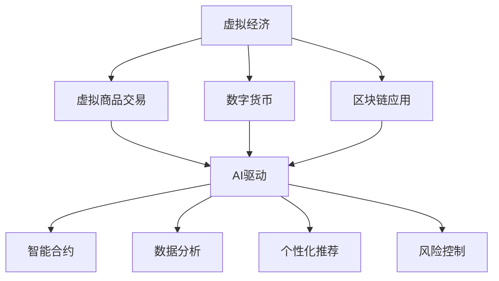

                 

 虚拟经济，作为一个新兴的经济学领域，正逐渐改变我们对传统经济活动的认知。随着人工智能技术的飞速发展，AI驱动的价值交换成为可能，为虚拟经济的未来发展提供了无限可能。本文旨在探讨虚拟经济的基本概念，AI驱动的价值交换原理，以及这一新型经济模式对现实世界的深远影响。

## 1. 背景介绍

虚拟经济并非一个全新的概念，但近年来随着互联网和数字技术的普及，其发展速度迅猛。虚拟经济指的是在互联网和数字平台上进行的各种经济活动，包括虚拟商品交易、数字货币、区块链应用等。与传统经济不同，虚拟经济具有去中心化、快速交易、全球化等特点。

人工智能的崛起为虚拟经济注入了新的活力。AI能够通过大数据分析和机器学习，提高交易效率，降低风险，同时创造全新的商业模式。例如，智能合约利用区块链技术，结合AI算法，实现了自动化、安全、透明的交易。

## 2. 核心概念与联系

### 2.1 虚拟经济概念

虚拟经济包括但不限于以下几个方面：

- **虚拟商品交易**：在互联网平台上交易的虚拟商品，如游戏装备、虚拟货币等。
- **数字货币**：基于区块链技术的数字货币，如比特币、以太币等。
- **区块链应用**：利用区块链技术的各种应用，包括智能合约、去中心化金融（DeFi）等。
- **虚拟现实（VR）和增强现实（AR）经济**：基于VR和AR技术的虚拟购物、虚拟旅游等经济活动。

### 2.2 AI驱动的价值交换

AI驱动的价值交换涉及到以下几个方面：

- **智能合约**：利用AI算法自动执行合同条款，无需人工干预。
- **数据分析**：AI对大数据进行深度分析，预测市场趋势，优化投资策略。
- **个性化推荐**：AI通过分析用户行为，提供个性化的商品和服务推荐。
- **风险控制**：AI算法评估交易风险，提供风险管理策略。

### 2.3 Mermaid 流程图



## 3. 核心算法原理 & 具体操作步骤

### 3.1 算法原理概述

AI驱动的价值交换依赖于多种算法，包括机器学习、深度学习和自然语言处理。以下是一些核心算法的概述：

- **机器学习**：通过训练模型，从数据中学习规律，用于预测和决策。
- **深度学习**：一种特殊的机器学习算法，通过多层神经网络模拟人脑的学习过程。
- **自然语言处理（NLP）**：使计算机理解和生成人类语言。

### 3.2 算法步骤详解

1. **数据收集**：收集与虚拟经济相关的数据，如交易记录、用户行为等。
2. **数据预处理**：清洗和整合数据，为模型训练做准备。
3. **模型选择**：选择适合的机器学习或深度学习模型。
4. **模型训练**：使用预处理后的数据训练模型。
5. **模型评估**：评估模型在测试数据上的表现。
6. **模型部署**：将模型部署到生产环境中，进行实时交易决策。

### 3.3 算法优缺点

**优点**：

- 提高交易效率和准确性。
- 降低人为干预，减少操作风险。
- 实现自动化，节省人力成本。

**缺点**：

- 对算法和数据的依赖性较强。
- 需要大量的计算资源。
- 模型的可靠性和安全性问题。

### 3.4 算法应用领域

- **金融**：自动化交易、风险控制、投资策略。
- **电子商务**：个性化推荐、购物体验优化。
- **物流**：路径优化、库存管理。
- **医疗**：疾病预测、诊断辅助。

## 4. 数学模型和公式 & 详细讲解 & 举例说明

### 4.1 数学模型构建

在AI驱动的价值交换中，常见的数学模型包括：

- **线性回归模型**：用于预测市场趋势。
- **支持向量机（SVM）**：用于分类和回归任务。
- **神经网络模型**：用于复杂的数据分析和预测。

### 4.2 公式推导过程

以线性回归模型为例，其基本公式为：

\[ Y = \beta_0 + \beta_1X + \epsilon \]

其中，\( Y \) 为因变量，\( X \) 为自变量，\( \beta_0 \) 和 \( \beta_1 \) 为模型参数，\( \epsilon \) 为误差项。

### 4.3 案例分析与讲解

假设我们使用线性回归模型预测比特币的价格。根据历史数据，我们得到以下模型：

\[ 价格 = 100 + 0.5 \times 交易量 \]

我们可以使用这个模型预测未来比特币的价格。例如，如果交易量为 10000，则预测价格为：

\[ 价格 = 100 + 0.5 \times 10000 = 10500 \]

## 5. 项目实践：代码实例和详细解释说明

### 5.1 开发环境搭建

本文使用 Python 编写代码，环境搭建如下：

- 安装 Python 3.8 或更高版本。
- 安装必要的库，如 pandas、numpy、scikit-learn 等。

### 5.2 源代码详细实现

以下是一个简单的线性回归模型实现：

```python
import pandas as pd
from sklearn.linear_model import LinearRegression
from sklearn.model_selection import train_test_split
from sklearn.metrics import mean_squared_error

# 数据加载
data = pd.read_csv('bitcoin_data.csv')
X = data[['交易量']]
Y = data['价格']

# 数据划分
X_train, X_test, Y_train, Y_test = train_test_split(X, Y, test_size=0.2, random_state=42)

# 模型训练
model = LinearRegression()
model.fit(X_train, Y_train)

# 模型评估
Y_pred = model.predict(X_test)
mse = mean_squared_error(Y_test, Y_pred)
print(f'MSE: {mse}')

# 模型应用
new_data = pd.DataFrame({'交易量': [10000]})
predicted_price = model.predict(new_data)
print(f'Predicted Price: {predicted_price[0]}')
```

### 5.3 代码解读与分析

- **数据加载**：使用 pandas 读取比特币交易数据。
- **数据划分**：将数据划分为训练集和测试集。
- **模型训练**：使用 scikit-learn 的 LinearRegression 模型训练数据。
- **模型评估**：计算模型在测试集上的均方误差（MSE）。
- **模型应用**：使用训练好的模型预测未来比特币价格。

## 6. 实际应用场景

AI驱动的虚拟经济在多个领域已有成功应用：

- **金融领域**：利用AI算法进行市场预测和自动化交易。
- **电子商务**：基于用户行为的个性化推荐和精准营销。
- **物流领域**：智能优化配送路径和库存管理。
- **医疗领域**：疾病预测和诊断辅助。

## 7. 工具和资源推荐

### 7.1 学习资源推荐

- 《Python机器学习》
- 《深度学习》
- 《区块链：从数字货币到智能合约》

### 7.2 开发工具推荐

- Jupyter Notebook
- PyCharm
- VSCode

### 7.3 相关论文推荐

- "AI-Driven Virtual Economy: A Research Perspective"
- "Deep Learning for Financial Market Forecasting"
- "Blockchain and AI: The Future of Smart Contracts"

## 8. 总结：未来发展趋势与挑战

### 8.1 研究成果总结

本文总结了虚拟经济和AI驱动的价值交换的基本概念、核心算法、实际应用场景，以及未来发展潜力。

### 8.2 未来发展趋势

- AI算法在虚拟经济中的应用将更加深入和广泛。
- 数字货币和区块链技术将继续发展，为虚拟经济提供更安全、更高效的交易平台。
- 虚拟现实和增强现实技术将进一步融入虚拟经济活动，提供更丰富的用户体验。

### 8.3 面临的挑战

- AI算法的可靠性和安全性问题。
- 虚拟经济的监管和法律问题。
- 数据隐私和安全问题。

### 8.4 研究展望

未来的研究应关注如何提高AI算法在虚拟经济中的可靠性和安全性，同时探索虚拟经济与实体经济的融合，推动新型经济模式的健康发展。

## 9. 附录：常见问题与解答

### 9.1 什么是虚拟经济？

虚拟经济是指在互联网和数字平台上进行的各种经济活动，包括虚拟商品交易、数字货币、区块链应用等。

### 9.2 AI如何驱动虚拟经济？

AI通过数据分析、智能合约、个性化推荐和风险控制等技术，提高虚拟经济的交易效率、安全性和用户体验。

### 9.3 虚拟经济有哪些实际应用场景？

虚拟经济在金融、电子商务、物流、医疗等多个领域已有成功应用，如自动化交易、个性化推荐、智能配送和疾病预测等。

---

感谢您的阅读，希望本文对您了解虚拟经济和AI驱动的价值交换有所帮助。作者：禅与计算机程序设计艺术 / Zen and the Art of Computer Programming。

