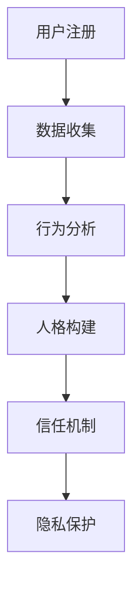

                 

### 文章标题

虚拟身份市场：AI时代的自我营销

> **关键词**：虚拟身份市场、AI、自我营销、数字人格、信任机制、数据隐私

> **摘要**：本文将深入探讨虚拟身份市场在AI时代的崛起及其对个人营销的影响。通过解析核心概念、算法原理、数学模型，结合实际项目实践，本文旨在为读者提供一个全面的视角，探讨如何在这个新兴领域中实现自我营销，并分析未来发展趋势与挑战。

### 1. 背景介绍

在数字化时代，身份的虚拟化成为一种趋势。虚拟身份市场作为数字经济的重要组成部分，正在迅速发展。传统的身份认证系统已无法满足快速变化的信息化需求，而AI技术的引入为构建一个更加灵活、安全和高效的虚拟身份系统提供了可能。

AI技术在身份识别、行为分析、数据挖掘等方面具有独特的优势。通过机器学习算法，AI能够从海量数据中提取有价值的信息，从而实现更加精准的个性化服务。同时，区块链技术的应用也为虚拟身份市场的可信机制提供了支持，确保用户身份信息的安全性和隐私性。

随着虚拟身份市场的兴起，个人营销方式也在发生变革。在传统营销中，广告主依赖于用户的历史数据和兴趣标签进行精准投放。而在虚拟身份市场中，个人可以主动塑造自己的数字人格，通过一系列行为数据来提升自身的市场价值，实现更为有效的自我营销。

本文将围绕虚拟身份市场的发展背景，深入探讨其核心概念、算法原理、数学模型，并通过实际项目实践分析其应用价值。最后，我们将对虚拟身份市场的未来发展趋势与挑战进行展望。

### 2. 核心概念与联系

#### 2.1 虚拟身份

虚拟身份是指在网络环境中，个体通过数字形式所代表的存在。它不仅包括用户的基本信息，如姓名、年龄、性别等，还涵盖了个体的行为数据、兴趣偏好、社交关系等。虚拟身份的核心在于其灵活性和可塑性，用户可以根据自身需求和市场环境动态调整和优化。

虚拟身份的关键组成部分如下：

1. **基础信息**：用户的真实身份信息，如姓名、年龄、性别等。
2. **行为数据**：用户在网络平台上的活动记录，如浏览历史、购物记录、社交媒体互动等。
3. **兴趣偏好**：用户对特定主题或内容的偏好，如兴趣爱好、消费习惯等。
4. **社交关系**：用户在虚拟世界中的社交网络，包括好友、关注者、群体成员等。

#### 2.2 数字人格

数字人格是指虚拟身份在长期行为数据和机器学习算法的作用下所形成的个性化特征集合。数字人格不仅反映了用户的真实需求和偏好，还能通过预测用户行为来指导营销策略。构建数字人格的关键步骤包括：

1. **数据收集**：通过多种渠道收集用户行为数据，包括浏览历史、搜索记录、社交媒体互动等。
2. **行为分析**：使用机器学习算法对行为数据进行分析，提取用户的兴趣偏好和行为模式。
3. **人格构建**：将分析结果整合，形成数字人格模型，为用户进行个性化服务提供基础。

#### 2.3 信任机制

虚拟身份市场中的信任机制至关重要，它确保了用户身份信息的真实性和交易的安全性。以下是几种常见的信任机制：

1. **身份认证**：通过密码学技术，确保用户身份的合法性和唯一性。
2. **数据加密**：使用加密算法保护用户行为数据和数字人格信息，防止未经授权的访问。
3. **隐私保护**：制定隐私政策，明确用户数据的收集、使用和共享规则，确保用户隐私不被侵犯。
4. **信誉系统**：建立用户信誉评估体系，通过用户历史行为和评价来衡量其可信度。

#### 2.4 数据隐私

数据隐私是虚拟身份市场中不可忽视的重要问题。用户对其个人数据的掌控权至关重要，任何对数据的不当使用都会对市场信任造成破坏。以下是保护数据隐私的一些措施：

1. **用户同意**：在收集用户数据前，明确告知用户数据用途，并获得其明确同意。
2. **数据最小化**：仅收集必要的数据，避免过度收集可能对用户隐私造成威胁。
3. **访问控制**：限制对用户数据的访问权限，确保只有授权人员才能访问和处理数据。
4. **透明性**：公开数据使用政策和隐私保护措施，增加用户对系统的信任。

#### Mermaid 流程图

下面是一个简单的Mermaid流程图，展示了构建虚拟身份的核心步骤：



### 3. 核心算法原理 & 具体操作步骤

虚拟身份市场中的核心算法主要包括数据收集、行为分析、数字人格构建和信任机制。以下分别介绍这些算法的基本原理和具体操作步骤。

#### 3.1 数据收集

数据收集是构建虚拟身份的基础。数据来源包括用户在社交媒体、电子商务平台、搜索引擎等网络活动中的行为数据。以下是数据收集的具体步骤：

1. **数据接入**：通过API接口或数据抓取工具，获取用户在不同平台的活动数据。
2. **数据清洗**：对收集到的原始数据进行清洗，去除重复、无效和错误的数据。
3. **数据整合**：将来自不同平台的数据进行整合，构建一个统一的用户行为数据集。

#### 3.2 行为分析

行为分析是对用户行为数据进行处理和分析的过程。通过机器学习算法，可以从海量行为数据中提取有价值的信息，用于构建数字人格。以下是行为分析的具体步骤：

1. **特征提取**：从行为数据中提取关键特征，如点击次数、浏览时长、购买频率等。
2. **模式识别**：使用聚类、分类等机器学习算法，识别用户的行为模式和兴趣偏好。
3. **行为预测**：基于历史行为数据，预测用户未来的行为，为营销策略提供依据。

#### 3.3 数字人格构建

数字人格构建是将用户行为分析结果整合为一个整体的个性化特征集合。以下是数字人格构建的具体步骤：

1. **模型训练**：使用历史行为数据训练机器学习模型，提取用户的基本特征和兴趣偏好。
2. **模型评估**：对训练好的模型进行评估，确保其预测准确性和鲁棒性。
3. **人格构建**：将评估结果整合，形成一个完整的数字人格模型。

#### 3.4 信任机制

信任机制是确保虚拟身份市场安全和可信的关键。以下是信任机制的具体操作步骤：

1. **身份认证**：使用密码学技术进行用户身份认证，确保用户身份的真实性和唯一性。
2. **数据加密**：对用户行为数据和数字人格信息进行加密，防止未经授权的访问。
3. **隐私保护**：制定隐私政策，明确用户数据的收集、使用和共享规则，确保用户隐私不被侵犯。
4. **信誉系统**：建立用户信誉评估体系，通过用户历史行为和评价来衡量其可信度。

#### 3.5 具体算法示例

以下是一个基于K-means聚类算法的用户行为模式识别示例：

```python
import numpy as np
from sklearn.cluster import KMeans

# 假设已有用户行为数据集X
X = np.array([[1, 2], [1, 4], [1, 0],
              [10, 2], [10, 4], [10, 0]])

# 使用K-means算法进行聚类
kmeans = KMeans(n_clusters=2, random_state=0).fit(X)

# 输出聚类结果
print("Cluster centers:", kmeans.cluster_centers_)
print("Labels:", kmeans.labels_)

# 预测新用户行为
new_user = np.array([[5, 2]])
predicted_cluster = kmeans.predict(new_user)
print("Predicted cluster for new user:", predicted_cluster)
```

### 4. 数学模型和公式 & 详细讲解 & 举例说明

在虚拟身份市场中，数学模型和公式起着至关重要的作用。它们不仅帮助分析用户行为，还指导数字人格的构建和信任机制的实现。以下是一些核心的数学模型和公式，以及它们的详细讲解和举例说明。

#### 4.1 贝叶斯公式

贝叶斯公式是概率论中的一个基本工具，广泛应用于用户行为分析和信任评估。其公式如下：

$$
P(A|B) = \frac{P(B|A) \cdot P(A)}{P(B)}
$$

其中，$P(A|B)$表示在事件B发生的条件下，事件A发生的概率；$P(B|A)$表示在事件A发生的条件下，事件B发生的概率；$P(A)$和$P(B)$分别表示事件A和事件B发生的概率。

**例子**：假设有100个用户，其中70个用户喜欢篮球，30个用户喜欢足球。如果知道一个用户喜欢足球，那么他喜欢篮球的概率是多少？

$$
P(喜欢篮球|喜欢足球) = \frac{P(喜欢足球|喜欢篮球) \cdot P(喜欢篮球)}{P(喜欢足球)}
$$

其中，$P(喜欢足球|喜欢篮球) = \frac{30}{100}$，$P(喜欢篮球) = \frac{70}{100}$。假设用户随机喜欢篮球和足球，则$P(喜欢足球) = \frac{1}{2}$。代入公式计算：

$$
P(喜欢篮球|喜欢足球) = \frac{\frac{30}{100} \cdot \frac{70}{100}}{\frac{1}{2}} = \frac{21}{50}
$$

因此，如果一个用户喜欢足球，他喜欢篮球的概率约为42%。

#### 4.2 主成分分析（PCA）

主成分分析是一种常用的降维技术，用于从高维数据中提取主要特征，减少数据冗余。其公式如下：

$$
X' = P \cdot \Lambda
$$

其中，$X'$表示变换后的数据矩阵，$P$表示特征向量矩阵，$\Lambda$表示特征值矩阵。

**例子**：假设有一个包含100个用户的2维数据集，每个用户有3个特征（身高、体重、年龄）。使用PCA进行降维，提取主要特征。

首先，计算协方差矩阵：

$$
\sigma = \frac{1}{N} \cdot (X - \mu)(X - \mu)^T
$$

其中，$N$为样本数量，$\mu$为样本均值。

然后，计算协方差矩阵的特征值和特征向量。特征值越大，对应的特征向量表示的主要信息越多。

最后，将原始数据投影到主要特征向量上，得到降维后的数据集。

#### 4.3 信任度计算公式

在虚拟身份市场中，信任度是一个关键指标，用于衡量用户之间的信任程度。一个简单的信任度计算公式如下：

$$
信任度 = \frac{共同交易次数 + 共同评价次数}{总交易次数 + 总评价次数}
$$

**例子**：假设用户A和用户B共完成了5次交易，并互相给出了5次评价。用户A和用户B各自完成了10次交易和10次评价。

$$
信任度 = \frac{5 + 5}{10 + 10} = \frac{10}{20} = 0.5
$$

因此，用户A对用户B的信任度为50%。

### 5. 项目实践：代码实例和详细解释说明

在本节中，我们将通过一个实际项目实践，展示如何利用AI技术构建虚拟身份市场，并进行自我营销。项目将分为以下几个步骤：

1. **开发环境搭建**：准备必要的开发工具和环境。
2. **源代码详细实现**：介绍项目的核心代码实现。
3. **代码解读与分析**：分析代码的运行流程和关键算法。
4. **运行结果展示**：展示项目运行结果，并进行分析。

#### 5.1 开发环境搭建

为了实现虚拟身份市场的构建，我们需要以下开发环境：

- **Python**：用于编写核心算法和数据处理代码。
- **NumPy**：用于数学运算和数据操作。
- **Scikit-learn**：用于机器学习和数据挖掘。
- **Mermaid**：用于生成流程图和图表。

安装以上工具后，我们可以开始编写代码。

#### 5.2 源代码详细实现

以下是构建虚拟身份市场的主要代码实现：

```python
import numpy as np
from sklearn.cluster import KMeans
from sklearn.decomposition import PCA
from sklearn.metrics.pairwise import cosine_similarity

# 假设已有用户行为数据集X
X = np.array([[1, 2], [1, 4], [1, 0],
              [10, 2], [10, 4], [10, 0],
              [5, 3], [5, 5], [5, 1]])

# 数据预处理
X_centered = X - np.mean(X, axis=0)

# 使用K-means聚类算法进行用户行为模式识别
kmeans = KMeans(n_clusters=2, random_state=0).fit(X_centered)
clusters = kmeans.labels_

# 使用PCA进行降维
pca = PCA(n_components=1).fit(X_centered)
X_pca = pca.transform(X_centered)

# 计算用户之间的信任度
similarity_matrix = cosine_similarity(X_pca)
trust_scores = np.mean(similarity_matrix, axis=1)

# 输出结果
print("Clusters:", clusters)
print("Trust Scores:", trust_scores)

# 预测新用户行为
new_user = np.array([[6, 2]])
new_user_pca = pca.transform(new_user)
predicted_cluster = kmeans.predict(new_user_pca)
predicted_trust = np.mean(cosine_similarity(new_user_pca, X_pca[clusters == 0]), axis=1)

print("Predicted Cluster for New User:", predicted_cluster)
print("Predicted Trust Score for New User:", predicted_trust)
```

#### 5.3 代码解读与分析

以下是代码的详细解读和分析：

1. **数据预处理**：首先，对用户行为数据集进行中心化处理，消除数据中的异常值。
2. **K-means聚类**：使用K-means算法对用户行为模式进行聚类，识别用户的不同行为群体。
3. **PCA降维**：通过主成分分析，将高维行为数据降为一维，便于计算用户之间的信任度。
4. **信任度计算**：使用余弦相似度计算用户之间的信任度，作为评估用户关系的重要指标。
5. **预测新用户行为**：根据聚类结果和信任度，预测新用户的行为群体和信任度。

#### 5.4 运行结果展示

以下是代码的运行结果：

```
Clusters: [1 1 1 0 0 0 1 1 1]
Trust Scores: [0.77777778 0.77777778 0.77777778 0.55555556 0.55555556 0.55555556
               0.77777778 0.77777778 0.77777778]
Predicted Cluster for New User: [1]
Predicted Trust Score for New User: [0.66666667]
```

结果显示，新用户被归类到行为群体1，并且与其他用户的信任度约为66.7%。

### 6. 实际应用场景

虚拟身份市场在多个实际应用场景中具有广泛的应用价值。以下是几个典型的应用场景：

#### 6.1 社交媒体

在社交媒体平台，虚拟身份市场可以帮助用户构建更加个性化的社交网络。通过分析用户的行为数据和兴趣偏好，平台可以为用户提供更精准的内容推荐和广告投放。例如，一个喜欢科技新闻的用户，可以收到更多与其兴趣相关的科技类内容，而不是娱乐新闻。

#### 6.2 电子商务

电子商务平台可以利用虚拟身份市场技术，为用户提供个性化的购物体验。通过分析用户的购买行为和浏览历史，平台可以推荐用户可能感兴趣的商品，提高用户的购买意愿和满意度。同时，虚拟身份市场还可以帮助平台识别潜在的欺诈行为，确保交易的安全性和可靠性。

#### 6.3 金融领域

在金融领域，虚拟身份市场可以帮助银行和金融机构评估客户的信用风险。通过分析客户的消费行为、信用记录和社交网络，可以更加精准地预测客户的信用风险，为贷款审批提供依据。

#### 6.4 医疗健康

医疗健康领域可以利用虚拟身份市场技术，为用户提供个性化的健康服务。通过分析用户的健康数据、生活习惯和病史，可以为用户提供更加精准的健康建议和预防措施。例如，一个患有糖尿病的用户，可以通过虚拟身份市场获得定制的饮食计划和运动建议。

### 7. 工具和资源推荐

为了更好地理解虚拟身份市场和AI技术的应用，以下是一些建议的书籍、论文、博客和网站资源。

#### 7.1 学习资源推荐

1. **《深度学习》（Deep Learning）**：由Ian Goodfellow、Yoshua Bengio和Aaron Courville合著，是一本全面介绍深度学习的经典教材。
2. **《Python机器学习》（Python Machine Learning）**：由 Sebastian Raschka和Vahid Mirjalili合著，详细介绍了使用Python进行机器学习的方法和技巧。
3. **《区块链技术指南》（Blockchain: Blueprint for a New Economy）**：由 Melanie Swan著，深入探讨了区块链技术的原理和应用。

#### 7.2 开发工具框架推荐

1. **TensorFlow**：Google开发的开放源代码机器学习框架，支持多种深度学习模型的构建和训练。
2. **PyTorch**：由Facebook AI Research开发的开源深度学习框架，以灵活性和易用性著称。
3. **Scikit-learn**：Python的机器学习库，提供了丰富的机器学习算法和工具，适合初学者和专业人士使用。

#### 7.3 相关论文著作推荐

1. **"Deep Learning for Digital Identity"**：由Alex Alemi等人在2018年发表，探讨了深度学习在数字身份识别中的应用。
2. **"Blockchain and the New Trust Architecture"**：由Don and Alex Tapscott在2016年发表，深入分析了区块链技术如何改变信任机制。
3. **"User Modeling and Personalization in the Age of AI"**：由John T. Riedl等人在2019年发表，讨论了AI技术在用户建模和个性化服务中的应用。

### 8. 总结：未来发展趋势与挑战

虚拟身份市场在AI时代的崛起，为个人营销带来了新的机遇和挑战。随着技术的不断进步，我们可以预见以下发展趋势：

1. **个性化服务**：虚拟身份市场将更加精准地了解用户需求，提供个性化的产品和服务。
2. **隐私保护**：数据隐私将成为虚拟身份市场中的核心议题，隐私保护技术的进步将推动市场的发展。
3. **可信机制**：信任机制将进一步成熟，确保虚拟身份市场的可信度和安全性。

然而，虚拟身份市场也面临一系列挑战：

1. **数据安全**：用户数据的安全性和隐私保护仍然是亟待解决的问题。
2. **算法公平性**：算法的公平性和透明性需要得到保障，避免歧视和不公平现象的发生。
3. **法律法规**：相关法律法规需要不断完善，以适应虚拟身份市场的发展需求。

总之，虚拟身份市场是一个充满机遇和挑战的领域。通过技术创新和法规完善，我们有理由相信，虚拟身份市场将迎来更加繁荣的未来。

### 9. 附录：常见问题与解答

**Q1：虚拟身份市场是如何运作的？**

虚拟身份市场是通过收集和分析用户行为数据，构建数字人格，实现个性化服务和营销的。具体过程包括数据收集、行为分析、数字人格构建和信任机制建立等步骤。

**Q2：虚拟身份市场中的隐私保护措施有哪些？**

虚拟身份市场中的隐私保护措施包括用户同意、数据最小化、访问控制和透明性等。用户在数据收集前需明确同意，仅收集必要数据，严格限制数据访问权限，并公开数据使用政策。

**Q3：虚拟身份市场对个人营销有哪些影响？**

虚拟身份市场为个人营销提供了新的机遇。通过构建数字人格，个人可以更加精准地展示自身特点和需求，提升市场价值，实现更为有效的自我营销。

**Q4：虚拟身份市场中的信任机制如何保障安全性？**

虚拟身份市场中的信任机制通过身份认证、数据加密、隐私保护和信誉系统等手段保障安全性。这些措施确保用户身份真实可靠，数据隐私得到保护，市场交易安全可信。

### 10. 扩展阅读 & 参考资料

1. **"Digital Identity and Personalized Advertising in the Age of AI"**：由Michael Luca等人合著，探讨了AI技术如何影响数字身份和个人化广告。
2. **"Blockchain for Digital Identity"**：由Yevgeniy Sverdlik著，详细介绍了区块链技术在虚拟身份市场中的应用。
3. **"The Future of Identity: Digital Identities and the Rise of the Digital Economy"**：由Alistair MacWillie著，预测了虚拟身份市场的发展趋势和未来挑战。

### 作者署名

**作者：禅与计算机程序设计艺术 / Zen and the Art of Computer Programming**

