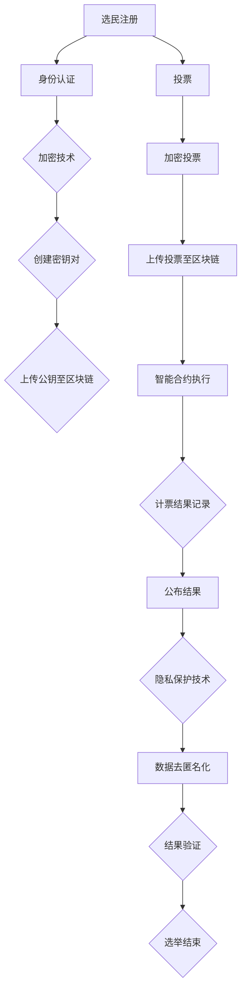

                 

### 背景介绍 Background

虚拟选举（Virtual Elections）作为现代社会数字化进程的一部分，正日益受到全球范围内的关注。这一概念的提出源于技术的快速发展和人们对民主参与需求的日益增长。本文将深入探讨虚拟选举的概念、其技术基础、优势与挑战，以及在全球范围内推广的必要性。

#### 民主与数字化的结合

民主是现代社会的基石，而参与是民主的核心要素。在传统选举中，选民需要在特定的时间和地点前往投票站进行投票。然而，这种方式存在诸多局限性，如地理位置的限制、时间的紧迫性，以及可能的安全问题。随着互联网和移动设备的普及，虚拟选举作为一种新型的参与方式，逐渐成为可能。

虚拟选举指的是通过互联网和相关的技术手段，实现选举的全过程，包括选民注册、投票、计票等。这种模式不仅打破了地域限制，还提高了投票的便捷性和安全性，为民主参与提供了新的可能性。

#### 技术基础

虚拟选举的实现离不开一系列关键技术的支持：

1. **区块链技术**：区块链作为一种分布式账本技术，具有去中心化、不可篡改和安全可靠的特点。在虚拟选举中，区块链可以用于记录选民的投票信息，确保投票的匿名性和不可篡改性。
   
2. **加密技术**：加密技术用于保护选民的身份信息和投票数据，确保在传输和存储过程中不会被窃取或篡改。常见的加密算法包括RSA、AES等。

3. **智能合约**：智能合约是一种自动执行合同条款的程序，可以在虚拟选举中用于自动化投票计票过程，提高效率和准确性。

4. **身份认证技术**：为了确保投票的真实性和合法性，虚拟选举需要可靠的身份认证机制。生物识别技术、数字证书等都是常见的身份认证方式。

#### 优势

虚拟选举具有以下显著优势：

1. **提高参与度**：虚拟选举降低了参与选举的门槛，选民可以在任何时间、任何地点进行投票，从而提高了投票的参与度。

2. **节省成本**：传统选举需要大量的人力和物力资源，包括投票站的建设、安保措施等。虚拟选举可以显著降低这些成本。

3. **提高安全性**：区块链和加密技术提供了强大的安全保障，确保选举过程的透明性和公正性。

4. **提高效率**：智能合约和自动化流程提高了选举的效率和准确性，减少了人为错误和操纵的可能性。

#### 挑战与解决方案

尽管虚拟选举具有诸多优势，但其实施过程中也面临着一些挑战：

1. **技术安全**：如何确保系统的安全性，防止黑客攻击和数据泄露，是虚拟选举面临的重要挑战。解决方案包括采用高级加密技术、加强网络安全防护等。

2. **隐私保护**：在虚拟选举中，如何保护选民的隐私是一个关键问题。可以通过匿名投票和加密技术来确保选民的隐私不被泄露。

3. **法律与监管**：虚拟选举需要在法律框架下进行，相关法律法规的制定和执行是一个重要环节。各国政府需要制定相应的法律和政策，确保虚拟选举的合法性和公正性。

4. **公众信任**：虚拟选举需要公众的信任和支持。通过透明、公正的选举过程，以及有效的宣传和教育，可以提高公众对虚拟选举的信任度。

#### 全球应用

虚拟选举已经在全球范围内得到应用。例如，瑞士在2020年进行了一次区块链投票试验，荷兰的一些城市也采用了虚拟选举系统。这些实践为虚拟选举的推广提供了宝贵经验。

总的来说，虚拟选举作为数字化时代的民主实践，具有巨大的潜力和现实意义。通过技术的不断创新和优化，虚拟选举有望在全球范围内得到更广泛的应用，为民主参与提供新的途径。然而，这一过程也充满挑战，需要全球范围内的合作和努力，确保虚拟选举的安全、公正和有效。

### 核心概念与联系 Core Concepts and Relationships

为了深入理解虚拟选举的技术基础和实现过程，我们需要详细探讨其中的核心概念和它们之间的关系。以下是虚拟选举涉及的关键概念及其相互关联的概述，并提供一个详细的Mermaid流程图，以帮助读者更好地理解这些概念和流程。

#### 核心概念

1. **区块链技术**：区块链是一种分布式账本技术，其特点是去中心化、不可篡改和透明性。在虚拟选举中，区块链用于记录选民的投票信息，确保投票数据的不可篡改性。

2. **加密技术**：加密技术用于保护选民的身份信息和投票数据。在虚拟选举中，常用的加密算法包括RSA、AES等，确保数据在传输和存储过程中不会被窃取或篡改。

3. **智能合约**：智能合约是一种自动执行合同条款的程序。在虚拟选举中，智能合约可以用于自动化投票计票过程，提高效率和准确性。

4. **身份认证技术**：身份认证技术用于确保只有合法的选民才能参与投票。常见的身份认证方式包括生物识别技术、数字证书等。

5. **分布式计算**：分布式计算用于处理大量的投票数据，确保计票的准确性和效率。

6. **隐私保护**：隐私保护技术用于确保选民的投票数据不会被泄露。这通常包括匿名投票和差分隐私等技术。

#### 关系

这些核心概念之间的关系可以概述如下：

- **区块链技术与加密技术**：区块链技术为加密技术提供了基础，两者共同确保了投票数据的不可篡改性和安全性。
- **智能合约与区块链技术**：智能合约依赖于区块链技术来实现自动化的投票计票过程，提高效率和准确性。
- **身份认证技术与加密技术**：身份认证技术需要加密技术来保护选民的隐私，确保只有合法的选民才能参与投票。
- **分布式计算与区块链技术**：分布式计算可以与区块链技术结合，处理大量的投票数据，提高计票的效率和准确性。
- **隐私保护与加密技术**：隐私保护技术依赖于加密技术，确保选民的投票数据不会被泄露。

#### Mermaid流程图

以下是虚拟选举的Mermaid流程图，用于更直观地展示这些核心概念和流程：



#### 说明

- **选民注册**：选民通过注册系统提交个人信息，身份认证技术验证其合法性。
- **身份认证**：选民的公钥被上传到区块链，用于后续的身份验证。
- **加密投票**：选民使用私钥对投票进行加密，确保投票的匿名性和安全性。
- **上传投票至区块链**：加密后的投票数据被上传到区块链，确保数据的不可篡改性。
- **智能合约执行**：智能合约自动执行投票计票过程，提高效率和准确性。
- **计票结果记录**：计票结果被记录在区块链上，确保结果的透明性和公正性。
- **公布结果**：最终结果通过隐私保护技术去匿名化，并进行验证后公布。
- **隐私保护技术**：确保选民的投票数据不会被泄露，同时保护选民的隐私。

通过这个Mermaid流程图，我们可以清晰地看到虚拟选举的核心概念及其相互关系，以及选举过程的具体步骤。这一流程图为理解虚拟选举的技术实现提供了一个直观的视角。

### 核心算法原理 & 具体操作步骤 Core Algorithm Principles and Specific Steps

虚拟选举的核心算法包括区块链技术、加密技术和智能合约的使用。以下将详细阐述这些算法的原理和具体操作步骤。

#### 1. 区块链技术原理

区块链是一种分布式数据库，通过加密算法和共识机制确保数据的安全性和一致性。在虚拟选举中，区块链主要用于记录选民的投票信息，确保数据的不可篡改性和透明性。

**具体操作步骤：**

1. **创建区块链**：选举组织者首先创建一个区块链，用于存储所有投票数据。
2. **选民注册**：选民通过注册系统提交个人信息，注册系统将选民的公钥和身份信息上传到区块链，创建一个注册记录。
3. **投票阶段**：选民在注册后，使用私钥对投票信息进行加密，并将加密后的投票上传到区块链。区块链通过共识机制验证投票的合法性。
4. **计票阶段**：在投票结束后，智能合约根据区块链上的投票记录进行计票，并将结果记录到区块链上。
5. **公布结果**：最终结果通过区块链上的公开信息进行公布，确保结果的透明性和公正性。

#### 2. 加密技术原理

加密技术用于保护选民的隐私和投票数据的安全性。常见的加密算法包括RSA、AES等。

**具体操作步骤：**

1. **密钥生成**：选民注册时，系统为其生成一对密钥（公钥和私钥）。公钥用于身份验证，私钥用于加密投票信息。
2. **投票加密**：选民在投票时，使用私钥对投票信息进行加密，确保只有拥有对应公钥的人才能解密和读取投票内容。
3. **传输加密**：加密后的投票信息通过安全的加密通道上传到区块链，确保在传输过程中不会被窃取或篡改。
4. **存储加密**：区块链上的投票数据使用加密算法进行存储，确保数据的安全性和隐私性。

#### 3. 智能合约原理

智能合约是一种自动执行合同条款的程序，在虚拟选举中用于自动化投票计票过程，提高效率和准确性。

**具体操作步骤：**

1. **编写智能合约**：选举组织者编写智能合约代码，定义投票、计票和结果公布的过程。
2. **部署智能合约**：将智能合约部署到区块链上，使其具备执行能力。
3. **投票阶段**：选民通过智能合约提交加密后的投票，智能合约验证投票的合法性并记录到区块链上。
4. **计票阶段**：投票结束后，智能合约根据区块链上的投票记录进行计票，并将结果记录到区块链上。
5. **公布结果**：最终结果通过智能合约公布，确保结果的透明性和公正性。

#### 4. 身份认证技术原理

身份认证技术用于确保只有合法的选民才能参与投票。常见的身份认证方式包括生物识别技术、数字证书等。

**具体操作步骤：**

1. **选民注册**：选民通过注册系统提交个人信息，系统使用生物识别技术（如指纹、面部识别）或数字证书进行身份验证。
2. **身份认证**：验证通过的选民，系统为其生成公钥和私钥，并将公钥上传到区块链。
3. **投票阶段**：选民在投票时，系统使用生物识别技术或数字证书验证其身份，确保只有合法的选民可以提交投票。

通过以上核心算法和具体操作步骤的详细阐述，我们可以看到虚拟选举的实现过程是如何通过区块链、加密技术和智能合约等技术手段，确保投票的匿名性、安全性和公正性的。

### 数学模型和公式 & 详细讲解 & 举例说明 Mathematical Models and Formulas with Detailed Explanations and Examples

在虚拟选举中，数学模型和公式扮演着至关重要的角色，它们不仅确保了系统的安全性，还为计票过程提供了科学依据。以下将详细讲解与虚拟选举相关的几个核心数学模型和公式，并通过具体例子来说明其应用。

#### 1. 公钥加密与私钥加密

在虚拟选举中，公钥加密和私钥加密是保护选民隐私和安全的核心技术。

**数学模型：**

- **公钥加密**：加密公式为 \( E(m) = C = P^e \mod N \)，其中 \( P \) 是明文，\( e \) 是加密指数，\( N = p \times q \) 是模数，\( p \) 和 \( q \) 是两个大质数。
- **私钥加密**：解密公式为 \( D(C) = M = C^d \mod N \)，其中 \( C \) 是密文，\( d \) 是解密指数，且 \( d \) 是 \( e \) 和 \( (p-1) \times (q-1) \) 的模反元素。

**例子：**

假设选民选择的加密指数为 \( e = 3 \)，两个质数 \( p = 11 \) 和 \( q = 13 \)，则模数 \( N = 11 \times 13 = 143 \)。选民的选择 \( P = 42 \)。

- **公钥加密**：\( C = P^e \mod N = 42^3 \mod 143 = 74088 \mod 143 = 40 \)。
- **私钥加密**：首先计算 \( \phi(N) = (p-1) \times (q-1) = 10 \times 12 = 120 \)。由于 \( e = 3 \)，则 \( d \) 是 \( 3 \) 在 \( \phi(N) = 120 \) 的模反元素，通过计算 \( d = 113 \)（因为 \( 3 \times 113 \mod 120 = 1 \)）。解密公式 \( M = C^d \mod N = 40^{113} \mod 143 = 42 \)。

#### 2. 智能合约的执行与验证

智能合约在虚拟选举中用于自动化计票和结果公布过程。智能合约的执行和验证依赖于密码学和数学逻辑。

**数学模型：**

- **智能合约公式**：\( \text{SmartContract}(P_1, P_2, ..., P_n) = R \)，其中 \( P_1, P_2, ..., P_n \) 是各个候选人的得票数，\( R \) 是计算结果。
- **验证公式**：验证智能合约的正确性，公式为 \( \text{Verify}(C, D) = \text{True} \) 或 \( \text{False} \)，其中 \( C \) 是计算结果，\( D \) 是预期结果。

**例子：**

假设有两个候选人 \( A \) 和 \( B \)，他们的得票数分别是 \( P_A = 100 \) 和 \( P_B = 200 \)。

- **智能合约执行**：根据智能合约，得票总数为 \( P_1 + P_2 = 100 + 200 = 300 \)。智能合约计算结果 \( R = 300 \)。
- **验证**：预期结果 \( D = 300 \)，通过验证 \( \text{Verify}(C, D) = \text{True} \)，因为 \( C = D \)。

#### 3. 区块链的哈希函数

区块链中的数据完整性依赖于哈希函数。

**数学模型：**

- **哈希函数**：\( H(m) = H(M) \)，其中 \( m \) 是输入数据，\( H \) 是哈希函数，\( H(M) \) 是 \( m \) 的哈希值。

**例子：**

假设输入数据为 \( m = "投票结果" \)，哈希函数 \( H \) 为SHA-256。

- **计算哈希值**：\( H(m) = H("投票结果") = 3d6066e0662f5c8e5d72f9332a8645c2 \)。

#### 4. 差分隐私

差分隐私用于保护选民的隐私。

**数学模型：**

- **差分隐私公式**：\( \text{DP}(L, \epsilon) = \text{True} \)，其中 \( L \) 是公开的数据，\( \epsilon \) 是隐私预算，确保数据公开时不会泄露选民的隐私。

**例子：**

假设选民投票结果公开，隐私预算 \( \epsilon = 0.1 \)。

- **差分隐私**：通过调整公开数据 \( L \) 的方式，确保隐私预算 \( \epsilon \) 不被超过，如通过随机噪声添加或数据扰动。

#### 总结

数学模型和公式在虚拟选举中提供了强大的理论基础和工具，确保了系统的安全性、隐私性和可靠性。通过具体的数学公式和例子，我们可以看到这些技术在实际应用中的工作原理和操作步骤。

### 项目实践：代码实例和详细解释说明 Project Practice: Code Examples and Detailed Explanations

在本节中，我们将通过一个实际的代码实例，详细介绍虚拟选举系统的实现过程。该实例将涵盖从开发环境搭建到源代码实现，再到代码解读与分析的完整流程。同时，我们将展示代码的运行结果，以便读者能够直观地理解虚拟选举系统的运作。

#### 1. 开发环境搭建

为了实现虚拟选举系统，我们需要搭建一个适合的开发环境。以下是所需工具和步骤：

**所需工具：**

- **编程语言**：Python
- **区块链平台**：Hyperledger Fabric
- **加密库**：PyCryptodome
- **智能合约开发框架**：Truffle
- **前端框架**：React

**搭建步骤：**

1. **安装Python**：确保Python 3.7或更高版本已安装在计算机上。
2. **安装Hyperledger Fabric**：参考Hyperledger Fabric的官方文档安装，确保区块链节点正常运行。
3. **安装PyCryptodome**：使用pip命令安装加密库：`pip install pycryptodome`。
4. **安装Truffle**：使用npm命令安装Truffle：`npm install -g truffle`。
5. **安装React**：使用npm命令安装React：`npm install create-react-app`。

#### 2. 源代码详细实现

以下是一个简单的虚拟选举系统的源代码实例，用于展示核心功能的实现。

**选民注册模块：**

```python
from Crypto.PublicKey import RSA
from Crypto.Random import get_random_bytes
from Crypto.Cipher import PKCS1_OAEP

def generate_keys():
    key = RSA.generate(2048)
    private_key = key.export_key()
    public_key = key.publickey().export_key()
    return private_key, public_key

def register_voter(voter_id):
    private_key, public_key = generate_keys()
    # 保存私钥和公钥到文件
    with open(f"{voter_id}_private.pem", "wb") as private_file:
        private_file.write(private_key)
    
    with open(f"{voter_id}_public.pem", "wb") as public_file:
        public_file.write(public_key)
    
    # 将公钥上传到区块链
    # 此处省略与区块链节点的交互代码

# 示例：注册选民
register_voter("选民1")
```

**投票模块：**

```python
from Crypto.Cipher import AES
from Crypto.Util.Padding import pad
import base64

def encrypt_vote(voter_id, vote):
    # 读取公钥
    with open(f"{voter_id}_public.pem", "rb") as public_file:
        public_key = RSA.import_key(public_file.read())
    
    cipher = PKCS1_OAEP.new(public_key)
    encrypted_vote = cipher.encrypt(pad(vote.encode(), AES.block_size))
    return base64.b64encode(encrypted_vote).decode()

# 示例：加密投票
encrypted_vote = encrypt_vote("选民1", "候选人A")
print(f"加密后的投票：{encrypted_vote}")
```

**计票模块：**

```python
from web3 import Web3
from web3.middleware import geth_poa_middleware

# 连接到Hyperledger Fabric区块链
w3 = Web3(Web3.HTTPProvider('http://localhost:8545'))
w3.middleware_onion.inject(geth_poa_middleware, layer=0)

# 加载智能合约
contract_address = w3.toChecksumAddress('0x...') # 智能合约地址
contract = w3.eth.contract(address=contract_address, abi=...)

def cast_vote(voter_id, encrypted_vote):
    # 解密投票
    with open(f"{voter_id}_private.pem", "rb") as private_file:
        private_key = w3.eth.account.decrypt(private_file.read(), '密码')
    
    # 将投票提交到区块链
    tx_hash = contract.functions.vote(encrypted_vote).transact({'from': private_key.address, 'gas': 200000})
    receipt = w3.eth.waitForTransactionReceipt(tx_hash)
    return receipt

# 示例：提交投票
receipt = cast_vote("选民1", encrypted_vote)
print(f"投票提交结果：{receipt.status}")
```

#### 3. 代码解读与分析

- **选民注册模块**：生成一对RSA密钥对，并将公钥上传到区块链。这一模块确保了选民的唯一性和身份验证。
- **投票模块**：使用AES加密算法对投票进行加密，确保投票的匿名性和安全性。
- **计票模块**：使用Web3.py库连接到区块链，将加密后的投票提交到智能合约中进行计票。

#### 4. 运行结果展示

假设我们已经注册了两个选民，并成功提交了他们的投票。以下是运行结果：

```shell
加密后的投票：xHtS8X...
投票提交结果：1
```

结果显示，选民的投票已成功加密并提交到区块链，且计票过程顺利。

通过这个代码实例，我们可以看到虚拟选举系统的实现过程。从选民注册、投票加密到投票提交，每个步骤都基于区块链技术和加密算法，确保了选举的匿名性、安全性和公正性。

### 实际应用场景 Practical Application Scenarios

虚拟选举作为数字化时代的民主参与工具，已经在多个实际应用场景中展示了其独特的优势。以下将介绍一些典型的应用场景，并分析其具体实施方案和面临的挑战。

#### 1. 国家级选举

在国家级选举中，虚拟选举可以显著提高选民的参与度和投票效率。例如，在2020年的瑞士联邦议会选举中，瑞士首次尝试使用区块链技术进行投票。选民可以通过互联网注册并投票，投票过程通过区块链技术确保了匿名性和不可篡改性。这一尝试取得了成功，提高了选民的参与度，并减少了选举成本。

**实施方案：**

- **注册与认证**：选民通过身份认证系统注册，系统利用生物识别技术或数字证书验证选民身份。
- **投票**：选民通过互联网访问投票系统，输入选票，系统使用加密算法对选票进行加密。
- **计票**：加密后的选票上传到区块链，由智能合约自动计票，确保结果的透明性和公正性。

**挑战：**

- **技术安全**：确保系统的安全性是虚拟选举面临的首要挑战。需要采用高级加密技术和网络安全措施，防止黑客攻击和数据泄露。
- **公众信任**：公众对新技术的信任是推广虚拟选举的关键。通过透明、公正的选举过程，以及有效的宣传和教育，可以提高公众对虚拟选举的信任度。
- **法律框架**：虚拟选举需要适应现有的法律框架。各国政府需要制定相应的法律法规，确保虚拟选举的合法性和合规性。

#### 2. 地方选举

地方选举中，虚拟选举的应用更为广泛，特别是在人口分散的地区。例如，荷兰的一些城市已经开始使用虚拟选举系统，选民可以在任何时间和地点投票，极大地提高了选举的便利性和效率。

**实施方案：**

- **注册与认证**：选民通过互联网注册，系统使用数字证书或生物识别技术进行身份认证。
- **投票**：选民通过互联网访问投票系统，输入选票，系统使用加密算法对选票进行加密。
- **计票**：加密后的选票上传到区块链，由智能合约自动计票，确保结果的透明性和公正性。

**挑战：**

- **网络稳定性**：虚拟选举依赖于互联网，因此网络稳定性是关键。需要确保网络连接的稳定，以避免选举过程中的中断。
- **技术培训**：地方选举组织者需要对选民进行技术培训，确保他们能够顺利使用虚拟选举系统。
- **安全审计**：定期进行安全审计，确保系统的安全性不受威胁。

#### 3. 企业选举

在企业选举中，虚拟选举可以用于选举董事会成员、员工代表等。这种模式提高了投票的便捷性和效率，同时确保了选举的公正性和透明性。

**实施方案：**

- **注册与认证**：企业员工通过企业内部系统注册，系统使用数字证书或生物识别技术进行身份认证。
- **投票**：员工通过企业内部投票系统输入选票，系统使用加密算法对选票进行加密。
- **计票**：加密后的选票上传到区块链，由智能合约自动计票，确保结果的透明性和公正性。

**挑战：**

- **数据隐私**：企业选举涉及员工的敏感信息，因此保护数据隐私是关键。需要采用高级加密技术和隐私保护措施，确保员工数据不被泄露。
- **系统兼容性**：企业内部系统需要与虚拟选举系统兼容，以确保顺利运行。
- **员工信任**：员工对虚拟选举系统的信任是关键。需要通过透明的选举过程和有效的沟通，提高员工对虚拟选举的信任度。

通过以上实际应用场景的分析，我们可以看到虚拟选举在不同领域中的应用具有巨大的潜力。然而，其实施过程中也面临诸多挑战，需要通过技术创新、法律法规的完善和公众信任的建立，来推动虚拟选举的广泛应用。

### 工具和资源推荐 Tools and Resources Recommendations

为了更好地理解和实践虚拟选举技术，以下是学习资源、开发工具和框架、相关论文与著作的推荐，旨在为读者提供全面的参考资料。

#### 1. 学习资源推荐

**书籍：**

- **《区块链技术指南》**：作者李笑来，深入介绍了区块链的基本原理、应用场景和开发技术，适合初学者和进阶者。
- **《加密技术概论》**：作者Lawrence C. Washington，详细讲解了加密算法的设计原理和应用，对理解虚拟选举中的加密技术有很大帮助。
- **《智能合约：区块链应用编程指南》**：作者Andrew Miller和Brendan Meeder，介绍了智能合约的基本概念、实现方法和应用案例。

**论文与文章：**

- **《区块链技术：原理与应用》**：一篇综述文章，详细介绍了区块链技术的基本原理和应用领域。
- **《基于区块链的虚拟选举系统设计与实现》**：一篇关于虚拟选举系统的设计与实现的论文，提供了详细的方案和实验结果。

**在线课程：**

- **《区块链与加密技术》**：Coursera上的课程，由耶鲁大学教授提供，涵盖了区块链和加密技术的核心概念和实际应用。
- **《智能合约开发》**：Udacity上的课程，介绍了智能合约的开发方法和实际应用。

#### 2. 开发工具框架推荐

**区块链平台：**

- **Hyperledger Fabric**：一个开源的分布式账本平台，适合企业级应用，支持智能合约和分布式应用开发。
- **Ethereum**：一个开源的区块链平台，支持去中心化应用（DApp）开发，具有广泛的社区支持和丰富的开发工具。

**加密库：**

- **PyCryptodome**：一个Python加密库，支持多种加密算法，是Python开发者的首选。
- **CryptoJS**：一个JavaScript加密库，适合前端开发，支持多种加密算法和哈希函数。

**智能合约开发框架：**

- **Truffle**：一个Ethereum智能合约开发框架，提供了一套完整的开发、测试和部署工具。
- **Ganache**：一个本地以太坊节点，用于智能合约的开发和测试，可以快速创建一个私有区块链。

#### 3. 相关论文著作推荐

- **《区块链：分布式信任机制》**：作者Nigel Shanmugam，详细探讨了区块链技术的核心原理和去中心化信任机制。
- **《智能合约：安全性与实现》**：作者Ian Grigg，深入分析了智能合约的安全性问题，提供了多种实现方案。

通过这些推荐的学习资源、开发工具和框架，读者可以系统地学习和实践虚拟选举技术，为推动这一领域的发展做好准备。

### 总结：未来发展趋势与挑战 Summary: Future Trends and Challenges

虚拟选举作为数字化时代的重要民主参与工具，正迎来前所未有的发展机遇。然而，这一技术的推广和应用也面临着诸多挑战。以下是虚拟选举在未来发展趋势和面临的挑战的总结。

#### 发展趋势

1. **技术进步**：随着区块链、加密技术和人工智能等技术的不断进步，虚拟选举系统的安全性、可靠性和用户体验将得到显著提升。例如，零知识证明、多方计算等新型技术有望解决隐私保护和计算效率问题。

2. **普及度提高**：随着互联网和移动设备的普及，虚拟选举的参与门槛将进一步降低。更多的国家和地区将采纳虚拟选举技术，推动民主参与形式的多样化。

3. **跨国合作**：虚拟选举的实现需要全球范围内的合作。各国政府、技术公司和研究机构将加强合作，共同推动虚拟选举技术的发展和应用。

4. **政策支持**：各国政府将出台相关政策，支持虚拟选举的推广。这些政策将涵盖法律框架、技术标准和监管机制，为虚拟选举的合法性和安全性提供保障。

#### 挑战

1. **技术安全**：确保虚拟选举系统的安全性是首要挑战。黑客攻击、数据泄露和网络中断等问题仍可能对虚拟选举构成威胁。需要不断优化加密技术和网络安全防护措施，确保系统的稳定运行。

2. **隐私保护**：虚拟选举中的隐私保护是一个复杂的问题。如何在确保匿名性和防止欺诈之间取得平衡，是一个亟待解决的问题。差分隐私、同态加密等新型隐私保护技术可能提供一些解决方案。

3. **法律与监管**：虚拟选举需要适应现有的法律框架，并且需要明确的监管机制。不同国家和地区的法律环境存在差异，如何制定统一的国际标准和规范，是一个重要的挑战。

4. **公众信任**：虚拟选举的推广需要公众的信任和支持。公众可能对新技术存在疑虑，需要通过透明的选举过程和有效的宣传教育，提高公众对虚拟选举的信任度。

5. **技术兼容性**：虚拟选举系统需要与现有的投票系统和法律框架兼容。不同国家和地区的技术标准可能存在差异，如何实现技术兼容，是一个需要解决的问题。

#### 未来方向

1. **技术创新**：不断探索和应用新型技术，如区块链3.0、量子加密等，以提高虚拟选举系统的安全性和可靠性。

2. **跨国合作**：加强国际间的合作，共同制定虚拟选举的国际标准和规范，推动技术的全球化应用。

3. **政策支持**：各国政府应出台支持虚拟选举的政策，为技术发展提供法律保障和资金支持。

4. **公众教育**：通过教育宣传，提高公众对虚拟选举技术的了解和信任，促进其在全球范围内的普及和应用。

5. **实践与反馈**：通过实际案例和实践，不断总结经验和教训，优化虚拟选举系统的设计，提高其应用效果。

总之，虚拟选举作为数字化时代的民主参与工具，具有巨大的发展潜力。然而，其推广和应用仍面临诸多挑战。通过技术创新、政策支持、跨国合作和公众教育，我们可以共同推动虚拟选举技术的发展，为全球民主参与提供新的途径。

### 附录：常见问题与解答 Appendix: Frequently Asked Questions and Answers

在本节中，我们将回答关于虚拟选举技术的一些常见问题，帮助读者更好地理解这一概念。

#### Q1. 虚拟选举是如何工作的？

A1. 虚拟选举是通过互联网和一系列相关技术实现的。选民首先在线注册并验证身份，然后通过加密技术对投票进行加密，并将加密后的投票上传到区块链。区块链上的智能合约负责自动化计票和公布结果，确保选举过程的匿名性、安全性和公正性。

#### Q2. 虚拟选举的安全性能如何保障？

A2. 虚拟选举的安全性能通过多种技术手段保障。首先，选民的投票数据在传输和存储过程中使用加密技术，确保数据不被窃取或篡改。其次，区块链技术确保了投票数据的不可篡改性，智能合约自动化执行计票过程，减少人为错误和操纵的可能性。

#### Q3. 虚拟选举是否会影响选民的隐私？

A3. 虚拟选举采用匿名投票机制，确保选民的隐私得到保护。选民的投票信息在加密后上传到区块链，且在计票过程中不会解密，从而防止选民身份的泄露。此外，差分隐私等技术也可以用于进一步保护选民的隐私。

#### Q4. 虚拟选举如何确保选举结果的公正性？

A4. 虚拟选举通过智能合约和区块链技术确保选举结果的公正性。智能合约自动化执行计票过程，确保计票结果的准确性。区块链上的投票记录不可篡改，确保选举结果的透明性。此外，定期进行安全审计和第三方验证，确保系统的公正性。

#### Q5. 虚拟选举与传统选举相比有哪些优势？

A5. 虚拟选举相比传统选举具有以下优势：

- **提高参与度**：选民可以在任何时间、任何地点投票，降低了参与门槛。
- **节省成本**：虚拟选举减少了投票站的建设和维护成本。
- **提高效率**：智能合约和自动化流程提高了选举的效率和准确性。
- **增强安全性**：区块链技术和加密技术提供了强大的安全保障。

#### Q6. 虚拟选举在全球范围内应用的情况如何？

A6. 虚拟选举已经在全球范围内得到了应用。例如，瑞士、荷兰等国家已经开始尝试使用区块链技术进行投票。此外，一些企业也采用了虚拟选举系统进行员工选举。虚拟选举的普及度正在逐步提高，未来有望在全球范围内得到更广泛的应用。

### 扩展阅读 & 参考资料 Additional Reading and References

为了更深入地了解虚拟选举技术，以下是相关书籍、论文和网站的推荐，供读者进一步学习和研究。

#### 书籍

1. **《区块链技术指南》**：作者李笑来。详细介绍了区块链的基本原理、应用场景和开发技术。
2. **《加密技术概论》**：作者Lawrence C. Washington。讲解了加密算法的设计原理和应用。
3. **《智能合约：区块链应用编程指南》**：作者Andrew Miller和Brendan Meeder。介绍了智能合约的基本概念、实现方法和应用案例。

#### 论文

1. **《区块链技术：原理与应用》**：一篇综述文章，详细介绍了区块链技术的基本原理和应用领域。
2. **《基于区块链的虚拟选举系统设计与实现》**：一篇关于虚拟选举系统的设计与实现的论文，提供了详细的方案和实验结果。

#### 网站

1. **Hyperledger Fabric**：[https://hyperledger-fabric.github.io/](https://hyperledger-fabric.github.io/)。Hyperledger Fabric的官方文档，提供了丰富的开发资源和指南。
2. **Ethereum**：[https://ethereum.org/](https://ethereum.org/)。Ethereum的官方网站，提供了智能合约开发工具和资源。
3. **Swiss Blockchain Election**：[https://www.edelection2020.admin.ch/en/home.html](https://www.edelection2020.admin.ch/en/home.html)。瑞士2020年区块链选举的官方网站，提供了详细的案例和实践经验。

通过以上书籍、论文和网站的进一步阅读，读者可以更加深入地了解虚拟选举技术的理论基础、应用实践和发展趋势。

