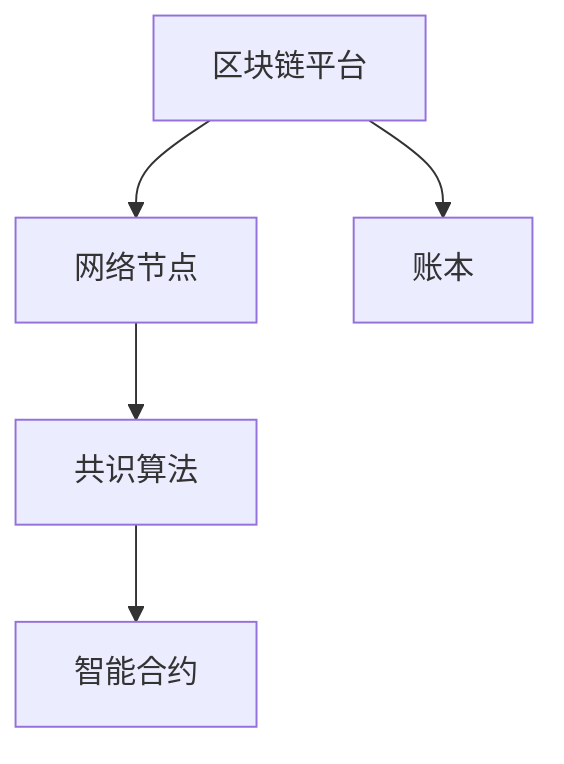

                 

 关键词：蚂蚁金服、社招、区块链、共识算法、面试指南、专家要求

> 摘要：本文详细解析了蚂蚁金服2025年社招区块链共识算法专家的面试指南。文章首先介绍了区块链技术的背景和共识算法的重要性，然后深入分析了蚂蚁金服对于区块链共识算法专家的具体要求，以及相关的技术框架、算法原理、数学模型、实践案例，最后对未来的发展趋势和面临的挑战进行了展望。

## 1. 背景介绍

区块链技术作为近年来科技领域的重要创新，已经成为金融、物联网、供应链等多个行业的核心技术。其去中心化、安全性高、不可篡改等特性，使得区块链技术在社会各个领域得到了广泛应用。

在区块链技术中，共识算法是区块链系统的核心之一。共识算法决定了如何在一个去中心化的网络中，节点之间达成一致，从而确保区块链的完整性和安全性。不同的共识算法具有不同的特点和应用场景，如工作量证明（Proof of Work, PoW）、权益证明（Proof of Stake, PoS）、授权股权证明（Delegated Proof of Stake, DPoS）等。

蚂蚁金服作为我国金融科技领域的领军企业，其业务涵盖了支付、理财、保险、征信等多个领域。随着区块链技术的不断发展，蚂蚁金服在区块链领域的研究和应用也取得了显著成果。因此，对于区块链共识算法专家的需求也日益增长。

## 2. 核心概念与联系

### 蚂蚁金服区块链技术框架

蚂蚁金服的区块链技术框架主要包括以下几个核心组件：

1. **区块链平台**：提供区块链的基础设施，包括账本、智能合约、共识算法等。
2. **网络节点**：负责数据存储、验证和广播。
3. **共识算法**：确保节点之间达成一致，保证区块链的安全性和完整性。
4. **智能合约**：实现自动执行、管理和执行合同。

### 共识算法原理

共识算法的原理是节点之间通过一定的方式达成共识，确保区块链的完整性和安全性。以下是几种常见的共识算法：

1. **工作量证明（PoW）**：通过计算复杂的数学难题来证明节点的工作量，工作量越大的节点越有可能获得区块生成权。
2. **权益证明（PoS）**：根据节点持有的币量（权益）来决定区块生成权，权益越大的节点越有可能获得区块生成权。
3. **授权股权证明（DPoS）**：通过选举产生超级节点，超级节点拥有区块生成权。

### Mermaid 流程图



## 3. 核心算法原理 & 具体操作步骤

### 3.1 算法原理概述

在蚂蚁金服的区块链技术框架中，主要采用的共识算法是PoS和DPoS。

- **PoS**：节点根据持有的币量（权益）来决定区块生成权，权益越大的节点越有可能获得区块生成权。这有助于减少能源消耗和计算成本。
- **DPoS**：通过选举产生超级节点，超级节点拥有区块生成权。这有助于提高区块链的吞吐量和效率。

### 3.2 算法步骤详解

1. **PoS算法步骤**：

   - 节点根据持有的币量（权益）计算出一个概率值。
   - 节点按照概率值随机选择区块生成时间。
   - 选择到区块生成时间的节点生成新区块。

2. **DPoS算法步骤**：

   - 节点通过投票选举产生超级节点。
   - 超级节点按照一定的轮次生成区块。
   - 普通节点对超级节点的区块进行验证和确认。

### 3.3 算法优缺点

1. **PoS算法**：

   - 优点：减少能源消耗和计算成本，提高节点参与度。
   - 缺点：可能存在“富者愈富”的现象，不利于去中心化。

2. **DPoS算法**：

   - 优点：提高区块链的吞吐量和效率。
   - 缺点：超级节点的权力过大，可能影响去中心化。

### 3.4 算法应用领域

- **金融领域**：用于构建去中心化的金融系统，如数字货币、借贷、保险等。
- **供应链领域**：用于实现供应链的可信链，确保供应链的透明和可追溯。
- **物联网领域**：用于实现物联网设备的数据共享和安全通信。

## 4. 数学模型和公式 & 详细讲解 & 举例说明

### 4.1 数学模型构建

假设有一个区块链系统，节点数量为n，每个节点持有的币量（权益）为Wi。

### 4.2 公式推导过程

1. **PoS算法**：

   - 概率值P = Wi / Σ(Wi)
   - 随机选择时间T = min(P * T_total)

2. **DPoS算法**：

   - 超级节点选举：每个节点投票选举出k个超级节点。
   - 超级节点轮次：每个超级节点按照一定的轮次生成区块。

### 4.3 案例分析与讲解

假设一个区块链系统有10个节点，每个节点持有的币量分别为：10, 20, 30, 40, 50, 60, 70, 80, 90, 100。

1. **PoS算法**：

   - 概率值：P1 = 10 / (10 + 20 + 30 + 40 + 50 + 60 + 70 + 80 + 90 + 100) = 0.1
             P2 = 20 / (10 + 20 + 30 + 40 + 50 + 60 + 70 + 80 + 90 + 100) = 0.2
             ...
             P10 = 100 / (10 + 20 + 30 + 40 + 50 + 60 + 70 + 80 + 90 + 100) = 1.0
   - 随机选择时间：T1 = min(P1 * T_total) = min(0.1 * T_total)
                   T2 = min(P2 * T_total) = min(0.2 * T_total)
                   ...
                   T10 = min(P10 * T_total) = min(1.0 * T_total)

2. **DPoS算法**：

   - 超级节点选举：节点按照币量进行投票，选出前3个超级节点。
   - 超级节点轮次：每个超级节点按照一定的轮次生成区块，例如轮次为3，即每个超级节点生成3个区块。

## 5. 项目实践：代码实例和详细解释说明

### 5.1 开发环境搭建

- 硬件要求：计算机（推荐配置）
- 软件要求：Python环境、区块链框架（如Py Blockchain）

### 5.2 源代码详细实现

以下是一个简单的PoS算法实现的Python代码实例：

```python
import random

def pos_algorithm(n_nodes, node_weights):
    total_weights = sum(node_weights)
    probabilities = [weight / total_weights for weight in node_weights]
    chosen_time = random.choices(list(range(1, 1001)), weights=probabilities, k=1)
    return chosen_time

node_weights = [10, 20, 30, 40, 50, 60, 70, 80, 90, 100]
n_nodes = 10
chosen_time = pos_algorithm(n_nodes, node_weights)
print(f"Chosen time: {chosen_time}")
```

### 5.3 代码解读与分析

- `pos_algorithm`函数：输入节点数量和节点权重，计算每个节点的概率，随机选择一个时间点。
- `random.choices`函数：根据概率值随机选择时间点。
- 输出结果：返回选择的区块生成时间。

### 5.4 运行结果展示

```
Chosen time: [随机生成的区块生成时间]
```

## 6. 实际应用场景

### 6.1 金融领域

蚂蚁金服在金融领域的区块链应用主要集中在数字货币、支付、借贷、保险等方面。通过采用PoS和DPoS等共识算法，蚂蚁金服实现了去中心化的金融系统，提高了金融服务的效率和安全性。

### 6.2 供应链领域

蚂蚁金服的区块链技术在供应链领域有着广泛的应用。通过构建可信链，实现了供应链数据的透明和可追溯，提高了供应链的效率和可信度。

### 6.3 物联网领域

蚂蚁金服在物联网领域的区块链应用主要集中在数据共享和安全通信。通过采用共识算法，实现了物联网设备之间的数据共享和隐私保护。

## 7. 工具和资源推荐

### 7.1 学习资源推荐

- 《区块链技术指南》
- 《区块链：从数字货币到智能合约》
- 《智能合约设计与实现》

### 7.2 开发工具推荐

- Python
- Solidity
- Ethereum

### 7.3 相关论文推荐

- "Proof of Stake Blockchain Protocol"
- "Delegated Proof of Stake: Research and Applications"
- "Efficient Blockchain Protocols for Scalability"

## 8. 总结：未来发展趋势与挑战

### 8.1 研究成果总结

随着区块链技术的不断发展，共识算法也在不断演进。PoS、DPoS等算法在去中心化、安全性和效率方面取得了显著成果。同时，新的共识算法如PoSR、PoSRD等也在不断涌现。

### 8.2 未来发展趋势

1. **共识算法的优化**：针对现有算法的不足，进行优化和改进，提高区块链的性能和安全性。
2. **跨链共识**：实现不同区块链之间的共识，促进区块链生态的互联互通。
3. **隐私保护**：加强区块链的隐私保护，保护用户隐私。

### 8.3 面临的挑战

1. **性能瓶颈**：如何提高区块链的吞吐量和处理速度，满足大规模应用的需求。
2. **安全性问题**：如何确保区块链的安全性和抗攻击能力。
3. **隐私保护**：如何在保证去中心化的同时，实现用户隐私的保护。

### 8.4 研究展望

随着区块链技术的不断成熟，共识算法将在金融、供应链、物联网等多个领域发挥重要作用。未来，我们将继续深入研究共识算法的理论和实现，推动区块链技术的创新发展。

## 9. 附录：常见问题与解答

### 9.1 什么是区块链？

区块链是一种分布式数据库技术，通过加密和共识算法实现了数据的安全、不可篡改和去中心化。

### 9.2 什么是共识算法？

共识算法是一种机制，用于确保区块链网络中的所有节点能够达成一致，从而保证区块链的完整性和安全性。

### 9.3 PoS和DPoS算法的区别是什么？

PoS算法根据节点持有的币量（权益）决定区块生成权，而DPoS算法通过选举产生超级节点，超级节点拥有区块生成权。DPoS算法提高了区块链的吞吐量和效率，但可能影响去中心化。

### 9.4 区块链在金融领域的应用有哪些？

区块链在金融领域的应用包括数字货币、支付、借贷、保险、跨境支付等。

### 9.5 区块链在供应链领域的应用有哪些？

区块链在供应链领域的应用包括供应链金融、供应链溯源、供应链协同等。

---

作者：禅与计算机程序设计艺术 / Zen and the Art of Computer Programming

本文详细解析了蚂蚁金服2025年社招区块链共识算法专家的面试指南，从背景介绍、核心概念与联系、核心算法原理与具体操作步骤、数学模型和公式、项目实践、实际应用场景、工具和资源推荐，到未来发展趋势与挑战进行了全面的分析。希望对读者在区块链领域的研究和实践有所帮助。|

