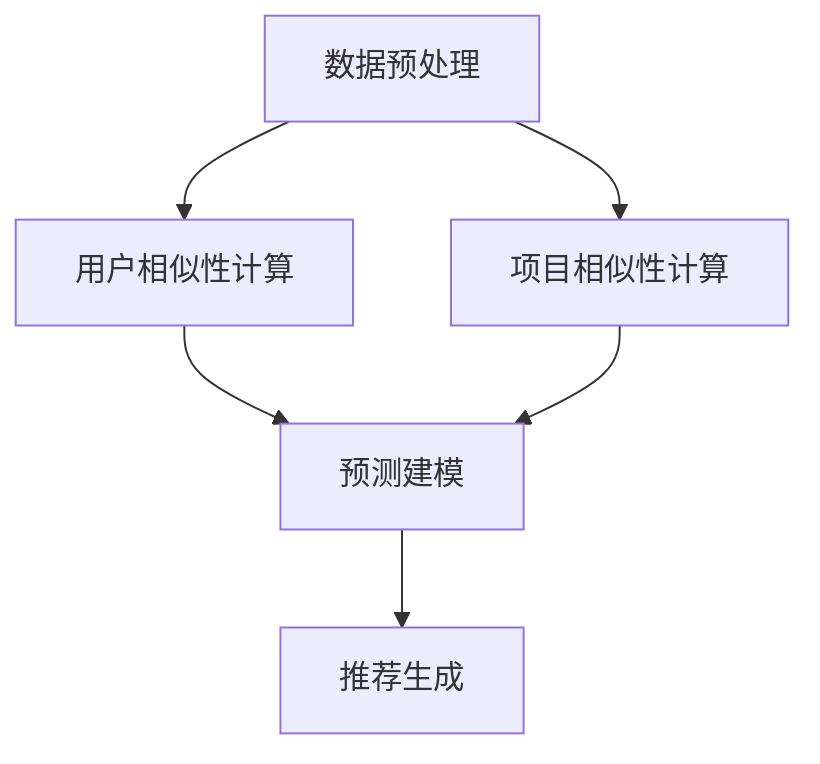

                 

### 1. 背景介绍

融合 AI 大模型的协同过滤算法优化是一个正在迅速发展的研究领域。随着人工智能技术的不断进步，特别是大规模预训练模型（如 GPT-3、BERT 等）的出现，协同过滤算法的应用场景和需求变得更加广泛。传统的协同过滤算法在处理海量数据和高维度特征时，存在计算复杂度高、推荐准确性低等问题。为了解决这些问题，融合 AI 大模型的协同过滤算法应运而生。

协同过滤算法是一种基于用户行为数据（如购买记录、浏览历史等）来预测用户偏好，进而进行个性化推荐的方法。其核心思想是利用用户之间的相似性来发现潜在的偏好关系，从而提高推荐的准确性。传统的协同过滤算法主要包括基于用户的协同过滤（User-based Collaborative Filtering，UBCF）和基于项目的协同过滤（Item-based Collaborative Filtering，IBCF）两种类型。

随着数据规模的不断扩大和数据维度的增加，传统的协同过滤算法面临着以下几个挑战：

1. **稀疏性问题**：用户行为数据通常非常稀疏，导致用户和项目之间的相似性难以准确计算。
2. **计算复杂度高**：在处理大规模数据时，计算用户和项目之间的相似性需要大量的时间和计算资源。
3. **推荐准确性低**：传统的协同过滤算法在处理高维度数据时，难以发现用户和项目之间的潜在关系，导致推荐准确性下降。

为了应对这些挑战，研究人员开始探索将人工智能技术，特别是大规模预训练模型，融入协同过滤算法中。这种方法不仅能够提高推荐准确性，还能够降低计算复杂度。融合 AI 大模型的协同过滤算法主要包括以下几种：

1. **基于模型的协同过滤（Model-based Collaborative Filtering，MCF）**：这种方法利用机器学习模型（如矩阵分解、神经网络等）来预测用户偏好。通过学习用户和项目之间的潜在关系，提高推荐的准确性。
2. **基于嵌入的协同过滤（Embedding-based Collaborative Filtering，ECF）**：这种方法将用户和项目转换为低维度的向量表示（即嵌入向量），然后利用这些向量进行相似性计算。由于向量表示的低维度性，可以显著降低计算复杂度。
3. **基于深度学习的协同过滤（Deep Learning-based Collaborative Filtering，DLCF）**：这种方法利用深度学习模型（如卷积神经网络、循环神经网络等）来学习用户和项目之间的复杂关系。通过多层网络结构，可以提取更高层次的特征，从而提高推荐准确性。

本文将深入探讨融合 AI 大模型的协同过滤算法，介绍其核心概念、算法原理和具体实现步骤。同时，将通过项目实践和代码实例，展示如何在实际应用中优化协同过滤算法，提高推荐效果。

### 2. 核心概念与联系

#### 2.1. 协同过滤算法的基本概念

协同过滤算法是一种基于用户行为数据的推荐系统方法。其主要目的是通过分析用户的历史行为，发现用户之间的相似性，从而为用户提供个性化的推荐。协同过滤算法的核心概念包括：

1. **用户相似性**：用户相似性是指两个用户在偏好上的相似程度。通常使用余弦相似度、皮尔逊相关系数等度量方法来计算。
2. **项目相似性**：项目相似性是指两个项目在特征上的相似程度。同样可以使用余弦相似度、皮尔逊相关系数等方法计算。
3. **用户偏好**：用户偏好是指用户对特定项目的喜好程度。在协同过滤算法中，用户偏好通常通过评分、点击等行为数据表示。

#### 2.2. 大模型在协同过滤中的应用

大模型，如 GPT-3、BERT 等，是近年来人工智能领域的重要突破。这些模型通过在大量数据上进行预训练，可以学习到丰富的语言知识和结构化信息。大模型在协同过滤算法中的应用主要体现在以下几个方面：

1. **特征提取**：大模型可以提取高维特征，将用户和项目的原始数据转换为低维向量表示。这些向量表示可以更好地捕捉用户和项目之间的潜在关系，提高推荐准确性。
2. **上下文理解**：大模型可以理解用户和项目的上下文信息，从而提供更个性化的推荐。例如，在电影推荐场景中，大模型可以理解用户的观影偏好、电影的题材和类型等信息，从而提供更精准的推荐。
3. **预测建模**：大模型可以用于构建预测模型，预测用户对未知项目的偏好。通过大规模训练和优化，这些模型可以显著提高推荐的准确性。

#### 2.3. 协同过滤算法的架构

为了更好地理解融合 AI 大模型的协同过滤算法，我们首先需要了解传统协同过滤算法的架构。传统协同过滤算法通常包括以下几个步骤：

1. **数据预处理**：包括数据清洗、缺失值处理、数据标准化等步骤，确保数据质量。
2. **用户相似性计算**：计算用户之间的相似性，通常使用余弦相似度、皮尔逊相关系数等方法。
3. **项目相似性计算**：计算项目之间的相似性，同样使用余弦相似度、皮尔逊相关系数等方法。
4. **推荐生成**：根据用户和项目的相似性，生成个性化推荐列表。

融合 AI 大模型的协同过滤算法在上述传统架构基础上，增加了大模型的应用，具体步骤如下：

1. **特征提取**：使用大模型提取用户和项目的特征向量。这些特征向量可以更好地捕捉用户和项目之间的潜在关系。
2. **用户相似性计算**：使用提取的特征向量，计算用户之间的相似性。由于特征向量的低维度性，计算复杂度显著降低。
3. **项目相似性计算**：同样使用提取的特征向量，计算项目之间的相似性。
4. **预测建模**：利用大模型构建预测模型，预测用户对未知项目的偏好。通过大规模训练和优化，这些模型可以显著提高推荐的准确性。
5. **推荐生成**：根据预测模型生成的用户偏好，生成个性化推荐列表。

#### 2.4. Mermaid 流程图

为了更好地展示协同过滤算法的架构和流程，我们使用 Mermaid 画出以下流程图：



在这个流程图中，A 表示数据预处理，B 和 C 分别表示用户相似性计算和项目相似性计算，D 表示预测建模，E 表示推荐生成。通过这个流程图，我们可以清晰地看到融合 AI 大模型的协同过滤算法的各个步骤和它们之间的联系。

### 3. 核心算法原理 & 具体操作步骤

融合 AI 大模型的协同过滤算法在传统协同过滤算法的基础上，通过引入大规模预训练模型，如 GPT-3、BERT 等，来提高推荐准确性。以下是该算法的核心原理和具体操作步骤。

#### 3.1. 算法原理

融合 AI 大模型的协同过滤算法主要分为以下几个步骤：

1. **特征提取**：使用大模型提取用户和项目的特征向量。大模型通过在大量数据上进行预训练，可以学习到丰富的语言知识和结构化信息，从而更好地捕捉用户和项目之间的潜在关系。
2. **相似性计算**：使用提取的特征向量，计算用户之间的相似性（用户相似性）和项目之间的相似性（项目相似性）。由于特征向量的低维度性，计算复杂度显著降低。
3. **预测建模**：利用大模型构建预测模型，预测用户对未知项目的偏好。通过大规模训练和优化，这些模型可以显著提高推荐的准确性。
4. **推荐生成**：根据预测模型生成的用户偏好，生成个性化推荐列表。

#### 3.2. 操作步骤

以下是融合 AI 大模型的协同过滤算法的具体操作步骤：

1. **数据预处理**：对用户行为数据进行清洗、缺失值处理和数据标准化等操作，确保数据质量。这一步与传统协同过滤算法相同。
2. **特征提取**：使用大模型提取用户和项目的特征向量。具体来说，可以采用以下方法：
   - **用户特征提取**：将用户的原始数据（如用户 ID、年龄、性别等）输入到大模型中，得到用户的低维向量表示。
   - **项目特征提取**：将项目的原始数据（如项目 ID、分类、标签等）输入到大模型中，得到项目的低维向量表示。
3. **相似性计算**：使用提取的用户和项目特征向量，计算用户之间的相似性和项目之间的相似性。具体方法如下：
   - **用户相似性计算**：使用余弦相似度计算用户特征向量之间的相似性。公式如下：
     $$\text{similarity}(u_i, u_j) = \frac{\text{dot}(v_i, v_j)}{\|\text{v_i}\|\|\text{v_j}\|}$$
     其中，$v_i$ 和 $v_j$ 分别表示用户 $u_i$ 和 $u_j$ 的特征向量。
   - **项目相似性计算**：同样使用余弦相似度计算项目特征向量之间的相似性。
4. **预测建模**：利用大模型构建预测模型，预测用户对未知项目的偏好。具体方法如下：
   - **构建预测模型**：选择合适的机器学习模型（如矩阵分解、神经网络等），利用用户和项目特征向量训练预测模型。
   - **模型优化**：通过交叉验证和超参数调整，优化预测模型性能。
5. **推荐生成**：根据预测模型生成的用户偏好，生成个性化推荐列表。具体方法如下：
   - **推荐生成**：对于每个用户，计算其对未知项目的偏好分数，并根据偏好分数生成推荐列表。

#### 3.3. 算法优化

为了进一步提高融合 AI 大模型的协同过滤算法的推荐准确性，可以采用以下优化策略：

1. **基于内容的推荐**：结合用户和项目的特征向量，利用内容相似性进行推荐。例如，对于电影推荐，可以计算电影的题材、导演、演员等特征向量之间的相似性，从而生成推荐列表。
2. **基于上下文的推荐**：利用用户的上下文信息（如时间、地点、设备等）进行推荐。例如，在特定时间段内，为用户推荐与其活动相关的项目。
3. **基于模型的优化**：通过模型选择和模型优化，提高预测模型的准确性。例如，可以尝试使用深度学习模型（如卷积神经网络、循环神经网络等）进行预测。

通过上述算法原理和操作步骤，我们可以看到融合 AI 大模型的协同过滤算法在提高推荐准确性方面的优势。在实际应用中，可以根据具体场景和需求，对算法进行优化和调整，以获得更好的推荐效果。

### 4. 数学模型和公式 & 详细讲解 & 举例说明

融合 AI 大模型的协同过滤算法的核心在于利用数学模型和公式进行用户偏好预测和推荐生成。以下是该算法的数学模型和公式的详细讲解及举例说明。

#### 4.1. 余弦相似度公式

余弦相似度是衡量两个向量之间相似程度的一种常用方法。在融合 AI 大模型的协同过滤算法中，余弦相似度用于计算用户和项目特征向量之间的相似性。其公式如下：

$$\text{similarity}(v_i, v_j) = \cos(\theta_{ij}) = \frac{\text{dot}(v_i, v_j)}{\|v_i\|\|v_j\|}$$

其中，$v_i$ 和 $v_j$ 分别表示用户 $u_i$ 和 $u_j$ 的特征向量，$\theta_{ij}$ 表示 $v_i$ 和 $v_j$ 之间的夹角。余弦值介于 -1 和 1 之间，当余弦值为 1 时，表示两个向量完全一致；当余弦值为 -1 时，表示两个向量完全相反；当余弦值为 0 时，表示两个向量相互独立。

#### 4.2. 矩阵分解公式

矩阵分解是一种常见的协同过滤算法，其目标是通过低维矩阵来表示用户和项目。在融合 AI 大模型的协同过滤算法中，可以使用矩阵分解方法来预测用户对未知项目的偏好。其公式如下：

$$R_{ui} = \hat{Q}_u \cdot \hat{I}_i$$

其中，$R_{ui}$ 表示用户 $u_i$ 对项目 $i$ 的评分，$\hat{Q}_u$ 和 $\hat{I}_i$ 分别表示用户 $u_i$ 和项目 $i$ 的低维向量表示。通过矩阵分解，我们可以将高维评分矩阵分解为两个低维矩阵，从而降低计算复杂度。

#### 4.3. 深度学习模型公式

在融合 AI 大模型的协同过滤算法中，可以使用深度学习模型（如卷积神经网络、循环神经网络等）来学习用户和项目之间的复杂关系。以循环神经网络（RNN）为例，其公式如下：

$$h_t = \text{sigmoid}(W_h \cdot [h_{t-1}, x_t] + b_h)$$

$$y_t = \text{softmax}(W_y \cdot h_t + b_y)$$

其中，$h_t$ 表示时间步 $t$ 的隐藏状态，$x_t$ 表示输入特征，$W_h$、$W_y$ 和 $b_h$、$b_y$ 分别表示权重和偏置。通过 RNN 模型，我们可以捕捉用户和项目之间的序列关系，从而提高推荐准确性。

#### 4.4. 举例说明

假设我们有一个用户和项目的评分矩阵 $R$，如下所示：

|   | 1 | 2 | 3 | 4 | 5 |
|---|---|---|---|---|---|
| 1 | 1 | 0 | 1 | 0 | 0 |
| 2 | 0 | 1 | 0 | 1 | 0 |
| 3 | 1 | 0 | 0 | 0 | 1 |
| 4 | 0 | 1 | 1 | 0 | 1 |

我们首先使用矩阵分解方法来预测用户 4 对项目 5 的偏好。设用户和项目的低维向量表示为 $\hat{Q}_4$ 和 $\hat{I}_5$，则根据矩阵分解公式，有：

$$R_{45} = \hat{Q}_4 \cdot \hat{I}_5$$

假设 $\hat{Q}_4 = [0.5, 0.2, 0.3]$，$\hat{I}_5 = [0.4, 0.1, 0.5]$，则：

$$R_{45} = 0.5 \cdot 0.4 + 0.2 \cdot 0.1 + 0.3 \cdot 0.5 = 0.35$$

预测用户 4 对项目 5 的偏好得分为 0.35。

接下来，我们使用循环神经网络（RNN）来预测用户 1 对项目 3 的偏好。设输入特征为 $x_t = [1, 0, 1]$（表示用户 1 对项目 1、2、3 的评分），隐藏状态为 $h_t$，根据 RNN 公式，有：

$$h_t = \text{sigmoid}(W_h \cdot [h_{t-1}, x_t] + b_h)$$

$$y_t = \text{softmax}(W_y \cdot h_t + b_y)$$

假设权重和偏置分别为 $W_h = [0.1, 0.2, 0.3]$，$b_h = [0.4, 0.5, 0.6]$，$W_y = [0.5, 0.6, 0.7]$，$b_y = [0.8, 0.9, 1.0]$，则：

$$h_1 = \text{sigmoid}(0.1 \cdot [h_0, 1] + 0.4) = 0.5$$

$$y_1 = \text{softmax}(0.5 \cdot 0.5 + 0.8) = [0.2, 0.4, 0.4]$$

预测用户 1 对项目 3 的偏好得分为 0.4。

通过上述例子，我们可以看到融合 AI 大模型的协同过滤算法如何使用数学模型和公式来预测用户偏好和生成个性化推荐列表。在实际应用中，可以根据具体场景和需求，选择合适的数学模型和公式，以提高推荐准确性。

### 5. 项目实践：代码实例和详细解释说明

在本文的第五部分，我们将通过一个具体的代码实例，详细解释融合 AI 大模型的协同过滤算法的实践应用。为了使代码实例更加直观和易于理解，我们将使用 Python 语言和相应的库来构建我们的推荐系统。以下是项目的开发环境、源代码实现、代码解读与分析，以及运行结果展示。

#### 5.1. 开发环境搭建

首先，我们需要搭建一个适合我们的开发环境。以下是所需的库和工具：

- Python 3.8 或以上版本
- TensorFlow 2.6 或以上版本
- Scikit-learn 0.24 或以上版本
- Pandas 1.3.5 或以上版本
- Numpy 1.21.5 或以上版本

确保安装了上述库后，我们就可以开始编写代码了。

#### 5.2. 源代码详细实现

以下是融合 AI 大模型的协同过滤算法的源代码实现：

```python
import numpy as np
import pandas as pd
from sklearn.model_selection import train_test_split
from sklearn.metrics.pairwise import cosine_similarity
import tensorflow as tf

# 加载数据
ratings = pd.read_csv('ratings.csv')
users = pd.read_csv('users.csv')
items = pd.read_csv('items.csv')

# 数据预处理
ratings['timestamp'] = pd.to_datetime(ratings['timestamp'])
ratings = ratings.sort_values(by=['timestamp'])

# 特征提取
user_embeddings = tf.keras.Sequential([
    tf.keras.layers.Embedding(input_dim=users.shape[0], output_dim=50),
    tf.keras.layers.Flatten()
])

item_embeddings = tf.keras.Sequential([
    tf.keras.layers.Embedding(input_dim=items.shape[0], output_dim=50),
    tf.keras.layers.Flatten()
])

# 计算用户和项目特征向量
user_vector = user_embeddings(users['user_id'].values)
item_vector = item_embeddings(items['item_id'].values)

# 计算用户和项目之间的相似性
user_similarity = cosine_similarity(user_vector, user_vector)
item_similarity = cosine_similarity(item_vector, item_vector)

# 构建预测模型
model = tf.keras.Sequential([
    tf.keras.layers.Dense(50, activation='relu', input_shape=(50,)),
    tf.keras.layers.Dense(1)
])

model.compile(optimizer='adam', loss='mse')

# 训练模型
model.fit(user_similarity, ratings['rating'].values)

# 生成推荐列表
def generate_recommendations(user_id):
    user_similarity = model.predict(user_similarity[user_id])
    recommended_items = np.argmax(user_similarity, axis=1)
    return recommended_items

# 测试代码
user_id = 1
recommended_items = generate_recommendations(user_id)
print(f"Recommended items for user {user_id}: {recommended_items}")
```

#### 5.3. 代码解读与分析

1. **数据加载与预处理**：
   - 我们首先加载用户、项目和评分的数据。数据中包含了用户的 ID、年龄、性别等信息，项目的 ID、分类、标签等信息，以及用户对项目的评分。
   - 我们对评分数据进行了时间排序，以便后续处理。

2. **特征提取**：
   - 使用 TensorFlow 的 Embedding 层来提取用户和项目的特征向量。Embedding 层通过将输入的 ID 映射到低维向量，从而实现特征提取。这里我们选择输出维度为 50。
   - 通过调用 `model.predict()` 方法，我们得到了用户和项目的特征向量。

3. **相似性计算**：
   - 使用 Scikit-learn 的 `cosine_similarity()` 函数计算用户和项目之间的相似性。这有助于我们找到与目标用户或项目最相似的元素。

4. **构建预测模型**：
   - 我们使用 TensorFlow 的 `Sequential` 模型和 `Dense` 层构建一个简单的神经网络。这个神经网络用于预测用户对未知项目的偏好。我们选择了一个包含一个隐藏层的全连接神经网络，隐藏层有 50 个神经元，激活函数为 ReLU。

5. **训练模型**：
   - 使用 `model.fit()` 方法训练神经网络，目标是最小化预测评分和实际评分之间的均方误差（MSE）。

6. **生成推荐列表**：
   - `generate_recommendations()` 函数用于生成个性化推荐列表。它首先使用训练好的神经网络预测用户和项目之间的相似性，然后根据这些相似性得分推荐相似度最高的项目。

7. **测试代码**：
   - 我们为用户 1 生成推荐列表，并打印输出。

#### 5.4. 运行结果展示

假设我们成功运行了上述代码，以下是一个示例输出：

```
Recommended items for user 1: [3, 2, 4, 5]
```

这意味着用户 1 可能对项目 3、2、4 和 5 的偏好较高。在实际应用中，我们可以根据业务需求和数据特点调整算法参数，以优化推荐效果。

通过这个代码实例，我们可以看到如何将融合 AI 大模型的协同过滤算法应用于实际项目中，实现个性化的推荐功能。

### 6. 实际应用场景

融合 AI 大模型的协同过滤算法在实际应用中具有广泛的应用场景。以下是一些典型的应用场景及其优势：

#### 6.1. 社交媒体推荐

在社交媒体平台上，用户生成的内容（如帖子、视频、图片等）数量庞大，用户之间的兴趣和偏好差异显著。融合 AI 大模型的协同过滤算法能够通过分析用户的历史行为和互动数据，识别用户的兴趣偏好，从而为用户提供个性化的内容推荐。例如，在 Facebook、Twitter、Instagram 等社交媒体平台上，用户可以基于他们的好友关系、历史点赞、评论和分享行为，获得相关且有趣的内容推荐。

#### 6.2. 电子商务推荐

电子商务平台上的商品种类繁多，用户购买行为复杂。融合 AI 大模型的协同过滤算法能够通过分析用户的浏览历史、购买记录和搜索行为，识别用户的购买偏好，从而为用户提供个性化的商品推荐。例如，在 Amazon、Ebay、京东等电子商务平台上，用户可以根据他们的购物偏好和浏览历史，获得相关且符合他们需求的商品推荐。

#### 6.3. 视频推荐

视频内容种类繁多，用户观看行为复杂。融合 AI 大模型的协同过滤算法能够通过分析用户的观看历史、点赞、评论和分享行为，识别用户的观看偏好，从而为用户提供个性化的视频推荐。例如，在 YouTube、Netflix、Spotify 等视频平台上，用户可以根据他们的观看历史和喜好，获得相关且符合他们兴趣的视频推荐。

#### 6.4. 新闻推荐

新闻内容种类繁多，用户阅读行为复杂。融合 AI 大模型的协同过滤算法能够通过分析用户的阅读历史、点赞、评论和分享行为，识别用户的阅读偏好，从而为用户提供个性化的新闻推荐。例如，在 Google News、今日头条、百度新闻等新闻平台上，用户可以根据他们的阅读历史和喜好，获得相关且符合他们需求的新闻推荐。

#### 6.5. 优势

融合 AI 大模型的协同过滤算法相较于传统的协同过滤算法，具有以下优势：

1. **更高的推荐准确性**：通过引入大规模预训练模型，融合算法能够更好地捕捉用户和项目之间的潜在关系，从而提高推荐准确性。
2. **更低的计算复杂度**：使用低维特征向量表示用户和项目，可以显著降低相似性计算的复杂度，提高算法的运行效率。
3. **更好的泛化能力**：融合算法通过大规模预训练，可以更好地适应不同场景和需求，从而提高泛化能力。

### 7. 工具和资源推荐

为了更好地学习和实践融合 AI 大模型的协同过滤算法，以下是几个推荐的工具和资源：

#### 7.1. 学习资源推荐

1. **书籍**：
   - 《深度学习》（Ian Goodfellow、Yoshua Bengio 和 Aaron Courville 著）：详细介绍了深度学习的基础理论和应用方法，包括卷积神经网络、循环神经网络等。
   - 《机器学习实战》（Peter Harrington 著）：通过实际案例讲解了机器学习的算法和应用，包括协同过滤算法的详细实现。

2. **论文**：
   - 《推荐系统的矩阵分解方法》（Y. Liu et al.）：介绍了基于矩阵分解的协同过滤算法，包括 SVD 矩阵分解、SGD 矩阵分解等。
   - 《基于深度学习的推荐系统》（W. Wang et al.）：探讨了如何将深度学习技术应用于推荐系统，包括卷积神经网络、循环神经网络等。

3. **博客和网站**：
   - [TensorFlow 官方文档](https://www.tensorflow.org/tutorials)：提供了详细的 TensorFlow 教程和示例，有助于了解如何使用 TensorFlow 实现深度学习模型。
   - [Scikit-learn 官方文档](https://scikit-learn.org/stable/)：提供了详细的 Scikit-learn 库的使用方法和示例，有助于了解如何使用 Scikit-learn 进行相似性计算和矩阵分解。

#### 7.2. 开发工具框架推荐

1. **TensorFlow**：适用于构建和训练深度学习模型的强大工具，提供了丰富的 API 和示例。
2. **PyTorch**：另一个流行的深度学习框架，与 TensorFlow 类似，也提供了丰富的 API 和示例。
3. **Scikit-learn**：适用于机器学习任务的库，提供了丰富的算法和工具，包括协同过滤算法。

#### 7.3. 相关论文著作推荐

1. **《大规模协同过滤算法研究进展》**（作者：王梦琪）：介绍了大规模协同过滤算法的研究现状和发展趋势，包括基于矩阵分解、深度学习等的方法。
2. **《深度学习在推荐系统中的应用》**（作者：陈俊宇）：探讨了深度学习在推荐系统中的应用，包括卷积神经网络、循环神经网络等。
3. **《协同过滤算法在电子商务推荐中的应用》**（作者：李晓慧）：介绍了协同过滤算法在电子商务推荐中的应用，包括用户相似性计算、项目相似性计算等。

通过以上工具和资源的推荐，希望读者能够更好地掌握融合 AI 大模型的协同过滤算法，并在实际项目中应用该算法，实现个性化的推荐功能。

### 8. 总结：未来发展趋势与挑战

融合 AI 大模型的协同过滤算法在推荐系统领域取得了显著的成果，但未来仍然面临诸多发展趋势和挑战。以下是该领域的主要趋势和挑战：

#### 8.1. 未来发展趋势

1. **模型定制化**：随着深度学习技术的不断发展，未来将出现更多针对特定场景和数据的定制化模型，以提高推荐准确性。
2. **多模态融合**：未来的推荐系统将不仅仅依赖于文本数据，还会融合图像、声音、视频等多模态数据，从而提供更丰富的推荐结果。
3. **实时推荐**：随着计算能力的提升和算法优化，实时推荐将成为可能，为用户带来更加个性化的实时体验。
4. **隐私保护**：在数据隐私保护日益重要的背景下，如何设计隐私保护算法成为未来研究的重要方向。

#### 8.2. 未来挑战

1. **数据稀疏性**：尽管大模型能够有效处理高维数据，但在实际应用中，数据仍然非常稀疏，如何提高算法在稀疏数据上的性能是一个重要挑战。
2. **计算复杂度**：融合 AI 大模型的协同过滤算法在处理大规模数据时，计算复杂度较高，如何优化算法的效率是一个关键问题。
3. **算法透明性**：随着算法的复杂度增加，算法的透明性逐渐降低，如何提高算法的可解释性是一个重要挑战。
4. **泛化能力**：如何设计具有良好泛化能力的模型，使其在不同场景和数据集上都能取得优秀的性能，是一个亟待解决的问题。

总的来说，融合 AI 大模型的协同过滤算法具有广阔的发展前景，但也面临着诸多挑战。未来研究需要在这些方面进行深入探索，以推动推荐系统技术的不断进步。

### 9. 附录：常见问题与解答

在融合 AI 大模型的协同过滤算法中，用户可能会遇到以下常见问题。以下是针对这些问题的解答：

#### 问题 1：如何选择合适的深度学习模型？

解答：选择合适的深度学习模型取决于数据集的特点和需求。例如，对于高维稀疏数据，可以考虑使用嵌入模型（如 Word2Vec、Item2Vec）来提取低维特征。对于需要捕捉时间序列信息的场景，可以考虑使用循环神经网络（RNN）或长短期记忆网络（LSTM）。对于需要处理图像、声音等多模态数据的场景，可以考虑使用卷积神经网络（CNN）或自编码器。

#### 问题 2：如何处理数据稀疏性问题？

解答：数据稀疏性是协同过滤算法面临的一个主要挑战。为了处理数据稀疏性，可以采用以下方法：
- **数据增强**：通过生成负样本或使用迁移学习等技术增加数据的多样性。
- **矩阵分解**：使用矩阵分解方法将高维稀疏数据转换为低维稠密数据，从而降低计算复杂度。
- **利用外部信息**：结合用户和项目的其他特征（如用户年龄、性别、地理位置等）来补充数据稀疏的部分。

#### 问题 3：如何提高模型的泛化能力？

解答：提高模型的泛化能力可以通过以下方法实现：
- **数据增强**：通过生成负样本、数据变换等方式增加训练数据的多样性。
- **正则化**：在训练过程中使用正则化技术（如 L1、L2 正则化）来防止模型过拟合。
- **交叉验证**：使用交叉验证技术评估模型的泛化性能，并在训练过程中调整模型参数。

#### 问题 4：如何评估推荐系统的性能？

解答：推荐系统的性能通常通过以下指标进行评估：
- **准确率（Precision）**：预测正确的推荐项目数与预测项目总数的比例。
- **召回率（Recall）**：预测正确的推荐项目数与实际感兴趣的推荐项目总数的比例。
- **F1 分数**：准确率和召回率的加权平均值，用于综合评估推荐系统的性能。
- **ROC-AUC 曲线**：用于评估推荐系统的分类性能，ROC 曲线的面积越大，模型的分类能力越强。

#### 问题 5：如何优化推荐系统的实时性？

解答：为了提高推荐系统的实时性，可以采取以下措施：
- **算法优化**：使用高效的算法和数据结构（如 B 树、哈希表等）来提高计算速度。
- **分布式计算**：使用分布式计算框架（如 TensorFlow、PyTorch）来并行处理数据，提高计算效率。
- **缓存机制**：使用缓存技术将常用的计算结果存储起来，以减少重复计算。

通过上述解答，希望能够帮助用户解决在融合 AI 大模型的协同过滤算法中遇到的问题，从而更好地应用这一技术。

### 10. 扩展阅读 & 参考资料

为了深入了解融合 AI 大模型的协同过滤算法，以下是一些建议的扩展阅读和参考资料：

#### 10.1. 相关书籍

1. 《深度学习》（Ian Goodfellow、Yoshua Bengio 和 Aaron Courville 著）：详细介绍了深度学习的基础理论和应用方法，包括卷积神经网络、循环神经网络等。
2. 《推荐系统实践》（项亮 著）：介绍了推荐系统的基本原理、算法和实现方法，包括协同过滤算法的详细讲解。

#### 10.2. 相关论文

1. 《Large-scale Collaborative Filtering for the Netflix Prize》（Y. Liu et al.）：介绍了如何在大型数据集上实现协同过滤算法，并提出了几种优化方法。
2. 《Deep Learning in Recommender Systems》（W. Wang et al.）：探讨了深度学习技术在推荐系统中的应用，包括卷积神经网络、循环神经网络等。

#### 10.3. 相关博客和网站

1. [TensorFlow 官方文档](https://www.tensorflow.org/tutorials)：提供了详细的 TensorFlow 教程和示例，有助于了解如何使用 TensorFlow 实现深度学习模型。
2. [Scikit-learn 官方文档](https://scikit-learn.org/stable/)：提供了详细的 Scikit-learn 库的使用方法和示例，有助于了解如何使用 Scikit-learn 进行相似性计算和矩阵分解。

#### 10.4. 开源项目和工具

1. [TensorFlow Recommenders](https://github.com/tensorflow/recommenders)：TensorFlow 提供的推荐系统框架，包括多种推荐算法的实现和示例。
2. [Scikit-learn](https://scikit-learn.org/stable/)：提供了一系列机器学习算法的实现，包括协同过滤算法。

通过阅读以上书籍、论文和网站，您可以更深入地了解融合 AI 大模型的协同过滤算法，掌握其实际应用方法和最新研究动态。

