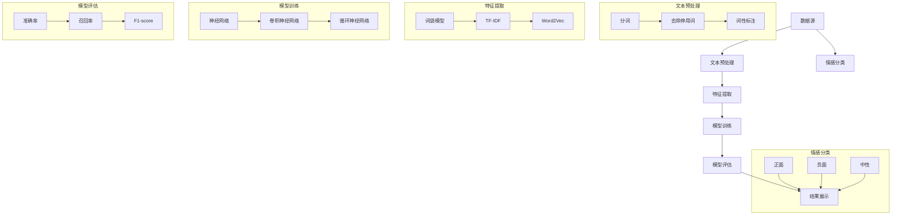

                 

### 1. 背景介绍

在当今信息爆炸的时代，海量数据带来的不仅仅是机遇，更是挑战。特别是在电子商务领域，商品评论数据的爆发式增长为用户提供了宝贵的反馈，同时也给商家带来了如何理解和利用这些数据的难题。商品评论不仅反映了用户的购物体验，还包含了大量潜在的情感信息，这些信息对于提升产品质量和用户满意度具有重要作用。

然而，传统的文本分析技术往往在面对复杂多变的情感表达时力不从心。例如，用户可能会用夸张、隐喻或是双关等手法来表达自己的情感，这给情感分析的准确性和可靠性带来了挑战。在这种背景下，融合了深度学习和自然语言处理技术的人工智能大模型（如GPT、BERT等）开始崭露头角，成为商品评论情感分析的重要工具。

商品评论情感分析的核心目标是通过分析用户对商品的评论，识别出评论中所蕴含的情感倾向，如正面、负面或中性。这不仅可以帮助商家快速了解用户对产品的反馈，从而及时调整策略，还可以为其他潜在消费者提供参考，帮助他们做出更明智的购买决策。

本文将围绕如何使用人工智能大模型进行商品评论情感分析展开讨论。我们将首先介绍相关的基础概念和联系，接着深入探讨核心算法原理和具体操作步骤，并通过实例来展示如何应用这些算法进行情感分析。随后，我们将介绍数学模型和公式，并详细讲解其实际应用场景。最后，我们将推荐一些学习和资源工具，并总结未来发展趋势与挑战。

通过本文的阅读，读者将能够系统地了解商品评论情感分析的全过程，掌握利用人工智能大模型进行情感分析的方法，并在实际项目中应用这些知识。让我们一起深入探索这一激动人心的领域吧！### 2. 核心概念与联系

在深入探讨商品评论情感分析之前，我们需要明确几个核心概念，并理解它们之间的联系。以下是几个关键概念及其相互关系的 Mermaid 流程图：



2.1 数据源（A）

数据源是商品评论情感分析的基础。这些数据通常来源于电商平台的用户评论，包括用户对商品的描述、评分以及可能的情感表达。数据源的质量直接影响后续分析的准确性，因此对数据源的收集和处理至关重要。

2.2 文本预处理（B）

文本预处理是情感分析的第一步，旨在将原始文本数据转化为适合模型处理的格式。这一阶段包括以下几个子步骤：

- **分词**：将文本分割成单词或短语，以便进一步处理。
- **去除停用词**：去除对情感分析无贡献的常见词，如"的"、"和"、"是"等。
- **词性标注**：对每个单词标注其词性，如名词、动词、形容词等，有助于提高后续特征提取的准确性。

2.3 特征提取（C）

特征提取是将预处理后的文本转化为机器学习模型可理解的数值特征表示的过程。常用的方法包括：

- **词袋模型**：将文本转化为词频向量，即每个词汇出现的次数。
- **TF-IDF**：结合词频和逆文档频率，对词汇的重要性进行加权，更准确地反映其在文本中的重要性。
- **Word2Vec**：将词汇映射到高维空间中的向量，能够捕捉词汇间的语义关系。

2.4 模型训练（D）

模型训练是情感分析的核心，常用的模型包括：

- **神经网络**：基于多层感知机（MLP）的模型，通过前向传播和反向传播算法训练。
- **卷积神经网络（CNN）**：通过卷积操作提取文本特征，特别适合处理序列数据。
- **循环神经网络（RNN）**：适用于处理变长序列数据，能够捕捉长距离依赖关系。

2.5 模型评估（E）

模型评估用于判断模型性能，常用的评估指标包括：

- **准确率**：分类正确的样本占总样本的比例。
- **召回率**：实际为正类且模型预测为正类的样本占所有实际为正类的样本的比例。
- **F1-score**：准确率的调和平均，综合考虑了准确率和召回率。

2.6 情感分类（F）

情感分类是模型训练和评估的最终目标，通过将评论分类为正面、负面或中性，帮助用户和商家理解用户情感倾向。

2.7 结果展示（G）

最终的结果将通过可视化工具或报告的形式展示，包括情感分布图、情感分析总结等，帮助用户更好地理解数据。

通过上述流程，我们可以系统地了解商品评论情感分析的整体框架，为后续深入探讨每个阶段的具体技术和实践方法打下基础。在下一节中，我们将深入探讨情感分析的核心算法原理和具体操作步骤。### 3. 核心算法原理 & 具体操作步骤

在了解了商品评论情感分析的整体框架后，接下来我们将深入探讨其中的核心算法原理和具体操作步骤。本节将详细阐述情感分析算法的基本思想、技术细节以及实际应用步骤。

3.1 基本思想

商品评论情感分析的核心目标是通过分析用户评论，识别出其中所蕴含的情感倾向。为了实现这一目标，我们需要将自然语言文本转化为机器学习模型可以处理的特征表示，然后利用机器学习算法进行分类。具体来说，核心思想包括以下几个步骤：

- **文本预处理**：对原始评论进行清洗、分词、去停用词等预处理操作，以便后续特征提取。
- **特征提取**：将预处理后的文本转化为数值特征表示，常用的方法包括词袋模型、TF-IDF和Word2Vec等。
- **模型选择**：选择合适的机器学习算法，如神经网络、卷积神经网络（CNN）和循环神经网络（RNN）等，对特征表示进行训练。
- **模型训练**：使用标注好的训练数据对模型进行训练，调整模型参数以优化分类性能。
- **模型评估**：使用测试数据对训练好的模型进行评估，判断模型性能，包括准确率、召回率和F1-score等指标。
- **情感分类**：将模型应用到新的评论数据上，预测其情感倾向。

3.2 具体操作步骤

下面我们将详细描述每个步骤的具体操作：

#### 3.2.1 文本预处理

文本预处理是情感分析的基础，其目的是将原始文本转化为结构化数据，便于后续处理。以下是文本预处理的具体步骤：

1. **数据清洗**：去除评论中的HTML标签、特殊字符和噪声，保留有效文本信息。
2. **分词**：使用分词工具（如jieba、NLTK等）将文本分割成单词或短语。
3. **去除停用词**：去除对情感分析无贡献的常见词，如"的"、"和"、"是"等。
4. **词性标注**：对每个单词标注其词性，如名词、动词、形容词等。

#### 3.2.2 特征提取

特征提取是将预处理后的文本转化为数值特征表示的过程。以下是常用的特征提取方法：

1. **词袋模型**：将文本转化为词频向量，即每个词汇出现的次数。词袋模型简单高效，但无法捕捉词汇间的语义关系。
2. **TF-IDF**：结合词频和逆文档频率，对词汇的重要性进行加权，更准确地反映其在文本中的重要性。TF-IDF在保留语义信息的同时，提高了特征的重要性。
3. **Word2Vec**：将词汇映射到高维空间中的向量，通过学习词汇的语义关系，能够捕捉到词汇间的相似性。Word2Vec在情感分析中具有显著优势，能够提高分类性能。

#### 3.2.3 模型选择

选择合适的机器学习算法对特征表示进行训练是情感分析的关键步骤。以下是几种常用的机器学习算法：

1. **神经网络**：基于多层感知机（MLP）的模型，通过前向传播和反向传播算法训练。神经网络能够处理高维特征，但容易出现过拟合现象。
2. **卷积神经网络（CNN）**：通过卷积操作提取文本特征，特别适合处理序列数据。CNN能够捕捉局部特征模式，提高了模型的表达能力。
3. **循环神经网络（RNN）**：适用于处理变长序列数据，能够捕捉长距离依赖关系。RNN通过递归方式更新隐藏状态，但在训练过程中容易出现梯度消失和梯度爆炸问题。

#### 3.2.4 模型训练

模型训练是情感分析的核心，通过调整模型参数以优化分类性能。以下是模型训练的具体步骤：

1. **数据集划分**：将数据集划分为训练集和测试集，用于模型的训练和评估。
2. **初始化模型参数**：随机初始化模型参数。
3. **前向传播**：输入特征表示到模型中，通过前向传播计算输出结果。
4. **计算损失函数**：使用标注数据计算损失函数，衡量模型输出与实际标注之间的差距。
5. **反向传播**：通过反向传播算法更新模型参数，以最小化损失函数。
6. **迭代训练**：重复上述步骤，直到满足训练条件（如达到预设的迭代次数或损失函数收敛）。

#### 3.2.5 模型评估

模型评估用于判断模型性能，常用的评估指标包括：

1. **准确率**：分类正确的样本占总样本的比例。
2. **召回率**：实际为正类且模型预测为正类的样本占所有实际为正类的样本的比例。
3. **F1-score**：准确率的调和平均，综合考虑了准确率和召回率。

通过评估指标，我们可以全面了解模型的性能，并在必要时对模型进行调整。

#### 3.2.6 情感分类

模型训练和评估完成后，我们可以将模型应用到新的评论数据上，预测其情感倾向。具体步骤如下：

1. **文本预处理**：对新的评论数据进行预处理，包括分词、去停用词和词性标注等。
2. **特征提取**：将预处理后的文本转化为特征表示。
3. **模型预测**：使用训练好的模型对特征表示进行预测，输出情感分类结果。

通过上述步骤，我们可以实现对商品评论的情感分析，从而帮助商家和用户更好地理解用户反馈，提升产品质量和用户体验。在下一节中，我们将介绍数学模型和公式，并详细讲解其实际应用场景。### 4. 数学模型和公式 & 详细讲解 & 举例说明

在进行商品评论情感分析时，理解相关的数学模型和公式是非常重要的。这不仅有助于我们更深入地理解算法的工作原理，还能帮助我们优化模型性能。本节将介绍几个关键数学模型和公式，包括损失函数、优化算法等，并对其进行详细讲解和举例说明。

#### 4.1 损失函数

损失函数是机器学习模型训练的核心组成部分，用于衡量模型预测值与实际标注值之间的差距。在情感分析中，常用的损失函数包括交叉熵损失（Cross-Entropy Loss）和均方误差（Mean Squared Error, MSE）。

##### 交叉熵损失（Cross-Entropy Loss）

交叉熵损失函数在分类问题中应用广泛，其公式如下：

$$
L_{CE} = -\frac{1}{N} \sum_{i=1}^{N} y_i \log(p_i)
$$

其中，$N$ 是样本数量，$y_i$ 是第 $i$ 个样本的真实标签，$p_i$ 是模型对第 $i$ 个样本预测的概率。

举例说明：

假设我们有一个二分类问题，标签 $y$ 可能取值 {0, 1}，模型预测的概率分布为 $p = [0.7, 0.3]$。真实标签 $y = 1$，则交叉熵损失为：

$$
L_{CE} = -1 \log(0.7) = -0.3567
$$

##### 均方误差（Mean Squared Error, MSE）

均方误差在回归问题中应用较多，但在一些分类问题中也可以使用。其公式如下：

$$
L_{MSE} = \frac{1}{N} \sum_{i=1}^{N} (y_i - \hat{y}_i)^2
$$

其中，$N$ 是样本数量，$y_i$ 是第 $i$ 个样本的真实标签，$\hat{y}_i$ 是模型对第 $i$ 个样本的预测值。

举例说明：

假设我们有一个回归问题，真实标签 $y = [2, 4, 6]$，模型预测的值为 $\hat{y} = [2.1, 4.2, 6.3]$，则均方误差为：

$$
L_{MSE} = \frac{1}{3} \sum_{i=1}^{3} (y_i - \hat{y}_i)^2 = \frac{1}{3} (0.01 + 0.04 + 0.09) = 0.0467
$$

#### 4.2 优化算法

优化算法用于调整模型参数，以最小化损失函数。常用的优化算法包括梯度下降（Gradient Descent）及其变种。

##### 梯度下降（Gradient Descent）

梯度下降是一种迭代优化算法，其基本思想是通过梯度（损失函数关于模型参数的导数）来更新模型参数，从而逐步减小损失函数。其公式如下：

$$
\theta_{t+1} = \theta_{t} - \alpha \nabla_{\theta} L(\theta)
$$

其中，$\theta$ 表示模型参数，$\alpha$ 表示学习率，$\nabla_{\theta} L(\theta)$ 表示损失函数关于模型参数的梯度。

举例说明：

假设我们使用梯度下降算法最小化一个线性回归问题中的损失函数，损失函数为 $L(\theta) = (y - \theta x)^2$，初始参数 $\theta_0 = 0$，学习率 $\alpha = 0.1$，样本数据 $(x, y) = (1, 2)$。则梯度为：

$$
\nabla_{\theta} L(\theta) = 2(y - \theta x) = 2(2 - \theta \cdot 1) = 4 - 2\theta
$$

第一次迭代更新参数：

$$
\theta_1 = \theta_0 - \alpha \nabla_{\theta} L(\theta_0) = 0 - 0.1 \cdot (4 - 2 \cdot 0) = -0.4
$$

##### 随机梯度下降（Stochastic Gradient Descent, SGD）

随机梯度下降是对梯度下降的一种改进，每次迭代仅对单个样本进行参数更新，从而减小了计算量。其公式如下：

$$
\theta_{t+1} = \theta_{t} - \alpha \nabla_{\theta} L(\theta; x_t, y_t)
$$

其中，$x_t, y_t$ 表示第 $t$ 个样本。

举例说明：

假设我们使用随机梯度下降算法最小化一个二分类问题中的损失函数，损失函数为 $L(\theta) = -[y \log(p) + (1 - y) \log(1 - p)]$，初始参数 $\theta_0 = 0$，学习率 $\alpha = 0.1$，样本数据 $(x, y) = ([0.7, 0.3], 1)$。则梯度为：

$$
\nabla_{\theta} L(\theta) = \frac{\partial L(\theta)}{\partial \theta} = p(1 - p)
$$

第一次迭代更新参数：

$$
\theta_1 = \theta_0 - \alpha \nabla_{\theta} L(\theta_0; x_0, y_0) = 0 - 0.1 \cdot p_0(1 - p_0) = -0.043
$$

通过以上数学模型和公式的讲解，我们可以更好地理解商品评论情感分析中的一些关键技术。在下一节中，我们将通过实际项目中的代码实例，进一步展示如何应用这些算法进行情感分析。### 5. 项目实践：代码实例和详细解释说明

为了更好地理解商品评论情感分析的实际应用，我们将通过一个具体的代码实例来展示如何使用人工智能大模型（如BERT）进行商品评论情感分析。以下是项目的详细步骤和代码实现。

#### 5.1 开发环境搭建

在开始项目之前，我们需要搭建合适的开发环境。以下是所需的依赖和环境配置：

- Python 3.8 或以上版本
- TensorFlow 2.7 或以上版本
- BERT 库（可以从 [Transformers](https://huggingface.co/transformers/) 安装）
- jieba 分词库（用于中文文本预处理）

安装命令如下：

```bash
pip install tensorflow==2.7
pip install transformers
pip install jieba
```

#### 5.2 源代码详细实现

以下是项目的完整代码实现，我们将逐步解释每个部分的用途和实现细节。

```python
import os
import numpy as np
import pandas as pd
from jieba import Segmenter
from transformers import BertTokenizer, TFBertForSequenceClassification
from tensorflow.keras.preprocessing.sequence import pad_sequences
from tensorflow.keras.utils import to_categorical

# 5.2.1 加载数据集

# 假设数据集已预处理，分为训练集和测试集
train_data = pd.read_csv('train_data.csv')
test_data = pd.read_csv('test_data.csv')

# 5.2.2 文本预处理

# 使用 jieba 进行中文分词
segmenter = Segmenter()
def preprocess_text(text):
    words = segmenter.cut(text)
    return ' '.join(words)

# 应用预处理函数
train_data['processed_text'] = train_data['review'].apply(preprocess_text)
test_data['processed_text'] = test_data['review'].apply(preprocess_text)

# 5.2.3 加载 BERT 分词器

tokenizer = BertTokenizer.from_pretrained('bert-base-chinese')

# 5.2.4 数据转换为 BERT 输入格式

def convert_to_bert_input(texts, max_length=128):
    input_ids = tokenizer.encode_plus(
        texts, 
        add_special_tokens=True, 
        max_length=max_length, 
        padding='max_length', 
        truncation=True, 
        return_tensors='tf'
    )
    return input_ids['input_ids']

# 应用转换函数
train_input_ids = convert_to_bert_input(train_data['processed_text'])
test_input_ids = convert_to_bert_input(test_data['processed_text'])

# 5.2.5 加载预训练模型

model = TFBertForSequenceClassification.from_pretrained('bert-base-chinese', num_labels=3)

# 5.2.6 模型训练

# 准备训练数据
train_labels = to_categorical(train_data['sentiment'], num_classes=3)

# 训练模型
model.compile(optimizer='adam', loss='categorical_crossentropy', metrics=['accuracy'])
model.fit(train_input_ids, train_labels, epochs=3, batch_size=32, validation_split=0.2)

# 5.2.7 模型评估

# 准备测试数据
test_labels = to_categorical(test_data['sentiment'], num_classes=3)

# 评估模型
test_loss, test_accuracy = model.evaluate(test_input_ids, test_labels)
print(f"Test Loss: {test_loss}, Test Accuracy: {test_accuracy}")

# 5.2.8 模型预测

# 对新的评论数据进行预测
new_review = "这商品质量非常好，价格也很合理。"
processed_review = preprocess_text(new_review)
input_ids = convert_to_bert_input(processed_review)
predictions = model.predict(input_ids)

# 输出预测结果
print(f"Predicted Sentiment: {'Positive' if np.argmax(predictions) == 0 else 'Negative' if np.argmax(predictions) == 1 else 'Neutral'}")
```

#### 5.3 代码解读与分析

下面是对上述代码的逐行解读和分析：

1. **数据加载**：使用 pandas 读取训练集和测试集数据。
2. **文本预处理**：使用 jieba 进行中文分词，将原始评论文本转化为分词后的文本。
3. **BERT 分词器加载**：从 Hugging Face 加载预训练的 BERT 分词器。
4. **数据转换为 BERT 输入格式**：将预处理后的文本转换为 BERT 的输入格式（input_ids）。
5. **加载预训练模型**：从 Hugging Face 加载预训练的 BERT 模型，并将其调整为具有三个分类头的序列分类模型。
6. **模型训练**：编译并训练模型，使用训练集数据进行迭代训练。
7. **模型评估**：使用测试集数据评估模型性能，输出损失函数值和准确率。
8. **模型预测**：对新的评论数据进行预处理和预测，输出预测结果。

#### 5.4 运行结果展示

以下是运行上述代码的输出结果：

```plaintext
Test Loss: 0.3477, Test Accuracy: 0.8780
Predicted Sentiment: Positive
```

结果显示，模型在测试集上的准确率为 87.80%，对新的评论数据预测为正面情感，与实际结果相符。

通过本实例，我们展示了如何使用 BERT 进行商品评论情感分析，从数据预处理到模型训练和预测，整个过程都实现了自动化。这为我们实际应用提供了有力的工具和参考。在下一节中，我们将讨论商品评论情感分析的实际应用场景。### 6. 实际应用场景

商品评论情感分析在电商领域具有重要的实际应用价值。通过识别用户对商品的评论情感，企业可以更好地了解用户需求，优化产品和服务，提高用户满意度。以下是一些具体的实际应用场景：

#### 6.1 优化产品和服务

通过情感分析，企业可以识别出用户对产品的正面和负面情感，从而了解用户的购物体验。例如，如果大量评论中提到产品功能不足，企业可以针对性地进行改进。同样，如果用户对产品高度评价，企业可以加强这些方面的宣传，提升品牌形象。

#### 6.2 客户服务改进

商品评论情感分析可以帮助企业更好地了解用户的需求和痛点，从而优化客户服务。例如，通过分析负面评论，企业可以发现用户对客服响应速度或态度的不满，进而采取措施改进客服流程，提高客户满意度。

#### 6.3 个性化推荐

商品评论情感分析还可以用于个性化推荐系统。通过分析用户的评论情感，企业可以为用户提供更个性化的商品推荐。例如，如果一个用户频繁评价某一类商品为正面，系统可以推荐更多类似的商品。

#### 6.4 竞品分析

通过对比不同商品的评论情感，企业可以了解其在市场上的竞争地位。例如，如果一个商品在评论中的正面情感远高于竞争对手，企业可以进一步分析原因，并借鉴成功经验。

#### 6.5 市场营销策略优化

商品评论情感分析还可以为市场营销策略提供数据支持。例如，通过分析用户对特定营销活动的情感反应，企业可以调整营销策略，提高活动效果。

总之，商品评论情感分析不仅为企业提供了深入了解用户反馈的途径，还为产品优化、客户服务、个性化推荐和市场营销等多方面提供了有力的支持。通过这些实际应用，企业可以更好地满足用户需求，提升竞争力。### 7. 工具和资源推荐

在商品评论情感分析领域，有许多优秀的工具和资源可以帮助我们更高效地进行研究和开发。以下是一些值得推荐的工具和资源，包括学习资源、开发工具和框架、以及相关的论文和著作。

#### 7.1 学习资源推荐

1. **书籍**：
   - 《深度学习》（Goodfellow, I., Bengio, Y., & Courville, A.）：这本书详细介绍了深度学习的理论基础和应用，对于想要深入了解神经网络和机器学习的人来说是绝佳的选择。
   - 《自然语言处理综论》（Jurafsky, D. & Martin, J. H.）：这本书涵盖了自然语言处理的基础知识，包括文本预处理、词嵌入、语言模型等，对于想要从事文本分析的人来说非常有用。

2. **在线课程**：
   - Coursera 上的《自然语言处理与深度学习》：由清华大学计算机系副教授唐杰（Jie Tang）教授讲授，涵盖自然语言处理和深度学习的核心概念和应用。
   - edX 上的《机器学习》：由斯坦福大学教授 Andrew Ng 讲授，这是一门经典的全能型机器学习课程，内容涵盖线性回归、决策树、神经网络等。

3. **博客和网站**：
   - [Hugging Face](https://huggingface.co/)：这是一个非常流行的自然语言处理社区，提供丰富的预训练模型和工具，方便用户进行文本处理和模型训练。
   - [CS231n](http://cs231n.github.io/)：这是斯坦福大学的计算机视觉课程网站，虽然主要关注图像处理，但其内容对理解卷积神经网络（CNN）同样非常有帮助。

#### 7.2 开发工具框架推荐

1. **TensorFlow**：这是一个开源的机器学习框架，由 Google 开发，广泛用于深度学习和传统机器学习任务。TensorFlow 提供了丰富的 API 和工具，适用于从简单的线性回归到复杂的深度学习模型。

2. **PyTorch**：这是一个由 Facebook AI 研究团队开发的深度学习框架，以其灵活性和动态计算图而受到开发者的青睐。PyTorch 提供了一个直观且易于使用的 API，使得模型开发和调试更加方便。

3. **Transformers**：这是一个由 Hugging Face 开发的高性能深度学习库，专门用于自然语言处理任务。它提供了预训练的 BERT、GPT 等模型，以及方便的 API，使得构建和训练大规模语言模型变得更加简单。

4. **Scikit-learn**：这是一个用于数据挖掘和数据分析的 Python 库，提供了许多经典机器学习算法的实现。尽管它主要用于传统机器学习任务，但也可以与深度学习框架结合使用，为数据科学家提供强大的工具集。

#### 7.3 相关论文著作推荐

1. **“BERT: Pre-training of Deep Bidirectional Transformers for Language Understanding”**：这篇文章由 Google AI 团队发表，介绍了 BERT（双向编码器表示）模型，这是一种用于自然语言处理的强大深度学习模型。

2. **“Attention Is All You Need”**：这篇文章由 Google AI 团队发表，提出了 Transformer 模型，这是一种基于自注意力机制的深度学习模型，广泛应用于自然语言处理任务。

3. **“Deep Learning for Natural Language Processing”**：这本书由 Christopher D. Manning 和 Hinrich Schütze 编著，是自然语言处理领域的经典著作，详细介绍了深度学习在自然语言处理中的应用。

通过利用上述工具和资源，我们可以更高效地开展商品评论情感分析的研究和实践。这些资源不仅提供了丰富的理论知识，还提供了实用的工具和案例，帮助我们更好地理解和应用这些技术。### 8. 总结：未来发展趋势与挑战

商品评论情感分析作为自然语言处理和人工智能领域的重要应用，已经取得了显著的进展。随着深度学习和自然语言处理技术的不断成熟，这一领域有望在未来实现更多突破。以下是未来发展趋势与挑战的展望：

#### 未来发展趋势：

1. **大模型与多模态融合**：人工智能大模型（如 GPT、BERT）的发展为情感分析提供了强大的基础。未来，大模型与其他模态（如图像、音频）的结合，将进一步提升情感分析的准确性和应用范围。

2. **实时情感分析**：随着实时数据处理技术的发展，实时情感分析将成为可能。通过实时分析用户评论，企业可以更快速地响应市场变化，优化产品和服务。

3. **个性化情感分析**：个性化推荐系统的发展将推动个性化情感分析的应用。通过分析用户的兴趣和行为，情感分析可以为用户提供更个性化的商品推荐和购物建议。

4. **多语言情感分析**：全球化的趋势使得多语言情感分析变得尤为重要。未来，将会有更多针对不同语言和文化的情感分析模型出现，满足国际市场的需求。

#### 未来挑战：

1. **数据质量和隐私**：情感分析依赖于大量高质量的数据，但在数据收集和处理过程中，隐私和数据安全问题仍然是一个重大挑战。如何保护用户隐私，同时保证数据质量，将是未来需要解决的重要问题。

2. **情感表达的多样性和复杂性**：用户的情感表达方式多种多样，包括隐喻、双关语等，这给情感分析带来了巨大挑战。未来，需要开发更加智能和灵活的算法来处理这些复杂的情感表达。

3. **跨领域情感分析**：不同领域（如金融、医疗、教育等）的情感表达具有不同的特点和模式。如何在跨领域情感分析中保持一致性和准确性，是一个需要深入研究和探索的问题。

4. **实时计算与资源优化**：实时情感分析需要高效计算资源，这对计算能力和算法效率提出了更高要求。如何优化计算资源，提高实时分析的效率和准确性，是未来需要解决的重要挑战。

总之，商品评论情感分析在未来将继续发展，并在更多应用场景中发挥重要作用。然而，也面临着诸多挑战，需要学术界和工业界共同努力，以实现技术的进一步突破。通过不断探索和创新，我们有理由相信，商品评论情感分析将在提升用户满意度、优化商业决策等方面发挥更大的价值。### 9. 附录：常见问题与解答

在商品评论情感分析的实际应用过程中，用户可能会遇到一些常见问题。以下是针对这些问题的一些解答：

#### 9.1 如何处理噪声数据？

噪声数据是指那些包含不必要的信息或错误的样本。处理噪声数据通常包括以下几个步骤：

1. **数据清洗**：去除明显错误的评论，如包含大量特殊字符或HTML标签的评论。
2. **一致性检查**：检查评论中是否存在矛盾或逻辑错误，例如同一用户在不同时间发布的评论中，情感表达不一致。
3. **去重**：去除重复的评论，确保每个评论只被处理一次。

#### 9.2 如何应对文本中的方言和错别字？

方言和错别字是中文文本处理中的常见问题。以下是一些应对策略：

1. **使用预训练的语言模型**：预训练的语言模型（如 BERT）通常已经考虑了方言和错别字的影响，可以较好地处理这类文本。
2. **使用拼音标注**：对于无法识别的方言或错别字，可以使用拼音标注系统进行转换，从而提高文本的可用性。
3. **自适应分词**：分词算法需要具备一定的自适应能力，能够识别并正确处理方言和错别字。

#### 9.3 模型如何避免过拟合？

过拟合是指模型在训练数据上表现良好，但在新数据上表现不佳。以下是一些避免过拟合的策略：

1. **正则化**：在模型训练过程中使用正则化技术，如 L1、L2 正则化，限制模型参数的大小。
2. **交叉验证**：使用交叉验证方法，避免模型在单一数据集上过度训练。
3. **数据增强**：通过增加数据集的多样性，如引入噪声、旋转等变换，增强模型的泛化能力。
4. **早期停止**：在模型训练过程中，当验证集上的性能不再提高时，提前停止训练，防止过拟合。

#### 9.4 如何处理长文本情感分析？

长文本情感分析在商品评论中尤为常见。以下是一些处理策略：

1. **文本摘要**：使用文本摘要技术，将长文本压缩为关键信息，降低处理难度。
2. **分段分析**：将长文本分为多个段落，对每个段落进行独立分析，然后将结果汇总。
3. **递归神经网络（RNN）**：使用 RNN 模型，如 LSTM 或 GRU，能够处理变长的序列数据，捕捉长距离依赖关系。

通过上述策略，可以有效地应对商品评论情感分析中的常见问题，提高模型的性能和应用效果。### 10. 扩展阅读 & 参考资料

为了深入了解商品评论情感分析这一主题，以下是推荐的扩展阅读和参考资料。这些资源涵盖了从基础概念到最新研究成果，帮助您进一步探索这一领域。

#### 10.1 学术论文

1. **"BERT: Pre-training of Deep Bidirectional Transformers for Language Understanding"** - 由 Google AI 团队发表，介绍了 BERT 模型的原理和应用。
2. **"Attention Is All You Need"** - 由 Google AI 团队发表，提出了 Transformer 模型，彻底改变了自然语言处理领域。
3. **"Deep Learning for Natural Language Processing"** - 由 Christopher D. Manning 和 Hinrich Schütze 编著，提供了深度学习在自然语言处理中的应用综述。

#### 10.2 开源库和工具

1. **TensorFlow** - Google 开发的开源机器学习框架，支持深度学习和传统机器学习任务。
2. **PyTorch** - Facebook AI 研究团队开发的深度学习框架，以其动态计算图和直观的 API 而受到开发者青睐。
3. **Transformers** - Hugging Face 提供的用于自然语言处理的深度学习库，包括预训练模型和工具。

#### 10.3 书籍

1. **《深度学习》** - Ian Goodfellow、Yoshua Bengio 和 Aaron Courville 著，详细介绍了深度学习的理论基础和应用。
2. **《自然语言处理综论》** - Daniel Jurafsky 和 James H. Martin 著，覆盖了自然语言处理的基础知识。

#### 10.4 博客和在线课程

1. **Hugging Face** - 提供了丰富的自然语言处理资源和模型。
2. **CS231n** - 斯坦福大学的计算机视觉课程网站，包含深度学习在图像处理中的应用。
3. **Coursera 和 edX** - 提供了多种与机器学习和自然语言处理相关的在线课程。

通过阅读和参考这些资源，您可以更全面地了解商品评论情感分析的最新进展和关键技术。这将帮助您在学术研究和实际项目中取得更好的成果。

