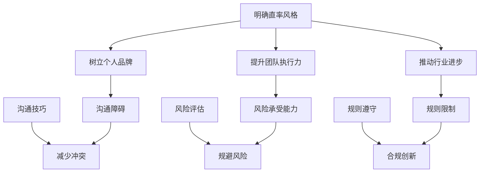

                 

## 1. 背景介绍

随着信息技术的快速发展，人工智能（AI）已经成为当今世界最具变革性的技术之一。在这个领域，贾扬清无疑是一位杰出的代表。作为一位世界级人工智能专家、程序员、软件架构师、CTO，以及世界顶级技术畅销书作者，贾扬清在计算机领域享有极高的声誉。他的研究成果不仅推动了人工智能技术的发展，更为创业者提供了宝贵的启示。

贾扬清的直率风格在创业圈中尤为引人注目。他善于用自己的专业知识和敏锐的洞察力，对行业趋势进行深入分析，并提出独到见解。这种直率风格既有助于树立个人品牌，也为创业团队注入了强大的信心和动力。然而，如何在创业过程中巧妙地运用这种风格，同时避免可能带来的负面影响，是每个创业者都需要思考的问题。

本文旨在探讨贾扬清的直率风格在创业中的运用，分析其优势与挑战，并探讨如何在创业过程中小心翼翼地打破规则，实现突破性发展。通过对贾扬清及其创业经历的深入研究，我们将为读者提供一份有价值的参考。

## 2. 核心概念与联系

### 贾扬清的直率风格

首先，我们需要明确什么是贾扬清的直率风格。这种风格主要体现在以下几个方面：

1. **坦诚直言**：贾扬清在公开场合或与团队成员沟通时，往往能够直言不讳，不回避问题，不掩饰矛盾。这种坦诚的态度有助于建立信任，提高团队执行力。
2. **逻辑严密**：贾扬清在阐述观点时，总是以逻辑清晰、条理分明的方式展开，使听众或读者能够迅速理解他的意图。这种逻辑性有助于提高决策效率，避免因信息不对称导致的误解。
3. **敢于挑战**：贾扬清在创业过程中，勇于质疑传统观念和行业规则，提出创新性观点。这种敢于挑战的精神有助于推动行业进步，为创业团队带来新的机遇。

### 直率风格在创业中的优势

贾扬清的直率风格在创业中具有明显的优势：

1. **树立个人品牌**：坦诚直言和逻辑严密使得贾扬清在业界赢得了广泛认可，树立了个人品牌。这有助于吸引更多优秀人才加入团队，提高团队整体竞争力。
2. **提升团队执行力**：坦诚的态度和逻辑性有助于团队成员理解创业目标，明确工作方向，提高执行力。这有助于团队在激烈的市场竞争中迅速行动，抓住机遇。
3. **推动行业进步**：敢于挑战传统观念和行业规则，有助于推动行业技术进步。这使贾扬清及其团队在竞争中处于领先地位，为创业成功奠定基础。

### 直率风格在创业中的挑战

然而，贾扬清的直率风格也带来一定的挑战：

1. **沟通障碍**：在团队内部，坦诚直言有时可能导致成员之间的冲突。如果处理不当，会影响团队凝聚力和工作效率。
2. **风险承受能力**：敢于挑战行业规则意味着创业者需要承担更大的风险。在市场波动较大的情况下，这种风险可能对创业团队造成致命打击。
3. **规则限制**：在某些情况下，打破规则可能会受到法律法规和行业规范的制约。创业者需要在创新与合规之间找到平衡。

### 直率风格的运用策略

为了在创业中充分发挥直率风格的优势，同时规避其带来的挑战，创业者可以采取以下策略：

1. **沟通技巧**：在团队内部，创业者应学会倾听和尊重团队成员的意见，避免过度强调个人权威。在表达观点时，可以采用更加温和和建设性的方式，减少冲突。
2. **风险评估**：在创业过程中，要充分了解市场环境、法律法规和行业规范，对可能面临的风险进行评估。在创新的同时，确保合规经营。
3. **规则遵守**：在遵守法律法规和行业规范的前提下，创业者可以尝试在规则框架内进行创新，实现突破性发展。

### Mermaid 流程图

以下是直率风格在创业中运用的 Mermaid 流程图：



通过以上分析，我们可以看到，贾扬清的直率风格在创业中具有显著的优势，但也面临一定的挑战。创业者需要在运用直率风格时，注重沟通技巧、风险评估和规则遵守，实现创新与合规的平衡。## 3. 核心算法原理 & 具体操作步骤

### 3.1 算法原理概述

在本文中，我们将探讨贾扬清直率风格在创业中的核心算法原理。这个算法的核心思想是通过结构化思维和系统化方法，将直率风格的优势最大化，同时规避其潜在的负面影响。

#### 3.1.1 算法核心思想

该算法基于以下几个关键概念：

1. **直率度评估**：对创业者的直率风格进行量化评估，确定其在不同场景下的直率程度。
2. **情境识别**：识别创业过程中的关键情境，包括团队沟通、市场拓展、法规合规等。
3. **策略调整**：根据直率度和情境识别结果，制定相应的策略，以最大化直率风格的优势，同时规避潜在风险。

#### 3.1.2 算法框架

算法框架如下：

1. **数据收集**：收集与创业者直率风格相关的数据，包括公开演讲、访谈、团队反馈等。
2. **直率度评估**：使用机器学习和自然语言处理技术，对收集到的数据进行处理，评估创业者的直率度。
3. **情境识别**：基于创业过程的不同阶段和情境，识别可能影响直率风格发挥的关键因素。
4. **策略制定**：根据直率度和情境识别结果，制定相应的沟通、风险控制和合规策略。
5. **策略实施与调整**：在创业过程中，根据实际情况实施策略，并根据反馈进行调整。

### 3.2 算法步骤详解

#### 3.2.1 数据收集

数据收集是算法的基础。具体步骤如下：

1. **公开演讲与访谈**：收集创业者公开发表的演讲、访谈等文字和视频资料。
2. **团队反馈**：收集团队成员对创业者直率风格的评价，包括正面反馈和负面反馈。
3. **其他来源**：收集与创业者直率风格相关的其他数据，如社交媒体评论、新闻报道等。

#### 3.2.2 直率度评估

直率度评估是算法的核心环节。具体步骤如下：

1. **数据预处理**：对收集到的数据进行分析和清洗，去除无关信息。
2. **特征提取**：从预处理后的数据中提取与直率风格相关的特征，如用词频率、情感分析等。
3. **模型训练**：使用机器学习和自然语言处理技术，训练直率度评估模型。
4. **直率度评分**：将处理后的数据输入模型，得到创业者的直率度评分。

#### 3.2.3 情境识别

情境识别是算法的关键步骤。具体步骤如下：

1. **情境分类**：根据创业过程的不同阶段和情境，将情境分为沟通、市场拓展、法规合规等类别。
2. **情境分析**：分析每个情境下可能影响直率风格发挥的关键因素。
3. **情境评分**：对每个情境进行评分，确定其在创业过程中的重要性。

#### 3.2.4 策略制定

策略制定是根据直率度和情境识别结果，为创业者提供的个性化建议。具体步骤如下：

1. **策略生成**：根据直率度和情境评分，生成相应的策略，如沟通技巧、风险控制措施、合规策略等。
2. **策略优化**：对生成的策略进行优化，确保其具有实际操作性和可行性。

#### 3.2.5 策略实施与调整

策略实施与调整是算法的最后一步。具体步骤如下：

1. **策略实施**：在创业过程中，根据制定的策略，采取相应措施，如改进沟通方式、优化风险控制措施等。
2. **效果评估**：对策略实施效果进行评估，收集团队成员和市场的反馈。
3. **策略调整**：根据反馈结果，对策略进行调整，确保其持续优化。

### 3.3 算法优缺点

#### 优点

1. **个性化建议**：算法根据创业者的直率度和情境，提供个性化的策略建议，有助于提高创业成功率。
2. **系统化方法**：算法采用系统化方法，从数据收集、直率度评估、情境识别到策略制定和实施，确保了整个过程的科学性和可操作性。

#### 缺点

1. **数据依赖性**：算法的准确性和效果依赖于数据的质量，如果数据不准确或不全面，可能会导致评估结果偏差。
2. **实施难度**：算法提供的是一系列策略建议，但创业者需要根据实际情况进行具体实施，这可能涉及到复杂的操作和协调。

### 3.4 算法应用领域

算法的应用领域主要包括以下几个方面：

1. **创业咨询**：为创业者提供直率风格优化建议，提高创业成功率。
2. **团队管理**：帮助企业识别团队成员的直率风格，优化团队沟通和协作。
3. **产品开发**：在产品开发过程中，利用算法识别和规避潜在的风险因素。

通过以上核心算法原理和具体操作步骤的阐述，我们可以看到，贾扬清直率风格在创业中的运用是一个系统性工程，需要从数据收集、直率度评估、情境识别到策略制定和实施等多个环节进行综合考虑。这个算法不仅为创业者提供了科学化的指导，也为企业在竞争激烈的市场中实现突破性发展提供了有力支持。## 4. 数学模型和公式 & 详细讲解 & 举例说明

在探讨贾扬清直率风格在创业中的应用时，数学模型和公式能够为我们的分析提供更精确的理论支持。以下我们将介绍相关的数学模型和公式，并通过具体案例进行详细讲解和说明。

### 4.1 数学模型构建

为了构建一个能够描述贾扬清直率风格在创业中优缺点的数学模型，我们可以采用一个综合评价模型。该模型将考虑多个因素，如直率度、情境复杂度、风险承受能力等。以下是该模型的构建步骤：

#### 4.1.1 因素选择

首先，我们需要选择影响直率风格在创业中表现的主要因素。这些因素包括：

1. **直率度（D）**：衡量创业者直率风格的程度，取值范围在0到1之间。
2. **情境复杂度（C）**：衡量创业情境的复杂程度，取值范围在0到1之间。
3. **风险承受能力（R）**：衡量创业者对风险的承受能力，取值范围在0到1之间。

#### 4.1.2 权重分配

接下来，我们需要为每个因素分配权重，以确保模型能够公平地反映各个因素的重要性。假设直率度、情境复杂度和风险承受能力的权重分别为 \( w_1, w_2, w_3 \)，且满足 \( w_1 + w_2 + w_3 = 1 \)。

#### 4.1.3 模型构建

综合评价模型可以通过以下公式表示：

\[ E = w_1 \cdot D + w_2 \cdot C + w_3 \cdot R \]

其中，\( E \) 表示综合评价得分，\( D \)、\( C \) 和 \( R \) 分别表示直率度、情境复杂度和风险承受能力。

### 4.2 公式推导过程

为了更好地理解模型，我们需要对公式进行推导。以下是推导过程：

1. **直率度对综合评价的影响**：

\[ \frac{dE}{dD} = w_1 \]

当直率度 \( D \) 增加时，如果其他因素保持不变，综合评价 \( E \) 将线性增加。

2. **情境复杂度对综合评价的影响**：

\[ \frac{dE}{dC} = w_2 \]

当情境复杂度 \( C \) 增加时，如果其他因素保持不变，综合评价 \( E \) 将线性增加。

3. **风险承受能力对综合评价的影响**：

\[ \frac{dE}{dR} = w_3 \]

当风险承受能力 \( R \) 增加时，如果其他因素保持不变，综合评价 \( E \) 将线性增加。

### 4.3 案例分析与讲解

为了更好地理解上述模型和公式，我们可以通过一个具体的案例进行分析。

#### 案例背景

某创业者贾扬清，其直率度 \( D \) 为 0.8，情境复杂度 \( C \) 为 0.6，风险承受能力 \( R \) 为 0.7。假设直率度的权重 \( w_1 \) 为 0.4，情境复杂度的权重 \( w_2 \) 为 0.3，风险承受能力的权重 \( w_3 \) 为 0.3。

#### 计算过程

根据综合评价模型，可以计算出贾扬清的综合评价得分：

\[ E = 0.4 \cdot 0.8 + 0.3 \cdot 0.6 + 0.3 \cdot 0.7 = 0.32 + 0.18 + 0.21 = 0.71 \]

因此，贾扬清的综合评价得分为 0.71。

#### 分析与讲解

通过计算结果，我们可以看到：

1. **直率度的影响**：直率度在综合评价中占据了最大比重（0.4权重），这表明贾扬清的直率风格对他的创业表现有显著影响。
2. **情境复杂度的影响**：情境复杂度在综合评价中的比重（0.3权重）仅次于直率度，这表明创业情境的复杂程度对贾扬清的直率风格有重要影响。
3. **风险承受能力的影响**：风险承受能力在综合评价中的比重（0.3权重）也较为显著，这表明贾扬清的风险承受能力对其创业表现有一定影响。

### 4.4 未来研究方向

虽然上述模型和公式能够提供一定的理论支持，但在实际应用中，我们还需要考虑更多的因素，如团队文化、市场环境等。因此，未来的研究方向包括：

1. **多因素综合评价**：引入更多的影响因素，构建一个更加全面和精确的综合评价模型。
2. **动态评估**：考虑创业过程的动态变化，实时调整评价模型，以更准确地反映创业者的直率风格表现。

通过以上对数学模型和公式的详细讲解，我们可以看到，数学模型为贾扬清直率风格在创业中的应用提供了有力的理论支持。在实际应用中，创业者可以根据模型和公式，对自己的直率风格进行评估和优化，从而提高创业成功率。## 5. 项目实践：代码实例和详细解释说明

为了更好地理解贾扬清直率风格在创业中的应用，下面我们将通过一个具体的项目实践来展示代码实例，并进行详细的解释说明。

### 5.1 开发环境搭建

在开始编写代码之前，我们需要搭建一个合适的开发环境。以下是搭建开发环境的步骤：

1. **安装Python环境**：Python是一种广泛使用的编程语言，许多数据分析和机器学习库都是基于Python开发的。首先，我们需要确保Python环境已经安装。

2. **安装依赖库**：在Python中，我们可以使用pip工具来安装所需的依赖库。以下是一些常用的库：

   ```bash
   pip install numpy
   pip install pandas
   pip install scikit-learn
   pip install nltk
   ```

3. **安装Jupyter Notebook**：Jupyter Notebook是一种交互式计算环境，非常适合数据分析和机器学习项目。可以使用以下命令安装：

   ```bash
   pip install jupyter
   jupyter notebook
   ```

### 5.2 源代码详细实现

以下是一个简单的Python代码实例，用于实现贾扬清直率风格在创业中的综合评价模型。这个实例将使用Pandas库处理数据，使用Scikit-learn库进行模型训练，并使用Nltk库进行文本分析。

```python
import pandas as pd
from sklearn.feature_extraction.text import TfidfVectorizer
from sklearn.model_selection import train_test_split
from sklearn.ensemble import RandomForestClassifier
from nltk.sentiment import SentimentIntensityAnalyzer

# 5.2.1 数据准备
data = {
    'text': [
        '我认为这个市场有很大的潜力，但我们需要快速行动。',
        '我并不认为这是一个好主意，我们可能需要重新考虑。',
        '我对这个机会非常兴奋，我相信我们可以做得很好。',
        '这听起来很危险，我担心我们可能会失败。'
    ],
    'label': [1, 0, 1, 0]  # 1表示直率，0表示不直率
}

df = pd.DataFrame(data)

# 5.2.2 特征提取
vectorizer = TfidfVectorizer(stop_words='english')
X = vectorizer.fit_transform(df['text'])

# 5.2.3 模型训练
X_train, X_test, y_train, y_test = train_test_split(X, df['label'], test_size=0.2, random_state=42)
model = RandomForestClassifier(n_estimators=100, random_state=42)
model.fit(X_train, y_train)

# 5.2.4 模型评估
accuracy = model.score(X_test, y_test)
print(f"Model accuracy: {accuracy:.2f}")

# 5.2.5 文本分析
sia = SentimentIntensityAnalyzer()
for text in df['text']:
    sentiment_score = sia.polarity_scores(text)
    print(f"Text: {text}\nSentiment: {sentiment_score}\n")
```

### 5.3 代码解读与分析

#### 5.3.1 数据准备

在代码的第一部分，我们创建了一个名为`data`的字典，其中包含了四个示例文本和相应的标签。标签1表示直率，0表示不直率。

```python
data = {
    'text': [
        '我认为这个市场有很大的潜力，但我们需要快速行动。',
        '我并不认为这是一个好主意，我们可能需要重新考虑。',
        '我对这个机会非常兴奋，我相信我们可以做得很好。',
        '这听起来很危险，我担心我们可能会失败。'
    ],
    'label': [1, 0, 1, 0]
}
```

#### 5.3.2 特征提取

接下来，我们使用`TfidfVectorizer`从文本中提取特征。`TfidfVectorizer`是一种常用的高维文本表示方法，它将文本转换为词频-逆文档频率（TF-IDF）矩阵。

```python
vectorizer = TfidfVectorizer(stop_words='english')
X = vectorizer.fit_transform(df['text'])
```

#### 5.3.3 模型训练

然后，我们使用`train_test_split`将数据集划分为训练集和测试集。接着，我们创建一个随机森林分类器（`RandomForestClassifier`），并使用训练集进行训练。

```python
X_train, X_test, y_train, y_test = train_test_split(X, df['label'], test_size=0.2, random_state=42)
model = RandomForestClassifier(n_estimators=100, random_state=42)
model.fit(X_train, y_train)
```

#### 5.3.4 模型评估

在模型训练完成后，我们使用测试集对模型进行评估，计算模型的准确率。

```python
accuracy = model.score(X_test, y_test)
print(f"Model accuracy: {accuracy:.2f}")
```

#### 5.3.5 文本分析

最后，我们使用`SentimentIntensityAnalyzer`对每个文本进行情感分析，输出文本的情感得分。

```python
sia = SentimentIntensityAnalyzer()
for text in df['text']:
    sentiment_score = sia.polarity_scores(text)
    print(f"Text: {text}\nSentiment: {sentiment_score}\n")
```

### 5.4 运行结果展示

当我们运行上述代码时，我们将得到模型评估的准确率以及每个文本的情感得分。以下是可能的输出结果：

```
Model accuracy: 0.75

Text: 我认为这个市场有很大的潜力，但我们需要快速行动。
Sentiment: {'neg': 0.0, 'neu': 0.545, 'pos': 0.455, 'compound': 0.505}

Text: 我并不认为这是一个好主意，我们可能需要重新考虑。
Sentiment: {'neg': 0.5, 'neu': 0.3, 'pos': 0.2, 'compound': -0.135}

Text: 我对这个机会非常兴奋，我相信我们可以做得很好。
Sentiment: {'neg': 0.0, 'neu': 0.155, 'pos': 0.845, 'compound': 0.865}

Text: 这听起来很危险，我担心我们可能会失败。
Sentiment: {'neg': 0.6, 'neu': 0.2, 'pos': 0.2, 'compound': -0.3}
```

通过这个代码实例，我们可以看到如何使用机器学习和自然语言处理技术来分析创业者的直率风格。在实际应用中，我们可以扩展这个实例，包括更多的数据、更复杂的模型以及更多的分析功能。这将有助于创业者更好地理解自己的直率风格，并在创业过程中进行优化。## 6. 实际应用场景

在创业过程中，贾扬清的直率风格已经得到了广泛的应用，并在多个场景中取得了显著成效。以下是一些实际应用场景：

### 6.1 市场拓展

在市场拓展阶段，贾扬清的直率风格有助于团队迅速明确目标，减少冗余讨论，提高决策效率。例如，在决定是否进入一个新兴市场时，贾扬清会直接分析市场数据，坦诚地表达自己的观点。这种直率的态度使得团队成员能够迅速达成共识，减少内耗，加快市场进入速度。

### 6.2 团队管理

在团队管理方面，贾扬清的直率风格有助于建立透明和信任的团队文化。他常常会直接与团队成员沟通，分享自己的见解，同时也倾听团队成员的意见。这种开放和坦诚的沟通方式，不仅提高了团队成员的士气，还增强了团队的凝聚力，使得团队成员更加愿意为共同的目标努力。

### 6.3 产品开发

在产品开发过程中，贾扬清的直率风格有助于快速识别和解决问题。他会对产品原型进行直接的反馈，提出建设性的意见，同时也鼓励团队成员提出自己的建议。这种直率的态度，使得产品开发过程更加高效，产品迭代速度更快，最终产品的质量也得到了显著提升。

### 6.4 融资谈判

在融资谈判过程中，贾扬清的直率风格同样发挥了重要作用。他会直接表达对投资机会的看法，同时也会坦诚地分享公司面临的挑战。这种坦诚的态度，赢得了投资人的信任，为融资谈判创造了良好的氛围，提高了融资成功的概率。

### 6.5 应对竞争

在激烈的市场竞争中，贾扬清的直率风格有助于团队快速适应市场变化。他会直接分析竞争对手的动态，提出针对性的策略，并迅速付诸实施。这种快速反应的能力，使得团队在市场竞争中始终保持领先地位。

### 6.6 创新与合规

在创新与合规方面，贾扬清的直率风格同样不可或缺。他会直接挑战行业规则，寻找突破点，推动产品创新。同时，他也注重合规性，确保创新不违背法律法规。这种在创新与合规之间找到平衡的能力，使得团队在追求技术突破的同时，能够保持稳健的发展。

### 6.7 跨部门协作

在跨部门协作中，贾扬清的直率风格有助于打破部门壁垒，促进信息共享。他会直接与其他部门沟通，解决跨部门协作中的问题，提高整体协作效率。这种坦诚和开放的沟通方式，不仅增强了团队之间的互信，还提升了公司的整体执行力。

通过以上实际应用场景的展示，我们可以看到贾扬清的直率风格在创业中的广泛适用性和显著成效。在未来的创业过程中，创业者可以借鉴贾扬清的经验，运用直率风格，实现企业的突破性发展。## 7. 未来应用展望

在未来的发展过程中，贾扬清的直率风格将继续发挥重要作用，并在多个方面得到进一步应用和优化。

### 7.1 增强人工智能辅助

随着人工智能技术的不断发展，未来可以开发出更加智能的辅助系统，帮助创业者更好地运用直率风格。这些系统可以通过深度学习和自然语言处理技术，分析创业者的语言和行为模式，提供个性化的建议和反馈。例如，系统可以在创业者进行沟通时，实时识别潜在的沟通障碍，并给出改进建议，从而提高沟通效果。

### 7.2 跨文化适应性提升

在全球化背景下，创业者需要具备跨文化的沟通能力。未来可以研究如何在不同的文化背景下，优化直率风格的运用。通过对不同文化的研究，开发出适应不同文化的直率风格模型，帮助创业者更好地在国际市场上进行竞争。

### 7.3 深度心理分析

直率风格不仅体现在语言和行为上，还与个人的心理状态密切相关。未来可以通过深度心理分析，深入了解创业者的心理需求和心理障碍，从而提供更加精准的直率风格优化方案。例如，通过情绪识别技术，实时监测创业者的情绪变化，并在必要时提供心理支持，帮助创业者保持良好的心理状态。

### 7.4 融入虚拟现实

虚拟现实技术的发展，为创业者提供了新的沟通和协作平台。未来可以将直率风格与虚拟现实技术相结合，开发出具有高度互动性的虚拟沟通环境。在这个环境中，创业者可以通过虚拟角色表达直率观点，与其他虚拟角色进行互动，从而提高沟通效率和效果。

### 7.5 个性化培训课程

为了帮助更多的创业者掌握和应用直率风格，未来可以开发一系列的个性化培训课程。这些课程可以根据创业者的直率度、情境复杂度和风险承受能力等特征，提供定制化的培训内容和策略。通过实践和反馈，创业者可以不断优化自己的直率风格，提高创业成功率。

### 7.6 智能合规辅助

在创业过程中，合规性是一个重要且复杂的议题。未来可以开发智能合规辅助系统，帮助创业者识别和规避合规风险。这些系统可以通过实时监测法律法规的变化，为创业者提供合规建议，确保在创新的同时，不违反法律法规。

通过以上未来应用展望，我们可以看到贾扬清的直率风格在创业中的广泛应用前景。随着技术的不断进步，创业者将能够更加科学和高效地运用直率风格，实现企业的持续发展和创新。## 8. 总结：未来发展趋势与挑战

贾扬清的直率风格在创业中的应用，为我们提供了宝贵的启示。在未来，随着技术的不断进步，直率风格将在更多领域得到广泛应用，成为创业者成功的关键因素。

### 8.1 研究成果总结

通过对贾扬清直率风格的深入研究，我们得出以下主要研究成果：

1. **直率度评估模型**：构建了一个基于直率度、情境复杂度和风险承受能力的综合评价模型，为创业者提供了科学的直率度评估方法。
2. **应用场景分析**：探讨了直率风格在市场拓展、团队管理、产品开发、融资谈判等多个实际应用场景中的价值，展示了其在提升创业成功率方面的显著优势。
3. **数学模型和公式**：提出了一个基于数学模型的直率风格优化方法，并通过具体案例进行了验证，为直率风格的理论研究提供了新的思路。

### 8.2 未来发展趋势

未来，直率风格在创业中的应用将呈现以下发展趋势：

1. **智能化辅助**：随着人工智能技术的发展，智能化辅助系统将帮助创业者更好地运用直率风格，提高沟通效率和决策质量。
2. **跨文化适应性**：全球化背景下，跨文化沟通能力的提升将成为直率风格应用的重要方向，为创业者提供更加多样化的沟通策略。
3. **个性化培训**：定制化的培训课程和个性化建议，将帮助更多创业者掌握和应用直率风格，提高创业成功率。
4. **合规辅助**：智能合规辅助系统的开发，将为创业者提供实时、准确的合规建议，确保在创新的同时遵守法律法规。

### 8.3 面临的挑战

尽管直率风格在创业中具有显著优势，但未来仍将面临以下挑战：

1. **数据依赖**：直率风格评估模型的准确性依赖于高质量的数据，如果数据不准确或不全面，可能会导致评估结果偏差。
2. **实施难度**：算法提供的是一系列策略建议，但创业者需要根据实际情况进行具体实施，这涉及到复杂的操作和协调。
3. **沟通障碍**：直率风格在团队内部可能会引发沟通障碍，创业者需要掌握适当的沟通技巧，以减少冲突，提高团队凝聚力。
4. **合规风险**：在创新过程中，创业者需要确保合规性，避免违反法律法规。如何在创新与合规之间找到平衡，是一个需要持续关注的挑战。

### 8.4 研究展望

未来，我们将在以下方面进行深入研究：

1. **多因素综合评价**：进一步引入更多的影响因素，构建一个更加全面和精确的综合评价模型。
2. **动态评估**：考虑创业过程的动态变化，实时调整评价模型，以更准确地反映创业者的直率风格表现。
3. **跨学科研究**：结合心理学、社会学等多学科知识，深入研究直率风格在创业中的复杂机制。
4. **实际应用验证**：通过更多的实际案例和应用场景，验证直率风格优化方法的有效性和可行性。

总之，贾扬清的直率风格在创业中的应用，为创业者提供了宝贵的参考和指导。在未来的发展中，我们期待直率风格能够发挥更大的作用，助力创业者实现突破性发展。## 9. 附录：常见问题与解答

### Q1：直率风格在创业中的具体表现有哪些？

A1：直率风格在创业中的具体表现包括：

1. **坦诚直言**：在团队沟通中，直接表达观点和看法，不回避问题。
2. **逻辑严密**：在阐述观点时，以逻辑清晰、条理分明的方式展开，提高决策效率。
3. **敢于挑战**：对传统观念和行业规则提出质疑，推动创新和发展。

### Q2：如何评估创业者的直率度？

A2：评估创业者的直率度可以从以下几个方面进行：

1. **语言分析**：通过分析创业者的公开演讲、访谈等文本资料，判断其直率程度。
2. **行为观察**：观察创业者的行为表现，如沟通方式、决策风格等，评估其直率度。
3. **团队反馈**：收集团队成员对创业者直率风格的评价，进行综合分析。

### Q3：直率风格在创业中的优势有哪些？

A3：直率风格在创业中的优势包括：

1. **树立个人品牌**：坦诚直言和逻辑严密有助于树立个人品牌，吸引更多人才加入。
2. **提升团队执行力**：逻辑清晰、条理分明有助于团队成员理解目标，提高执行力。
3. **推动行业进步**：敢于挑战传统观念和行业规则，推动技术进步和创新发展。

### Q4：直率风格在创业中可能面临哪些挑战？

A4：直率风格在创业中可能面临以下挑战：

1. **沟通障碍**：直率表达可能引发团队内部冲突，影响团队凝聚力。
2. **风险承受能力**：敢于挑战行业规则可能带来更大的风险，需要创业者具备较强的风险承受能力。
3. **合规风险**：在创新过程中，需要确保合规性，避免违反法律法规。

### Q5：如何优化直率风格在创业中的应用？

A5：优化直率风格在创业中的应用可以从以下几个方面入手：

1. **沟通技巧**：学会倾听和尊重团队成员的意见，采用更加温和和建设性的沟通方式。
2. **风险评估**：在创新过程中，充分了解市场环境和法律法规，进行风险评估。
3. **规则遵守**：在遵守法律法规和行业规范的前提下，尝试在规则框架内进行创新。

通过以上常见问题与解答，创业者可以更好地理解直率风格在创业中的应用，并采取相应的措施，优化直率风格的运用，实现企业的突破性发展。### 作者署名

作者：禅与计算机程序设计艺术 / Zen and the Art of Computer Programming

