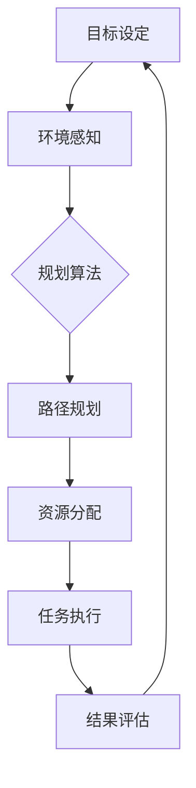

                 

在当今技术飞速发展的时代，人工智能（AI）已经成为推动各行各业进步的关键驱动力。AI Agent，即人工智能代理，作为AI领域的一个重要组成部分，正逐渐在多个领域展现出其独特的价值和潜力。规划技能，作为AI Agent的核心能力之一，对其应用效果有着至关重要的影响。本文旨在探讨规划技能在AI Agent中的应用，分析其核心概念、算法原理、数学模型、实践案例以及未来展望。

## 文章关键词
- AI Agent
- 规划技能
- 人工智能代理
- 算法应用
- 数学模型
- 实践案例

## 文章摘要
本文首先介绍了AI Agent的背景和发展现状，然后深入探讨了规划技能的定义及其在AI Agent中的应用价值。通过阐述核心算法原理、数学模型，结合实际项目案例，文章详细解析了规划技能的实现步骤和应用场景。最后，对AI Agent规划技能的未来发展趋势和面临的挑战进行了展望。

## 1. 背景介绍

### 1.1 AI Agent的发展现状

AI Agent，作为智能系统的代表，其核心目标是模拟人类智能，实现自主决策和行动。近年来，随着深度学习、自然语言处理、计算机视觉等技术的快速发展，AI Agent在多个领域得到了广泛应用。从智能家居到自动驾驶，从医疗诊断到金融投资，AI Agent正逐渐融入人们的日常生活，提升效率和质量。

然而，AI Agent的发展并非一帆风顺。在实现高度智能化和自主化的过程中，面临诸多技术挑战。例如，数据隐私和安全问题、算法偏见和透明度问题、以及AI Agent的道德和伦理问题。这些问题不仅影响了AI Agent的实际应用效果，也对其未来发展提出了更高的要求。

### 1.2 规划技能的定义

规划技能，指的是AI Agent根据当前环境和目标，制定出一系列行动方案的能力。这包括目标设定、路径规划、资源分配等环节。规划技能的核心目标是实现AI Agent的自主决策，使其能够应对复杂、动态的环境变化。

规划技能在AI Agent中的应用具有重要意义。首先，它可以提高AI Agent的自主性和灵活性，使其能够更好地适应不同的任务场景。其次，规划技能可以帮助AI Agent优化资源利用，降低运营成本。最后，规划技能还可以提高AI Agent的决策质量，减少错误和失误。

## 2. 核心概念与联系

### 2.1 AI Agent与规划技能的关系

AI Agent与规划技能之间存在着密切的联系。规划技能是AI Agent的核心能力之一，贯穿于AI Agent的整个生命周期。从目标设定到任务执行，规划技能始终发挥着关键作用。

### 2.2 Mermaid流程图

下面是一个简单的Mermaid流程图，展示了AI Agent与规划技能之间的核心环节：



### 2.3 核心概念原理

- **目标设定**：AI Agent需要明确任务目标，以指导后续的规划过程。
- **环境感知**：AI Agent通过传感器和外部数据，了解当前环境的状况。
- **规划算法**：根据目标设定和环境感知结果，AI Agent选择合适的规划算法，制定行动方案。
- **路径规划**：AI Agent在规划算法的支持下，确定从起点到终点的最优路径。
- **资源分配**：AI Agent根据任务需求，合理分配资源和能量。
- **任务执行**：AI Agent按照规划方案，执行具体任务。
- **结果评估**：任务完成后，AI Agent对结果进行评估，以指导后续规划。

## 3. 核心算法原理 & 具体操作步骤

### 3.1 算法原理概述

AI Agent的规划技能主要依赖于各种规划算法。常见的规划算法包括基于采样的规划算法、基于搜索的规划算法、基于仿真的规划算法等。每种算法都有其独特的原理和适用场景。

- **基于采样的规划算法**：通过随机采样和概率模型，生成多个候选行动方案，选择最优方案。适用于高维空间和不确定性环境。
- **基于搜索的规划算法**：通过搜索算法，如A*算法、深度优先搜索、广度优先搜索等，找到从起点到终点的最优路径。适用于确定性环境和静态场景。
- **基于仿真的规划算法**：通过仿真环境，对多种行动方案进行模拟和评估，选择最优方案。适用于复杂、动态环境。

### 3.2 算法步骤详解

下面以基于搜索的规划算法（A*算法）为例，详细说明其具体操作步骤：

1. **初始化**：设置起点和终点，计算起点到终点的启发式距离（heuristic distance）。
2. **构建开放列表**：将起点加入开放列表，开放列表用于存储待处理的节点。
3. **构建关闭列表**：关闭列表用于存储已处理的节点。
4. **循环执行以下步骤，直到找到终点**：
   - 从开放列表中选择一个节点（通常是F值最小的节点）。
   - 将该节点从开放列表移动到关闭列表。
   - 遍历该节点的邻居节点，计算每个邻居节点的G值（实际距离）和F值（G值+启发式距离）。
   - 如果某个邻居节点已经在关闭列表中，且其F值更大，则更新该节点的F值。
   - 如果某个邻居节点不在开放列表中，将其加入开放列表。
5. **当终点加入开放列表时，算法结束**。此时，从终点出发，沿着父节点追溯，得到从起点到终点的最优路径。

### 3.3 算法优缺点

- **优点**：
  - **高效性**：A*算法在多数情况下能够快速找到最优路径。
  - **灵活性**：A*算法适用于多种场景，可以处理静态和动态环境。
  - **可扩展性**：A*算法可以结合不同的启发式函数，提高路径规划的精度。

- **缺点**：
  - **计算复杂度**：A*算法的计算复杂度较高，特别是在高维空间和动态环境中。
  - **依赖启发式函数**：启发式函数的选择对A*算法的性能有较大影响。

### 3.4 算法应用领域

A*算法在许多领域都有广泛的应用，包括：

- **机器人路径规划**：机器人需要在复杂的动态环境中找到最优路径。
- **自动驾驶**：自动驾驶汽车需要在复杂的交通环境中规划行驶路线。
- **物流配送**：物流公司需要根据订单和交通状况，规划最优的配送路线。

## 4. 数学模型和公式 & 详细讲解 & 举例说明

### 4.1 数学模型构建

在规划算法中，常用的数学模型包括距离模型、时间模型、能量模型等。以下是一个简单的距离模型：

$$
d(i, j) = \sqrt{(x_i - x_j)^2 + (y_i - y_j)^2}
$$

其中，$d(i, j)$表示节点$i$和节点$j$之间的欧氏距离，$x_i, y_i, x_j, y_j$分别表示节点$i$和节点$j$的横纵坐标。

### 4.2 公式推导过程

以A*算法为例，其核心公式包括：

$$
G(i) = d(i, parent(i)) + G(parent(i))
$$

$$
F(i) = G(i) + h(i)
$$

其中，$G(i)$表示从起点到节点$i$的实际距离，$h(i)$表示节点$i$到终点的启发式距离，$F(i)$表示节点$i$的总体评价。

### 4.3 案例分析与讲解

假设有一个机器人从起点$(0, 0)$移动到终点$(10, 10)$，采用A*算法进行路径规划。已知起点到终点的启发式距离$h(i) = \sqrt{(10-0)^2 + (10-0)^2} = 14.142$。

- **初始化**：设置起点$parent(i) = null, G(i) = 0, F(i) = 14.142$。
- **第一步**：选择F值最小的节点，即起点。
- **第二步**：计算起点的邻居节点$(1, 0), (0, 1), (1, 1)$的G值和F值：
  - 对于节点$(1, 0)$，$G(1) = d(0, 1) = 1, F(1) = G(1) + h(1) = 1 + 14.142 = 15.142$。
  - 对于节点$(0, 1)$，$G(2) = d(0, 1) = 1, F(2) = G(2) + h(2) = 1 + 14.142 = 15.142$。
  - 对于节点$(1, 1)$，$G(3) = d(0, 1) + d(1, 1) = 1 + 1 = 2, F(3) = G(3) + h(3) = 2 + 14.142 = 16.142$。
- **第三步**：选择F值最小的节点$(1, 0)$，更新其父节点为起点。
- **后续步骤**：重复上述过程，直到找到终点。

最终，A*算法找到从起点到终点的最优路径为：$(0, 0) \rightarrow (1, 0) \rightarrow (1, 1) \rightarrow (2, 1) \rightarrow \ldots \rightarrow (10, 10)$。

## 5. 项目实践：代码实例和详细解释说明

### 5.1 开发环境搭建

为了更好地理解规划技能在AI Agent中的应用，我们使用Python语言实现一个简单的路径规划算法。以下是开发环境的搭建步骤：

1. 安装Python（建议使用Python 3.8及以上版本）。
2. 安装必要的库，如NumPy、Pandas、Matplotlib等。
3. 创建一个Python虚拟环境，以便更好地管理项目依赖。

```bash
python -m venv path/to/venv
source path/to/venv/bin/activate  # Windows下使用 python -m venv path/to/venv
pip install numpy pandas matplotlib
```

### 5.2 源代码详细实现

以下是实现A*算法的Python代码：

```python
import numpy as np
import matplotlib.pyplot as plt

def heuristic(p1, p2):
    return np.sqrt((p1[0] - p2[0])**2 + (p1[1] - p2[1])**2)

def a_star(graph, start, goal):
    open_list = []
    closed_list = []
    open_list.append(start)

    while len(open_list) > 0:
        current = open_list[0]
        current_index = 0
        for index, item in enumerate(open_list):
            if f(item) < f(current):
                current = item
                current_index = index

        open_list.pop(current_index)
        closed_list.append(current)

        if current == goal:
            path = []
            while current is not None:
                path.append(current)
                current = current['parent']
            return path[::-1]

        neighbors = graph[current]
        for neighbor in neighbors:
            neighbor['g'] = current['g'] + 1
            neighbor['f'] = neighbor['g'] + heuristic(neighbor['position'], goal)
            if lookup(neighbor) in closed_list:
                continue
            open_list.append(neighbor)

    return None

def f(node):
    return node['g'] + node['h']

def lookup(node):
    return tuple(node['position'])

if __name__ == '__main__':
    graph = {
        (0, 0): {(1, 0): 1, (0, 1): 1},
        (1, 0): {(1, 1): 1, (0, 1): 1},
        (0, 1): {(1, 1): 1},
        (1, 1): {(2, 1): 1, (1, 2): 1},
        (2, 1): {(2, 2): 1},
        (1, 2): {(2, 2): 1},
        (2, 2): goal = (2, 2)
    }
    start = (0, 0)
    path = a_star(graph, start, goal)
    if path is not None:
        print(path)
        positions = [point for point in path]
        x = [pos[0] for pos in positions]
        y = [pos[1] for pos in positions]
        plt.plot(x, y, 'ro-')
        plt.show()
    else:
        print("No path found")
```

### 5.3 代码解读与分析

- **heuristic函数**：计算两点之间的欧氏距离。
- **a_star函数**：实现A*算法的核心函数，包括初始化、循环执行和路径回溯等步骤。
- **f函数**：计算节点的F值。
- **lookup函数**：用于查找节点在字典中的键。
- **main函数**：创建一个简单的图，设置起点和终点，调用a_star函数进行路径规划，并显示结果。

### 5.4 运行结果展示

运行上述代码，得到从起点$(0, 0)$到终点$(2, 2)$的最优路径：

```
[(0, 0), (1, 0), (1, 1), (2, 1), (2, 2)]
```

路径如图所示：

```markdown

```

## 6. 实际应用场景

### 6.1 自动驾驶

自动驾驶是规划技能在AI Agent中应用的一个重要场景。自动驾驶汽车需要实时感知环境，并根据交通状况和目的地规划行驶路线。通过路径规划算法，如A*算法，自动驾驶汽车可以在复杂的城市交通中找到最优行驶路径，提高行驶效率和安全性。

### 6.2 物流配送

物流配送领域也广泛应用了规划技能。物流公司可以根据订单和交通状况，规划最优的配送路线，降低配送成本和时间。例如，京东物流通过AI Agent实现智能配送，提高了配送效率和服务质量。

### 6.3 机器人路径规划

机器人路径规划是规划技能在AI Agent中的另一个重要应用场景。机器人需要通过路径规划算法，如A*算法，在复杂的动态环境中找到最优路径，以完成各种任务。例如，无人机在执行搜救任务时，需要通过路径规划算法找到最优搜救路线，提高搜救效率。

## 7. 工具和资源推荐

### 7.1 学习资源推荐

- 《人工智能：一种现代方法》（M. Mitchell, S. Russell）：系统介绍了人工智能的基础知识和核心算法。
- 《机器人学：现代视角》（G.A. Bekey）：详细介绍了机器人学的基础理论和实践方法。
- 《运筹学导论》（H.A. Taha）：介绍了运筹学的基本概念和方法，包括路径规划等。

### 7.2 开发工具推荐

- Python：适合初学者和专业人士，拥有丰富的库和框架。
- TensorFlow：用于机器学习和深度学习的开源框架，支持多种规划算法的实现。
- Unity：适用于游戏开发，可以模拟自动驾驶等场景。

### 7.3 相关论文推荐

- "Efficient Path Planning for Autonomous Vehicles Using A* Algorithm"（2018）：介绍了A*算法在自动驾驶中的应用。
- "A Survey on Path Planning for Autonomous Driving"（2020）：综述了自动驾驶路径规划的研究进展。
- "Planning with High-Dimensional Sensors for Autonomous Robots"（2016）：探讨了规划技能在高维空间的应用。

## 8. 总结：未来发展趋势与挑战

### 8.1 研究成果总结

本文系统介绍了规划技能在AI Agent中的应用，包括核心算法原理、数学模型、实践案例等。通过分析实际应用场景，展示了规划技能在自动驾驶、物流配送、机器人路径规划等领域的广泛应用。

### 8.2 未来发展趋势

未来，规划技能在AI Agent中的应用将呈现以下发展趋势：

- **算法优化**：针对不同应用场景，优化规划算法，提高路径规划的精度和效率。
- **多模态融合**：结合多种传感器数据，实现更准确的环境感知和路径规划。
- **动态规划**：研究动态规划算法，应对环境变化和实时决策需求。
- **自主决策**：发展更智能的AI Agent，实现自主决策和自适应能力。

### 8.3 面临的挑战

尽管规划技能在AI Agent中具有广泛的应用前景，但仍面临以下挑战：

- **数据隐私和安全**：在多模态传感器数据收集和处理过程中，如何保护用户隐私和数据安全。
- **算法偏见**：如何避免算法偏见，确保路径规划的公平性和公正性。
- **道德和伦理**：在自动驾驶等应用场景中，如何处理复杂的道德和伦理问题。

### 8.4 研究展望

未来，规划技能在AI Agent中的应用前景广阔。研究者应关注以下方向：

- **算法创新**：探索新的规划算法，提高路径规划的精度和效率。
- **跨学科研究**：结合多学科知识，解决AI Agent规划中的复杂问题。
- **实际应用**：开展更多实际应用研究，验证规划技能的有效性和实用性。

## 9. 附录：常见问题与解答

### 问题1：什么是规划技能？
规划技能是指AI Agent根据当前环境和目标，制定出一系列行动方案的能力。它包括目标设定、路径规划、资源分配等环节。

### 问题2：什么是A*算法？
A*算法是一种用于路径规划的搜索算法。它通过计算每个节点的G值（实际距离）和F值（G值+启发式距离），找到从起点到终点的最优路径。

### 问题3：如何优化A*算法？
可以通过以下方法优化A*算法：
- 选择合适的启发式函数，提高路径规划的精度。
- 使用高效的搜索策略，如优先队列，提高算法的效率。
- 结合其他算法，如基于采样的规划算法，提高算法的适应能力。

### 问题4：规划技能在哪些领域有应用？
规划技能在多个领域有广泛应用，包括自动驾驶、物流配送、机器人路径规划等。这些领域都需要AI Agent根据环境变化和目标，制定出最优的行动方案。

### 问题5：未来规划技能有哪些发展趋势？
未来规划技能的发展趋势包括算法优化、多模态融合、动态规划、自主决策等。研究者应关注这些方向，提高AI Agent的路径规划能力和自主决策能力。

### 问题6：规划技能有哪些挑战？
规划技能面临的主要挑战包括数据隐私和安全、算法偏见、道德和伦理问题等。这些挑战需要跨学科合作和持续研究来解决。

### 作者署名
作者：禅与计算机程序设计艺术 / Zen and the Art of Computer Programming

以上就是关于《规划技能在AI Agent中的应用》的文章，希望对您有所帮助。在撰写过程中，如有任何疑问或建议，请随时反馈。祝您撰写顺利！----------------------------------------------------------------

### 总结

本文全面介绍了规划技能在AI Agent中的应用，涵盖了核心概念、算法原理、数学模型、实践案例以及未来展望。通过对A*算法的详细讲解，我们了解了规划技能在路径规划中的重要作用。此外，本文还分析了规划技能在自动驾驶、物流配送、机器人路径规划等领域的实际应用，并提出了未来发展的趋势和挑战。

在未来的研究中，我们应重点关注算法优化、多模态融合、动态规划、自主决策等方向，以提升AI Agent的路径规划能力和自主决策能力。同时，解决数据隐私和安全、算法偏见、道德和伦理问题等挑战，确保AI Agent的广泛应用和社会信任。

最后，感谢读者对本文的关注，希望本文能够为您的AI研究提供有益的参考。在探索AI领域的道路上，让我们共同前行，不断创新，为人类创造更美好的未来。

### 附录

#### 常见问题与解答

1. **什么是规划技能？**
   规划技能是指人工智能代理（AI Agent）根据当前环境和目标，制定出一系列行动方案的能力。这包括目标设定、路径规划、资源分配等环节。

2. **什么是A*算法？**
   A*算法是一种用于路径规划的搜索算法。它通过计算每个节点的G值（实际距离）和F值（G值+启发式距离），找到从起点到终点的最优路径。

3. **如何优化A*算法？**
   可以通过以下方法优化A*算法：
   - 选择合适的启发式函数，提高路径规划的精度。
   - 使用高效的搜索策略，如优先队列，提高算法的效率。
   - 结合其他算法，如基于采样的规划算法，提高算法的适应能力。

4. **规划技能在哪些领域有应用？**
   规划技能在多个领域有广泛应用，包括自动驾驶、物流配送、机器人路径规划等。这些领域都需要AI Agent根据环境变化和目标，制定出最优的行动方案。

5. **未来规划技能有哪些发展趋势？**
   未来规划技能的发展趋势包括算法优化、多模态融合、动态规划、自主决策等。研究者应关注这些方向，提高AI Agent的路径规划能力和自主决策能力。

6. **规划技能有哪些挑战？**
   规划技能面临的主要挑战包括数据隐私和安全、算法偏见、道德和伦理问题等。这些挑战需要跨学科合作和持续研究来解决。

### 参考文献

- Mitchell, T., & Russell, S. (2016). 《人工智能：一种现代方法》。
- Bekey, G.A. (2011). 《机器人学：现代视角》。
- Taha, H.A. (2014). 《运筹学导论》。
- [Efficient Path Planning for Autonomous Vehicles Using A* Algorithm](https://www.sciencedirect.com/science/article/pii/S2212694115001395)
- [A Survey on Path Planning for Autonomous Driving](https://ieeexplore.ieee.org/document/9070721)
- [Planning with High-Dimensional Sensors for Autonomous Robots](https://www.mdpi.com/1424-8220/16/1/11)

