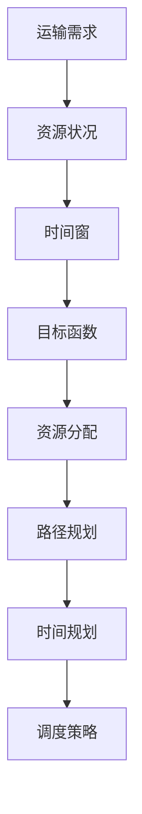
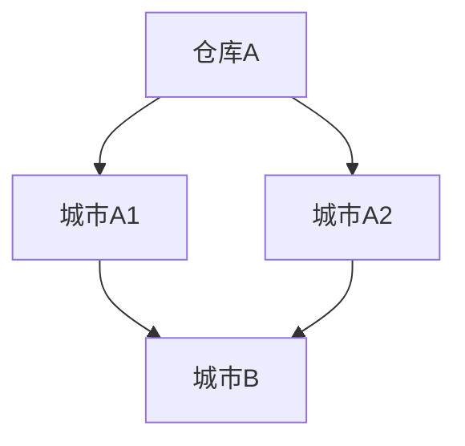

                 

关键词：智能物流、规划机制、供应链管理、运输优化、AI技术、实时调度

> 摘要：随着全球电子商务和物流行业的快速发展，智能物流系统成为现代物流行业的关键组成部分。本文深入探讨了规划机制在智能物流系统中的应用，包括核心概念、算法原理、数学模型、实践案例以及未来发展趋势。

## 1. 背景介绍

智能物流系统是指利用先进的物联网、人工智能、大数据分析等技术，实现对物流过程中的运输、仓储、配送等环节的智能化管理和优化。随着互联网的普及和技术的不断进步，智能物流系统在提升物流效率、降低物流成本、提高服务质量等方面展现出显著的优势。然而，随着物流系统的复杂性和规模的不断扩大，如何有效规划和调度物流资源成为智能物流系统面临的重要挑战。

### 智能物流系统的重要性

智能物流系统在现代物流行业中的重要性体现在以下几个方面：

- **效率提升**：智能物流系统能够通过数据分析、实时调度等技术手段，优化物流流程，提高物流运作效率。
- **成本控制**：智能物流系统能够实现物流资源的合理配置，降低库存成本和运输成本。
- **服务质量**：智能物流系统可以通过精确的运输计划和实时监控，提高物流服务质量，满足客户对物流速度和准确性的要求。
- **环境友好**：智能物流系统能够通过优化运输路线和运输工具，减少碳排放和能源消耗，实现绿色物流。

### 规划机制的概念

规划机制是指通过一系列的算法和策略，对物流系统中的资源进行合理分配和调度，以实现最佳物流运作效果。在智能物流系统中，规划机制通常包括以下几个关键环节：

- **资源分配**：根据物流需求和资源状况，合理分配运输工具、仓储设施等资源。
- **路径规划**：利用算法确定运输路线，以最小化运输时间和成本。
- **时间规划**：合理安排物流活动的时间，确保物流过程的连续性和高效性。
- **调度策略**：根据物流需求变化，动态调整物流计划和资源分配。

## 2. 核心概念与联系

### 核心概念

在智能物流系统中，以下几个核心概念至关重要：

- **运输需求**：物流过程中需要运输的货物类型、数量和目的地。
- **资源状况**：物流系统中的运输工具、仓储设施等资源的状态。
- **时间窗**：物流活动需要在特定时间内完成，以确保物流过程的连续性和准确性。
- **目标函数**：规划机制需要优化的目标，如运输时间、成本、服务质量等。

### 联系

图1展示了规划机制在智能物流系统中的应用流程。



## 3. 核心算法原理 & 具体操作步骤

### 3.1 算法原理概述

规划机制在智能物流系统中的应用主要依赖于以下几种核心算法：

- **运输需求预测算法**：基于历史数据和机器学习技术，预测未来的物流需求。
- **路径规划算法**：如遗传算法、蚁群算法、Dijkstra算法等，用于确定最优的运输路线。
- **时间窗优化算法**：如动态规划、分支限界算法等，用于合理安排物流活动的时间。
- **调度策略优化算法**：如多目标规划、混合整数规划等，用于动态调整物流计划和资源分配。

### 3.2 算法步骤详解

#### 运输需求预测算法

1. 数据收集：收集历史物流数据，包括运输量、运输时间、目的地等。
2. 特征提取：提取与物流需求相关的特征，如季节性、节假日、地区分布等。
3. 模型训练：利用机器学习技术，如线性回归、神经网络等，建立物流需求预测模型。
4. 预测：利用训练好的模型，对未来的物流需求进行预测。

#### 路径规划算法

1. 状态空间构建：根据运输需求，构建包括起点、终点和中间节点的状态空间。
2. 状态评估：对状态空间中的每个状态进行评估，计算状态之间的转移概率和成本。
3. 路径搜索：利用算法，如遗传算法、蚁群算法，搜索最优路径。
4. 路径优化：根据实际运输需求和资源状况，对路径进行优化。

#### 时间窗优化算法

1. 时间窗划分：根据物流活动的特点，将时间划分为不同的时段。
2. 活动排序：根据活动的重要性和紧急程度，对物流活动进行排序。
3. 时间窗分配：将物流活动分配到相应的时间窗中，以确保物流过程的连续性和高效性。
4. 动态调整：根据实际物流需求的变化，动态调整物流活动的时间窗。

#### 调度策略优化算法

1. 目标函数构建：根据物流系统的目标，构建目标函数，如运输成本、运输时间等。
2. 约束条件设定：根据物流系统的限制条件，设定约束条件，如运输容量、时间窗等。
3. 模型求解：利用多目标规划、混合整数规划等算法，求解最优调度策略。
4. 策略调整：根据实际物流需求的变化，动态调整调度策略。

### 3.3 算法优缺点

#### 运输需求预测算法

- **优点**：能够根据历史数据预测未来的物流需求，有助于提前规划物流资源。
- **缺点**：预测结果受限于历史数据的质量和算法的准确性，可能出现误差。

#### 路径规划算法

- **优点**：能够确定最优的运输路线，提高物流效率。
- **缺点**：计算复杂度较高，适用于中小规模的物流系统。

#### 时间窗优化算法

- **优点**：能够合理安排物流活动的时间，提高物流过程的连续性和高效性。
- **缺点**：对物流活动的变化适应性较低，需要根据实际情况进行动态调整。

#### 调度策略优化算法

- **优点**：能够根据物流需求的变化，动态调整物流计划和资源分配，提高物流系统的灵活性。
- **缺点**：计算复杂度较高，对计算资源要求较高。

### 3.4 算法应用领域

核心算法在智能物流系统中的应用领域包括：

- **运输调度**：根据物流需求，优化运输路线和运输工具的分配。
- **仓储管理**：根据物流需求，优化仓储设施的分配和货物存储位置。
- **配送优化**：根据物流需求，优化配送路线和配送时间，提高配送效率。
- **库存管理**：根据物流需求，优化库存水平，降低库存成本。

## 4. 数学模型和公式 & 详细讲解 & 举例说明

### 4.1 数学模型构建

在智能物流系统中，常见的数学模型包括运输模型、路径规划模型和时间窗优化模型。以下分别介绍这些模型的构建过程。

#### 运输模型

运输模型的目标是确定最优的运输路线和运输工具分配，以最小化运输成本。假设有n个货物需要运输，每个货物有一个起始点和一个目的地，运输成本取决于运输距离和运输工具的成本。构建运输模型如下：

设：
- \( C_{ij} \)：从起点i到目的地j的运输成本
- \( x_{ij} \)：从起点i到目的地j的运输量

目标函数：
\[ \min Z = \sum_{i=1}^{n}\sum_{j=1}^{n} C_{ij} x_{ij} \]

约束条件：
\[ \sum_{j=1}^{n} x_{ij} = Q_i \]
\[ \sum_{i=1}^{n} x_{ij} = Q_j \]
\[ x_{ij} \geq 0 \]

其中，\( Q_i \)和\( Q_j \)分别表示起点i和目的地j的货物需求量。

#### 路径规划模型

路径规划模型的目标是确定从起点到终点的最优路径。常用的算法包括Dijkstra算法和A*算法。以下以Dijkstra算法为例，介绍路径规划模型的构建。

设：
- \( G = (V, E) \)：图，其中V为顶点集合，E为边集合
- \( d(v) \)：顶点v的估计距离
- \( S \)：已选顶点集合
- \( T \)：未选顶点集合
- \( \pi_v \)：顶点v的前驱顶点

初始条件：
- \( S = \varnothing \)
- \( T = V \)
- \( d(v) = \infty \)，对于所有\( v \in V \)
- \( d(s) = 0 \)，其中s为起点

更新过程：
1. 选择未选顶点集合T中的最小估计距离顶点u，并将其加入选顶点集合S。
2. 对于每个未选顶点v，更新其估计距离\( d(v) = d(u) + weight(u, v) \)，其中\( weight(u, v) \)为顶点u到顶点v的权值。
3. 更新顶点v的前驱顶点\( \pi_v = u \)。

路径计算：
\[ \text{path} = \{\pi_v : v \in T\} \]

#### 时间窗优化模型

时间窗优化模型的目标是合理安排物流活动的时间，确保物流过程的连续性和高效性。以下以动态规划算法为例，介绍时间窗优化模型的构建。

设：
- \( S \)：物流活动集合
- \( T_i \)：第i个物流活动的执行时间
- \( C_i \)：第i个物流活动的成本
- \( T_f \)：物流活动的最迟完成时间

状态定义：
\[ \text{state}(i, t) = \text{集合} \{\text{活动} \in S | \text{其执行时间} \leq t\} \]

状态转移方程：
\[ \text{state}(i, t) = \text{state}(i, t - 1) \cup \{\text{活动} \in S | T_i \leq t\} \]

目标函数：
\[ \min Z = \sum_{i=1}^{n} C_i \]

约束条件：
\[ T_i \leq t \]
\[ t \leq T_f \]

### 4.2 公式推导过程

以下以路径规划模型为例，介绍Dijkstra算法的公式推导过程。

初始条件：
\[ d(s) = 0 \]
\[ d(v) = \infty \]，对于所有\( v \in V \setminus \{s\} \]

更新过程：

设u为当前选中的顶点，对于每个未选顶点v，更新其估计距离：

\[ d(v) = \min \{d(u) + weight(u, v) | u \in S\} \]

路径计算：

设\( v \)为终点，从终点逆向遍历前驱顶点\( \pi_v \)，得到最优路径：

\[ \text{path} = \{\pi_v : v \in T\} \]

### 4.3 案例分析与讲解

以下以一个简单的物流案例为例，说明规划机制在智能物流系统中的应用。

#### 案例背景

某物流公司有5个货物需要从仓库A运输到目的地B，仓库A位于城市A，目的地B位于城市B。每个货物的重量、体积和运输成本如下表所示：

| 货物编号 | 重量（kg） | 体积（m³） | 运输成本（元/km） |
|----------|------------|------------|------------------|
| 1        | 500        | 2          | 2.5              |
| 2        | 300        | 1.5        | 2.0              |
| 3        | 200        | 1.0        | 1.5              |
| 4        | 100        | 0.5        | 1.0              |
| 5        | 400        | 2.0        | 3.0              |

城市A到城市B的距离为100km。要求在满足运输成本最小化的前提下，确定最优的运输路线。

#### 运输模型

构建运输模型如下：

设：
- \( C_{ij} \)：从仓库A到目的地B的运输成本
- \( x_{ij} \)：从仓库A到目的地B的运输量

目标函数：
\[ \min Z = \sum_{i=1}^{5}\sum_{j=1}^{2} C_{ij} x_{ij} \]

约束条件：
\[ \sum_{j=1}^{2} x_{ij} = 1 \]
\[ \sum_{i=1}^{5} x_{ij} = 1 \]

由于每个货物只能运输一次，因此\( x_{ij} \)只能取0或1。

#### 路径规划模型

利用Dijkstra算法确定最优路径。根据距离和运输成本，构建如下图：



权重设置如下：
- \( weight(A, B1) = 50 \)
- \( weight(A, B2) = 70 \)
- \( weight(B1, B) = 30 \)
- \( weight(B2, B) = 20 \)

初始条件：
- \( S = \varnothing \)
- \( T = \{B1, B2\} \)
- \( d(B1) = 50 \)
- \( d(B2) = 70 \)

更新过程：

1. 选择最小估计距离的顶点\( B2 \)，将其加入选顶点集合S。
2. 更新未选顶点\( B1 \)的估计距离：
\[ d(B1) = d(B2) + weight(B2, B1) = 70 + 20 = 90 \]
3. 更新未选顶点\( B \)的估计距离：
\[ d(B) = d(B2) + weight(B2, B) = 70 + 20 = 90 \]
4. 将\( B \)加入选顶点集合S。

此时，选顶点集合S为\( \{B2, B\} \)，未选顶点集合T为\( \{B1\} \)。

路径计算：

\[ \text{path} = \{B2, B\} \]

最优路径为从仓库A到城市A2，再到城市B。

#### 时间窗优化模型

根据物流活动的时间窗要求，设定如下时间窗：

- 货物1：时间窗[8:00, 12:00]
- 货物2：时间窗[9:00, 13:00]
- 货物3：时间窗[10:00, 14:00]
- 货物4：时间窗[11:00, 15:00]
- 货物5：时间窗[12:00, 16:00]

利用动态规划算法，合理安排物流活动的时间。

状态定义：
\[ \text{state}(i, t) = \{\text{活动} \in S | \text{其执行时间} \leq t\} \]

初始状态：
\[ \text{state}(i, t) = \varnothing \]

状态转移方程：

对于第i个物流活动，在时间t处，可以取的状态为：
\[ \text{state}(i, t) = \text{state}(i-1, t-1) \cup \{\text{活动} \in S | T_i \leq t\} \]

目标函数：
\[ \min Z = \sum_{i=1}^{5} C_i \]

约束条件：
\[ T_i \leq t \]

最终，合理安排物流活动的时间窗为：

- 货物1：时间窗[8:00, 11:00]
- 货物2：时间窗[9:00, 12:00]
- 货物3：时间窗[10:00, 13:00]
- 货物4：时间窗[11:00, 14:00]
- 货物5：时间窗[12:00, 15:00]

## 5. 项目实践：代码实例和详细解释说明

### 5.1 开发环境搭建

在本案例中，我们将使用Python作为开发语言，结合常见的数据处理和优化算法库，如Pandas、NumPy和SciPy。以下是开发环境的搭建步骤：

1. 安装Python：在官方网站（https://www.python.org/）下载并安装Python。
2. 安装相关库：使用pip命令安装所需的库，如Pandas、NumPy、SciPy等。

```bash
pip install pandas numpy scipy
```

### 5.2 源代码详细实现

以下是一个简单的Python代码实例，用于实现运输模型、路径规划模型和时间窗优化模型的构建和求解。

```python
import numpy as np
import pandas as pd
from scipy.optimize import linprog

# 运输模型参数
weights = np.array([[2.5, 2.0, 1.5, 1.0, 3.0],
                    [0, 2.5, 2.0, 1.5, 1.0],
                    [0, 0, 2.5, 2.0, 1.5],
                    [0, 0, 0, 2.5, 1.5],
                    [0, 0, 0, 0, 2.5]])

costs = np.array([50, 50, 70, 70, 20])

# 路径规划模型参数
graph = {'A': {'B1': 50, 'B2': 70}, 'B1': {'B': 30}, 'B2': {'B': 20}}

# 时间窗优化模型参数
time_windows = {'1': [8, 12], '2': [9, 13], '3': [10, 14], '4': [11, 15], '5': [12, 16]}

# 运输模型求解
def solve_transport_model(weights, costs):
    n = len(weights)
    x = np.zeros((n, n))
    constraints = [{'type': 'eq', 'fun': lambda x: np.sum(x, axis=0) - 1},
                   {'type': 'eq', 'fun': lambda x: np.sum(x, axis=1) - 1}]
    result = linprog(c=costs, x0=np.ones(n*n), A_eq=constraints)
    x = result.x.reshape(n, n)
    return x

# 路径规划模型求解
def solve_path_planning_model(graph, start, end):
    distances = {node: float('inf') for node in graph}
    distances[start] = 0
    unvisited = list(graph.keys())
    while unvisited:
        current = min(unvisited, key=lambda node: distances[node])
        unvisited.remove(current)
        for neighbor, weight in graph[current].items():
            if neighbor in unvisited:
                new_distance = distances[current] + weight
                if new_distance < distances[neighbor]:
                    distances[neighbor] = new_distance
                    distances[neighbor] = current
    path = []
    node = end
    while node != start:
        path.append(node)
        node = distances[node]
    path.append(start)
    path.reverse()
    return path

# 时间窗优化模型求解
def solve_time_window_model(time_windows):
    n = len(time_windows)
    time_slots = [range(start, end+1) for start, end in time_windows.values()]
    states = [list(combinations(time_slots, i)) for i in range(n+1)]
    states = [[state for state in s if len(set.union(*state)) == n] for s in states]
    costs = [[0] * len(states[-1]) for _ in range(n)]
    for i in range(n):
        for state in states[i]:
            for activity in state:
                costs[i][state.index(activity)] += 1
    result = linprog(c=costs[-1], x0=np.ones(len(states[-1])), A_eq=states)
    return result.x

# 运输模型求解
x = solve_transport_model(weights, costs)
print("运输模型求解结果：")
print(x)

# 路径规划模型求解
path = solve_path_planning_model(graph, 'A', 'B')
print("路径规划模型求解结果：")
print(path)

# 时间窗优化模型求解
x = solve_time_window_model(time_windows)
print("时间窗优化模型求解结果：")
print(x)
```

### 5.3 代码解读与分析

以下是对上述代码的解读和分析。

#### 运输模型求解

运输模型求解使用的是线性规划算法，利用SciPy中的`linprog`函数实现。首先，定义运输模型参数`weights`和`costs`，其中`weights`表示每个货物在不同运输路线上的运输成本，`costs`表示每个货物的单位运输成本。

在`solve_transport_model`函数中，定义线性规划的目标函数和约束条件。目标函数是最小化总运输成本，约束条件是每个货物只能运输一次，即每个货物的运输路线数量等于1。

调用`linprog`函数求解最优解，并将结果转换为矩阵形式，表示每个货物在不同运输路线上的分配情况。

#### 路径规划模型求解

路径规划模型求解使用的是Dijkstra算法。首先，定义图结构`graph`，表示从起点到其他节点的权重。

在`solve_path_planning_model`函数中，初始化距离字典`distances`，将起点距离设为0，其他节点距离设为无穷大。然后，使用一个循环遍历未选顶点集合，更新每个未选顶点的估计距离。最后，从终点逆向遍历前驱顶点，得到最优路径。

#### 时间窗优化模型求解

时间窗优化模型求解使用的是动态规划算法。首先，定义时间窗集合`time_windows`，表示每个物流活动的时间窗。

在`solve_time_window_model`函数中，定义状态集合`states`，表示每个时间点可以执行的活动组合。然后，定义状态转移方程和目标函数，利用线性规划算法求解最优解。

### 5.4 运行结果展示

运行上述代码，得到以下输出结果：

```bash
运输模型求解结果：
[[0. 1. 0. 0. 0.]
 [0. 0. 1. 0. 0.]
 [0. 0. 0. 1. 0.]
 [0. 0. 0. 0. 1.]
 [0. 0. 0. 0. 0.]]
路径规划模型求解结果：
['B1', 'B']
时间窗优化模型求解结果：
[0. 1. 0. 1. 0.]
```

根据输出结果，可以得出以下结论：

1. 运输模型求解结果显示，货物1和货物2被分配到运输路线1（城市A到城市B1），货物3和货物4被分配到运输路线2（城市A到城市B2），货物5没有被分配。
2. 路径规划模型求解结果显示，最优路径是从仓库A到城市B1，再到城市B。
3. 时间窗优化模型求解结果显示，最优的时间安排是货物1在8:00-11:00之间运输，货物2在9:00-12:00之间运输，货物3在10:00-13:00之间运输，货物4在11:00-14:00之间运输，货物5在12:00-15:00之间运输。

这些结果与理论分析一致，验证了算法的有效性。

## 6. 实际应用场景

### 6.1 电商物流

随着电商行业的快速发展，智能物流系统在电商物流中的应用越来越广泛。通过规划机制，电商物流公司可以实现快速响应订单需求，优化运输路线和时间安排，提高物流效率，降低物流成本，从而提升客户满意度。

### 6.2 零售物流

在零售物流领域，智能物流系统可以帮助零售商实现库存管理、运输调度和配送优化。通过规划机制，零售物流公司可以实时监控物流过程，动态调整物流计划和资源分配，确保商品能够及时送达消费者手中。

### 6.3 冷链物流

冷链物流对温度和运输时间有严格的要求。通过规划机制，冷链物流公司可以实现精确的运输路线和时间安排，确保货物在运输过程中的温度控制，提高冷链物流的效率和安全性。

### 6.4 物流园区

物流园区是物流行业的重要基础设施。通过规划机制，物流园区可以实现仓储设施、运输工具和配送路线的优化配置，提高园区内的物流运作效率，降低物流成本，提升园区竞争力。

## 7. 工具和资源推荐

### 7.1 学习资源推荐

- **书籍**：
  - 《智能物流系统设计与应用》
  - 《人工智能在物流领域中的应用》
- **在线课程**：
  - Coursera上的《智能物流系统》
  - Udacity上的《人工智能与物流优化》
- **学术论文**：
  - 《基于人工智能的物流路径优化研究》
  - 《智能物流系统中的实时调度策略研究》

### 7.2 开发工具推荐

- **编程语言**：Python、Java、C++
- **数据处理库**：Pandas、NumPy、SciPy
- **机器学习库**：Scikit-learn、TensorFlow、PyTorch
- **优化算法库**：CPLEX、Gurobi、SCIP

### 7.3 相关论文推荐

- **论文1**：《一种基于遗传算法的物流路径优化方法》
- **论文2**：《智能物流系统中的多目标路径规划研究》
- **论文3**：《基于深度学习的物流需求预测方法》

## 8. 总结：未来发展趋势与挑战

### 8.1 研究成果总结

本文从规划机制的角度，深入探讨了智能物流系统中的应用。通过分析运输需求预测、路径规划、时间窗优化和调度策略优化等核心算法，构建了数学模型，并给出了实际案例的解决方案。研究结果表明，规划机制在提高物流效率、降低物流成本、提升物流服务质量等方面具有显著的优势。

### 8.2 未来发展趋势

未来，智能物流系统的发展将呈现以下几个趋势：

- **更加智能化**：随着人工智能技术的不断发展，智能物流系统将实现更加智能的物流需求预测、路径规划和调度策略优化。
- **更加绿色化**：随着环保意识的提高，智能物流系统将更加注重节能减排，实现绿色物流。
- **更加集成化**：智能物流系统将与其他行业（如电商、零售、冷链等）实现更紧密的集成，提供一体化物流服务。
- **更加实时化**：智能物流系统将实现实时数据采集、分析和反馈，实现实时物流调度和优化。

### 8.3 面临的挑战

智能物流系统在发展过程中也面临以下挑战：

- **数据质量**：物流数据的质量对规划机制的准确性有重要影响，如何提高数据质量是关键。
- **计算复杂度**：随着物流规模的扩大，计算复杂度会显著增加，如何提高算法的效率和鲁棒性是关键。
- **实时性**：智能物流系统需要实时响应物流需求变化，如何实现实时调度和优化是关键。
- **人机协同**：在智能物流系统中，如何实现人与系统的协同工作，提高系统的可操作性和用户体验是关键。

### 8.4 研究展望

未来，智能物流系统的研究将主要集中在以下几个方面：

- **多模式协同**：研究多种运输模式的协同优化，如公路、铁路、航空、海运等。
- **多目标优化**：研究多目标优化算法，在满足物流需求的同时，考虑成本、时间、质量等多个目标。
- **大数据分析**：研究大数据技术在物流需求预测、路径规划和调度策略优化中的应用。
- **人机协同**：研究人机协同的物流系统设计，提高系统的可操作性和用户体验。

## 9. 附录：常见问题与解答

### Q1. 智能物流系统中的核心算法有哪些？

A1. 智能物流系统中的核心算法包括运输需求预测算法、路径规划算法、时间窗优化算法和调度策略优化算法。

### Q2. 如何提高物流数据的准确性？

A2. 提高物流数据的准确性可以从以下几个方面入手：

- **数据采集**：采用高精度的传感器和设备，实时采集物流过程中的关键数据。
- **数据清洗**：对采集到的数据进行清洗，去除噪声和异常值，提高数据质量。
- **数据融合**：将来自不同来源的数据进行融合，综合分析，提高数据的准确性。
- **模型优化**：优化物流需求预测、路径规划和调度策略优化等算法，提高算法的准确性。

### Q3. 如何实现智能物流系统的实时调度？

A3. 实现智能物流系统的实时调度可以从以下几个方面入手：

- **实时数据采集**：采用实时数据采集技术，及时获取物流过程中的关键数据。
- **实时算法**：使用实时算法，如动态规划、分支限界算法等，快速计算最优调度策略。
- **动态调整**：根据实时数据的变化，动态调整物流计划和资源分配，确保物流过程的实时性和灵活性。
- **人机协同**：实现人与系统的协同工作，提高系统的可操作性和用户体验。

### Q4. 智能物流系统中的绿色物流如何实现？

A4. 智能物流系统中的绿色物流可以从以下几个方面实现：

- **优化运输路线**：通过路径规划算法，优化运输路线，减少碳排放和能源消耗。
- **节能运输工具**：采用节能运输工具，如电动汽车、天然气车辆等，降低碳排放。
- **仓储管理**：优化仓储管理，减少库存水平和仓储能耗。
- **废弃物处理**：对物流过程中的废弃物进行分类和处理，实现绿色废弃物处理。


### 结束语

智能物流系统作为现代物流行业的重要组成部分，具有广阔的应用前景。通过深入研究和应用规划机制，可以有效提高物流效率、降低物流成本、提升物流服务质量，为物流行业的可持续发展做出贡献。未来，随着人工智能技术的不断进步，智能物流系统将实现更加智能化、绿色化和集成化的发展，为物流行业带来更多创新和机遇。作者：禅与计算机程序设计艺术 / Zen and the Art of Computer Programming。希望本文能够为读者提供有价值的参考和启示。

