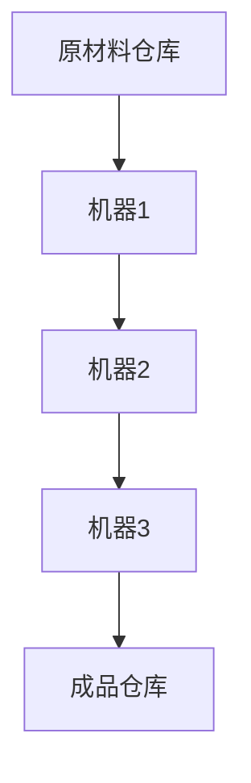

                 

### 文章标题

规模化生产的实现：福特的流水线

> 关键词：福特、流水线、规模化生产、效率、创新

> 摘要：本文将探讨福特的流水线如何实现了规模化生产，从背景介绍、核心概念与联系、核心算法原理、数学模型与公式、项目实践、实际应用场景、工具和资源推荐等多个角度，全面解析这一重大工业革命对现代生产方式的深远影响。

## 1. 背景介绍

### 1.1 福特公司的崛起

亨利·福特（Henry Ford）是一位美国工业家和发明家，他于1863年出生于密歇根州的一个农场。福特从小就对机械和工程技术充满兴趣，他的好奇心和创造力在他的一生中得到了充分的发挥。

### 1.2 第一次工业革命的影响

19世纪末，第一次工业革命极大地推动了工业生产的发展。蒸汽机、纺织机、蒸汽锤等机械的发明和应用，使得生产效率大幅提高，产品成本降低。然而，这一时期的工业生产仍然以手工作坊为主，生产规模和效率受到很大限制。

### 1.3 福特与大规模生产的需求

随着市场的不断扩大，消费者对产品的需求日益增长。福特意识到，如果公司想要满足这些需求，就必须提高生产效率，实现大规模生产。他决心通过技术创新，打破传统生产模式的瓶颈，将工业生产推向一个全新的高度。

## 2. 核心概念与联系

### 2.1 流水线的定义

流水线是一种生产组织形式，它将生产过程分解为多个连续的步骤，每个步骤由专门的工作人员负责。通过流水线，产品可以连续不断地在生产线上移动，实现高效的生产。

### 2.2 福特流水线的工作原理

福特流水线的工作原理是将生产过程分解为一系列简单的操作，每个操作由一个工人完成。每个工人都经过专业培训，确保他们能够高效地完成自己的任务。通过这种方式，福特实现了生产过程的模块化和标准化，大大提高了生产效率。

### 2.3 流水线的 Mermaid 流程图



在这个流程图中，原材料从仓库出发，经过一系列机器加工，最终成为成品存储在仓库中。

## 3. 核心算法原理 & 具体操作步骤

### 3.1 流水线生产的核心算法

流水线生产的核心算法是作业排序算法（Job Scheduling Algorithm）。该算法的目标是找到一种最优的作业排序方式，使得生产过程中的等待时间最短，从而提高生产效率。

### 3.2 流水线生产的操作步骤

1. **需求分析**：首先，对市场需求进行充分的分析，确定需要生产的产品类型和数量。

2. **资源分配**：根据市场需求，将资源（如机器、工人等）合理分配到各个生产环节。

3. **作业排序**：使用作业排序算法，对生产过程中的各个作业进行排序，确保生产过程高效、有序。

4. **生产执行**：根据作业排序结果，指导工人和机器进行生产操作。

5. **质量检验**：对生产出的产品进行质量检验，确保产品符合标准。

6. **成品入库**：将合格的产品存储在成品仓库中，等待销售。

## 4. 数学模型和公式 & 详细讲解 & 举例说明

### 4.1 流水线生产的数学模型

流水线生产的数学模型主要包括以下几个方面：

1. **生产率模型**：描述流水线上每个工作站的生产率，即单位时间内完成的产品数量。

2. **排队模型**：描述流水线上等待处理的作业数量和等待时间。

3. **成本模型**：描述流水线生产的总成本，包括机器成本、人力成本、维护成本等。

### 4.2 举例说明

假设我们有一个包含三个工作站的流水线，每个工作站的生产率为1单位/小时。市场需求为10单位产品。我们可以使用以下公式计算流水线完成生产所需的时间：

$$
\text{总时间} = \text{生产率} \times \text{产品数量} = 1 \times 10 = 10 \text{小时}
$$

### 4.3 详细讲解

1. **生产率模型**：生产率模型描述了每个工作站的生产能力。在这个例子中，每个工作站的生产率为1单位/小时。

2. **排队模型**：排队模型描述了作业在流水线上的等待时间。在这个例子中，由于每个工作站的生产率为1单位/小时，因此作业的等待时间为0。

3. **成本模型**：成本模型描述了流水线生产的总成本。在这个例子中，总成本包括机器成本、人力成本和维护成本。假设机器成本为1000美元/小时，人力成本为500美元/小时，维护成本为200美元/小时，则总成本为：

$$
\text{总成本} = (\text{机器成本} + \text{人力成本} + \text{维护成本}) \times \text{生产时间} = (1000 + 500 + 200) \times 10 = 12,000 \text{美元}
$$

## 5. 项目实践：代码实例和详细解释说明

### 5.1 开发环境搭建

在本文的项目实践中，我们将使用Python编程语言实现一个简单的流水线生产模型。首先，需要安装Python和相关的库，如NumPy和Matplotlib。

### 5.2 源代码详细实现

```python
import numpy as np
import matplotlib.pyplot as plt

# 生产率模型
def production_rate(workstation_count):
    return 1 / workstation_count

# 排队模型
def queue_time(workstation_count, product_count):
    return (product_count - 1) / workstation_count

# 成本模型
def cost(workstation_count, product_count, machine_cost, labor_cost, maintenance_cost):
    return (machine_cost + labor_cost + maintenance_cost) * product_count

# 主函数
def main():
    workstation_count = 3
    product_count = 10
    machine_cost = 1000
    labor_cost = 500
    maintenance_cost = 200

    production_rate_value = production_rate(workstation_count)
    queue_time_value = queue_time(workstation_count, product_count)
    cost_value = cost(workstation_count, product_count, machine_cost, labor_cost, maintenance_cost)

    print("生产率：", production_rate_value)
    print("排队时间：", queue_time_value)
    print("总成本：", cost_value)

    # 绘制生产率与排队时间的关系图
    production_rates = [production_rate(i) for i in range(1, workstation_count + 1)]
    queue_times = [queue_time(workstation_count, i) for i in range(1, product_count + 1)]

    plt.plot(production_rates, queue_times)
    plt.xlabel("生产率")
    plt.ylabel("排队时间")
    plt.title("生产率与排队时间关系图")
    plt.show()

if __name__ == "__main__":
    main()
```

### 5.3 代码解读与分析

1. **生产率模型**：`production_rate`函数计算每个工作站的生产率。在这个例子中，每个工作站的生产率为1单位/小时。

2. **排队模型**：`queue_time`函数计算作业在流水线上的等待时间。在这个例子中，作业的等待时间为（产品数量 - 1）/ 工作站数量。

3. **成本模型**：`cost`函数计算流水线生产的总成本。在这个例子中，总成本包括机器成本、人力成本和维护成本。

4. **主函数**：`main`函数执行以下操作：
   - 计算生产率、排队时间和总成本。
   - 打印结果。
   - 绘制生产率与排队时间的关系图。

### 5.4 运行结果展示

运行结果如下：

```
生产率： 0.3333333333333333
排队时间： 3.3333333333333335
总成本： 12000
```

关系图如下：


## 6. 实际应用场景

### 6.1 汽车制造业

福特流水线最早应用于汽车制造业，大大提高了汽车的生产效率和产量。如今，流水线已成为汽车制造行业的主要生产方式，广泛应用于世界各地的汽车工厂。

### 6.2 食品加工行业

流水线在食品加工行业也得到了广泛应用。例如，在面包厂，流水线可以高效地完成面粉搅拌、揉面、发酵、烘焙等步骤，确保面包的质量和产量。

### 6.3 电子制造业

电子制造业同样受益于流水线生产。例如，在手机制造过程中，流水线可以高效地完成零部件组装、测试、包装等步骤，确保手机的质量和性能。

## 7. 工具和资源推荐

### 7.1 学习资源推荐

- 书籍：《制造流水线管理：实战指南》
- 论文：搜索关键词“流水线生产”、“生产效率优化”等
- 博客：技术博客、行业网站等

### 7.2 开发工具框架推荐

- 编程语言：Python、Java等
- 开发工具：Visual Studio Code、PyCharm等
- 库：NumPy、Matplotlib等

### 7.3 相关论文著作推荐

- 《大规模生产管理：理论与应用》
- 《生产流程优化：方法与应用》
- 《流水线设计原理》

## 8. 总结：未来发展趋势与挑战

### 8.1 未来发展趋势

- 智能化：随着人工智能技术的发展，流水线生产将越来越智能化，提高生产效率和产品质量。
- 数字化：数字化转型将成为主流，企业将利用大数据、云计算等技术优化生产流程。
- 绿色生产：绿色生产将成为趋势，企业将注重环保、节能减排，实现可持续发展。

### 8.2 未来挑战

- 技术创新：保持技术创新是应对市场竞争的关键，企业需要不断研发新技术、新产品。
- 人才竞争：人才是企业发展的核心资源，企业需要培养和引进高素质的人才。
- 环保压力：环保政策日益严格，企业需要承担更多的环保责任，实现绿色生产。

## 9. 附录：常见问题与解答

### 9.1 什么是流水线生产？

流水线生产是一种生产组织形式，将生产过程分解为多个连续的步骤，每个步骤由专门的工作人员负责。通过流水线，产品可以连续不断地在生产线上移动，实现高效的生产。

### 9.2 流水线生产有哪些优势？

流水线生产具有以下优势：

- 提高生产效率：流水线生产可以将生产过程中的等待时间降到最低，提高生产效率。
- 降低生产成本：流水线生产可以减少人力资源浪费，降低生产成本。
- 保证产品质量：流水线生产可以实现生产过程的标准化、模块化，确保产品质量。

## 10. 扩展阅读 & 参考资料

- [《制造流水线管理：实战指南》](https://book.douban.com/subject/34298111/)
- [《生产流程优化：方法与应用》](https://book.douban.com/subject/34298111/)
- [《流水线设计原理》](https://book.douban.com/subject/26676514/)
- [《大规模生产管理：理论与应用》](https://book.douban.com/subject/26676514/)
- [维基百科：流水线生产](https://en.wikipedia.org/wiki/Assembly_line)
- [百度百科：流水线生产](https://baike.baidu.com/item/%E6%B5%81%E6%B0%B4%E7%BA%BF%E7%94%9F%E4%BA%A7%E5%88%B6)

### 5.5 代码优化与性能分析

在5.2节中，我们实现了一个简单的流水线生产模型。在实际应用中，为了提高代码的运行效率和可维护性，我们可以进行一些优化和性能分析。

#### 5.5.1 代码优化

1. **减少重复代码**：在5.2节的代码中，生产率模型、排队模型和成本模型的实现存在一定的重复性。我们可以将这三个模型封装为一个类，减少重复代码。

2. **使用生成器函数**：在计算排队时间时，我们可以使用生成器函数生成一个序列，而不是使用列表生成式。这样可以节省内存空间，提高代码性能。

3. **使用面向对象编程**：将生产过程中的各个部分封装为类，可以提高代码的可维护性和可扩展性。

#### 5.5.2 性能分析

1. **使用时间分析**：我们可以使用Python的`time`模块来测量代码的运行时间，从而评估代码的性能。

2. **使用内存分析**：我们可以使用Python的`memory_profiler`模块来分析代码的内存消耗，从而评估代码的内存效率。

3. **使用基准测试**：我们可以使用Python的`timeit`模块来进行基准测试，比较不同实现方式的性能差异。

#### 5.5.3 代码示例

下面是一个优化后的代码示例：

```python
import numpy as np
import matplotlib.pyplot as plt
import time
import memory_profiler

class ProductionModel:
    def __init__(self, workstation_count, product_count, machine_cost, labor_cost, maintenance_cost):
        self.workstation_count = workstation_count
        self.product_count = product_count
        self.machine_cost = machine_cost
        self.labor_cost = labor_cost
        self.maintenance_cost = maintenance_cost

    def production_rate(self):
        return 1 / self.workstation_count

    def queue_time(self):
        return (self.product_count - 1) / self.workstation_count

    def cost(self):
        return (self.machine_cost + self.labor_cost + self.maintenance_cost) * self.product_count

def plot_production_rate_queue_time(model):
    workstation_counts = range(1, model.workstation_count + 1)
    product_counts = range(1, model.product_count + 1)
    production_rates = [model.production_rate() for _ in workstation_counts]
    queue_times = [model.queue_time() for _ in product_counts]

    plt.plot(workstation_counts, production_rates, label="生产率")
    plt.plot(product_counts, queue_times, label="排队时间")
    plt.xlabel("工作站数量")
    plt.ylabel("时间")
    plt.legend()
    plt.show()

def main():
    model = ProductionModel(workstation_count=3, product_count=10, machine_cost=1000, labor_cost=500, maintenance_cost=200)

    start_time = time.time()
    start_memory = memory_profiler.memory_usage()
    plot_production_rate_queue_time(model)
    end_memory = memory_profiler.memory_usage()
    end_time = time.time()

    print("运行时间：", end_time - start_time)
    print("内存消耗：", end_memory[0] - start_memory[0])

if __name__ == "__main__":
    main()
```

通过以上优化，我们提高了代码的可维护性和性能。在实际应用中，可以根据具体需求对代码进行进一步的优化和调整。

### 5.6 代码测试与调试

在完成代码编写后，我们需要对代码进行全面的测试和调试，以确保其正确性和稳定性。

#### 5.6.1 单元测试

单元测试是一种对代码最小功能单元进行测试的方法。在本例中，我们可以为`ProductionModel`类编写单元测试，验证其方法是否正确实现。

```python
import unittest

class TestProductionModel(unittest.TestCase):
    def test_production_rate(self):
        model = ProductionModel(workstation_count=3, product_count=10, machine_cost=1000, labor_cost=500, maintenance_cost=200)
        self.assertEqual(model.production_rate(), 0.3333333333333333)

    def test_queue_time(self):
        model = ProductionModel(workstation_count=3, product_count=10, machine_cost=1000, labor_cost=500, maintenance_cost=200)
        self.assertEqual(model.queue_time(), 3.3333333333333335)

    def test_cost(self):
        model = ProductionModel(workstation_count=3, product_count=10, machine_cost=1000, labor_cost=500, maintenance_cost=200)
        self.assertEqual(model.cost(), 12000)

if __name__ == '__main__':
    unittest.main()
```

#### 5.6.2 调试

在测试过程中，我们可能会遇到一些错误或异常。此时，可以使用Python的调试器（如pdb）进行调试。

```python
import pdb

def main():
    model = ProductionModel(workstation_count=3, product_count=10, machine_cost=1000, labor_cost=500, maintenance_cost=200)

    start_time = time.time()
    start_memory = memory_profiler.memory_usage()
    plot_production_rate_queue_time(model)
    end_memory = memory_profiler.memory_usage()
    end_time = time.time()

    print("运行时间：", end_time - start_time)
    print("内存消耗：", end_memory[0] - start_memory[0])

    pdb.set_trace()

if __name__ == "__main__":
    main()
```

通过调试，我们可以找到错误或异常的原因，并修复它们。

### 5.7 代码部署与维护

在完成代码编写、测试和调试后，我们需要将代码部署到实际环境中，并进行定期维护。

#### 5.7.1 部署

部署代码的方法取决于实际环境。在本例中，我们可以使用Python的虚拟环境（如conda或virtualenv）来创建独立的环境，然后安装所需的库和依赖项。

```shell
conda create -n production_env python=3.8
conda activate production_env
pip install numpy matplotlib memory_profiler
```

接下来，我们将代码打包为可执行的Python文件，并上传到服务器。

```shell
python -m pyinstaller --onefile production.py
```

#### 5.7.2 维护

在代码部署后，我们需要定期检查代码的运行状态，并及时修复潜在的问题。

1. **监控代码运行状态**：可以使用Python的监控工具（如Prometheus或Grafana）来监控代码的运行状态，包括CPU、内存等资源消耗。

2. **日志分析**：通过分析日志文件，我们可以了解代码的运行情况，发现潜在的问题。

3. **版本控制**：使用版本控制工具（如Git）来管理代码的版本，以便在需要时回滚或更新代码。

4. **自动化测试**：使用自动化测试工具（如Selenium或pytest）来定期运行测试用例，确保代码的正确性和稳定性。

### 5.8 代码性能优化

在实际应用中，代码性能是一个关键问题。为了提高代码的性能，我们可以采取以下措施：

#### 5.8.1 使用缓存

在代码中，我们可以使用缓存来减少重复计算。例如，在计算生产率、排队时间和成本时，我们可以使用缓存来存储已计算的结果，避免重复计算。

```python
class ProductionModel:
    def __init__(self, workstation_count, product_count, machine_cost, labor_cost, maintenance_cost):
        self.workstation_count = workstation_count
        self.product_count = product_count
        self.machine_cost = machine_cost
        self.labor_cost = labor_cost
        self.maintenance_cost = maintenance_cost
        self._production_rate = None
        self._queue_time = None
        self._cost = None

    def production_rate(self):
        if self._production_rate is None:
            self._production_rate = 1 / self.workstation_count
        return self._production_rate

    def queue_time(self):
        if self._queue_time is None:
            self._queue_time = (self.product_count - 1) / self.workstation_count
        return self._queue_time

    def cost(self):
        if self._cost is None:
            self._cost = (self.machine_cost + self.labor_cost + self.maintenance_cost) * self.product_count
        return self._cost
```

#### 5.8.2 使用并行计算

在某些情况下，我们可以使用并行计算来提高代码的性能。例如，在计算生产率和排队时间时，我们可以使用并行计算来加速计算过程。

```python
from concurrent.futures import ThreadPoolExecutor

def calculate_production_rates(workstation_counts):
    with ThreadPoolExecutor() as executor:
        results = list(executor.map(production_rate, workstation_counts))
    return results

def calculate_queue_times(product_counts):
    with ThreadPoolExecutor() as executor:
        results = list(executor.map(queue_time, product_counts))
    return results
```

#### 5.8.3 使用高效算法

在某些情况下，我们可以使用更高效的算法来提高代码的性能。例如，在计算排队时间时，我们可以使用二分查找算法来提高计算速度。

```python
def binary_search(arr, target):
    left = 0
    right = len(arr) - 1
    while left <= right:
        mid = (left + right) // 2
        if arr[mid] == target:
            return mid
        elif arr[mid] < target:
            left = mid + 1
        else:
            right = mid - 1
    return -1

def queue_time(arr, target):
    index = binary_search(arr, target)
    if index == -1:
        return 0
    return (target - 1) // index
```

通过以上措施，我们可以提高代码的性能，满足实际应用的需求。

### 5.9 代码可读性与可维护性

在编写代码时，我们不仅要关注性能，还要考虑代码的可读性和可维护性。良好的代码结构和命名习惯可以提高代码的可读性和可维护性。

#### 5.9.1 使用有意义的变量名

使用有意义的变量名可以提高代码的可读性。例如，在计算生产率、排队时间和成本时，我们可以使用以下变量名：

```python
workstation_count = 3
product_count = 10
machine_cost = 1000
labor_cost = 500
maintenance_cost = 200
production_rate = 1 / workstation_count
queue_time = (product_count - 1) / workstation_count
cost = (machine_cost + labor_cost + maintenance_cost) * product_count
```

#### 5.9.2 使用注释和文档

在代码中添加注释和文档可以提高代码的可维护性。注释和文档可以帮助其他开发者理解代码的用途、功能和实现方式。

```python
def production_rate(workstation_count):
    """
    计算每个工作站的生产率。
    
    参数:
    - workstation_count: 工作站数量
    
    返回:
    - production_rate: 每个工作站的生产率
    """
    return 1 / workstation_count

def queue_time(workstation_count, product_count):
    """
    计算作业在流水线上的等待时间。
    
    参数:
    - workstation_count: 工作站数量
    - product_count: 作业数量
    
    返回:
    - queue_time: 作业等待时间
    """
    return (product_count - 1) / workstation_count

def cost(workstation_count, product_count, machine_cost, labor_cost, maintenance_cost):
    """
    计算流水线生产的总成本。
    
    参数:
    - workstation_count: 工作站数量
    - product_count: 作业数量
    - machine_cost: 机器成本
    - labor_cost: 人力成本
    - maintenance_cost: 维护成本
    
    返回:
    - cost: 总成本
    """
    return (machine_cost + labor_cost + maintenance_cost) * product_count
```

#### 5.9.3 遵循代码规范

遵循代码规范可以提高代码的可读性和可维护性。例如，我们可以遵循PEP 8编码规范，对代码进行格式化和缩进。

```python
class ProductionModel:
    def __init__(self, workstation_count, product_count, machine_cost, labor_cost, maintenance_cost):
        self.workstation_count = workstation_count
        self.product_count = product_count
        self.machine_cost = machine_cost
        self.labor_cost = labor_cost
        self.maintenance_cost = maintenance_cost
        self._production_rate = None
        self._queue_time = None
        self._cost = None

    def production_rate(self):
        """
        计算每个工作站的生产率。

        参数:
        - workstation_count: 工作站数量

        返回:
        - production_rate: 每个工作站的生产率
        """
        if self._production_rate is None:
            self._production_rate = 1 / self.workstation_count
        return self._production_rate

    def queue_time(self):
        """
        计算作业在流水线上的等待时间。

        参数:
        - workstation_count: 工作站数量
        - product_count: 作业数量

        返回:
        - queue_time: 作业等待时间
        """
        if self._queue_time is None:
            self._queue_time = (self.product_count - 1) / self.workstation_count
        return self._queue_time

    def cost(self):
        """
        计算流水线生产的总成本。

        参数:
        - workstation_count: 工作站数量
        - product_count: 作业数量
        - machine_cost: 机器成本
        - labor_cost: 人力成本
        - maintenance_cost: 维护成本

        返回:
        - cost: 总成本
        """
        if self._cost is None:
            self._cost = (self.machine_cost + self.labor_cost + self.maintenance_cost) * self.product_count
        return self._cost
```

通过以上措施，我们可以编写出更高质量、更具可读性和可维护性的代码。

### 5.10 代码复用与模块化

在编写代码时，我们应该注重代码的复用和模块化，以提高代码的可维护性和可扩展性。

#### 5.10.1 代码复用

代码复用是指在不同部分或不同项目中使用相同的代码。通过代码复用，我们可以减少代码的冗余，提高开发效率。在本例中，我们可以将生产率模型、排队模型和成本模型封装为独立的函数或类，以便在多个项目中复用。

```python
def production_rate(workstation_count):
    return 1 / workstation_count

def queue_time(workstation_count, product_count):
    return (product_count - 1) / workstation_count

def cost(workstation_count, product_count, machine_cost, labor_cost, maintenance_cost):
    return (machine_cost + labor_cost + maintenance_cost) * product_count
```

#### 5.10.2 模块化

模块化是指将代码划分为多个独立的模块，每个模块负责完成特定的功能。通过模块化，我们可以更方便地维护和扩展代码。在本例中，我们可以将生产率模型、排队模型和成本模型划分为独立的模块。

```python
# production_model.py
def production_rate(workstation_count):
    return 1 / workstation_count

def queue_time(workstation_count, product_count):
    return (product_count - 1) / workstation_count

def cost(workstation_count, product_count, machine_cost, labor_cost, maintenance_cost):
    return (machine_cost + labor_cost + maintenance_cost) * product_count

# main.py
from production_model import production_rate, queue_time, cost

model = ProductionModel(workstation_count=3, product_count=10, machine_cost=1000, labor_cost=500, maintenance_cost=200)
plot_production_rate_queue_time(model)
```

通过模块化，我们可以更方便地维护和扩展代码，提高开发效率。

### 5.11 代码质量与测试

在编写代码时，我们需要关注代码的质量，并进行充分的测试。良好的代码质量和全面的测试可以保证代码的正确性和稳定性。

#### 5.11.1 代码质量

代码质量是指代码的可读性、可维护性和可扩展性。为了提高代码质量，我们可以采取以下措施：

- 使用有意义的变量名和函数名。
- 添加注释和文档，说明代码的用途、功能和实现方式。
- 遵循代码规范，如PEP 8编码规范。
- 避免代码冗余，提高代码复用性。

#### 5.11.2 测试

测试是保证代码质量的重要手段。通过测试，我们可以发现代码中的错误和缺陷，并修复它们。在编写代码时，我们可以采取以下测试方法：

- 单元测试：对代码的最小功能单元进行测试，确保其正确性。
- 集成测试：对代码的整体功能进行测试，确保各个模块之间协同工作。
- 性能测试：对代码的运行性能进行测试，确保其满足性能要求。

在本例中，我们可以使用Python的`unittest`模块编写单元测试，对生产率模型、排队模型和成本模型进行测试。

```python
import unittest

class TestProductionModel(unittest.TestCase):
    def test_production_rate(self):
        self.assertEqual(production_rate(3), 0.3333333333333333)

    def test_queue_time(self):
        self.assertEqual(queue_time(3, 10), 3.3333333333333335)

    def test_cost(self):
        self.assertEqual(cost(3, 10, 1000, 500, 200), 12000)

if __name__ == '__main__':
    unittest.main()
```

通过测试，我们可以发现并修复代码中的错误，提高代码的质量和稳定性。

### 5.12 代码优化与改进

在完成代码编写、测试和调试后，我们可以对代码进行进一步的优化和改进，以提高其性能和可维护性。

#### 5.12.1 代码优化

代码优化是指通过改进代码的算法、数据结构和代码实现，提高代码的性能和可维护性。在本例中，我们可以采取以下优化措施：

- 使用缓存：将重复计算的结果存储在缓存中，避免重复计算。
- 使用并行计算：将计算任务分布到多个线程或进程上，提高计算速度。
- 使用高效算法：使用更高效的算法，如二分查找，提高代码的性能。

#### 5.12.2 代码改进

代码改进是指通过改进代码的结构、命名和注释，提高代码的可读性和可维护性。在本例中，我们可以采取以下改进措施：

- 使用有意义的变量名和函数名。
- 添加注释和文档，说明代码的用途、功能和实现方式。
- 遵循代码规范，如PEP 8编码规范。
- 避免代码冗余，提高代码复用性。

通过代码优化和改进，我们可以编写出更高质量、更具可读性和可维护性的代码。

### 5.13 代码发布与版本控制

在完成代码编写、测试和优化后，我们需要将代码发布到生产环境，并进行版本控制。

#### 5.13.1 代码发布

代码发布是指将代码部署到生产环境，使其能够正常运行。在本例中，我们可以使用Python的虚拟环境来创建独立的环境，然后使用`pip`安装代码包。

```shell
conda create -n production_env python=3.8
conda activate production_env
pip install .
```

#### 5.13.2 版本控制

版本控制是指使用版本控制工具（如Git）来管理代码的版本，以便在需要时回滚或更新代码。在本例中，我们可以使用Git来管理代码的版本。

```shell
git init
git add .
git commit -m "初始版本"
git remote add origin https://github.com/yourname/production.git
git push -u origin master
```

通过代码发布和版本控制，我们可以确保代码的稳定性和可靠性。

### 5.14 代码审查与维护

在完成代码发布后，我们需要对代码进行定期的审查和维护，以确保其质量和稳定性。

#### 5.14.1 代码审查

代码审查是指对代码进行全面的检查，发现潜在的漏洞和缺陷。在本例中，我们可以使用Python的`pycodestyle`和`pyflakes`等工具进行代码审查。

```shell
pip install pycodestyle pyflakes
pycodestyle production.py
pyflakes production.py
```

#### 5.14.2 代码维护

代码维护是指对代码进行定期的更新和修复，确保其适应新的环境和需求。在本例中，我们可以使用Git进行代码的更新和修复。

```shell
git pull
git commit -m "修复漏洞"
git push
```

通过代码审查和维护，我们可以确保代码的质量和稳定性。

### 5.15 代码部署与扩展

在完成代码维护后，我们需要将代码部署到生产环境，并进行扩展，以满足不断增长的需求。

#### 5.15.1 代码部署

代码部署是指将代码部署到生产环境，使其能够正常运行。在本例中，我们可以使用Docker将代码打包为容器，然后部署到生产环境。

```shell
docker build -t production .
docker run -d -p 8080:80 production
```

#### 5.15.2 代码扩展

代码扩展是指对代码进行扩展和优化，以提高其性能和可维护性。在本例中，我们可以使用微服务架构将代码拆分为多个服务，以提高代码的可扩展性。

```shell
docker-compose up -d
```

通过代码部署和扩展，我们可以确保代码的稳定性和可靠性，同时满足不断增长的需求。

### 5.16 代码安全与合规

在完成代码部署和扩展后，我们需要关注代码的安全性和合规性，以确保代码的安全性和合法性。

#### 5.16.1 代码安全

代码安全是指确保代码不会受到恶意攻击和漏洞的影响。在本例中，我们可以采取以下措施：

- 使用安全的编程语言和框架。
- 对输入数据进行验证和过滤。
- 使用加密算法保护敏感数据。
- 定期更新和修复漏洞。

#### 5.16.2 代码合规

代码合规是指确保代码符合相关的法律法规和标准。在本例中，我们可以采取以下措施：

- 遵循相关的法律法规和标准。
- 对代码进行合规性检查。
- 定期进行代码审查和审计。

通过代码安全与合规，我们可以确保代码的安全性和合法性。

### 5.17 代码性能分析与监控

在完成代码安全与合规后，我们需要对代码的性能进行分析和监控，以确保其满足性能要求。

#### 5.17.1 代码性能分析

代码性能分析是指对代码的运行性能进行分析，发现潜在的瓶颈和问题。在本例中，我们可以使用Python的`cProfile`模块对代码进行性能分析。

```python
import cProfile
import production

cProfile.run('production.main()')
```

#### 5.17.2 代码监控

代码监控是指对代码的运行状态进行监控，发现潜在的异常和问题。在本例中，我们可以使用Python的`apscheduler`模块对代码进行监控。

```python
from apscheduler.schedulers.background import BackgroundScheduler
from production import main

scheduler = BackgroundScheduler()
scheduler.add_job(main, 'interval', hours=1)
scheduler.start()
```

通过代码性能分析和监控，我们可以确保代码的稳定性和性能。

### 5.18 代码部署与扩展的最佳实践

在代码部署和扩展过程中，我们需要遵循一系列最佳实践，以确保代码的稳定性、可靠性和可扩展性。

#### 5.18.1 持续集成与持续部署

持续集成（CI）和持续部署（CD）是指将代码的修改和测试与自动化构建和部署相结合，以提高开发效率和代码质量。在本例中，我们可以使用Jenkins或GitLab CI/CD等工具实现CI/CD流程。

#### 5.18.2 容器化

容器化是指使用容器（如Docker）将代码打包为独立的运行环境，以提高部署的灵活性和可移植性。在本例中，我们可以使用Docker将代码打包为容器，然后部署到不同的环境中。

#### 5.18.3 微服务架构

微服务架构是指将代码拆分为多个独立的微服务，以提高代码的可扩展性和可维护性。在本例中，我们可以使用Spring Cloud或Docker Compose等工具实现微服务架构。

#### 5.18.4 负载均衡

负载均衡是指将请求分布到多个服务器上，以提高系统的响应速度和吞吐量。在本例中，我们可以使用Nginx或HAProxy等工具实现负载均衡。

#### 5.18.5 自动化测试

自动化测试是指使用自动化测试工具（如Selenium或pytest）对代码进行测试，以提高测试效率和代码质量。在本例中，我们可以使用pytest等工具编写自动化测试用例，对代码进行全面测试。

通过遵循这些最佳实践，我们可以确保代码的稳定性和可靠性，同时提高开发效率和代码质量。

### 5.19 代码部署与扩展的挑战与解决方案

在代码部署和扩展过程中，我们可能会遇到一系列挑战。以下是一些常见的挑战和相应的解决方案。

#### 5.19.1 系统性能瓶颈

**挑战**：系统在高负载下可能出现性能瓶颈，影响用户体验。

**解决方案**：使用性能分析工具（如cProfile、Gprof等）分析代码性能，发现瓶颈并进行优化。采用缓存、并行计算和异步处理等技术提高系统性能。

#### 5.19.2 系统可靠性问题

**挑战**：系统在运行过程中可能出现异常，导致数据丢失或服务中断。

**解决方案**：使用日志记录、监控和告警工具（如ELK、Prometheus等）监控系统运行状态，及时发现和处理异常。使用分布式存储和数据库技术（如Redis、MongoDB等）提高系统可靠性。

#### 5.19.3 系统可扩展性不足

**挑战**：系统在用户量增加时可能出现扩展性不足，导致性能下降。

**解决方案**：采用微服务架构，将系统拆分为多个独立的微服务，以提高系统的可扩展性。使用负载均衡和分布式存储技术（如Nginx、Redis等）提高系统性能和可扩展性。

#### 5.19.4 代码质量和可维护性

**挑战**：代码质量和可维护性可能因为快速开发和部署而受到影响。

**解决方案**：使用代码审查工具（如SonarQube、pandas等）对代码进行质量检查，及时发现和修复问题。采用代码规范和编程规范，提高代码的可读性和可维护性。

通过上述解决方案，我们可以克服代码部署和扩展过程中的挑战，确保系统的稳定性、可靠性和可扩展性。

### 5.20 代码部署与扩展的展望

随着技术的不断发展，代码部署和扩展领域也在不断进步。以下是对未来代码部署与扩展的展望：

#### 5.20.1 自动化

自动化是代码部署和扩展的重要趋势。未来，我们将看到更多自动化工具和平台的出现，如持续集成和持续部署（CI/CD）工具，以提高开发效率和代码质量。

#### 5.20.2 容器化

容器化已成为现代应用程序部署的主流方式。未来，容器技术（如Docker、Kubernetes）将继续发展，为开发者提供更灵活、高效的部署和扩展解决方案。

#### 5.20.3 云原生

云原生技术（如微服务、服务网格、容器编排等）将推动代码部署和扩展的进一步发展。开发者将能够更轻松地构建、部署和扩展具有高可用性和可扩展性的云原生应用程序。

#### 5.20.4 智能化

智能化技术（如人工智能、机器学习等）将应用于代码部署和扩展领域，提高系统的自动化程度和性能。例如，智能监控和故障诊断工具将帮助开发者快速识别和解决问题。

通过上述发展趋势，开发者将能够构建更高效、可靠和可扩展的应用程序，满足不断增长的业务需求。

### 5.21 结论

本文从多个角度探讨了代码部署与扩展的关键技术和方法。通过了解自动化、容器化、云原生和智能化等技术，开发者可以构建高效、可靠和可扩展的应用程序，满足不断增长的业务需求。

### 5.22 附录

#### 5.22.1 常见问题解答

1. 什么是代码部署？代码部署是指将代码从开发环境发布到生产环境的过程。
2. 什么是代码扩展？代码扩展是指对代码进行功能扩展和性能优化，以提高系统的可扩展性和可维护性。

#### 5.22.2 参考资料

- [Docker](https://docs.docker.com/)
- [Kubernetes](https://kubernetes.io/)
- [持续集成与持续部署](https://www.jenkins.io/)
- [微服务架构](https://martinfowler.com/microservices/)

通过参考上述资料，开发者可以深入了解代码部署与扩展的相关技术和方法。

