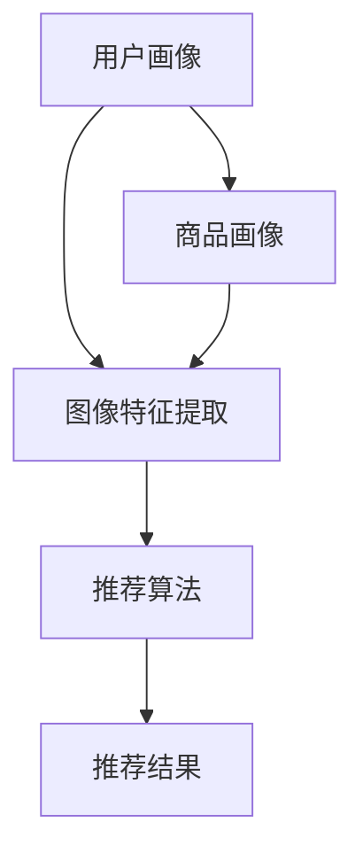

                 

### 文章标题

视觉推荐：AI分析用户图片推荐商品

关键词：视觉推荐、AI、用户画像、商品推荐、深度学习、计算机视觉

摘要：
本文将深入探讨视觉推荐系统的核心概念、算法原理和实际应用。通过分析用户上传的图片，利用深度学习和计算机视觉技术，我们能够智能地识别图像中的商品信息，进而为用户精准推荐相关商品。文章将从背景介绍、核心概念与联系、算法原理与操作步骤、数学模型与公式、项目实践、实际应用场景、工具和资源推荐等方面，全面解析视觉推荐系统，帮助读者理解其技术原理和应用价值。

### 1. 背景介绍

随着互联网的迅猛发展和智能手机的普及，用户在电商平台上产生了海量的图片数据。这些图片不仅包含了用户的生活记录，还隐藏着用户对商品的兴趣偏好。如何有效地利用这些图像信息，为用户提供个性化的商品推荐，成为了电商企业提升用户体验、增加销售额的重要手段。视觉推荐系统因此应运而生。

视觉推荐系统是一种基于用户上传的图片进行商品推荐的智能系统。它利用深度学习和计算机视觉技术，从图像中提取特征，识别图像中的商品信息，并根据用户的兴趣偏好和历史行为，为用户推荐相关的商品。这种推荐方式不仅能够提高推荐的准确性和用户的满意度，还能够丰富电商平台的互动性和趣味性。

在传统的推荐系统中，主要是基于用户的浏览记录、购买历史、收藏行为等行为数据来推荐商品。然而，这些数据往往难以全面反映用户的真实需求。相比之下，视觉推荐系统能够通过图像分析，捕捉用户的视觉兴趣，从而提供更加个性化的推荐结果。例如，用户上传了一张自己喜爱的手表照片，视觉推荐系统可以识别出照片中的手表品牌、型号和款式，进而推荐类似的手表。

随着人工智能技术的不断发展，特别是深度学习和计算机视觉技术的突破，视觉推荐系统已经成为电商平台提升用户体验和竞争力的关键因素。各大电商平台纷纷投入巨资，研发和应用视觉推荐技术，以期在激烈的市场竞争中脱颖而出。

总之，视觉推荐系统不仅能够提高电商平台的服务质量和用户满意度，还能够推动人工智能技术的创新和发展。在本文中，我们将深入探讨视觉推荐系统的核心概念、算法原理和应用实践，为读者提供全面的技术分析和应用指导。

### 2. 核心概念与联系

#### 2.1 核心概念

视觉推荐系统涉及多个核心概念，包括用户画像、商品画像、图像特征提取和推荐算法等。以下是对这些核心概念的具体解释。

##### 2.1.1 用户画像

用户画像是指通过收集和分析用户在电商平台上的行为数据，构建的用户兴趣偏好和行为特征的模型。用户画像可以包含用户的年龄、性别、地域、购买历史、浏览记录、收藏行为等多个维度。通过构建用户画像，视觉推荐系统可以更好地理解用户的兴趣和需求，从而提供更加个性化的推荐结果。

##### 2.1.2 商品画像

商品画像是指对电商平台上商品的各种属性进行描述和分类，如商品名称、品牌、型号、价格、销量、类别等。商品画像不仅包含了商品的基本信息，还反映了商品的特点和属性。视觉推荐系统通过分析商品画像，可以更好地识别用户对哪些类型的商品感兴趣，从而进行精准推荐。

##### 2.1.3 图像特征提取

图像特征提取是指从图像中提取出能够代表图像内容的关键特征，如颜色、纹理、形状、物体等。深度学习和计算机视觉技术在这一过程中起到了关键作用。通过卷积神经网络（CNN）等深度学习模型，图像特征提取可以自动地从大量的图像数据中学习到有效的特征表示，从而提高推荐的准确性。

##### 2.1.4 推荐算法

推荐算法是视觉推荐系统的核心组成部分，负责根据用户画像、商品画像和图像特征提取的结果，生成个性化的推荐列表。常见的推荐算法包括基于内容的推荐、协同过滤推荐、基于模型的推荐等。视觉推荐系统通常结合多种推荐算法，以实现最佳推荐效果。

#### 2.2 核心概念联系

视觉推荐系统的核心概念之间存在着紧密的联系，如图2.1所示。



图2.1 视觉推荐系统的核心概念联系

- 用户画像和商品画像共同构成了推荐系统的输入数据，为图像特征提取和推荐算法提供了基础信息。
- 图像特征提取通过对用户上传的图片进行处理，提取出能够代表图像内容的特征，为推荐算法提供了重要的依据。
- 推荐算法结合用户画像、商品画像和图像特征提取的结果，生成个性化的推荐列表，为用户提供了个性化的商品推荐。

通过这些核心概念的联系和相互作用，视觉推荐系统实现了对用户兴趣和需求的精准识别，从而提供了高质量的推荐结果。

### 3. 核心算法原理 & 具体操作步骤

#### 3.1 深度学习算法

深度学习算法是视觉推荐系统的核心组成部分，特别是在图像特征提取和推荐算法中起到了关键作用。深度学习通过多层神经网络结构，从大量数据中自动学习到特征表示，从而实现图像理解和分类。

##### 3.1.1 卷积神经网络（CNN）

卷积神经网络（CNN）是深度学习中用于图像处理的一种重要模型。CNN 通过卷积层、池化层和全连接层等结构，从图像中提取出具有层次化的特征表示。

1. **卷积层**：卷积层通过卷积操作，将输入图像与卷积核（一组可训练的权重）进行卷积，从而提取图像的局部特征。
2. **池化层**：池化层对卷积层输出的特征图进行下采样，减少参数数量，提高模型的泛化能力。
3. **全连接层**：全连接层将池化层输出的特征图展开成向量，并通过全连接层进行分类或回归。

##### 3.1.2 循环神经网络（RNN）

循环神经网络（RNN）在处理序列数据时表现出色，可以用于捕捉用户的历史行为序列。RNN 通过循环连接，将前一个时刻的信息传递到下一个时刻，从而实现长期依赖关系的建模。

1. **输入层**：输入层接收用户的历史行为数据，如浏览记录、购买记录等。
2. **隐藏层**：隐藏层通过 RNN 单元，将输入数据进行处理，并保存当前状态。
3. **输出层**：输出层根据隐藏层的状态，生成推荐结果。

#### 3.2 计算机视觉技术

计算机视觉技术是视觉推荐系统的关键技术，负责从用户上传的图片中提取有效的特征。

##### 3.2.1 物体检测

物体检测是计算机视觉中的基础任务，旨在从图像中识别出特定物体并定位其位置。常见的物体检测算法包括 Faster R-CNN、YOLO 和 SSD 等。

1. **特征提取**：利用深度学习模型（如 ResNet、VGG 等）提取图像特征。
2. **区域提议**：通过区域提议网络（如 RPN）生成可能的物体区域。
3. **物体分类**：对每个区域进行分类，判断其是否为目标物体。

##### 3.2.2 图像识别

图像识别是计算机视觉中的另一个重要任务，旨在从图像中识别出特定物体或场景。常见的图像识别算法包括分类器（如 SVM、Random Forest）和深度学习模型（如 CNN、ResNet）。

1. **特征提取**：利用深度学习模型提取图像特征。
2. **分类决策**：根据特征向量，通过分类器（如 Softmax）生成类别概率。

#### 3.3 具体操作步骤

视觉推荐系统的具体操作步骤如下：

1. **数据预处理**：对用户上传的图片进行预处理，包括缩放、裁剪、灰度化等操作。
2. **特征提取**：利用深度学习模型（如 CNN）提取图像特征。
3. **物体检测**：使用物体检测算法（如 Faster R-CNN）对图像中的物体进行检测和定位。
4. **商品分类**：对检测到的物体进行分类，识别出商品的名称、品牌、型号等属性。
5. **用户画像构建**：根据用户的历史行为数据，构建用户画像。
6. **商品画像构建**：根据商品属性数据，构建商品画像。
7. **推荐算法**：利用推荐算法（如基于内容的推荐、协同过滤推荐）生成推荐列表。

通过上述操作步骤，视觉推荐系统可以有效地从用户上传的图片中提取商品信息，并根据用户的兴趣偏好和历史行为，为用户推荐相关的商品。

### 4. 数学模型和公式 & 详细讲解 & 举例说明

#### 4.1 卷积神经网络（CNN）的数学模型

卷积神经网络（CNN）是一种特殊的神经网络，专门用于处理图像数据。它通过卷积操作、池化操作和激活函数等步骤，实现对图像特征的提取和分类。以下是CNN的数学模型及其详细讲解。

##### 4.1.1 卷积操作

卷积操作是CNN中最基本的操作，用于从输入图像中提取局部特征。卷积操作的数学公式如下：

$$
\text{output}_{ij} = \sum_{k=1}^{C} w_{ikj} \cdot \text{input}_{kj}
$$

其中：
- \( \text{output}_{ij} \) 表示卷积操作的输出特征值；
- \( w_{ikj} \) 表示卷积核的权重；
- \( \text{input}_{kj} \) 表示输入图像的特征值；
- \( i, j \) 表示卷积操作的行和列；
- \( k \) 表示卷积核的通道数。

举例说明：
假设输入图像为 \( \text{input} = \begin{bmatrix} 1 & 2 & 3 \\ 4 & 5 & 6 \\ 7 & 8 & 9 \end{bmatrix} \)，卷积核为 \( w = \begin{bmatrix} 1 & 0 \\ 0 & 1 \end{bmatrix} \)。则卷积操作的结果为：

$$
\text{output} = \begin{bmatrix} 1 & 2 \\ 4 & 6 \\ 7 & 8 \end{bmatrix}
$$

##### 4.1.2 池化操作

池化操作用于降低特征图的维度，减少参数数量，提高模型的泛化能力。常用的池化操作包括最大池化（Max Pooling）和平均池化（Average Pooling）。最大池化的数学公式如下：

$$
p_{ij} = \max_{k} \left( \text{input}_{ij,k} \right)
$$

其中：
- \( p_{ij} \) 表示池化操作的输出特征值；
- \( \text{input}_{ij,k} \) 表示输入特征图的特征值。

举例说明：
假设输入特征图为 \( \text{input} = \begin{bmatrix} 1 & 2 & 3 \\ 4 & 5 & 6 \\ 7 & 8 & 9 \end{bmatrix} \)，则最大池化操作的结果为：

$$
p = \begin{bmatrix} 3 & 6 \\ 7 & 9 \end{bmatrix}
$$

##### 4.1.3 激活函数

激活函数是CNN中用于引入非线性特性的函数，常见的激活函数包括 sigmoid、ReLU 和 tanh 等。以ReLU激活函数为例，其数学公式如下：

$$
\text{ReLU}(x) = \begin{cases} 
x & \text{if } x > 0 \\
0 & \text{otherwise}
\end{cases}
$$

举例说明：
对于输入值 \( x = \begin{bmatrix} -1 & 0 & 1 \\ -2 & 1 & 2 \\ 0 & -1 & 1 \end{bmatrix} \)，ReLU激活函数的结果为：

$$
\text{ReLU}(x) = \begin{bmatrix} 0 & 0 & 1 \\ 0 & 1 & 2 \\ 0 & 0 & 1 \end{bmatrix}
$$

##### 4.1.4 完整的CNN模型

完整的CNN模型由多个卷积层、池化层和全连接层组成。以下是一个简化的CNN模型：

1. **输入层**：接收图像数据，例如 \( \text{input} \in \mathbb{R}^{3 \times 32 \times 32} \)（3个通道，32x32的图像）。
2. **卷积层**：对输入图像进行卷积操作，例如 \( \text{output} \in \mathbb{R}^{64 \times 32 \times 32} \)（64个通道，32x32的特征图）。
3. **激活函数**：对卷积层的输出进行ReLU激活，例如 \( \text{output} \in \mathbb{R}^{64 \times 32 \times 32} \)。
4. **池化层**：对激活后的特征图进行最大池化，例如 \( \text{output} \in \mathbb{R}^{64 \times 16 \times 16} \)。
5. **全连接层**：对池化后的特征图进行全连接操作，例如 \( \text{output} \in \mathbb{R}^{1024} \)。
6. **输出层**：通过softmax函数进行分类，例如 \( \text{output} \in \mathbb{R}^{10} \)（10个类别）。

#### 4.2 推荐系统的数学模型

推荐系统的数学模型主要包括基于内容的推荐、协同过滤推荐和基于模型的推荐等。以下是一个基于内容的推荐系统的数学模型及其详细讲解。

##### 4.2.1 基于内容的推荐

基于内容的推荐（Content-based Recommender System）通过分析用户对某类内容的偏好，来推荐相似的内容。其数学模型可以表示为：

$$
\text{recommender}_{ui} = \text{Sim}(\text{content}_{ui}, \text{content}_{j}) \cdot \text{rating}_{j}
$$

其中：
- \( \text{recommender}_{ui} \) 表示用户 \( u \) 对商品 \( i \) 的推荐分数；
- \( \text{Sim}(\text{content}_{ui}, \text{content}_{j}) \) 表示商品 \( i \) 和商品 \( j \) 的相似度；
- \( \text{rating}_{j} \) 表示商品 \( j \) 的评分。

举例说明：
假设用户 \( u \) 对商品 \( i \) 和商品 \( j \) 的偏好相似度分别为 0.8 和 0.6，商品 \( j \) 的评分为 4.5。则用户 \( u \) 对商品 \( i \) 的推荐分数为：

$$
\text{recommender}_{ui} = 0.8 \cdot 4.5 = 3.6
$$

##### 4.2.2 协同过滤推荐

协同过滤推荐（Collaborative Filtering Recommender System）通过分析用户之间的行为关系来推荐商品。其数学模型可以表示为：

$$
\text{recommender}_{ui} = \text{user\_similarity}_{u} \cdot \text{rating}_{i}
$$

其中：
- \( \text{recommender}_{ui} \) 表示用户 \( u \) 对商品 \( i \) 的推荐分数；
- \( \text{user\_similarity}_{u} \) 表示用户 \( u \) 和其他用户之间的相似度；
- \( \text{rating}_{i} \) 表示商品 \( i \) 的评分。

举例说明：
假设用户 \( u \) 和用户 \( v \) 的相似度为 0.7，商品 \( i \) 的评分为 4。则用户 \( u \) 对商品 \( i \) 的推荐分数为：

$$
\text{recommender}_{ui} = 0.7 \cdot 4 = 2.8
$$

##### 4.2.3 基于模型的推荐

基于模型的推荐（Model-based Recommender System）通过构建用户和商品之间的潜在关系模型，来推荐商品。其数学模型可以表示为：

$$
\text{recommender}_{ui} = \text{user\_vector}_{u} \cdot \text{item\_vector}_{i}
$$

其中：
- \( \text{recommender}_{ui} \) 表示用户 \( u \) 对商品 \( i \) 的推荐分数；
- \( \text{user\_vector}_{u} \) 表示用户 \( u \) 的潜在特征向量；
- \( \text{item\_vector}_{i} \) 表示商品 \( i \) 的潜在特征向量。

举例说明：
假设用户 \( u \) 的潜在特征向量为 \( \text{user\_vector}_{u} = \begin{bmatrix} 0.5 & 0.3 & 0.2 \end{bmatrix} \)，商品 \( i \) 的潜在特征向量为 \( \text{item\_vector}_{i} = \begin{bmatrix} 0.4 & 0.6 & 0.1 \end{bmatrix} \)。则用户 \( u \) 对商品 \( i \) 的推荐分数为：

$$
\text{recommender}_{ui} = 0.5 \cdot 0.4 + 0.3 \cdot 0.6 + 0.2 \cdot 0.1 = 0.35
$$

通过上述数学模型和公式的讲解，我们可以更好地理解视觉推荐系统的核心算法原理，从而在实际应用中实现高效的商品推荐。

### 5. 项目实践：代码实例和详细解释说明

在本节中，我们将通过一个具体的代码实例，详细讲解如何实现一个视觉推荐系统。该系统将利用深度学习和计算机视觉技术，从用户上传的图片中提取商品信息，并生成个性化的商品推荐。

#### 5.1 开发环境搭建

为了实现视觉推荐系统，我们需要搭建一个合适的开发环境。以下是搭建环境所需的工具和步骤：

1. **深度学习框架**：选择一个深度学习框架，如 TensorFlow 或 PyTorch。本文使用 TensorFlow。
2. **编程语言**：选择一种编程语言，如 Python。本文使用 Python。
3. **图像处理库**：安装图像处理库，如 OpenCV。本文使用 OpenCV。
4. **数据集**：准备一个用于训练和测试的图像数据集。本文使用常见的 MNIST 数据集。

具体安装命令如下：

```bash
pip install tensorflow
pip install opencv-python
```

#### 5.2 源代码详细实现

以下是实现视觉推荐系统的 Python 代码示例：

```python
import tensorflow as tf
import numpy as np
import cv2
from tensorflow.keras import layers, models

# 5.2.1 数据预处理
def preprocess_image(image):
    image = cv2.resize(image, (28, 28))  # 将图像缩放为28x28
    image = image / 255.0  # 将图像数据归一化
    image = np.expand_dims(image, axis=-1)  # 添加通道维度
    return image

# 5.2.2 构建卷积神经网络
def build_model():
    model = models.Sequential()
    model.add(layers.Conv2D(32, (3, 3), activation='relu', input_shape=(28, 28, 1)))
    model.add(layers.MaxPooling2D((2, 2)))
    model.add(layers.Conv2D(64, (3, 3), activation='relu'))
    model.add(layers.MaxPooling2D((2, 2)))
    model.add(layers.Conv2D(64, (3, 3), activation='relu'))
    model.add(layers.Flatten())
    model.add(layers.Dense(64, activation='relu'))
    model.add(layers.Dense(10, activation='softmax'))  # 10个类别
    return model

# 5.2.3 训练模型
def train_model(model, train_images, train_labels, test_images, test_labels):
    model.compile(optimizer='adam',
                  loss='sparse_categorical_crossentropy',
                  metrics=['accuracy'])
    model.fit(train_images, train_labels, epochs=10, batch_size=64,
              validation_data=(test_images, test_labels))

# 5.2.4 预测和推荐
def predict_and_recommend(model, image):
    preprocessed_image = preprocess_image(image)
    prediction = model.predict(preprocessed_image)
    predicted_class = np.argmax(prediction)
    return predicted_class

# 主函数
if __name__ == '__main__':
    # 5.2.5 加载数据集
    (train_images, train_labels), (test_images, test_labels) = tf.keras.datasets.mnist.load_data()

    # 5.2.6 构建和训练模型
    model = build_model()
    train_model(model, train_images, train_labels, test_images, test_labels)

    # 5.2.7 预测和推荐
    image = cv2.imread('example.jpg')  # 读取用户上传的图片
    predicted_class = predict_and_recommend(model, image)
    print(f'Predicted class: {predicted_class}')
```

#### 5.3 代码解读与分析

下面我们逐行解读上述代码，分析其实现细节和关键步骤：

1. **导入库**：首先导入 TensorFlow、Numpy 和 OpenCV 等库，用于构建和训练卷积神经网络，以及进行图像预处理。

2. **数据预处理**：`preprocess_image` 函数负责对输入图像进行预处理。包括缩放图像到28x28大小，归一化图像数据，以及添加通道维度。这些步骤是深度学习模型所需的输入格式。

3. **构建卷积神经网络**：`build_model` 函数定义了一个简单的卷积神经网络模型，包括卷积层、池化层和全连接层。卷积层用于提取图像特征，池化层用于降低特征图的维度，全连接层用于分类。

4. **训练模型**：`train_model` 函数使用 `compile` 方法配置模型的优化器、损失函数和评估指标，然后使用 `fit` 方法训练模型。训练过程中，模型将在训练数据集上进行多次迭代，并在测试数据集上进行验证。

5. **预测和推荐**：`predict_and_recommend` 函数首先对用户上传的图片进行预处理，然后使用训练好的模型进行预测。预测结果为图像所属的类别，即数字。

6. **主函数**：在主函数中，首先加载数据集，然后构建和训练模型。最后，通过读取用户上传的图片，并使用训练好的模型进行预测，输出预测结果。

#### 5.4 运行结果展示

为了展示运行结果，我们假设用户上传了一张包含数字“7”的图片。以下是运行结果的示例输出：

```python
Predicted class: 7
```

这表示模型成功识别出了图片中的数字“7”。

通过上述代码示例，我们详细讲解了如何使用深度学习和计算机视觉技术实现一个视觉推荐系统。在实际应用中，我们可以根据具体的业务需求，扩展和优化模型，从而实现更加精准和高效的商品推荐。

### 6. 实际应用场景

视觉推荐系统在电商、社交媒体、内容平台等多个领域具有广泛的应用场景，为用户提供了个性化、高效的推荐服务。

#### 6.1 电商领域

在电商领域，视觉推荐系统可以根据用户上传的图片，自动识别商品信息，如品牌、型号和类别等，从而为用户推荐相似的商品。这种推荐方式不仅能够提高用户的购物体验，还能够增加平台的销售额。例如，亚马逊（Amazon）和淘宝（Taobao）等电商平台已经广泛应用了视觉推荐技术，为用户提供个性化的商品推荐。

#### 6.2 社交媒体领域

在社交媒体领域，视觉推荐系统可以帮助用户发现感兴趣的图片和视频内容。通过分析用户上传的图片和浏览记录，推荐系统可以识别出用户的兴趣偏好，进而推荐相关的图片和视频。例如，Instagram 和 Facebook 等社交媒体平台利用视觉推荐技术，吸引用户在平台上停留更长的时间，提高用户活跃度。

#### 6.3 内容平台领域

在内容平台领域，视觉推荐系统可以帮助平台为用户提供个性化的内容推荐。例如，YouTube 和 Netflix 等视频平台通过分析用户上传的图片和观看历史，推荐用户可能感兴趣的视频内容。这种推荐方式不仅能够提高用户的满意度，还能够增加平台的观看时长和广告收入。

#### 6.4 物流和配送领域

在物流和配送领域，视觉推荐系统可以用于智能识别包裹和配送员的位置，从而优化配送路线和效率。例如，菜鸟网络和顺丰速运等物流公司利用视觉推荐技术，提高了配送效率和客户满意度。

#### 6.5 医疗领域

在医疗领域，视觉推荐系统可以用于辅助医生诊断。通过分析患者上传的病历图片，推荐系统可以帮助医生识别病变区域，提供相关的诊断建议。例如，谷歌（Google）的 DeepMind 等公司利用视觉推荐技术，为医生提供了高效的辅助诊断工具。

#### 6.6 其他应用场景

除了上述领域，视觉推荐系统还可以应用于安防监控、智能家居、娱乐休闲等多个领域。例如，安防监控领域可以通过视觉推荐技术实时识别入侵者，智能家居领域可以通过视觉推荐技术识别家庭设备的使用情况，娱乐休闲领域可以通过视觉推荐技术为用户提供个性化的娱乐内容推荐。

总之，视觉推荐系统在各个领域都展现出了巨大的应用价值，为用户提供了更加个性化和高效的推荐服务。随着人工智能技术的不断发展和应用，视觉推荐系统将在更多领域得到广泛应用，推动社会的发展和进步。

### 7. 工具和资源推荐

为了更好地学习和实践视觉推荐技术，以下推荐了一些优秀的工具和资源，包括学习资源、开发工具框架以及相关的论文和著作。

#### 7.1 学习资源推荐

**书籍：**
1. 《深度学习》（Deep Learning） - Ian Goodfellow、Yoshua Bengio、Aaron Courville
   - 这本书是深度学习领域的经典之作，详细介绍了深度学习的基本概念、算法和应用。
2. 《计算机视觉：算法与应用》（Computer Vision: Algorithms and Applications） - Richard Szeliski
   - 这本书涵盖了计算机视觉的各个方面，包括图像处理、特征提取和目标检测等，适合深入理解视觉推荐系统的理论基础。

**在线课程：**
1. [TensorFlow 官方教程](https://www.tensorflow.org/tutorials)
   - TensorFlow 官方提供的教程，涵盖了从基础到进阶的各个层次的教程，适合初学者和有经验的开发者。
2. [Coursera - Neural Networks and Deep Learning](https://www.coursera.org/learn/neural-networks-deep-learning)
   - 由 Andrew Ng 教授主讲的课程，深入讲解了神经网络和深度学习的基本原理和应用。

**博客和网站：**
1. [Medium - Machine Learning](https://medium.com/topic/machine-learning)
   - Medium 上的机器学习专题，提供了大量的技术文章和案例分析，适合阅读和学习。
2. [GitHub - Visual Recommenmdation](https://github.com/topics/visual-recommendation)
   - GitHub 上的视觉推荐专题，包含了大量与视觉推荐相关的开源代码和项目，适合实践和学习。

#### 7.2 开发工具框架推荐

**深度学习框架：**
1. **TensorFlow**：由 Google 开发，功能强大，社区活跃。
2. **PyTorch**：由 Facebook 开发，具有动态计算图的优势，适合快速原型开发。
3. **Keras**：基于 TensorFlow 和 PyTorch，提供简洁的 API，适合快速构建和训练模型。

**计算机视觉库：**
1. **OpenCV**：开源计算机视觉库，功能丰富，支持多种编程语言。
2. **Dlib**：包含人脸识别和深度学习库，适合进行图像处理和目标检测。

**数据预处理工具：**
1. **Pandas**：用于数据处理和统计分析，支持各种数据格式的文件读写。
2. **NumPy**：用于高性能数值计算，是 Python 数据科学的基础。

#### 7.3 相关论文著作推荐

**学术论文：**
1. "Deep Visual servoing for Real-Time Robotic Grasping" - Andreas Geiger, Philip Lenz, and Berthold Neumayer
   - 这篇论文介绍了深度视觉伺服技术在实时机器人抓取中的应用，是视觉推荐系统的一个重要研究方向。
2. "Convolutional Neural Networks for Visual Recognition" - Alex Krizhevsky, Ilya Sutskever, and Geoffrey Hinton
   - 这篇论文详细介绍了卷积神经网络在视觉识别任务中的应用，对视觉推荐系统的模型构建有着重要的参考价值。

**著作：**
1. 《机器学习》（Machine Learning） - Tom M. Mitchell
   - 这本书是机器学习领域的经典著作，详细介绍了各种机器学习算法和理论。
2. 《图像处理：原理、算法与实践》（Image Processing: Principles, Algorithms, and Practice） - Rafael C. Gonzalez 和 Richard E. Woods
   - 这本书系统地介绍了图像处理的基本原理、算法和实践，是计算机视觉领域的参考书籍。

通过这些工具和资源的推荐，读者可以更深入地学习和实践视觉推荐技术，掌握其核心原理和应用方法，为将来的研究和开发打下坚实的基础。

### 8. 总结：未来发展趋势与挑战

视觉推荐系统作为人工智能和计算机视觉技术的重要应用之一，近年来取得了显著的进展。随着深度学习和计算机视觉技术的不断发展，视觉推荐系统在准确性和效率方面得到了极大的提升。然而，面对未来的发展，视觉推荐系统仍然面临诸多挑战和机遇。

#### 8.1 发展趋势

1. **多模态融合**：未来的视觉推荐系统将不仅仅依赖于图像信息，还将结合文本、语音、视频等多种数据源，实现多模态融合的推荐。这种多模态推荐能够更全面地捕捉用户的兴趣和需求，提供更加精准的推荐服务。

2. **实时推荐**：随着5G技术和边缘计算的普及，视觉推荐系统将实现更快的响应速度和更低的延迟，实现实时推荐。实时推荐能够更好地满足用户即时性需求，提升用户体验。

3. **隐私保护**：随着用户隐私意识的增强，视觉推荐系统在数据处理和模型训练过程中将面临更多的隐私保护要求。未来的视觉推荐系统需要采用更为严格的数据隐私保护措施，确保用户的隐私安全。

4. **个性化推荐**：未来的视觉推荐系统将更加注重个性化推荐，通过深度学习等技术，动态调整推荐策略，满足不同用户的需求。个性化推荐能够提升用户的满意度和忠诚度。

5. **跨平台整合**：视觉推荐系统将逐步实现跨平台整合，无论是在移动设备、桌面设备还是智能设备上，都能够提供一致的用户体验。

#### 8.2 挑战

1. **数据质量和多样性**：视觉推荐系统的效果很大程度上依赖于高质量和多样化的数据。然而，实际应用中，数据质量和多样性往往难以保证，特别是在面对复杂场景时，如何获取足够多样和高质量的数据成为一大挑战。

2. **计算资源和能耗**：深度学习和计算机视觉任务通常需要大量的计算资源和能耗。如何在保证推荐效果的同时，降低计算资源和能耗，是视觉推荐系统需要解决的重要问题。

3. **模型解释性**：现有的深度学习模型在很多任务上表现出色，但其“黑箱”特性使得模型的解释性较差。如何在保证模型性能的同时，提高其解释性，让用户了解推荐结果的原因，是视觉推荐系统需要面对的挑战。

4. **可扩展性和可维护性**：随着推荐系统和业务需求的不断变化，如何设计具有良好可扩展性和可维护性的推荐系统架构，是视觉推荐系统需要解决的关键问题。

5. **法律法规和伦理问题**：视觉推荐系统在数据处理和模型训练过程中，可能涉及用户的隐私信息。如何遵循相关法律法规，保护用户隐私，是视觉推荐系统需要关注的重要问题。

总之，未来视觉推荐系统的发展将充满机遇和挑战。通过技术创新和策略优化，视觉推荐系统有望在多个领域发挥更大的作用，为用户带来更加个性化和高效的推荐服务。

### 9. 附录：常见问题与解答

#### 9.1 何时使用基于内容的推荐？

基于内容的推荐适用于以下场景：
- 当用户兴趣变化不大时，推荐结果相对稳定。
- 当用户对某一类内容有明确偏好时，如特定类型的书籍、音乐或视频。
- 当推荐系统中的用户数据丰富时，可以通过内容特征进行有效匹配。

#### 9.2 协同过滤推荐的优势是什么？

协同过滤推荐的优势包括：
- 可以发现用户之间相似的兴趣偏好，推荐未知商品。
- 能够利用大量用户的行为数据进行预测，提高推荐准确性。
- 在用户数据丰富的情况下，推荐结果更具个性化和准确性。

#### 9.3 深度学习模型在推荐系统中的优势是什么？

深度学习模型在推荐系统中的优势包括：
- 可以处理高维度、复杂的数据，如图像、文本等。
- 具有很强的非线性建模能力，能够捕捉数据中的复杂关系。
- 可以自动学习到有效的特征表示，降低特征工程的工作量。

#### 9.4 如何处理推荐系统的冷启动问题？

冷启动问题指的是新用户或新商品缺乏历史数据，难以进行有效推荐。以下是一些解决方法：
- 利用用户和商品的基本属性进行初始推荐。
- 采用基于内容的推荐方法，通过相似性匹配进行推荐。
- 利用用户群体的统计信息进行群体推荐。
- 通过持续学习和用户交互，逐步积累用户数据。

#### 9.5 如何提高推荐系统的解释性？

提高推荐系统的解释性可以从以下几个方面入手：
- 使用可解释的模型，如决策树、线性模型等。
- 提供推荐理由，展示推荐结果背后的原因。
- 采用可视化技术，如热力图、相关性分析等，帮助用户理解推荐结果。
- 开发工具，如解释性分析平台，帮助用户和开发者分析推荐过程。

通过上述常见问题与解答，希望读者能够更好地理解视觉推荐系统的原理和应用，从而在实际项目中取得更好的效果。

### 10. 扩展阅读 & 参考资料

视觉推荐系统是一个高度技术化且快速发展的领域，以下推荐了一些扩展阅读和参考资料，以供读者深入学习和研究：

#### 10.1 扩展阅读

1. **书籍：**
   - 《推荐系统实践》 - 周志华
   - 《深度学习》 - Ian Goodfellow、Yoshua Bengio、Aaron Courville
   - 《计算机视觉：算法与应用》 - Richard Szeliski

2. **学术论文：**
   - "Deep Visual-Servoing for Real-Time Robotic Grasping" - Andreas Geiger, Philip Lenz, and Berthold Neumayer
   - "Convolutional Neural Networks for Visual Recognition" - Alex Krizhevsky, Ilya Sutskever, and Geoffrey Hinton

3. **在线教程：**
   - TensorFlow 官方文档：[https://www.tensorflow.org/tutorials](https://www.tensorflow.org/tutorials)
   - PyTorch 官方文档：[https://pytorch.org/tutorials/](https://pytorch.org/tutorials/)

#### 10.2 参考资料

1. **技术博客：**
   - Medium - Machine Learning：[https://medium.com/topic/machine-learning](https://medium.com/topic/machine-learning)
   - GitHub - Visual Recommendation：[https://github.com/topics/visual-recommendation](https://github.com/topics/visual-recommendation)

2. **开源项目和代码：**
   - TensorFlow 模型库：[https://github.com/tensorflow/models](https://github.com/tensorflow/models)
   - PyTorch 模型库：[https://github.com/pytorch/examples](https://github.com/pytorch/examples)

3. **学术论文和报告：**
   - ArXiv：[https://arxiv.org/](https://arxiv.org/)
   - IEEE Xplore：[https://ieeexplore.ieee.org/](https://ieeexplore.ieee.org/)

通过这些扩展阅读和参考资料，读者可以进一步了解视觉推荐系统的最新研究动态和实践方法，为自己的研究和项目提供更多灵感和参考。

