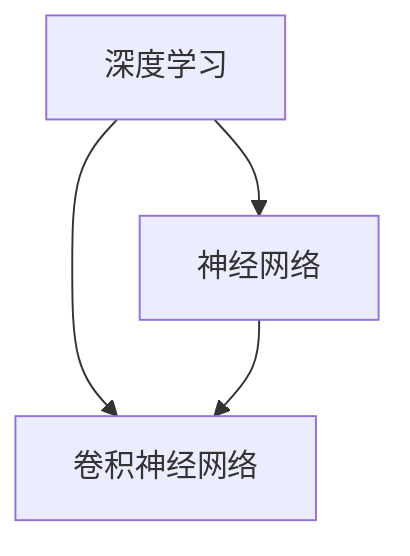
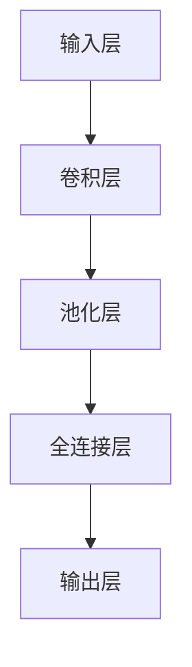

                 

### 文章标题：视频大模型的核心技术解析

#### 关键词：（视频大模型、深度学习、计算机视觉、神经网络、算法优化、应用场景）

> 摘要：本文深入探讨了视频大模型的核心技术，从背景介绍、核心概念与联系、核心算法原理、数学模型与公式、项目实践、实际应用场景等多个方面进行了详细解析。通过对视频大模型的技术要点进行逐步分析，帮助读者全面了解这一领域的发展现状与未来趋势。

### 1. 背景介绍

视频大模型（Video Large Models）是一种基于深度学习的计算机视觉模型，用于处理和分析大规模的视频数据。随着人工智能技术的快速发展，特别是深度学习在计算机视觉领域的突破，视频大模型已经成为计算机视觉研究的热点。它们在视频内容理解、视频分类、目标检测、动作识别等任务中取得了显著的效果。

视频大模型的发展历程可以追溯到2012年，当年AlexNet在ImageNet图像识别比赛中取得的巨大成功，标志着深度学习进入了一个新的时代。此后，随着计算资源的增加和算法的优化，深度学习模型在图像和视频处理领域的应用逐渐成熟。特别是在2016年，Google推出了用于视频处理的Inception模型，进一步推动了视频大模型的发展。

近年来，视频大模型在自动驾驶、智能监控、医疗影像、视频娱乐等领域的应用逐渐扩大。例如，自动驾驶系统需要实时处理大量的视频数据，以识别道路上的行人和车辆；智能监控则需要通过视频分析来提高安全监控的效率；医疗影像分析利用视频大模型可以帮助医生更准确地诊断病情；视频娱乐领域则通过视频大模型实现个性化推荐，提高用户体验。

总的来说，视频大模型已经成为人工智能领域的一个重要研究方向，其技术的成熟和应用的拓展有望带来更多的社会和经济效益。

### 2. 核心概念与联系

#### 核心概念

视频大模型涉及多个核心概念，包括深度学习、神经网络、卷积神经网络（CNN）等。以下是这些概念的基本定义和相互关系：

1. **深度学习（Deep Learning）**：深度学习是一种机器学习方法，通过构建深层神经网络（DNN）来模拟人脑的决策过程，从而实现自动化特征学习和模式识别。深度学习在图像识别、语音识别、自然语言处理等领域取得了显著的进展。

2. **神经网络（Neural Network）**：神经网络是由大量相互连接的神经元组成的计算模型，可以用于解决各种复杂的计算问题。神经网络通过学习输入数据和输出结果之间的映射关系，来实现对数据的处理和分析。

3. **卷积神经网络（CNN）**：卷积神经网络是一种特殊的神经网络，专门用于处理二维数据，如图像。CNN通过卷积层提取图像的特征，然后通过池化层降低数据维度，最后通过全连接层进行分类和识别。

#### 核心概念联系

视频大模型是基于深度学习和神经网络构建的，其中卷积神经网络是其核心技术之一。以下是视频大模型中核心概念之间的联系：

- **深度学习**：深度学习为视频大模型提供了强大的计算能力，使其能够在大量数据中自动学习特征，提高视频处理的准确性和效率。
- **神经网络**：神经网络作为深度学习的基础，为视频大模型提供了灵活的建模方式，可以适应各种复杂的视频处理任务。
- **卷积神经网络**：卷积神经网络在图像处理领域具有独特的优势，通过卷积层和池化层对图像进行特征提取，可以实现高效的视频数据分析。

#### Mermaid 流程图

以下是一个Mermaid流程图，展示了视频大模型中核心概念之间的联系：



### 3. 核心算法原理 & 具体操作步骤

#### 深度学习算法原理

深度学习算法的核心是神经网络，特别是卷积神经网络（CNN）。以下是CNN的基本原理和具体操作步骤：

1. **卷积层（Convolutional Layer）**：卷积层是CNN的核心组成部分，通过卷积运算从输入数据中提取特征。卷积运算的过程如下：

    - **卷积核（Kernel）**：卷积层由多个卷积核组成，每个卷积核都是一个小型过滤器，用于提取图像的特征。卷积核在图像上滑动，进行逐元素乘积和求和操作，从而生成一个特征图（Feature Map）。
    - **步长（Stride）**：卷积运算的步长决定了卷积核在图像上滑动的距离。通常，步长为1或2。
    - **填充（Padding）**：填充是指在图像周围添加一定数量的空白像素，以保持特征图的尺寸与输入图像相同。

2. **池化层（Pooling Layer）**：池化层用于降低特征图的尺寸，减少计算量，同时保留重要的特征信息。常见的池化方法有最大池化（Max Pooling）和平均池化（Average Pooling）。

3. **全连接层（Fully Connected Layer）**：全连接层将特征图展平为一维向量，然后通过矩阵乘法和激活函数进行分类和识别。

#### 具体操作步骤

以下是构建一个简单的CNN模型的具体操作步骤：

1. **输入层**：输入层接收视频数据，通常是一个四维张量，维度为（批量大小，高度，宽度，通道数）。

2. **卷积层**：在输入层之后，添加一个卷积层，使用多个卷积核对输入数据进行卷积运算，生成多个特征图。

3. **池化层**：在卷积层之后，添加一个池化层，对特征图进行池化操作，降低特征图的尺寸。

4. **全连接层**：将池化层输出的特征图展平为一维向量，然后通过全连接层进行分类和识别。

5. **输出层**：输出层通过激活函数（如softmax）输出分类结果。

#### Mermaid 流程图

以下是一个Mermaid流程图，展示了CNN模型的基本结构：



### 4. 数学模型和公式 & 详细讲解 & 举例说明

#### 卷积运算公式

卷积运算的基本公式如下：

\[ (f * g)(x, y) = \sum_{i=-\infty}^{\infty} \sum_{j=-\infty}^{\infty} f(i, j) \cdot g(x-i, y-j) \]

其中，\( f \) 和 \( g \) 是两个函数，\( (x, y) \) 是输入点的坐标，\( (i, j) \) 是卷积核中点的坐标。

在CNN中，卷积运算通常使用滤波器（卷积核）对图像进行卷积，以提取图像的特征。卷积运算的具体公式如下：

\[ (f * g)(x, y) = \sum_{i=0}^{W-1} \sum_{j=0}^{H-1} f(i, j) \cdot g(x-i, y-j) \]

其中，\( W \) 和 \( H \) 分别是卷积核的宽度和高度。

#### 池化公式

池化操作的基本公式如下：

\[ P(x, y) = \max_{i, j} (f(x+i, y+j)) \]

其中，\( f \) 是输入特征图，\( P \) 是输出特征图。

在CNN中，池化操作通常使用最大池化或平均池化来降低特征图的尺寸。最大池化的公式如下：

\[ P(x, y) = \max_{i, j} (f(x+i, y+j)) \]

平均池化的公式如下：

\[ P(x, y) = \frac{1}{k^2} \sum_{i=0}^{k-1} \sum_{j=0}^{k-1} f(x+i, y+j) \]

其中，\( k \) 是池化窗口的大小。

#### 举例说明

假设有一个3x3的卷积核，其值为：

\[ \begin{bmatrix} 1 & 0 & 1 \\ 0 & 1 & 0 \\ 1 & 0 & 1 \end{bmatrix} \]

输入图像为：

\[ \begin{bmatrix} 1 & 1 & 1 \\ 1 & 1 & 1 \\ 1 & 1 & 1 \end{bmatrix} \]

使用卷积运算，得到卷积结果为：

\[ \begin{bmatrix} 3 & 1 & 3 \\ 1 & 1 & 1 \\ 3 & 1 & 3 \end{bmatrix} \]

使用最大池化，以2x2的窗口进行池化，得到池化结果为：

\[ \begin{bmatrix} 3 & 3 \\ 3 & 3 \end{bmatrix} \]

### 5. 项目实践：代码实例和详细解释说明

#### 5.1 开发环境搭建

在开始实践之前，需要搭建一个适合深度学习的开发环境。以下是搭建开发环境的步骤：

1. **安装Python**：安装Python 3.6或更高版本，可以从官方网站下载安装包。

2. **安装深度学习框架**：安装TensorFlow或PyTorch，这两个框架是目前最流行的深度学习框架。以下是安装命令：

    - TensorFlow：
    ```shell
    pip install tensorflow
    ```

    - PyTorch：
    ```shell
    pip install torch torchvision
    ```

3. **安装其他依赖库**：根据项目需求，安装其他依赖库，如NumPy、Pandas等。

#### 5.2 源代码详细实现

以下是一个简单的CNN模型，用于实现视频分类任务。代码使用了TensorFlow框架。

```python
import tensorflow as tf
from tensorflow.keras import layers, models

# 定义输入层
inputs = tf.keras.Input(shape=(128, 128, 3))

# 添加卷积层
x = layers.Conv2D(32, (3, 3), activation='relu')(inputs)
x = layers.MaxPooling2D((2, 2))(x)

# 添加全连接层
x = layers.Flatten()(x)
x = layers.Dense(64, activation='relu')(x)

# 添加输出层
outputs = layers.Dense(10, activation='softmax')(x)

# 创建模型
model = models.Model(inputs=inputs, outputs=outputs)

# 编译模型
model.compile(optimizer='adam',
              loss='categorical_crossentropy',
              metrics=['accuracy'])

# 打印模型结构
model.summary()
```

#### 5.3 代码解读与分析

上述代码实现了一个简单的CNN模型，用于图像分类任务。以下是代码的详细解读：

1. **导入库**：首先导入TensorFlow框架和相关模块，包括`tf.keras`、`layers`和`models`。

2. **定义输入层**：使用`tf.keras.Input`创建输入层，输入层的大小为128x128x3，表示图像的高度、宽度和通道数。

3. **添加卷积层**：使用`layers.Conv2D`添加卷积层，卷积核的大小为3x3，激活函数为ReLU。卷积层用于提取图像的特征。

4. **添加池化层**：使用`layers.MaxPooling2D`添加最大池化层，窗口大小为2x2。池化层用于降低特征图的尺寸，减少计算量。

5. **添加全连接层**：使用`layers.Flatten`将特征图展平为一维向量，然后使用`layers.Dense`添加全连接层，激活函数为ReLU。全连接层用于分类。

6. **添加输出层**：使用`layers.Dense`添加输出层，输出层的大小为10，表示10个分类类别，激活函数为softmax。softmax用于计算每个类别的概率。

7. **创建模型**：使用`models.Model`创建模型，将输入层和输出层连接起来。

8. **编译模型**：使用`compile`方法编译模型，指定优化器、损失函数和评估指标。

9. **打印模型结构**：使用`summary`方法打印模型的结构和参数数量。

#### 5.4 运行结果展示

以下是一个简单的运行示例，展示了如何使用训练好的模型进行图像分类。

```python
# 加载训练好的模型
model.load_weights('model.h5')

# 加载测试数据
test_images = ...  # 测试图像数据
test_labels = ...  # 测试标签数据

# 进行预测
predictions = model.predict(test_images)

# 计算准确率
accuracy = (predictions.argmax(axis=1) == test_labels).mean()
print(f"Accuracy: {accuracy}")
```

### 6. 实际应用场景

视频大模型在许多实际应用场景中展现了其强大的能力。以下是一些典型的应用场景：

1. **自动驾驶**：自动驾驶系统需要实时处理大量的视频数据，以识别道路上的行人和车辆。视频大模型可以通过对道路环境的实时分析和理解，提高自动驾驶系统的安全性和可靠性。

2. **智能监控**：智能监控系统通过视频大模型实现实时目标检测和识别，可以自动识别和追踪感兴趣的目标，提高监控效率，减少人力成本。

3. **医疗影像分析**：视频大模型可以用于医疗影像的分析，例如，通过视频大模型可以自动检测和识别疾病，帮助医生更准确地诊断病情，提高医疗效率。

4. **视频娱乐**：视频娱乐领域通过视频大模型实现个性化推荐，根据用户的观看历史和偏好，推荐合适的视频内容，提高用户体验。

5. **教育**：视频大模型可以用于教育领域的自动化评估和辅导，通过分析学生的学习行为和成绩，提供个性化的学习建议和辅导。

### 7. 工具和资源推荐

#### 7.1 学习资源推荐

1. **书籍**：

    - 《深度学习》（Goodfellow, I., Bengio, Y., & Courville, A.）
    - 《Python深度学习》（François Chollet）
    - 《计算机视觉：算法与应用》（Richard Szeliski）

2. **论文**：

    - “Deep Learning for Video Classification”（2016）
    - “Watch, Listen, and Learn: A Neural Network Approach to Audio-Visual Speech Recognition”（2018）
    - “Distributed Deep Learning: Spotting Objects in Large Videos”（2018）

3. **博客**：

    - [TensorFlow官方博客](https://www.tensorflow.org/blog/)
    - [PyTorch官方博客](https://pytorch.org/blog/)
    - [机器之心](http://www.jiqizhixin.com/)

4. **网站**：

    - [Kaggle](https://www.kaggle.com/)
    - [GitHub](https://github.com/)
    - [ArXiv](https://arxiv.org/)

#### 7.2 开发工具框架推荐

1. **深度学习框架**：

    - TensorFlow
    - PyTorch
    - Keras

2. **数据预处理工具**：

    - NumPy
    - Pandas
    - Scikit-learn

3. **版本控制工具**：

    - Git
    - SVN

#### 7.3 相关论文著作推荐

1. **论文**：

    - “Deep Learning for Video Classification”（2016）
    - “Watch, Listen, and Learn: A Neural Network Approach to Audio-Visual Speech Recognition”（2018）
    - “Distributed Deep Learning: Spotting Objects in Large Videos”（2018）

2. **著作**：

    - 《深度学习》（Goodfellow, I., Bengio, Y., & Courville, A.）
    - 《Python深度学习》（François Chollet）
    - 《计算机视觉：算法与应用》（Richard Szeliski）

### 8. 总结：未来发展趋势与挑战

视频大模型技术在未来将继续发展，有望在更多领域实现突破。以下是一些发展趋势和挑战：

#### 发展趋势

1. **算法优化**：随着计算能力的提升和算法的改进，视频大模型的计算效率将进一步提高，应用范围将不断扩大。

2. **多模态融合**：视频大模型将与其他模态（如音频、文本）进行融合，实现更全面的视频理解和分析。

3. **实时处理**：视频大模型将逐渐实现实时处理，以满足自动驾驶、智能监控等领域的需求。

4. **泛化能力提升**：通过迁移学习和数据增强等技术，视频大模型的泛化能力将得到提升，更好地适应各种应用场景。

#### 挑战

1. **数据隐私**：视频大模型处理的数据涉及个人隐私，如何在保护隐私的前提下进行数据分析和应用，是一个重要的挑战。

2. **计算资源需求**：视频大模型对计算资源的需求较高，如何在有限的计算资源下实现高效的模型训练和应用，是一个需要解决的问题。

3. **模型解释性**：视频大模型的解释性较低，如何提高模型的透明度和可解释性，使其更易于理解和接受，是一个重要的挑战。

4. **算法公平性**：如何确保视频大模型在不同人群中的公平性，避免算法偏见，是一个需要关注的问题。

### 9. 附录：常见问题与解答

#### 1. 如何选择深度学习框架？

选择深度学习框架主要取决于项目需求和个人偏好。TensorFlow和PyTorch是目前最流行的两个框架，具有丰富的功能和良好的社区支持。如果需要与TensorFlow生态系统兼容，可以选择TensorFlow；如果需要更高的灵活性和动态图功能，可以选择PyTorch。

#### 2. 如何优化视频大模型的计算效率？

优化视频大模型的计算效率可以从以下几个方面入手：

- **模型压缩**：通过剪枝、量化、蒸馏等技术减少模型参数数量，降低计算量。
- **分布式训练**：将模型分布在多个计算节点上，实现并行训练，提高训练速度。
- **GPU优化**：利用GPU的并行计算能力，优化模型在GPU上的运算效率。
- **数据预处理**：对输入数据进行预处理，减少数据传输和存储的开销。

#### 3. 如何处理视频大模型的过拟合问题？

处理视频大模型的过拟合问题可以从以下几个方面入手：

- **数据增强**：通过旋转、缩放、裁剪等数据增强技术，增加训练数据的多样性，提高模型的泛化能力。
- **正则化**：使用L1、L2正则化等技术，减少模型参数的过拟合。
- **Dropout**：在训练过程中随机丢弃一部分神经元，减少模型对特定数据的依赖。
- **早停法**：在验证集上监控模型的性能，一旦发现过拟合，提前停止训练。

### 10. 扩展阅读 & 参考资料

1. **论文**：

    - “Deep Learning for Video Classification”（2016）
    - “Watch, Listen, and Learn: A Neural Network Approach to Audio-Visual Speech Recognition”（2018）
    - “Distributed Deep Learning: Spotting Objects in Large Videos”（2018）

2. **书籍**：

    - 《深度学习》（Goodfellow, I., Bengio, Y., & Courville, A.）
    - 《Python深度学习》（François Chollet）
    - 《计算机视觉：算法与应用》（Richard Szeliski）

3. **网站**：

    - [TensorFlow官方博客](https://www.tensorflow.org/blog/)
    - [PyTorch官方博客](https://pytorch.org/blog/)
    - [机器之心](http://www.jiqizhixin.com/)

