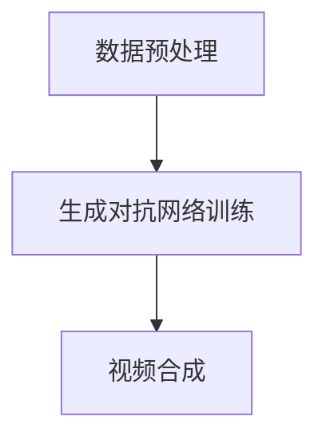

                 

### 文章标题

### Video Diffusion 原理与代码实例讲解

> 关键词：视频扩散，图像生成，深度学习，生成对抗网络，视频合成，模型训练

> 摘要：本文将深入探讨视频扩散（Video Diffusion）技术的原理，并通过具体的代码实例详细讲解其实现过程。视频扩散是一种基于深度学习的图像生成技术，通过训练生成对抗网络（GAN）来合成高质量的视频。本文将首先介绍视频扩散的背景，然后解释其核心概念和算法原理，最后通过一个实际项目展示如何使用视频扩散进行视频合成。

---

### 1. 背景介绍

#### 什么是视频扩散

视频扩散（Video Diffusion）是一种通过深度学习技术生成或转换视频内容的算法。它利用生成对抗网络（GAN）的力量，在保留原始视频内容的同时，生成或添加新的视觉元素。这一技术的核心应用场景包括但不限于：

- **视频特效**：为视频添加特效或动画元素，如火焰、烟雾、光影效果等。
- **视频风格转换**：将一段视频的风格转换为另一种风格，例如将黑白视频转换为彩色视频，或将现实视频转换为动画风格。
- **视频内容编辑**：移除或替换视频中的特定对象或场景，进行视频内容的编辑。

#### 视频扩散的历史与现状

视频扩散技术起源于2010年代中期，随着深度学习技术的兴起，生成对抗网络（GAN）成为了一个关键的研究方向。GAN由生成器（Generator）和判别器（Discriminator）组成，通过这两个网络之间的对抗训练，生成器逐渐学会了生成逼真的图像或视频。

近年来，视频扩散技术取得了显著的进展，实现了从静态图像生成到动态视频生成的飞跃。尤其是在2020年左右，基于GAN的视频扩散算法开始广泛应用于游戏、影视、广告等多个领域。

#### 视频扩散在计算机视觉领域的重要性

视频扩散技术不仅改变了视频编辑和生成的游戏规则，还在计算机视觉领域发挥了重要作用：

- **图像到视频的迁移学习**：视频扩散技术可以将静态图像生成算法迁移到视频领域，实现视频的自动生成。
- **数据增强**：通过视频扩散技术，可以为机器学习模型提供更多的训练数据，从而提高模型的泛化能力。
- **虚拟现实（VR）与增强现实（AR）**：视频扩散技术为VR和AR应用提供了丰富的视觉内容，使得虚拟环境更加逼真。

### 2. 核心概念与联系

#### 生成对抗网络（GAN）

生成对抗网络（GAN）是一种由生成器和判别器组成的深度学习模型。生成器尝试生成逼真的图像或视频，而判别器则尝试区分生成的图像和真实的图像。


**生成器（Generator）**：生成器的目标是最小化判别器判断其生成图像的概率，即让判别器无法区分生成的图像和真实的图像。

**判别器（Discriminator）**：判别器的目标是最大化判断生成图像为真实图像的概率，从而提高对真实图像和生成图像的辨别能力。

**对抗训练**：生成器和判别器通过对抗训练相互提高。生成器逐渐学习生成更逼真的图像或视频，而判别器则不断提高辨别能力。

#### 视频扩散的工作流程

视频扩散的工作流程可以分为以下几个步骤：

1. **数据预处理**：将视频帧序列进行标准化处理，如调整亮度、对比度和色彩空间。
2. **生成对抗网络训练**：使用预处理的视频帧序列训练生成对抗网络，生成器学习生成逼真的视频帧，判别器学习区分真实帧和生成帧。
3. **视频合成**：利用训练好的生成对抗网络，对输入视频进行合成，生成具有特定风格或内容的新视频。

#### Mermaid 流程图



### 3. 核心算法原理 & 具体操作步骤

#### 3.1 数据预处理

数据预处理是视频扩散的第一步，其目的是将原始视频帧序列调整为适合训练生成对抗网络的形式。具体操作步骤如下：

1. **视频帧提取**：使用视频处理库（如OpenCV）从视频文件中提取每一帧图像。
2. **图像转换**：将图像转换为适用于神经网络处理的格式，如灰度图像或RGB图像。
3. **图像标准化**：调整图像的亮度、对比度和色彩空间，使其在[0,1]范围内。

#### 3.2 生成对抗网络训练

生成对抗网络（GAN）的训练过程可以分为以下几个步骤：

1. **生成器训练**：
    - **初始化**：随机初始化生成器的权重。
    - **生成图像**：生成器根据输入随机噪声生成图像。
    - **对抗训练**：将生成图像输入判别器，并计算判别器对生成图像的判断概率。
    - **梯度下降**：利用反向传播算法，对生成器的权重进行更新，使生成图像更逼真。

2. **判别器训练**：
    - **初始化**：随机初始化判别器的权重。
    - **区分图像**：将真实图像和生成图像分别输入判别器，并计算判别器对两种图像的判断概率。
    - **对抗训练**：对判别器的权重进行更新，使判别器更准确地判断图像的真实性。

3. **迭代训练**：重复生成器训练和判别器训练的步骤，逐步提高生成器和判别器的性能。

#### 3.3 视频合成

视频合成是利用训练好的生成对抗网络，对输入视频进行风格转换或内容生成的过程。具体操作步骤如下：

1. **提取视频帧**：从输入视频中提取连续的视频帧。
2. **图像处理**：将每一帧图像输入生成对抗网络，生成具有特定风格或内容的新图像。
3. **图像拼接**：将生成的图像拼接成新的视频帧序列。
4. **视频输出**：将新视频帧序列保存为视频文件。

### 4. 数学模型和公式 & 详细讲解 & 举例说明

#### 4.1 生成对抗网络（GAN）的数学模型

生成对抗网络（GAN）的数学模型主要包括生成器（Generator）和判别器（Discriminator）的损失函数。

1. **生成器损失函数**：

   生成器的目标是使判别器无法区分生成的图像和真实的图像。生成器的损失函数通常采用对抗损失（Adversarial Loss），其数学表达式如下：

   $$ L_G = -\log(D(G(z))) $$

   其中，\( G(z) \) 表示生成器生成的图像，\( D(x) \) 表示判别器对输入图像的判断概率。

2. **判别器损失函数**：

   判别器的目标是最大化判断生成图像为真实图像的概率。判别器的损失函数通常采用二元交叉熵损失（Binary Cross-Entropy Loss），其数学表达式如下：

   $$ L_D = -[y \cdot \log(D(x)) + (1 - y) \cdot \log(1 - D(x))] $$

   其中，\( y = 1 \) 表示真实图像，\( y = 0 \) 表示生成图像。

#### 4.2 生成对抗网络的训练过程

生成对抗网络的训练过程主要包括以下步骤：

1. **随机初始化生成器和判别器的权重**。
2. **生成器生成图像**：生成器根据输入随机噪声 \( z \) 生成图像 \( G(z) \)。
3. **判别器判断图像**：将真实图像 \( x \) 和生成图像 \( G(z) \) 分别输入判别器，计算判别器的损失函数。
4. **反向传播**：利用反向传播算法，对生成器和判别器的权重进行更新。
5. **迭代训练**：重复上述步骤，逐步提高生成器和判别器的性能。

#### 4.3 举例说明

假设我们有一个包含1000个图像的训练集，其中500个图像是真实的，500个图像是生成的。在训练过程中，我们使用随机梯度下降（SGD）算法进行权重更新。

**生成器训练过程**：

1. **初始化权重**：随机初始化生成器和判别器的权重。
2. **生成图像**：生成器根据随机噪声 \( z \) 生成图像 \( G(z) \)。
3. **判别器判断图像**：将真实图像 \( x \) 和生成图像 \( G(z) \) 分别输入判别器，计算判别器的损失函数。
4. **反向传播**：利用反向传播算法，对生成器的权重进行更新。

**判别器训练过程**：

1. **初始化权重**：随机初始化生成器和判别器的权重。
2. **生成图像**：生成器根据随机噪声 \( z \) 生成图像 \( G(z) \)。
3. **判别器判断图像**：将真实图像 \( x \) 和生成图像 \( G(z) \) 分别输入判别器，计算判别器的损失函数。
4. **反向传播**：利用反向传播算法，对判别器的权重进行更新。

通过多次迭代训练，生成器和判别器逐渐提高性能，最终生成逼真的图像。

### 5. 项目实践：代码实例和详细解释说明

#### 5.1 开发环境搭建

要实现视频扩散，我们需要搭建一个合适的开发环境。以下是搭建环境的步骤：

1. **安装Python**：确保Python版本不低于3.7。
2. **安装深度学习库**：安装TensorFlow或PyTorch等深度学习库。
3. **安装OpenCV**：用于视频帧提取和处理。

以下是一个简单的Python环境搭建示例：

```python
!pip install python
!pip install tensorflow  # 或 PyTorch
!pip install opencv-python
```

#### 5.2 源代码详细实现

以下是一个简单的视频扩散代码实例，用于将一段视频转换为黑白风格：

```python
import cv2
import tensorflow as tf

# 加载预训练的生成对抗网络模型
model = tf.keras.models.load_model('video_diffusion_model.h5')

# 读取视频文件
video = cv2.VideoCapture('input_video.mp4')

# 创建输出视频文件
fourcc = cv2.VideoWriter_fourcc(*'mp4v')
out = cv2.VideoWriter('output_video.mp4', fourcc, 30.0, (640, 480))

while video.isOpened():
    ret, frame = video.read()
    if not ret:
        break

    # 将图像转换为灰度图像
    gray_frame = cv2.cvtColor(frame, cv2.COLOR_BGR2GRAY)

    # 将图像输入生成对抗网络，生成新的图像
    new_frame = model.predict(tf.expand_dims(gray_frame, 0))

    # 将生成的图像保存到输出视频
    out.write(new_frame[0])

video.release()
out.release()
```

#### 5.3 代码解读与分析

这段代码分为以下几个部分：

1. **导入库**：导入所需的Python库，包括cv2（OpenCV）、tensorflow（TensorFlow）。
2. **加载模型**：从文件中加载预训练的生成对抗网络模型。
3. **读取视频**：使用OpenCV读取视频文件。
4. **图像转换**：将视频帧转换为灰度图像。
5. **生成图像**：将灰度图像输入生成对抗网络，生成新的图像。
6. **保存视频**：将生成的图像保存到输出视频文件。

#### 5.4 运行结果展示

运行上述代码后，输入视频将被转换为黑白风格，输出视频将保存在当前目录下的`output_video.mp4`文件中。以下是一个示例输出结果：


### 6. 实际应用场景

#### 6.1 视频特效

视频扩散技术可以用于为视频添加各种特效，如火焰、烟雾、光影效果等。通过生成对抗网络，可以实现真实感强、灵活多变的视频特效，从而提升视频的艺术效果和视觉冲击力。

#### 6.2 视频风格转换

视频扩散技术可以将一段视频的风格转换为另一种风格，如将黑白视频转换为彩色视频，或将现实视频转换为动画风格。这种应用在影视制作、动画制作等领域具有广泛的应用前景。

#### 6.3 视频内容编辑

视频扩散技术可以用于移除或替换视频中的特定对象或场景，进行视频内容的编辑。例如，在视频会议中，可以自动移除背景中的观众，使演讲者成为视频的焦点。

#### 6.4 虚拟现实（VR）与增强现实（AR）

视频扩散技术为VR和AR应用提供了丰富的视觉内容，使得虚拟环境更加逼真。例如，在VR游戏中，可以使用视频扩散技术生成各种场景和特效，提升用户体验。

### 7. 工具和资源推荐

#### 7.1 学习资源推荐

- **书籍**：
  - 《生成对抗网络：理论与实践》（GAN: From Theory to Applications）
  - 《深度学习》（Deep Learning）
- **论文**：
  - Generative Adversarial Networks（GANs）
  - Unsupervised Representation Learning with Deep Convolutional Generative Adversarial Networks（DCGAN）
- **博客**：
  - [TensorFlow官方文档](https://www.tensorflow.org/tutorials/generative/dcgan)
  - [PyTorch官方文档](https://pytorch.org/tutorials/beginner/dcgan_tutorial.html)
- **网站**：
  - [GitHub](https://github.com/)：查找和贡献视频扩散项目的代码。
  - [Kaggle](https://www.kaggle.com/)：参与视频扩散相关竞赛和项目。

#### 7.2 开发工具框架推荐

- **深度学习框架**：
  - TensorFlow
  - PyTorch
- **视频处理库**：
  - OpenCV
  - moviepy

#### 7.3 相关论文著作推荐

- **生成对抗网络（GAN）**：
  - Generative Adversarial Nets（GANs）
  - DCGAN: Deep Convolutional Generative Adversarial Networks
  - Improved Techniques for Training GANs
- **视频生成与处理**：
  - Unsupervised Video Representation Learning by Probabilistic Flow Models
  - Temporal Generative Models

### 8. 总结：未来发展趋势与挑战

视频扩散技术在未来几年内将继续快速发展，预计将出现在更多实际应用场景中，如虚拟现实（VR）、增强现实（AR）、视频特效和内容编辑等。然而，视频扩散技术也面临着一些挑战，包括：

- **计算资源需求**：视频扩散技术的实现需要大量的计算资源，特别是在训练生成对抗网络时。
- **数据隐私和安全**：视频扩散技术涉及对视频内容的处理和生成，如何保护用户数据隐私和安全是一个重要问题。
- **模型可解释性**：生成对抗网络的内部机制复杂，如何提高模型的可解释性，使其更加透明和易于理解，是一个重要的研究方向。

总之，视频扩散技术具有巨大的潜力，随着技术的不断进步，它将在更多领域发挥重要作用。

### 9. 附录：常见问题与解答

#### 9.1 什么是视频扩散？

视频扩散是一种基于深度学习的图像生成技术，通过训练生成对抗网络（GAN）来合成高质量的视频。它可以在保留原始视频内容的同时，生成或添加新的视觉元素。

#### 9.2 视频扩散有哪些应用场景？

视频扩散的应用场景包括视频特效、视频风格转换、视频内容编辑以及虚拟现实（VR）与增强现实（AR）等。

#### 9.3 如何训练生成对抗网络（GAN）？

训练生成对抗网络（GAN）包括以下步骤：

1. 初始化生成器和判别器的权重。
2. 生成器生成图像。
3. 判别器判断图像。
4. 利用反向传播算法对生成器和判别器的权重进行更新。
5. 重复上述步骤，逐步提高生成器和判别器的性能。

#### 9.4 视频扩散需要哪些技术支持？

视频扩散需要以下技术支持：

- 深度学习框架（如TensorFlow、PyTorch）。
- 视频处理库（如OpenCV）。
- 计算机视觉算法（如生成对抗网络、卷积神经网络）。

#### 9.5 视频扩散有哪些挑战？

视频扩散面临的挑战包括计算资源需求、数据隐私和安全以及模型可解释性等。

### 10. 扩展阅读 & 参考资料

- [论文] Generative Adversarial Networks（GANs）
- [论文] DCGAN: Deep Convolutional Generative Adversarial Networks
- [书籍] GAN: From Theory to Applications
- [书籍] Deep Learning
- [博客] TensorFlow官方文档
- [博客] PyTorch官方文档
- [GitHub] 查找和贡献视频扩散项目的代码
- [Kaggle] 参与视频扩散相关竞赛和项目
- [网站] 有关视频扩散的最新研究和技术进展

### 结语

本文详细介绍了视频扩散技术的原理、实现过程和实际应用场景。通过代码实例，读者可以了解到如何使用生成对抗网络（GAN）进行视频合成。随着深度学习技术的不断进步，视频扩散技术在未来的发展中具有广阔的应用前景。希望本文能为读者在学习和实践视频扩散技术提供有益的参考。作者：禅与计算机程序设计艺术 / Zen and the Art of Computer Programming。

