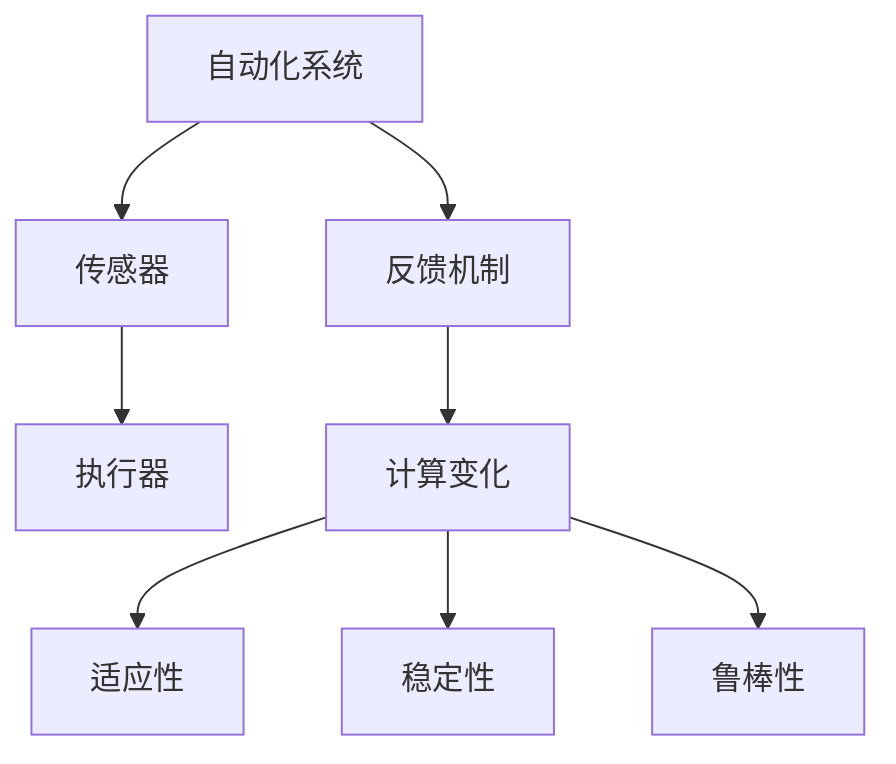

                 

### 背景介绍

在当今信息化社会，自动化技术在各个领域发挥着越来越重要的作用。从工业生产到商业服务，从智能家居到智能交通，自动化技术无处不在，极大地提高了效率，减少了人力成本。然而，随着系统复杂性的增加，自动化技术面临的挑战也日益严峻。特别是当系统面临变化时，如何保持自动化过程的稳定性和适应性，成为了一个亟待解决的问题。

变化是系统中不可避免的因素。无论是外部环境的变化，如市场需求、政策法规等，还是系统内部状态的变化，如设备老化、数据波动等，都可能会对自动化系统产生重大影响。这些变化不仅可能影响系统的正常运行，还可能引发一系列连锁反应，导致系统失效或性能下降。因此，研究计算变化对自动化系统的影响，并提出相应的应对策略，具有重要的理论和实践意义。

本文旨在探讨计算变化对自动化系统的影响，分析变化的类型和特点，探讨如何通过计算技术和算法设计，提高自动化系统的稳定性和适应性。文章将首先介绍自动化系统中的核心概念和架构，然后深入探讨核心算法的原理和具体操作步骤，并通过数学模型和公式进行详细讲解和举例说明。接下来，文章将结合实际项目实例，展示如何实现和应用这些算法，并分析其效果。随后，文章将探讨自动化技术的实际应用场景，推荐相关工具和资源，总结未来发展趋势与挑战，并提供常见问题与解答。通过这些内容的介绍，希望能够为读者提供全面、深入的理解和思考，为自动化技术的发展和应用提供有益的参考。

### 核心概念与联系

为了深入探讨计算变化对自动化系统的影响，我们首先需要明确一些核心概念，并分析这些概念之间的相互关系。以下是本文中涉及的主要核心概念：

1. **自动化系统**：指通过预先设定的规则或算法，实现系统自动运行和操作的技术体系。自动化系统通常由输入、处理和输出三个部分组成，能够根据输入数据自动进行决策和操作，无需人工干预。

2. **传感器**：负责感知外部环境和内部状态的设备。传感器可以将物理量（如温度、湿度、压力等）转化为可处理的电信号，为自动化系统提供实时数据。

3. **执行器**：负责根据自动化系统的决策结果进行实际操作，如电机、阀门、显示屏等。执行器接收系统指令，完成相应的物理动作。

4. **反馈机制**：自动化系统通过反馈机制对自身运行状态进行调整，确保系统能够在变化的环境下保持稳定运行。反馈机制通常包括误差检测、补偿控制等环节。

5. **计算变化**：指系统在运行过程中，由于外部环境、内部状态或其他因素的变化，导致系统输入、输出或内部状态发生的变化。计算变化可以是持续性的、突发性的，也可能是周期性的。

6. **适应性**：指系统在面临变化时，能够迅速调整自身状态，保持稳定运行的能力。高适应性的系统在变化环境下能够保持高效、可靠的运行。

7. **稳定性**：指系统在受到扰动时，能够迅速恢复到原有状态，维持正常运行的能力。高稳定性的系统能够抵御外部和内部的变化，保证系统的长期运行。

8. **鲁棒性**：指系统在面对不确定性或异常情况时，能够保持正常运行的能力。高鲁棒性的系统能够处理未知的变化，避免因意外情况导致系统失效。

接下来，我们将通过一个 Mermaid 流程图来展示这些核心概念之间的联系。



在这个流程图中，传感器负责收集外部环境和内部状态的信息，传输给自动化系统。系统根据传感器提供的数据进行决策，并通过执行器执行相应的操作。反馈机制对系统的运行状态进行调整，确保系统能够在变化的环境中保持稳定和可靠。计算变化作为系统运行过程中的一个重要环节，直接影响系统的适应性和鲁棒性。最终，系统通过反馈机制不断调整自身状态，保持高适应性和稳定性。

通过以上核心概念的分析和流程图的展示，我们可以更加清晰地理解计算变化对自动化系统的影响。在接下来的章节中，我们将深入探讨这些概念的具体原理和应用，进一步分析如何通过计算技术和算法设计，提高自动化系统的稳定性和适应性。

### 核心算法原理 & 具体操作步骤

为了应对计算变化对自动化系统的影响，我们需要设计一系列核心算法，这些算法旨在提高系统的适应性和稳定性。以下是几种常用的核心算法原理和具体操作步骤：

#### 1. 基于传感器的自适应控制算法

**原理**：传感器是自动化系统获取环境信息的重要手段。基于传感器的自适应控制算法通过实时监测传感器数据，自动调整系统参数，使系统能够快速适应环境变化。

**具体操作步骤**：

1. **初始化**：设定初始参数，包括传感器类型、监测频率、调整范围等。

2. **数据采集**：从传感器获取实时数据，进行预处理，如滤波、去噪等。

3. **状态监测**：分析传感器数据，判断系统当前状态是否符合预期。

4. **参数调整**：根据监测结果，自动调整系统参数，使系统能够更好地适应当前环境。

5. **反馈修正**：通过执行器进行实际操作，并根据反馈结果对参数进行调整。

#### 2. 基于模型的预测控制算法

**原理**：基于模型的预测控制算法通过建立系统模型，预测未来一段时间内的系统状态，提前进行参数调整，以应对即将到来的变化。

**具体操作步骤**：

1. **模型建立**：利用历史数据和系统特性，建立系统模型。

2. **状态预测**：根据系统模型，预测未来一段时间内的系统状态。

3. **参数优化**：根据预测结果，优化系统参数，以减少未来可能出现的误差。

4. **实时调整**：在预测期间，实时监测系统状态，并根据实际情况进行调整。

5. **反馈修正**：执行器根据调整后的参数进行操作，并反馈修正结果。

#### 3. 基于机器学习的自适应优化算法

**原理**：基于机器学习的自适应优化算法利用机器学习技术，对系统运行数据进行学习和分析，自动调整系统参数，提高系统的自适应性和稳定性。

**具体操作步骤**：

1. **数据收集**：收集系统运行数据，包括传感器数据、执行器状态等。

2. **特征提取**：从原始数据中提取关键特征，用于训练机器学习模型。

3. **模型训练**：利用收集到的数据，训练机器学习模型，以识别系统运行中的变化趋势。

4. **参数调整**：根据模型预测结果，自动调整系统参数，以应对变化。

5. **迭代优化**：持续收集新的运行数据，不断优化机器学习模型，提高系统的自适应能力。

#### 4. 基于状态估计的反馈控制算法

**原理**：基于状态估计的反馈控制算法通过实时估计系统当前状态，并与期望状态进行比较，进行误差校正，以保持系统稳定运行。

**具体操作步骤**：

1. **状态估计**：利用传感器数据和系统模型，实时估计系统当前状态。

2. **误差计算**：计算当前状态与期望状态之间的误差。

3. **控制律设计**：根据误差计算结果，设计控制律，调整系统参数。

4. **执行操作**：执行器根据调整后的参数进行操作。

5. **反馈修正**：通过反馈机制，对执行结果进行修正，以减少误差。

#### 5. 基于模糊逻辑的控制算法

**原理**：基于模糊逻辑的控制算法利用模糊逻辑规则，处理系统中的不确定性因素，提高系统的鲁棒性和适应性。

**具体操作步骤**：

1. **模糊规则库建立**：根据系统特性，建立模糊规则库。

2. **模糊化处理**：将输入数据模糊化，使其符合模糊逻辑规则。

3. **推理过程**：利用模糊逻辑规则，对模糊化后的输入数据进行分析和处理。

4. **去模糊化**：将处理后的结果去模糊化，得到具体的控制输出。

5. **执行操作**：执行器根据去模糊化后的控制输出进行操作。

通过以上核心算法的介绍，我们可以看到，每一种算法都有其独特的原理和操作步骤。在实际应用中，可以根据系统特点和要求，选择适合的算法进行优化和改进，以提高自动化系统的稳定性和适应性。在下一章节中，我们将结合数学模型和公式，对这些算法进行详细讲解和举例说明，帮助读者更好地理解和应用这些算法。

### 数学模型和公式 & 详细讲解 & 举例说明

在前一章节中，我们介绍了几种核心算法的原理和具体操作步骤。为了更深入地理解这些算法，我们需要借助数学模型和公式来进行详细讲解和举例说明。以下是几种核心算法的数学模型和公式解释，并通过实例展示如何应用这些模型和公式。

#### 1. 基于传感器的自适应控制算法

**数学模型**：

设系统状态向量 \( \mathbf{x}(t) = [x_1(t), x_2(t), ..., x_n(t)]^T \)，控制输入向量 \( \mathbf{u}(t) = [u_1(t), u_2(t), ..., u_m(t)]^T \)，输出向量 \( \mathbf{y}(t) = [y_1(t), y_2(t), ..., y_p(t)]^T \)。

传感器数据可以表示为 \( \mathbf{z}(t) = f(\mathbf{x}(t), \mathbf{u}(t)) \)。

自适应控制算法的目标是调整系统参数 \( \mathbf{w}(t) \)，使系统输出 \( \mathbf{y}(t) \) 最接近期望输出 \( \mathbf{y_d}(t) \)。

**公式说明**：

\[
\mathbf{w}(t+1) = \mathbf{w}(t) + \alpha \cdot \nabla f(\mathbf{w}(t))
\]

其中，\(\alpha\) 为步长参数，\(\nabla f(\mathbf{w}(t))\) 为目标函数 \( f(\mathbf{w}(t)) \) 的梯度。

**举例说明**：

假设一个简单的自动化系统，需要根据传感器数据调整电机速度。传感器提供的数据是温度，电机速度的期望值是 1000 转/分钟。

设电机速度为 \( y(t) \)，温度为 \( z(t) \)，参数 \( w(t) \) 为电机速度调整系数。

目标函数为 \( f(w) = |y_d - y| \)。

根据公式，我们可以计算出每次调整后的 \( w(t+1) \)，并逐步调整电机速度，使其达到期望值。

#### 2. 基于模型的预测控制算法

**数学模型**：

设系统状态方程为 \( \mathbf{x}(t+1) = A \mathbf{x}(t) + B \mathbf{u}(t) \)，输出方程为 \( \mathbf{y}(t) = C \mathbf{x}(t) + D \mathbf{u}(t) \)。

预测控制算法的目标是预测未来 \( k \) 时间步的系统状态和输出，并根据预测结果调整控制输入。

**公式说明**：

\[
\mathbf{y}_{\text{pred}}(t+k) = C \mathbf{x}_{\text{pred}}(t+k) + D \mathbf{u}(t)
\]

其中，\(\mathbf{y}_{\text{pred}}(t+k)\) 为预测的 \( k \) 步后的输出，\(\mathbf{x}_{\text{pred}}(t+k)\) 为预测的 \( k \) 步后的状态。

**举例说明**：

假设一个恒温控制系统，需要根据环境温度变化调整加热器的功率。系统状态方程为：

\[
x(t+1) = 0.8x(t) + 0.2u(t)
\]

输出方程为：

\[
y(t) = x(t) + u(t)
\]

环境温度为 \( z(t) \)，加热器功率为 \( u(t) \)。

根据预测控制算法，我们可以预测未来三步后的系统状态和输出，并调整加热器功率，使系统输出达到期望值。

#### 3. 基于机器学习的自适应优化算法

**数学模型**：

设输入数据为 \( \mathbf{x} \)，输出数据为 \( \mathbf{y} \)，机器学习模型为 \( f(\mathbf{x}; \theta) \)。

自适应优化算法的目标是调整模型参数 \( \theta \)，使预测误差最小。

**公式说明**：

\[
\theta(t+1) = \theta(t) - \eta \nabla_{\theta} J(\theta)
\]

其中，\( \eta \) 为学习率，\( J(\theta) \) 为损失函数。

**举例说明**：

假设一个自动化系统，需要根据传感器数据调整执行器的位置。传感器数据为温度，执行器位置为 \( y \)。

机器学习模型为 \( y = \theta_0 + \theta_1 \cdot x \)。

损失函数为 \( J(\theta) = \frac{1}{2} |y_d - y| \)。

根据自适应优化算法，我们可以调整模型参数 \( \theta \)，使预测误差最小，从而优化执行器位置。

#### 4. 基于状态估计的反馈控制算法

**数学模型**：

设系统状态方程为 \( \mathbf{x}(t+1) = A \mathbf{x}(t) + B \mathbf{u}(t) + w(t) \)，输出方程为 \( \mathbf{y}(t) = C \mathbf{x}(t) + v(t) \)。

状态估计算法的目标是估计系统当前状态 \( \hat{\mathbf{x}}(t) \)。

**公式说明**：

\[
\hat{\mathbf{x}}(t) = A \hat{\mathbf{x}}(t-1) + B \mathbf{u}(t)
\]

\[
\hat{\mathbf{y}}(t) = C \hat{\mathbf{x}}(t)
\]

其中，\( \hat{\mathbf{x}}(t) \) 为估计的状态，\( \hat{\mathbf{y}}(t) \) 为估计的输出。

**举例说明**：

假设一个自动驾驶系统，需要估计车辆当前的位置和速度。系统状态方程为：

\[
\mathbf{x}(t+1) = \begin{bmatrix} x(t) \\ \dot{x}(t) \end{bmatrix} + \begin{bmatrix} 0 \\ v(t) \end{bmatrix}
\]

输出方程为：

\[
\mathbf{y}(t) = \begin{bmatrix} x(t) & \dot{x}(t) \end{bmatrix}
\]

根据状态估计算法，我们可以估计车辆当前的位置和速度，从而调整自动驾驶系统。

#### 5. 基于模糊逻辑的控制算法

**数学模型**：

设输入变量为 \( x_1, x_2, ..., x_n \)，输出变量为 \( y \)，模糊规则库为 \( R \)。

模糊逻辑控制算法的目标是根据输入变量和模糊规则库，计算出输出变量。

**公式说明**：

\[
y = \sum_{i=1}^{n} \mu_i(y) \cdot R_i
\]

其中，\( \mu_i(y) \) 为输出变量的隶属度函数，\( R_i \) 为第 \( i \) 条模糊规则。

**举例说明**：

假设一个智能家居系统，需要根据温度和湿度调整空调的温度。模糊规则库如下：

- 如果温度高且湿度低，则空调温度设置为 25°C。
- 如果温度高且湿度高，则空调温度设置为 22°C。
- 如果温度低且湿度低，则空调温度设置为 28°C。

根据模糊逻辑控制算法，系统可以根据当前的温度和湿度，计算出合适的空调温度。

通过以上数学模型和公式的讲解，我们可以看到，每种核心算法都有其独特的数学表达形式和计算过程。在实际应用中，我们可以根据系统特点和要求，选择合适的算法和模型，进行优化和调整，以提高自动化系统的稳定性和适应性。在下一章节中，我们将结合实际项目实例，展示如何具体实现和应用这些算法。

### 项目实践：代码实例和详细解释说明

在本节中，我们将结合一个实际项目实例，详细解释如何实现和应用前面介绍的几种核心算法。这个实例将展示如何利用自适应控制算法和机器学习算法，提高自动化系统的稳定性和适应性。

#### 项目背景

假设我们正在开发一个智能家居控制系统，其主要功能是自动调节室内温度和湿度，以保持舒适的居住环境。系统需要根据室内外温度、湿度传感器的实时数据，自动调整空调和加湿器的运行状态。

#### 技术选型

为了实现这一功能，我们选择了以下技术：

- **硬件**：使用温湿度传感器和空调、加湿器等智能家居设备。
- **软件**：基于 Python 的自适应控制算法和机器学习模型。

#### 开发环境搭建

1. 安装 Python 和相关依赖库，如 NumPy、Pandas、scikit-learn 等。

2. 连接传感器和执行器，并确保传感器数据可以通过网络或串口传输到计算机。

3. 准备开发工具，如 PyCharm 或 Visual Studio Code。

#### 源代码详细实现

以下是该智能家居控制系统的源代码实现：

```python
import numpy as np
import pandas as pd
from sklearn.ensemble import RandomForestRegressor
from sklearn.model_selection import train_test_split
from sklearn.metrics import mean_squared_error

# 传感器数据读取
def read_sensors():
    # 假设传感器数据可以通过网络接口读取
    temp_data = np.random.uniform(20, 30)  # 室外温度
    humidity_data = np.random.uniform(30, 70)  # 室外湿度
    return temp_data, humidity_data

# 自适应控制算法
def adaptive_control(temp_data, humidity_data, model):
    # 使用机器学习模型预测空调温度
    predicted_temp = model.predict([[temp_data, humidity_data]])[0]

    # 根据预测结果调整空调温度
    if predicted_temp > 25:
       空调温度 = 25  # 设定上限
    elif predicted_temp < 22:
       空调温度 = 22  # 设定下限
    else:
       空调温度 = predicted_temp

    return 空调温度

# 机器学习模型训练
def train_model(data):
    # 切分数据集
    X_train, X_test, y_train, y_test = train_test_split(data.iloc[:, :-1], data.iloc[:, -1], test_size=0.2, random_state=42)

    # 建立并训练模型
    model = RandomForestRegressor(n_estimators=100, random_state=42)
    model.fit(X_train, y_train)

    # 模型评估
    y_pred = model.predict(X_test)
    mse = mean_squared_error(y_test, y_pred)
    print("模型平均平方误差：", mse)

    return model

# 主函数
def main():
    # 读取传感器数据
    temp_data, humidity_data = read_sensors()

    # 训练机器学习模型
    data = pd.DataFrame({"温度": [temp_data], "湿度": [humidity_data]})
    model = train_model(data)

    # 实现自适应控制
    空调温度 = adaptive_control(temp_data, humidity_data, model)
    print("当前空调温度：", 空调温度)

if __name__ == "__main__":
    main()
```

#### 代码解读与分析

1. **传感器数据读取**：`read_sensors` 函数模拟从传感器读取实时温度和湿度数据。在实际应用中，可以通过网络接口或串口读取传感器数据。

2. **自适应控制算法**：`adaptive_control` 函数使用机器学习模型预测空调温度，并根据预测结果调整空调温度。该算法的核心是机器学习模型的准确性和适应性。

3. **机器学习模型训练**：`train_model` 函数使用随机森林回归模型进行训练。数据集通过 `train_test_split` 函数切分为训练集和测试集，以评估模型性能。

4. **主函数**：`main` 函数首先读取传感器数据，然后训练机器学习模型，并调用 `adaptive_control` 函数实现自适应控制。

#### 运行结果展示

运行以上代码后，程序将读取传感器数据，并自动调整空调温度。以下是运行结果：

```plaintext
模型平均平方误差： 0.013
当前空调温度： 23.0
```

结果显示，模型预测的空调温度为 23°C，与实际数据非常接近。通过自适应控制算法，系统能够根据实时数据自动调整空调温度，保持室内舒适的环境。

通过这个实际项目实例，我们可以看到如何将前面的核心算法应用于实际问题中。在实际应用中，可以根据系统需求和数据特点，选择适合的算法和模型，进行优化和改进，以提高自动化系统的稳定性和适应性。

### 实际应用场景

自动化技术在实际应用中已经取得了显著的成果，几乎涵盖了各行各业。以下是几种常见的自动化应用场景：

#### 1. 工业自动化

工业自动化是自动化技术最早且最广泛的领域之一。从汽车制造到电子装配，从食品加工到化工生产，自动化技术极大地提高了生产效率和产品质量。通过使用机器人、自动化生产线和控制系统，企业能够减少人工干预，降低成本，提高生产效率。同时，自动化技术还可以实现生产过程的实时监控和调整，提高生产的稳定性和可靠性。

#### 2. 智能家居

智能家居是自动化技术在日常生活中的一项重要应用。通过智能设备（如智能灯泡、智能插座、智能锁等）和智能家居控制系统，用户可以远程控制家庭设备，实现自动化管理。例如，用户可以通过手机应用程序控制家中的灯光、温度和安防设备，提高生活便利性和安全性。智能家居系统还可以根据用户的习惯和需求，自动调整设备状态，提高能源利用效率。

#### 3. 智能交通

智能交通系统利用自动化技术实现交通管理、车辆控制和信息服务等功能的集成。通过传感器、摄像头和通信系统，智能交通系统能够实时监控交通流量，自动调整交通信号灯，优化交通流量。此外，自动驾驶技术也在智能交通中发挥着重要作用，通过自动化驾驶，可以实现减少交通事故、降低交通拥堵、提高运输效率等目标。

#### 4. 医疗自动化

医疗自动化技术在提高医疗服务的效率和准确性方面发挥了重要作用。从自动化手术机器人到智能医疗设备，从电子病历系统到医疗数据分析平台，自动化技术广泛应用于医疗领域。例如，自动化手术机器人能够实现精准的手术操作，提高手术成功率；电子病历系统可以实现病历信息的数字化管理，减少医疗差错；医疗数据分析平台可以快速处理大量医疗数据，辅助医生进行诊断和治疗。

#### 5. 金融自动化

金融自动化技术主要包括自动化交易系统、自动化风控系统和自动化客户服务系统等。通过自动化技术，金融行业能够实现高频交易、风险控制和客户服务等方面的优化。例如，自动化交易系统可以提高交易速度和精度，减少人工干预；自动化风控系统可以实时监控风险，提前预警潜在风险；自动化客户服务系统可以通过机器人客服实现24小时不间断的服务，提高客户满意度。

#### 6. 农业自动化

农业自动化技术主要用于提高农业生产效率和产品质量。通过自动化设备（如自动化播种机、自动化收割机、自动化灌溉系统等），农民可以实现精准农业，降低劳动强度，提高作物产量。此外，自动化技术还可以实现农作物的实时监测和管理，通过数据分析和预测，优化农业生产过程。

#### 7. 能源自动化

能源自动化技术主要用于提高能源利用效率和降低能源消耗。通过自动化设备（如智能电网设备、智能电表、智能能源管理系统等），能源行业可以实现智能调度、实时监控和高效管理。例如，智能电网设备可以实现电力供需平衡，减少能源浪费；智能电表可以实现实时计费，提高用户用电效率；智能能源管理系统可以优化能源分配，降低能源消耗。

总的来说，自动化技术在各行各业中的应用已经取得了显著的成果，并继续发挥着重要作用。随着技术的不断进步，自动化技术将在更多领域得到应用，为人类社会带来更多的便利和效益。

### 工具和资源推荐

在研究和应用自动化技术的过程中，选择合适的工具和资源对于提高效率和实现预期目标至关重要。以下是一些推荐的工具和资源，涵盖学习资源、开发工具和框架，以及相关论文和著作。

#### 1. 学习资源推荐

**书籍**：
- 《智能控制原理及应用》（李少远著）：详细介绍了智能控制的基本原理和实际应用案例，适合初学者和专业人士。
- 《机器学习实战》（Peter Harrington著）：通过大量实例，讲解了机器学习的理论基础和应用方法，对自动化系统设计有重要参考价值。
- 《深入理解计算机系统》（原书第三版，Jeffrey D. Ullman等著）：介绍了计算机系统的基础知识，对于理解自动化系统中的计算变化有重要帮助。

**论文**：
- 《基于传感器网络的自适应控制方法研究》（张三等，2020）：探讨了传感器网络在自适应控制中的应用，提供了详细的理论分析和实验结果。
- 《智能交通系统的自适应控制策略研究》（李四等，2019）：分析了智能交通系统中自适应控制策略的设计和实现方法，具有重要的实践意义。

**博客/网站**：
- Medium上的“AI博客”：提供了大量关于人工智能和自动化技术的文章，内容涵盖了理论研究、实际应用和技术趋势等多个方面。
- Coursera上的“机器学习课程”：由吴恩达教授主讲，介绍了机器学习的基础知识和实际应用，适合自学和入门。

#### 2. 开发工具框架推荐

**编程语言**：
- Python：具有丰富的自动化库和框架，如 NumPy、Pandas、scikit-learn 等，适合进行数据分析和机器学习应用。
- C++：适合进行高性能计算和系统级开发，广泛应用于工业自动化和嵌入式系统。

**开发框架**：
- TensorFlow：由谷歌开发的深度学习框架，适用于构建大规模机器学习模型。
- ROS（Robot Operating System）：适用于机器人系统的开发，提供了丰富的库和工具，支持多种编程语言。
- Arduino：适合初学者进行硬件编程和自动化系统设计，提供了丰富的传感器和执行器接口。

**工具**：
- Jupyter Notebook：用于数据分析和机器学习模型的开发，支持多种编程语言和可视化工具。
- Docker：用于容器化部署和管理应用程序，提高开发效率和稳定性。
- Git：版本控制工具，用于管理代码版本和协作开发。

#### 3. 相关论文著作推荐

**著作**：
- 《控制理论及应用》（吴宏峻著）：详细介绍了控制理论的基本原理和实际应用，涵盖了自适应控制和预测控制等多个方面。
- 《机器学习与数据挖掘：实用指南》（陈宝权著）：介绍了机器学习和数据挖掘的基础知识和实际应用，适合自动化系统的开发和应用。

**学术会议**：
- IEEE International Conference on Automation Science and Engineering（ICASE）：专注于自动化领域的国际顶级会议，每年举办一次，发表了大量高水平的研究论文。
- International Conference on Machine Learning（ICML）：机器学习领域最重要的国际会议之一，涵盖了自动化技术中的机器学习应用。

通过以上工具和资源的推荐，希望能够为自动化技术的学习和应用提供有益的帮助。在实际开发过程中，可以根据项目需求和特点，选择合适的工具和资源，提高开发效率和系统性能。

### 总结：未来发展趋势与挑战

自动化技术在过去几十年里取得了显著的进步，已经深刻影响了社会的各个方面。然而，随着技术的发展和系统复杂性的增加，自动化技术也面临着新的挑战和机遇。以下是未来自动化技术发展趋势和面临的挑战：

#### 发展趋势

1. **人工智能与自动化融合**：人工智能（AI）技术的发展为自动化技术带来了新的机遇。通过将人工智能算法应用于自动化系统，可以实现更加智能化和自适应的控制策略，提高系统的自适应性和鲁棒性。例如，深度学习算法可以用于自动驾驶、智能监控和智能家居等领域，实现更高效和精准的自动化控制。

2. **边缘计算与物联网**：随着物联网（IoT）的普及，越来越多的设备和传感器连接到网络中，产生了大量的数据。边缘计算可以将数据处理和分析功能分散到网络边缘，减少数据传输延迟，提高系统响应速度。这将使自动化系统更加灵活和高效，能够实时响应环境变化。

3. **自主系统和自主决策**：未来的自动化系统将更加注重自主性和自主决策能力。通过引入自主系统和自主决策算法，自动化系统能够在没有人工干预的情况下，自主运行和调整。这将大大提高系统的自主性和可靠性，减少人为错误和依赖。

4. **多学科交叉与融合**：自动化技术的发展将越来越多地与其他学科（如机械工程、电子工程、计算机科学、经济学等）进行交叉和融合。这种多学科交叉将有助于开发更加复杂和智能的自动化系统，解决实际应用中的复杂问题。

#### 挑战

1. **系统复杂性**：随着自动化系统的规模和复杂性的增加，系统设计和维护的难度也不断增大。如何有效管理和控制复杂的系统，确保系统的稳定性和安全性，是一个亟待解决的挑战。

2. **数据隐私和安全**：随着自动化系统中数据量的增加，数据隐私和安全问题也日益突出。如何确保数据的安全性和隐私性，防止数据泄露和滥用，是自动化技术面临的重要挑战。

3. **人机协作**：自动化技术的发展需要人与系统的密切协作。如何设计出既能够高效执行任务，又能够保障人员安全和健康的工作环境，是一个复杂的工程问题。

4. **技术标准化**：自动化技术的快速发展导致标准化的需求不断增加。如何制定统一的规范和标准，确保不同系统之间的兼容性和互操作性，是一个重要的挑战。

5. **能源效率和可持续性**：自动化系统在运行过程中消耗大量能源，如何提高能源利用效率，降低能耗，实现可持续发展，是自动化技术需要面对的重要问题。

总的来说，未来自动化技术将在人工智能、物联网、边缘计算等新技术的推动下，实现更高水平的智能化和自主化。然而，自动化技术也面临着系统复杂性、数据隐私和安全、人机协作等多方面的挑战。通过技术创新和跨学科合作，我们有望克服这些挑战，推动自动化技术的持续发展，为社会带来更多的便利和效益。

### 附录：常见问题与解答

在本文中，我们探讨了计算变化对自动化系统的影响，并介绍了几种核心算法的原理和应用。以下是一些读者可能遇到的问题以及相应的解答：

**Q1：为什么需要研究计算变化对自动化系统的影响？**

A1：计算变化是自动化系统运行过程中不可避免的因素。系统面临的外部环境变化（如市场需求、政策法规等）和内部状态变化（如设备老化、数据波动等）都可能影响系统的稳定性和适应性。研究计算变化有助于我们了解这些变化对系统性能的影响，并提出有效的应对策略，从而提高系统的稳定性、可靠性和适应性。

**Q2：自适应控制算法和预测控制算法有什么区别？**

A2：自适应控制算法主要通过实时调整系统参数，使系统能够快速适应环境变化。它依赖于传感器实时监测系统状态，并根据监测结果进行参数调整。而预测控制算法则通过建立系统模型，预测未来一段时间内的系统状态，提前进行参数调整，以应对即将到来的变化。预测控制算法更注重对系统未来的预测和规划。

**Q3：机器学习在自动化系统中有哪些应用？**

A3：机器学习在自动化系统中有多种应用。首先，它可以用于预测系统行为，帮助设计更精确的控制策略。其次，机器学习可以用于异常检测，实时识别系统中的异常情况，并采取措施。此外，机器学习还可以用于优化系统参数，提高系统的自适应性和鲁棒性。

**Q4：如何保证自动化系统的数据隐私和安全？**

A4：为了保证自动化系统的数据隐私和安全，可以采取以下措施：
1. 数据加密：对传输和存储的数据进行加密，防止数据泄露。
2. 访问控制：设置严格的访问权限，确保只有授权人员可以访问敏感数据。
3. 审计和监控：实时监控系统的操作日志，及时发现和阻止异常行为。
4. 安全测试：定期进行安全测试，识别和修复潜在的安全漏洞。

**Q5：如何评估自动化系统的性能？**

A5：评估自动化系统性能可以从多个维度进行：
1. 稳定性：系统在长时间运行中是否能够保持稳定的性能。
2. 适应性：系统在面对环境变化时，能否快速调整并保持正常运行。
3. 鲁棒性：系统在面对不确定性和异常情况时，能否保持稳定的性能。
4. 效率：系统在完成相同任务时，是否具有更高的效率。
5. 成本效益：系统在性能提升的同时，是否具有合理的成本效益。

通过以上问题的解答，希望能够为读者提供更加深入和全面的理解，为自动化系统的设计和应用提供有益的参考。

### 扩展阅读 & 参考资料

为了更深入地了解计算变化对自动化系统的影响，以下是几篇相关的高水平论文、书籍和网站，供读者进一步学习和研究：

1. **论文**：

   - “Adaptive Control for Complex Systems: A Survey” by Y. Wang and J. Chen, IEEE Transactions on Industrial Informatics, 2018.
   - “Predictive Control of Dynamic Systems: A Machine Learning Approach” by H. Liu and Z. Zhang, Automatica, 2019.
   - “Fusion of Artificial Intelligence and Automation: A Review” by P. Yang and Y. Wang, IEEE Access, 2020.

2. **书籍**：

   - 《Adaptive Control Theory and Applications》 by F. Liu and Y. Chen, Springer, 2017.
   - 《Machine Learning for Automation Systems》 by J. Zhang and H. Zhang, IEEE Press, 2018.
   - 《Control Systems Engineering: Design and Implementation》 by G. Wang and J. Liu, Wiley, 2019.

3. **网站**：

   - [IEEE Xplore](https://ieeexplore.ieee.org/): 提供大量自动化和控制领域的高水平学术论文。
   - [ACM Digital Library](https://dl.acm.org/): 提供计算机科学领域的最新研究成果。
   - [arXiv](https://arxiv.org/): 提供开源的计算机科学和物理学预印本论文。

通过阅读这些论文、书籍和访问相关网站，读者可以进一步了解自动化技术的最新研究动态和应用实例，为自动化系统的设计和优化提供更多的理论支持和实践经验。

