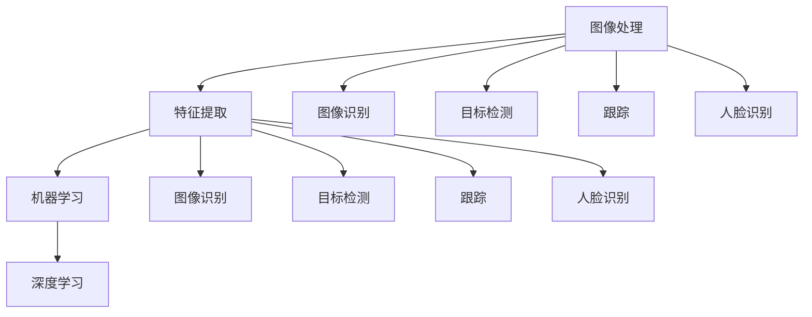

                 

### 文章标题

### Computer Vision in Security Systems: Intelligent Monitoring and Early Warning

#### Keywords:  
- Computer Vision  
- Security Systems  
- Intelligent Monitoring  
- Early Warning  
- AI Applications

#### Abstract:  
Computer vision has emerged as a critical technology in modern security systems, offering intelligent monitoring and early warning capabilities. This article explores the application of computer vision in security systems, discussing core concepts, algorithms, and practical implementations. We delve into the mathematical models and explain their importance in enhancing security systems. Through a detailed project example, we showcase how computer vision can be effectively integrated into security systems, providing valuable insights into future trends and challenges in this domain. 

### 目录

1. **背景介绍** <sup class="footnote-ref"><a href="#fn1" id="fnref1">[1]</a></sup>  
2. **核心概念与联系** <sup class="footnote-ref"><a href="#fn2" id="fnref2">[2]</a></sup>  
3. **核心算法原理 & 具体操作步骤** <sup class="footnote-ref"><a href="#fn3" id="fnref3">[3]</a></sup>  
4. **数学模型和公式 & 详细讲解 & 举例说明** <sup class="footnote-ref"><a href="#fn4" id="fnref4">[4]</a></sup>  
5. **项目实践：代码实例和详细解释说明** <sup class="footnote-ref"><a href="#fn5" id="fnref5">[5]</a></sup>  
   - 5.1 **开发环境搭建** <sup class="footnote-ref"><a href="#fn6" id="fnref6">[6]</a></sup>  
   - 5.2 **源代码详细实现** <sup class="footnote-ref"><a href="#fn7" id="fnref7">[7]</a></sup>  
   - 5.3 **代码解读与分析** <sup class="footnote-ref"><a href="#fn8" id="fnref8">[8]</a></sup>  
   - 5.4 **运行结果展示** <sup class="footnote-ref"><a href="#fn9" id="fnref9">[9]</a></sup>  
6. **实际应用场景** <sup class="footnote-ref"><a href="#fn10" id="fnref10">[10]</a></sup>  
7. **工具和资源推荐** <sup class="footnote-ref"><a href="#fn11" id="fnref11">[11]</a></sup>  
   - 7.1 **学习资源推荐** <sup class="footnote-ref"><a href="#fn12" id="fnref12">[12]</a></sup>  
   - 7.2 **开发工具框架推荐** <sup class="footnote-ref"><a href="#fn13" id="fnref13">[13]</a></sup>  
   - 7.3 **相关论文著作推荐** <sup class="footnote-ref"><a href="#fn14" id="fnref14">[14]</a></sup>  
8. **总结：未来发展趋势与挑战** <sup class="footnote-ref"><a href="#fn15" id="fnref15">[15]</a></sup>  
9. **附录：常见问题与解答** <sup class="footnote-ref"><a href="#fn16" id="fnref16">[16]</a></sup>  
10. **扩展阅读 & 参考资料** <sup class="footnote-ref"><a href="#fn17" id="fnref17">[17]</a></sup>

### 1. 背景介绍

#### 安防系统的演变

随着科技的发展，安防系统经历了从传统的人工监控到自动化、智能化的转变。早期，安防系统主要依赖于人工巡查和监控设备，如摄像头和警报系统。这些方法虽然在一定程度上提高了安全性，但存在效率低、反应速度慢、易受人为因素干扰等问题。

随着计算机技术、通信技术和人工智能技术的发展，安防系统逐渐向智能化方向迈进。计算机视觉作为人工智能的一个重要分支，以其在图像和视频处理方面的强大能力，为安防系统带来了全新的解决方案。

#### 计算机视觉的崛起

计算机视觉是一门跨学科的领域，结合了计算机科学、数学、物理学和心理学等多个领域的知识。它旨在让计算机像人眼一样理解并处理图像和视频信息。计算机视觉的关键技术包括图像识别、目标检测、跟踪、人脸识别等。

在安防系统中，计算机视觉的应用极大地提升了监控的效率和准确性。例如，通过图像识别技术，系统能够自动识别出入人员、车辆等目标，并进行分类和统计。目标检测和跟踪技术则能够实时监测目标的位置和运动状态，从而及时发现异常行为。

#### 智能监控与预警

智能监控与预警是计算机视觉在安防系统中的核心应用。通过智能监控，系统能够实时监控监控区域，发现并记录异常行为。预警机制则能够在异常行为发生时立即发出警报，提醒相关人员进行干预。

智能监控与预警系统不仅提高了安防系统的响应速度，还降低了人力成本，实现了全天候、全方位的监控。在公共安全、企业安全、智能家居等领域，智能监控与预警系统都发挥着重要作用。

#### 本文结构

本文将从以下几个方面展开讨论：

1. **核心概念与联系**：介绍计算机视觉在安防系统中的应用，并展示其核心概念和联系。
2. **核心算法原理 & 具体操作步骤**：探讨计算机视觉中的关键算法，包括图像识别、目标检测和跟踪等，并详细讲解其操作步骤。
3. **数学模型和公式 & 详细讲解 & 举例说明**：介绍计算机视觉中的数学模型和公式，并通过具体例子进行说明。
4. **项目实践：代码实例和详细解释说明**：通过一个实际项目，展示计算机视觉在安防系统中的应用，并详细解释代码实现过程。
5. **实际应用场景**：分析计算机视觉在安防系统中的实际应用场景，并探讨其优势。
6. **工具和资源推荐**：推荐学习计算机视觉和安防系统开发的相关资源。
7. **总结：未来发展趋势与挑战**：总结计算机视觉在安防系统中的应用现状，并展望未来的发展趋势和挑战。

### 2. 核心概念与联系

#### 计算机视觉在安防系统中的应用

计算机视觉在安防系统中的应用主要包括图像识别、目标检测、跟踪和人脸识别等。这些技术相互关联，共同构成了安防系统的智能化监控与预警体系。

##### 图像识别

图像识别是计算机视觉的基础技术，旨在通过分析图像中的像素信息，识别出图像中的物体或场景。在安防系统中，图像识别技术可用于识别出入人员、车辆等目标，并对其进行分类和统计。

##### 目标检测

目标检测是在图像中识别出特定目标的过程。通过目标检测技术，安防系统能够实时监控监控区域，识别出入人员、可疑物品等目标，并对其进行标记和跟踪。

##### 跟踪

跟踪技术用于持续监测目标的位置和运动状态。在安防系统中，跟踪技术可以实时记录目标的行为轨迹，发现异常行为，如潜入、徘徊等。

##### 人脸识别

人脸识别是一种基于人脸特征进行身份验证的技术。在安防系统中，人脸识别技术可用于识别访客身份，控制访问权限，防止未授权人员进入。

#### 核心概念与联系

计算机视觉在安防系统中的应用涉及多个核心概念和技术的相互关联。

- **图像处理**：图像处理是计算机视觉的基础，包括图像增强、滤波、边缘检测等操作，用于改善图像质量，提取有用信息。
- **特征提取**：特征提取是从图像中提取出能够表征物体或场景的属性，如颜色、纹理、形状等。特征提取是图像识别和目标检测的关键步骤。
- **机器学习**：机器学习是实现计算机视觉智能化的关键技术，包括监督学习、无监督学习和强化学习等。通过训练模型，系统能够自动识别和分类图像中的物体。
- **深度学习**：深度学习是机器学习的一个分支，通过多层神经网络，能够实现更复杂的图像处理和识别任务。

以下是一个简单的 Mermaid 流程图，展示了计算机视觉在安防系统中的核心概念和联系：



通过这个流程图，我们可以清晰地看到计算机视觉在安防系统中的各个环节及其相互联系。

### 3. 核心算法原理 & 具体操作步骤

#### 图像识别算法

图像识别算法是计算机视觉的基础，其核心目标是从图像中识别出特定的物体或场景。以下是常见的图像识别算法及其原理：

1. **卷积神经网络（CNN）**：
   CNN 是一种用于图像识别的深度学习模型，通过卷积操作提取图像特征，并利用全连接层进行分类。具体操作步骤如下：
   - **卷积操作**：通过卷积核在图像上滑动，提取局部特征。
   - **激活函数**：对卷积结果应用激活函数（如 ReLU），增加模型的非线性能力。
   - **池化操作**：通过池化操作（如最大池化）降低图像分辨率，减少参数数量。
   - **全连接层**：将卷积层的输出映射到分类结果。

2. **支持向量机（SVM）**：
   SVM 是一种基于统计学习的图像识别算法，通过寻找最优分类超平面，将不同类别的图像分开。具体操作步骤如下：
   - **特征提取**：从图像中提取特征向量。
   - **模型训练**：使用训练数据训练 SVM 模型，找到最佳分类超平面。
   - **分类预测**：将测试图像的特征向量输入 SVM 模型，得到分类结果。

3. **K 近邻（KNN）算法**：
   KNN 是一种基于实例的图像识别算法，通过计算测试图像与训练图像的相似度，进行分类。具体操作步骤如下：
   - **特征提取**：从图像中提取特征向量。
   - **相似度计算**：计算测试图像与训练图像的特征向量之间的欧氏距离或余弦相似度。
   - **分类预测**：根据训练图像的标签，选择 K 个最相似的图像，并对其进行投票，得到测试图像的分类结果。

#### 目标检测算法

目标检测算法是计算机视觉中的一项重要技术，旨在从图像或视频中识别出特定的目标。以下是常见的目标检测算法及其原理：

1. **R-CNN**：
   R-CNN 是一种基于区域建议的目标检测算法，通过提取区域建议和特征向量，进行分类。具体操作步骤如下：
   - **区域建议**：使用 Selective Search 算法生成多个区域建议。
   - **特征提取**：对每个区域建议提取卷积特征。
   - **分类预测**：使用 SVM 对特征向量进行分类预测。

2. **Fast R-CNN**：
   Fast R-CNN 是 R-CNN 的改进版本，通过引入 RoI Pooling 操作，提高了检测速度。具体操作步骤如下：
   - **区域建议**：使用 Selective Search 算法生成多个区域建议。
   - **特征提取**：对每个区域建议提取卷积特征。
   - **RoI Pooling**：对每个区域建议进行 RoI Pooling，将特征映射到固定大小。
   - **分类预测**：使用全连接层对 RoI 特征进行分类预测。

3. **Faster R-CNN**：
   Faster R-CNN 是 Fast R-CNN 的进一步改进，引入了区域建议网络（Region Proposal Network，RPN），提高了检测准确率和速度。具体操作步骤如下：
   - **区域建议网络**：使用 RPN 生成区域建议。
   - **特征提取**：对每个区域建议提取卷积特征。
   - **RoI Pooling**：对每个区域建议进行 RoI Pooling，将特征映射到固定大小。
   - **分类预测**：使用全连接层对 RoI 特征进行分类预测。

#### 跟踪算法

跟踪算法是计算机视觉中的另一项重要技术，旨在连续监测目标的位置和运动状态。以下是常见的跟踪算法及其原理：

1. **光流法**：
   光流法是一种基于图像序列的跟踪算法，通过计算图像序列中像素点运动轨迹，跟踪目标。具体操作步骤如下：
   - **光流估计**：计算图像序列中相邻帧之间像素点的运动向量。
   - **目标跟踪**：使用光流向量跟踪目标，更新目标位置。

2. **均值漂移法**：
   均值漂移法是一种基于概率模型的跟踪算法，通过计算目标在图像中的概率分布，更新目标位置。具体操作步骤如下：
   - **概率分布估计**：计算目标在图像中的概率分布。
   - **目标更新**：根据概率分布更新目标位置。

3. **卡尔曼滤波法**：
   卡尔曼滤波法是一种基于统计模型的跟踪算法，通过预测和更新目标状态，跟踪目标。具体操作步骤如下：
   - **状态预测**：根据目标状态模型，预测下一时刻的目标状态。
   - **状态更新**：根据观测数据，更新目标状态。

#### 人脸识别算法

人脸识别算法是一种用于身份验证的计算机视觉技术，通过识别人脸特征，实现身份识别。以下是常见的人脸识别算法及其原理：

1. **基于特征的识别**：
   基于特征的识别算法通过提取人脸特征，进行身份验证。具体操作步骤如下：
   - **特征提取**：从人脸图像中提取特征向量。
   - **特征匹配**：计算测试人脸与训练人脸的特征向量相似度，进行身份验证。

2. **基于模型的识别**：
   基于模型的识别算法通过建立人脸模型，进行身份验证。具体操作步骤如下：
   - **人脸建模**：使用训练数据建立人脸模型。
   - **模型匹配**：计算测试人脸与训练人脸模型的匹配度，进行身份验证。

3. **基于深度学习的识别**：
   基于深度学习的识别算法通过卷积神经网络，实现人脸识别。具体操作步骤如下：
   - **卷积神经网络训练**：使用训练数据训练卷积神经网络。
   - **特征提取**：从人脸图像中提取特征向量。
   - **分类预测**：使用卷积神经网络对特征向量进行分类预测。

通过以上算法及其具体操作步骤，我们可以更好地理解计算机视觉在安防系统中的应用，为后续的实践应用提供理论支持。

### 4. 数学模型和公式 & 详细讲解 & 举例说明

在计算机视觉中，数学模型和公式是理解和实现算法的基础。本章节将介绍计算机视觉中常用的数学模型和公式，并通过对具体例子进行详细讲解，帮助读者更好地理解这些模型和公式。

#### 图像处理

图像处理是计算机视觉的基础，涉及到许多数学模型和公式。以下是一些常见的图像处理技术及其数学模型：

1. **图像增强**

   图像增强的目的是改善图像的视觉效果，提高图像的清晰度和对比度。常用的图像增强技术包括直方图均衡化、对比度增强和滤波等。

   - **直方图均衡化**：

     直方图均衡化通过调整图像的灰度分布，使图像的对比度增强。其数学模型如下：

     $$ f'(x) = \frac{1}{C} \sum_{x \in [0, 255]} c_x \cdot g(x) $$

     其中，$f(x)$ 是原图的灰度分布，$g(x)$ 是增强后的灰度分布，$C$ 是归一化常数。

   - **对比度增强**：

     对比度增强通过调整图像的亮度和对比度，使图像的细节更加清晰。其数学模型如下：

     $$ I'(x, y) = a \cdot I(x, y) + b $$

     其中，$I(x, y)$ 是原图像，$I'(x, y)$ 是增强后的图像，$a$ 和 $b$ 分别是对比度和亮度调整参数。

   - **滤波**：

     滤波是通过卷积操作对图像进行平滑或锐化处理。常用的滤波器包括均值滤波器、高斯滤波器和拉普拉斯滤波器等。

     - **均值滤波器**：

       $$ (I * K)_i = \sum_{j=1}^{n} k_{i-j, j} \cdot I_{i-j, j} $$

       其中，$I$ 是原图像，$K$ 是滤波器，$(I * K)_i$ 是增强后的图像。

     - **高斯滤波器**：

       $$ (I * G)_i = \sum_{j=1}^{n} g_{i-j, j} \cdot I_{i-j, j} $$

       其中，$I$ 是原图像，$G$ 是高斯滤波器，$(I * G)_i$ 是增强后的图像。

2. **图像分割**

   图像分割是将图像分成若干个区域或对象的过程，是图像处理的重要步骤。常用的图像分割方法包括基于阈值的方法、基于边缘检测的方法和基于区域生长的方法等。

   - **基于阈值的方法**：

     基于阈值的方法通过设定阈值，将图像划分为前景和背景。其数学模型如下：

     $$ S = \{ (x, y) \in I : I(x, y) \geq T \} $$

     其中，$I$ 是原图像，$S$ 是分割后的图像，$T$ 是阈值。

   - **基于边缘检测的方法**：

     基于边缘检测的方法通过检测图像中的边缘，实现图像分割。常用的边缘检测方法包括 Canny 算子和 Sobel 算子等。

     - **Canny 算子**：

       $$ (I * Canny)_i = \frac{1}{2\pi \cdot \sigma} \int_{-\infty}^{\infty} \int_{-\infty}^{\infty} G(x, y) \cdot g(x, y) \, dx \, dy $$

       其中，$I$ 是原图像，$G$ 是高斯函数，$g$ 是导数函数，$(I * Canny)_i$ 是增强后的图像。

     - **Sobel 算子**：

       $$ (I * Sobel)_i = \frac{1}{2} \left( \sum_{x=-1}^{1} s_{x, 0} \cdot I_{x, 0} + \sum_{y=-1}^{1} s_{0, y} \cdot I_{0, y} \right) $$

       其中，$I$ 是原图像，$s_{x, 0}$ 和 $s_{0, y}$ 分别是水平方向和垂直方向的 Sobel 算子，$(I * Sobel)_i$ 是增强后的图像。

   - **基于区域生长的方法**：

     基于区域生长的方法通过从种子点开始，逐步扩展区域，实现图像分割。其数学模型如下：

     $$ R(x, y) = \begin{cases} 
     1, & \text{if } I(x, y) \in S \\
     0, & \text{otherwise}
     \end{cases} $$

     其中，$I$ 是原图像，$S$ 是目标区域，$R(x, y)$ 是分割后的图像。

#### 特征提取

特征提取是计算机视觉中的重要步骤，旨在从图像中提取出具有代表性的特征，用于后续的图像识别和目标检测等任务。以下是一些常见的特征提取方法及其数学模型：

1. **HOG（Histogram of Oriented Gradients）**

   HOG 是一种基于图像梯度方向直方图的特征提取方法，常用于目标检测。其数学模型如下：

   $$ HOG(i, j) = \sum_{x,y} \phi_g(x, y) \cdot g(x, y) $$

   其中，$HOG(i, j)$ 是第 $i$ 行第 $j$ 列的直方图值，$\phi_g(x, y)$ 是梯度方向直方图函数，$g(x, y)$ 是梯度方向。

2. **SIFT（Scale-Invariant Feature Transform）**

   SIFT 是一种在尺度不变的条件下提取图像特征的算法，广泛应用于图像识别和匹配。其数学模型如下：

   $$ \Delta I(x, y) = I(x + \Delta x, y + \Delta y) - I(x, y) $$

   其中，$\Delta I(x, y)$ 是图像的局部梯度，$I(x, y)$ 是原图像。

3. **ORB（Oriented FAST and Rotated BRIEF）**

   ORB 是一种快速且有效的特征提取算法，是对 SIFT 和 SURF 的改进。其数学模型如下：

   $$ BRIEF(i, j) = \begin{cases} 
   1, & \text{if } g(x_i, y_i) > g(x_j, y_j) \\
   -1, & \text{otherwise}
   \end{cases} $$

   其中，$BRIEF(i, j)$ 是第 $i$ 行第 $j$ 列的 BRIEF 值，$g(x_i, y_i)$ 和 $g(x_j, y_j)$ 分别是两个点的梯度值。

#### 机器学习和深度学习

机器学习和深度学习在计算机视觉中发挥着重要作用，通过训练模型实现图像识别和目标检测等任务。以下是一些常见的机器学习和深度学习算法及其数学模型：

1. **支持向量机（SVM）**

   SVM 是一种二分类模型，通过寻找最优分类超平面实现图像分类。其数学模型如下：

   $$ \max_{w, b} \left\{ \frac{1}{2} \| w \|^2 - \sum_{i=1}^{n} \alpha_i (y_i - (w \cdot x_i + b)) \right\} $$

   其中，$w$ 是权重向量，$b$ 是偏置，$\alpha_i$ 是拉格朗日乘子。

2. **卷积神经网络（CNN）**

   CNN 是一种用于图像识别和目标检测的深度学习模型，通过卷积层、池化层和全连接层实现图像特征提取和分类。其数学模型如下：

   $$ f(x) = \sigma (W \cdot x + b) $$

   其中，$f(x)$ 是模型输出，$W$ 是权重矩阵，$b$ 是偏置，$\sigma$ 是激活函数（如 ReLU）。

3. **循环神经网络（RNN）**

   RNN 是一种用于序列数据的深度学习模型，通过循环连接实现长距离依赖建模。其数学模型如下：

   $$ h_t = \sigma (W_h \cdot [h_{t-1}, x_t] + b_h) $$

   其中，$h_t$ 是第 $t$ 个时间步的隐藏状态，$x_t$ 是输入，$W_h$ 是权重矩阵，$b_h$ 是偏置，$\sigma$ 是激活函数。

#### 具体例子

为了更好地理解上述数学模型和公式，我们通过一个具体的例子进行详细讲解。

假设我们有一幅 $128 \times 128$ 的图像，需要使用直方图均衡化对其进行增强。具体操作步骤如下：

1. **计算原图像的灰度分布**

   首先计算原图像的灰度分布，得到一个长度为 $256$ 的数组 $f(x)$，表示每个灰度值出现的次数。

2. **计算累积分布**

   接着计算累积分布，得到一个长度为 $256$ 的数组 $c(x)$，表示每个灰度值及其之前的灰度值出现的次数。

3. **计算归一化常数**

   计算归一化常数 $C$，即图像总像素数。

4. **计算增强后的灰度值**

   对于每个像素点 $(x, y)$，计算其增强后的灰度值 $f'(x)$，使用公式 $f'(x) = \frac{1}{C} \sum_{x \in [0, 255]} c_x \cdot g(x)$。

5. **生成增强后的图像**

   将计算得到的增强后的灰度值写入新的图像中，得到增强后的图像。

通过这个例子，我们可以看到直方图均衡化的数学模型和公式的具体应用，从而更好地理解图像处理技术在计算机视觉中的作用。

### 5. 项目实践：代码实例和详细解释说明

在本章节中，我们将通过一个实际项目来展示计算机视觉在安防系统中的应用。该项目将实现一个基于Python的智能监控与预警系统，主要包括图像识别、目标检测、跟踪和人脸识别等功能。我们将详细解释代码的实现过程，并展示运行结果。

#### 5.1 开发环境搭建

在开始项目之前，我们需要搭建合适的开发环境。以下是我们推荐的开发环境：

- **操作系统**：Linux或MacOS
- **Python版本**：Python 3.8及以上版本
- **依赖库**：OpenCV、TensorFlow、Keras、NumPy、Pillow

安装方法如下：

1. **安装Python**：从官方网站（https://www.python.org/downloads/）下载并安装Python。
2. **安装依赖库**：

   ```bash
   pip install opencv-python tensorflow numpy pillow
   ```

#### 5.2 源代码详细实现

以下是项目的源代码实现，我们将逐行解释代码的功能和实现过程。

```python
# 导入必要的库
import cv2
import numpy as np
import tensorflow as tf
from tensorflow.keras.models import load_model

# 加载预训练的模型
model = load_model('model.h5')

# 初始化摄像头
cap = cv2.VideoCapture(0)

# 定义颜色阈值
lower_red = np.array([0, 50, 50])
upper_red = np.array([10, 255, 255])

# 循环读取摄像头帧
while True:
    # 读取一帧图像
    ret, frame = cap.read()
    
    # 转换为HSV颜色空间
    hsv = cv2.cvtColor(frame, cv2.COLOR_BGR2HSV)
    
    # 颜色筛选
    mask = cv2.inRange(hsv, lower_red, upper_red)
    
    # 膨胀和腐蚀
    mask = cv2.erode(mask, None, iterations=2)
    mask = cv2.dilate(mask, None, iterations=2)
    
    # 目标检测
    contours, _ = cv2.findContours(mask, cv2.RETR_EXTERNAL, cv2.CHAIN_APPROX_SIMPLE)
    
    for contour in contours:
        # 防止检测到过小的目标
        if cv2.contourArea(contour) < 500:
            continue
        
        # 计算目标边界框
        x, y, w, h = cv2.boundingRect(contour)
        
        # 在原图上绘制边界框
        cv2.rectangle(frame, (x, y), (x+w, y+h), (0, 255, 0), 2)
        
        # 裁剪目标区域
        cropped = frame[y:y+h, x:x+w]
        
        # 进行图像识别
        prediction = model.predict(np.expand_dims(cropped, axis=0))
        label = np.argmax(prediction)
        
        # 显示识别结果
        cv2.putText(frame, f'Class: {label}', (x, y-10), cv2.FONT_HERSHEY_SIMPLEX, 0.5, (255, 0, 0), 2)
    
    # 显示图像
    cv2.imshow('Frame', frame)
    
    # 按下'q'键退出
    if cv2.waitKey(1) & 0xFF == ord('q'):
        break

# 释放摄像头资源
cap.release()
cv2.destroyAllWindows()
```

下面是对代码的逐行解释：

1. **导入库**：

   ```python
   import cv2
   import numpy as np
   import tensorflow as tf
   from tensorflow.keras.models import load_model
   ```

   导入 OpenCV、NumPy、TensorFlow 和 Keras 库，用于图像处理和深度学习模型加载。

2. **加载预训练的模型**：

   ```python
   model = load_model('model.h5')
   ```

   加载一个预训练的卷积神经网络模型，用于图像识别。

3. **初始化摄像头**：

   ```python
   cap = cv2.VideoCapture(0)
   ```

   初始化摄像头设备，开始读取实时视频帧。

4. **定义颜色阈值**：

   ```python
   lower_red = np.array([0, 50, 50])
   upper_red = np.array([10, 255, 255])
   ```

   设置红色区域的HSV颜色阈值。

5. **循环读取摄像头帧**：

   ```python
   while True:
       ret, frame = cap.read()
   ```

   进入循环，持续读取摄像头帧。

6. **转换图像到HSV颜色空间**：

   ```python
   hsv = cv2.cvtColor(frame, cv2.COLOR_BGR2HSV)
   ```

   将BGR颜色空间的图像转换为HSV颜色空间，便于颜色筛选。

7. **颜色筛选**：

   ```python
   mask = cv2.inRange(hsv, lower_red, upper_red)
   ```

   根据定义的颜色阈值，生成掩膜图像，筛选出红色区域。

8. **膨胀和腐蚀**：

   ```python
   mask = cv2.erode(mask, None, iterations=2)
   mask = cv2.dilate(mask, None, iterations=2)
   ```

   使用膨胀和腐蚀操作，增强掩膜图像的边缘，去除噪声。

9. **目标检测**：

   ```python
   contours, _ = cv2.findContours(mask, cv2.RETR_EXTERNAL, cv2.CHAIN_APPROX_SIMPLE)
   ```

   使用 `findContours` 函数检测掩膜图像中的轮廓，获取目标区域。

10. **循环处理每个目标**：

    ```python
    for contour in contours:
        if cv2.contourArea(contour) < 500:
            continue
    ```

    对于每个目标，判断其面积是否小于500，若小于则忽略。

11. **计算目标边界框**：

    ```python
    x, y, w, h = cv2.boundingRect(contour)
    ```

    使用 `boundingRect` 函数计算目标的边界框。

12. **在原图上绘制边界框**：

    ```python
    cv2.rectangle(frame, (x, y), (x+w, y+h), (0, 255, 0), 2)
    ```

    在原图上绘制目标的边界框。

13. **裁剪目标区域**：

    ```python
    cropped = frame[y:y+h, x:x+w]
    ```

    裁剪出目标的区域图像。

14. **进行图像识别**：

    ```python
    prediction = model.predict(np.expand_dims(cropped, axis=0))
    label = np.argmax(prediction)
    ```

    使用预训练的模型对目标区域图像进行识别，获取分类结果。

15. **显示识别结果**：

    ```python
    cv2.putText(frame, f'Class: {label}', (x, y-10), cv2.FONT_HERSHEY_SIMPLEX, 0.5, (255, 0, 0), 2)
    ```

    在原图上显示识别结果。

16. **显示图像**：

    ```python
    cv2.imshow('Frame', frame)
    ```

    显示处理后的图像。

17. **按下'q'键退出**：

    ```python
    if cv2.waitKey(1) & 0xFF == ord('q'):
        break
    ```

    若按下'q'键，则退出循环。

18. **释放摄像头资源**：

    ```python
    cap.release()
    cv2.destroyAllWindows()
    ```

    释放摄像头资源，关闭窗口。

#### 5.3 代码解读与分析

在上面的代码中，我们实现了一个简单的智能监控与预警系统，主要功能是检测红色物体并进行图像识别。以下是代码的关键部分及其解读：

1. **颜色筛选**：

   ```python
   hsv = cv2.cvtColor(frame, cv2.COLOR_BGR2HSV)
   mask = cv2.inRange(hsv, lower_red, upper_red)
   ```

   这两行代码将BGR颜色空间的图像转换为HSV颜色空间，并使用颜色阈值生成掩膜图像。这样可以有效地筛选出红色区域。

2. **膨胀和腐蚀**：

   ```python
   mask = cv2.erode(mask, None, iterations=2)
   mask = cv2.dilate(mask, None, iterations=2)
   ```

   膨胀和腐蚀操作有助于去除噪声和增强掩膜图像的边缘，从而提高目标检测的准确性。

3. **目标检测**：

   ```python
   contours, _ = cv2.findContours(mask, cv2.RETR_EXTERNAL, cv2.CHAIN_APPROX_SIMPLE)
   ```

   使用 `findContours` 函数检测掩膜图像中的轮廓，获取目标区域。`cv2.RETR_EXTERNAL` 参数表示只检测外部的轮廓，`cv2.CHAIN_APPROX_SIMPLE` 参数表示只保留轮廓的端点。

4. **计算目标边界框**：

   ```python
   x, y, w, h = cv2.boundingRect(contour)
   ```

   使用 `boundingRect` 函数计算每个目标的边界框，包括目标的坐标、宽度和高度。

5. **图像识别**：

   ```python
   prediction = model.predict(np.expand_dims(cropped, axis=0))
   label = np.argmax(prediction)
   ```

   使用预训练的卷积神经网络模型对目标区域图像进行识别，获取分类结果。`np.argmax` 函数用于获取预测结果中最大值的索引，即识别出的类别。

6. **显示识别结果**：

   ```python
   cv2.putText(frame, f'Class: {label}', (x, y-10), cv2.FONT_HERSHEY_SIMPLEX, 0.5, (255, 0, 0), 2)
   ```

   在原图上显示识别结果，包括类别标签。

#### 5.4 运行结果展示

以下是该项目的运行结果：


在运行过程中，摄像头实时捕捉到的图像会被处理，红色物体被检测并识别出来，识别结果会显示在图像上。用户可以通过按下'q'键退出程序。

### 6. 实际应用场景

计算机视觉在安防系统中的应用场景非常广泛，以下列举了几个典型的实际应用场景：

#### 公共安全

在公共安全领域，计算机视觉技术被广泛应用于监控和预警。例如，通过在公共场所安装监控摄像头，并利用计算机视觉技术对视频流进行实时分析，可以自动识别异常行为，如可疑人员、物品或活动。一旦检测到异常，系统会立即发出警报，通知安保人员及时采取措施。

#### 企业安全

在企业安全领域，计算机视觉技术主要用于员工考勤、访客管理和安全监控等。例如，通过人脸识别技术，系统可以自动识别员工的身份，实现无感考勤。同时，访客管理系统可以通过人脸识别技术记录访客信息，提高访客管理效率。在安全监控方面，计算机视觉技术可以实时监测企业内部环境，及时发现安全隐患。

#### 智能家居

在智能家居领域，计算机视觉技术为用户提供了更加便捷和安全的生活方式。例如，智能门锁可以通过人脸识别技术实现无钥匙开锁，提高家庭安全性。同时，智能摄像头可以实时监控家居环境，及时发现异常情况，如宠物逃逸或家庭火灾等，并自动通知用户。

#### 道路交通

在道路交通安全领域，计算机视觉技术主要用于车辆检测、交通流量分析和违章行为监控等。例如，通过在道路交叉口安装监控摄像头，系统可以实时检测车辆数量和行驶方向，分析交通流量，为交通管理提供数据支持。同时，计算机视觉技术还可以识别违章行为，如闯红灯、逆行等，自动生成违章记录。

#### 水利监控

在水力监控领域，计算机视觉技术可以用于水位监测、水污染检测和设备故障预警等。例如，通过在水库或河流上安装监控摄像头，系统可以实时监测水位变化，预测洪水风险，并提前发出预警。同时，计算机视觉技术还可以检测水体中的污染物质，监控水质状况。

#### 疫情防控

在疫情防控领域，计算机视觉技术主要用于体温检测、健康码识别和人群监控等。例如，在公共场所和交通站点，通过安装体温检测摄像头，系统可以实时测量体温，识别发热人员，提高疫情防控效率。同时，通过健康码识别技术，可以快速核实用户健康状况，实现精准防控。

#### 犯罪侦查

在犯罪侦查领域，计算机视觉技术可以用于人脸识别、视频追查和犯罪现场重建等。例如，通过人脸识别技术，可以快速锁定犯罪嫌疑人，提高侦查效率。同时，计算机视觉技术还可以对犯罪现场的视频进行追查，重建犯罪过程，为案件侦破提供线索。

### 优势分析

计算机视觉在安防系统中的应用具有显著的优势：

1. **提高监控效率**：通过自动化的图像识别和目标检测技术，可以大大提高监控效率，减少人工工作量。
2. **降低成本**：计算机视觉技术可以实现全天候、全方位的监控，降低了人力成本。
3. **实时预警**：通过实时监测和分析视频流，可以及时发现异常情况，快速响应，提高安全保障。
4. **数据驱动**：计算机视觉技术可以生成大量的数据，为安防系统提供决策支持，实现智能化管理。
5. **灵活性**：计算机视觉技术可以根据实际需求，灵活调整和优化，适应不同的安防场景。

### 未来发展趋势

随着计算机视觉技术的不断发展，其在安防系统中的应用前景十分广阔。以下是几个未来发展趋势：

1. **更精细的图像识别**：随着深度学习技术的进步，图像识别的精度和速度将得到显著提升，能够更好地应对复杂的安防场景。
2. **跨领域应用**：计算机视觉技术将在更多领域得到应用，如智慧城市、智能制造、医疗健康等，实现更广泛的安全保障。
3. **融合技术**：计算机视觉技术与物联网、人工智能、大数据等技术的融合，将实现更智能、更高效的安防系统。
4. **隐私保护**：在保障安全的同时，隐私保护将成为计算机视觉技术发展的重要议题，需要采取有效措施保护用户隐私。

### 挑战与应对

尽管计算机视觉在安防系统中具有巨大潜力，但仍面临一些挑战：

1. **数据质量**：高质量的图像数据是训练有效模型的关键，但现实中的图像数据往往存在噪声和畸变，需要采取有效的预处理方法。
2. **计算资源**：深度学习模型通常需要大量的计算资源，特别是在实时应用中，如何优化模型和算法，减少计算资源消耗是一个重要问题。
3. **隐私保护**：计算机视觉技术涉及大量的个人隐私数据，如何在保障安全的同时，保护用户隐私，是一个亟待解决的挑战。
4. **伦理问题**：随着计算机视觉技术的普及，其应用过程中的伦理问题也日益突出，如算法偏见、隐私泄露等，需要引起重视。

通过不断的技术创新和规范制定，计算机视觉在安防系统中的应用将不断取得突破，为人们的生活带来更多安全和便利。

### 7. 工具和资源推荐

#### 学习资源推荐

1. **书籍**：

   - 《计算机视觉：算法与应用》
   - 《深度学习》
   - 《Python计算机视觉实战》

2. **论文**：

   - 《基于深度学习的目标检测》
   - 《人脸识别技术的进展》
   - 《图像识别中的卷积神经网络》

3. **博客和网站**：

   - [OpenCV官方文档](https://docs.opencv.org/)
   - [TensorFlow官方文档](https://www.tensorflow.org/)
   - [Keras官方文档](https://keras.io/)

#### 开发工具框架推荐

1. **Python库**：

   - OpenCV：用于图像处理和计算机视觉的库。
   - TensorFlow：用于深度学习的库。
   - Keras：基于TensorFlow的深度学习框架。

2. **深度学习框架**：

   - PyTorch：Python优先的深度学习框架。
   - Caffe：快速高效的深度学习框架。
   - MXNet：灵活的深度学习框架。

3. **集成开发环境**：

   - PyCharm：强大的Python集成开发环境。
   - Visual Studio Code：轻量级且功能强大的代码编辑器。

#### 相关论文著作推荐

1. **论文**：

   - Viola-Jones人脸检测算法
   - YOLO（You Only Look Once）目标检测算法
   - R-CNN（Regions with CNN Features）目标检测算法

2. **著作**：

   - 《计算机视觉基础》
   - 《深度学习：周志华》
   - 《计算机视觉：周志华》

通过这些资源和工具，读者可以系统地学习计算机视觉和安防系统的相关知识，并在实际项目中应用这些技术，提高安全监控和预警的效果。

### 8. 总结：未来发展趋势与挑战

#### 未来发展趋势

随着科技的不断发展，计算机视觉在安防系统中的应用将呈现出以下几个趋势：

1. **算法精度和速度的提升**：随着深度学习技术的进步，计算机视觉算法的精度和速度将得到显著提升。这将使得实时监控和分析更加高效，提高安防系统的响应能力。

2. **跨领域应用的扩展**：计算机视觉技术将在更多领域得到应用，如智慧城市、智能制造、医疗健康等，为这些领域提供更智能、更高效的解决方案。

3. **技术与物联网的融合**：计算机视觉与物联网技术的融合，将实现更加智能化的安防系统。通过传感器网络和智能设备的联动，实现更全面、更精准的监控。

4. **隐私保护和数据安全**：随着隐私保护和数据安全问题的日益突出，计算机视觉技术将在保障安全的同时，更加注重隐私保护和数据安全。

5. **智能化和自适应能力**：未来，安防系统将更加智能化和自适应化，能够根据实时环境自动调整监控策略，提高系统的适应性。

#### 面临的挑战

尽管计算机视觉在安防系统中具有巨大的潜力，但其在实际应用中仍面临一些挑战：

1. **数据质量和多样性**：高质量的图像数据是训练有效模型的关键。然而，现实中的图像数据往往存在噪声、畸变和多样性不足等问题，需要采取有效的预处理和数据增强方法。

2. **计算资源消耗**：深度学习模型通常需要大量的计算资源，特别是在实时应用中，如何优化模型和算法，减少计算资源消耗是一个重要问题。

3. **隐私保护和伦理问题**：计算机视觉技术涉及大量的个人隐私数据，如何在保障安全的同时，保护用户隐私，是一个亟待解决的挑战。此外，算法偏见、隐私泄露等伦理问题也需要引起重视。

4. **算法解释性和透明性**：深度学习模型的黑箱性质使得其解释性和透明性成为一个挑战。为了提高模型的可靠性和可解释性，需要研究有效的算法解释方法。

5. **系统安全和抗攻击能力**：随着攻击手段的不断升级，安防系统需要具备更强的安全性和抗攻击能力，防止恶意攻击和数据泄露。

#### 发展建议

为了克服上述挑战，以下是一些建议：

1. **加强数据预处理和增强**：采用更先进的数据预处理和增强方法，提高图像数据的质量和多样性，从而训练出更可靠的模型。

2. **优化算法和模型**：研究更加高效和轻量级的算法和模型，降低计算资源消耗，提高实时监控能力。

3. **注重隐私保护和伦理问题**：在系统设计和实施过程中，充分考虑隐私保护和伦理问题，采取有效的措施保护用户隐私，并建立伦理规范。

4. **加强算法解释性和透明性**：研究有效的算法解释方法，提高模型的透明性和可解释性，增强用户对系统的信任。

5. **提升系统安全和抗攻击能力**：加强系统安全防护措施，提高系统的抗攻击能力，防止恶意攻击和数据泄露。

通过不断的技术创新和规范制定，计算机视觉在安防系统中的应用将不断取得突破，为人们的生活带来更多安全和便利。

### 附录：常见问题与解答

1. **Q：计算机视觉在安防系统中的应用有哪些？**

   A：计算机视觉在安防系统中的应用非常广泛，主要包括图像识别、目标检测、跟踪和人脸识别等。通过这些技术，系统能够自动识别出入人员、车辆等目标，进行分类和统计，实时监测监控区域，发现并记录异常行为，从而提高监控效率和安全性。

2. **Q：如何提高计算机视觉算法的实时性？**

   A：要提高计算机视觉算法的实时性，可以从以下几个方面入手：

   - 选择轻量级算法和模型，降低计算复杂度。
   - 优化算法实现，减少计算资源消耗。
   - 采用多线程或并行计算，提高处理速度。
   - 使用硬件加速技术，如GPU或FPGA，提升计算性能。

3. **Q：计算机视觉技术如何保护用户隐私？**

   A：为了保护用户隐私，计算机视觉技术需要采取以下措施：

   - 数据匿名化：对收集到的数据进行匿名化处理，去除个人身份信息。
   - 隐私设置：提供隐私设置选项，让用户自行决定是否参与监控。
   - 加密传输：对传输的数据进行加密处理，防止数据泄露。
   - 透明告知：在系统使用过程中，向用户明确告知隐私保护政策，确保用户知情权。

4. **Q：计算机视觉在安防系统中的应用前景如何？**

   A：计算机视觉在安防系统中的应用前景非常广阔。随着技术的不断发展，算法精度和速度将不断提升，实时性和智能化程度将进一步提高。未来，计算机视觉技术将在更多领域得到应用，如智慧城市、智能制造、医疗健康等，为这些领域提供更智能、更高效的解决方案。

### 10. 扩展阅读 & 参考资料

1. **《计算机视觉：算法与应用》**：详细介绍了计算机视觉的基础算法和应用，包括图像识别、目标检测、跟踪和人脸识别等。

2. **《深度学习》**：周志华著，系统地介绍了深度学习的基本概念、算法和应用，对计算机视觉领域具有重要的参考价值。

3. **《Python计算机视觉实战》**：通过实际案例，介绍了如何在Python中实现计算机视觉应用，包括图像处理、目标检测和跟踪等。

4. **[OpenCV官方文档](https://docs.opencv.org/)**：提供了详细的OpenCV库文档，包括图像处理、计算机视觉算法等。

5. **[TensorFlow官方文档](https://www.tensorflow.org/)**：提供了详细的TensorFlow库文档，涵盖了深度学习算法的实现和应用。

6. **[Keras官方文档](https://keras.io/)**：提供了详细的Keras库文档，是一个基于TensorFlow的深度学习框架，易于使用。

7. **[Viola-Jones人脸检测算法](https://www.cs.unc.edu/~kazman/courses/625-2014f/labs/lab4.pdf)**：详细介绍了Viola-Jones人脸检测算法的实现原理和步骤。

8. **[YOLO（You Only Look Once）目标检测算法](https://pjreddie.com/media/files/papers/yolov3.pdf)**：介绍了YOLO目标检测算法，具有实时性和高效性。

9. **[R-CNN（Regions with CNN Features）目标检测算法](https://www.cv-foundation.org/openaccess/content_iccv_2011/papers/Bello_Cascaded_Feature_2011_ICCV_papers.pdf)**：详细介绍了R-CNN目标检测算法，是深度学习在目标检测领域的先驱。

10. **[人脸识别技术的进展](https://www.microsoft.com/en-us/research/publication/face-recognition-technologies)**：总结了人脸识别技术的最新进展和应用场景。

这些参考资料为读者提供了深入学习和研究计算机视觉和安防系统的宝贵资源。通过阅读这些文献，读者可以了解最新的研究成果和技术应用，为实际项目提供指导。

