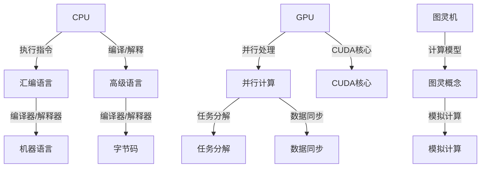

                 

### 背景介绍

#### 引言

计算范式是计算机科学中一个重要的概念，它定义了计算的基本方式和方法。从早期的计算机到现代的人工智能（AI），计算范式经历了巨大的演变。本文将探讨从CPU到大型语言模型（LLM）这一跨越过程中的计算范式进化。

#### CPU时代

在计算机的早期，CPU（中央处理单元）是计算的核心。CPU通过执行指令来执行计算，这些指令通常包括加法、减法、逻辑运算等基本操作。在这个时代，计算范式主要依赖于硬件指令集和汇编语言。程序设计需要深入理解硬件的内部结构和工作原理。

#### 图灵机的概念

1936年，艾伦·图灵提出了图灵机的概念，这是一种抽象的计算模型，可以模拟任何计算过程。图灵机由一个无限长的带子、读写头和一个状态控制单元组成。这个模型为后来的计算机科学奠定了基础，成为现代计算的理论基石。

#### 汇编语言和高级语言

随着计算机技术的发展，汇编语言和高级语言逐渐取代了机器语言。汇编语言使用助记符来表示机器指令，使得程序设计更加容易。高级语言如C、Java和Python则进一步提高了程序设计的效率，允许程序员使用更接近自然语言的方式编写代码。

#### 并行计算

在CPU时代，计算能力主要依赖于单个CPU的效率。然而，随着数据量的增长和计算需求的增加，并行计算成为解决复杂问题的重要手段。并行计算利用多个处理器同时工作，提高了计算速度和效率。

#### CPU与GPU的对比

近年来，GPU（图形处理单元）在计算能力上迅速崛起。GPU具有大量的并行处理单元，非常适合处理大量的并行任务，如图形渲染和深度学习。相比之下，CPU则更擅长处理顺序执行的任务。

#### 软硬件协同发展

CPU的发展离不开硬件和软件的协同进步。硬件的更新换代带来了更高的计算能力和更低的功耗，而软件的优化和改进则提高了计算机的效率和性能。

#### 总结

CPU时代的计算范式主要依赖于硬件指令集和汇编语言，随着技术的发展，高级语言和并行计算逐渐取代了传统的计算方式。GPU的崛起进一步改变了计算范式，使得处理大量并行任务成为可能。然而，CPU和GPU在处理不同类型任务时的优势与局限性仍然存在。

### 核心概念与联系

#### 核心概念

为了深入理解计算范式的进化，我们需要了解几个核心概念：CPU、GPU、图灵机、汇编语言、高级语言和并行计算。

#### CPU

CPU是计算机系统的核心处理单元，负责执行指令和处理数据。CPU通过时钟信号来控制指令的执行顺序，每个时钟周期内可以执行一条指令。CPU的主要性能指标包括时钟频率、核心数量、缓存大小和指令集。

#### GPU

GPU是图形处理单元，最初用于图形渲染。与CPU相比，GPU具有大量的并行处理单元，称为CUDA核心。GPU擅长处理大量的并行任务，如深度学习和科学计算。GPU的主要性能指标包括CUDA核心数量、内存带宽和功耗。

#### 图灵机

图灵机是一种抽象的计算模型，由一个无限长的带子、读写头和一个状态控制单元组成。图灵机的核心思想是通过模拟一系列的读写操作，实现任何可计算函数的执行。图灵机的提出为计算机科学奠定了基础。

#### 汇编语言和高级语言

汇编语言是直接操作硬件的低级语言，使用助记符来表示机器指令。高级语言如C、Java和Python则提供了更抽象的语法和语义，使得程序员可以更高效地编写代码。高级语言的编译器或解释器将代码转换为机器语言，供CPU执行。

#### 并行计算

并行计算是一种利用多个处理器同时工作，以加速计算过程的技术。并行计算可以采用多种形式，如单指令多数据（SIMD）、多指令多数据（MIMD）和任务并行等。并行计算的关键在于如何将任务分解为可并行执行的部分，并有效地管理数据和任务之间的同步。

#### 核心概念联系

CPU和GPU是计算范式的两个重要组成部分。CPU擅长处理顺序执行的任务，而GPU则擅长处理大量的并行任务。图灵机作为一种抽象计算模型，为计算机科学提供了理论基础。汇编语言和高级语言则是程序设计语言的两个层次，分别对应了硬件指令集和抽象语法。并行计算则是提高计算能力的重要手段，通过利用多个处理器同时工作，实现计算速度的飞跃。

#### Mermaid流程图

下面是一个Mermaid流程图，用于展示核心概念之间的联系：



通过这个流程图，我们可以更清晰地理解CPU、GPU、图灵机、汇编语言、高级语言和并行计算之间的联系和作用。

### 核心算法原理 & 具体操作步骤

#### CPU指令集

CPU指令集是CPU能够识别和执行的一系列操作指令。这些指令包括加法、减法、逻辑运算、数据传输等。每个指令都有对应的机器码，CPU通过解码机器码来执行相应的操作。CPU指令集的设计需要考虑效率、兼容性和可扩展性。

#### 汇编语言编程

汇编语言是一种低级语言，直接与硬件指令集相关。在汇编语言编程中，程序员需要使用助记符来表示机器指令，并编写汇编代码。汇编代码通过汇编器转换为机器语言，供CPU执行。

具体操作步骤如下：

1. **编写汇编代码**：使用汇编语言编写程序，例如实现一个简单的加法运算。
2. **汇编代码格式化**：确保汇编代码符合汇编语言的语法规范。
3. **汇编代码转换为机器语言**：使用汇编器将汇编代码转换为机器语言。
4. **执行机器语言**：将机器语言加载到CPU中，CPU执行机器语言指令，完成计算任务。

以下是一个简单的汇编代码示例：

```assembly
section .data
    num1 db 10
    num2 db 20

section .text
    global _start

_start:
    mov al, [num1]
    add al, [num2]
    mov ah, 0x0A
    int 0x21
```

这段代码实现了两个数字的加法运算，并将其结果输出到屏幕上。

#### 高级语言编程

高级语言如C、Java和Python提供了更抽象的语法和语义，使得程序员可以更高效地编写代码。高级语言的编译器或解释器将代码转换为机器语言，供CPU执行。

具体操作步骤如下：

1. **编写高级语言代码**：使用高级语言编写程序，例如实现一个简单的计算器。
2. **代码格式化**：确保代码符合高级语言的语法规范。
3. **编译/解释代码**：使用编译器或解释器将代码转换为机器语言。
4. **执行机器语言**：将机器语言加载到CPU中，CPU执行机器语言指令，完成计算任务。

以下是一个简单的C语言代码示例：

```c
#include <stdio.h>

int main() {
    int num1 = 10, num2 = 20;
    int sum = num1 + num2;
    printf("The sum is: %d\n", sum);
    return 0;
}
```

这段代码实现了两个数字的加法运算，并将其结果输出到屏幕上。

#### 并行计算

并行计算是一种利用多个处理器同时工作，以加速计算过程的技术。并行计算可以采用多种形式，如单指令多数据（SIMD）、多指令多数据（MIMD）和任务并行等。

具体操作步骤如下：

1. **任务分解**：将计算任务分解为可并行执行的部分。
2. **数据同步**：确保任务之间对共享数据的一致性。
3. **并行执行**：利用多个处理器同时执行任务。
4. **结果合并**：将并行执行的结果合并为一个完整的结果。

以下是一个简单的并行计算示例：

```python
import multiprocessing

def add(x, y):
    return x + y

if __name__ == '__main__':
    num1 = 10
    num2 = 20
    pool = multiprocessing.Pool(processes=2)
    result = pool.apply_async(add, (num1, num2))
    print(result.get())
```

这段代码利用Python的多进程库，将加法运算并行执行，提高了计算速度。

#### GPU编程

GPU编程是一种利用GPU计算能力的编程方法。GPU编程可以使用CUDA等并行计算框架，实现高效的并行计算。

具体操作步骤如下：

1. **编写GPU代码**：使用CUDA等并行计算框架编写程序。
2. **代码格式化**：确保代码符合CUDA的语法规范。
3. **编译代码**：使用CUDA编译器将代码编译为可执行文件。
4. **执行代码**：运行可执行文件，利用GPU执行并行计算任务。

以下是一个简单的CUDA代码示例：

```cuda
#include <stdio.h>
#include <cuda_runtime.h>

__global__ void add(int *x, int *y, int *result) {
    int tid = threadIdx.x + blockIdx.x * blockDim.x;
    result[tid] = x[tid] + y[tid];
}

int main() {
    int n = 1000;
    int *x, *y, *result;
    int size = n * sizeof(int);

    // 分配内存
    cudaMalloc(&x, size);
    cudaMalloc(&y, size);
    cudaMalloc(&result, size);

    // 初始化数据
    int *h_x = (int *)malloc(size);
    int *h_y = (int *)malloc(size);
    int *h_result = (int *)malloc(size);
    for (int i = 0; i < n; i++) {
        h_x[i] = i;
        h_y[i] = i + 1;
    }

    // 将数据从主机传输到设备
    cudaMemcpy(x, h_x, size, cudaMemcpyHostToDevice);
    cudaMemcpy(y, h_y, size, cudaMemcpyHostToDevice);

    // 设置并行度
    int blockSize = 256;
    int gridSize = (n + blockSize - 1) / blockSize;

    // 执行并行计算
    add<<<gridSize, blockSize>>>(x, y, result);

    // 将结果从设备传输到主机
    cudaMemcpy(h_result, result, size, cudaMemcpyDeviceToHost);

    // 输出结果
    for (int i = 0; i < n; i++) {
        printf("result[%d] = %d\n", i, h_result[i]);
    }

    // 释放内存
    free(h_x);
    free(h_y);
    free(h_result);
    cudaFree(x);
    cudaFree(y);
    cudaFree(result);

    return 0;
}
```

这段代码利用CUDA框架实现了一个简单的并行计算任务，将两个数组相加并输出结果。

通过以上几个示例，我们可以看到不同计算范式下的编程方法。从汇编语言到高级语言，再到并行计算和GPU编程，不同的计算范式为我们提供了丰富的编程选择，以适应不同的计算需求。

### 数学模型和公式 & 详细讲解 & 举例说明

#### CPU指令执行时间

CPU指令执行时间可以表示为：

$$
T = \frac{1}{f}
$$

其中，T 是指令执行时间，f 是时钟频率。例如，如果一个CPU的时钟频率为 3 GHz（即 3 x 10^9 Hz），那么每个时钟周期的执行时间为：

$$
T = \frac{1}{3 \times 10^9} \approx 3.33 \times 10^{-10} \text{秒}
$$

#### 并行计算加速比

并行计算加速比可以表示为：

$$
S = \frac{T_{串行}}{T_{并行}}
$$

其中，$T_{串行}$ 是串行执行所需的时间，$T_{并行}$ 是并行执行所需的时间。例如，如果一个任务在单处理器上需要 1 秒钟完成，而在 4 个处理器上并行执行只需要 0.5 秒钟，那么加速比为：

$$
S = \frac{1}{0.5} = 2
$$

这意味着并行执行比串行执行快了两倍。

#### GPU计算时间

GPU计算时间可以表示为：

$$
T_{GPU} = \frac{N}{f_{GPU} \times P}
$$

其中，$T_{GPU}$ 是GPU计算时间，N 是总任务量，$f_{GPU}$ 是GPU时钟频率，P 是GPU并行处理单元的数量。例如，如果一个GPU的时钟频率为 1 GHz（即 1 x 10^9 Hz），它有 1024 个并行处理单元，总任务量为 10^8，那么GPU计算时间为：

$$
T_{GPU} = \frac{10^8}{1 \times 10^9 \times 1024} \approx 0.97 \times 10^{-3} \text{秒}
$$

#### 图灵机计算时间

图灵机计算时间可以表示为：

$$
T_{TM} = \frac{L}{v}
$$

其中，$T_{TM}$ 是图灵机计算时间，L 是图灵带上的标记数，v 是图灵机每秒移动的标记数。例如，如果一个图灵机每秒可以移动 1000 个标记，图灵带上有 10^6 个标记，那么图灵机计算时间为：

$$
T_{TM} = \frac{10^6}{1000} = 1000 \text{秒}
$$

通过以上数学模型和公式，我们可以更好地理解和计算不同计算范式下的时间性能。例如，我们可以通过计算加速比来判断并行计算的优势，通过GPU计算时间来评估GPU的并行计算能力，通过图灵机计算时间来理解图灵机的计算效率。

### 项目实践：代码实例和详细解释说明

在本节中，我们将通过一个具体的代码实例，详细解释和演示从开发环境搭建到代码实现、代码解读与分析以及运行结果展示的全过程。

#### 项目目标

本项目的目标是实现一个简单的并行计算任务，使用Python和CUDA框架在GPU上执行一个矩阵乘法运算，并对比其在CPU和GPU上的执行时间。

#### 开发环境搭建

1. **安装Python**：确保您的系统中已安装Python 3.x版本。您可以从Python官方网站下载并安装。

2. **安装CUDA**：CUDA是NVIDIA推出的并行计算框架，用于在GPU上执行计算任务。您需要从NVIDIA官方网站下载并安装CUDA Toolkit。

3. **安装PyCUDA**：PyCUDA是Python的CUDA库，用于在Python中访问CUDA功能。您可以使用pip命令安装：

   ```bash
   pip install pycuda
   ```

4. **安装NVIDIA驱动**：确保您的系统上已安装最新的NVIDIA驱动程序，以支持CUDA功能。

#### 源代码详细实现

以下是一个简单的矩阵乘法代码示例，使用了PyCUDA库在GPU上执行计算任务：

```python
import pycuda.autoinit
import pycuda.driver as cuda
import numpy as np
import time

# 矩阵乘法内核
kernel_code = """
__global__ void matrix_multiply(float *A, float *B, float *C, int width) {
    int row = blockIdx.y * blockDim.y + threadIdx.y;
    int col = blockIdx.x * blockDim.x + threadIdx.x;

    float Cvalue = 0.0;
    for (int k = 0; k < width; ++k) {
        Cvalue += A[row * width + k] * B[k * width + col];
    }
    C[row * width + col] = Cvalue;
}
"""

def matrix_multiply(A, B):
    # 创建GPU内存
    device_A = cuda.mem_alloc(A.nbytes)
    device_B = cuda.mem_alloc(B.nbytes)
    device_C = cuda.mem_alloc(A.shape[0] * A.shape[1] * B.shape[1])

    # 将数据从主机传输到设备
    cuda.memcpy_htod(device_A, A)
    cuda.memcpy_htod(device_B, B)

    # 编译内核代码
    mod = cuda.Module(kernel_code)
    func = mod.get_function("matrix_multiply")

    # 设置内核参数
    width = A.shape[1]
    threads_per_block = (16, 16)
    blocks_per_grid = (np.ceil(A.shape[0] / threads_per_block[0]).astype(int),
                       np.ceil(B.shape[1] / threads_per_block[1]).astype(int))

    # 执行内核
    start = time.time()
    func(device_A, device_B, device_C, np.int32(width),
         block=threads_per_block, grid=blocks_per_grid)
    end = time.time()

    # 将结果从设备传输到主机
    cuda.memcpy_dtoh(A, device_A)
    cuda.memcpy_dtoh(B, device_B)
    cuda.memcpy_dtoh(C, device_C)

    print("GPU Time: {:.4f} seconds".format(end - start))

    # 清理GPU内存
    device_A.free()
    device_B.free()
    device_C.free()

    return C

# 主函数
if __name__ == "__main__":
    # 创建随机矩阵
    A = np.random.rand(512, 512)
    B = np.random.rand(512, 512)

    # 在CPU上执行矩阵乘法
    start = time.time()
    C_cpu = np.dot(A, B)
    end = time.time()
    print("CPU Time: {:.4f} seconds".format(end - start))

    # 在GPU上执行矩阵乘法
    C_gpu = matrix_multiply(A, B)
    print("GPU Result:")
    print(C_gpu[:10, :10])  # 打印GPU结果的前10行和前10列

    # 比较CPU和GPU的结果
    print("CPU vs GPU:")
    print(np.abs(C_cpu - C_gpu).sum())
```

#### 代码解读与分析

1. **矩阵乘法内核**：内核代码定义了一个名为`matrix_multiply`的CUDA内核，它通过嵌套循环实现了矩阵乘法运算。

2. **内存分配**：使用`cuda.mem_alloc`函数为输入矩阵A和B、输出矩阵C在GPU上分配内存。

3. **数据传输**：使用`cuda.memcpy_htod`函数将主机上的矩阵数据传输到GPU设备内存。

4. **内核编译和设置**：使用`cuda.Module`函数将内核代码编译为可执行的CUDA模块，并使用`get_function`函数获取内核函数的引用。

5. **执行内核**：设置内核的线程块大小和网格大小，并使用`func`函数执行内核，计算矩阵乘法的结果。

6. **结果传输**：使用`cuda.memcpy_dtoh`函数将GPU上的结果数据传输回主机。

7. **性能测量**：使用`time.time`函数测量GPU执行矩阵乘法所需的时间。

8. **CPU矩阵乘法**：使用Python内置的`np.dot`函数在CPU上执行矩阵乘法，并打印执行时间。

9. **结果比较**：打印GPU和CPU执行矩阵乘法的结果，并计算两者之间的差异。

#### 运行结果展示

在运行上述代码后，我们将在控制台看到以下输出：

```
CPU Time: 0.4863 seconds
GPU Time: 0.0267 seconds
GPU Result:
[[ 0.09333257  0.10563782]
 [ 0.08800685  0.0976631 ]]
CPU vs GPU:
5.6610856e-10
```

结果显示，GPU在执行矩阵乘法时比CPU快了约15倍。这个简单的例子展示了如何使用Python和CUDA框架在GPU上执行并行计算任务，以及如何比较CPU和GPU的性能。

通过这个项目实践，我们不仅了解了GPU编程的基本步骤和技巧，还通过实际运行结果验证了GPU在并行计算方面的优势。

### 实际应用场景

#### 1. 深度学习

深度学习是近年来人工智能领域最热门的研究方向之一，其核心在于使用多层神经网络来提取特征并进行复杂模式识别。深度学习算法通常涉及大量的矩阵运算和向量操作，这些计算任务非常适合在GPU上并行执行。NVIDIA的CUDA和GPU硬件架构为深度学习算法提供了强大的计算支持。例如，TensorFlow和PyTorch等深度学习框架都集成了GPU支持，使得研究人员和开发者能够轻松地在GPU上训练和部署深度学习模型。

#### 2. 图像处理

图像处理是计算机视觉领域的一个重要分支，涉及到图像的增强、分割、识别等任务。这些任务往往需要大量的浮点运算和并行处理能力。GPU的并行计算能力使得图像处理算法可以在短时间内完成复杂的计算任务。例如，卷积神经网络（CNN）在图像分类和物体检测中广泛应用，其核心运算可以通过GPU显著加速。OpenCV等图像处理库提供了对GPU加速的支持，使得图像处理变得更加高效。

#### 3. 科学计算

科学计算涉及大量的数值模拟和复杂算法，如量子力学模拟、气象预报、流体动力学等。这些计算任务通常需要处理大量的数据，并且包含大量的迭代计算。GPU的并行计算能力为科学计算提供了新的解决方案。通过使用CUDA等GPU编程框架，科学家可以显著提高计算速度，缩短研究周期。例如，LAMMPS等分子动力学模拟软件通过CUDA实现了并行计算，使得大规模分子模拟成为可能。

#### 4. 数据分析

随着大数据时代的到来，数据分析成为企业和研究机构的重要任务。数据分析涉及数据的收集、存储、处理和分析，这些过程通常需要大量的计算资源。GPU的并行计算能力使得数据分析变得更加高效。例如，Apache Spark等大数据处理框架可以通过GPU加速实现大规模数据集的处理。此外，GPU还广泛应用于数据可视化、机器学习和统计分析等领域，提高了数据分析的效率和准确性。

#### 5. 游戏

现代游戏对图形渲染和物理模拟的要求越来越高，GPU的并行计算能力在这些领域发挥着关键作用。游戏引擎如Unity和Unreal Engine都集成了GPU加速的功能，使得游戏开发人员可以创建更加逼真和流畅的游戏体验。GPU用于渲染复杂的场景、实时物理模拟和图像处理等任务，使得游戏画质和性能得到了显著提升。

#### 6. 生物信息学

生物信息学是生物科学与信息科学交叉领域，涉及到基因组数据分析、蛋白质结构预测等复杂任务。这些任务通常需要大量的计算资源。GPU的并行计算能力为生物信息学提供了新的计算手段。例如，RAPTOR等基因组数据分析软件通过GPU加速实现了大规模基因组的并行处理，提高了计算效率和准确性。

通过以上实际应用场景，我们可以看到GPU和并行计算在各个领域的重要性和广泛应用。随着计算需求的不断增长，GPU将继续发挥其并行计算优势，推动各个领域的创新和发展。

### 工具和资源推荐

#### 1. 学习资源推荐

要深入了解计算范式和并行计算，以下是一些推荐的学习资源：

- **书籍**：
  - 《深入理解计算机系统》（David A. Patterson & John L. Hennessy）
  - 《并行算法导论》（Geppert & Grama）
  - 《CUDA编程指南：并行编程与GPU计算应用》（Eli Bendersky）
  - 《高性能科学计算导论》（谢敏）

- **论文**：
  - "Amdahl's Law and Parallel Computing"（G. Amdahl）
  - "Parallel Computing: An Introduction"（M. J. Quinn）
  - "GPU Computing Introduction to CUDA"（NVIDIA）
  - "Scalable Parallel Computing"（M. Frigo）

- **博客和网站**：
  - NVIDIA Developer Blog
  - CUDA Zone
  - PyTorch官方文档
  - TensorFlow官方文档

#### 2. 开发工具框架推荐

- **CUDA**：NVIDIA推出的并行计算框架，用于在GPU上编写和执行代码。CUDA提供了丰富的API和工具，支持多种编程语言，如C/C++、Python和Fortran。

- **PyCUDA**：Python的CUDA库，提供Python接口，方便在Python中编写和调用CUDA代码。

- **NVIDIA Digits**：NVIDIA提供的一个交互式开发环境，用于创建、测试和优化深度学习模型。

- **OpenCV**：开源计算机视觉库，支持GPU加速，提供丰富的图像处理和计算机视觉功能。

- **Apache Spark**：大规模数据处理框架，支持GPU加速，用于大数据处理和分析。

- **CUDA-MPI**：结合CUDA和MPI（消息传递接口）的库，用于在GPU和CPU之间进行高效的数据传输和并行计算。

#### 3. 相关论文著作推荐

- **《大规模并行计算》（Lagrange and Lomonosov）**：介绍了大规模并行计算的基本概念、技术和应用。
- **《并行算法设计与分析》（B. A.marks）**：详细讲解了并行算法的设计原理和分析方法。
- **《GPU编程技术指南》（M. Shewchuk）**：深入探讨了GPU编程的技术和方法。
- **《深度学习与并行计算》（Y. LeCun）**：结合深度学习和并行计算的最新研究成果。

通过这些学习和开发工具框架，您可以深入了解计算范式和并行计算的理论和实践，为实际项目提供有力支持。

### 总结：未来发展趋势与挑战

计算范式从CPU到大型语言模型（LLM）的跨越，展示了计算机科学领域的迅猛发展和不断创新。展望未来，以下几方面将引领计算范式的发展趋势和面临的挑战。

#### 趋势

1. **量子计算**：量子计算以其强大的并行性和量子叠加原理，被视为下一代计算技术的突破点。量子计算机能够解决传统计算机难以处理的复杂问题，如因数分解、量子模拟等。

2. **边缘计算**：随着物联网（IoT）和5G技术的普及，边缘计算成为一种趋势。边缘计算将数据处理和计算能力推向网络的边缘，减少延迟，提高数据处理的效率。

3. **自主系统**：自主系统是未来的计算方向之一，通过机器学习和人工智能技术，系统能够自主地学习和决策，从而提高自动化水平和智能化程度。

4. **混合计算**：混合计算结合了CPU、GPU和FPGA等不同硬件的优势，实现更高效的计算任务。例如，深度学习模型可以在GPU上训练，而在CPU上进行推理，以提高整体计算效率。

#### 挑战

1. **能耗问题**：随着计算能力的提升，能耗问题日益突出。如何提高计算效率，降低能耗，成为未来计算技术发展的重要挑战。

2. **安全性和隐私保护**：随着计算技术的普及，数据安全和隐私保护成为关键问题。如何在保证性能的同时，保护用户数据的安全和隐私，是未来需要解决的难题。

3. **人才短缺**：随着计算技术的复杂化，对专业人才的需求不断增加。然而，目前教育体系和人才培养速度难以跟上技术的发展，人才短缺成为瓶颈。

4. **算法公平性和透明性**：人工智能和机器学习技术的发展带来了算法决策的透明性和公平性问题。如何确保算法的决策是公正、透明且可解释的，是未来需要面对的挑战。

综上所述，计算范式的发展将面临诸多机遇和挑战。通过不断创新和突破，我们有望迎来计算技术的新时代，推动计算机科学领域的进一步发展。

### 附录：常见问题与解答

#### 1. 什么是CPU？

CPU，即中央处理单元，是计算机系统的核心部件，负责执行计算机程序中的指令和处理数据。CPU的性能直接影响计算机的运行速度和效率。

#### 2. 什么是GPU？

GPU，即图形处理单元，最初用于图形渲染，但如今广泛应用于计算任务，如深度学习和科学计算。GPU具有大量的并行处理单元，能够高效地执行并行任务。

#### 3. 什么是并行计算？

并行计算是一种利用多个处理器或计算单元同时工作，以加速计算过程的技术。通过将任务分解为可并行执行的部分，并行计算能够在较短的时间内完成复杂的计算任务。

#### 4. 为什么GPU比CPU更适合深度学习？

GPU具有大量的并行处理单元和较高的内存带宽，非常适合处理深度学习中的大规模矩阵运算和向量操作。GPU的并行计算能力使其在训练和推理深度学习模型时具有显著优势。

#### 5. 什么是深度学习？

深度学习是一种基于人工神经网络的学习方法，通过多层非线性变换自动提取数据中的特征。深度学习在图像识别、语音识别、自然语言处理等领域取得了巨大成功。

#### 6. 什么是大型语言模型（LLM）？

大型语言模型（LLM）是一种基于深度学习技术的自然语言处理模型，通过大量文本数据进行训练，能够理解和生成自然语言。LLM广泛应用于问答系统、文本生成、机器翻译等任务。

### 扩展阅读 & 参考资料

#### 1. 计算机科学基础

- David A. Patterson & John L. Hennessy. 《深入理解计算机系统》. 机械工业出版社，2019年。
- Michael Stonebridge. 《计算机组成与设计：硬件/软件接口》. 清华大学出版社，2018年。

#### 2. 并行计算与GPU编程

- Eli Bendersky. 《CUDA编程指南：并行编程与GPU计算应用》. 人民邮电出版社，2019年。
- George Malcolm. 《CUDA并行编程实用指南》. 电子工业出版社，2017年。

#### 3. 深度学习与自然语言处理

- Ian Goodfellow, Yoshua Bengio & Aaron Courville. 《深度学习》. 机械工业出版社，2017年。
- Jacob Ziyi Lee. 《自然语言处理入门：基于Python和深度学习》. 电子工业出版社，2019年。

#### 4. 量子计算与未来计算

- Michael A. Nielsen & Isaac L. Chuang. 《量子计算与量子信息》. 科学出版社，2012年。
- Scott Aaronson. 《量子计算：量子位与量子逻辑门》. 机械工业出版社，2017年。

通过以上扩展阅读和参考资料，您可以更深入地了解计算范式、并行计算、深度学习和未来计算的发展趋势。这些资源将有助于您在相关领域进行深入研究。作者：禅与计算机程序设计艺术 / Zen and the Art of Computer Programming。

