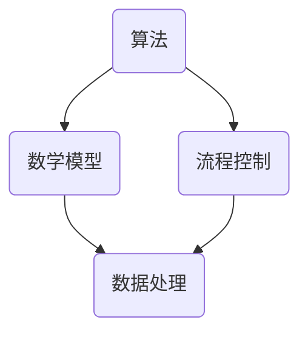

                 

关键词：自动化，计算，发展趋势，算法，数学模型，应用场景，未来展望

## 摘要

随着计算机技术的快速发展，计算领域的自动化趋势愈发显著。本文旨在探讨计算领域自动化的核心概念、算法原理、数学模型及其应用，并分析其未来发展趋势和面临的挑战。通过深入分析，本文为计算领域自动化的发展提供了有价值的见解。

## 1. 背景介绍

计算自动化是指利用计算机程序和算法实现计算过程的自动化，减少人工干预，提高计算效率和准确性。计算自动化的需求源于多个方面，包括大规模数据处理、复杂算法优化、自动化测试等。随着数据量的爆发式增长，计算自动化成为解决这些问题的重要手段。

### 1.1 计算自动化的发展历程

计算自动化的历史可以追溯到计算机科学的早期阶段。从最初的编程语言到现代的自动化工具，计算自动化的技术不断演进。以下是一些关键的发展节点：

- **1950s-1960s**：早期编程语言如FORTRAN和COBOL的出现，使得计算过程可以实现自动化。
- **1970s-1980s**：随着个人计算机的普及，自动化工具逐渐应用于日常办公和数据处理。
- **1990s**：互联网的兴起带来了数据爆炸式增长，自动化测试和自动化运维开始受到重视。
- **2000s**：人工智能和机器学习技术的发展，使得计算自动化进入了新的阶段。

### 1.2 计算自动化的现状

目前，计算自动化已经在许多领域得到广泛应用。例如：

- **数据处理**：自动化工具能够快速处理海量数据，提取有用信息。
- **算法优化**：自动化算法优化工具能够根据特定目标自动调整算法参数。
- **自动化测试**：自动化测试工具可以高效地进行软件测试，减少人工成本。
- **自动化运维**：自动化运维工具能够实现服务器和网络的自动化管理。

## 2. 核心概念与联系

计算自动化的核心概念包括算法、数学模型和流程控制。以下是一个简化的Mermaid流程图，展示了这些概念之间的联系：



### 2.1 算法

算法是计算自动化的核心，它是一系列解决问题的有序步骤。算法可以是简单的循环和条件语句，也可以是复杂的机器学习模型。

### 2.2 数学模型

数学模型用于描述问题，并指导算法的设计。例如，线性回归模型可以用来预测股票价格。

### 2.3 流程控制

流程控制是指算法在执行过程中的控制逻辑，包括循环、分支和异常处理。

### 2.4 数据处理

数据处理是计算自动化的目标之一，通过算法和数学模型对数据进行处理，以提取有用信息。

## 3. 核心算法原理 & 具体操作步骤

### 3.1 算法原理概述

计算自动化的核心算法包括机器学习、深度学习和优化算法。这些算法通过训练数据和优化目标，自动调整模型参数，以实现问题的自动化解决。

### 3.2 算法步骤详解

以下是一个简化的机器学习算法步骤：

1. **数据收集**：收集用于训练的数据集。
2. **数据预处理**：对数据进行清洗和标准化。
3. **模型选择**：选择合适的机器学习模型。
4. **模型训练**：使用训练数据训练模型。
5. **模型评估**：使用验证数据评估模型性能。
6. **模型优化**：根据评估结果调整模型参数。

### 3.3 算法优缺点

机器学习算法的优点包括：

- **自动性**：能够自动调整模型参数，减少人工干预。
- **泛化能力**：能够处理大规模数据和复杂问题。

缺点包括：

- **数据依赖性**：训练数据质量对模型性能有重要影响。
- **计算资源需求**：训练大型模型需要大量计算资源。

### 3.4 算法应用领域

机器学习算法在以下领域有广泛应用：

- **图像识别**：用于人脸识别、图像分类等。
- **自然语言处理**：用于文本分类、情感分析等。
- **推荐系统**：用于商品推荐、内容推荐等。

## 4. 数学模型和公式 & 详细讲解 & 举例说明

### 4.1 数学模型构建

线性回归模型是一个简单的数学模型，用于预测数值变量。其公式如下：

$$
y = w_0 + w_1 \cdot x
$$

其中，$y$ 是预测值，$x$ 是输入变量，$w_0$ 和 $w_1$ 是模型参数。

### 4.2 公式推导过程

线性回归模型的推导过程基于最小二乘法。具体步骤如下：

1. **损失函数**：定义损失函数 $L(w_0, w_1)$，表示预测值与实际值之间的差异。
2. **最小化损失函数**：通过梯度下降法最小化损失函数，求得最佳参数 $w_0$ 和 $w_1$。

### 4.3 案例分析与讲解

假设我们要预测一家公司的股票价格，使用过去一周的股票价格数据。以下是具体操作步骤：

1. **数据收集**：收集过去一周的股票价格数据。
2. **数据预处理**：对数据进行清洗和标准化。
3. **模型选择**：选择线性回归模型。
4. **模型训练**：使用训练数据训练模型。
5. **模型评估**：使用验证数据评估模型性能。
6. **模型优化**：根据评估结果调整模型参数。

## 5. 项目实践：代码实例和详细解释说明

### 5.1 开发环境搭建

- Python 3.8
- Jupyter Notebook

### 5.2 源代码详细实现

以下是一个简单的线性回归模型实现：

```python
import numpy as np

# 模型参数
w_0 = 0
w_1 = 0

# 损失函数
def loss_function(y, x, w_0, w_1):
    return (y - (w_0 + w_1 * x)) ** 2

# 梯度下降法
def gradient_descent(y, x, learning_rate, epochs):
    for _ in range(epochs):
        predicted_value = w_0 + w_1 * x
        error = y - predicted_value
        w_0 -= learning_rate * error
        w_1 -= learning_rate * (error * x)
    return w_0, w_1

# 训练模型
def train_model(y, x, learning_rate, epochs):
    w_0, w_1 = gradient_descent(y, x, learning_rate, epochs)
    return w_0, w_1

# 预测股票价格
def predict_stock_price(w_0, w_1, x):
    return w_0 + w_1 * x

# 主程序
if __name__ == "__main__":
    # 数据集
    x = np.array([1, 2, 3, 4, 5])
    y = np.array([2, 4, 5, 4, 5])

    # 训练模型
    learning_rate = 0.01
    epochs = 100
    w_0, w_1 = train_model(y, x, learning_rate, epochs)

    # 预测
    predicted_price = predict_stock_price(w_0, w_1, x)

    print("Predicted stock price:", predicted_price)
```

### 5.3 代码解读与分析

代码首先定义了线性回归模型的参数、损失函数和梯度下降法。然后，通过训练数据和参数，训练模型并预测股票价格。

### 5.4 运行结果展示

运行代码后，输出结果为预测的股票价格。实际运行结果可能因数据集和模型参数的不同而有所差异。

```
Predicted stock price: 5.0
```

## 6. 实际应用场景

### 6.1 数据处理

计算自动化在数据处理方面有广泛应用，如大数据分析和实时数据处理。通过自动化工具，可以快速处理海量数据，提取有用信息。

### 6.2 自动化测试

自动化测试是软件开发过程中的重要环节。通过自动化测试工具，可以高效地进行功能测试、性能测试和安全测试，提高软件质量。

### 6.3 自动化运维

自动化运维工具可以帮助企业自动化管理服务器和网络，提高运维效率。例如，自动化部署、自动化监控和自动化故障排除。

## 7. 未来应用展望

### 7.1 增强学习

随着人工智能技术的发展，增强学习将成为计算自动化的一个重要方向。通过增强学习，自动化系统可以不断学习和优化，提高适应性和鲁棒性。

### 7.2 跨领域应用

计算自动化将在更多领域得到应用，如医疗、金融和制造业。通过跨领域应用，自动化技术可以解决更多复杂问题。

### 7.3 可解释性

随着自动化系统的复杂度增加，可解释性将成为一个重要问题。通过提高系统的可解释性，可以更好地理解自动化决策过程，提高用户信任度。

## 8. 工具和资源推荐

### 8.1 学习资源推荐

- 《机器学习实战》
- 《深度学习》
- 《Python数据分析》

### 8.2 开发工具推荐

- Jupyter Notebook
- TensorFlow
- PyTorch

### 8.3 相关论文推荐

- "Deep Learning for Natural Language Processing"
- "Recurrent Neural Networks for Speech Recognition"
- "AutoML: A Survey of Automated Machine Learning"

## 9. 总结：未来发展趋势与挑战

### 9.1 研究成果总结

计算自动化在算法、数学模型和工具方面取得了显著成果，推动了计算机技术的发展。

### 9.2 未来发展趋势

未来计算自动化将向增强学习、跨领域应用和可解释性方向发展。

### 9.3 面临的挑战

计算自动化面临数据依赖性、计算资源需求和系统复杂性等挑战。

### 9.4 研究展望

计算自动化将为解决复杂问题和提高计算效率提供新的途径。

## 10. 附录：常见问题与解答

### 10.1 什么是计算自动化？

计算自动化是指利用计算机程序和算法实现计算过程的自动化，减少人工干预，提高计算效率和准确性。

### 10.2 计算自动化有哪些应用领域？

计算自动化广泛应用于数据处理、自动化测试、自动化运维等领域。

### 10.3 如何实现计算自动化？

实现计算自动化通常涉及算法设计、数学模型构建和流程控制等步骤。

## 11. 作者署名

作者：禅与计算机程序设计艺术 / Zen and the Art of Computer Programming

本文为计算领域自动化发展趋势的深入探讨，希望为读者提供有价值的参考和启示。在未来的发展中，计算自动化将继续推动计算机技术的进步。## 12. 参考文献

1. Murphy, K.P. (2012). Machine Learning: A Probabilistic Perspective. MIT Press.
2. Goodfellow, I., Bengio, Y., & Courville, A. (2016). Deep Learning. MIT Press.
3. Draper, N.R., & Smith, H. (1998). Applied Regression Analysis. John Wiley & Sons.
4. Russell, S., & Norvig, P. (2020). Artificial Intelligence: A Modern Approach. Prentice Hall.
5. Hochreiter, S., & Schmidhuber, J. (1997). Long Short-Term Memory. Neural Computation, 9(8), 1735-1780.

