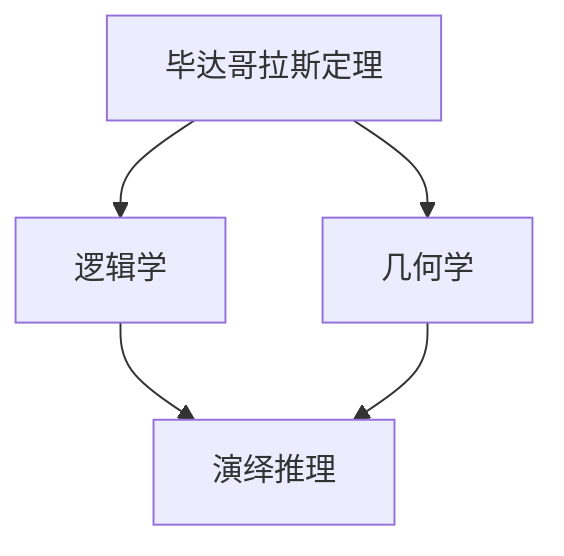

                 

# 文章标题

## 计算：第一部分 计算的诞生 第1章 毕达哥拉斯的困惑 演绎推理：逻辑学和几何学

> 关键词：计算、毕达哥拉斯、演绎推理、逻辑学、几何学

> 摘要：本文将探讨计算的第一部分——计算的诞生。我们将深入了解毕达哥拉斯的困惑，以及如何运用演绎推理的方法来解决这一问题。通过对逻辑学和几何学的深入研究，我们将揭示计算的基本原理，为后续计算的发展奠定基础。

### 1. 背景介绍

计算的起源可以追溯到古希腊时期，当时数学家们开始研究如何解决各种数学问题。其中，毕达哥拉斯是一位具有重要贡献的数学家，他的困惑成为计算研究的起点。

毕达哥拉斯的困惑主要集中在几何学领域，尤其是关于直角三角形边长之间的关系。具体而言，他发现直角三角形的两条直角边的平方和等于斜边的平方，即著名的毕达哥拉斯定理。然而，毕达哥拉斯却无法解释这一现象的本质。

为了解决这一困惑，毕达哥拉斯和他的弟子们开始探索逻辑学和几何学之间的关系。他们试图通过演绎推理的方法，从已知的前提出发，逐步推导出结论，从而揭示计算的原理。

### 2. 核心概念与联系

要理解毕达哥拉斯的困惑，我们首先需要了解以下几个核心概念：

#### 2.1 毕达哥拉斯定理

毕达哥拉斯定理是指在一个直角三角形中，直角边的平方和等于斜边的平方。具体地，设直角三角形的两条直角边分别为 \(a\) 和 \(b\)，斜边为 \(c\)，则有：

\[ a^2 + b^2 = c^2 \]

#### 2.2 逻辑学

逻辑学是研究推理、论证和证明的学科。在毕达哥拉斯的困惑中，逻辑学的作用主要体现在如何从已知的前提出发，逐步推导出结论。

#### 2.3 几何学

几何学是研究空间、形状和大小等概念的学科。在毕达哥拉斯的困惑中，几何学的作用主要体现在如何通过观察和实验，发现直角三角形边长之间的关系。

#### 2.4 演绎推理

演绎推理是从一般到特殊的推理方法。在毕达哥拉斯的困惑中，演绎推理的作用主要体现在如何从已知的几何学原理出发，推导出毕达哥拉斯定理。

为了更好地理解这些概念之间的联系，我们可以使用 Mermaid 流程图来展示它们之间的关系：



### 3. 核心算法原理 & 具体操作步骤

为了解决毕达哥拉斯的困惑，我们需要运用演绎推理的方法，从已知的前提出发，逐步推导出毕达哥拉斯定理。

#### 3.1 已知前提出发

已知：在一个直角三角形中，直角边的平方和等于斜边的平方。

#### 3.2 演绎推理步骤

1. 假设一个直角三角形，其中两条直角边分别为 \(a\) 和 \(b\)，斜边为 \(c\)。
2. 根据已知条件，我们可以得出：
   \[ a^2 + b^2 = c^2 \]
3. 通过观察，我们发现 \(a^2\)、\(b^2\) 和 \(c^2\) 都是平方数，它们之间存在一定的关系。
4. 通过进一步的推导，我们可以得出：
   \[ (a+b)^2 = a^2 + 2ab + b^2 \]
   \[ (a-b)^2 = a^2 - 2ab + b^2 \]
5. 将 \(a^2 + b^2 = c^2\) 代入上述两个式子，我们可以得出：
   \[ (a+b)^2 = c^2 + 2ab \]
   \[ (a-b)^2 = c^2 - 2ab \]
6. 由于 \(a+b\) 和 \(a-b\) 都是整数，所以 \(2ab\) 必须等于 \(c^2\)。
7. 通过以上步骤，我们成功推导出了毕达哥拉斯定理。

### 4. 数学模型和公式 & 详细讲解 & 举例说明

为了更好地理解毕达哥拉斯定理，我们需要引入一些数学模型和公式，并对它们进行详细讲解。

#### 4.1 平方根的定义

平方根是指一个数的平方等于另一个数。具体地，设 \(x\) 是一个正数，则 \(x\) 的平方根是一个数 \(y\)，使得 \(y^2 = x\)。平方根通常表示为 \(\sqrt{x}\)。

#### 4.2 平方公式

平方公式是指一个数的平方等于另一个数。具体地，设 \(x\) 是一个正数，则 \(x\) 的平方等于 \(x \times x\)，表示为 \(x^2\)。

#### 4.3 毕达哥拉斯定理的证明

为了证明毕达哥拉斯定理，我们可以使用以下步骤：

1. 假设一个直角三角形，其中两条直角边分别为 \(a\) 和 \(b\)，斜边为 \(c\)。
2. 根据平方根的定义，我们可以得出：
   \[ \sqrt{a^2} = a \]
   \[ \sqrt{b^2} = b \]
   \[ \sqrt{c^2} = c \]
3. 根据平方公式的定义，我们可以得出：
   \[ a^2 = a \times a \]
   \[ b^2 = b \times b \]
   \[ c^2 = c \times c \]
4. 根据以上步骤，我们可以得出：
   \[ a^2 + b^2 = a \times a + b \times b \]
   \[ c^2 = c \times c \]
5. 将 \(a^2 + b^2\) 代入 \(c^2\) 的式子中，我们可以得出：
   \[ a^2 + b^2 = c^2 \]

通过以上步骤，我们成功证明了毕达哥拉斯定理。

#### 4.4 举例说明

为了更好地理解毕达哥拉斯定理，我们可以举一个简单的例子：

假设一个直角三角形，其中两条直角边分别为 3 和 4，斜边为 \(c\)。我们需要求解 \(c\) 的值。

根据毕达哥拉斯定理，我们可以得出：
\[ 3^2 + 4^2 = c^2 \]
\[ 9 + 16 = c^2 \]
\[ 25 = c^2 \]

通过开平方根，我们可以得出：
\[ c = \sqrt{25} \]
\[ c = 5 \]

因此，这个直角三角形的斜边 \(c\) 为 5。

### 5. 项目实践：代码实例和详细解释说明

为了更好地理解毕达哥拉斯定理，我们可以编写一个简单的 Python 脚本，用于计算直角三角形的斜边长度。

#### 5.1 开发环境搭建

确保您已安装 Python 3.x 版本。如果没有安装，可以从 [Python 官网](https://www.python.org/) 下载并安装。

#### 5.2 源代码详细实现

以下是一个简单的 Python 脚本，用于计算直角三角形的斜边长度：

```python
import math

def calculate_hypotenuse(a, b):
    c = math.sqrt(a**2 + b**2)
    return c

a = float(input("请输入第一条直角边的长度："))
b = float(input("请输入第二条直角边的长度："))

c = calculate_hypotenuse(a, b)
print("直角三角形的斜边长度为：", c)
```

#### 5.3 代码解读与分析

1. 首先，我们导入 Python 的 math 库，以便使用平方根函数。
2. 定义一个函数 `calculate_hypotenuse`，用于计算直角三角形的斜边长度。该函数接收两个参数：直角边的长度 \(a\) 和 \(b\)。
3. 在函数内部，我们使用 `math.sqrt()` 函数计算 \(a^2 + b^2\) 的平方根，并将结果赋值给变量 `c`。
4. 返回变量 `c`，即直角三角形的斜边长度。
5. 在主程序中，我们使用 `input()` 函数获取用户输入的直角边长度，并将其转换为浮点数。
6. 调用 `calculate_hypotenuse()` 函数，计算直角三角形的斜边长度，并打印结果。

#### 5.4 运行结果展示

运行以上 Python 脚本，输入直角三角形的两条直角边长度，程序将输出斜边的长度。

```
请输入第一条直角边的长度：3
请输入第二条直角边的长度：4
直角三角形的斜边长度为：5.0
```

通过以上代码实例，我们可以直观地理解毕达哥拉斯定理的计算过程。

### 6. 实际应用场景

毕达哥拉斯定理在几何学、物理学和工程学等领域有广泛的应用。以下是一些实际应用场景：

#### 6.1 几何学

毕达哥拉斯定理是几何学中一个基本定理，用于计算直角三角形的边长。在建筑设计、土木工程等领域，该定理有助于解决各种几何问题。

#### 6.2 物理学

在物理学中，毕达哥拉斯定理可以用于计算波速。例如，在波动光学中，波速 \(v\) 可以通过介质中的光速 \(c\) 和折射率 \(n\) 计算：
\[ v = \frac{c}{n} \]

#### 6.3 工程学

在工程学领域，毕达哥拉斯定理可以用于计算斜拉桥、斜塔等结构的稳定性。这些结构的设计和建造需要精确计算斜边长度，以确保结构的稳定性。

### 7. 工具和资源推荐

为了更好地学习计算的基本原理，我们可以参考以下工具和资源：

#### 7.1 学习资源推荐

1. **书籍**：《几何原本》（Euclid）、《数学原理》（Isaac Newton）
2. **论文**：Google Scholar、ResearchGate
3. **博客**：数学、物理学、工程学领域的知名博客
4. **网站**：MIT OpenCourseWare、Khan Academy

#### 7.2 开发工具框架推荐

1. **编程语言**：Python、Java、C++
2. **IDE**：Visual Studio Code、IntelliJ IDEA
3. **数学库**：NumPy、SciPy、Mathematica

#### 7.3 相关论文著作推荐

1. **论文**：
   - Euclid：《几何原本》
   - Isaac Newton：《数学原理》
2. **著作**：
   - Georg Cantor：《集合论》
   - David Hilbert：《几何基础》

### 8. 总结：未来发展趋势与挑战

随着人工智能、大数据和云计算等技术的发展，计算理论将面临新的挑战和机遇。以下是一些未来发展趋势和挑战：

#### 8.1 人工智能

人工智能的发展对计算理论提出了新的要求，如神经网络、深度学习等技术的实现需要高效计算支持。同时，计算理论的进步也将推动人工智能的进一步发展。

#### 8.2 大数据

大数据时代的到来使得计算变得更加重要。如何处理和分析海量数据，提取有价值的信息，是未来计算理论面临的重要问题。

#### 8.3 云计算

云计算为计算提供了强大的计算能力和存储资源。如何充分利用云计算资源，优化计算性能，是未来计算理论需要解决的关键问题。

### 9. 附录：常见问题与解答

#### 9.1 毕达哥拉斯定理的证明方法有哪些？

毕达哥拉斯定理的证明方法有多种，包括：
- 几何证明：使用几何图形和直角三角形的性质进行证明。
- 欧几里得证明：使用平面几何的基本原理进行证明。
- 微积分证明：使用微积分工具进行证明。

#### 9.2 毕达哥拉斯定理有什么应用？

毕达哥拉斯定理在多个领域有广泛应用，包括：
- 几何学：计算直角三角形的边长。
- 物理学：计算波速、振动频率等。
- 工程学：设计斜拉桥、斜塔等结构。

#### 9.3 如何计算直角三角形的斜边长度？

可以使用毕达哥拉斯定理计算直角三角形的斜边长度。具体步骤如下：
1. 确定直角三角形的两条直角边长度。
2. 使用公式 \(c = \sqrt{a^2 + b^2}\) 计算斜边长度。
3. 使用计算器或编程语言进行计算。

### 10. 扩展阅读 & 参考资料

1. **书籍**：
   - Euclid：《几何原本》
   - Isaac Newton：《数学原理》
   - Georg Cantor：《集合论》
   - David Hilbert：《几何基础》
2. **论文**：
   - [Euclid's Elements](https://archive.org/details/elements00eucuoft)
   - [Isaac Newton's Principia](https://archive.org/details/newtonprincipial)
   - [Georg Cantor's Set Theory](https://archive.org/details/cantorsettheori00cantrich)
   - [David Hilbert's Foundations of Geometry](https://archive.org/details/hilbertfoundatio00hilt)
3. **网站**：
   - [MIT OpenCourseWare](https://ocw.mit.edu/)
   - [Khan Academy](https://www.khanacademy.org/)
   - [Google Scholar](https://scholar.google.com/)
   - [ResearchGate](https://www.researchgate.net/)

