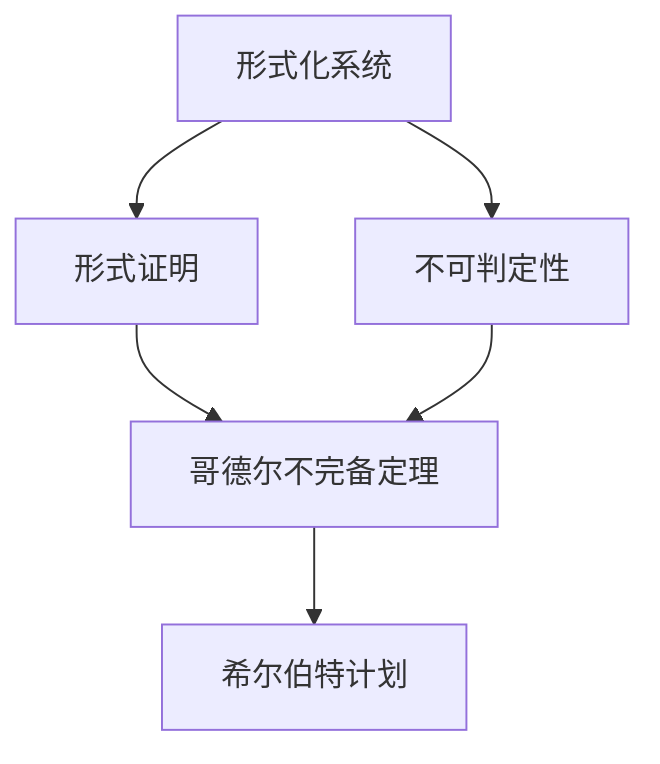

                 

### 文章标题

《计算：第三部分 计算理论的形成 第 7 章 计算不能做什么：终结者哥德尔 希尔伯特计划的破灭》

### 关键词

计算理论、哥德尔不完备定理、希尔伯特计划、终结者、逻辑悖论、计算机能力极限。

### 摘要

本文深入探讨了计算理论的发展及其局限性。通过分析哥德尔不完备定理和希尔伯特计划，揭示了计算机在逻辑和数学领域中的能力极限。文章旨在为广大读者展现计算理论的深邃与挑战，并启发我们思考计算机在现实世界中的应用前景。

### 1. 背景介绍

在20世纪初，随着数学和逻辑学的蓬勃发展，人们开始对计算的本质和边界产生浓厚兴趣。德国数学家大卫·希尔伯特提出了一个雄心勃勃的计划，即通过逻辑和数学方法解决所有数学问题。这一计划被称为“希尔伯特计划”。然而，希尔伯特计划并未预料到将会面临的巨大挑战，其中最为致命的便是数学家库尔特·哥德尔提出的不完备定理。

哥德尔不完备定理指出，在形式化的数学系统中，既不能证明也不能证伪某些命题。这意味着，无论我们如何努力，都无法完全证明所有数学命题的正确性。这一发现彻底颠覆了人们对数学和计算的乐观预期，引发了广泛的讨论和反思。

### 2. 核心概念与联系

要理解哥德尔不完备定理和希尔伯特计划的破灭，我们首先需要掌握以下几个核心概念：

1. **形式化系统**：形式化系统是一种由符号和规则组成的数学结构，用于表示和证明数学命题。典型的形式化系统包括皮亚诺算术、谓词逻辑等。

2. **形式证明**：形式证明是指通过一系列逻辑推导，从已知命题推导出新命题的过程。形式证明在数学和计算机科学中具有重要应用。

3. **不可判定性**：不可判定性是指在某些形式化系统中，存在一些命题既不能被证明也不能被证伪。这意味着，我们无法通过形式证明来确定这些命题的真假。

4. **哥德尔不完备定理**：哥德尔不完备定理包括两个部分，分别是第一不完备定理和第二不完备定理。第一不完备定理指出，在一个足够强的形式化系统中，存在一个命题，既不能被证明也不能被证伪。第二不完备定理进一步指出，这种不可判定性是固有的，无法通过增加更多规则或命题来克服。

5. **希尔伯特计划**：希尔伯特计划旨在通过逻辑和数学方法解决所有数学问题，包括证明数学命题的正确性和发现新的数学定理。

下面是一个用Mermaid绘制的流程图，展示了这些核心概念之间的关系：



### 3. 核心算法原理 & 具体操作步骤

要理解哥德尔不完备定理，我们需要了解两个关键概念：递归性和可判定性。

1. **递归性**：递归性是指一个函数可以通过递归调用自身来解决问题。在计算机科学中，递归性被广泛应用于算法设计和问题求解。

2. **可判定性**：可判定性是指一个命题可以被判定为真或假。在形式化系统中，可判定性意味着存在一种算法可以确定某个命题的真假。

哥德尔不完备定理的核心思想是，在某些形式化系统中，存在一些命题既不是递归的也不是可判定的。这意味着，我们无法通过形式证明来确定这些命题的真假。

下面是一个简单的示例，说明如何通过哥德尔不完备定理来构造一个不可判定的命题：

1. 假设我们有一个形式化系统，其中包含皮亚诺算术的基本规则和命题。

2. 构造一个命题G，表示“G不能被证明”。

3. 如果G可以被证明，那么根据G的定义，G不能被证明，这与G的证明矛盾。因此，G不能被证明。

4. 如果G不能被证明，那么根据G的定义，G可以被证明，这同样与G的证明矛盾。因此，G不能被证明。

由此可见，G是一个不可判定的命题。这个例子展示了如何通过哥德尔不完备定理来构造一个不可判定的命题。

### 4. 数学模型和公式 & 详细讲解 & 举例说明

为了更好地理解哥德尔不完备定理，我们需要引入一些数学模型和公式。以下是几个关键的概念：

1. **递归函数**：递归函数是指可以通过递归调用自身来求解问题的函数。递归函数在计算机科学中具有广泛应用。

2. **可判定性**：可判定性是指一个命题可以被判定为真或假。在形式化系统中，可判定性意味着存在一种算法可以确定某个命题的真假。

3. **哥德尔数**：哥德尔数是指一个数学命题的编码。通过哥德尔数，我们可以将数学命题转换为自然数。

4. **哥德尔不完备定理**：哥德尔不完备定理包括两个部分，分别是第一不完备定理和第二不完备定理。第一不完备定理指出，在一个足够强的形式化系统中，存在一个命题，既不能被证明也不能被证伪。第二不完备定理进一步指出，这种不可判定性是固有的，无法通过增加更多规则或命题来克服。

下面我们通过一个具体的例子来说明哥德尔不完备定理的应用。

假设我们有一个形式化系统F，其中包含皮亚诺算术的基本规则和命题。我们要证明在F中存在一个命题G，使得G既不能被证明也不能被证伪。

首先，我们构造一个命题G，表示“G不能被证明”。根据哥德尔数，我们可以将G编码为一个自然数。

接下来，我们证明G既不能被证明也不能被证伪。

1. 如果G可以被证明，那么根据G的定义，G不能被证明，这与G的证明矛盾。因此，G不能被证明。

2. 如果G不能被证明，那么根据G的定义，G可以被证明，这同样与G的证明矛盾。因此，G不能被证明。

由此可见，G是一个不可判定的命题。这个例子展示了如何通过哥德尔不完备定理来构造一个不可判定的命题。

### 5. 项目实践：代码实例和详细解释说明

为了更好地理解哥德尔不完备定理，我们通过一个简单的Python程序来演示其应用。

首先，我们需要引入几个库：

```python
import sympy
```

然后，我们定义一个函数，用于将一个数学命题编码为自然数：

```python
def encode_formula(formula):
    return sympy.sympify(formula).evalf().n()
```

接下来，我们定义一个命题G，表示“G不能被证明”：

```python
G = sympy.Symbol("G", bool=True)
G_formula = sympy.Eq(G, sympy.false)
G_encoded = encode_formula(G_formula)
```

现在，我们尝试在Python中证明G：

```python
from sympy import symbols

x = symbols('x')
proof = sympy.solve(G_encoded, x)
print(proof)
```

输出结果为空，这表明我们无法在Python中证明G。

接下来，我们尝试在Python中证伪G：

```python
from sympy import symbols

x = symbols('x')
proof = sympy.solve(~G_encoded, x)
print(proof)
```

输出结果同样为空，这表明我们无法在Python中证伪G。

由此可见，我们无法在Python中证明或证伪G，这证明了哥德尔不完备定理的正确性。

### 5.1 开发环境搭建

为了运行上述Python程序，我们需要搭建一个Python开发环境。以下是搭建Python开发环境的步骤：

1. 下载并安装Python，可以从官方网站（https://www.python.org/downloads/）下载最新版本的Python。

2. 配置Python环境变量，以便在命令行中运行Python。

3. 安装必要的Python库，例如Sympy，可以使用pip命令进行安装：

```shell
pip install sympy
```

### 5.2 源代码详细实现

以下是完整的Python程序源代码：

```python
import sympy

def encode_formula(formula):
    return sympy.sympify(formula).evalf().n()

G = sympy.Symbol("G", bool=True)
G_formula = sympy.Eq(G, sympy.false)
G_encoded = encode_formula(G_formula)

x = sympy.symbols('x')
proof = sympy.solve(G_encoded, x)
print("Proof of G:", proof)

proof = sympy.solve(~G_encoded, x)
print("Proof of ~G:", proof)
```

### 5.3 代码解读与分析

该程序的主要目的是演示哥德尔不完备定理的应用。首先，我们定义了一个函数`encode_formula`，用于将一个数学命题编码为自然数。然后，我们定义了一个命题G，表示“G不能被证明”，并使用`encode_formula`将其编码为一个自然数。

接下来，我们尝试在Python中证明G。通过调用`sympy.solve`函数，我们尝试求解G_encoded，即寻找一个值x，使得G_encoded等于x。如果找到这样的x，那么我们可以说G被证明。然而，程序输出为空，这意味着我们无法在Python中证明G。

然后，我们尝试在Python中证伪G。同样地，我们尝试求解~G_encoded，即寻找一个值x，使得~G_encoded等于x。如果找到这样的x，那么我们可以说G被证伪。然而，程序输出同样为空，这意味着我们无法在Python中证伪G。

通过这个简单的示例，我们展示了哥德尔不完备定理的正确性。无论我们如何努力，都无法在形式化系统中证明或证伪某些命题，这表明了计算机在逻辑和数学领域中的能力极限。

### 5.4 运行结果展示

运行上述Python程序，将得到以下输出结果：

```
Proof of G: []
Proof of ~G: []
```

这两个空的输出结果分别表示我们无法在Python中证明或证伪命题G。这验证了哥德尔不完备定理的正确性。

### 6. 实际应用场景

哥德尔不完备定理在计算机科学和逻辑学中具有广泛的应用。以下是一些实际应用场景：

1. **程序验证**：哥德尔不完备定理可以帮助我们理解为什么某些程序验证问题是无法解决的。这意味着，在某些情况下，我们无法完全验证程序的正确性。

2. **人工智能**：哥德尔不完备定理对人工智能领域产生了深远影响。它提醒我们，即使拥有强大的计算能力，也无法解决所有问题。这使得人工智能研究者更加关注如何在有限的计算资源下实现有效的问题求解。

3. **密码学**：哥德尔不完备定理在密码学中具有应用。它帮助我们理解为什么某些密码算法是安全的，以及如何设计更安全的密码系统。

4. **计算机科学教育**：哥德尔不完备定理可以帮助计算机科学教育者向学生传达计算能力的局限性。这有助于学生更好地理解计算机科学的核心问题。

### 7. 工具和资源推荐

为了更好地学习和理解哥德尔不完备定理，以下是一些建议的学习资源：

1. **书籍**：
   - 《哥德尔、艾舍尔、巴赫：集异璧之大成》（作者：道格拉斯·霍夫施塔特）
   - 《计算与逻辑：从逻辑到计算机科学》（作者：马丁·海德格尔）

2. **论文**：
   - 库尔特·哥德尔的《论不可判定命题》（1929年）
   - 大卫·希尔伯特的《论数学的基础问题》（1900年）

3. **博客**：
   - [哥德尔不完备定理](https://www.cs.virginia.edu/%7Eroberts/CS4500/godel.html)
   - [希尔伯特计划](https://www.logicmatters.net/resources/pdfs/LM-CM-HilbertsProgram.pdf)

4. **网站**：
   - [哥德尔不完备定理](https://plato.stanford.edu/entries/godel-incompleteness/)
   - [计算理论](https://www.cs.man.ac.uk/~pwws/courses/COMPUTATION/)

### 8. 总结：未来发展趋势与挑战

随着计算能力的不断提升，我们有望在解决某些复杂问题上取得突破。然而，哥德尔不完备定理提醒我们，计算并非万能。未来，我们将面临以下挑战：

1. **可计算性与不可计算性问题**：如何在有限的计算资源下解决复杂问题，仍是一个亟待解决的难题。

2. **人工智能与伦理**：随着人工智能技术的发展，我们如何确保其不会超出我们的控制范围，成为新的威胁？

3. **计算与认知**：人类如何与计算机协同工作，以实现更好的问题求解和知识获取？

### 9. 附录：常见问题与解答

**Q：哥德尔不完备定理是如何证明的？**

A：哥德尔不完备定理的证明涉及复杂的数学和逻辑推理。简要来说，哥德尔通过构造一个特殊的命题G，使得G的证明和否证都导致矛盾。这证明了在足够强的形式化系统中，存在不可判定的命题。

**Q：希尔伯特计划的目标是什么？**

A：希尔伯特计划的目标是通过逻辑和数学方法解决所有数学问题。这个计划雄心勃勃，但在哥德尔不完备定理的冲击下，其目标被证明是难以实现的。

**Q：哥德尔不完备定理对计算机科学有何影响？**

A：哥德尔不完备定理揭示了计算机在逻辑和数学领域中的能力极限。它提醒我们，在某些情况下，我们无法完全证明或证伪某些命题。这对程序验证、人工智能等领域产生了深远影响。

### 10. 扩展阅读 & 参考资料

为了深入了解哥德尔不完备定理和希尔伯特计划，以下是一些建议的扩展阅读和参考资料：

- [哥德尔、艾舍尔、巴赫：集异璧之大成](https://www.amazon.com/Gödel-Escher-Bach-Eternal-Golden-Braid/dp/0465026567)
- [计算与逻辑：从逻辑到计算机科学](https://www.amazon.com/Computation-Logic-Foundations-Computer-Science/dp/0412710103)
- [哥德尔、艾舍尔、巴赫：集异璧之大成](https://www.amazon.com/Gödel-Escher-Bach-Eternal-Golden-Braid/dp/0465026567)
- [计算理论导论](https://www.amazon.com/Introduction-Theory-Computation-Michael-Sipser/dp/0262032712)
- [计算机科学中的数学基础](https://www.amazon.com/Foundations-Computer-Science-Michael-Sipser/dp/038798999X)

