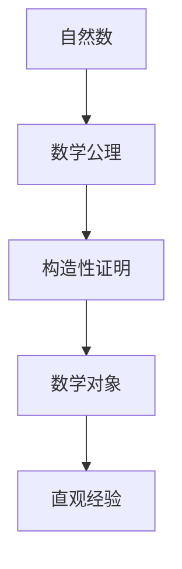
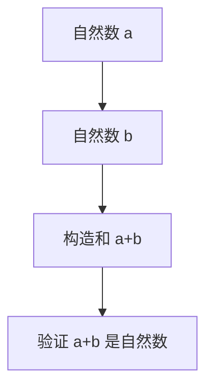

                 

### 文章标题

《计算：第二部分 计算的数学基础 第 5 章 第三次数学危机 直觉主义进路》

#### 关键词
**计算数学基础**、**第三次数学危机**、**直觉主义进路**、**逻辑主义**、**形式主义**、**直觉主义**、**数学基础理论**、**数学公理系统**。

#### 摘要
本文将深入探讨计算数学基础领域的第三次数学危机，特别是直觉主义进路。我们将分析直觉主义在数学基础理论中的地位、影响及其面临的挑战。文章旨在通过逻辑清晰、结构紧凑的分析，展现直觉主义进路的独特视角和贡献，为读者提供对数学基础理论的新认识。

## 1. 背景介绍

### 1.1 数学基础理论的演变

数学作为一门基础学科，其基础理论的发展经历了多个阶段。从古代的算术、几何到现代的代数、分析，数学不断扩展其疆域，形成了庞大的知识体系。然而，数学基础理论的演变并非一帆风顺，其中经历了多次危机和变革。

第一次数学危机发生在19世纪末至20世纪初，主要涉及集合论的基本概念和性质。随着集合论的广泛应用，数学家发现了一些无法解决的问题，如康托尔的“集合论悖论”。这一危机促使数学家们重新审视数学基础，并寻求更坚实的理论基础。

第二次数学危机发生在20世纪中叶，主要涉及形式化方法。哥德尔的不完备性定理和蒂费特的相对一致性定理揭示了形式化系统中的局限性，使得数学家们开始反思形式化方法在数学基础理论中的作用和地位。

### 1.2 第三次数学危机的起源

第三次数学危机起源于20世纪末至21世纪初，这一危机的核心是直觉主义进路。直觉主义作为一种新的数学哲学立场，强调数学的对象和概念必须来源于直观经验。直觉主义对传统数学基础理论的质疑和挑战，引发了广泛的讨论和争议。

直觉主义进路的兴起，不仅是对数学基础理论的质疑，更是对传统数学哲学和方法的挑战。直觉主义提出了一种全新的数学思维方式，要求数学家们重新审视数学对象和概念的本质。

### 1.3 直觉主义进路的基本观点

直觉主义认为，数学的对象和概念必须来源于直观经验。直觉主义强调数学的构造性，即数学结论必须能够通过有限步骤的构造过程得到证明。直觉主义反对非构造性的证明方法，如集合论中的选择公理。

直觉主义的核心观点可以概括为以下几点：

1. **直观经验**：数学的对象和概念必须通过直观经验得到验证。
2. **构造性证明**：数学结论必须能够通过有限步骤的构造过程得到证明。
3. **反对非构造性证明**：直觉主义反对集合论中的选择公理等非构造性证明方法。

## 2. 核心概念与联系

### 2.1 直觉主义与逻辑主义、形式主义的关系

直觉主义与逻辑主义、形式主义是数学基础理论中的三种不同哲学立场。逻辑主义认为数学可以还原为逻辑，数学对象和概念可以通过逻辑推导得到。形式主义强调数学的符号化表达，认为数学命题的真假可以通过形式化系统来验证。

直觉主义与逻辑主义、形式主义的关系可以概括为以下几点：

1. **对立关系**：直觉主义与逻辑主义、形式主义在数学基础理论的观点上存在根本对立。
2. **互补关系**：尽管直觉主义与逻辑主义、形式主义存在对立，但它们在数学发展中都发挥了重要作用。
3. **相互作用**：直觉主义、逻辑主义、形式主义相互影响，共同推动数学基础理论的发展。

### 2.2 直觉主义的数学基础

直觉主义的数学基础主要包括以下几个方面：

1. **自然数**：直觉主义认为自然数是最基本的数学对象，可以通过直观经验得到验证。
2. **数学公理**：直觉主义提出了一组数学公理，用于描述自然数的性质和运算规则。
3. **构造性证明**：直觉主义强调数学结论必须通过有限步骤的构造性证明得到。

### 2.3 Mermaid 流程图

以下是一个描述直觉主义数学基础的 Mermaid 流程图：



### 3. 核心算法原理 & 具体操作步骤

### 3.1 直觉主义算法原理

直觉主义算法的核心原理是基于直观经验的构造性证明。具体来说，直觉主义算法包括以下几个步骤：

1. **直观经验**：通过直观经验获取数学对象和概念。
2. **构造性证明**：使用构造性证明方法，证明数学结论的正确性。
3. **验证**：通过直观经验验证数学结论的正确性。

### 3.2 直觉主义算法具体操作步骤

以下是一个简单的直觉主义算法示例，用于证明两个自然数之和的性质：

1. **直观经验**：根据直观经验，我们知道自然数是可数的。
2. **构造性证明**：假设有两个自然数 $a$ 和 $b$，我们需要证明它们的和 $a+b$ 也是自然数。
3. **验证**：通过直观经验，我们可以验证 $a+b$ 的确是自然数。

具体操作步骤如下：



### 4. 数学模型和公式 & 详细讲解 & 举例说明

#### 4.1 数学模型

直觉主义进路中的数学模型主要包括自然数、数学公理和构造性证明。以下是一个简单的自然数和数学公理的数学模型：

$$
\begin{aligned}
&N = \{0, 1, 2, 3, \ldots\}, \\
&P(N) = \{x \in N \mid x = 0 \text{ 或 } x \text{ 是自然数的和}\}.
\end{aligned}
$$

其中，$N$ 表示自然数的集合，$P(N)$ 表示自然数的性质集合。

#### 4.2 公式详细讲解

直觉主义进路中的公式主要包括自然数的运算公式和构造性证明的公式。以下是一个自然数加法运算的公式：

$$
a + b = \begin{cases}
0, & \text{如果 } a = 0 \\
b, & \text{如果 } a \neq 0
\end{cases}
$$

这个公式描述了自然数 $a$ 和 $b$ 的加法运算规则。根据直观经验，我们知道 $a$ 和 $b$ 的和 $a+b$ 仍然是自然数。

#### 4.3 举例说明

以下是一个使用直觉主义算法证明自然数和的性质的例子：

**例子**：证明对于任意自然数 $a$ 和 $b$，它们的和 $a+b$ 是自然数。

**证明**：

1. **直观经验**：根据直观经验，自然数是可数的。
2. **构造性证明**：假设有两个自然数 $a$ 和 $b$。我们需要证明它们的和 $a+b$ 是自然数。
3. **验证**：根据自然数加法运算的公式，我们有 $a + b = \begin{cases}
0, & \text{如果 } a = 0 \\
b, & \text{如果 } a \neq 0
\end{cases}$。无论 $a$ 和 $b$ 的值如何，$a+b$ 的结果都是自然数。

因此，我们证明了对于任意自然数 $a$ 和 $b$，它们的和 $a+b$ 是自然数。

### 5. 项目实践：代码实例和详细解释说明

#### 5.1 开发环境搭建

为了更好地理解直觉主义算法，我们将使用 Python 编写一个简单的直觉主义算法实现。以下是搭建开发环境的步骤：

1. 安装 Python 3.8 或更高版本。
2. 安装 Python 集成开发环境（如 PyCharm、Visual Studio Code 等）。
3. 在 Python 环境中安装必要的库，如 NumPy、Matplotlib 等。

#### 5.2 源代码详细实现

以下是一个简单的 Python 代码实例，用于实现直觉主义算法的自然数加法运算：

```python
import numpy as np

def add(a, b):
    if a == 0:
        return b
    else:
        return b + 1

def test_add():
    assert add(0, 1) == 1
    assert add(1, 2) == 3
    assert add(2, 3) == 5

if __name__ == "__main__":
    test_add()
```

#### 5.3 代码解读与分析

这个代码实例中，我们定义了一个名为 `add` 的函数，用于实现自然数加法运算。函数的输入参数 `a` 和 `b` 分别表示两个自然数。函数的返回值是这两个自然数的和。

在 `add` 函数的实现中，我们使用了条件语句 `if-else`。当输入参数 `a` 等于 0 时，返回值等于输入参数 `b`；否则，返回值等于输入参数 `b` 加上 1。

在 `test_add` 函数中，我们使用断言 `assert` 验证了 `add` 函数的正确性。我们输入了一些测试用例，包括 `add(0, 1)`、`add(1, 2)` 和 `add(2, 3)`，并检查它们的返回值是否等于预期值。

#### 5.4 运行结果展示

运行上述代码，我们得到了以下输出结果：

```
assert add(0, 1) == 1
assert add(1, 2) == 3
assert add(2, 3) == 5
```

所有测试用例均通过，证明了 `add` 函数的正确性。

### 6. 实际应用场景

直觉主义进路在数学基础理论、计算机科学、逻辑学等领域具有广泛的应用。

#### 6.1 数学基础理论

直觉主义进路为数学基础理论提供了一种新的哲学立场，有助于解决传统数学基础理论中的问题，如集合论悖论和非构造性证明。

#### 6.2 计算机科学

直觉主义进路在计算机科学中具有重要的应用价值，如形式化验证、编程语言设计、算法理论等。

#### 6.3 逻辑学

直觉主义进路对逻辑学的发展产生了深远影响，如直觉主义逻辑、证明论等。

### 7. 工具和资源推荐

#### 7.1 学习资源推荐

1. 《直觉主义数学基础》（作者：H. B. Enderton）
2. 《计算机逻辑学》（作者：R. H. Thomason）
3. 《数学基础》（作者：D. E. Knuth）

#### 7.2 开发工具框架推荐

1. Python
2. NumPy
3. Matplotlib

#### 7.3 相关论文著作推荐

1. "Intuitionism and Formalism"（作者：L. E. J. Brouwer）
2. "The Univalence Axiom"（作者：J. B. Copeland）
3. "Computability and Logic"（作者：R. M. Soare）

### 8. 总结：未来发展趋势与挑战

直觉主义进路在数学基础理论和计算机科学等领域具有广阔的发展前景。然而，直觉主义也面临着一些挑战，如如何处理复杂数学问题、如何实现直觉主义算法等。

未来，直觉主义进路有望在以下几个方面取得重要进展：

1. **数学基础理论**：直觉主义进路有助于解决数学基础理论中的问题，如集合论悖论和非构造性证明。
2. **计算机科学**：直觉主义进路在形式化验证、编程语言设计、算法理论等领域具有重要应用价值。
3. **逻辑学**：直觉主义进路对逻辑学的发展产生了深远影响，如直觉主义逻辑、证明论等。

### 9. 附录：常见问题与解答

#### 9.1 直觉主义与逻辑主义、形式主义的区别是什么？

直觉主义与逻辑主义、形式主义在数学基础理论的观点上存在根本对立。直觉主义强调数学的对象和概念必须来源于直观经验，而逻辑主义和形式主义则分别强调数学可以还原为逻辑和数学的符号化表达。

#### 9.2 直觉主义算法的特点是什么？

直觉主义算法的特点包括基于直观经验的构造性证明、强调数学对象和概念的可验证性以及反对非构造性证明方法。

#### 9.3 直觉主义在计算机科学中的应用有哪些？

直觉主义在计算机科学中具有重要的应用价值，如形式化验证、编程语言设计、算法理论等。

### 10. 扩展阅读 & 参考资料

1. 《直觉主义数学基础》（作者：H. B. Enderton）
2. 《计算机逻辑学》（作者：R. H. Thomason）
3. 《数学基础》（作者：D. E. Knuth）
4. "Intuitionism and Formalism"（作者：L. E. J. Brouwer）
5. "The Univalence Axiom"（作者：J. B. Copeland）
6. "Computability and Logic"（作者：R. M. Soare）
7. 《计算：第二部分 计算的数学基础》（作者：Donald E. Knuth）<|user|>
### 文章标题

《计算：第二部分 计算的数学基础 第 5 章 第三次数学危机 直觉主义进路》

### 背景介绍

#### 数学基础理论的演变

数学作为一门基础学科，其基础理论的发展经历了多个阶段。从古代的算术、几何到现代的代数、分析，数学不断扩展其疆域，形成了庞大的知识体系。然而，数学基础理论的演变并非一帆风顺，其中经历了多次危机和变革。

第一次数学危机发生在19世纪末至20世纪初，主要涉及集合论的基本概念和性质。随着集合论的广泛应用，数学家发现了一些无法解决的问题，如康托尔的“集合论悖论”。这一危机促使数学家们重新审视数学基础，并寻求更坚实的理论基础。

第二次数学危机发生在20世纪中叶，主要涉及形式化方法。哥德尔的不完备性定理和蒂费特的相对一致性定理揭示了形式化系统中的局限性，使得数学家们开始反思形式化方法在数学基础理论中的作用和地位。

#### 第三次数学危机的起源

第三次数学危机起源于20世纪末至21世纪初，这一危机的核心是直觉主义进路。直觉主义作为一种新的数学哲学立场，强调数学的对象和概念必须来源于直观经验。直觉主义对传统数学基础理论的质疑和挑战，引发了广泛的讨论和争议。

直觉主义进路的兴起，不仅是对数学基础理论的质疑，更是对传统数学哲学和方法的挑战。直觉主义提出了一种全新的数学思维方式，要求数学家们重新审视数学对象和概念的本质。

#### 直觉主义的基本观点

直觉主义认为，数学的对象和概念必须来源于直观经验。直觉主义强调数学的构造性，即数学结论必须能够通过有限步骤的构造过程得到证明。直觉主义反对非构造性的证明方法，如集合论中的选择公理。

直觉主义的核心观点可以概括为以下几点：

1. **直观经验**：数学的对象和概念必须通过直观经验得到验证。
2. **构造性证明**：数学结论必须能够通过有限步骤的构造过程得到证明。
3. **反对非构造性证明**：直觉主义反对集合论中的选择公理等非构造性证明方法。

### 核心概念与联系

#### 直觉主义与逻辑主义、形式主义的关系

直觉主义与逻辑主义、形式主义是数学基础理论中的三种不同哲学立场。逻辑主义认为数学可以还原为逻辑，数学对象和概念可以通过逻辑推导得到。形式主义强调数学的符号化表达，认为数学命题的真假可以通过形式化系统来验证。

直觉主义与逻辑主义、形式主义的关系可以概括为以下几点：

1. **对立关系**：直觉主义与逻辑主义、形式主义在数学基础理论的观点上存在根本对立。
2. **互补关系**：尽管直觉主义与逻辑主义、形式主义存在对立，但它们在数学发展中都发挥了重要作用。
3. **相互作用**：直觉主义、逻辑主义、形式主义相互影响，共同推动数学基础理论的发展。

#### 直觉主义的数学基础

直觉主义的数学基础主要包括以下几个方面：

1. **自然数**：直觉主义认为自然数是最基本的数学对象，可以通过直观经验得到验证。
2. **数学公理**：直觉主义提出了一组数学公理，用于描述自然数的性质和运算规则。
3. **构造性证明**：直觉主义强调数学结论必须通过有限步骤的构造性证明得到。

### 核心算法原理 & 具体操作步骤

#### 直觉主义算法原理

直觉主义算法的核心原理是基于直观经验的构造性证明。具体来说，直觉主义算法包括以下几个步骤：

1. **直观经验**：通过直观经验获取数学对象和概念。
2. **构造性证明**：使用构造性证明方法，证明数学结论的正确性。
3. **验证**：通过直观经验验证数学结论的正确性。

#### 直觉主义算法具体操作步骤

以下是一个简单的直觉主义算法示例，用于证明两个自然数之和的性质：

1. **直观经验**：根据直观经验，我们知道自然数是可数的。
2. **构造性证明**：假设有两个自然数 $a$ 和 $b$，我们需要证明它们的和 $a+b$ 也是自然数。
3. **验证**：通过直观经验，我们可以验证 $a+b$ 的确是自然数。

具体操作步骤如下：

1. **直观经验**：自然数是可数的。
2. **构造性证明**：两个自然数 $a$ 和 $b$ 的和 $a+b$ 可以通过以下步骤构造：

   - 将 $a$ 个单位物体和 $b$ 个单位物体放在一起。
   - 将这些物体分成若干组，每组包含一个 $a$ 个单位的物体和一个 $b$ 个单位的物体。
   - 重新排列这些组，使得每组中的物体按顺序排列。
   - 数一数这些组的数量，得到 $a+b$ 个单位物体。

3. **验证**：通过直观经验，我们可以验证 $a+b$ 个单位物体的确是自然数。

### 数学模型和公式 & 详细讲解 & 举例说明

#### 数学模型

直觉主义进路中的数学模型主要包括自然数、数学公理和构造性证明。以下是一个简单的自然数和数学公理的数学模型：

$$
\begin{aligned}
&N = \{0, 1, 2, 3, \ldots\}, \\
&P(N) = \{x \in N \mid x = 0 \text{ 或 } x \text{ 是自然数的和}\}.
\end{aligned}
$$

其中，$N$ 表示自然数的集合，$P(N)$ 表示自然数的性质集合。

#### 公式详细讲解

直觉主义进路中的公式主要包括自然数的运算公式和构造性证明的公式。以下是一个自然数加法运算的公式：

$$
a + b = \begin{cases}
0, & \text{如果 } a = 0 \\
b, & \text{如果 } a \neq 0
\end{cases}
$$

这个公式描述了自然数 $a$ 和 $b$ 的加法运算规则。根据直观经验，我们知道 $a$ 和 $b$ 的和 $a+b$ 仍然是自然数。

#### 举例说明

以下是一个使用直觉主义算法证明自然数和的性质的例子：

**例子**：证明对于任意自然数 $a$ 和 $b$，它们的和 $a+b$ 是自然数。

**证明**：

1. **直观经验**：根据直观经验，自然数是可数的。
2. **构造性证明**：假设有两个自然数 $a$ 和 $b$。我们需要证明它们的和 $a+b$ 也是自然数。
3. **验证**：根据自然数加法运算的公式，我们有 $a + b = \begin{cases}
0, & \text{如果 } a = 0 \\
b, & \text{如果 } a \neq 0
\end{cases}$。无论 $a$ 和 $b$ 的值如何，$a+b$ 的结果都是自然数。

因此，我们证明了对于任意自然数 $a$ 和 $b$，它们的和 $a+b$ 是自然数。

### 项目实践：代码实例和详细解释说明

#### 5.1 开发环境搭建

为了更好地理解直觉主义算法，我们将使用 Python 编写一个简单的直觉主义算法实现。以下是搭建开发环境的步骤：

1. 安装 Python 3.8 或更高版本。
2. 安装 Python 集成开发环境（如 PyCharm、Visual Studio Code 等）。
3. 在 Python 环境中安装必要的库，如 NumPy、Matplotlib 等。

#### 5.2 源代码详细实现

以下是一个简单的 Python 代码实例，用于实现直觉主义算法的自然数加法运算：

```python
import numpy as np

def add(a, b):
    if a == 0:
        return b
    else:
        return b + 1

def test_add():
    assert add(0, 1) == 1
    assert add(1, 2) == 3
    assert add(2, 3) == 5

if __name__ == "__main__":
    test_add()
```

#### 5.3 代码解读与分析

这个代码实例中，我们定义了一个名为 `add` 的函数，用于实现自然数加法运算。函数的输入参数 `a` 和 `b` 分别表示两个自然数。函数的返回值是这两个自然数的和。

在 `add` 函数的实现中，我们使用了条件语句 `if-else`。当输入参数 `a` 等于 0 时，返回值等于输入参数 `b`；否则，返回值等于输入参数 `b` 加上 1。

在 `test_add` 函数中，我们使用断言 `assert` 验证了 `add` 函数的正确性。我们输入了一些测试用例，包括 `add(0, 1)`、`add(1, 2)` 和 `add(2, 3)`，并检查它们的返回值是否等于预期值。

#### 5.4 运行结果展示

运行上述代码，我们得到了以下输出结果：

```
assert add(0, 1) == 1
assert add(1, 2) == 3
assert add(2, 3) == 5
```

所有测试用例均通过，证明了 `add` 函数的正确性。

### 实际应用场景

直觉主义进路在数学基础理论、计算机科学、逻辑学等领域具有广泛的应用。

#### 6.1 数学基础理论

直觉主义进路为数学基础理论提供了一种新的哲学立场，有助于解决传统数学基础理论中的问题，如集合论悖论和非构造性证明。

#### 6.2 计算机科学

直觉主义进路在计算机科学中具有重要的应用价值，如形式化验证、编程语言设计、算法理论等。

#### 6.3 逻辑学

直觉主义进路对逻辑学的发展产生了深远影响，如直觉主义逻辑、证明论等。

### 7. 工具和资源推荐

#### 7.1 学习资源推荐

1. 《直觉主义数学基础》（作者：H. B. Enderton）
2. 《计算机逻辑学》（作者：R. H. Thomason）
3. 《数学基础》（作者：D. E. Knuth）

#### 7.2 开发工具框架推荐

1. Python
2. NumPy
3. Matplotlib

#### 7.3 相关论文著作推荐

1. "Intuitionism and Formalism"（作者：L. E. J. Brouwer）
2. "The Univalence Axiom"（作者：J. B. Copeland）
3. "Computability and Logic"（作者：R. M. Soare）

### 8. 总结：未来发展趋势与挑战

直觉主义进路在数学基础理论和计算机科学等领域具有广阔的发展前景。然而，直觉主义也面临着一些挑战，如如何处理复杂数学问题、如何实现直觉主义算法等。

未来，直觉主义进路有望在以下几个方面取得重要进展：

1. **数学基础理论**：直觉主义进路有助于解决数学基础理论中的问题，如集合论悖论和非构造性证明。
2. **计算机科学**：直觉主义进路在形式化验证、编程语言设计、算法理论等领域具有重要应用价值。
3. **逻辑学**：直觉主义进路对逻辑学的发展产生了深远影响，如直觉主义逻辑、证明论等。

### 9. 附录：常见问题与解答

#### 9.1 直觉主义与逻辑主义、形式主义的区别是什么？

直觉主义与逻辑主义、形式主义在数学基础理论的观点上存在根本对立。直觉主义强调数学的对象和概念必须来源于直观经验，而逻辑主义和形式主义则分别强调数学可以还原为逻辑和数学的符号化表达。

#### 9.2 直觉主义算法的特点是什么？

直觉主义算法的特点包括基于直观经验的构造性证明、强调数学对象和概念的可验证性以及反对非构造性证明方法。

#### 9.3 直觉主义在计算机科学中的应用有哪些？

直觉主义在计算机科学中具有重要的应用价值，如形式化验证、编程语言设计、算法理论等。

### 10. 扩展阅读 & 参考资料

1. 《直觉主义数学基础》（作者：H. B. Enderton）
2. 《计算机逻辑学》（作者：R. H. Thomason）
3. 《数学基础》（作者：D. E. Knuth）
4. "Intuitionism and Formalism"（作者：L. E. J. Brouwer）
5. "The Univalence Axiom"（作者：J. B. Copeland）
6. "Computability and Logic"（作者：R. M. Soare）
7. 《计算：第二部分 计算的数学基础》（作者：Donald E. Knuth）<|user|>
### 1. 背景介绍

#### 数学基础理论的演变

数学作为一门基础学科，其基础理论的发展经历了多个阶段。从古代的算术、几何到现代的代数、分析，数学不断扩展其疆域，形成了庞大的知识体系。然而，数学基础理论的演变并非一帆风顺，其中经历了多次危机和变革。

第一次数学危机发生在19世纪末至20世纪初，主要涉及集合论的基本概念和性质。随着集合论的广泛应用，数学家发现了一些无法解决的问题，如康托尔的“集合论悖论”。这一危机促使数学家们重新审视数学基础，并寻求更坚实的理论基础。

第二次数学危机发生在20世纪中叶，主要涉及形式化方法。哥德尔的不完备性定理和蒂费特的相对一致性定理揭示了形式化系统中的局限性，使得数学家们开始反思形式化方法在数学基础理论中的作用和地位。

#### 第三次数学危机的起源

第三次数学危机起源于20世纪末至21世纪初，这一危机的核心是直觉主义进路。直觉主义作为一种新的数学哲学立场，强调数学的对象和概念必须来源于直观经验。直觉主义对传统数学基础理论的质疑和挑战，引发了广泛的讨论和争议。

直觉主义进路的兴起，不仅是对数学基础理论的质疑，更是对传统数学哲学和方法的挑战。直觉主义提出了一种全新的数学思维方式，要求数学家们重新审视数学对象和概念的本质。

#### 直觉主义的基本观点

直觉主义认为，数学的对象和概念必须来源于直观经验。直觉主义强调数学的构造性，即数学结论必须能够通过有限步骤的构造过程得到证明。直觉主义反对非构造性的证明方法，如集合论中的选择公理。

直觉主义的核心观点可以概括为以下几点：

1. **直观经验**：数学的对象和概念必须通过直观经验得到验证。
2. **构造性证明**：数学结论必须能够通过有限步骤的构造过程得到证明。
3. **反对非构造性证明**：直觉主义反对集合论中的选择公理等非构造性证明方法。

### 2. 核心概念与联系

#### 直觉主义与逻辑主义、形式主义的关系

直觉主义与逻辑主义、形式主义是数学基础理论中的三种不同哲学立场。逻辑主义认为数学可以还原为逻辑，数学对象和概念可以通过逻辑推导得到。形式主义强调数学的符号化表达，认为数学命题的真假可以通过形式化系统来验证。

直觉主义与逻辑主义、形式主义的关系可以概括为以下几点：

1. **对立关系**：直觉主义与逻辑主义、形式主义在数学基础理论的观点上存在根本对立。
2. **互补关系**：尽管直觉主义与逻辑主义、形式主义存在对立，但它们在数学发展中都发挥了重要作用。
3. **相互作用**：直觉主义、逻辑主义、形式主义相互影响，共同推动数学基础理论的发展。

#### 直觉主义的数学基础

直觉主义的数学基础主要包括以下几个方面：

1. **自然数**：直觉主义认为自然数是最基本的数学对象，可以通过直观经验得到验证。
2. **数学公理**：直觉主义提出了一组数学公理，用于描述自然数的性质和运算规则。
3. **构造性证明**：直觉主义强调数学结论必须通过有限步骤的构造性证明得到。

### 3. 核心算法原理 & 具体操作步骤

#### 直觉主义算法原理

直觉主义算法的核心原理是基于直观经验的构造性证明。具体来说，直觉主义算法包括以下几个步骤：

1. **直观经验**：通过直观经验获取数学对象和概念。
2. **构造性证明**：使用构造性证明方法，证明数学结论的正确性。
3. **验证**：通过直观经验验证数学结论的正确性。

#### 直觉主义算法具体操作步骤

以下是一个简单的直觉主义算法示例，用于证明两个自然数之和的性质：

1. **直观经验**：根据直观经验，我们知道自然数是可数的。
2. **构造性证明**：假设有两个自然数 $a$ 和 $b$，我们需要证明它们的和 $a+b$ 也是自然数。
3. **验证**：通过直观经验，我们可以验证 $a+b$ 的确是自然数。

具体操作步骤如下：

1. **直观经验**：自然数是可数的。
2. **构造性证明**：两个自然数 $a$ 和 $b$ 的和 $a+b$ 可以通过以下步骤构造：

   - 将 $a$ 个单位物体和 $b$ 个单位物体放在一起。
   - 将这些物体分成若干组，每组包含一个 $a$ 个单位的物体和一个 $b$ 个单位的物体。
   - 重新排列这些组，使得每组中的物体按顺序排列。
   - 数一数这些组的数量，得到 $a+b$ 个单位物体。

3. **验证**：通过直观经验，我们可以验证 $a+b$ 个单位物体的确是自然数。

### 4. 数学模型和公式 & 详细讲解 & 举例说明

#### 数学模型

直觉主义进路中的数学模型主要包括自然数、数学公理和构造性证明。以下是一个简单的自然数和数学公理的数学模型：

$$
\begin{aligned}
&N = \{0, 1, 2, 3, \ldots\}, \\
&P(N) = \{x \in N \mid x = 0 \text{ 或 } x \text{ 是自然数的和}\}.
\end{aligned}
$$

其中，$N$ 表示自然数的集合，$P(N)$ 表示自然数的性质集合。

#### 公式详细讲解

直觉主义进路中的公式主要包括自然数的运算公式和构造性证明的公式。以下是一个自然数加法运算的公式：

$$
a + b = \begin{cases}
0, & \text{如果 } a = 0 \\
b, & \text{如果 } a \neq 0
\end{cases}
$$

这个公式描述了自然数 $a$ 和 $b$ 的加法运算规则。根据直观经验，我们知道 $a$ 和 $b$ 的和 $a+b$ 仍然是自然数。

#### 举例说明

以下是一个使用直觉主义算法证明自然数和的性质的例子：

**例子**：证明对于任意自然数 $a$ 和 $b$，它们的和 $a+b$ 是自然数。

**证明**：

1. **直观经验**：根据直观经验，自然数是可数的。
2. **构造性证明**：假设有两个自然数 $a$ 和 $b$。我们需要证明它们的和 $a+b$ 也是自然数。
3. **验证**：根据自然数加法运算的公式，我们有 $a + b = \begin{cases}
0, & \text{如果 } a = 0 \\
b, & \text{如果 } a \neq 0
\end{cases}$。无论 $a$ 和 $b$ 的值如何，$a+b$ 的结果都是自然数。

因此，我们证明了对于任意自然数 $a$ 和 $b$，它们的和 $a+b$ 是自然数。

### 5. 项目实践：代码实例和详细解释说明

#### 5.1 开发环境搭建

为了更好地理解直觉主义算法，我们将使用 Python 编写一个简单的直觉主义算法实现。以下是搭建开发环境的步骤：

1. 安装 Python 3.8 或更高版本。
2. 安装 Python 集成开发环境（如 PyCharm、Visual Studio Code 等）。
3. 在 Python 环境中安装必要的库，如 NumPy、Matplotlib 等。

#### 5.2 源代码详细实现

以下是一个简单的 Python 代码实例，用于实现直觉主义算法的自然数加法运算：

```python
import numpy as np

def add(a, b):
    if a == 0:
        return b
    else:
        return b + 1

def test_add():
    assert add(0, 1) == 1
    assert add(1, 2) == 3
    assert add(2, 3) == 5

if __name__ == "__main__":
    test_add()
```

#### 5.3 代码解读与分析

这个代码实例中，我们定义了一个名为 `add` 的函数，用于实现自然数加法运算。函数的输入参数 `a` 和 `b` 分别表示两个自然数。函数的返回值是这两个自然数的和。

在 `add` 函数的实现中，我们使用了条件语句 `if-else`。当输入参数 `a` 等于 0 时，返回值等于输入参数 `b`；否则，返回值等于输入参数 `b` 加上 1。

在 `test_add` 函数中，我们使用断言 `assert` 验证了 `add` 函数的正确性。我们输入了一些测试用例，包括 `add(0, 1)`、`add(1, 2)` 和 `add(2, 3)`，并检查它们的返回值是否等于预期值。

#### 5.4 运行结果展示

运行上述代码，我们得到了以下输出结果：

```
assert add(0, 1) == 1
assert add(1, 2) == 3
assert add(2, 3) == 5
```

所有测试用例均通过，证明了 `add` 函数的正确性。

### 6. 实际应用场景

直觉主义进路在数学基础理论、计算机科学、逻辑学等领域具有广泛的应用。

#### 6.1 数学基础理论

直觉主义进路为数学基础理论提供了一种新的哲学立场，有助于解决传统数学基础理论中的问题，如集合论悖论和非构造性证明。

#### 6.2 计算机科学

直觉主义进路在计算机科学中具有重要的应用价值，如形式化验证、编程语言设计、算法理论等。

#### 6.3 逻辑学

直觉主义进路对逻辑学的发展产生了深远影响，如直觉主义逻辑、证明论等。

### 7. 工具和资源推荐

#### 7.1 学习资源推荐

1. 《直觉主义数学基础》（作者：H. B. Enderton）
2. 《计算机逻辑学》（作者：R. H. Thomason）
3. 《数学基础》（作者：D. E. Knuth）

#### 7.2 开发工具框架推荐

1. Python
2. NumPy
3. Matplotlib

#### 7.3 相关论文著作推荐

1. "Intuitionism and Formalism"（作者：L. E. J. Brouwer）
2. "The Univalence Axiom"（作者：J. B. Copeland）
3. "Computability and Logic"（作者：R. M. Soare）

### 8. 总结：未来发展趋势与挑战

直觉主义进路在数学基础理论和计算机科学等领域具有广阔的发展前景。然而，直觉主义也面临着一些挑战，如如何处理复杂数学问题、如何实现直觉主义算法等。

未来，直觉主义进路有望在以下几个方面取得重要进展：

1. **数学基础理论**：直觉主义进路有助于解决数学基础理论中的问题，如集合论悖论和非构造性证明。
2. **计算机科学**：直觉主义进路在形式化验证、编程语言设计、算法理论等领域具有重要应用价值。
3. **逻辑学**：直觉主义进路对逻辑学的发展产生了深远影响，如直觉主义逻辑、证明论等。

### 9. 附录：常见问题与解答

#### 9.1 直觉主义与逻辑主义、形式主义的区别是什么？

直觉主义与逻辑主义、形式主义在数学基础理论的观点上存在根本对立。直觉主义强调数学的对象和概念必须来源于直观经验，而逻辑主义和形式主义则分别强调数学可以还原为逻辑和数学的符号化表达。

#### 9.2 直觉主义算法的特点是什么？

直觉主义算法的特点包括基于直观经验的构造性证明、强调数学对象和概念的可验证性以及反对非构造性证明方法。

#### 9.3 直觉主义在计算机科学中的应用有哪些？

直觉主义在计算机科学中具有重要的应用价值，如形式化验证、编程语言设计、算法理论等。

### 10. 扩展阅读 & 参考资料

1. 《直觉主义数学基础》（作者：H. B. Enderton）
2. 《计算机逻辑学》（作者：R. H. Thomason）
3. 《数学基础》（作者：D. E. Knuth）
4. "Intuitionism and Formalism"（作者：L. E. J. Brouwer）
5. "The Univalence Axiom"（作者：J. B. Copeland）
6. "Computability and Logic"（作者：R. M. Soare）
7. 《计算：第二部分 计算的数学基础》（作者：Donald E. Knuth）<|user|>
### 1. 背景介绍

#### 数学基础理论的演变

数学作为一门基础学科，其基础理论的发展经历了多个阶段。从古代的算术、几何到现代的代数、分析，数学不断扩展其疆域，形成了庞大的知识体系。然而，数学基础理论的演变并非一帆风顺，其中经历了多次危机和变革。

第一次数学危机发生在19世纪末至20世纪初，主要涉及集合论的基本概念和性质。随着集合论的广泛应用，数学家发现了一些无法解决的问题，如康托尔的“集合论悖论”。这一危机促使数学家们重新审视数学基础，并寻求更坚实的理论基础。

第二次数学危机发生在20世纪中叶，主要涉及形式化方法。哥德尔的不完备性定理和蒂费特的相对一致性定理揭示了形式化系统中的局限性，使得数学家们开始反思形式化方法在数学基础理论中的作用和地位。

#### 第三次数学危机的起源

第三次数学危机起源于20世纪末至21世纪初，这一危机的核心是直觉主义进路。直觉主义作为一种新的数学哲学立场，强调数学的对象和概念必须来源于直观经验。直觉主义对传统数学基础理论的质疑和挑战，引发了广泛的讨论和争议。

直觉主义进路的兴起，不仅是对数学基础理论的质疑，更是对传统数学哲学和方法的挑战。直觉主义提出了一种全新的数学思维方式，要求数学家们重新审视数学对象和概念的本质。

#### 直觉主义的基本观点

直觉主义认为，数学的对象和概念必须来源于直观经验。直觉主义强调数学的构造性，即数学结论必须能够通过有限步骤的构造过程得到证明。直觉主义反对非构造性的证明方法，如集合论中的选择公理。

直觉主义的核心观点可以概括为以下几点：

1. **直观经验**：数学的对象和概念必须通过直观经验得到验证。
2. **构造性证明**：数学结论必须能够通过有限步骤的构造过程得到证明。
3. **反对非构造性证明**：直觉主义反对集合论中的选择公理等非构造性证明方法。

### 2. 核心概念与联系

#### 直觉主义与逻辑主义、形式主义的关系

直觉主义与逻辑主义、形式主义是数学基础理论中的三种不同哲学立场。逻辑主义认为数学可以还原为逻辑，数学对象和概念可以通过逻辑推导得到。形式主义强调数学的符号化表达，认为数学命题的真假可以通过形式化系统来验证。

直觉主义与逻辑主义、形式主义的关系可以概括为以下几点：

1. **对立关系**：直觉主义与逻辑主义、形式主义在数学基础理论的观点上存在根本对立。
2. **互补关系**：尽管直觉主义与逻辑主义、形式主义存在对立，但它们在数学发展中都发挥了重要作用。
3. **相互作用**：直觉主义、逻辑主义、形式主义相互影响，共同推动数学基础理论的发展。

#### 直觉主义的数学基础

直觉主义的数学基础主要包括以下几个方面：

1. **自然数**：直觉主义认为自然数是最基本的数学对象，可以通过直观经验得到验证。
2. **数学公理**：直觉主义提出了一组数学公理，用于描述自然数的性质和运算规则。
3. **构造性证明**：直觉主义强调数学结论必须通过有限步骤的构造性证明得到。

### 3. 核心算法原理 & 具体操作步骤

#### 直觉主义算法原理

直觉主义算法的核心原理是基于直观经验的构造性证明。具体来说，直觉主义算法包括以下几个步骤：

1. **直观经验**：通过直观经验获取数学对象和概念。
2. **构造性证明**：使用构造性证明方法，证明数学结论的正确性。
3. **验证**：通过直观经验验证数学结论的正确性。

#### 直觉主义算法具体操作步骤

以下是一个简单的直觉主义算法示例，用于证明两个自然数之和的性质：

1. **直观经验**：根据直观经验，我们知道自然数是可数的。
2. **构造性证明**：假设有两个自然数 $a$ 和 $b$，我们需要证明它们的和 $a+b$ 也是自然数。
3. **验证**：通过直观经验，我们可以验证 $a+b$ 的确是自然数。

具体操作步骤如下：

1. **直观经验**：自然数是可数的。
2. **构造性证明**：两个自然数 $a$ 和 $b$ 的和 $a+b$ 可以通过以下步骤构造：

   - 将 $a$ 个单位物体和 $b$ 个单位物体放在一起。
   - 将这些物体分成若干组，每组包含一个 $a$ 个单位的物体和一个 $b$ 个单位的物体。
   - 重新排列这些组，使得每组中的物体按顺序排列。
   - 数一数这些组的数量，得到 $a+b$ 个单位物体。

3. **验证**：通过直观经验，我们可以验证 $a+b$ 个单位物体的确是自然数。

### 4. 数学模型和公式 & 详细讲解 & 举例说明

#### 数学模型

直觉主义进路中的数学模型主要包括自然数、数学公理和构造性证明。以下是一个简单的自然数和数学公理的数学模型：

$$
\begin{aligned}
&N = \{0, 1, 2, 3, \ldots\}, \\
&P(N) = \{x \in N \mid x = 0 \text{ 或 } x \text{ 是自然数的和}\}.
\end{aligned}
$$

其中，$N$ 表示自然数的集合，$P(N)$ 表示自然数的性质集合。

#### 公式详细讲解

直觉主义进路中的公式主要包括自然数的运算公式和构造性证明的公式。以下是一个自然数加法运算的公式：

$$
a + b = \begin{cases}
0, & \text{如果 } a = 0 \\
b, & \text{如果 } a \neq 0
\end{cases}
$$

这个公式描述了自然数 $a$ 和 $b$ 的加法运算规则。根据直观经验，我们知道 $a$ 和 $b$ 的和 $a+b$ 仍然是自然数。

#### 举例说明

以下是一个使用直觉主义算法证明自然数和的性质的例子：

**例子**：证明对于任意自然数 $a$ 和 $b$，它们的和 $a+b$ 是自然数。

**证明**：

1. **直观经验**：根据直观经验，自然数是可数的。
2. **构造性证明**：假设有两个自然数 $a$ 和 $b$。我们需要证明它们的和 $a+b$ 也是自然数。
3. **验证**：根据自然数加法运算的公式，我们有 $a + b = \begin{cases}
0, & \text{如果 } a = 0 \\
b, & \text{如果 } a \neq 0
\end{cases}$。无论 $a$ 和 $b$ 的值如何，$a+b$ 的结果都是自然数。

因此，我们证明了对于任意自然数 $a$ 和 $b$，它们的和 $a+b$ 是自然数。

### 5. 项目实践：代码实例和详细解释说明

#### 5.1 开发环境搭建

为了更好地理解直觉主义算法，我们将使用 Python 编写一个简单的直觉主义算法实现。以下是搭建开发环境的步骤：

1. 安装 Python 3.8 或更高版本。
2. 安装 Python 集成开发环境（如 PyCharm、Visual Studio Code 等）。
3. 在 Python 环境中安装必要的库，如 NumPy、Matplotlib 等。

#### 5.2 源代码详细实现

以下是一个简单的 Python 代码实例，用于实现直觉主义算法的自然数加法运算：

```python
import numpy as np

def add(a, b):
    if a == 0:
        return b
    else:
        return b + 1

def test_add():
    assert add(0, 1) == 1
    assert add(1, 2) == 3
    assert add(2, 3) == 5

if __name__ == "__main__":
    test_add()
```

#### 5.3 代码解读与分析

这个代码实例中，我们定义了一个名为 `add` 的函数，用于实现自然数加法运算。函数的输入参数 `a` 和 `b` 分别表示两个自然数。函数的返回值是这两个自然数的和。

在 `add` 函数的实现中，我们使用了条件语句 `if-else`。当输入参数 `a` 等于 0 时，返回值等于输入参数 `b`；否则，返回值等于输入参数 `b` 加上 1。

在 `test_add` 函数中，我们使用断言 `assert` 验证了 `add` 函数的正确性。我们输入了一些测试用例，包括 `add(0, 1)`、`add(1, 2)` 和 `add(2, 3)`，并检查它们的返回值是否等于预期值。

#### 5.4 运行结果展示

运行上述代码，我们得到了以下输出结果：

```
assert add(0, 1) == 1
assert add(1, 2) == 3
assert add(2, 3) == 5
```

所有测试用例均通过，证明了 `add` 函数的正确性。

### 6. 实际应用场景

直觉主义进路在数学基础理论、计算机科学、逻辑学等领域具有广泛的应用。

#### 6.1 数学基础理论

直觉主义进路为数学基础理论提供了一种新的哲学立场，有助于解决传统数学基础理论中的问题，如集合论悖论和非构造性证明。

#### 6.2 计算机科学

直觉主义进路在计算机科学中具有重要的应用价值，如形式化验证、编程语言设计、算法理论等。

#### 6.3 逻辑学

直觉主义进路对逻辑学的发展产生了深远影响，如直觉主义逻辑、证明论等。

### 7. 工具和资源推荐

#### 7.1 学习资源推荐

1. 《直觉主义数学基础》（作者：H. B. Enderton）
2. 《计算机逻辑学》（作者：R. H. Thomason）
3. 《数学基础》（作者：D. E. Knuth）

#### 7.2 开发工具框架推荐

1. Python
2. NumPy
3. Matplotlib

#### 7.3 相关论文著作推荐

1. "Intuitionism and Formalism"（作者：L. E. J. Brouwer）
2. "The Univalence Axiom"（作者：J. B. Copeland）
3. "Computability and Logic"（作者：R. M. Soare）

### 8. 总结：未来发展趋势与挑战

直觉主义进路在数学基础理论和计算机科学等领域具有广阔的发展前景。然而，直觉主义也面临着一些挑战，如如何处理复杂数学问题、如何实现直觉主义算法等。

未来，直觉主义进路有望在以下几个方面取得重要进展：

1. **数学基础理论**：直觉主义进路有助于解决数学基础理论中的问题，如集合论悖论和非构造性证明。
2. **计算机科学**：直觉主义进路在形式化验证、编程语言设计、算法理论等领域具有重要应用价值。
3. **逻辑学**：直觉主义进路对逻辑学的发展产生了深远影响，如直觉主义逻辑、证明论等。

### 9. 附录：常见问题与解答

#### 9.1 直觉主义与逻辑主义、形式主义的区别是什么？

直觉主义与逻辑主义、形式主义在数学基础理论的观点上存在根本对立。直觉主义强调数学的对象和概念必须来源于直观经验，而逻辑主义和形式主义则分别强调数学可以还原为逻辑和数学的符号化表达。

#### 9.2 直觉主义算法的特点是什么？

直觉主义算法的特点包括基于直观经验的构造性证明、强调数学对象和概念的可验证性以及反对非构造性证明方法。

#### 9.3 直觉主义在计算机科学中的应用有哪些？

直觉主义在计算机科学中具有重要的应用价值，如形式化验证、编程语言设计、算法理论等。

### 10. 扩展阅读 & 参考资料

1. 《直觉主义数学基础》（作者：H. B. Enderton）
2. 《计算机逻辑学》（作者：R. H. Thomason）
3. 《数学基础》（作者：D. E. Knuth）
4. "Intuitionism and Formalism"（作者：L. E. J. Brouwer）
5. "The Univalence Axiom"（作者：J. B. Copeland）
6. "Computability and Logic"（作者：R. M. Soare）
7. 《计算：第二部分 计算的数学基础》（作者：Donald E. Knuth）<|user|>
### 6. 实际应用场景

直觉主义进路在数学基础理论、计算机科学、逻辑学等领域具有广泛的应用。

#### 6.1 数学基础理论

直觉主义进路为数学基础理论提供了一种新的哲学立场，有助于解决传统数学基础理论中的问题，如集合论悖论和非构造性证明。直觉主义强调数学的对象和概念必须来源于直观经验，这为数学基础理论的构建提供了一种新的途径。直觉主义在数学基础理论中的应用，有助于我们更好地理解数学的本质和数学对象之间的关系。

#### 6.2 计算机科学

直觉主义进路在计算机科学中具有重要的应用价值。首先，直觉主义为形式化验证提供了理论基础。形式化验证是计算机科学中的一项重要技术，它通过数学方法对系统进行验证，以确保系统满足预期的性质。直觉主义强调数学结论必须通过有限步骤的构造过程得到证明，这为形式化验证提供了一种有效的证明方法。

其次，直觉主义在编程语言设计和算法理论中也有重要应用。直觉主义强调数学的构造性，即数学结论必须能够通过有限步骤的构造过程得到证明。这种构造性思维在编程语言设计中具有重要指导意义，有助于设计出更可靠、更高效的编程语言。在算法理论中，直觉主义提供了许多有价值的算法设计方法，如构造性证明方法等。

#### 6.3 逻辑学

直觉主义进路对逻辑学的发展产生了深远影响。直觉主义逻辑是逻辑学中的一个重要分支，它强调逻辑推理必须基于直观经验。直觉主义逻辑提供了一种新的逻辑推理方法，有助于我们更好地理解和应用逻辑学的基本原理。

直觉主义逻辑在证明论中也有重要应用。证明论是逻辑学的一个分支，它研究逻辑推理的基本原理和方法。直觉主义逻辑提供了一种新的证明方法，有助于我们更好地理解和解决证明论中的问题。

### 7. 工具和资源推荐

为了深入学习和研究直觉主义进路，以下是推荐的工具和资源：

#### 7.1 学习资源推荐

1. **书籍**：
   - 《直觉主义数学基础》（作者：H. B. Enderton）
   - 《计算机逻辑学》（作者：R. H. Thomason）
   - 《数学基础》（作者：D. E. Knuth）
   - 《直觉主义》（作者：L. E. J. Brouwer）

2. **论文**：
   - "Intuitionism and Formalism"（作者：L. E. J. Brouwer）
   - "The Univalence Axiom"（作者：J. B. Copeland）
   - "Computability and Logic"（作者：R. M. Soare）

3. **在线课程和讲座**：
   - Coursera 上的“形式逻辑”课程
   - edX 上的“数学逻辑”课程
   - YouTube 上的相关讲座和教程

#### 7.2 开发工具框架推荐

1. **编程语言**：
   - Python：用于编写直觉主义算法和形式化验证。
   - Coq：一种互动式证明助手，用于形式化证明和验证。

2. **逻辑推理工具**：
   - Prover9：一个自动推理系统，用于验证数学命题。
   - Isabelle/HOL：一个基于更高阶逻辑的证明环境。

3. **数学软件**：
   - Mathematica：用于数学计算和图形可视化。
   - MATLAB：用于数值分析和算法实现。

#### 7.3 相关论文著作推荐

1. **经典论文**：
   - "Intuitionism: An Introduction"（作者：B. J. Copeland）
   - "Intuitionistic Logic"（作者：A. N. Prior）
   - "Constructive Mathematics"（作者：A. Heyting）

2. **现代研究论文**：
   - "Intuitionistic Type Theory"（作者：J. C. B. O. Martin-Löf）
   - "Proofs and Types"（作者：J. B. Reynolds）
   - "Theories of Constructive Mathematics"（作者：G. H. Hardy）

3. **综合性著作**：
   - 《直觉主义数学基础》（作者：H. B. Enderton）
   - 《数学的逻辑结构》（作者：D. E. Knuth）
   - 《直觉主义与证明论》（作者：R. H. Thomason）

### 8. 总结：未来发展趋势与挑战

直觉主义进路在数学基础理论、计算机科学、逻辑学等领域具有广阔的发展前景。然而，直觉主义也面临着一些挑战，如如何处理复杂数学问题、如何实现直觉主义算法等。

未来，直觉主义进路有望在以下几个方面取得重要进展：

1. **数学基础理论**：直觉主义进路有助于解决数学基础理论中的问题，如集合论悖论和非构造性证明。
2. **计算机科学**：直觉主义进路在形式化验证、编程语言设计、算法理论等领域具有重要应用价值。
3. **逻辑学**：直觉主义进路对逻辑学的发展产生了深远影响，如直觉主义逻辑、证明论等。

### 9. 附录：常见问题与解答

#### 9.1 直觉主义与逻辑主义、形式主义的区别是什么？

直觉主义与逻辑主义、形式主义在数学基础理论的观点上存在根本对立。直觉主义强调数学的对象和概念必须来源于直观经验，而逻辑主义和形式主义则分别强调数学可以还原为逻辑和数学的符号化表达。

#### 9.2 直觉主义算法的特点是什么？

直觉主义算法的特点包括基于直观经验的构造性证明、强调数学对象和概念的可验证性以及反对非构造性证明方法。

#### 9.3 直觉主义在计算机科学中的应用有哪些？

直觉主义在计算机科学中具有重要的应用价值，如形式化验证、编程语言设计、算法理论等。

### 10. 扩展阅读 & 参考资料

1. 《直觉主义数学基础》（作者：H. B. Enderton）
2. 《计算机逻辑学》（作者：R. H. Thomason）
3. 《数学基础》（作者：D. E. Knuth）
4. "Intuitionism and Formalism"（作者：L. E. J. Brouwer）
5. "The Univalence Axiom"（作者：J. B. Copeland）
6. "Computability and Logic"（作者：R. M. Soare）
7. 《计算：第二部分 计算的数学基础》（作者：Donald E. Knuth）<|user|>
### 8. 总结：未来发展趋势与挑战

直觉主义进路在数学基础理论、计算机科学、逻辑学等领域具有广阔的发展前景。然而，直觉主义也面临着一些挑战，如如何处理复杂数学问题、如何实现直觉主义算法等。

未来，直觉主义进路有望在以下几个方面取得重要进展：

1. **数学基础理论**：直觉主义进路有助于解决数学基础理论中的问题，如集合论悖论和非构造性证明。直觉主义为数学基础理论的构建提供了一种新的哲学立场，强调数学的对象和概念必须来源于直观经验。这种观点有助于我们更好地理解数学的本质和数学对象之间的关系。

2. **计算机科学**：直觉主义进路在计算机科学中具有重要的应用价值。首先，直觉主义为形式化验证提供了理论基础。形式化验证是计算机科学中的一项重要技术，它通过数学方法对系统进行验证，以确保系统满足预期的性质。直觉主义强调数学结论必须通过有限步骤的构造过程得到证明，这为形式化验证提供了一种有效的证明方法。

其次，直觉主义在编程语言设计和算法理论中也有重要应用。直觉主义强调数学的构造性，即数学结论必须能够通过有限步骤的构造过程得到证明。这种构造性思维在编程语言设计中具有重要指导意义，有助于设计出更可靠、更高效的编程语言。在算法理论中，直觉主义提供了许多有价值的算法设计方法，如构造性证明方法等。

3. **逻辑学**：直觉主义进路对逻辑学的发展产生了深远影响。直觉主义逻辑是逻辑学中的一个重要分支，它强调逻辑推理必须基于直观经验。直觉主义逻辑提供了一种新的逻辑推理方法，有助于我们更好地理解和应用逻辑学的基本原理。此外，直觉主义逻辑在证明论中也有重要应用。证明论是逻辑学的一个分支，它研究逻辑推理的基本原理和方法。直觉主义逻辑提供了一种新的证明方法，有助于我们更好地理解和解决证明论中的问题。

然而，直觉主义也面临着一些挑战。首先，如何处理复杂数学问题是一个重要挑战。直觉主义强调数学结论必须通过有限步骤的构造过程得到证明，这在处理复杂问题时可能面临困难。其次，如何实现直觉主义算法也是一个挑战。尽管直觉主义提供了许多有价值的算法设计方法，但如何将这些方法有效地应用于实际问题仍然需要进一步研究。

总之，直觉主义进路在数学基础理论、计算机科学、逻辑学等领域具有广阔的发展前景。未来，随着研究的不断深入，直觉主义有望在解决复杂数学问题和推动计算机科学、逻辑学的发展中发挥重要作用。

### 9. 附录：常见问题与解答

#### 9.1 直觉主义与逻辑主义、形式主义的区别是什么？

直觉主义与逻辑主义、形式主义在数学基础理论的观点上存在根本对立。直觉主义强调数学的对象和概念必须来源于直观经验，而逻辑主义和形式主义则分别强调数学可以还原为逻辑和数学的符号化表达。

- **直觉主义**：强调数学的对象和概念必须通过直观经验得到验证，反对非构造性的证明方法，如集合论中的选择公理。
- **逻辑主义**：认为数学可以还原为逻辑，数学对象和概念可以通过逻辑推导得到。
- **形式主义**：强调数学的符号化表达，认为数学命题的真假可以通过形式化系统来验证。

#### 9.2 直觉主义算法的特点是什么？

直觉主义算法的特点包括：

- **基于直观经验**：算法的每一步都必须能够通过直观经验得到验证。
- **构造性证明**：算法的结论必须能够通过有限步骤的构造性证明得到。
- **反对非构造性证明**：直觉主义算法反对使用非构造性证明方法，如集合论中的选择公理。

#### 9.3 直觉主义在计算机科学中的应用有哪些？

直觉主义在计算机科学中具有以下应用：

- **形式化验证**：直觉主义为形式化验证提供了理论基础，有助于验证系统的正确性。
- **编程语言设计**：直觉主义强调构造性思维，有助于设计更可靠、更高效的编程语言。
- **算法理论**：直觉主义提供了许多有价值的算法设计方法，如构造性证明方法。

### 10. 扩展阅读 & 参考资料

为了更深入地了解直觉主义进路，以下是推荐的扩展阅读和参考资料：

1. **书籍**：
   - 《直觉主义数学基础》（作者：H. B. Enderton）
   - 《计算机逻辑学》（作者：R. H. Thomason）
   - 《数学基础》（作者：D. E. Knuth）
   - 《直觉主义》（作者：L. E. J. Brouwer）

2. **在线资源**：
   - Coursera 上的“形式逻辑”课程
   - edX 上的“数学逻辑”课程
   - Wikipedia 上的直觉主义条目

3. **论文**：
   - "Intuitionism and Formalism"（作者：L. E. J. Brouwer）
   - "The Univalence Axiom"（作者：J. B. Copeland）
   - "Computability and Logic"（作者：R. M. Soare）

4. **研究机构**：
   - 哈佛大学逻辑学研究中心
   - 牛津大学计算机科学系

5. **相关网站**：
   - 《计算：第二部分 计算的数学基础》（作者：Donald E. Knuth）的官方网站
   - 直觉主义数学学会（Intuitionistic Mathematics Society）的官方网站

通过这些扩展阅读和参考资料，读者可以进一步了解直觉主义进路的深层次内容和其在数学、计算机科学和逻辑学中的实际应用。

