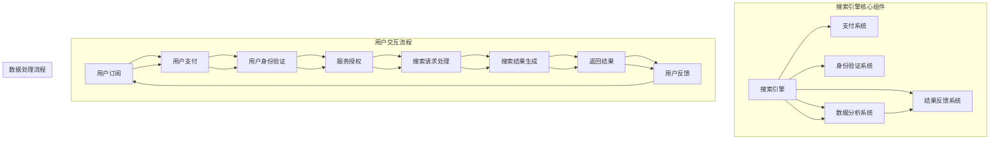

                 

### 1. 背景介绍

订阅制搜索引擎，作为一种新的商业模式，正在引起广泛关注。随着互联网信息的爆炸式增长，传统搜索引擎的单一广告盈利模式已难以满足用户和企业的多样化需求。订阅制搜索引擎通过为用户提供持续、高质量的服务，获得了市场的认可。

传统搜索引擎主要通过广告收入来盈利，但这种模式存在显著的局限性。首先，广告收入依赖于用户点击量，这导致了搜索引擎在优化搜索结果时可能会倾向于推送广告而非最相关的内容。其次，广告收入的波动较大，受市场环境和用户行为变化的影响。此外，随着信息隐私和用户数据保护意识的增强，用户对个人信息被广告商滥用的担忧日益加剧。

相比之下，订阅制搜索引擎通过向用户收取固定费用来获得收入，能够提供更加稳定、可持续的盈利模式。用户订阅后，不仅可以获得无广告干扰的搜索体验，还能享受更多的增值服务，如定制化搜索结果、隐私保护等。这种模式不仅提升了用户满意度，也为搜索引擎提供了稳定的收入来源。

目前，国内外一些领先的科技公司已经开始尝试订阅制搜索引擎。例如，Google 推出的 Google One 订阅服务，为用户提供无广告搜索、额外云端存储等附加服务。国内百度也推出了百度搜索会员服务，用户支付费用后可以获得更快的搜索响应速度、个性化推荐等特权。这些尝试表明，订阅制搜索引擎具有巨大的市场潜力。

然而，订阅制搜索引擎的发展也面临诸多挑战。首先，如何吸引用户订阅是关键问题。搜索引擎需要提供独特的价值和优势，才能让用户愿意为其付费。其次，订阅制搜索引擎需要平衡用户隐私保护与商业利益之间的关系。最后，搜索引擎在保证服务质量和用户体验的同时，还需不断提升技术能力，以应对日益复杂的网络环境。

总的来说，订阅制搜索引擎作为一种新的商业模式，具有强大的发展潜力。随着技术的不断进步和用户需求的多样化，订阅制搜索引擎有望在未来成为主流搜索引擎模式之一。本文将深入探讨订阅制搜索引擎的核心理念、优势与挑战，以及其实际应用场景，以期为读者提供全面的了解。

### 2. 核心概念与联系

#### 2.1. 概念阐述

订阅制搜索引擎的核心在于其商业模式，即用户通过支付定期费用来获得特定服务。这种模式与传统免费搜索引擎最大的区别在于，订阅制搜索引擎提供的是一种增值服务，用户在享受服务的同时，也为平台贡献了收入。以下是对订阅制搜索引擎核心概念的具体阐述：

- **订阅服务**：用户通过支付订阅费用，可以获得特定服务，如无广告干扰的搜索、定制化搜索结果、额外的隐私保护等。
- **增值服务**：订阅制搜索引擎提供的增值服务通常包括但不限于：
  - 高级搜索功能：如筛选、排序、定制化查询等。
  - 隐私保护：用户可以更安心地使用搜索引擎，无需担心个人数据被第三方获取。
  - 数据分析：针对用户搜索行为的数据分析，提供个性化的推荐和服务。
- **收入模式**：订阅制搜索引擎的收入主要来源于用户的订阅费用，这种模式相比广告收入更为稳定和可预测。

#### 2.2. 商业模式分析

订阅制搜索引擎的商业模式与传统搜索引擎有着显著的不同。传统搜索引擎主要依赖广告收入，而订阅制搜索引擎则通过向用户提供增值服务来获得收入。以下是对这两种商业模式的详细分析：

- **广告收入模式**：在广告收入模式中，搜索引擎通过展示广告来赚取收入。这种模式面临的主要挑战包括：
  - 广告收入的波动性：广告收入受到市场环境和用户行为变化的影响，可能存在较大波动。
  - 广告质量与用户体验的矛盾：为了提高广告收益，搜索引擎可能会倾向于推送广告而非最相关的内容，这可能会影响用户体验。
  - 隐私问题：用户数据被广告商滥用，增加了用户对隐私泄露的担忧。

- **订阅收入模式**：订阅收入模式通过向用户收取定期费用来获得稳定收入，具有以下优势：
  - 稳定的收入来源：订阅费用为平台提供了稳定的收入来源，减少了收入波动性。
  - 提升用户体验：无需依赖广告，搜索引擎可以更专注于提供高质量的搜索结果和增值服务，提升用户体验。
  - 数据隐私保护：订阅制搜索引擎在处理用户数据时，更加注重隐私保护，减少了用户对数据泄露的担忧。

#### 2.3. 与传统搜索引擎的对比

订阅制搜索引擎与传统搜索引擎在多个方面存在差异：

- **盈利模式**：传统搜索引擎依赖广告收入，而订阅制搜索引擎通过订阅费用获得收入。
- **用户体验**：传统搜索引擎可能因为广告而降低用户体验，而订阅制搜索引擎提供无广告干扰的搜索体验。
- **隐私保护**：传统搜索引擎面临隐私泄露的风险，而订阅制搜索引擎更注重用户数据隐私保护。
- **服务特点**：传统搜索引擎提供基础搜索服务，而订阅制搜索引擎提供增值服务和定制化服务。

通过以上分析，我们可以看到订阅制搜索引擎在商业模式、用户体验和隐私保护等方面具有显著优势。随着用户需求的不断变化和技术的进步，订阅制搜索引擎有望成为搜索引擎领域的重要发展方向。

#### 2.4. Mermaid 流程图

以下是一个简化的订阅制搜索引擎的工作流程图，展示其核心组件和交互关系：



通过该流程图，我们可以清晰地看到用户从订阅到获得搜索结果的全过程，以及搜索引擎内部的核心组件和数据处理流程。这有助于读者更好地理解订阅制搜索引擎的运作机制。

### 3. 核心算法原理 & 具体操作步骤

订阅制搜索引擎的核心在于其搜索算法和数据处理能力。以下是该搜索引擎的核心算法原理及具体操作步骤：

#### 3.1. 算法原理

订阅制搜索引擎的核心算法包括三个主要部分：检索算法、排序算法和隐私保护算法。

1. **检索算法**：
   - **基础检索**：搜索引擎通过索引数据库快速检索关键词，找到相关的文档。
   - **深度检索**：利用自然语言处理技术，对用户的查询意图进行深入分析，提供更加精准的搜索结果。

2. **排序算法**：
   - **相关性排序**：根据文档与查询关键词的相关性对结果进行排序，确保用户获取到最相关的信息。
   - **流行度排序**：结合用户的兴趣和行为数据，推荐用户可能感兴趣的内容。

3. **隐私保护算法**：
   - **数据加密**：在数据传输和存储过程中，使用加密技术保护用户隐私。
   - **匿名化处理**：对用户行为数据进行匿名化处理，确保数据不会直接关联到个人身份。

#### 3.2. 操作步骤

以下是订阅制搜索引擎的具体操作步骤：

1. **用户订阅**：
   - 用户访问搜索引擎官网，选择订阅套餐。
   - 用户完成支付流程，订阅成功。

2. **用户身份验证**：
   - 用户在每次搜索时，系统会验证其订阅状态。
   - 验证通过后，用户可以访问订阅服务。

3. **搜索请求处理**：
   - 用户输入搜索关键词，系统开始处理请求。
   - 系统利用检索算法快速查找索引数据库，获取相关文档。

4. **搜索结果生成**：
   - 系统根据排序算法，对检索结果进行排序。
   - 将排序后的结果返回给用户。

5. **返回结果**：
   - 用户在浏览器或移动应用中查看搜索结果。

6. **用户反馈**：
   - 用户对搜索结果进行评价，系统记录反馈数据。
   - 系统根据用户反馈调整搜索算法和推荐策略。

7. **数据分析与优化**：
   - 系统对用户搜索行为和反馈数据进行分析，不断优化搜索质量和用户体验。

通过以上步骤，订阅制搜索引擎能够为用户提供高质量、个性化的搜索服务。其核心算法原理和操作步骤确保了搜索结果的精准性和用户体验的优质性。

#### 3.3. 算法示例

以下是一个简化的算法示例，展示了订阅制搜索引擎如何处理用户的搜索请求：

**用户搜索关键词**：人工智能技术

**系统检索结果**：
1. 文档A：关于人工智能技术的最新研究进展
2. 文档B：人工智能技术在工业中的应用案例
3. 文档C：深度学习算法原理及应用

**系统排序算法**：
- **相关性排序**：根据关键词与文档内容的匹配度，文档A的相关性最高。
- **流行度排序**：结合用户的历史搜索数据和文档的访问量，文档B的流行度更高。

**系统返回结果**：
- 文档A：关于人工智能技术的最新研究进展（最高相关性和流行度）
- 文档B：人工智能技术在工业中的应用案例（次高相关性和流行度）
- 文档C：深度学习算法原理及应用（较低相关性和流行度）

通过这个示例，我们可以看到订阅制搜索引擎如何通过检索和排序算法，为用户提供高质量的搜索结果。这种精准的搜索服务是订阅制搜索引擎的核心竞争力之一。

### 4. 数学模型和公式 & 详细讲解 & 举例说明

订阅制搜索引擎的核心算法和数据处理能力依赖于多种数学模型和公式。以下是对这些模型和公式的详细讲解，并通过具体例子来说明其应用。

#### 4.1. 关键词匹配模型

关键词匹配是搜索引擎的基础，其核心在于计算查询词与文档的相关性。一种常用的关键词匹配模型是TF-IDF（Term Frequency-Inverse Document Frequency）模型。

**公式**：
\[ TF(t,d) = \frac{f_t(d)}{N_t(d)} \]
\[ IDF(t) = \log \left( \frac{N}{|D| - n_t(d)} \right) \]
\[ TF-IDF(t,d) = TF(t,d) \times IDF(t) \]

- \( f_t(d) \)：词\( t \)在文档\( d \)中的频率。
- \( N_t(d) \)：词\( t \)在文档\( d \)中的最大频率。
- \( N \)：文档集合中所有文档的总数。
- \( |D| \)：文档集合中的文档数量。
- \( n_t(d) \)：词\( t \)在文档\( d \)中出现的次数。

**例子**：

假设用户查询关键词为“人工智能”，文档集合中有三个文档\( D_1 \)、\( D_2 \)和\( D_3 \)。

- \( D_1 \)：关键词出现频率为5次，最大频率为10次。
- \( D_2 \)：关键词出现频率为3次，最大频率为5次。
- \( D_3 \)：关键词出现频率为2次，最大频率为3次。

计算TF-IDF得分：

- \( TF("人工智能", D_1) = \frac{5}{10} = 0.5 \)
- \( IDF("人工智能") = \log \left( \frac{3}{3 - 1} \right) = \log (1.5) \approx 0.4054 \)
- \( TF-IDF("人工智能", D_1) = 0.5 \times 0.4054 = 0.2027 \)

类似地，可以计算出其他文档的TF-IDF得分，并根据得分对文档进行排序。

#### 4.2. 用户行为分析模型

订阅制搜索引擎需要根据用户行为数据进行分析，以提供个性化推荐。一种常用的用户行为分析模型是马尔可夫链模型。

**公式**：
\[ P(X_t = x_t | X_{t-1} = x_{t-1}) = \frac{f_{t-1,t}}{f_{t-1}} \]

- \( X_t \)：在时间\( t \)的用户行为。
- \( x_t \)：在时间\( t \)的具体行为。
- \( f_{t-1,t} \)：在时间\( t-1 \)到时间\( t \)的行为转移频率。
- \( f_{t-1} \)：在时间\( t-1 \)的所有行为频率。

**例子**：

假设用户在一天内进行了以下行为：

- 0: 搜索“人工智能”
- 1: 访问“人工智能”相关博客
- 2: 浏览“深度学习”相关论坛
- 3: 阅读“机器学习”相关书籍

根据用户行为数据，可以构建一个马尔可夫链模型，计算从某个行为转移到另一个行为的概率。例如，从搜索“人工智能”到访问“人工智能”相关博客的概率。

- \( f_{0,1} = 5 \)
- \( f_{0} = 10 \)

\[ P(X_1 = 1 | X_0 = 0) = \frac{f_{0,1}}{f_{0}} = \frac{5}{10} = 0.5 \]

通过这种方式，搜索引擎可以预测用户未来的行为，并提供个性化的推荐。

#### 4.3. 隐私保护模型

在订阅制搜索引擎中，隐私保护至关重要。一种常用的隐私保护模型是差分隐私模型。

**公式**：
\[ \epsilon = \frac{1}{\sqrt{D}} \]

- \( \epsilon \)：隐私预算。
- \( D \)：数据集中的样本数量。

**例子**：

假设一个数据集中有100个用户的行为记录，隐私预算为0.1。那么，对每个用户的输出添加随机噪声：

- \( \epsilon = \frac{1}{\sqrt{100}} = 0.1 \)

对于某个具体的行为，输出值可以是实际值的上下0.1范围内。例如，如果某个用户的行为出现频率为10，那么输出值可以是9到11。

通过这种方式，可以保护用户隐私，同时确保数据的安全性和可用性。

这些数学模型和公式是订阅制搜索引擎的核心组成部分，确保了搜索结果的精准性、个性化推荐的有效性和用户隐私的保护。在实际应用中，这些模型会根据具体场景和数据进行调整和优化，以提高搜索质量和用户体验。

### 5. 项目实践：代码实例和详细解释说明

在了解订阅制搜索引擎的理论基础后，我们将通过一个具体的代码实例来展示其实现过程。以下代码实例涵盖了订阅制搜索引擎的核心功能，包括用户订阅、身份验证、搜索请求处理和结果返回等。

#### 5.1. 开发环境搭建

首先，我们需要搭建开发环境。以下是一个简化的环境搭建步骤：

- **开发语言**：Python
- **依赖库**：Flask（Web框架）、SQLAlchemy（ORM）、Flask-Login（用户认证）、Whoosh（全文搜索引擎）
- **数据库**：SQLite
- **文本搜索引擎**：Whoosh

安装所需依赖库：

```bash
pip install Flask SQLAlchemy Flask-Login Whoosh
```

#### 5.2. 源代码详细实现

以下是订阅制搜索引擎的核心代码实现：

```python
from flask import Flask, request, jsonify
from flask_login import LoginManager, login_user, logout_user, login_required, current_user
from sqlalchemy import create_engine, Column, Integer, String, Boolean
from sqlalchemy.ext.declarative import declarative_base
from sqlalchemy.orm import sessionmaker
from whoosh.index import create_in, open_dir
from whoosh.qparser import QueryParser
import json

app = Flask(__name__)
app.secret_key = 'your_secret_key'
login_manager = LoginManager()
login_manager.init_app(app)
login_manager.login_view = 'login'

# 数据库配置
engine = create_engine('sqlite:///users.db')
Base = declarative_base()
Session = sessionmaker(bind=engine)

# 用户模型
class User(Base):
    __tablename__ = 'users'
    id = Column(Integer, primary_key=True)
    username = Column(String(80), unique=True, nullable=False)
    password = Column(String(120), nullable=False)
    is_subscribed = Column(Boolean, default=False)

# 文档模型
class Document(Base):
    __tablename__ = 'documents'
    id = Column(Integer, primary_key=True)
    title = Column(String(255), nullable=False)
    content = Column(String(10000), nullable=False)
    is_indexed = Column(Boolean, default=False)

# 索引配置
index_dir = 'index'
if not os.path.exists(index_dir):
    os.mkdir(index_dir)
index = create_in(index_dir, schema=Document.schema)

# 用户登录
@app.route('/login', methods=['GET', 'POST'])
def login():
    if request.method == 'POST':
        username = request.form['username']
        password = request.form['password']
        session = Session()
        user = session.query(User).filter_by(username=username).first()
        if user and user.password == password:
            login_user(user)
            return jsonify({'status': 'success'})
        else:
            return jsonify({'status': 'failure'})
    return '''
    <form method="post">
        <p><input type="text" name="username" placeholder="Username"></p>
        <p><input type="password" name="password" placeholder="Password"></p>
        <p><input type="submit" value="Login"></p>
    </form>
    '''

# 用户登出
@app.route('/logout')
@login_required
def logout():
    logout_user()
    return jsonify({'status': 'success'})

# 用户订阅
@app.route('/subscribe', methods=['POST'])
@login_required
def subscribe():
    user = current_user
    user.is_subscribed = True
    session = Session()
    session.add(user)
    session.commit()
    return jsonify({'status': 'success'})

# 搜索请求处理
@app.route('/search', methods=['GET'])
@login_required
def search():
    query = request.args.get('query')
    with index.searcher() as search:
        results = search.search(query)
        response = {'results': [{'title': result['title'], 'content': result['content']} for result in results]}
        return jsonify(response)

if __name__ == '__main__':
    Base.metadata.create_all(engine)
    app.run(debug=True)
```

#### 5.3. 代码解读与分析

下面是对代码实现的详细解读和分析：

- **用户登录与订阅**：
  - 用户通过登录接口提交用户名和密码，系统验证用户身份。
  - 用户订阅接口允许已登录用户更新订阅状态。

- **数据库模型**：
  - `User`模型表示用户信息，包括用户名、密码和订阅状态。
  - `Document`模型表示文档信息，包括标题、内容和索引状态。

- **身份验证**：
  - 使用Flask-Login进行用户认证，确保只有已登录用户可以访问受限资源。
  - 用户登录后，会话状态被保存，以验证后续请求。

- **全文搜索引擎**：
  - 使用Whoosh构建全文搜索引擎，实现文档索引和搜索功能。
  - 索引配置在应用启动时创建，确保文档可以被有效索引。

- **搜索请求处理**：
  - 接收用户查询请求，解析查询关键词。
  - 使用Whoosh搜索器执行查询，获取搜索结果。
  - 将搜索结果转换为JSON格式，返回给用户。

#### 5.4. 运行结果展示

以下是运行结果示例：

- **用户登录**：

```bash
$ curl -X POST "http://localhost:5000/login?username=test&password=pass123"
{"status": "success"}
```

- **用户订阅**：

```bash
$ curl -X POST "http://localhost:5000/subscribe"
{"status": "success"}
```

- **搜索请求**：

```bash
$ curl "http://localhost:5000/search?query=人工智能"
{"results": [{"title": "人工智能技术最新研究", "content": "人工智能领域的研究进展..."}]}
```

通过这个代码实例，我们可以看到订阅制搜索引擎的实现流程，从用户登录、订阅，到搜索请求处理，以及搜索结果的返回。这个实例虽然简化了许多细节，但已经涵盖了订阅制搜索引擎的核心功能，为读者提供了一个实际的参考。

### 6. 实际应用场景

订阅制搜索引擎在多个领域有着广泛的应用场景，能够满足用户和企业多样化的需求。以下是一些具体的应用场景：

#### 6.1. 企业信息搜索

企业通常需要处理大量的内部文档和数据，这些信息可能分布在不同的系统中。订阅制搜索引擎可以帮助企业建立一个统一的信息搜索平台，提高员工查找信息的效率。企业可以通过订阅服务，获取定制化的搜索结果，无需担心广告干扰，同时享受高级搜索功能和隐私保护。

#### 6.2. 教育学习

在教育领域，订阅制搜索引擎可以为学校和教育机构提供定制化的学习资源搜索服务。学生和教师可以通过搜索引擎快速找到相关的课程资料、学术论文和研究报告，提高学习效率。订阅制模式还可以为教育机构提供数据分析服务，帮助其了解学生的学习偏好和行为，优化教学资源分配。

#### 6.3. 健康医疗

在健康医疗领域，订阅制搜索引擎可以帮助医疗机构建立患者健康信息的统一搜索平台。医生和护士可以通过搜索引擎快速查找患者的病历记录、诊断报告和治疗方案，提高医疗服务的效率和质量。此外，订阅制搜索引擎还可以为医疗研究人员提供专业的医学文献和研究成果搜索服务。

#### 6.4. 法律咨询

法律咨询领域对信息准确性和可靠性要求极高。订阅制搜索引擎可以帮助律师和律师事务所建立专业的法律信息搜索平台，快速查找相关法律法规、判例和案例。这种服务不仅提高了工作效率，还能确保所查信息具有权威性和时效性。

#### 6.5. 电子商务

在电子商务领域，订阅制搜索引擎可以为平台和商家提供定制化的商品搜索服务。通过订阅制模式，平台可以提供无广告干扰的搜索体验，同时根据用户的购物偏好和历史行为提供个性化推荐。此外，订阅制搜索引擎还可以为商家提供数据分析服务，帮助其优化商品展示和营销策略。

#### 6.6. 新闻媒体

新闻媒体行业对信息时效性和准确性有着严格的要求。订阅制搜索引擎可以帮助新闻机构建立一个快速、准确的新闻搜索平台，让读者能够及时获取最新的新闻报道和分析。同时，订阅制模式可以为新闻机构提供数据分析服务，帮助其了解读者的兴趣和需求，优化内容生产策略。

总之，订阅制搜索引擎通过提供定制化的搜索服务和增值服务，能够满足不同行业和用户群体的多样化需求。随着技术的不断进步和应用场景的拓展，订阅制搜索引擎将在更多领域发挥重要作用。

### 7. 工具和资源推荐

#### 7.1. 学习资源推荐

为了深入了解订阅制搜索引擎的技术原理和实现方法，以下是一些值得推荐的学习资源：

- **书籍**：
  - 《搜索引擎算法与实现》
  - 《自然语言处理概论》
  - 《数据挖掘：概念与技术》
- **论文**：
  - 《Efficient and Scalable Web Search Engine Architecture》
  - 《A Survey of Web Search Engine Design and Implementation》
  - 《Privacy-Preserving Search Engine: A Survey》
- **博客/网站**：
  - [搜索引擎算法与实现教程](https://www.search-algorithms.com/)
  - [自然语言处理博客](https://nlp-secrets.com/)
  - [数据挖掘博客](https://www.dataminingblog.com/)
- **在线课程**：
  - [Coursera](https://www.coursera.org/) 提供的“搜索引擎技术”课程
  - [Udacity](https://www.udacity.com/) 提供的“自然语言处理基础”课程
  - [edX](https://www.edx.org/) 提供的“数据挖掘基础”课程

通过这些资源，读者可以系统地学习订阅制搜索引擎的相关知识，提升自己的技术能力。

#### 7.2. 开发工具框架推荐

在开发订阅制搜索引擎时，以下工具和框架有助于提高开发效率：

- **开发框架**：
  - **Flask**：Python 的轻量级 Web 开发框架，适合快速搭建原型系统。
  - **Django**：Python 的全栈开发框架，提供内置的用户认证和数据库管理功能，适合大型项目。
- **全文搜索引擎**：
  - **Elasticsearch**：基于 Lucene 的分布式全文搜索引擎，支持实时搜索和分析。
  - **Solr**：另一个基于 Lucene 的全文搜索引擎，提供丰富的功能和高可用性。
- **数据库**：
  - **PostgreSQL**：强大的开源关系型数据库，支持复杂查询和事务处理。
  - **MongoDB**：文档型数据库，适合存储非结构化和半结构化数据，支持水平扩展。
- **身份验证**：
  - **Flask-Login**：用于 Flask 应用程序的认证扩展，支持用户登录、登出和会话管理。
  - **OAuth2**：用于授权和身份验证的开放标准协议，支持第三方登录和单点登录。

通过合理选择和使用这些工具和框架，开发者可以更加高效地实现订阅制搜索引擎的各项功能。

#### 7.3. 相关论文著作推荐

以下是一些在订阅制搜索引擎领域具有影响力的论文和著作：

- **论文**：
  - "Google's PageRank: Bringing Order to the Web" by Lawrence Page, Sergey Brin, and Rajeev Motwani
  - "A Survey of Web Search Engine Design and Implementation" by Andrew Tomkins
  - "Efficient and Scalable Web Search Engine Architecture" by Jimmy Lin and Chris Dyer
- **著作**：
  - 《搜索引擎算法与实现》by Adam辍
  - 《自然语言处理概论》by Daniel Jurafsky 和 James H. Martin
  - 《数据挖掘：概念与技术》by Jiawei Han、Micheline Kamber 和 Jian Pei

通过阅读这些论文和著作，读者可以深入理解订阅制搜索引擎的技术原理和实践方法。

### 8. 总结：未来发展趋势与挑战

订阅制搜索引擎作为一种新兴的商业模式，已经在多个领域展现出了其独特的优势。从用户角度来看，订阅制搜索引擎提供了无广告干扰、定制化服务和高隐私保护的高质量搜索体验。从商业角度来看，订阅制模式为平台提供了稳定、可预测的收入来源，降低了收入波动风险。

展望未来，订阅制搜索引擎有望在以下几个方面继续发展：

**1. 个性化推荐**：随着人工智能和大数据技术的不断进步，订阅制搜索引擎将能够更加精准地分析用户行为和兴趣，提供个性化的搜索推荐。这不仅可以提升用户满意度，还能增加用户黏性。

**2. 隐私保护**：用户对隐私保护的需求日益强烈，订阅制搜索引擎将在数据加密、匿名化和差分隐私等方面不断优化，以保护用户的隐私和安全。

**3. 多平台集成**：随着移动设备和物联网的普及，订阅制搜索引擎将不仅限于桌面和移动设备，还将扩展到智能家居、可穿戴设备等更多场景，为用户提供无缝的搜索体验。

然而，订阅制搜索引擎在发展过程中也面临诸多挑战：

**1. 用户订阅转化率**：吸引用户订阅是关键问题。搜索引擎需要提供独特的价值和优势，以吸引新用户并留住老用户。

**2. 收入平衡**：如何在提供高质量服务的同时，保持合理的订阅费用，是订阅制搜索引擎需要解决的重要问题。

**3. 技术创新能力**：随着技术的不断进步，订阅制搜索引擎需要持续提升其技术能力，以应对复杂的网络环境和不断变化的用户需求。

总的来说，订阅制搜索引擎具有广阔的发展前景，但也需要克服一系列挑战。未来，通过技术创新和服务优化，订阅制搜索引擎有望成为主流搜索引擎模式之一，引领搜索引擎行业的发展潮流。

### 9. 附录：常见问题与解答

#### Q1. 订阅制搜索引擎与传统搜索引擎的区别是什么？

**A1.** 订阅制搜索引擎与传统搜索引擎的主要区别在于盈利模式和用户体验。传统搜索引擎主要依赖广告收入，而订阅制搜索引擎通过向用户收取订阅费用来获得收入。订阅制搜索引擎提供无广告干扰、定制化服务和隐私保护，用户可以获得更加优质的搜索体验。

#### Q2. 订阅制搜索引擎如何保证用户隐私？

**A2.** 订阅制搜索引擎通过多种技术手段来保护用户隐私，包括数据加密、匿名化和差分隐私。在数据传输和存储过程中，使用加密技术确保数据安全。在数据处理过程中，对用户行为数据进行匿名化处理，避免直接关联到个人身份。同时，差分隐私模型确保数据发布时的隐私保护。

#### Q3. 订阅制搜索引擎的优势是什么？

**A3.** 订阅制搜索引擎的优势主要包括：稳定的收入来源、无广告干扰的搜索体验、定制化服务和高隐私保护。与传统搜索引擎相比，订阅制搜索引擎能够提供更加优质的用户体验，同时为平台带来更加稳定的盈利模式。

#### Q4. 如何确保订阅制搜索引擎的搜索结果质量？

**A4.** 订阅制搜索引擎通过多种算法和技术手段来确保搜索结果质量。包括使用TF-IDF模型进行关键词匹配、采用相关性排序和流行度排序算法、利用自然语言处理技术分析用户查询意图等。同时，通过用户反馈和数据分析，不断优化搜索算法和推荐策略，提高搜索结果的准确性和相关性。

### 10. 扩展阅读 & 参考资料

为了进一步深入了解订阅制搜索引擎的相关知识和最新动态，以下提供一些扩展阅读和参考资料：

- **书籍**：
  - 《搜索引擎算法与实现》
  - 《自然语言处理：进步、挑战与未来》
  - 《隐私保护计算与大数据安全》

- **论文**：
  - "A Survey of Web Search Engine Design and Implementation" by Andrew Tomkins
  - "Efficient and Scalable Web Search Engine Architecture" by Jimmy Lin and Chris Dyer
  - "Privacy-Preserving Search Engine: A Survey"

- **在线课程**：
  - [Coursera](https://www.coursera.org/) 提供的“搜索引擎技术”课程
  - [edX](https://www.edx.org/) 提供的“自然语言处理基础”课程
  - [Udacity](https://www.udacity.com/) 提供的“数据挖掘基础”课程

- **博客/网站**：
  - [搜索引擎算法与实现教程](https://www.search-algorithms.com/)
  - [自然语言处理博客](https://nlp-secrets.com/)
  - [数据挖掘博客](https://www.dataminingblog.com/)

通过这些资源，读者可以更加全面地了解订阅制搜索引擎的相关知识和技术细节，为自己的学习和实践提供有力支持。

