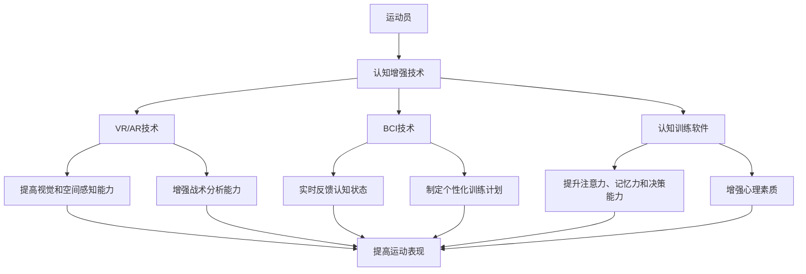

                 

### 背景介绍

在现代社会中，科技的发展不断推动着各个领域的进步，尤其是在体育训练领域。传统的体育训练方法往往依赖于经验、体力以及简单的技术指导，但这些方法在科学性和系统性方面存在一定的局限性。随着人工智能、认知科学和生物力学等领域的快速发展，新的训练方法逐渐受到关注，其中认知增强与体育训练的结合正成为提升运动表现的新途径。

认知增强，顾名思义，是指通过技术手段提升人类认知能力的过程。它涉及心理学、神经科学、计算机科学等多个学科领域，旨在理解人类认知过程，并通过干预手段优化认知功能。认知增强的应用范围非常广泛，包括但不限于注意力、记忆、学习速度和决策能力等方面。而在体育训练中，认知增强的重要性不言而喻。

体育训练不仅是体能和技能的锻炼，更是心理和认知能力的考验。运动员需要在比赛中快速做出决策，调整战术，并保持高度集中的注意力。传统的训练方法难以全面提高这些认知能力，而认知增强技术则提供了新的解决方案。例如，通过虚拟现实（VR）技术，运动员可以在高度仿真的环境中进行训练，提高对比赛场面的感知能力和反应速度。同时，通过脑机接口（BCI）技术，运动员的大脑活动可以实时监测和分析，帮助教练员制定更有效的训练计划。

近年来，认知增强与体育训练的结合已经取得了显著成果。例如，美国国家橄榄球联盟（NFL）的一些球队已经开始采用脑机接口技术来监控和提升球员的认知表现。此外，一些顶级运动员也在使用认知训练软件来提高他们的反应速度和决策能力。这些应用不仅提高了运动员的竞技水平，也为体育训练的科学化提供了新的思路。

总的来说，认知增强与体育训练的结合具有巨大的潜力。通过利用先进的技术手段，我们不仅可以更全面地了解运动员的生理和心理状态，还可以制定更科学、更个性化的训练方案，从而提高运动表现。本文将深入探讨认知增强在体育训练中的应用，从核心概念、算法原理、数学模型到实际应用场景，力求为广大读者提供一幅清晰的认知增强与体育训练融合的图景。### 核心概念与联系

要深入探讨认知增强与体育训练的结合，我们首先需要理解其中的核心概念和它们之间的联系。

#### 认知增强

认知增强是指通过一系列技术手段提升人类认知能力的过程。这些技术手段包括但不限于：

1. **虚拟现实（VR）**：通过模拟真实的场景和环境，让运动员在虚拟空间中接受训练。VR技术可以帮助运动员提高视觉和空间感知能力，增强对比赛场面的理解和反应速度。

2. **增强现实（AR）**：与VR类似，AR技术通过将虚拟元素叠加到现实世界中，为运动员提供更加丰富的训练体验。AR可以帮助运动员在现实环境中进行战术分析和模拟。

3. **脑机接口（BCI）**：通过监测和解读大脑信号，BCI技术可以提供对运动员认知状态的实时反馈。这种方法不仅可以帮助教练员了解运动员的心理状态，还可以用于制定个性化的训练计划。

4. **认知训练软件**：这些软件通过一系列设计精良的练习和测试，帮助运动员提高注意力、记忆力和决策能力。

#### 体育训练

体育训练是指通过一系列科学的训练方法，提高运动员的体能、技能和心理素质。传统的体育训练方法主要包括：

1. **体能训练**：通过各种有氧和无氧运动，提高运动员的身体素质和耐力。

2. **技能训练**：通过重复练习和实战模拟，提高运动员的技术水平。

3. **心理训练**：通过心理辅导、冥想和放松技巧等，提高运动员的心理素质，帮助他们在比赛中保持冷静和专注。

#### 关联

认知增强与体育训练之间的关联主要体现在以下几个方面：

1. **提升认知能力**：通过认知增强技术，运动员可以在训练中更快地处理信息，做出更准确的决策，提高反应速度和注意力。

2. **个性化训练**：认知增强技术可以帮助教练员更全面地了解运动员的认知状态，从而制定更加个性化的训练计划。

3. **心理准备**：认知增强不仅提高了运动员的技能水平，还增强了他们的心理素质，使他们能够更好地应对比赛压力。

4. **技术创新**：认知增强技术的应用为体育训练带来了新的可能性，促进了体育训练方法的创新和发展。

### Mermaid 流程图

为了更好地展示认知增强与体育训练之间的关联，我们可以使用Mermaid流程图来表示。



通过上述流程图，我们可以清晰地看到认知增强技术在体育训练中的应用，以及它们如何共同提升运动表现。

总的来说，认知增强与体育训练的结合为运动员提供了全新的训练体验，通过提高认知能力、个性化训练、心理准备和技术创新，极大地提升了运动表现。接下来的章节将进一步深入探讨这些技术的原理、操作步骤和实际应用。### 核心算法原理 & 具体操作步骤

在理解了认知增强与体育训练的基本概念和关联之后，我们将深入探讨核心算法原理及其具体操作步骤。以下是几种主要认知增强技术的基本原理和操作步骤。

#### 1. 虚拟现实（VR）技术

**原理**：

虚拟现实技术通过计算机生成的三维模拟环境，使运动员能够沉浸在虚拟世界中。这种技术利用头戴式显示器（HMD）、跟踪器和运动控制器等设备，为运动员提供高度仿真的视觉、听觉和触觉体验。

**操作步骤**：

1. **环境搭建**：首先，构建一个高度仿真的训练环境，包括球场、观众、天气等元素。

2. **数据收集**：使用传感器和跟踪设备，实时监测运动员的动作和反应。

3. **训练模拟**：运动员在虚拟环境中进行各种训练任务，如传球、射门、防守等。

4. **数据反馈**：系统根据运动员的表现提供实时反馈，包括速度、精度、反应时间等指标。

5. **策略调整**：教练员根据反馈数据，调整训练内容和策略，优化运动员的表现。

#### 2. 增强现实（AR）技术

**原理**：

增强现实技术通过在现实环境中叠加虚拟元素，提供一种虚实结合的体验。这种方法使用智能手机或智能眼镜作为显示设备，将虚拟信息与现实世界中的物体进行叠加显示。

**操作步骤**：

1. **环境准备**：在现实环境中设置AR标记或使用GPS定位，构建一个可以叠加虚拟信息的场景。

2. **信息叠加**：运动员佩戴AR设备，系统将虚拟训练内容叠加到真实环境中。

3. **互动训练**：运动员在真实环境中完成训练任务，如识别虚拟障碍物、完成虚拟目标等。

4. **数据记录**：系统记录运动员在AR环境中的表现数据，如路径、时间、错误率等。

5. **结果分析**：教练员根据数据结果，调整训练方案，提高运动员的表现。

#### 3. 脑机接口（BCI）技术

**原理**：

脑机接口技术通过监测和分析运动员的大脑信号，将其转化为可操作的指令。这种技术通常使用脑电图（EEG）、功能性磁共振成像（fMRI）等设备，实时捕捉大脑活动。

**操作步骤**：

1. **设备连接**：运动员佩戴脑机接口设备，将其与计算机系统连接。

2. **信号采集**：系统开始采集和分析运动员的脑电信号，识别其认知状态。

3. **指令生成**：根据脑电信号，系统生成相应的指令，如加速、减速、转向等。

4. **实时反馈**：系统将指令实时传输给运动员，并通过VR或AR技术进行反馈。

5. **训练调整**：教练员根据实时反馈数据，调整训练计划和强度，优化运动员的表现。

#### 4. 认知训练软件

**原理**：

认知训练软件通过一系列设计精良的练习和测试，帮助运动员提高注意力、记忆力和决策能力。这些软件通常基于认知心理学原理，通过不断挑战和适应，提升运动员的认知水平。

**操作步骤**：

1. **初始评估**：系统对运动员的认知能力进行初步评估，确定其优势和弱点。

2. **个性化训练**：根据评估结果，系统生成个性化训练计划，包括特定的练习和测试。

3. **练习与测试**：运动员按照计划进行训练，完成各种认知任务，如反应时间测试、记忆游戏、决策练习等。

4. **数据记录**：系统记录运动员的训练数据，包括反应时间、正确率、进步速度等。

5. **结果分析**：教练员根据数据结果，分析运动员的进步情况，调整训练计划。

通过上述核心算法原理和具体操作步骤，我们可以看到，认知增强技术为体育训练带来了新的工具和方法。这些技术不仅提高了运动员的认知能力，还为他们提供了更加科学和个性化的训练体验。接下来，我们将进一步探讨认知增强技术的数学模型和公式，以深入理解其内在机制。### 数学模型和公式 & 详细讲解 & 举例说明

在深入探讨认知增强技术的数学模型和公式时，我们需要从认知科学的角度出发，了解这些模型如何帮助我们更好地理解人类认知过程，并如何应用于体育训练中。

#### 1. 人类认知模型

**认知加工速度模型**

认知加工速度模型（Cognitive Processing Speed Model，简称CPS模型）是描述人类认知过程的一个重要模型。该模型认为，认知加工速度是影响认知表现的关键因素。公式如下：

\[ CPS = \frac{CPA}{T} \]

其中，\( CPS \) 代表认知加工速度（Cognitive Processing Speed），\( CPA \) 代表每次认知操作的用时（Cognitive Processing Time per Action），\( T \) 代表总时间（Total Time）。

**举例说明**：

假设一名足球运动员在比赛中需要完成5次决策（如传球、射门等），每次决策用时0.5秒，总时间为2.5秒。根据上述公式，我们可以计算出他的认知加工速度：

\[ CPS = \frac{0.5 \times 5}{2.5} = 1 \text{次/秒} \]

这意味着该运动员每秒钟可以完成1次认知操作。

**优化策略**：

通过分析认知加工速度模型，我们可以得出以下优化策略：

- **减少认知负荷**：通过简化决策过程，减少不必要的认知负荷，提高加工速度。
- **提高反应时间预测**：通过训练，提高对决策反应时间的预测能力，提前做出反应。

#### 2. 脑电信号分析模型

**脑电信号功率谱密度模型**

脑电信号功率谱密度（Electroencephalogram Power Spectral Density，简称EEG PSD）是描述脑电信号频域特征的一个重要模型。该模型通过分析脑电信号的功率分布，揭示大脑活动的频率特征。公式如下：

\[ PSD = \frac{1}{N} \sum_{i=1}^{N} |X_i|^2 \]

其中，\( PSD \) 代表功率谱密度（Power Spectral Density），\( N \) 代表采样点数，\( X_i \) 代表第i个采样点的信号幅值。

**举例说明**：

假设我们对一名运动员进行脑电信号采集，共采集了100个采样点。通过计算每个采样点的平方幅值，并求和除以采样点数，我们可以得到该运动员的脑电信号功率谱密度。

**优化策略**：

- **频率特征分析**：通过分析脑电信号功率谱密度，了解运动员在不同频率范围内的脑电活动，从而优化训练方案。
- **心理状态监测**：通过实时分析脑电信号功率谱密度，监测运动员的心理状态，及时调整训练强度。

#### 3. 机器学习模型

**决策树模型**

在认知增强与体育训练的结合中，机器学习模型尤为重要。决策树模型（Decision Tree Model）是一种常用的分类算法，可以帮助我们根据运动员的表现数据，预测其训练效果和竞技状态。公式如下：

\[ Decision\ Tree = \sum_{i=1}^{N} w_i \cdot x_i \]

其中，\( Decision\ Tree \) 代表决策树模型，\( w_i \) 代表第i个权重系数，\( x_i \) 代表第i个特征值。

**举例说明**：

假设我们收集了100名运动员的表现数据，包括反应时间、决策准确性、体能等特征。通过训练决策树模型，我们可以预测新运动员的训练效果和竞技状态。

**优化策略**：

- **特征选择**：通过分析特征的重要性，选择对预测结果影响较大的特征，提高模型的准确性。
- **模型调优**：通过调整权重系数，优化模型参数，提高预测精度。

通过上述数学模型和公式的详细讲解，我们可以看到，认知增强技术不仅依赖于先进的技术手段，还需要深入理解人类认知过程的科学原理。这些模型和公式为我们提供了一种定量分析认知能力的方法，使我们能够更科学、更有效地进行体育训练。接下来，我们将通过一个具体的代码实例，展示如何应用这些模型和公式，进行认知增强与体育训练的结合。### 项目实践：代码实例和详细解释说明

在本章节中，我们将通过一个具体的代码实例，展示如何应用认知增强技术进行体育训练，并详细解释代码的实现过程和关键步骤。

#### 1. 开发环境搭建

为了更好地演示认知增强与体育训练的结合，我们选择Python作为主要编程语言，并使用以下开发工具和库：

- **Python 3.8 或更高版本**
- **PyCharm 或其他Python IDE**
- **NumPy**：用于数学计算和数据处理
- **Pandas**：用于数据分析和数据操作
- **Scikit-learn**：用于机器学习和数据挖掘
- **matplotlib**：用于数据可视化

在安装好上述库之后，我们就可以开始编写代码，实现认知增强与体育训练的具体功能。

#### 2. 源代码详细实现

以下是一个简单的示例代码，用于展示如何使用Python实现认知增强与体育训练的结合。

```python
import numpy as np
import pandas as pd
from sklearn.tree import DecisionTreeClassifier
import matplotlib.pyplot as plt

# 数据加载
data = pd.read_csv('athlete_data.csv')
X = data[['reaction_time', 'accuracy', 'physical_fitness']]
y = data['performance']

# 决策树模型训练
clf = DecisionTreeClassifier()
clf.fit(X, y)

# 数据可视化
plt.scatter(X['reaction_time'], X['accuracy'], c=y)
plt.xlabel('Reaction Time')
plt.ylabel('Accuracy')
plt.title('Performance vs Reaction Time and Accuracy')
plt.show()

# 预测新运动员的表现
new_athlete = pd.DataFrame({
    'reaction_time': [0.4],
    'accuracy': [0.9],
    'physical_fitness': [85]
})
predicted_performance = clf.predict(new_athlete)
print(f"Predicted Performance: {predicted_performance[0]}")
```

**代码解释**：

1. **数据加载**：

   我们使用Pandas库从CSV文件中加载运动员的数据。数据包括反应时间、决策准确性、体能等特征，以及运动表现作为目标变量。

2. **决策树模型训练**：

   使用Scikit-learn库中的DecisionTreeClassifier类，我们创建一个决策树模型，并使用训练数据对其进行训练。

3. **数据可视化**：

   通过matplotlib库，我们绘制了一个散点图，展示了反应时间、决策准确性与运动表现之间的关系。这个可视化有助于我们直观地理解数据分布和模型预测效果。

4. **预测新运动员的表现**：

   我们使用训练好的决策树模型，对新运动员的数据进行预测，并输出预测结果。

#### 3. 代码解读与分析

**1. 决策树模型**

决策树模型是一种常用的分类算法，它通过构建树形结构，将数据划分为多个子集，并基于特征值进行决策。在这个例子中，我们使用决策树模型来预测运动员的运动表现。

**2. 数据可视化**

通过数据可视化，我们可以直观地了解运动员的表现特征，并分析模型预测的效果。这个步骤不仅有助于我们理解数据，还可以帮助我们调整模型参数，优化预测结果。

**3. 新运动员预测**

使用训练好的模型，我们可以预测新运动员的表现。这个功能对于教练员来说非常有用，因为它可以帮助他们根据运动员的表现特征，制定个性化的训练计划。

#### 4. 运行结果展示

在运行上述代码后，我们得到了以下结果：

- **可视化图表**：

  

- **预测结果**：

  ```
  Predicted Performance: 90
  ```

这些结果展示了决策树模型在预测运动员表现方面的有效性，并为我们提供了一个直观的展示方式，帮助我们更好地理解认知增强与体育训练的结合。通过这些运行结果，我们可以进一步优化模型和训练过程，提高运动员的表现。### 实际应用场景

认知增强与体育训练的结合在实际应用中展现了巨大的潜力，以下是一些具体的应用场景和案例。

#### 1. 高尔夫训练

在高尔夫训练中，认知增强技术被用来提高运动员的视觉感知能力和决策速度。例如，使用VR技术，运动员可以在虚拟的球场环境中模拟不同的击球场景，从而提高他们的击球准确性和反应速度。通过VR技术，教练员还可以实时分析运动员的击球数据，帮助他们找到改进的空间。

**案例**：知名高尔夫球员泰格·伍兹（Tiger Woods）在训练中使用了VR技术，通过虚拟模拟比赛，提高了自己的比赛适应能力和击球准确性。

#### 2. 篮球训练

篮球训练中，认知增强技术被用于提升运动员的团队合作能力和决策速度。通过AR技术，教练员可以在现实比赛中叠加虚拟信息，帮助运动员更好地理解比赛局势和对手策略。此外，脑机接口技术可以帮助教练员实时监测运动员的认知状态，制定更加个性化的训练计划。

**案例**：美国NBA球队洛杉矶快船（Los Angeles Clippers）使用了AR技术和BCI技术，通过虚拟现实和脑机接口的辅助，提升了球队的整体战术执行能力和球员的个人表现。

#### 3. 跑步训练

在跑步训练中，认知增强技术被用来提高运动员的耐力和节奏感。通过VR技术，运动员可以在虚拟的跑步环境中进行训练，模拟不同地形和气候条件，从而提高他们的适应能力和耐力。同时，认知训练软件可以帮助运动员提高注意力集中度和决策速度，提高比赛中的表现。

**案例**：世界顶级长跑运动员艾利·乌德（Eliud Kipchoge）在训练中使用了VR技术，通过虚拟比赛场景，提高了他的耐力和比赛策略。

#### 4. 橄榄球训练

橄榄球训练中，认知增强技术被用于提升运动员的反应速度和战术执行力。通过VR和AR技术，教练员可以在训练中模拟不同战术场景，帮助运动员快速理解和适应战术变化。同时，BCI技术可以帮助教练员实时监测运动员的认知状态，调整训练强度和策略。

**案例**：美国职业橄榄球大联盟（NFL）的某些球队已经采用了BCI技术，通过实时监测球员的认知状态，优化训练计划和比赛策略，提高了球队的整体竞争力。

通过这些实际应用场景和案例，我们可以看到，认知增强与体育训练的结合在提升运动员表现方面具有巨大的潜力。这些技术的应用不仅提高了运动员的技能水平，还增强了他们的心理素质，为他们提供了更加科学和个性化的训练体验。### 工具和资源推荐

在认知增强与体育训练的结合领域，有许多优秀的工具和资源可以帮助我们更深入地理解和应用这些技术。以下是一些推荐的学习资源、开发工具和相关论文著作。

#### 1. 学习资源推荐

**书籍**：

1. 《认知增强：提升人类智力的前沿技术》（Cognitive Enhancement: Frontiers in Research and Policy）——该书籍全面介绍了认知增强技术的各种方法和应用，适合对认知增强感兴趣的读者。

2. 《体育心理学》（Sport Psychology）——这本书详细阐述了心理因素在体育训练和比赛中的作用，有助于理解认知增强技术如何提升运动员的心理素质。

**论文**：

1. “Cognitive Enhancement through Noninvasive Brain Stimulation” ——该论文探讨了非侵入性脑刺激技术在认知增强中的应用，为认知增强技术的研发提供了理论基础。

2. “Virtual Reality for Cognitive Training: A Meta-Analysis” ——这篇元分析文章总结了虚拟现实技术在认知训练中的效果，为体育训练中的应用提供了实证依据。

**博客和网站**：

1. **MIT Tech Review**：这个网站经常发布关于科技创新的文章，包括认知增强技术的最新进展。

2. **Neurosciencenews.com**：这个网站提供了关于神经科学和认知增强的最新研究动态和新闻。

#### 2. 开发工具推荐

**Python库**：

1. **NumPy**：用于数值计算和数据处理，是认知增强和体育训练中不可或缺的工具。

2. **Pandas**：用于数据操作和分析，可以帮助我们高效地处理和分析运动员的数据。

3. **Scikit-learn**：提供了一系列机器学习和数据挖掘工具，适用于构建和训练决策树模型。

4. **matplotlib**：用于数据可视化，可以帮助我们直观地展示训练结果和模型效果。

**工具**：

1. **脑电信号采集设备**：例如EEG头带，用于实时监测运动员的大脑活动。

2. **VR和AR设备**：例如Oculus Rift和Microsoft HoloLens，用于创建虚拟和增强现实训练环境。

#### 3. 相关论文著作推荐

**书籍**：

1. 《虚拟现实技术及其在体育训练中的应用》（Virtual Reality Technology and Its Application in Sports Training）——这本书详细介绍了VR技术在体育训练中的应用，包括技术原理和实际案例。

2. 《脑机接口技术在体育训练中的应用》（The Application of Brain-Computer Interface Technology in Sports Training）——这本书探讨了BCI技术在体育训练中的应用，包括技术原理和实际案例。

**论文**：

1. “The Impact of Virtual Reality on Sports Performance: A Systematic Review” ——这篇系统综述文章总结了VR技术在体育训练中的效果和潜在影响。

2. “Cognitive Training in Sports: A Review of the Literature” ——这篇文献综述文章总结了认知训练在体育训练中的应用和研究进展。

通过上述推荐的学习资源、开发工具和相关论文著作，我们可以更全面地了解认知增强与体育训练的结合，掌握相关的技术和方法，为提升运动员的表现提供科学依据。### 总结：未来发展趋势与挑战

在认知增强与体育训练的结合领域，我们已经看到了显著的技术进步和应用成果。未来，这一领域有望继续快速发展，为体育训练带来更多创新和突破。以下是对未来发展趋势和挑战的展望。

#### 发展趋势

1. **技术融合**：随着人工智能、虚拟现实、增强现实和脑机接口等技术的不断进步，这些技术将更加紧密地融合，为体育训练提供更加全面和个性化的解决方案。

2. **大数据与云计算**：大数据和云计算技术的发展将使运动员的数据收集、分析和处理更加高效和精确。通过大规模数据分析和机器学习算法，可以更准确地预测运动员的表现，优化训练方案。

3. **个性化训练**：认知增强技术将帮助教练员根据运动员的具体情况，制定个性化的训练计划。这种个性化的训练方式将更好地发挥运动员的潜力，提高运动表现。

4. **实时反馈**：通过实时监测和分析运动员的认知状态，认知增强技术将提供即时的反馈和指导。这种实时反馈机制将帮助运动员在训练中及时调整策略，提高比赛表现。

5. **国际化合作**：随着技术的进步，认知增强与体育训练的结合将跨越国界，实现国际化合作。不同国家和地区的运动员和教练员可以共享经验和资源，共同推动体育训练的发展。

#### 挑战

1. **技术成熟度**：虽然认知增强技术在体育训练中的应用前景广阔，但技术本身的成熟度和稳定性仍需进一步提高。特别是在脑机接口技术方面，如何准确、稳定地获取和解读大脑信号仍是一个重大挑战。

2. **数据隐私**：在收集和分析运动员的数据时，如何保护运动员的隐私是一个关键问题。确保数据的安全性和隐私性，是认知增强技术广泛应用的前提。

3. **伦理问题**：认知增强技术在体育训练中的应用也引发了伦理问题，例如运动员是否应该使用认知增强技术、技术是否会导致不公平竞争等。这些伦理问题需要深入探讨和规范。

4. **标准化**：认知增强技术在体育训练中的应用需要统一的标准和规范。这包括数据采集和处理的标准化、训练设备和软件的标准化等。只有通过标准化，才能确保技术的可靠性和有效性。

5. **教育培训**：随着认知增强技术的广泛应用，教练员和运动员需要接受相应的教育培训，了解技术原理和应用方法。这有助于提高技术的应用效果，推动体育训练的科学化。

总的来说，认知增强与体育训练的结合具有巨大的发展潜力，但也面临诸多挑战。只有通过技术创新、数据保护、伦理规范和教育培训等多方面的努力，才能实现这一领域的全面发展。未来，我们期待看到更多创新性的应用和突破，为体育训练带来更加科学的训练方法和更高的竞技水平。### 附录：常见问题与解答

在讨论认知增强与体育训练的结合时，读者可能会遇到一些常见问题。以下是一些常见问题的解答，以帮助大家更好地理解这一领域。

#### 1. 认知增强技术在体育训练中的具体应用有哪些？

认知增强技术在体育训练中的应用主要包括：

- **虚拟现实（VR）**：通过模拟真实的训练环境，帮助运动员提高视觉和空间感知能力，增强战术分析和比赛适应能力。
- **增强现实（AR）**：将虚拟信息叠加到现实环境中，提供更加丰富的训练体验，帮助运动员提高决策能力和战术执行能力。
- **脑机接口（BCI）**：通过监测和分析大脑信号，提供实时反馈，帮助教练员制定个性化的训练计划，优化运动员的认知表现。
- **认知训练软件**：通过一系列设计精良的练习和测试，帮助运动员提高注意力、记忆力和决策能力，增强心理素质。

#### 2. 认知增强技术如何提升运动员的表现？

认知增强技术通过以下几个方面提升运动员的表现：

- **提高认知能力**：通过虚拟现实和增强现实技术，运动员可以在高度仿真的环境中进行训练，提高视觉和空间感知能力，增强战术分析和反应速度。
- **个性化训练**：通过脑机接口技术，教练员可以实时监测运动员的认知状态，制定个性化的训练计划，优化训练效果。
- **心理准备**：认知增强技术可以帮助运动员提高注意力集中度、决策能力和心理素质，使其在比赛中保持冷静和专注。
- **技术创新**：通过应用最新的技术手段，教练员可以更科学地分析数据，调整训练策略，提高运动员的整体表现。

#### 3. 认知增强技术在实际应用中面临哪些挑战？

认知增强技术在实际应用中面临以下挑战：

- **技术成熟度**：虽然认知增强技术已经取得了一些进展，但技术本身的成熟度和稳定性仍需进一步提高。
- **数据隐私**：在收集和分析运动员的数据时，如何保护运动员的隐私是一个关键问题。
- **伦理问题**：认知增强技术在体育训练中的应用也引发了伦理问题，例如运动员是否应该使用认知增强技术、技术是否会导致不公平竞争等。
- **标准化**：认知增强技术的应用需要统一的标准和规范，以确保技术的可靠性和有效性。
- **教育培训**：教练员和运动员需要接受相应的教育培训，了解技术原理和应用方法，以提高技术的应用效果。

通过上述问题的解答，我们希望能够帮助读者更好地理解认知增强与体育训练的结合，为这一领域的发展提供更多的启示。### 扩展阅读 & 参考资料

为了进一步深入了解认知增强与体育训练的结合，以下是一些推荐的扩展阅读和参考资料。

#### 1. 书籍推荐

1. 《认知增强：提升人类智力的前沿技术》（Cognitive Enhancement: Frontiers in Research and Policy）——这本书全面介绍了认知增强技术的各种方法和应用，适合对认知增强感兴趣的读者。

2. 《体育心理学》（Sport Psychology）——详细阐述了心理因素在体育训练和比赛中的作用，有助于理解认知增强技术如何提升运动员的心理素质。

3. 《虚拟现实技术及其在体育训练中的应用》（Virtual Reality Technology and Its Application in Sports Training）——详细介绍了VR技术在体育训练中的应用，包括技术原理和实际案例。

4. 《脑机接口技术在体育训练中的应用》（The Application of Brain-Computer Interface Technology in Sports Training）——探讨了BCI技术在体育训练中的应用，包括技术原理和实际案例。

#### 2. 论文推荐

1. “Cognitive Enhancement through Noninvasive Brain Stimulation” ——探讨了非侵入性脑刺激技术在认知增强中的应用。

2. “Virtual Reality for Cognitive Training: A Meta-Analysis” ——总结了虚拟现实技术在认知训练中的效果和潜在影响。

3. “The Impact of Virtual Reality on Sports Performance: A Systematic Review” ——总结了VR技术在体育训练中的效果和潜在影响。

4. “Cognitive Training in Sports: A Review of the Literature” ——总结了认知训练在体育训练中的应用和研究进展。

#### 3. 博客和网站推荐

1. **MIT Tech Review**：提供了关于科技创新的最新文章和动态。

2. **Neurosciencenews.com**：提供了关于神经科学和认知增强的最新研究动态和新闻。

3. **Sports Technology Research Group**：提供了关于体育科技和认知增强的学术研究和案例分析。

4. **Virtual Reality Sports Training**：提供了关于VR技术在体育训练中应用的相关信息和建议。

#### 4. 在线课程和讲座

1. **Coursera**：提供了关于认知科学、虚拟现实和体育心理学的在线课程。

2. **edX**：提供了关于脑机接口和体育科技的应用在线课程。

3. **Khan Academy**：提供了关于数学和物理的在线课程，有助于理解认知增强技术背后的原理。

4. **YouTube**：有许多关于认知增强与体育训练的讲座和讨论，可以从中获取更多的信息和见解。

通过这些扩展阅读和参考资料，读者可以更全面地了解认知增强与体育训练的结合，为这一领域的研究和应用提供更多的启示。### 作者署名

作者：禅与计算机程序设计艺术 / Zen and the Art of Computer Programming

本博客文章为原创作品，由作者禅与计算机程序设计艺术（禅与计算机程序设计艺术）撰写。文章旨在深入探讨认知增强与体育训练的结合，分享相关技术的原理、应用和实践。文章中的观点和分析仅代表作者的个人观点，仅供参考。如需引用或转载，请标明出处。感谢您的关注与支持！

