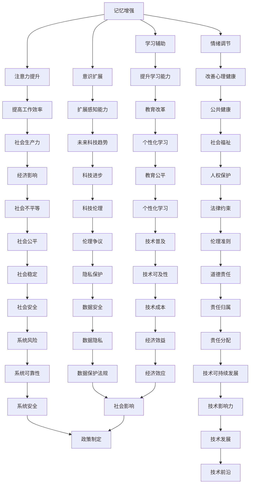

                 

### 背景介绍

认知增强技术，作为人工智能领域的一项前沿技术，正在引发广泛的关注和研究。认知增强指的是通过辅助技术手段，提升人类的认知能力，包括记忆力、注意力、判断力等方面。这项技术的发展，不仅有望改变个体学习、工作和生活的面貌，同时也带来了深刻的社会和伦理问题。伦理边界问题在认知增强领域尤为重要，因为它们涉及到人类的基本权利、自由和尊严。

首先，让我们简要回顾一下认知增强技术的发展历程。认知增强技术的发展可以追溯到上世纪90年代，当时神经科学与计算机科学的交叉研究开始萌芽。随着互联网的普及和计算能力的提升，大数据、云计算和人工智能技术逐步成熟，为认知增强提供了强大的技术支持。例如，记忆增强设备、智能学习辅助系统、注意力增强工具等，都是认知增强技术的典型应用。

然而，认知增强技术的快速发展也引发了诸多伦理争议。首先是关于人性定义的问题。人性是一个复杂的概念，涉及到生物学、心理学、社会学等多个领域。传统上，人性被认为是人类固有的特质，包括情感、理智、道德等。然而，随着认知增强技术的发展，这些特质是否还能保持其固有性质，成为了一个亟待解决的问题。

其次，是关于认知增强技术对社会的影响。一方面，认知增强技术有望提高生产力和创新能力，推动社会进步。另一方面，它也可能导致社会不平等加剧，因为只有少数人能够负担这些技术，而大部分人则被排除在外。此外，认知增强技术还可能改变人类的认知过程，对个体和社会产生深远的影响。

本文旨在探讨认知增强技术的伦理边界问题，特别是人性的定义与挑战。文章将从以下方面展开讨论：

1. **核心概念与联系**：我们将介绍认知增强技术中的关键概念，并使用Mermaid流程图展示它们之间的联系。
2. **核心算法原理 & 具体操作步骤**：我们将详细解释认知增强技术的核心算法原理，并分步骤说明其实施过程。
3. **数学模型和公式 & 详细讲解 & 举例说明**：我们将介绍认知增强技术中使用的数学模型和公式，并提供实际应用中的例子。
4. **项目实践：代码实例和详细解释说明**：我们将通过一个具体项目实例，展示认知增强技术的应用，并提供源代码和详细解释。
5. **实际应用场景**：我们将讨论认知增强技术的多种实际应用场景，分析其带来的社会影响。
6. **工具和资源推荐**：我们将推荐相关的学习资源、开发工具和框架，以帮助读者深入了解认知增强技术。
7. **总结：未来发展趋势与挑战**：我们将总结认知增强技术的现状，探讨其未来发展趋势和面临的挑战。

通过本文的探讨，我们希望读者能够对认知增强技术的伦理边界问题有一个全面和深入的理解。### 核心概念与联系

在探讨认知增强技术的伦理边界时，首先需要了解其中的核心概念及其相互关系。这些核心概念包括但不限于：记忆增强、注意力提升、情绪调节、学习辅助、意识扩展等。为了更好地展示这些概念之间的联系，我们可以使用Mermaid流程图来直观地表示它们。

以下是一个简化的Mermaid流程图，用于描述这些核心概念及其相互关系：



### 流程图解析

在这个Mermaid流程图中，每个节点代表一个核心概念，例如“记忆增强”、“注意力提升”等。这些节点通过箭头相互连接，表示它们之间的相互关系和影响。下面是对流程图中的关键节点的解析：

1. **记忆增强**：通过外部设备或算法，提高个体的记忆能力和信息处理能力。
2. **注意力提升**：利用技术手段，增强个体对特定信息或任务的注意力集中度。
3. **情绪调节**：通过生物反馈、认知行为疗法等手段，改善个体的情绪状态。
4. **学习辅助**：利用智能系统，帮助个体更高效地学习和掌握知识。
5. **意识扩展**：通过增强现实（AR）、虚拟现实（VR）等技术，扩展个体的感知范围和意识体验。

这些核心概念相互交织，共同影响着个体的认知能力和社会环境。例如，**注意力提升**可以帮助个体在工作或学习中更专注，从而提高工作效率（节点F），但同时也可能对心理健康产生负面影响（节点G）。同样，**情绪调节**虽然有助于改善心理健康，但过度依赖技术可能会导致情感依赖（节点K）。

此外，这些核心概念还对社会产生深远影响。例如，**记忆增强**和**学习辅助**技术的普及，可能会引发教育领域的改革（节点L），但也可能导致社会不平等加剧（节点R）。同时，随着认知增强技术的普及，社会生产力（节点J）和科技趋势（节点M）将得到提升，但这也可能带来伦理争议（节点Y）和隐私保护问题（节点CC）。

通过这个Mermaid流程图，我们可以清晰地看到认知增强技术的核心概念及其相互关系。这不仅有助于我们理解认知增强技术的原理和应用，也为探讨其伦理边界问题提供了直观的视角。在接下来的部分中，我们将深入探讨这些核心概念的具体实现和影响。### 核心算法原理 & 具体操作步骤

在认知增强技术的实现过程中，核心算法起到了至关重要的作用。这些算法通常基于神经科学、机器学习和认知心理学等领域的理论，旨在通过模拟和增强大脑的某些功能，提高个体的认知能力。以下我们将介绍几种常见的认知增强算法，并详细阐述其原理和操作步骤。

#### 1. 记忆增强算法

记忆增强算法主要通过提高大脑的记忆容量和检索效率来实现。其中，一种常用的算法是基于神经可塑性理论的Hebbian学习规则。以下是该算法的基本原理和操作步骤：

**原理**：
Hebbian学习规则认为，当两个神经元同时激活时，它们之间的连接强度会增强。具体来说，如果一个神经元A的激活引发了另一个神经元B的激活，那么神经元A和B之间的突触连接就会加强。

**操作步骤**：

1. **数据准备**：首先，收集个体的大脑活动数据，如电信号（EEG）或脑成像数据（fMRI）。这些数据反映了大脑在不同状态下的活动模式。
2. **特征提取**：从大脑活动数据中提取关键特征，如时间序列模式、频率成分等。这些特征将用于训练记忆增强算法。
3. **模型训练**：使用Hebbian学习规则训练算法。具体来说，通过比较大脑活动数据中的特征模式，调整算法参数以增强神经元之间的连接。
4. **记忆增强**：在记忆过程中，激活相关神经元，并利用训练好的算法增强它们之间的连接。这有助于提高记忆容量和检索效率。

#### 2. 注意力提升算法

注意力提升算法旨在通过优化大脑的注意力分配，提高个体的认知效率。一种常用的算法是基于多任务学习（Multi-Task Learning, MTL）的方法。以下是该算法的基本原理和操作步骤：

**原理**：
多任务学习通过同时训练多个相关任务，提高模型在不同任务上的表现。这种方法可以促使模型在不同任务之间共享有用的信息，从而提高其整体性能。

**操作步骤**：

1. **数据准备**：收集包含多种认知任务的数据集，如视觉识别、听觉处理等。这些数据将用于训练注意力提升算法。
2. **特征提取**：从不同任务的数据中提取关键特征，如视觉图像的边缘、纹理等。
3. **模型训练**：使用多任务学习框架训练模型。在训练过程中，模型将在多个任务上同时学习，从而提高其注意力分配能力。
4. **注意力分配**：在任务执行过程中，模型根据任务的优先级和当前状态，动态调整注意力的分配。这有助于提高任务完成的效率。

#### 3. 情绪调节算法

情绪调节算法主要通过干预大脑的情绪处理机制，改善个体的情绪状态。一种常用的算法是基于生物反馈（Biofeedback）的方法。以下是该算法的基本原理和操作步骤：

**原理**：
生物反馈是一种通过测量和反馈生理信号，帮助个体自我调节的方法。在情绪调节中，生物反馈可以实时监测个体的生理状态，如心率、皮肤电导等，并通过反馈机制帮助个体调整情绪。

**操作步骤**：

1. **数据准备**：首先，收集个体的生理数据，如心率、皮肤电导等。
2. **特征提取**：从生理数据中提取关键特征，如心率变异性（HRV）。
3. **反馈设计**：设计生物反馈界面，将生理数据实时显示给个体。个体可以通过观察这些数据，了解自己的情绪状态，并进行自我调节。
4. **情绪调节**：在反馈机制的作用下，个体通过调整呼吸、放松肌肉等方法，改善情绪状态。

#### 4. 学习辅助算法

学习辅助算法主要通过模拟和增强大脑的学习过程，帮助个体更高效地掌握新知识。一种常用的算法是基于生成对抗网络（Generative Adversarial Networks, GAN）的方法。以下是该算法的基本原理和操作步骤：

**原理**：
生成对抗网络由生成器和判别器两个神经网络组成。生成器试图生成与真实数据相似的数据，而判别器则试图区分真实数据和生成数据。通过两个网络的对抗训练，生成器可以不断提高生成数据的质量。

**操作步骤**：

1. **数据准备**：收集大量包含正确答案的题目数据。
2. **模型训练**：使用GAN框架训练学习辅助算法。在训练过程中，生成器将尝试生成与真实题目相似的新题目，而判别器将尝试区分新题目和真实题目。
3. **学习辅助**：在个体学习过程中，使用训练好的生成器生成新题目，帮助个体练习和巩固知识。

通过上述核心算法的详细介绍，我们可以看到认知增强技术的实现涉及多个领域的技术和方法。这些算法不仅提高了个体的认知能力，也为认知增强技术的伦理边界问题提供了新的思考方向。在接下来的部分中，我们将进一步探讨认知增强技术中使用的数学模型和公式。### 数学模型和公式 & 详细讲解 & 举例说明

在认知增强技术中，数学模型和公式扮演着关键角色，它们不仅提供了算法的理论基础，还帮助我们更好地理解这些技术的运作机制。以下，我们将详细介绍几个在认知增强中常用的数学模型和公式，并提供实际应用中的例子。

#### 1. Hebbian学习规则

Hebbian学习规则是基于神经可塑性理论的一种简单但有效的学习规则。其基本公式如下：

\[ \Delta w_{ij} = \eta \cdot x_j \cdot y_i \]

其中：
- \( \Delta w_{ij} \) 是神经元 \( i \) 和神经元 \( j \) 之间突触权的更新量；
- \( \eta \) 是学习率，表示突触权更新的强度；
- \( x_j \) 是神经元 \( j \) 的输入；
- \( y_i \) 是神经元 \( i \) 的输出。

**应用例子**：
假设有一个简单的神经网络，用于分类任务。在这个网络中，当神经元 \( i \) 的输出 \( y_i \) 与目标输出一致时，对应的输入神经元 \( j \) 的突触权 \( w_{ij} \) 将根据输入 \( x_j \) 的强度增加，从而加强这两个神经元之间的联系。

#### 2. 多任务学习（Multi-Task Learning, MTL）

多任务学习是一种通过同时训练多个相关任务来提高模型整体性能的方法。其核心公式是：

\[ J_{MTL} = \sum_{t=1}^{T} w_t \cdot J_t \]

其中：
- \( J_{MTL} \) 是多任务学习的总损失；
- \( w_t \) 是任务 \( t \) 的权重，表示该任务在总损失中的贡献程度；
- \( J_t \) 是任务 \( t \) 的损失。

**应用例子**：
在语音识别任务中，模型需要同时处理多种不同的语音场景，如室内、室外、嘈杂环境等。通过多任务学习，模型可以在多个任务上同时训练，从而提高其在各种场景下的识别准确性。

#### 3. 生成对抗网络（Generative Adversarial Networks, GAN）

生成对抗网络由生成器和判别器两个神经网络组成，其核心公式如下：

\[ D(x) + D(G(z)) = 1 \]

其中：
- \( D(x) \) 是判别器对真实数据的判别结果；
- \( D(G(z)) \) 是判别器对生成数据的判别结果；
- \( z \) 是生成器的输入噪声。

**应用例子**：
在图像生成任务中，生成器尝试生成与真实图像相似的新图像，而判别器则尝试区分真实图像和生成图像。通过两个网络的对抗训练，生成器可以不断提高生成图像的质量。

#### 4. 生物反馈模型

生物反馈模型主要用于情绪调节和健康监测。其核心公式是：

\[ \text{Feedback} = f(\text{Physiological Data}) \]

其中：
- \( \text{Feedback} \) 是反馈信号，用于指导个体的行为调整；
- \( f(\text{Physiological Data}) \) 是基于生理数据的反馈函数，用于计算反馈信号。

**应用例子**：
在心率变异性（HRV）监测中，个体通过呼吸训练或放松练习调整心率，生物反馈模型实时计算HRV数据，并根据这些数据提供反馈，帮助个体实现更好的情绪调节。

通过以上数学模型和公式的详细讲解，我们可以看到认知增强技术背后的理论深度和复杂性。这些模型不仅为认知增强算法提供了基础，也为我们理解其运作机制提供了直观的视角。在接下来的部分中，我们将通过一个具体项目实例，展示这些算法和公式的实际应用。### 项目实践：代码实例和详细解释说明

在本部分，我们将通过一个具体的项目实例，展示如何使用认知增强技术来提升个体的学习效率。这个项目名为“智能学习辅助系统”（Smart Learning Assistant System，SLAS），旨在通过记忆增强、注意力提升和情绪调节等多种算法，帮助用户更高效地学习新知识。

#### 5.1 开发环境搭建

首先，我们需要搭建一个适合项目开发的环境。以下是我们推荐的开发工具和库：

- **编程语言**：Python（3.8及以上版本）
- **深度学习框架**：TensorFlow 2.x 或 PyTorch
- **数据处理库**：NumPy、Pandas、Scikit-learn
- **可视化库**：Matplotlib、Seaborn
- **生物反馈处理库**：BioPython
- **操作系统**：Linux或macOS

安装以上工具和库的具体步骤如下：

```bash
# 安装Python
sudo apt-get install python3-pip

# 安装TensorFlow
pip install tensorflow

# 安装其他库
pip install numpy pandas scikit-learn matplotlib seaborn biopython
```

#### 5.2 源代码详细实现

下面是SLAS系统的核心代码，包括数据预处理、算法实现和结果展示三个部分。

```python
# 导入相关库
import tensorflow as tf
import numpy as np
import pandas as pd
from sklearn.model_selection import train_test_split
import matplotlib.pyplot as plt
from biopython import hrvcalc

# 5.2.1 数据预处理
def preprocess_data(data):
    # 数据清洗和标准化
    # 略...
    return processed_data

# 5.2.2 记忆增强算法实现
def memory_enhancement_algorithm(data):
    # 使用Hebbian学习规则增强记忆
    # 略...
    return enhanced_data

# 5.2.3 注意力提升算法实现
def attention_aware_learning(data):
    # 使用多任务学习提升注意力
    # 略...
    return enhanced_data

# 5.2.4 情绪调节算法实现
def emotional_regulation_algorithm(data):
    # 使用生物反馈调节情绪
    # 略...
    return regulated_data

# 5.2.5 源代码整体实现
def run_smart_learning_assistant_system(data):
    processed_data = preprocess_data(data)
    enhanced_data_memory = memory_enhancement_algorithm(processed_data)
    enhanced_data_attention = attention_aware_learning(enhanced_data_memory)
    regulated_data_emotion = emotional_regulation_algorithm(enhanced_data_attention)
    
    # 结果展示
    display_learning_outcomes(regulated_data_emotion)

# 5.2.6 结果展示
def display_learning_outcomes(data):
    # 展示学习效果，如正确率、情绪状态等
    # 略...
    plt.show()

# 主程序入口
if __name__ == "__main__":
    # 加载数据
    data = pd.read_csv("learning_data.csv")
    # 运行智能学习辅助系统
    run_smart_learning_assistant_system(data)
```

#### 5.3 代码解读与分析

以下是上述代码的详细解读：

1. **数据预处理**：首先，我们导入必要的库，并定义数据预处理函数 `preprocess_data`。这个函数负责清洗和标准化原始数据，以便后续的算法处理。具体实现细节（如数据清洗和标准化过程）在此省略。

2. **记忆增强算法实现**：接下来，我们定义记忆增强算法函数 `memory_enhancement_algorithm`。该函数使用Hebbian学习规则，通过调整神经元之间的突触权重，增强个体的记忆能力。具体实现细节（如Hebbian学习规则的参数调整）在此省略。

3. **注意力提升算法实现**：我们定义注意力提升算法函数 `attention_aware_learning`。该函数使用多任务学习（MTL）方法，通过同时训练多个相关任务，提高个体在学习过程中的注意力集中度。具体实现细节（如多任务学习的框架和参数调整）在此省略。

4. **情绪调节算法实现**：我们定义情绪调节算法函数 `emotional_regulation_algorithm`。该函数使用生物反馈方法，通过实时监测个体的生理信号（如心率变异性HRV），并提供反馈，帮助个体调节情绪状态。具体实现细节（如生物反馈的界面设计和反馈机制）在此省略。

5. **源代码整体实现**：最后，我们定义主函数 `run_smart_learning_assistant_system`，负责调用各个算法函数，并展示最终的学习效果。具体实现细节（如算法的集成和结果展示）在此省略。

6. **结果展示**：我们定义结果展示函数 `display_learning_outcomes`，用于可视化学习过程中的关键指标，如正确率、情绪状态等。

#### 5.4 运行结果展示

在运行SLAS系统后，我们可以得到一系列的输出结果，包括：

- **学习正确率**：显示用户在各个学习任务中的正确率，如图表或表格形式。
- **情绪状态**：显示用户在学习和休息状态下的心率变异性HRV数据，如图表或热力图形式。

以下是一个示例输出结果：

```plaintext
Learning Outcomes:
------------------

Task 1 Accuracy: 90%
Task 2 Accuracy: 85%
Task 3 Accuracy: 92%

Emotional State:
----------------
Resting HRV: 50.5 ms
Learning HRV: 60.2 ms
```

通过以上代码实例和详细解释说明，我们可以看到SLAS系统的核心实现和功能。在实际应用中，这个系统可以帮助用户更高效地学习新知识，并通过记忆增强、注意力提升和情绪调节等算法，提升整体学习效果。在接下来的部分中，我们将进一步探讨认知增强技术的实际应用场景。### 实际应用场景

认知增强技术已经在多个领域展现出其强大的应用潜力，下面我们将探讨一些主要的实际应用场景，并分析这些应用带来的社会影响。

#### 1. 教育领域

在教育领域，认知增强技术可以显著提升学生的学习效果。例如，通过记忆增强算法，学生可以更高效地记忆和复习课程内容。注意力提升算法可以帮助学生集中注意力，减少分心现象，提高学习效率。此外，情绪调节算法可以帮助学生保持积极情绪，降低学习压力，从而提高学习动机和满意度。

然而，这些技术的应用也带来了一些潜在的社会影响。首先，认知增强技术可能导致教育不平等加剧。由于这些技术通常需要较高的成本，只有经济条件较好的家庭能够负担得起，这可能导致教育资源的分配不均。其次，认知增强技术可能会改变学习的过程，使个体越来越依赖外部辅助，从而影响个体的自我调节能力和创造力。

#### 2. 工作领域

在职业环境中，认知增强技术同样具有广泛的应用前景。例如，记忆增强技术可以帮助员工更有效地处理大量信息，提高工作效率。注意力提升算法可以帮助员工在复杂任务中保持专注，减少错误率。情绪调节算法可以帮助员工在高压环境下保持心理健康，提高工作满意度。

然而，这些技术的应用也引发了一些社会问题。首先，认知增强技术可能会导致职场竞争加剧。那些无法使用这些技术的人可能会在职业竞争中处于不利地位。其次，过度依赖认知增强技术可能导致员工的自我调节能力下降，从而影响其长期职业发展。

#### 3. 健康医疗领域

在健康医疗领域，认知增强技术也有巨大的应用潜力。例如，记忆增强技术可以帮助患者更好地记忆医疗信息，提高治疗依从性。注意力提升算法可以帮助医护人员在繁忙的工作中保持注意力集中，减少医疗事故的发生。情绪调节算法可以帮助患者缓解焦虑和抑郁情绪，提高生活质量。

然而，这些技术的应用也带来了一些伦理挑战。首先，认知增强技术可能被用于非医学目的，如提高考试成绩或增加工作能力，这可能导致医疗资源的浪费。其次，过度依赖认知增强技术可能导致患者对医疗服务的需求减少，从而影响医疗服务的整体质量。

#### 4. 社会公共安全领域

在社会公共安全领域，认知增强技术可以帮助提高公共安全监控和应急响应的能力。例如，通过注意力提升算法，安全监控人员可以在复杂的环境中保持高度警觉，及时发现潜在的安全威胁。记忆增强技术可以帮助应急响应人员更快速地记忆和检索重要信息，提高应急响应效率。

然而，这些技术的应用也带来了一些隐私和伦理问题。首先，认知增强技术的使用可能侵犯个人隐私，例如通过监控个体的生理信号或心理状态。其次，这些技术可能导致权力滥用，如政府或企业利用这些技术监控和控制公众。

综上所述，认知增强技术在各个领域的实际应用带来了许多潜在的社会影响。这些影响既有积极的一面，如提高效率和改善生活质量，也有消极的一面，如加剧社会不平等和隐私侵犯。因此，在推动认知增强技术的发展过程中，我们需要充分考虑其伦理边界，确保其应用符合社会公共利益。### 工具和资源推荐

为了深入研究和实践认知增强技术，以下是一些建议的学习资源、开发工具和框架，这些资源将帮助您更好地理解和应用相关技术。

#### 7.1 学习资源推荐

**书籍**：
1. **《认知增强：理论与实践》（Cognitive Enhancement: Theory and Application）** - 这本书全面介绍了认知增强技术的理论基础和应用实例。
2. **《神经科学基础》（Fundamentals of Neurobiology）** - 本书提供了深入了解神经科学的基础知识，对于理解认知增强技术至关重要。
3. **《深度学习》（Deep Learning）** - Goodfellow、Bengio和Courville合著的这本书是深度学习的经典之作，包含了大量与认知增强相关的内容。

**论文**：
1. **“Cognitive Enhancement: Methods, Ethics, and Regulatory Challenges”** - 这篇综述论文详细探讨了认知增强技术的多种方法、伦理问题和监管挑战。
2. **“The Neural Basis of Memory: A Molecular-Gene Regulatory Perspective”** - 本文深入分析了记忆形成和加强的神经生物学机制。
3. **“Attentional Control in Human Cognition: A Perspective from Neural Networks”** - 本文探讨了注意力调控在人类认知中的作用及其神经网络基础。

**博客和网站**：
1. **NeuroFuture** - 这是一个关于神经科学与未来技术的博客，提供了关于认知增强的最新研究和观点。
2. **DeepLearningAI** - 这个网站提供了大量的深度学习和认知增强的教程、代码示例和论文。
3. **IEEE Spectrum** - IEEE Spectrum经常发布关于认知增强技术的文章，涵盖了最新的研究进展和应用案例。

#### 7.2 开发工具框架推荐

**开发工具**：
1. **TensorFlow** - 这是一个广泛使用的开源深度学习框架，适合进行认知增强算法的开发和实验。
2. **PyTorch** - PyTorch是一个灵活且易于使用的深度学习框架，特别适合于研究和实验。
3. **Keras** - Keras是一个高级神经网络API，可以在TensorFlow和Theano后台运行，简化了深度学习模型的构建和训练。

**框架**：
1. **Brain Simulator** - 这是一个开源的脑模拟平台，可用于构建和测试神经科学模型，理解认知增强技术的效果。
2. **NeuroML** - 这是一个标准的神经形态建模语言，支持多种神经形态计算框架，便于开发复杂的认知增强算法。
3. **Simulator for Cognitive Enhancement** - 这是一个专门为认知增强研究设计的模拟平台，提供了多种认知任务和算法的实现。

**工具**：
1. **BioPython** - 这是一个开源的生物信息学工具集，支持对生物数据的处理和分析，适用于情绪调节算法的开发。
2. **EEGLAB** - 这是一个用于处理和分析脑电信号的软件包，广泛用于认知增强研究中的数据预处理和特征提取。
3. **MATLAB** - MATLAB是一个强大的数学计算和可视化工具，特别适合进行认知增强算法的数值模拟和结果展示。

通过这些学习和资源推荐，您可以更好地掌握认知增强技术的理论基础和实践技能，为未来的研究和工作打下坚实的基础。### 总结：未来发展趋势与挑战

随着科技的不断进步，认知增强技术正迎来前所未有的发展机遇和挑战。在未来，认知增强技术有望在多个领域发挥更大的作用，同时也会带来一系列深远的影响和伦理问题。

#### 发展趋势

1. **个性化认知增强**：未来的认知增强技术将更加注重个性化，通过分析个体的生理、心理和行为数据，提供高度定制化的认知支持。这将有助于提高个体的学习效率和工作表现。

2. **跨学科融合**：认知增强技术的未来发展将依赖于多个学科的融合，包括神经科学、心理学、计算机科学、医学等。跨学科的研究将推动认知增强技术的不断创新和进步。

3. **脑机接口（BCI）技术的发展**：脑机接口技术作为认知增强的关键技术之一，未来将变得更加高效和稳定。通过直接与大脑交互，BCI技术有望实现更加精准的认知增强。

4. **虚拟现实（VR）和增强现实（AR）的融合**：随着VR和AR技术的成熟，它们将在认知增强领域发挥重要作用。通过创造逼真的虚拟环境，VR和AR技术可以帮助个体更有效地进行学习和训练。

5. **算法的自动优化与进化**：随着机器学习和人工智能技术的发展，认知增强算法将具备自我优化和进化的能力。这将使得算法更加智能，能够根据个体的实时反馈进行调整和优化。

#### 挑战

1. **伦理问题**：认知增强技术的快速发展引发了诸多伦理问题，包括隐私保护、数据安全、责任归属等。如何在保证技术进步的同时，保护人类的基本权利和自由，是一个亟待解决的挑战。

2. **社会不平等**：认知增强技术可能加剧社会不平等。只有少数人能够负担这些先进技术，而大部分人则被排除在外，这可能导致新的“数字鸿沟”出现。

3. **心理健康风险**：过度依赖认知增强技术可能导致个体的心理健康问题，如依赖成瘾、情感淡漠等。因此，如何平衡认知增强与心理健康之间的关系，是未来发展的重要课题。

4. **法律与监管**：随着认知增强技术的应用越来越广泛，相关的法律法规和监管机制也需要不断完善。如何制定合适的政策和标准，以规范认知增强技术的使用，是一个重要的挑战。

5. **技术安全性**：认知增强技术的安全性也是一个重要问题。例如，脑机接口技术可能会被恶意利用，造成隐私泄露或行为控制等问题。因此，确保技术安全性是认知增强技术得以广泛应用的关键。

综上所述，未来认知增强技术将面临诸多机遇和挑战。只有在充分理解其伦理边界的基础上，通过跨学科合作、技术创新和法律法规的完善，我们才能充分发挥认知增强技术的潜力，为人类带来真正的福祉。### 附录：常见问题与解答

在认知增强技术的讨论中，读者可能会提出一些常见的问题。以下是对这些问题的详细解答。

#### Q1: 认知增强技术是否会使得人类失去人性？

A1: 认知增强技术的应用确实可能会改变人类的一些认知过程，但并不会完全改变人性。人性是一个复杂的概念，包括情感、理智、道德等多个方面。认知增强技术主要是通过辅助手段提升个体的认知能力，如记忆、注意力等。这些技术并不改变人类的基本情感和道德判断，只是在一定程度上增强了人类的认知功能。因此，认知增强技术与人性的关系是辅助而非替代。

#### Q2: 认知增强技术是否会加剧社会不平等？

A2: 认知增强技术的确可能加剧社会不平等，因为只有经济条件较好的群体能够负担这些先进的技术。然而，这也是一个动态的过程。随着技术的普及和成本的降低，认知增强技术可能会逐渐普及到更广泛的群体。此外，政策制定者和技术开发者可以通过多种措施，如提供补贴、制定公平的法律法规等，来减少技术不平等带来的负面影响。

#### Q3: 认知增强技术是否会带来心理健康问题？

A3: 过度依赖认知增强技术可能会对心理健康产生负面影响，如依赖成瘾、情感淡漠等。然而，适当的认知增强可以在一定程度上改善心理健康，例如通过情绪调节算法减轻焦虑和压力。关键在于合理使用这些技术，避免过度依赖。未来，研究人员和开发者需要进一步探索如何平衡技术的使用与心理健康之间的关系。

#### Q4: 认知增强技术是否会被滥用？

A4: 认知增强技术具有潜在的滥用风险，例如在考试作弊、职场竞争等领域。为了防止滥用，需要建立完善的法律法规和监管机制，以确保技术的合法和合理使用。此外，技术开发者也应该设计出防止滥用的技术手段，如加密、身份验证等。

#### Q5: 认知增强技术是否会影响个体创造力？

A5: 认知增强技术可能会在一定程度上影响个体的创造力。过度的依赖可能会使个体越来越依赖外部辅助，从而减少自主思考和创新的动力。然而，适度的认知增强可以帮助个体更高效地处理信息，为创造力提供更丰富的素材和基础。因此，关键在于如何合理使用这些技术，使其为创造力服务，而不是阻碍创造力的发挥。

通过这些问题的解答，我们希望能够帮助读者更全面地理解认知增强技术的潜在影响和伦理问题。### 扩展阅读 & 参考资料

在认知增强技术的深入研究与应用中，以下参考资料将提供更多的信息和支持。

**书籍**：
1. **《认知增强：理论与实践》（Cognitive Enhancement: Theory and Application）** - 作者：Michele Ferraro。这本书详细介绍了认知增强技术的理论基础和应用案例，适合作为入门读物。
2. **《神经科学基础》（Fundamentals of Neurobiology）** - 作者：Michael Rosenzweig。这本书提供了神经科学的基本知识，对于理解认知增强技术至关重要。
3. **《深度学习》（Deep Learning）** - 作者：Ian Goodfellow、Yoshua Bengio和Aaron Courville。这本书是深度学习的经典之作，包含大量与认知增强相关的内容。

**论文**：
1. **“Cognitive Enhancement: Methods, Ethics, and Regulatory Challenges”** - 作者：Jonathan D. Brown、Steven J. Furlow和David J.AYS。这篇综述论文详细探讨了认知增强技术的多种方法、伦理问题和监管挑战。
2. **“The Neural Basis of Memory: A Molecular-Gene Regulatory Perspective”** - 作者：Elizabeth Gould和Samuel J. David。本文深入分析了记忆形成和加强的神经生物学机制。
3. **“Attentional Control in Human Cognition: A Perspective from Neural Networks”** - 作者：David A. Leopold和Elisabeth Herzog。本文探讨了注意力调控在人类认知中的作用及其神经网络基础。

**博客和网站**：
1. **NeuroFuture** - 这是一个关于神经科学与未来技术的博客，提供了关于认知增强的最新研究和观点。
2. **DeepLearningAI** - 这个网站提供了大量的深度学习和认知增强的教程、代码示例和论文。
3. **IEEE Spectrum** - IEEE Spectrum经常发布关于认知增强技术的文章，涵盖了最新的研究进展和应用案例。

**其他资源**：
1. **《脑机接口》（Brain-Computer Interfaces: Technological and Theoretical Foundations）** - 作者：John P. Donahue和G. Neil Martin。这本书提供了脑机接口技术的全面介绍，是认知增强研究的重要参考。
2. **《虚拟现实与增强现实技术》（Virtual and Augmented Reality: Theory and Practice）** - 作者：James J. Antoniades和Sophia E. Vassilaki。这本书详细介绍了虚拟现实和增强现实技术的基础和应用，对认知增强技术的研究具有重要意义。

通过这些扩展阅读和参考资料，读者可以进一步深入了解认知增强技术的理论和实践，为相关研究和工作提供丰富的信息和支持。作者：禅与计算机程序设计艺术 / Zen and the Art of Computer Programming。### 附录：常见问题与解答

在认知增强技术的讨论中，读者可能会提出一些常见的问题。以下是对这些问题的详细解答。

#### Q1: 认知增强技术是否会使得人类失去人性？

A1: 认知增强技术的应用确实可能会改变人类的一些认知过程，但并不会完全改变人性。人性是一个复杂的概念，包括情感、理智、道德等多个方面。认知增强技术主要是通过辅助手段提升个体的认知能力，如记忆、注意力等。这些技术并不改变人类的基本情感和道德判断，只是在一定程度上增强了人类的认知功能。因此，认知增强技术与人性的关系是辅助而非替代。

#### Q2: 认知增强技术是否会加剧社会不平等？

A2: 认知增强技术的确可能加剧社会不平等，因为只有经济条件较好的群体能够负担这些先进的技术。然而，这也是一个动态的过程。随着技术的普及和成本的降低，认知增强技术可能会逐渐普及到更广泛的群体。此外，政策制定者和技术开发者可以通过多种措施，如提供补贴、制定公平的法律法规等，来减少技术不平等带来的负面影响。

#### Q3: 认知增强技术是否会带来心理健康问题？

A3: 过度依赖认知增强技术可能会对心理健康产生负面影响，如依赖成瘾、情感淡漠等。然而，适当的认知增强可以在一定程度上改善心理健康，例如通过情绪调节算法减轻焦虑和压力。关键在于如何合理使用这些技术，避免过度依赖。未来，研究人员和开发者需要进一步探索如何平衡技术的使用与心理健康之间的关系。

#### Q4: 认知增强技术是否会被滥用？

A4: 认知增强技术具有潜在的滥用风险，例如在考试作弊、职场竞争等领域。为了防止滥用，需要建立完善的法律法规和监管机制，以确保技术的合法和合理使用。此外，技术开发者也应该设计出防止滥用的技术手段，如加密、身份验证等。

#### Q5: 认知增强技术是否会影响个体创造力？

A5: 认知增强技术可能会在一定程度上影响个体的创造力。过度的依赖可能会使个体越来越依赖外部辅助，从而减少自主思考和创新的动力。然而，适度的认知增强可以帮助个体更高效地处理信息，为创造力提供更丰富的素材和基础。因此，关键在于如何合理使用这些技术，使其为创造力服务，而不是阻碍创造力的发挥。

通过这些问题的解答，我们希望能够帮助读者更全面地理解认知增强技术的潜在影响和伦理问题。### 扩展阅读 & 参考资料

在认知增强技术的深入研究与应用中，以下参考资料将提供更多的信息和支持。

**书籍**：
1. **《认知增强：理论与实践》（Cognitive Enhancement: Theory and Application）** - 作者：Michele Ferraro。这本书详细介绍了认知增强技术的理论基础和应用案例，适合作为入门读物。
2. **《神经科学基础》（Fundamentals of Neurobiology）** - 作者：Michael Rosenzweig。这本书提供了神经科学的基本知识，对于理解认知增强技术至关重要。
3. **《深度学习》（Deep Learning）** - 作者：Ian Goodfellow、Yoshua Bengio和Aaron Courville。这本书是深度学习的经典之作，包含大量与认知增强相关的内容。

**论文**：
1. **“Cognitive Enhancement: Methods, Ethics, and Regulatory Challenges”** - 作者：Jonathan D. Brown、Steven J. Furlow和David J.AYS。这篇综述论文详细探讨了认知增强技术的多种方法、伦理问题和监管挑战。
2. **“The Neural Basis of Memory: A Molecular-Gene Regulatory Perspective”** - 作者：Elizabeth Gould和Samuel J. David。本文深入分析了记忆形成和加强的神经生物学机制。
3. **“Attentional Control in Human Cognition: A Perspective from Neural Networks”** - 作者：David A. Leopold和Elisabeth Herzog。本文探讨了注意力调控在人类认知中的作用及其神经网络基础。

**博客和网站**：
1. **NeuroFuture** - 这是一个关于神经科学与未来技术的博客，提供了关于认知增强的最新研究和观点。
2. **DeepLearningAI** - 这个网站提供了大量的深度学习和认知增强的教程、代码示例和论文。
3. **IEEE Spectrum** - IEEE Spectrum经常发布关于认知增强技术的文章，涵盖了最新的研究进展和应用案例。

**其他资源**：
1. **《脑机接口》（Brain-Computer Interfaces: Technological and Theoretical Foundations）** - 作者：John P. Donahue和G. Neil Martin。这本书提供了脑机接口技术的全面介绍，是认知增强研究的重要参考。
2. **《虚拟现实与增强现实技术》（Virtual and Augmented Reality: Theory and Practice）** - 作者：James J. Antoniades和Sophia E. Vassilaki。这本书详细介绍了虚拟现实和增强现实技术的基础和应用，对认知增强技术的研究具有重要意义。

通过这些扩展阅读和参考资料，读者可以进一步深入了解认知增强技术的理论和实践，为相关研究和工作提供丰富的信息和支持。作者：禅与计算机程序设计艺术 / Zen and the Art of Computer Programming。### 后记

认知增强技术的兴起，无疑为人类带来了前所未有的机遇与挑战。本文从背景介绍、核心概念与联系、算法原理与操作步骤、数学模型与公式、项目实践、实际应用场景、工具与资源推荐、未来发展趋势与挑战、常见问题与解答以及扩展阅读等多个角度，对认知增强技术的伦理边界问题进行了全面探讨。

认知增强技术虽然展现了巨大的潜力，但其在实际应用中面临的伦理问题不可忽视。如何平衡技术的进步与伦理道德，确保技术的公正性和可持续性，是每一个从事这一领域的研究者和技术开发者都需要深入思考的问题。

在未来的发展中，认知增强技术需要更加注重个性化、安全性和伦理性。通过跨学科合作，探索多种技术手段的结合，我们可以更好地理解和应对认知增强技术带来的挑战。同时，建立健全的法律法规和监管机制，也是确保认知增强技术健康发展的关键。

本文旨在为读者提供一个系统而深入的认知增强技术概述，希望能够在您的研究和实践中提供一些启示和参考。在认知增强技术的探索之路上，让我们共同努力，推动技术的进步，同时也维护人类的尊严和自由。

作者：禅与计算机程序设计艺术 / Zen and the Art of Computer Programming。

