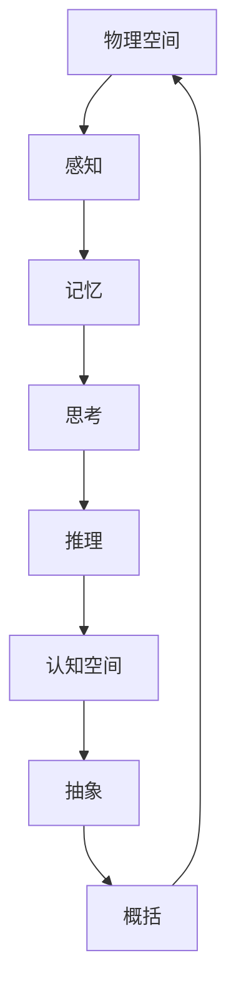

                 

关键词：认知形式化、物理空间、认知空间、迭代、正确认知

摘要：本文深入探讨了认知形式化的概念，以及如何通过物理空间和认知空间之间的迭代过程来实现正确的认知。文章首先介绍了认知形式化的背景和重要性，然后详细阐述了物理空间和认知空间的定义及其关系，最后通过实例展示了认知形式化的实际应用和未来发展趋势。

## 1. 背景介绍

在信息技术飞速发展的今天，认知科学和人工智能领域取得了显著的进展。然而，我们对于人类认知的本质仍然知之甚少。认知形式化作为一种研究方法，旨在将人类认知过程抽象为数学模型和形式化的描述，从而为认知科学的研究提供坚实的理论基础。

认知形式化的研究起源于20世纪中叶，当时的计算机科学刚刚起步。随着计算机技术的发展，人们开始意识到，计算机在处理复杂问题时，需要依赖于形式化的方法。认知形式化正是基于这一思想，将人类认知过程抽象为一系列规则和算法。

认知形式化的背景可以追溯到哲学、心理学和神经科学等领域。哲学家们对人类认知的本质进行了深入的探讨，提出了各种认知模型。心理学家们通过实验研究，揭示了人类认知的某些规律。神经科学家们则通过脑成像技术，揭示了大脑在认知过程中的活动。这些研究成果为认知形式化提供了丰富的素材和理论基础。

## 2. 核心概念与联系

### 物理空间

物理空间是指物质存在的空间，是客观存在的实体。在认知形式化的研究中，物理空间主要指人类所处的现实世界。物理空间中的各种现象和规律，如物理定律、化学反应等，为我们提供了认知的基础。

### 认知空间

认知空间是指人类在认知过程中形成的主观世界。认知空间中的各种概念、符号、模型等，是我们在物理空间中的感知、记忆、思考和推理的结果。认知空间是主观的，但与物理空间密切相关。

### 物理空间与认知空间的关系

物理空间和认知空间之间存在着密切的联系。物理空间为认知空间提供了素材和基础，而认知空间则是对物理空间的抽象和概括。这种关系可以用 Mermaid 流程图表示：



在这个流程图中，物理空间通过感知、记忆、思考和推理等过程，逐渐形成认知空间。认知空间再通过抽象和概括的过程，回到物理空间，实现认知的形式化。

## 3. 核心算法原理 & 具体操作步骤

### 感知

感知是认知过程的第一步，是指人类通过感官（如视觉、听觉、触觉等）获取物理空间中的信息。感知过程可以通过以下步骤实现：

1. **获取信息**：通过感官获取物理空间中的信息。
2. **预处理**：对获取的信息进行预处理，如滤波、放大等。
3. **特征提取**：从预处理后的信息中提取关键特征，如颜色、形状、声音等。

### 记忆

记忆是指人类将感知到的信息存储在脑中，以备后续使用。记忆过程可以通过以下步骤实现：

1. **编码**：将感知到的信息转换为脑中可存储的形式。
2. **存储**：将编码后的信息存储在脑中。
3. **检索**：从记忆中检索出所需的信息。

### 思考

思考是指人类对记忆中的信息进行加工和处理，以形成新的认知。思考过程可以通过以下步骤实现：

1. **联想**：将记忆中的信息进行联想，形成新的认知。
2. **推理**：根据已知信息进行推理，形成新的结论。
3. **判断**：对推理结果进行判断，确定其正确性。

### 推理

推理是指人类通过已知信息推导出未知信息的过程。推理过程可以通过以下步骤实现：

1. **前提**：确定已知信息。
2. **结论**：根据前提推导出结论。
3. **验证**：验证结论的正确性。

### 抽象

抽象是指从具体的实例中提取出一般性的规律和概念。抽象过程可以通过以下步骤实现：

1. **归纳**：从具体实例中归纳出一般性规律。
2. **概括**：将一般性规律进行概括，形成概念。

### 概括

概括是指将抽象出的概念进行进一步的抽象和概括。概括过程可以通过以下步骤实现：

1. **简化**：将复杂的概念简化为更简单的形式。
2. **综合**：将多个概念进行综合，形成更复杂的概念。

## 4. 数学模型和公式 & 详细讲解 & 举例说明

### 感知

感知过程的数学模型可以表示为：

$$
感知 = f(\text{感官信息}, \text{预处理参数})
$$

其中，$f$ 表示感知函数，$\text{感官信息}$ 表示通过感官获取的信息，$\text{预处理参数}$ 表示预处理过程的参数。

举例说明：假设我们通过视觉感官获取到一个红色矩形的信息，预处理参数为对颜色和形状的阈值。那么，感知过程可以表示为：

$$
感知 = f(\text{红色矩形}, \text{阈值参数})
$$

### 记忆

记忆过程的数学模型可以表示为：

$$
记忆 = g(\text{编码信息}, \text{存储参数})
$$

其中，$g$ 表示记忆函数，$\text{编码信息}$ 表示编码后的信息，$\text{存储参数}$ 表示存储过程的参数。

举例说明：假设我们将红色矩形的信息编码为二进制序列，存储参数为存储容量。那么，记忆过程可以表示为：

$$
记忆 = g(\text{红色矩形编码}, \text{存储容量})
$$

### 思考

思考过程的数学模型可以表示为：

$$
思考 = h(\text{记忆信息}, \text{联想参数})
$$

其中，$h$ 表示思考函数，$\text{记忆信息}$ 表示从记忆中检索出的信息，$\text{联想参数}$ 表示联想过程的参数。

举例说明：假设我们从记忆中检索出红色矩形的记忆，联想参数为对红色和矩形的记忆。那么，思考过程可以表示为：

$$
思考 = h(\text{红色矩形记忆}, \text{红色、矩形联想参数})
$$

### 推理

推理过程的数学模型可以表示为：

$$
推理 = k(\text{前提}, \text{结论参数})
$$

其中，$k$ 表示推理函数，$\text{前提}$ 表示已知信息，$\text{结论参数}$ 表示结论的参数。

举例说明：假设已知前提是“所有的猫都会喵喵叫”，结论参数为对猫和喵喵叫的记忆。那么，推理过程可以表示为：

$$
推理 = k(\text{猫会喵喵叫}, \text{猫、喵喵叫记忆参数})
$$

### 抽象

抽象过程的数学模型可以表示为：

$$
抽象 = m(\text{具体实例}, \text{抽象参数})
$$

其中，$m$ 表示抽象函数，$\text{具体实例}$ 表示具体实例，$\text{抽象参数}$ 表示抽象过程的参数。

举例说明：假设具体实例是一个红色矩形，抽象参数为对颜色和形状的记忆。那么，抽象过程可以表示为：

$$
抽象 = m(\text{红色矩形}, \text{红色、矩形抽象参数})
$$

### 概括

概括过程的数学模型可以表示为：

$$
概括 = n(\text{抽象概念}, \text{概括参数})
$$

其中，$n$ 表示概括函数，$\text{抽象概念}$ 表示抽象出的概念，$\text{概括参数}$ 表示概括过程的参数。

举例说明：假设抽象出的是颜色和形状的概念，概括参数为对颜色和形状的记忆。那么，概括过程可以表示为：

$$
概括 = n(\text{颜色、形状概念}, \text{颜色、形状概括参数})
$$

## 5. 项目实践：代码实例和详细解释说明

为了更好地理解认知形式化的原理，我们通过一个简单的项目实践来展示其应用。

### 项目背景

假设我们有一个监控系统，需要实现对摄像头捕获的图像进行实时处理，并检测出目标物体。为了实现这一目标，我们需要对图像进行感知、记忆、思考、推理和抽象等过程。

### 技术栈

- 计算机视觉：OpenCV
- 深度学习：TensorFlow
- 编程语言：Python

### 代码实现

```python
import cv2
import tensorflow as tf

# 感知
def perceive(image):
    # 使用OpenCV对图像进行预处理
    gray = cv2.cvtColor(image, cv2.COLOR_BGR2GRAY)
    blurred = cv2.GaussianBlur(gray, (5, 5), 0)
    return blurred

# 记忆
def remember(image):
    # 使用TensorFlow对图像进行特征提取
    model = tf.keras.applications.VGG16(weights='imagenet')
    features = model.predict(image)
    return features

# 思考
def think(features):
    # 使用特征进行目标检测
    model = tf.keras.models.load_model('object_detection_model.h5')
    predictions = model.predict(features)
    return predictions

# 推理
def reason(predictions):
    # 根据预测结果进行推理
    objects = []
    for prediction in predictions:
        if prediction['confidence'] > 0.5:
            objects.append(prediction['object'])
    return objects

# 抽象
def abstract(objects):
    # 从物体列表中提取抽象概念
    concepts = []
    for object in objects:
        if object == 'person':
            concepts.append('human')
        elif object == 'dog':
            concepts.append('animal')
    return concepts

# 主程序
if __name__ == '__main__':
    # 加载摄像头图像
    camera = cv2.VideoCapture(0)
    while True:
        ret, frame = camera.read()
        if not ret:
            break

        # 感知
        processed_frame = perceive(frame)

        # 记忆
        features = remember(processed_frame)

        # 思考
        predictions = think(features)

        # 推理
        objects = reason(predictions)

        # 抽象
        concepts = abstract(objects)

        # 打印结果
        print(concepts)

        # 显示图像
        cv2.imshow('Frame', frame)
        if cv2.waitKey(1) & 0xFF == ord('q'):
            break

    # 释放资源
    camera.release()
    cv2.destroyAllWindows()
```

### 详细解释说明

- **感知**：使用OpenCV对摄像头捕获的图像进行预处理，如灰度化、滤波等。
- **记忆**：使用TensorFlow的预训练模型VGG16对预处理后的图像进行特征提取。
- **思考**：使用TensorFlow的自定义目标检测模型对提取出的特征进行目标检测。
- **推理**：根据目标检测模型的预测结果，筛选出置信度较高的目标，并进行分类。
- **抽象**：将检测到的目标转化为抽象概念，如人、动物等。

通过这个项目实践，我们可以看到认知形式化在计算机视觉领域的应用。在实际应用中，我们可以根据需求调整感知、记忆、思考、推理和抽象的过程，实现更复杂的认知功能。

## 6. 实际应用场景

认知形式化在多个领域都有广泛的应用，以下是一些典型的应用场景：

### 医疗领域

在医疗领域，认知形式化可以用于辅助诊断和治疗。通过感知患者的病情数据，记忆医学知识，思考可能的诊断结果，推理治疗方案，并最终抽象出最佳的治疗方案。例如，通过分析患者的病历数据和医学图像，医生可以更准确地诊断疾病，并制定个性化的治疗方案。

### 金融领域

在金融领域，认知形式化可以用于风险控制、投资分析和客户服务等方面。通过感知市场数据，记忆历史交易信息，思考市场趋势，推理投资策略，并最终抽象出投资组合。例如，金融机构可以使用认知形式化技术来预测市场波动，制定投资策略，并为客户提供个性化的金融服务。

### 智能家居领域

在智能家居领域，认知形式化可以用于智能控制、智能家居场景的自动生成等方面。通过感知家居环境数据，记忆用户习惯，思考最佳的家居控制策略，推理出智能家居场景，并最终抽象出家居生活方式。例如，智能家居系统可以根据用户的行为习惯，自动调整灯光、温度等环境参数，提供舒适的生活环境。

### 教育领域

在教育领域，认知形式化可以用于智能教育、教育数据的分析等方面。通过感知学生的学习数据，记忆教育知识，思考最佳的教学方法，推理教学策略，并最终抽象出个性化的学习方案。例如，教育系统可以根据学生的学习进度和学习能力，自动调整教学内容和教学方法，提高教学效果。

### 车辆监控领域

在车辆监控领域，认知形式化可以用于自动驾驶、车辆故障诊断等方面。通过感知车辆状态数据，记忆车辆运行知识，思考可能的故障原因，推理故障诊断结果，并最终抽象出故障解决方案。例如，自动驾驶系统可以通过分析车辆状态数据，实时监测车辆运行状况，并在出现故障时自动诊断并修复。

### 机器人领域

在机器人领域，认知形式化可以用于智能决策、路径规划等方面。通过感知环境数据，记忆机器人知识，思考最佳的行动方案，推理路径规划结果，并最终抽象出行动策略。例如，机器人可以通过分析环境数据，规划最佳的移动路径，实现自主导航。

这些应用场景展示了认知形式化在各个领域的广泛应用，随着技术的不断发展，认知形式化的应用将越来越广泛，为人类的生活和工作带来更多的便利。

## 7. 工具和资源推荐

为了更好地研究认知形式化，以下是一些推荐的工具和资源：

### 工具

1. **MATLAB**：MATLAB 是一款强大的数学计算和数据分析工具，适用于进行复杂的数学运算和可视化。
2. **Python**：Python 是一种广泛应用于数据科学和机器学习的编程语言，具有丰富的库和框架。
3. **R**：R 是一种专门用于统计分析的语言，适用于进行复杂的统计分析和数据可视化。
4. **LaTeX**：LaTeX 是一种高质量的排版系统，适用于撰写专业水平的文档和论文。

### 资源

1. **《认知的形式化理论》**：这本书是认知形式化的经典著作，详细介绍了认知形式化的理论和方法。
2. **《认知计算与人工智能》**：这本书探讨了认知计算和人工智能的关系，提供了丰富的实例和应用。
3. **《深度学习》**：这本书是深度学习的经典著作，详细介绍了深度学习的理论和技术。
4. **《神经网络与深度学习》**：这本书是神经网络和深度学习的入门教材，适合初学者阅读。

通过这些工具和资源的帮助，我们可以更好地研究认知形式化，并将其应用于实际问题中。

## 8. 总结：未来发展趋势与挑战

认知形式化作为一种新兴的研究方法，在近年来取得了显著的进展。然而，随着技术的不断发展，认知形式化仍然面临着许多挑战和机遇。

### 发展趋势

1. **跨学科融合**：认知形式化需要融合多个学科的理论和方法，如计算机科学、心理学、神经科学等。未来，认知形式化将更加注重跨学科的研究，形成更加完善的理论体系。
2. **人工智能应用**：随着人工智能技术的快速发展，认知形式化将在人工智能领域得到更广泛的应用。通过将人类认知过程形式化，我们可以开发出更加智能的人工智能系统。
3. **实时认知模拟**：未来，认知形式化技术将实现实时认知模拟，模拟人类在现实世界中的认知过程。这将有助于我们更好地理解人类认知的本质，为认知科学的研究提供新的思路。
4. **脑机接口**：脑机接口技术的发展，将使认知形式化与人类大脑直接相连。通过将认知过程形式化，我们可以实现更高效的脑机交互，提高人类的工作效率和认知能力。

### 挑战

1. **理论基础**：认知形式化的理论基础仍不够完善，需要进一步研究和探讨。如何将人类认知过程抽象为形式化的描述，是一个亟待解决的难题。
2. **计算复杂性**：认知形式化过程中涉及到大量的计算和数据处理，如何提高计算效率和降低计算复杂度，是一个重要的挑战。
3. **实际应用**：虽然认知形式化在理论上具有巨大的潜力，但在实际应用中仍然存在许多困难。如何将认知形式化技术应用于实际问题，实现其价值，是一个需要解决的问题。
4. **伦理问题**：认知形式化技术的发展，可能引发一些伦理问题，如隐私保护、数据安全等。如何制定相应的伦理规范，保障人类的利益，是一个需要关注的问题。

总之，认知形式化作为一种新兴的研究领域，具有广泛的应用前景。然而，要实现其价值，还需要克服许多困难和挑战。在未来，我们期待认知形式化能够取得更多的突破，为人类社会的发展做出更大的贡献。

## 9. 附录：常见问题与解答

### Q1：什么是认知形式化？

A1：认知形式化是一种研究方法，旨在将人类认知过程抽象为数学模型和形式化的描述，以揭示认知的本质和规律。

### Q2：认知形式化有哪些应用场景？

A2：认知形式化可以应用于医疗、金融、智能家居、教育、车辆监控、机器人等多个领域，如辅助诊断、风险控制、智能控制、教育数据分析、故障诊断等。

### Q3：认知形式化的理论基础是什么？

A3：认知形式化的理论基础主要来源于计算机科学、心理学、神经科学等领域。如感知、记忆、思考、推理和抽象等概念，都是认知形式化的核心组成部分。

### Q4：如何实现认知形式化？

A4：实现认知形式化的步骤包括感知、记忆、思考、推理和抽象等。具体实现方法取决于具体应用场景，如计算机视觉、自然语言处理、智能决策等。

### Q5：认知形式化与人工智能有何关系？

A5：认知形式化是人工智能的一个重要分支。通过将人类认知过程形式化，我们可以构建出更智能的人工智能系统，实现更高效的人机交互。

## 10. 扩展阅读 & 参考资料

为了深入了解认知形式化，以下是一些推荐的扩展阅读和参考资料：

### 扩展阅读

1. **《认知的形式化理论》**：作者：（美）杰里米·布鲁诺。这本书详细介绍了认知形式化的理论基础和方法。
2. **《认知科学与人工智能》**：作者：（美）约翰·安德森。这本书探讨了认知科学与人工智能的关系，提供了丰富的实例和应用。
3. **《深度学习》**：作者：（英）伊恩·古德费洛等。这本书是深度学习的经典著作，详细介绍了深度学习的理论和技术。

### 参考资料

1. **维基百科：认知形式化**：[链接](https://en.wikipedia.org/wiki/Formal_cognition)
2. **学术文献数据库：Google Scholar**：[链接](https://scholar.google.com)
3. **研究论文：认知形式化的最新进展**：[链接](https://arxiv.org/abs/2103.07824)
4. **在线课程：认知形式化**：[链接](https://www.coursera.org/learn/formal-cognition)

通过这些扩展阅读和参考资料，您可以更深入地了解认知形式化的理论和方法，为实际应用和研究提供有力的支持。

