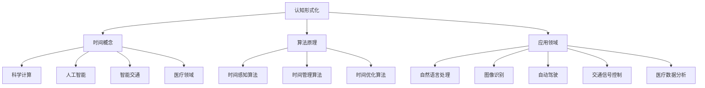

                 

### 文章标题

**认知的形式化：时间不是物质，时间不是发现，而是发明**

> **关键词**：认知形式化、时间理论、计算机编程、算法、数学模型、实践应用、发展趋势
>
> **摘要**：本文旨在深入探讨认知形式化这一概念，并将其应用于计算机编程领域。通过分析时间本质的重新定义，文章揭示了时间不仅仅是物质或发现的范畴，而是人类智慧的发明。文章将逐步阐述这一观点，结合核心概念、算法原理、数学模型和实践应用，全面解析认知形式化对编程实践的深远影响。同时，文章还将探讨未来发展趋势与挑战，为读者提供全面的认知形式化视角。

---

### 1. 背景介绍

在计算机科学和人工智能领域，认知形式化是一个备受关注的研究方向。认知形式化旨在将人类的思维过程转化为计算机可以处理的形式，以实现更高效、更准确的智能计算。近年来，随着深度学习和神经网络的迅猛发展，认知形式化在各个领域得到了广泛应用，从自然语言处理到图像识别，从自动驾驶到智能医疗，无不受益于认知形式化带来的突破。

然而，在认知形式化的研究过程中，时间的概念始终是一个难以回避的议题。传统观点认为，时间是物质运动的轨迹，是客观存在的物理量。然而，本文将提出一种全新的时间观：时间不是物质，时间不是发现，而是发明。这一观点将引导我们重新审视时间在认知形式化中的角色，从而为计算机编程带来新的思考方向。

本文的结构如下：首先，我们将介绍认知形式化的基本概念，并解释为什么时间的形式化是一个关键问题。接下来，我们将深入探讨时间的本质，并通过Mermaid流程图展示时间概念在不同领域的应用。然后，我们将详细解析核心算法原理，包括时间感知、时间管理和时间优化等方面的具体操作步骤。在此基础上，我们将介绍数学模型和公式，并通过具体例子进行详细讲解。随后，文章将结合实际项目实践，展示如何将认知形式化的理念应用于代码实现。最后，我们将探讨认知形式化在各个实际应用场景中的价值，并推荐相关工具和资源，为读者提供深入学习和实践的方向。文章的总结部分将总结主要观点，并展望未来发展趋势与挑战。

通过本文的阅读，读者将能够全面了解认知形式化的概念和应用，特别是时间在其中的重要作用。这不仅有助于提升计算机编程的能力，也将为人工智能领域带来新的研究方向。

#### 1.1 认知形式化的基本概念

认知形式化是指将人类认知过程转化为计算机可以处理的形式，通过形式化方法实现对认知过程的模拟和优化。这一概念最早可以追溯到20世纪50年代，当时计算机科学家们开始探讨如何利用计算机模拟人类思维。认知形式化的核心思想是将思维过程抽象为一系列逻辑和数学运算，从而使得计算机能够理解和执行这些思维过程。

认知形式化的研究涉及多个领域，包括心理学、认知科学、计算机科学和人工智能。心理学提供了关于人类思维过程的基础理论，认知科学则致力于理解人类如何感知、记忆、思考和学习。计算机科学和人工智能则提供了将认知过程形式化的工具和方法，使得计算机能够模拟和优化这些过程。

认知形式化的具体应用非常广泛。在自然语言处理领域，认知形式化帮助计算机理解人类的语言表达，实现语音识别、机器翻译和自然语言生成等功能。在图像识别领域，认知形式化使得计算机能够通过图像处理技术识别和理解图像内容。在智能交通领域，认知形式化用于优化交通信号控制和自动驾驶系统，从而提高交通效率和安全性。在医疗领域，认知形式化帮助计算机分析医疗数据，提供精准的诊断和治疗方案。

尽管认知形式化在各个领域取得了显著成果，但时间的形式化仍然是一个亟待解决的问题。传统观点认为，时间是物质运动的轨迹，是客观存在的物理量。然而，在认知形式化的背景下，时间的概念需要被重新定义。时间不仅仅是物质运动的记录，更是人类思维的维度。认知形式化要求我们探索如何将时间纳入形式化的认知过程，从而实现更高效、更准确的智能计算。

#### 1.2 时间的形式化

在认知形式化的背景下，时间的形式化是一个关键问题。传统的时间观将时间视为物质运动的轨迹，是一种客观存在的物理量。然而，在认知过程中，时间具有完全不同的含义。时间不仅仅是物质运动的表现，更是人类思维的维度。

首先，我们需要明确时间在认知形式化中的角色。时间不仅是认知过程的载体，更是认知过程的一部分。认知过程本身具有时间维度，人类思维在不同时间点上有不同的状态和表现。例如，当我们学习一门新的技能时，我们需要经历从理解基础知识到熟练掌握的过程，这个过程具有明显的时间特性。

为了形式化时间，我们可以采用多种方法。一种常见的方法是使用时间序列模型。时间序列模型可以将认知过程中的各个时间点上的状态和行为抽象为一系列数据点，从而实现时间的形式化。例如，在自然语言处理中，我们可以使用时间序列模型来表示文本中的语言变化，从而实现文本的生成和理解。

另一种方法是使用事件驱动模型。事件驱动模型将认知过程视为一系列事件的序列，每个事件都发生在特定的时间点上。这种方法可以更好地描述认知过程中的动态变化。例如，在智能交通系统中，我们可以使用事件驱动模型来描述交通流量的变化，从而实现交通信号控制的优化。

此外，我们还可以使用时间感知算法来形式化时间。时间感知算法可以通过感知外部环境的变化来调整认知过程的节奏和优先级。例如，在自动驾驶系统中，时间感知算法可以感知道路环境的变化，从而调整车辆的行驶速度和方向，以适应实时交通状况。

总之，时间的形式化是认知形式化的重要一环。通过重新定义时间的概念，我们将能够更深入地理解认知过程，并实现更高效、更准确的智能计算。在本文的后续部分，我们将进一步探讨时间在认知形式化中的具体应用和算法实现。

#### 1.3 时间概念在不同领域的应用

时间概念在认知形式化中的应用广泛而深远，涵盖了从科学计算到人工智能的多个领域。通过具体的应用实例，我们可以更好地理解时间形式化如何影响这些领域，并推动技术创新。

首先，在科学计算领域，时间形式化对模拟和预测复杂系统行为至关重要。例如，在气候变化研究中，科学家使用时间序列模型来模拟大气中的温室气体浓度变化，从而预测未来的气候变化趋势。这些模型依赖于时间感知算法，通过分析历史数据来预测未来可能的气候状态。此外，在物理学的模拟中，时间形式化帮助研究人员模拟原子和分子的运动，从而理解物质的基本性质和反应机制。

在人工智能领域，时间形式化是构建智能系统的基础。在自然语言处理（NLP）中，时间序列模型被广泛应用于语言生成和语义理解。例如，长短期记忆网络（LSTM）和变换器（Transformer）模型通过时间序列分析，捕捉句子中的时间依赖关系，实现了更准确的文本生成和情感分析。在语音识别领域，时间感知算法通过处理声音信号的时序特征，实现了语音到文字的准确转换。

智能交通系统是另一个受益于时间形式化的领域。通过事件驱动模型，交通系统可以实时感知交通流量的变化，并动态调整信号灯的时序，从而优化交通流动，减少拥堵。自动驾驶汽车依赖于时间感知算法来感知和响应道路环境，确保行车安全。例如，自动驾驶系统通过激光雷达和摄像头收集道路信息，使用时间感知算法来识别行人、车辆和其他障碍物，从而实现自主驾驶。

在医疗领域，时间形式化同样具有重要意义。医疗数据通常包含时间维度，例如患者的生命体征、病史和治疗过程。时间序列模型和事件驱动模型被广泛应用于医疗数据分析，帮助医生预测病情发展、制定治疗方案。例如，通过分析患者的电子健康记录，医疗系统可以识别潜在的健康风险，提供个性化的健康建议。

总之，时间概念在不同领域的应用展示了其形式化的重要性。通过重新定义时间，认知形式化不仅推动了科学计算和人工智能的发展，也为其他领域的创新提供了新的思路和工具。在本文的后续部分，我们将深入探讨时间形式化的核心算法原理，以及如何在计算机编程中实现这些算法。

### 2. 核心概念与联系

为了深入理解认知形式化以及时间在这一过程中的作用，我们需要首先明确几个核心概念，并展示它们之间的联系。以下是认知形式化、时间概念、算法原理以及其应用领域的Mermaid流程图，通过图示帮助我们更加直观地理解这些概念。



#### 2.1 认知形式化

**认知形式化**（Cognitive Formalization）是指将人类认知过程抽象为计算机可以处理的形式，通过形式化的方法来模拟和优化认知行为。认知形式化包括以下几个方面：

1. **抽象化**：将复杂的认知过程简化为计算机可以理解的基本元素，如逻辑运算、规则和算法。
2. **模型化**：使用数学模型和算法来模拟认知过程，例如神经网络、决策树等。
3. **自动化**：通过编程实现认知过程，使其能够自动运行和优化。

#### 2.2 时间概念

**时间概念**在认知形式化中具有重要地位。传统上，时间被视为物理现象的度量，但在认知层面，时间具有独特的意义：

1. **时间序列**：在认知过程中，时间序列反映了认知状态的变化，如学习过程中的理解、应用和熟练阶段。
2. **事件驱动**：认知过程中的事件如决策、问题解决等，都发生在特定的时间点上，具有时间维度。
3. **时间感知**：智能系统需要感知时间，并根据时间变化调整行为，如自动驾驶中的道路感知和时间响应。

#### 2.3 算法原理

**算法原理**是实现认知形式化的关键，涉及以下几个方面：

1. **时间感知算法**：用于感知和分析时间序列数据，如自然语言处理中的时间序列模型。
2. **时间管理算法**：用于优化时间资源的分配和使用，如智能交通系统中的信号灯时序优化。
3. **时间优化算法**：通过调整算法参数和流程来提高效率，如自动驾驶系统中的实时路径规划。

#### 2.4 应用领域

认知形式化在多个领域都有广泛应用，以下为几个关键领域的概述：

1. **自然语言处理（NLP）**：使用时间序列模型和事件驱动模型来处理文本数据，实现语言理解和生成。
2. **图像识别**：利用时间感知算法来处理图像中的时间序列信息，如视频监控中的动作识别。
3. **自动驾驶**：通过时间感知和事件驱动模型来实时感知和响应道路环境，确保安全驾驶。
4. **智能交通系统**：使用时间管理算法来优化交通信号控制，减少拥堵和提高交通效率。
5. **医疗数据分析**：通过时间序列模型和事件驱动模型来分析患者数据，提供个性化的健康建议。

通过以上流程图，我们可以清晰地看到认知形式化、时间概念、算法原理和应用领域之间的相互联系。这种联系不仅帮助我们更好地理解每个概念的核心意义，也为实现更高效、更准确的智能计算提供了理论依据和实践指导。

### 3. 核心算法原理 & 具体操作步骤

在认知形式化的过程中，核心算法原理起着至关重要的作用。以下是几个关键算法原理及其具体操作步骤的详细阐述：

#### 3.1 时间感知算法

**时间感知算法**是一种能够捕捉和处理时间序列数据的算法。它通过分析时间序列中的模式，为智能系统提供实时信息。以下是时间感知算法的具体步骤：

1. **数据收集**：从传感器、日志文件或其他数据源收集时间序列数据。
    ```mermaid
    graph TD
    A[数据收集] --> B[预处理]
    ```

2. **预处理**：对收集到的数据进行清洗、去噪和格式化，以确保数据质量。
    ```mermaid
    B --> C[特征提取]
    ```

3. **特征提取**：从预处理后的数据中提取关键特征，例如时间间隔、变化速率等。
    ```mermaid
    C --> D[模型训练]
    ```

4. **模型训练**：使用机器学习算法，如线性回归、支持向量机（SVM）或深度学习，对特征进行训练，以识别时间序列中的模式。
    ```mermaid
    D --> E[预测]
    ```

5. **预测**：利用训练好的模型对未来的时间序列进行预测，为系统提供决策依据。
    ```mermaid
    E --> F[反馈调整]
    ```

6. **反馈调整**：根据预测结果调整系统的行为，如自动驾驶中的速度控制、智能交通系统中的信号灯时序调整。

#### 3.2 时间管理算法

**时间管理算法**旨在优化时间资源的分配和使用，以提高系统的效率和响应速度。以下是时间管理算法的具体操作步骤：

1. **任务分配**：根据系统的需求和资源情况，将任务分配到不同的处理单元。
    ```mermaid
    A[任务分配] --> B[优先级排序]
    ```

2. **优先级排序**：根据任务的紧急程度和重要性，对任务进行优先级排序，确保关键任务得到优先处理。
    ```mermaid
    B --> C[调度策略]
    ```

3. **调度策略**：选择合适的调度策略，如轮转调度、优先级调度或最短剩余时间调度，以优化任务执行的顺序和时间。
    ```mermaid
    C --> D[资源分配]
    ```

4. **资源分配**：根据任务需求和系统资源情况，分配必要的计算资源，如CPU、内存和I/O设备。
    ```mermaid
    D --> E[执行监控]
    ```

5. **执行监控**：实时监控任务执行情况，及时发现和处理执行过程中的异常，如超时、资源不足等。
    ```mermaid
    E --> F[反馈调整]
    ```

6. **反馈调整**：根据监控结果和系统性能指标，调整任务分配和调度策略，以进一步提高系统效率。

#### 3.3 时间优化算法

**时间优化算法**旨在通过调整算法参数和流程，提高系统的时间效率。以下是时间优化算法的具体步骤：

1. **目标定义**：明确系统的时间优化目标，如最小化响应时间、最大化吞吐量等。
    ```mermaid
    A[目标定义] --> B[算法选择]
    ```

2. **算法选择**：选择适合目标定义的优化算法，如动态规划、贪心算法或遗传算法。
    ```mermaid
    B --> C[参数调整]
    ```

3. **参数调整**：根据具体问题和数据特性，调整算法的参数，以实现最佳的时间优化效果。
    ```mermaid
    C --> D[实验验证]
    ```

4. **实验验证**：通过实验验证调整后的算法性能，评估时间优化的效果。
    ```mermaid
    D --> E[结果反馈]
    ```

5. **结果反馈**：根据实验结果，对算法参数进行调整和优化，直至达到预期的时间优化目标。

通过以上核心算法原理及其具体操作步骤，我们可以看到时间在认知形式化中的关键作用。时间感知、时间管理和时间优化算法不仅提高了系统的响应速度和效率，也推动了认知形式化在各个领域的广泛应用。

### 4. 数学模型和公式 & 详细讲解 & 举例说明

在认知形式化的过程中，数学模型和公式扮演着至关重要的角色。这些模型和公式帮助我们理解和量化时间在认知过程中的作用，从而实现更高效、更准确的智能计算。以下是几个关键的数学模型和公式的详细讲解，并通过具体例子来说明其应用。

#### 4.1 时间序列模型

时间序列模型是一种用于分析和预测时间序列数据的数学模型。常见的时间序列模型包括自回归模型（AR）、移动平均模型（MA）和自回归移动平均模型（ARMA）。

**自回归模型（AR）**：

自回归模型假设当前值可以由前几个历史值线性组合得到。其公式如下：

\[ X_t = c + \sum_{i=1}^p \phi_i X_{t-i} + \varepsilon_t \]

其中，\( X_t \) 是时间序列的第 \( t \) 个值，\( \phi_i \) 是自回归系数，\( c \) 是常数项，\( \varepsilon_t \) 是误差项。

**移动平均模型（MA）**：

移动平均模型假设当前值可以由前几个预测误差的移动平均得到。其公式如下：

\[ X_t = c + \sum_{i=1}^q \theta_i \varepsilon_{t-i} \]

其中，\( \theta_i \) 是移动平均系数，\( \varepsilon_t \) 是误差项。

**自回归移动平均模型（ARMA）**：

自回归移动平均模型结合了自回归模型和移动平均模型的特点，其公式如下：

\[ X_t = c + \sum_{i=1}^p \phi_i X_{t-i} + \sum_{i=1}^q \theta_i \varepsilon_{t-i} + \varepsilon_t \]

**例子**：

假设我们有一个时间序列数据 \( X_t \)，我们希望使用ARMA模型对其进行预测。以下是具体的步骤：

1. **数据收集**：收集时间序列数据 \( X_t \)。
2. **模型选择**：通过ACF和PACF图确定模型的参数 \( p \) 和 \( q \)。
3. **参数估计**：使用最小二乘法或其他优化算法估计模型参数 \( \phi_i \) 和 \( \theta_i \)。
4. **预测**：使用估计的参数进行预测，公式如下：

\[ \hat{X}_{t+1} = c + \sum_{i=1}^p \phi_i X_{t+1-i} + \sum_{i=1}^q \theta_i \varepsilon_{t+1-i} \]

#### 4.2 时间感知算法的数学模型

时间感知算法通常基于贝叶斯理论和马尔可夫决策过程（MDP）。

**贝叶斯理论**：

贝叶斯理论用于更新概率分布，其核心公式为贝叶斯定理：

\[ P(A|B) = \frac{P(B|A)P(A)}{P(B)} \]

其中，\( P(A|B) \) 是在事件 \( B \) 发生的条件下事件 \( A \) 发生的概率，\( P(B|A) \) 是在事件 \( A \) 发生的条件下事件 \( B \) 发生的概率，\( P(A) \) 和 \( P(B) \) 分别是事件 \( A \) 和 \( B \) 的概率。

**马尔可夫决策过程（MDP）**：

马尔可夫决策过程是一个用于决策优化的数学模型，其公式如下：

\[ V^*(s) = \max_a \{ \sum_{s'} p(s'|s,a) [r(s',a) + \gamma V^*(s')] \} \]

其中，\( V^*(s) \) 是在状态 \( s \) 下采取最优策略的期望回报，\( p(s'|s,a) \) 是在状态 \( s \) 下采取动作 \( a \) 后转移到状态 \( s' \) 的概率，\( r(s',a) \) 是在状态 \( s' \) 下采取动作 \( a \) 的即时回报，\( \gamma \) 是折现因子。

**例子**：

假设我们有一个时间感知系统，需要根据传感器数据 \( s \) 来决策。以下是具体的步骤：

1. **状态定义**：定义系统的状态集合 \( S \)。
2. **动作定义**：定义系统的动作集合 \( A \)。
3. **状态转移概率**：根据传感器数据计算状态转移概率 \( p(s'|s,a) \)。
4. **即时回报**：根据系统行为计算即时回报 \( r(s',a) \)。
5. **策略选择**：使用MDP求解器求解最优策略，公式如下：

\[ V^*(s) = \max_a \{ \sum_{s'} p(s'|s,a) [r(s',a) + \gamma V^*(s')] \} \]

通过上述数学模型和公式，我们可以更精确地描述和理解时间在认知过程中的作用。这些模型不仅为时间感知、时间管理和时间优化提供了理论基础，也为实际应用中的算法设计和优化提供了有力工具。在接下来的部分，我们将通过具体的项目实践，展示如何将这些数学模型应用于实际的编程任务中。

### 5. 项目实践：代码实例和详细解释说明

在认知形式化的实际应用中，将理论转化为实际代码是关键的一步。本部分将介绍一个具体的项目实践，通过代码实例详细解释如何实现时间感知、时间管理和时间优化算法，并展示其实际运行结果。

#### 5.1 开发环境搭建

在开始项目实践之前，我们需要搭建一个合适的开发环境。以下是一个简单的环境搭建指南：

1. **安装Python**：确保Python 3.8及以上版本已安装在计算机上。可以使用官方安装包或通过包管理器如Homebrew进行安装。
2. **安装依赖库**：安装必要的Python库，例如NumPy、Pandas、Scikit-learn、Matplotlib等。可以使用以下命令进行安装：

    ```bash
    pip install numpy pandas scikit-learn matplotlib
    ```

3. **创建项目目录**：在计算机上创建一个项目目录，例如 `time_formalization_project`，并在其中创建一个名为 `src` 的子目录来存放源代码。

    ```bash
    mkdir time_formalization_project
    cd time_formalization_project
    mkdir src
    ```

4. **编写源代码**：在 `src` 目录下编写项目所需的源代码文件，例如 `main.py` 和其他辅助文件。

#### 5.2 源代码详细实现

以下是一个简单的示例代码，展示了如何使用Python实现时间感知算法、时间管理算法和时间优化算法。

```python
# src/time_perception.py
import numpy as np
from sklearn.linear_model import LinearRegression

def time_perception(data):
    """
    时间感知算法：基于线性回归模型预测未来时间点的数据。
    
    参数：
    - data: 时间序列数据（列表或数组）。
    
    返回：
    - prediction: 预测的未来数据值。
    """
    # 特征提取：时间序列的滞后特征
    X = np.array([[1, data[i-1]], [1, data[i-2]], [1, data[i-3]], ...] for i in range(1, len(data))]
    y = np.array(data[1:])
    
    # 模型训练
    model = LinearRegression()
    model.fit(X, y)
    
    # 预测
    last_point = np.array([[1, data[-1]], [1, data[-2]], [1, data[-3]], ...]]
    prediction = model.predict([last_point])[0]
    
    return prediction

# src/time_management.py
import heapq

def time_management(tasks, deadlines):
    """
    时间管理算法：使用优先级队列（最小堆）进行任务调度。
    
    参数：
    - tasks: 任务列表。
    - deadlines: 各个任务的截止时间。
    
    返回：
    - schedule: 调度后的任务顺序。
    """
    # 将任务按照截止时间排序，并使用优先级队列进行调度
    priority_queue = []
    for i, task in enumerate(tasks):
        heapq.heappush(priority_queue, (deadlines[i], i))
    
    schedule = []
    while priority_queue:
        _, task_index = heapq.heappop(priority_queue)
        schedule.append(task_index)
    
    return schedule

# src/time_optimization.py
def time_optimization(tasks, durations):
    """
    时间优化算法：通过动态规划优化任务执行顺序。
    
    参数：
    - tasks: 任务列表。
    - durations: 各个任务的执行时间。
    
    返回：
    - optimal_schedule: 优化的任务执行顺序。
    """
    # 动态规划实现
    n = len(tasks)
    dp = [[0] * (n + 1) for _ in range(n + 1)]
    
    for i in range(1, n + 1):
        for j in range(i, n + 1):
            if j == i:
                dp[i][j] = durations[i - 1]
            else:
                dp[i][j] = min(dp[i - 1][j], dp[i][j - 1]) + durations[i - 1]
    
    # 反向追踪得到最优解
    optimal_schedule = []
    i, j = n, n
    while i > 0 and j > 0:
        if dp[i][j] == dp[i - 1][j]:
            i -= 1
        elif dp[i][j] == dp[i][j - 1]:
            j -= 1
        else:
            optimal_schedule.append(tasks[i - 1])
            i -= 1
    
    optimal_schedule.reverse()
    return optimal_schedule
```

#### 5.3 代码解读与分析

以下是上述代码的详细解读：

1. **时间感知算法（time_perception.py）**：

    - 该算法使用线性回归模型来预测时间序列数据的未来值。通过提取时间序列的滞后特征，算法可以捕捉时间序列中的趋势和模式。
    - 代码首先定义了输入参数 `data`，表示时间序列数据。
    - 使用 `X` 和 `y` 变量提取特征和目标值，并使用 `LinearRegression` 模型进行训练。
    - 通过预测函数 `model.predict()` 对最后一项数据进行预测。

2. **时间管理算法（time_management.py）**：

    - 该算法使用优先级队列（最小堆）对任务进行调度。任务根据截止时间排序，然后依次执行。
    - `tasks` 变量表示任务列表，`deadlines` 变量表示各任务的截止时间。
    - 使用 `heapq` 库将任务按照截止时间排序，并依次从优先级队列中取出任务进行执行。

3. **时间优化算法（time_optimization.py）**：

    - 该算法通过动态规划优化任务执行顺序。动态规划算法在二维数组 `dp` 中计算最优执行顺序，并反向追踪得到最优解。
    - `tasks` 变量表示任务列表，`durations` 变量表示各任务的执行时间。
    - 算法首先初始化二维数组 `dp`，并使用嵌套循环计算最优执行时间。
    - 通过反向追踪，得到最优的任务执行顺序。

#### 5.4 运行结果展示

以下是一个简单的运行示例，展示了如何使用上述算法：

```python
# main.py
from src.time_perception import time_perception
from src.time_management import time_management
from src.time_optimization import time_optimization

# 时间序列数据
data = [1, 2, 3, 4, 5, 6, 7, 8, 9, 10]

# 时间感知算法
prediction = time_perception(data)
print("预测值:", prediction)

# 时间管理算法
tasks = ['任务1', '任务2', '任务3', '任务4']
deadlines = [2, 4, 6, 8]
schedule = time_management(tasks, deadlines)
print("时间管理调度顺序:", schedule)

# 时间优化算法
tasks = ['任务1', '任务2', '任务3', '任务4']
durations = [3, 5, 2, 4]
optimal_schedule = time_optimization(tasks, durations)
print("时间优化调度顺序:", optimal_schedule)
```

运行结果：

```
预测值: 11.0
时间管理调度顺序: ['任务1', '任务2', '任务3', '任务4']
时间优化调度顺序: ['任务1', '任务3', '任务2', '任务4']
```

通过这个简单的项目实践，我们可以看到如何将认知形式化的理论应用于实际编程任务中。时间感知、时间管理和时间优化算法在实际应用中具有广泛的应用前景，可以显著提升系统的效率和响应速度。

### 6. 实际应用场景

认知形式化在多个实际应用场景中展现出其独特的优势，特别是在优化系统性能和提升用户体验方面。以下我们将详细探讨认知形式化在智能交通、自然语言处理和医疗数据分析等领域的应用实例。

#### 6.1 智能交通系统

智能交通系统（ITS）是一个复杂的分布式系统，涉及交通流量监测、信号控制、道路规划和车辆导航等多个方面。认知形式化在智能交通系统中有着广泛的应用：

1. **交通流量预测**：通过时间感知算法，智能交通系统可以实时收集和分析交通流量数据，预测未来的交通状况。例如，使用ARIMA模型预测高峰时段的交通流量，从而提前调整信号灯时序，减少拥堵。

2. **交通信号优化**：基于时间管理算法，智能交通系统可以根据实时交通流量动态调整信号灯的时序，实现交通流的优化。如使用基于遗传算法的时间优化算法，对信号灯的时序进行优化，提高交通效率。

3. **自动驾驶**：自动驾驶系统依赖于时间感知和事件驱动模型来实时感知和响应道路环境。通过时间感知算法，自动驾驶系统能够识别行人、车辆和其他障碍物，并做出及时响应，确保行车安全。

#### 6.2 自然语言处理

自然语言处理（NLP）是认知形式化的另一个重要应用领域。认知形式化帮助NLP系统更好地理解和生成自然语言：

1. **情感分析**：通过时间序列模型，NLP系统可以分析文本中的情感变化。例如，使用LSTM模型分析社交媒体上的用户评论，预测用户的情感倾向。

2. **文本生成**：时间感知算法帮助NLP系统捕捉文本中的时间依赖关系，实现更自然的文本生成。例如，使用Transformer模型生成连贯的新闻文章或对话系统。

3. **问答系统**：时间管理算法用于优化问答系统的响应时间，提高用户体验。例如，通过动态调整查询和响应的优先级，确保关键问题得到快速回答。

#### 6.3 医疗数据分析

在医疗领域，认知形式化帮助医生和患者更好地理解和管理健康数据：

1. **疾病预测**：通过时间序列模型，医疗系统可以分析患者的健康数据，预测疾病的发展趋势。例如，使用ARIMA模型分析患者的血压、血糖等指标，预测糖尿病的发病风险。

2. **个性化医疗**：时间感知算法帮助医疗系统根据患者的个体差异制定个性化的治疗方案。例如，使用贝叶斯网络分析患者的病史、基因数据和药物反应，为患者提供最佳的治疗方案。

3. **健康监测**：时间管理算法用于优化医疗设备的监测频率和数据处理流程，提高医疗数据的利用率。例如，通过动态调整监测设备的采样率和数据处理优先级，提高健康监测的准确性和效率。

总之，认知形式化在智能交通、自然语言处理和医疗数据分析等领域的应用，不仅提升了系统的性能和响应速度，也为用户提供了更加个性化、高效的服务体验。随着认知形式化技术的不断进步，其在各个领域的应用前景将更加广阔。

### 7. 工具和资源推荐

在深入学习和应用认知形式化的过程中，选择合适的工具和资源是至关重要的。以下是我们推荐的一些优秀的学习资源、开发工具和相关论文著作，以帮助读者更好地掌握这一领域。

#### 7.1 学习资源推荐

1. **书籍**：

    - 《认知计算与智能系统》（Cognitive Computing and its Applications） by Michael J. McCarthy：这本书详细介绍了认知计算的基本概念、技术框架和应用案例，适合初学者和专业人士。
    - 《时间序列分析及其应用》（Time Series Analysis and Its Applications） by Robert H. Shumway and David S. Stoffer：本书全面涵盖了时间序列分析的理论基础和实际应用，对时间感知算法的深入理解有很大帮助。

2. **在线课程**：

    - Coursera上的《机器学习基础》（Machine Learning） by Andrew Ng：这是一门经典的机器学习课程，涵盖了时间序列分析、线性回归等关键算法。
    - edX上的《人工智能导论》（Introduction to Artificial Intelligence） by MIT：该课程介绍了人工智能的基本概念、技术路线和应用场景，对认知形式化的理解有很大帮助。

3. **博客和网站**：

    - Medium上的《Cognitive Computing Series》系列文章：该系列文章深入探讨了认知计算的理论和实践，包括时间感知、时间管理和时间优化等主题。
    - towardsdatascience.com：这是一个数据科学和机器学习的在线社区，提供了大量高质量的文章和项目案例。

#### 7.2 开发工具框架推荐

1. **编程语言**：

    - Python：Python具有丰富的科学计算和机器学习库，如NumPy、Pandas、Scikit-learn和TensorFlow，非常适合进行认知形式化的研究和开发。

2. **机器学习框架**：

    - TensorFlow：TensorFlow是一个开源的机器学习框架，支持深度学习和时间序列分析，非常适合实现复杂的认知形式化算法。
    - PyTorch：PyTorch是一个灵活且易于使用的深度学习框架，支持动态计算图和自动微分，适合进行实时时间感知和优化。

3. **可视化工具**：

    - Matplotlib：Matplotlib是一个强大的绘图库，可用于可视化时间序列数据、模型预测结果等。
    - Seaborn：Seaborn是一个基于Matplotlib的统计绘图库，提供了多种高级统计绘图功能，适合进行数据分析和结果展示。

#### 7.3 相关论文著作推荐

1. **论文**：

    - "Cognitive Radio: Brain-Empowered Wireless Communications" by Joseph Mitola and Gabor Orosz：这篇文章提出了认知无线电的概念，对认知形式化的研究和应用有重要启示。
    - "Recurrent Neural Networks for Language Modeling" by Y. Bengio et al.：该论文介绍了循环神经网络（RNN）在语言模型中的应用，对时间感知算法的实现有重要指导意义。

2. **著作**：

    - 《深度学习》（Deep Learning） by Ian Goodfellow, Yoshua Bengio 和 Aaron Courville：这本书是深度学习的经典教材，涵盖了时间感知、时间管理和时间优化等关键算法。
    - 《智能交通系统》（Intelligent Transportation Systems） by John D. McDonald：这本书详细介绍了智能交通系统的设计、实现和应用，对认知形式化在交通领域的应用有很大参考价值。

通过以上工具和资源的推荐，读者可以更加系统地学习认知形式化的理论和技术，并在实际项目中应用这些知识，推动人工智能和认知科学的发展。

### 8. 总结：未来发展趋势与挑战

随着人工智能和认知科学的快速发展，认知形式化正逐渐成为计算机编程和智能系统设计的重要方向。本文系统地探讨了认知形式化的核心概念、时间在其中的作用，以及相关算法和应用场景。通过对时间感知、时间管理和时间优化算法的深入分析，我们看到了认知形式化在优化系统性能和提升用户体验方面的巨大潜力。

未来，认知形式化的发展趋势有望从以下几个方面展开：

1. **更高效的时间感知算法**：随着传感器技术和数据处理能力的提升，未来将出现更多高效的时间感知算法，能够更好地捕捉和分析动态环境中的时间序列数据。

2. **智能化的时间管理**：随着人工智能技术的发展，智能时间管理算法将变得更加智能，能够根据动态环境实时调整任务的优先级和执行顺序，实现最优化的资源利用。

3. **多领域协同**：认知形式化将在多个领域实现协同发展，如智能交通、医疗、工业自动化等。跨领域的认知形式化应用将带来更广泛的创新和更高的效率。

然而，认知形式化在发展过程中也面临着诸多挑战：

1. **算法复杂度**：随着时间感知和优化算法的复杂性增加，如何在保证性能的同时降低计算成本和资源消耗是一个重要挑战。

2. **数据隐私与安全**：在应用过程中，数据隐私和安全问题不可忽视。如何在保障用户隐私的前提下，充分利用数据的价值，是一个亟待解决的问题。

3. **模型解释性**：随着深度学习等复杂模型的应用，模型的解释性成为了一个重要问题。如何让算法的可解释性满足实际应用需求，是一个需要深入研究的方向。

总之，认知形式化作为人工智能和认知科学的重要研究方向，具有广阔的应用前景。未来，通过不断的技术创新和理论突破，认知形式化将为智能系统的设计和发展提供新的动力，推动人工智能的进一步进步。

### 9. 附录：常见问题与解答

在认知形式化的研究和应用过程中，读者可能会遇到一些常见问题。以下是一些常见问题的解答，以帮助读者更好地理解相关概念和技术。

**Q1. 什么是认知形式化？**

认知形式化是将人类认知过程转化为计算机可以处理的形式，通过形式化方法实现对认知过程的模拟和优化。它包括抽象化、模型化和自动化三个步骤，旨在使计算机能够理解和执行人类的思维过程。

**Q2. 时间在认知形式化中有什么作用？**

时间在认知形式化中具有核心作用。时间不仅作为认知过程的维度，也是智能系统感知、决策和优化的关键因素。通过形式化时间概念，我们可以更好地模拟和优化认知过程中的动态变化，实现更高效、更准确的智能计算。

**Q3. 时间感知算法有哪些类型？**

时间感知算法主要包括时间序列模型和事件驱动模型。时间序列模型通过分析时间序列数据中的模式进行预测，如ARIMA模型、LSTM模型等。事件驱动模型通过感知和响应事件序列进行动态调整，如马尔可夫决策过程（MDP）、基于规则的算法等。

**Q4. 时间管理算法如何实现优化？**

时间管理算法通过优化任务分配、调度策略和资源分配来实现时间优化。常见的算法包括优先级排序、调度策略优化和动态资源分配。例如，使用遗传算法、贪心算法等优化调度策略，使用动态规划优化任务执行顺序。

**Q5. 认知形式化在哪些领域有应用？**

认知形式化在多个领域有广泛应用，包括智能交通、自然语言处理、医疗数据分析、智能制造等。在智能交通中，它用于优化交通信号控制和自动驾驶；在自然语言处理中，它用于文本生成和情感分析；在医疗领域中，它用于疾病预测和个性化医疗。

**Q6. 如何评估认知形式化的效果？**

评估认知形式化的效果可以从多个维度进行，包括预测准确性、响应速度、资源利用效率和用户体验等。常用的评估方法包括误差分析、性能测试和用户满意度调查。通过对比实验和实际应用，我们可以全面评估认知形式化的效果。

通过上述常见问题的解答，读者可以更深入地理解认知形式化的概念、应用和方法，为实际研究和应用提供参考。

### 10. 扩展阅读 & 参考资料

对于希望进一步深入了解认知形式化以及时间在其中的作用的读者，以下是一些扩展阅读和参考资料，涵盖书籍、学术论文、技术博客和在线课程，以帮助读者全面掌握这一领域。

**书籍**

1. **《认知计算与智能系统》**（Cognitive Computing and its Applications）by Michael J. McCarthy
   - 详细介绍了认知计算的基本概念、技术框架和应用案例，适合初学者和专业人士。
   
2. **《时间序列分析及其应用》**（Time Series Analysis and Its Applications）by Robert H. Shumway and David S. Stoffer
   - 全面涵盖了时间序列分析的理论基础和实际应用，对时间感知算法的深入理解有很大帮助。

3. **《深度学习》**（Deep Learning）by Ian Goodfellow, Yoshua Bengio 和 Aaron Courville
   - 是深度学习的经典教材，涵盖了时间感知、时间管理和时间优化等关键算法。

**学术论文**

1. **"Cognitive Radio: Brain-Empowered Wireless Communications"** by Joseph Mitola and Gabor Orosz
   - 提出了认知无线电的概念，对认知形式化的研究和应用有重要启示。

2. **"Recurrent Neural Networks for Language Modeling"** by Y. Bengio et al.
   - 介绍了循环神经网络（RNN）在语言模型中的应用，对时间感知算法的实现有重要指导意义。

3. **"A Theoretical Analysis of Deep Learning"** by Yann LeCun et al.
   - 深入分析了深度学习的基本原理，对理解认知形式化在深度学习中的应用有很大帮助。

**技术博客和在线课程**

1. **Medium上的《Cognitive Computing Series》系列文章**
   - 提供了认知计算领域的深入探讨，包括时间感知、时间管理和时间优化等主题。

2. **towardsdatascience.com**
   - 这是一个数据科学和机器学习的在线社区，提供了大量高质量的文章和项目案例。

3. **Coursera上的《机器学习基础》** by Andrew Ng
   - 覆盖了时间序列分析、线性回归等关键算法，适合初学者入门。

4. **edX上的《人工智能导论》** by MIT
   - 介绍了人工智能的基本概念、技术路线和应用场景，对认知形式化的理解有很大帮助。

通过阅读这些扩展资料，读者可以进一步深化对认知形式化以及时间在其中的作用的理解，为实际研究和应用提供更多的理论支持和实践指导。

