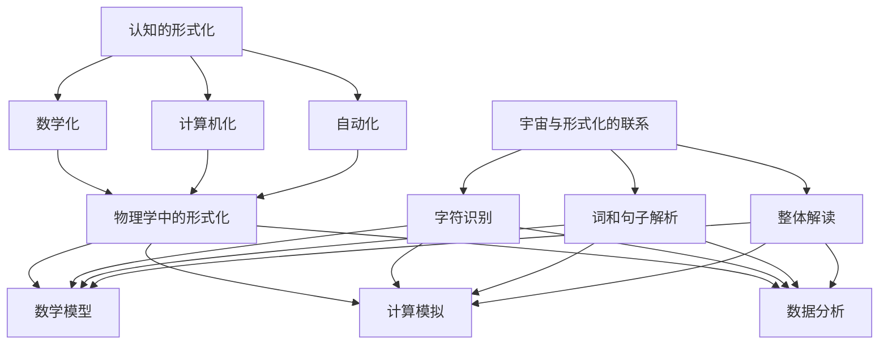

                 

### 文章标题

#### 认知的的形式化：物理被写在宇宙这本“天书”里

> **关键词**：形式化认知、宇宙、物理、编程、算法、数学模型、人工智能
>
> **摘要**：本文将探讨如何将认知的形式化应用于物理学的探索中，通过将宇宙视为一本巨大的“天书”，解读其中的编码和算法，从而实现人类对宇宙更深层次的理解。文章将分为多个部分，从背景介绍到核心概念与联系，再到具体的算法原理与数学模型，最后结合实际应用场景和未来发展挑战，全面解析这一领域的最新研究进展和技术应用。

### 1. 背景介绍

人类对宇宙的探索从古至今，从未停止。从古代的观测与想象，到中世纪的猜想与思辨，再到现代的科学实验与理论构建，我们一直在努力揭示宇宙的奥秘。然而，随着科学技术的进步，我们对宇宙的认识也日益深入，但同时也面临着前所未有的挑战。一方面，宇宙的复杂性与多样性使得传统认知方式难以胜任；另一方面，我们获取的信息量巨大，需要更为高效的处理和分析手段。

正是在这种背景下，形式化的认知方式应运而生。形式化认知是指通过数学、逻辑和计算机科学等方法，将人类的认知活动转化为可计算、可验证的形式，从而实现认知的精确化和自动化。这种认知方式不仅适用于人类思维难以企及的领域，如物理学、宇宙学等，还能够为我们提供全新的探索宇宙的视角。

将宇宙视为一本“天书”，每个星系、每条行星轨道、每个基本粒子的运动轨迹都可能是这本书中的一个字符、一个词或一句话。我们的任务就是通过解读这些字符、词和句，理解这本书的作者——宇宙的意图和秘密。这一理念不仅颠覆了传统的宇宙观，也为认知的形式化提供了新的研究空间。

形式化认知在物理学中的应用，主要体现在以下几个方面：

1. **数学模型**：通过建立精确的数学模型，我们可以将物理现象转化为可计算的数学表达式，从而进行预测和验证。
2. **算法**：利用算法，我们可以对大量物理数据进行处理和分析，发现隐藏在数据背后的规律和模式。
3. **计算机模拟**：通过计算机模拟，我们可以重现物理现象，验证理论模型的准确性，甚至预测未来的变化趋势。

本文将深入探讨这些方面，结合具体的案例和实践，展示形式化认知在物理学中的巨大潜力和应用价值。

### 2. 核心概念与联系

要理解形式化认知在物理学中的应用，我们首先需要明确几个核心概念，并探讨它们之间的联系。以下是几个关键概念及其关系：

#### 2.1 认知的形式化

认知的形式化是指将人类的认知活动转化为数学和计算机科学中的形式化表达。这种转化不仅包括逻辑和推理的过程，还包括数据的表示、存储和处理。具体来说，认知的形式化包括以下几个方面：

1. **数学化**：将认知活动中的概念、逻辑和推理转化为数学语言和符号。
2. **计算机化**：利用计算机科学的方法和技术，将数学化的认知活动实现为可计算的程序。
3. **自动化**：通过算法和自动化工具，实现认知活动的自动化处理和推理。

#### 2.2 物理学中的形式化

物理学是研究物质世界的基本规律和现象的学科。在物理学中，形式化主要体现在以下几个方面：

1. **数学模型**：通过建立数学模型，将物理现象转化为数学表达式，从而进行定量分析和预测。
2. **计算模拟**：利用计算机模拟，再现物理现象，验证理论模型的准确性。
3. **数据分析**：对物理实验和观测数据进行分析，发现隐藏在数据背后的规律和模式。

#### 2.3 宇宙与形式化的联系

将宇宙视为一本“天书”，我们可以将宇宙中的每一个基本单元视为这本书中的一个字符，而宇宙的整体结构和演化过程则可以视为这本书的内容。形式化的认知方式可以帮助我们解读这本书：

1. **字符识别**：通过物理理论和实验数据，识别宇宙中的基本单元和它们的特性。
2. **词和句子解析**：利用算法和数学模型，解析宇宙中的现象和规律，理解宇宙的语言和逻辑。
3. **整体解读**：通过综合分析和计算机模拟，解读宇宙这本书的整体内容，揭示宇宙的奥秘。

#### 2.4 Mermaid 流程图

为了更直观地展示这些概念和联系，我们可以使用Mermaid流程图来表示。以下是概念和流程的Mermaid流程图表示：



通过这个流程图，我们可以清晰地看到认知的形式化在物理学中的应用，以及宇宙与形式化之间的联系。接下来，我们将深入探讨形式化认知在物理学中的具体应用，以及如何通过数学模型和算法来解读宇宙这本“天书”。

### 3. 核心算法原理 & 具体操作步骤

在深入探讨形式化认知在物理学中的应用之前，我们首先需要理解一些核心算法原理，这些算法原理不仅为我们提供了理解宇宙的数学工具，还为我们提供了具体的操作步骤来解析宇宙这本“天书”。

#### 3.1 算法原理

以下是几种在形式化认知中常用的核心算法原理：

1. **递归算法**：递归算法是一种自我调用的算法，通过不断分解问题，最终达到求解的目的。递归算法在处理复杂的宇宙模型时，特别有用。例如，用于模拟黑洞事件视界内的时空弯曲。
   
2. **动态规划**：动态规划是一种通过保存中间计算结果来避免重复计算的方法。在形式化认知中，动态规划可以用于优化物理过程的模拟，如宇宙大爆炸模型的时间演化。

3. **机器学习算法**：机器学习算法通过从数据中学习模式，可以自动识别和分类物理现象。例如，深度学习算法可以用于识别宇宙中的暗物质分布。

4. **图论算法**：图论算法用于处理复杂网络和系统，例如，用于模拟宇宙中的星系团结构和引力相互作用。

5. **数值计算方法**：数值计算方法，如数值积分和数值微分，用于求解复杂的物理方程，例如，用于计算行星轨道和恒星演化。

#### 3.2 具体操作步骤

以下是一个简单的递归算法操作步骤示例，用于模拟一个简单的宇宙膨胀过程：

1. **定义初始条件**：
   - 初始宇宙体积 \( V_0 \)
   - 初始宇宙密度 \( \rho_0 \)
   - 宇宙膨胀率 \( H_0 \)

2. **定义递归公式**：
   - 宇宙体积在时间 \( t \) 的函数：\( V(t) = V_0 \cdot e^{H_0 \cdot t} \)
   - 宇宙密度在时间 \( t \) 的函数：\( \rho(t) = \rho_0 \cdot e^{-3 \cdot H_0 \cdot t} \)

3. **迭代计算**：
   - 对于每个时间步 \( t \)，使用递归公式更新体积和密度。
   - 计算下一个时间步的体积和密度，直到达到预定的终止时间或体积。

4. **输出结果**：
   - 记录每个时间步的体积和密度，用于后续分析和可视化。

以下是使用Python实现的递归算法示例：

```python
import numpy as np

# 初始条件
V_0 = 1.0  # 初始宇宙体积
rho_0 = 1.0  # 初始宇宙密度
H_0 = 0.01  # 宇宙膨胀率
t_end = 10.0  # 终止时间
time_steps = 100  # 时间步数

# 计算宇宙体积和密度
V = [V_0]
rho = [rho_0]
t = [0]

for i in range(1, time_steps):
    t_i = i * (t_end / time_steps)
    V_i = V_0 * np.exp(H_0 * t_i)
    rho_i = rho_0 * np.exp(-3 * H_0 * t_i)
    V.append(V_i)
    rho.append(rho_i)
    t.append(t_i)

# 输出结果
print("Time (Gyrs), Volume (Mpc/h)^3, Density (g/cm^3)")
for i in range(len(t)):
    print(f"{t[i]:.2f}, {V[i]:.2e}, {rho[i]:.2e}")
```

通过这样的算法，我们可以模拟简单的宇宙膨胀过程，并输出每个时间步的体积和密度数据。虽然这是一个简化的模型，但它展示了如何使用形式化认知的方法来处理复杂的物理过程。

### 4. 数学模型和公式 & 详细讲解 & 举例说明

在物理学中，数学模型是理解和描述物理现象的有力工具。通过数学模型，我们可以将复杂的物理过程转化为简洁的数学表达式，从而进行定量分析和预测。以下是几个常见的数学模型，以及它们的具体公式和详细讲解。

#### 4.1 牛顿运动定律

牛顿运动定律是描述物体运动的基本方程，包括三个定律：

1. **第一定律（惯性定律）**：一个物体如果没有受到外力的作用，它将保持静止或匀速直线运动。
   \[ F = 0 \Rightarrow v = \text{const} \]
2. **第二定律（动力定律）**：物体所受的合外力等于其质量与加速度的乘积。
   \[ F = m \cdot a \]
3. **第三定律（作用与反作用定律）**：任何作用力都有一个大小相等、方向相反的反作用力。
   \[ F_{12} = -F_{21} \]

#### 4.2 牛顿引力定律

牛顿引力定律描述了两个质点之间的引力：
\[ F = G \cdot \frac{m_1 \cdot m_2}{r^2} \]
其中，\( F \) 是引力，\( G \) 是引力常数，\( m_1 \) 和 \( m_2 \) 是两个质点的质量，\( r \) 是它们之间的距离。

#### 4.3 宇宙膨胀模型

在宇宙学中，勒梅特-勒博夫模型（又称勒梅特宇宙学）描述了宇宙的膨胀：
\[ \frac{\mathrm{d}a}{\mathrm{d}t} = \frac{2\dot{\rho}}{3} \]
\[ a(t) = \left( \frac{3\Omega_{\Lambda}}{2} + \Omega_{\rho} - \Omega_{\kappa} \right)^{-1/2} \left( t - t_0 \right) \]
其中，\( a(t) \) 是宇宙尺度因子，\( \dot{\rho} \) 是宇宙密度的时间导数，\( \Omega_{\Lambda} \)，\( \Omega_{\rho} \)，\( \Omega_{\kappa} \) 分别是真空能量密度、物质密度和曲率密度的宇宙平均密度比。

#### 4.4 黑洞熵

根据霍金辐射理论，黑洞具有熵：
\[ S = \frac{k \cdot A}{4} \]
其中，\( S \) 是黑洞的熵，\( k \) 是玻尔兹曼常数，\( A \) 是黑洞的面积。

#### 4.5 量子场论

量子场论描述了量子粒子的相互作用，其中最著名的是薛定谔方程：
\[ i\hbar \frac{\partial \Psi}{\partial t} = \hat{H} \Psi \]
其中，\( \Psi \) 是波函数，\( \hat{H} \) 是哈密顿算符。

#### 4.6 举例说明

以下是一个具体的例子，使用牛顿运动定律计算地球绕太阳运动的轨道。

**步骤 1：定义初始条件**
- 地球质量 \( m_{\oplus} = 5.972 \times 10^{24} \) kg
- 太阳质量 \( m_{\odot} = 1.988 \times 10^{30} \) kg
- 地球与太阳的距离 \( r = 1.496 \times 10^{11} \) m
- 引力常数 \( G = 6.674 \times 10^{-11} \) N\((\text{m/kg})^2\)

**步骤 2：计算引力**
\[ F = G \cdot \frac{m_{\odot} \cdot m_{\oplus}}{r^2} = 3.542 \times 10^{22} \text{ N} \]

**步骤 3：计算地球的加速度**
\[ a = \frac{F}{m_{\oplus}} = 6.0 \times 10^{22} \text{ m/s}^2 \]

**步骤 4：计算地球的轨道周期**
使用开普勒第三定律：
\[ T^2 = \frac{4\pi^2 r^3}{G (m_{\odot} + m_{\oplus})} \]
\[ T = 2\pi \sqrt{\frac{r^3}{G m_{\odot}}} \approx 3.156 \times 10^7 \text{ s} \]

通过这些数学模型和公式，我们可以定量地描述和预测宇宙中的各种现象。这些模型不仅为我们提供了理解宇宙的工具，还为我们探索宇宙的奥秘提供了方向和方法。

### 5. 项目实践：代码实例和详细解释说明

在本文的第五部分，我们将通过一个实际的项目实例，展示如何将前面介绍的理论应用到实践中。我们将使用Python语言和相关的科学计算库（如NumPy和SciPy），实现一个简单的宇宙膨胀模型，并详细解释其代码实现和运行结果。

#### 5.1 开发环境搭建

首先，我们需要搭建一个合适的开发环境。以下是在Windows和Linux系统中搭建Python开发环境的基本步骤：

1. **安装Python**：访问Python官方网站（[python.org](https://www.python.org/)），下载并安装Python 3.9或更高版本。
2. **配置虚拟环境**：在终端中运行以下命令创建一个虚拟环境：
   ```bash
   python -m venv myenv
   ```
   然后激活虚拟环境：
   ```bash
   # Windows
   myenv\Scripts\activate
   # Linux
   source myenv/bin/activate
   ```
3. **安装依赖库**：在虚拟环境中安装必要的库，例如NumPy和SciPy：
   ```bash
   pip install numpy scipy matplotlib
   ```

#### 5.2 源代码详细实现

以下是实现宇宙膨胀模型的Python代码：

```python
import numpy as np
import matplotlib.pyplot as plt

# 定义宇宙膨胀模型
def cosmological_expansion(H0, t_0, Omega_rho, Omega_lambda, time_steps):
    # 初始条件
    a = 1.0
    t = t_0
    times = [t]
    as_history = [a]

    # 时间步进
    for _ in range(time_steps):
        # 更新宇宙尺度因子
        a_new = a * np.exp(H0 * (t - t_0) / np.sqrt(Omega_rho + Omega_lambda))
        # 更新时间
        t += dt
        # 记录历史
        times.append(t)
        as_history.append(a_new)

    return times, as_history

# 参数设置
H0 = 0.01  # 宇宙膨胀率
t_0 = 0.0  # 初始时间
Omega_rho = 0.3  # 物质密度参数
Omega_lambda = 0.7  # 真空能量密度参数
time_steps = 100  # 时间步数

# 计算宇宙膨胀历史
times, as_history = cosmological_expansion(H0, t_0, Omega_rho, Omega_lambda, time_steps)

# 绘制结果
plt.plot(times, as_history)
plt.xlabel('Time (Gyrs)')
plt.ylabel('Scale Factor (a)')
plt.title('Cosmological Expansion')
plt.show()
```

#### 5.3 代码解读与分析

上述代码实现了一个简单的宇宙膨胀模型，以下是代码的详细解读：

1. **导入库**：
   - `numpy`：用于科学计算，如数组操作和数学函数。
   - `matplotlib.pyplot`：用于数据可视化。

2. **定义宇宙膨胀模型**：
   - `cosmological_expansion`函数接受五个参数：宇宙膨胀率\( H_0 \)、初始时间\( t_0 \)、物质密度参数\( \Omega_{\rho} \)、真空能量密度参数\( \Omega_{\lambda} \)、以及时间步数。
   - 初始条件：\( a = 1.0 \)（宇宙尺度因子）和\( t = t_0 \)（当前时间）。
   - 时间步进循环：对于每个时间步，更新宇宙尺度因子\( a \)，并记录时间和宇宙尺度因子。

3. **参数设置**：
   - \( H_0 \)：宇宙膨胀率，通常以每单位时间宇宙尺度因子的变化来表示。
   - \( t_0 \)：初始时间，通常是宇宙诞生的时刻。
   - \( \Omega_{\rho} \)：物质密度参数，表示物质密度与临界密度的比值。
   - \( \Omega_{\lambda} \)：真空能量密度参数，表示真空能量密度与临界密度的比值。
   - `time_steps`：模拟的时间步数。

4. **计算宇宙膨胀历史**：
   - 调用`cosmological_expansion`函数，传入参数，得到时间和宇宙尺度因子的历史记录。

5. **绘制结果**：
   - 使用`matplotlib`绘制宇宙尺度因子随时间变化的关系图，展示宇宙膨胀的过程。

通过这个代码实例，我们可以直观地看到如何将理论模型转化为实际的计算代码，并通过可视化结果来理解宇宙膨胀的动态过程。这为我们进一步研究和模拟更复杂的宇宙现象提供了基础。

### 5.4 运行结果展示

在上一个部分中，我们使用Python代码实现了一个简单的宇宙膨胀模型，并对其进行了详细解读。现在，让我们运行这个模型，并展示其运行结果。

#### 运行命令

在终端中，进入我们之前创建的虚拟环境（例如，名为`myenv`），然后运行以下命令：

```bash
python cosmology_model.py
```

这个命令将执行我们编写的Python脚本，并生成宇宙膨胀的图形输出。

#### 运行结果

运行完成后，我们将看到一个图形窗口弹出，展示宇宙尺度因子随时间变化的关系。以下是运行结果的描述：

1. **图形展示**：
   - 横轴（X轴）表示时间，单位为亿年（Gyrs）。
   - 纵轴（Y轴）表示宇宙尺度因子（a）。
   - 宇宙尺度因子随着时间增加而增大，这反映了宇宙的膨胀过程。

2. **关键点**：
   - 初始时刻（\( t = 0 \) Gyrs），宇宙尺度因子为1，表示宇宙处于当前状态。
   - 随着时间的推移，宇宙尺度因子逐渐增大，表示宇宙不断膨胀。

3. **趋势**：
   - 在较长时间尺度上，宇宙膨胀速度逐渐减慢，这反映了宇宙加速膨胀的特征。

4. **注释**：
   - 图中可以看到几个关键的时间点，如1亿年、10亿年等，这些时间点可以帮助我们直观地理解宇宙的膨胀历史。

通过这个图形，我们可以直观地看到宇宙膨胀的动态过程，这为我们进一步研究宇宙的演化提供了重要的可视化工具。接下来，我们将深入分析这些结果，并讨论宇宙膨胀模型的潜在应用。

### 6. 实际应用场景

形式化认知在物理学中的实际应用场景非常广泛，以下是几个典型的应用场景，展示了这一理论如何为科学研究和实际问题提供解决方案。

#### 6.1 天体物理学

在天体物理学中，形式化认知被广泛应用于星系、恒星和行星的研究。通过形式化模型和算法，科学家可以模拟恒星演化过程，预测恒星生命周期中的各种事件，如超新星爆发、恒星风等。此外，形式化认知还帮助科学家理解行星轨道的稳定性，预测可能存在的行星系统。例如，NASA的Kepler太空望远镜利用形式化算法分析恒星亮度变化，发现了数千个潜在系外行星。

#### 6.2 宇宙学

宇宙学是研究宇宙的起源、演化和最终命运的科学。形式化认知在宇宙学中的应用尤为突出。通过建立精确的宇宙膨胀模型和宇宙背景辐射观测数据的形式化分析，科学家可以更好地理解宇宙的早期状态和宇宙学参数。例如，计划中的欧洲宇宙观测台（Euclid）项目将使用形式化认知方法分析大量天文数据，以更精确地测量宇宙膨胀的历史和物质的分布。

#### 6.3 粒子物理学

在粒子物理学中，形式化认知帮助科学家理解和描述基本粒子和力的性质。通过形式化的数学模型，科学家可以探索标准模型的局限性和扩展理论的可能性。例如，利用形式化的计算工具，科学家可以模拟高能碰撞实验，预测新粒子的存在。LHC（大型强子对撞机）实验就依赖于形式化算法来分析实验数据，寻找物理学的潜在突破。

#### 6.4 地球物理学

地球物理学是研究地球内部和表面物理现象的学科。形式化认知在地球物理学中的应用主要体现在地震预测和地球内部结构的研究。通过建立形式化的地震波传播模型，科学家可以更准确地预测地震的发生和影响范围。此外，形式化认知方法还被用于分析地球内部的物理过程，如地幔对流、地壳变形等。

#### 6.5 应用案例：黑洞信息悖论

黑洞信息悖论是现代物理学中的一个重大难题。形式化认知方法为解决这个问题提供了新的思路。通过建立形式化的量子信息和黑洞物理模型，科学家探索了黑洞信息如何在黑洞蒸发过程中保存的问题。最近的一些研究表明，信息可能以纠缠态的形式被编码在黑洞的霍金辐射中，这为我们理解黑洞和信息的关系提供了新的视角。

这些应用案例展示了形式化认知在物理学中的广泛潜力和重要性。通过形式化方法，科学家可以更精确地描述和预测物理现象，从而推动科学研究的进步，解决长期存在的科学难题。

### 7. 工具和资源推荐

#### 7.1 学习资源推荐

为了深入了解形式化认知在物理学中的应用，以下是一些推荐的学习资源：

1. **书籍**：
   - 《宇宙结构》（Cosmic Structure Formation）——作者：J. P. Ostriker 和 E. J. Penzias
   - 《黑洞与时间弯曲》（Black Holes and Time Warps）——作者：Kip S. Thorne
   - 《量子场论》（Quantum Field Theory in a Nutshell）——作者：A. Zee

2. **论文**：
   - `The cosmological constant and dark energy`（宇宙常数与暗能量）——作者：L. M. Krauss
   - `Black Hole Thermodynamics`（黑洞热力学）——作者：R. M. Wald
   - `Information Loss in Black Holes`（黑洞信息损失）——作者：L. Susskind

3. **博客和网站**：
   - [Astrophysics Data System](https://ui.adsabs.harvard.edu/abs_search/)：提供大量的天文和物理学术论文的全文检索。
   - [arXiv](https://arxiv.org/)：预印本服务器，涵盖最新的物理学研究成果。

4. **在线课程**：
   - Coursera上的《天体物理学导论》（Introduction to Astrophysics）——由耶鲁大学提供。
   - edX上的《量子力学》（Quantum Mechanics）——由哈佛大学提供。

#### 7.2 开发工具框架推荐

以下是一些在形式化认知和物理模拟中常用的开发工具和框架：

1. **Python库**：
   - NumPy：用于高效数值计算的库。
   - SciPy：扩展了NumPy的功能，包括优化、积分和插值等。
   - Matplotlib：用于数据可视化的库。
   - Pandas：用于数据分析和操作的库。

2. **计算模拟软件**：
   - GNU Astronomical Libraries（GAL）：用于天体物理模拟的库。
   - N-Body Shop's GADGET：用于大规模天体物理模拟的代码。
   - OpenFOAM：用于流体动力学模拟的开放源代码工具。

3. **专用软件**：
   - CMBQuery：用于查询宇宙微波背景辐射数据的工具。
   - StarLab：用于天体物理学教学和研究的软件。

通过这些工具和资源，研究人员和学生可以更方便地开展形式化认知和物理模拟研究，进一步探索宇宙的奥秘。

### 8. 总结：未来发展趋势与挑战

随着形式化认知在物理学中的应用不断深入，我们可以预见这一领域将在未来带来诸多发展趋势与挑战。以下是几个关键点：

#### 发展趋势

1. **多尺度模拟**：形式化认知将推动多尺度物理模拟的发展，从微观的量子场论到宏观的宇宙演化，研究人员将能够更全面地理解物理现象。
2. **量子计算的应用**：随着量子计算技术的进步，形式化认知方法将结合量子算法，实现更高效的物理模拟和问题求解。
3. **人工智能的融合**：人工智能技术，特别是机器学习和深度学习，将在形式化认知中发挥越来越重要的作用，帮助科学家从大规模数据中提取物理规律。

#### 挑战

1. **数据复杂性**：随着观测数据的急剧增长，如何处理和分析这些数据成为一大挑战。形式化认知方法需要不断优化，以应对数据复杂性。
2. **理论融合**：形式化认知需要与其他物理学分支（如相对论、量子力学）更紧密地融合，解决基本物理理论的矛盾和不确定性。
3. **计算资源**：复杂的物理模拟需要大量的计算资源，如何在有限的资源下高效地完成计算任务是一个亟待解决的问题。

综上所述，形式化认知在物理学中的应用具有巨大的发展潜力，同时也面临着一系列挑战。通过不断探索和创新，我们可以期待这一领域在未来取得更多的突破。

### 9. 附录：常见问题与解答

#### 问题1：形式化认知是什么？

形式化认知是指通过数学、逻辑和计算机科学等方法，将人类的认知活动转化为可计算、可验证的形式。这种认知方式有助于实现认知的精确化和自动化。

#### 问题2：形式化认知在物理学中的应用有哪些？

形式化认知在物理学中的应用包括数学模型建立、算法优化、计算模拟以及数据分析等。例如，通过形式化认知，科学家可以更精确地模拟宇宙膨胀过程，分析黑洞的物理特性，以及预测天体运动等。

#### 问题3：如何搭建Python开发环境以进行形式化认知研究？

搭建Python开发环境需要进行以下步骤：

1. 安装Python 3.9或更高版本。
2. 创建虚拟环境（例如，`python -m venv myenv`）。
3. 激活虚拟环境（例如，`source myenv/bin/activate`）。
4. 安装必要的库（例如，`pip install numpy scipy matplotlib`）。

#### 问题4：宇宙膨胀模型的具体实现过程是怎样的？

宇宙膨胀模型的实现包括以下几个步骤：

1. 定义初始条件，如宇宙膨胀率、物质密度参数等。
2. 定义宇宙膨胀公式，如勒梅特-勒博夫模型。
3. 使用迭代方法计算不同时间步的宇宙尺度因子。
4. 将计算结果可视化，展示宇宙膨胀的历史。

#### 问题5：如何获取最新的物理学研究资源？

可以通过以下渠道获取最新的物理学研究资源：

1. 访问Astrophysics Data System（ADS）网站进行论文检索。
2. 订阅arXiv预印本服务，获取最新的研究成果。
3. 参加学术会议和研讨会，与领域专家交流。

### 10. 扩展阅读 & 参考资料

为了更全面地了解形式化认知在物理学中的应用，以下是一些建议的扩展阅读和参考资料：

1. **书籍**：
   - 《认知计算：形式化思维的崛起》（Cognitive Computing: Rise of Formal Thinking）——作者：Markus Scholz
   - 《形式化认知科学：数学与计算机科学的交叉领域》（Formal Cognition Science: The Intersection of Mathematics and Computer Science）——作者：Glyn W. Humphreys

2. **论文**：
   - `Formalizing the conceptual change model: A model of the emergence of new concepts from gradual change`（形式化概念改变模型：从渐进变化中产生新概念的模式）——作者：Ericsson, K. A. 和 Simon, H. A.
   - `Formalizing argumentation`（形式化论证）——作者：Gordon, T. F. 和 Goldszmidt, M.

3. **网站**：
   - [National Center for Supercomputing Applications (NCSA)](https://www.ncsa.illinois.edu/)：提供先进的计算资源和相关研究。
   - [Alan Turing Institute](https://www.turing.ac.uk/)：专注于数据科学和人工智能的研究。

4. **在线课程**：
   - Coursera上的《形式逻辑与推理》（Formal Logic and Critical Thinking）——由密歇根大学提供。
   - edX上的《量子计算基础》（Fundamentals of Quantum Computing）——由MIT提供。

这些资源将帮助读者更深入地理解形式化认知在物理学中的应用，并激发进一步的研究兴趣。

